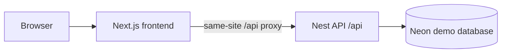

# Vercel demonstration deployment

The public demonstration frontend is [sis-moodle.vercel.app](https://sis-moodle.vercel.app). It is a fictional review environment for the implemented Phase 0, Phase 1, and Phase 2 applicant slices. It is not an institutional applicant service and must never receive real applicant, identity, academic, or document data.

## What is configured

| Part | Vercel project | Role |
|---|---|---|
| Frontend | `sis-moodle` | Next.js pages and same-site API proxy |
| API | `sis-moodle-api` | One NestJS serverless function |
| Database | `sis-moodle-demo-db` | Neon PostgreSQL with fictional migrations and seed data |

Both projects belong to the `charles-chitundu` team. The frontend has the server-only `API_INTERNAL_URL=https://sis-moodle-api.vercel.app/api` configuration for Preview and Production. It is deliberately not a `NEXT_PUBLIC_*` value.



The browser calls the frontend's same-site proxy. Server-rendered pages and that proxy use `API_INTERNAL_URL` to reach Nest. Session cookies stay on the frontend domain, and neither a database URL nor an API credential is sent to the browser.

## API deployment behavior

Vercel recognizes `apps/api/src/main.ts` as the Nest entry point. It now exports a cached request handler for the Vercel function and keeps the usual listener for local `npm run dev:api`. In Vercel it uses the `/api` route prefix, while local development retains routes such as `http://localhost:3001/health`.

The API starts before it opens a PostgreSQL connection. Prisma connects when a database-backed route needs it, rather than blocking `/api/health`. Configuration is loaded on demand. The in-process expiry scheduler is deliberately disabled in Vercel because a serverless function is not continuously running; a separately authorized, authenticated Vercel Cron route or worker is required before expiry automation can be claimed in this hosting environment.

## Build settings

| Setting | Frontend | API |
|---|---|---|
| Root directory | `development/apps/web` | `development/apps/api` |
| Node.js | `24.x` | `24.x` |
| Install command | `cd ../.. && npm ci --ignore-scripts` | `cd ../.. && npm ci` |
| Build command | `cd ../.. && npm run build --workspace=@sis/config && npm run build --workspace=apps/web` | Vercel NestJS automatic build |

Vercel's NestJS preset has no custom build command or output directory. The frontend needs its custom build command because it imports a shared workspace package.

## Deploy and verify after a push

GitHub automatic deployments are connected to `venmor/SIS-INTEGRATED-WITH-MOODLE`. After the next push to `main`, wait for both `sis-moodle` and `sis-moodle-api` deployments to finish, then run:

```sh
curl --fail https://sis-moodle-api.vercel.app/api/health
curl --fail 'https://sis-moodle.vercel.app/api/catalogue/programmes?take=3'
```

The first command must return the API health JSON. The second must return fictional programme data through the frontend proxy. Then open [Discover programmes](https://sis-moodle.vercel.app/discover) and confirm that the seeded catalogue appears. A failed check means the demonstration is unavailable; it does not justify entering real data or marking a phase gate complete.

For a manual deployment, first link the repository root to the intended Vercel project. Local `.vercel/` metadata and environment files are ignored by Git, and `.vercelignore` excludes local review worktrees from uploads.

## Remaining boundaries

The seeded database contains only fictional accounts, programmes, and application data. Public registration, verified communications, MFA, real document scanning/storage, institutional policy approvals, production expiry execution, delivery workers, accessibility review, and human phase acceptance remain open in [GAP-015](../gaps/GAP-015-applicant-production-and-prior-phase-gates.md) and the existing Phase 1/2 review records.
