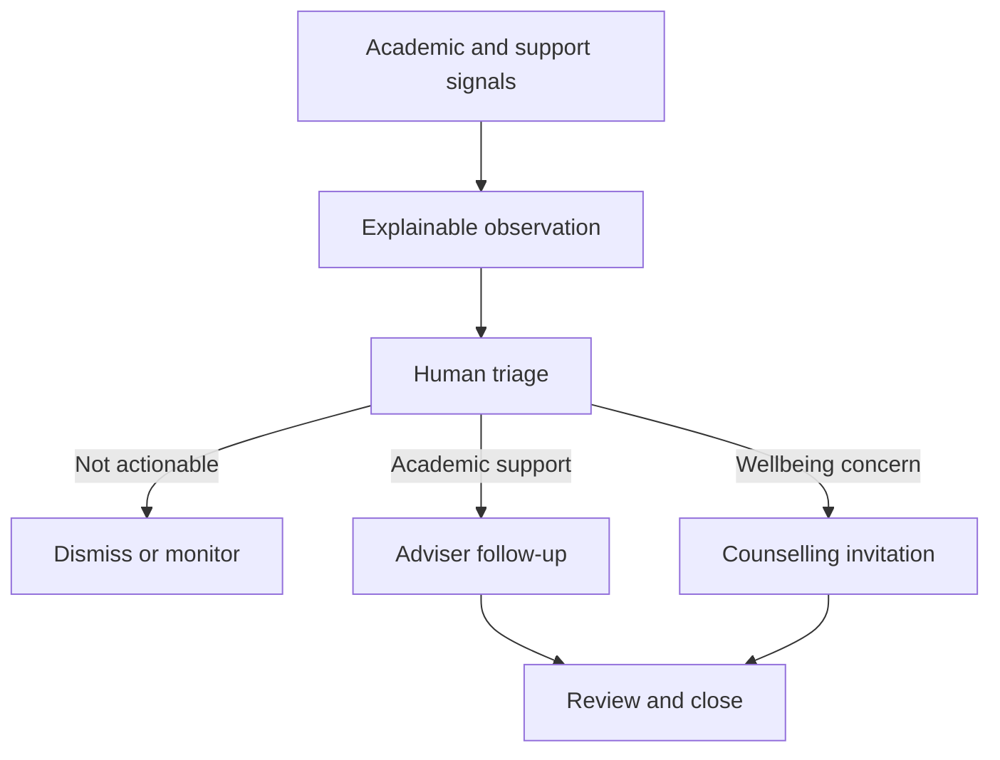

## Addition to Section 12A — Role and workspace assignment

> Controlling content recovered from the approved design chat; approval prompts are omitted in this reading copy.

A user account represents the person. It does not determine the interface by itself.

For example:

| Account | Role | Scope | Resulting experience |
|---|---|---|---|
| Dr. Banda | Dean | School of Engineering | Dean’s oversight and decision workspace |
| Dr. Banda | Lecturer | Department of Computer Science | Teaching workspace |
| Dr. Banda | Supervisor | Assigned postgraduate students | Research-supervision workspace |

The header must always display the active context:

> **Dean workspace · School of Engineering · 2026 Academic Year**

Changing workspace must be deliberate. Elevated dean powers must not silently appear while the person is operating as a lecturer.

Role assignments also require:

- Effective start and end dates
- Acting or delegated appointments
- Organizational scope
- Approved capabilities
- Delegation limits
- Audit history

# Dean experience

We need to distinguish at least two different dean roles.

## 1. Dean of a School or Faculty

The School Dean is responsible for academic governance and institutional oversight within a particular school.

The Dean is not an academic adviser with more students. The difference is:

- The adviser works directly with assigned students.
- The Head of Department coordinates a department.
- The Dean oversees the school, handles escalations and makes authorized decisions.
- The Dean should normally begin with patterns and exceptions, not confidential individual-case details.

### Dean home page

The Dean’s home page will be organized into six areas.

#### A. Decisions requiring attention

This is the first section because it requires the Dean’s personal action.

Examples might include:

- Academic exceptions referred to the Dean
- Progression recommendations
- Appeal recommendations
- Late-registration exceptions
- Programme or department submissions
- Examination irregularities requiring school-level action
- Postgraduate milestones escalated to the school
- Decisions returned for clarification

The exact authority will follow approved university regulations. Developers must not assume that the Dean can approve every academic action.

Every decision card shows:

- Matter requiring a decision
- Student, cohort or programme affected
- Referring office
- Policy or rule involved
- Supporting evidence
- Submission date
- Decision deadline
- Previous recommendations
- Available actions

Available actions should be explicit:

- `Approve`
- `Decline`
- `Return for clarification`
- `Refer to another authority`
- `Delegate review`

The Dean cannot directly alter the underlying evidence while making the decision.

#### B. School academic health

The Dean sees school-level indicators such as:

- Registration completion
- Course enrolment irregularities
- Missing or late grade submissions
- Progression outcomes
- Pass and failure patterns
- Courses with unusual withdrawal rates
- Programme-review deadlines
- Accreditation and quality-assurance actions
- Postgraduate milestone delays
- Moodle synchronization coverage

Every indicator shows its definition, date range, source and last refresh time.

An unusual course failure rate should be presented as:

> CSC 4792 has a 42% failure rate, compared with 18% in its previous offering. Results include 118 students and were last refreshed on 16 August 2026.

It should not merely display a red chart without explanation.

#### C. Student-success overview

The Dean sees:

- Students awaiting academic outreach
- Overdue adviser follow-ups
- Departments with unassigned advisees
- Repeated registration difficulties
- Cohorts with significant engagement decline
- Number of support referrals offered
- Number of unresolved academic interventions

The Dean normally sees aggregates first.

Individual names appear only when:

- The case has been formally escalated to the Dean
- The Dean is the assigned decision-maker
- A policy requires school-level involvement
- The Dean opens a permitted list for a valid academic purpose

The Dean does not see counselling-session notes.

#### D. Department and programme overview

The Dean can move from:

> School → Department → Programme → Cohort → permitted individual case

The dashboard should show which departments have:

- Overdue academic actions
- Unresolved course problems
- Advising workload imbalances
- Programme-review deadlines
- Missing grade submissions
- Repeated student-support concerns

The Dean can assign an institutional action to the Head of Department without personally taking over every case.

#### E. Delegation and follow-up

The Dean can delegate permitted work to:

- Deputy Dean
- Assistant Dean
- Head of Department
- Programme coordinator
- School administrator

A delegated task must show its scope, deadline and whether the delegate may make the final decision or only provide a recommendation.

Delegation must expire automatically and remain auditable.

#### F. Calendar and institutional deadlines

The Dean sees:

- Examination-board meetings
- Senate submission deadlines
- Programme-review deadlines
- Academic-calendar events
- Graduation-clearance milestones
- School committee meetings
- Pending decisions approaching their deadlines

## 2. Dean of Students

The Dean of Students is a different role and needs a different workspace.

At UNZA, Student Affairs covers areas such as student governance, welfare, discipline, accommodation, orientation and counselling coordination. The Counselling Centre provides professional and confidential services. [UNZA Student Affairs structure](https://unza.zm/dosa/about), [UNZA Dean of Student Affairs](https://www.unza.zm/dean-of-student-affairs)

The Dean of Students workspace therefore concentrates on:

- Student-welfare service demand
- Counselling Centre capacity and waiting time
- Accommodation and residence concerns
- Orientation and student engagement
- Student-governance matters
- Welfare escalations
- Disciplinary workflows
- Campus-level support patterns
- Overdue support cases
- Service policy and resource needs

The Dean of Students may see that a counselling referral is awaiting attention, but does not automatically see the counselling notes.

For example:

> 18 students are awaiting first contact from the Counselling Centre. Four have waited beyond the approved service period.

This supports management without exposing confidential discussions.

## Role boundaries for student support

| Role | May see | May do | Must not see or do |
|---|---|---|---|
| School Dean | School trends, academic escalations and overdue academic interventions | Assign action, request review and make authorized academic decisions | Browse counselling notes |
| Dean of Students | Institution-wide welfare operations and formally escalated welfare matters | Coordinate services, capacity and policy response | Routinely read private counselling-session content |
| Head of Department | Department and programme observations | Assign advisers and resolve department-level academic issues | View confidential wellbeing notes |
| Programme coordinator | Relevant cohort and programme concerns | Coordinate programme follow-up | Access unrelated student cases |
| Academic adviser | Assigned advisees and explainable academic observations | Contact, advise, create follow-up and offer referral | Diagnose mental-health conditions |
| Lecturer | Observations from courses they teach | Submit a concern or academic referral | Browse the student’s other support cases |
| Counsellor | Accepted referrals, self-referrals and necessary background | Triage, counsel and manage confidential follow-up | Access unrelated academic information without purpose |
| Student | Their own concerns, appointments and agreed actions | Request, accept, reschedule or decline ordinary support | See restricted staff or clinical notes |

# Design Section 12B — Proactive Student Observation and Follow-up

This is large enough to become its own design because it connects Moodle, academic records, advising, counselling, privacy and communications.

It must not be designed as an automatic “at-risk student” score.

## 12B.1 What creates an observation

Possible signals include:

- Registration remaining incomplete near a deadline
- Repeated class absence where reliable attendance exists
- No Moodle access after confirmed enrolment
- Several consecutive assessments without submission
- A significant decline from the student’s own previous academic pattern
- Repeated course failure
- An overdue research milestone
- An adviser or lecturer submitting a concern
- A student requesting help
- Repeated missed advising appointments
- Accommodation or financial difficulty reported through an approved channel

These are observations, not diagnoses.

Poor grades alone must never be interpreted as depression, misconduct or another personal condition. Financial difficulty must first lead to appropriate financial or welfare assistance—not automatic counselling or discipline.

Every observation rule must have:

- A name
- Purpose
- Data source
- Trigger condition
- Responsible owner
- Effective date
- Review date
- Permitted recipients
- Follow-up expectation
- Privacy classification

## 12B.2 Observation queue

Authorized users receive a Student Success queue.

A queue card could appear as:

> **Chanda M. — BSc Computer Science**  
> Academic participation observation  
> Three consecutive CSC 4792 assessments have no submission.  
> First detected: 12 August 2026  
> Last confirmed: 16 August 2026  
> No outreach recorded  
> Assigned adviser: M. Phiri  
>  
> `Review observation`

The card must not display an unexplained label such as `HIGH RISK`.

Priority should instead say:

> Follow-up recommended before the assessment deadline on 20 August.

Each card shows:

- What occurred
- Source system
- Courses or processes involved
- When it started
- When the data was last confirmed
- Whether the observation may be incomplete
- Existing follow-up
- Assigned staff member
- Recommended response time

## 12B.3 Observation review screen

Opening the observation presents five sections.

### A. Why this observation exists

This shows the exact triggering events.

For example:

- Assignment 1: submitted
- Assignment 2: no submission
- Assignment 3: no submission
- Assignment 4: no submission
- Moodle enrolment: confirmed
- Last Moodle activity: 31 July 2026

The adviser can understand the concern without relying on an unexplained algorithm.

### B. Relevant student context

Only relevant information is shown:

- Programme and year
- Current registration state
- Assigned adviser
- Relevant course enrolments
- Existing academic intervention
- Preferred contact method
- Accessibility or communication accommodation, if the adviser is permitted to know it

Counselling-session details do not appear.

### C. Previous outreach

The timeline shows:

- Who contacted the student
- Channel used
- Date and time
- Delivery status
- Student response
- Agreed next action
- Follow-up date

This prevents several offices from repeatedly sending the same message.

### D. Actions

Available actions include:

- `Contact student`
- `Assign adviser`
- `Create follow-up task`
- `Offer academic-support appointment`
- `Offer counselling referral`
- `Refer to financial-support service`
- `Monitor until a selected date`
- `Mark observation inaccurate`
- `Merge with an existing case`
- `Escalate under approved safety procedure`

### E. Confidentiality notice

The screen explicitly reminds the staff member:

> Record only information necessary for academic follow-up. Private counselling information belongs in the restricted Counselling workspace.

## 12B.4 Human triage

The system may create an observation automatically, but a human reviews it before it becomes a sensitive referral.

Triage decisions include:

### Monitor

Used when the signal is early or incomplete.

The reviewer selects:

- Review date
- Condition to recheck
- Responsible person

### Begin academic follow-up

Creates a task for the adviser with:

- Reason
- Due date
- Suggested contact method
- Relevant academic information
- Expected follow-up result

### Offer another support service

The adviser may offer:

- Academic skills support
- Financial guidance
- Disability support
- Accommodation support
- Counselling
- Career guidance
- Health-services contact

The adviser must not select counselling as a default response to every academic concern.

### Dismiss observation

A reason is required:

- Data inaccurate
- Expected situation
- Already resolved
- Duplicate observation
- Student no longer enrolled
- Not actionable
- Other approved reason

Dismissal remains auditable and may later be reviewed if the pattern continues.

## 12B.5 Student experience

The student should experience support, not surveillance.

Bad notification:

> You have been classified as a high-risk student.

Approved notification:

> We noticed that you may be having difficulty completing recent activities in CSC 4792. Your academic adviser is available to help you review your options.

Available actions:

- `Book an adviser appointment`
- `Ask to be contacted`
- `Request another type of support`
- `I do not need help right now`

Declining ordinary support does not create a disciplinary record.

Inside the portal, the student can see:

- Why the invitation was sent
- Who will receive their response
- Available support choices
- Appointment availability
- Any agreed academic actions
- Next follow-up date
- How to correct inaccurate information

Sensitive messages sent by SMS or email remain neutral and direct the student to sign in for details.

## 12B.6 Counselling referral experience

An academic observation does not automatically create a counselling case.

The sequence is:

1. An authorized staff member offers counselling support.
2. The student accepts, self-refers or responds according to approved safeguarding policy.
3. The Counselling Centre receives a referral containing only necessary context.
4. A counsellor accepts and triages it.
5. Confidential counselling records are created in a restricted area.
6. The referring office receives only an appropriate service status.

Possible status visible to the adviser:

- Referral offered
- Student accepted
- Counselling Centre received referral
- Appointment scheduled
- Support in progress
- Follow-up no longer required
- Student declined

The adviser must not see:

- Session notes
- Diagnosis
- Personal disclosures
- Clinical assessments
- Counselor-only risk documentation

Any safety exception follows an explicit institutional safeguarding policy and is audited.

## 12B.7 Follow-up lifecycle

Every active observation has:

- Owner
- Current status
- Next action
- Due date
- Contact history
- Escalation route
- Closure reason

Statuses will be specific:

- New observation
- Awaiting triage
- Monitoring
- Assigned for academic follow-up
- Student contacted
- Awaiting student response
- Appointment scheduled
- Referred to support service
- Follow-up in progress
- Resolved
- Closed without contact
- Dismissed as inaccurate

Cases cannot remain indefinitely as simply `Open`.

When follow-up becomes overdue:

1. The assigned staff member receives a reminder.
2. The supervisor sees it in their overdue queue.
3. Formal escalation occurs only according to the configured service rule.
4. The Dean sees individual details only if the case reaches an authorized dean-level escalation.

## 12B.8 Dean’s proactive-support view

### School Dean

The School Dean sees academic patterns such as:

- Number awaiting adviser contact
- Overdue academic follow-ups
- Departments with high observation volume
- Courses producing repeated participation concerns
- Adviser workload
- Intervention completion
- Academic outcomes after intervention

This enables structural action—for example, additional tutorials—rather than blaming individual students.

### Dean of Students

The Dean of Students sees:

- Counselling and welfare referral volumes
- Waiting times
- Overdue first contacts
- Support-service capacity
- Referral sources
- Campus and school patterns
- Appointment availability
- Aggregate closure outcomes
- Urgent operational escalations

Neither dean receives an unrestricted counselling-record search.

## 12B.9 Important microinteraction and error states

| Situation | UI behaviour |
|---|---|
| Observation already has an open case | Offer to merge; do not send duplicate outreach |
| Data is stale | Show last-confirmed time and prevent unsupported final decisions |
| Student has no verified contact method | Create a contact-update task; do not silently fail |
| Adviser is not assigned | Route to programme or department assignment queue |
| Message delivery fails | Preserve message, show failure reason and offer another approved channel |
| Student declines support | Record response respectfully; do not classify as misconduct |
| Appointment becomes unavailable | Preserve the referral and offer alternative times |
| Counselling capacity is full | Show next available option and the institution’s urgent-support route |
| Moodle data cannot be refreshed | Retain previous confirmed information and visibly mark it as stale |
| Observation is inaccurate | Allow correction and record why the rule produced a false signal |

## 12B.10 Acceptance requirements

This feature is accepted only when:

- Every observation explains why it exists
- Source and data freshness are visible
- No observation automatically becomes a mental-health diagnosis
- A human reviews sensitive referrals
- Students receive supportive, non-accusatory language
- Students can respond or correct inaccurate information
- Academic and counselling records remain separated
- Dean, adviser and counsellor views expose different information
- Duplicate outreach is prevented
- Every follow-up has an owner and deadline
- Overdue cases escalate through configured policy
- Counselling notes remain confidential
- The effectiveness and fairness of observation rules can be reviewed

This should be added as a required **Section 12B**, while the Dean-specific experience becomes part of Section 12A. The next useful design pass is the complete screen-by-screen applicant, student, adviser, dean and counsellor experience so every navigation step and interaction is explicit.
