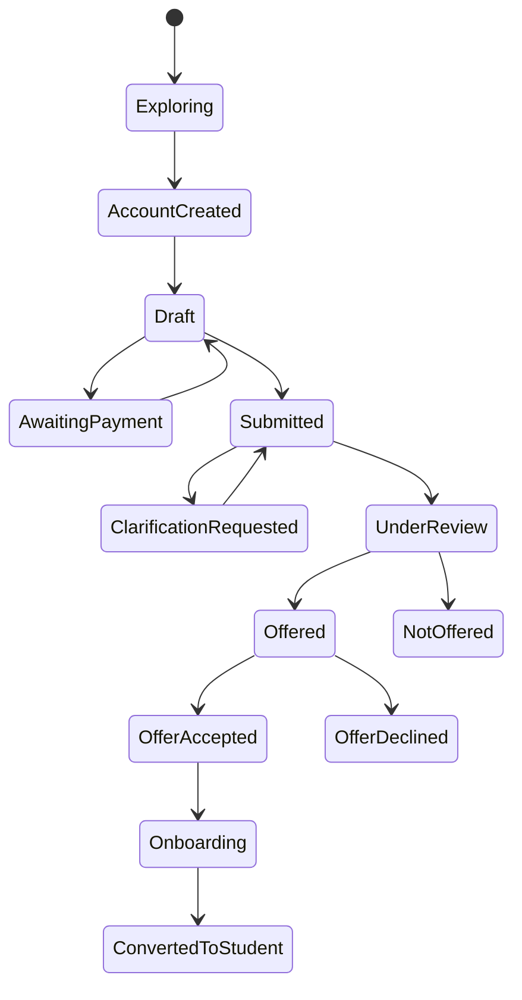

# Role Blueprint 1 — Prospective Applicant and Applicant Journey Book

This book combines all ten recovered parts in approved order: discovery, account security, application drafts, forms, documents, payment, formal submission, status/clarification, offer acceptance and conversion to student.

## Recovered part 1

_Source record: `002-role-blueprint-1-prospective-applicant-and-applicant.md`_

## Role Blueprint 1 — Prospective Applicant and Applicant  
### Part 1: Role, scope and application lifecycle

This blueprint covers a person from first exploring programmes through application submission, a decision, offer acceptance and handover into student onboarding.

It does not yet cover enrolled-student actions such as registration, results or finance clearance. Those belong to the Student Blueprint.

---

### 1. Role definitions

#### 1.1 Prospective applicant

A prospective applicant is a visitor who has not created an account or started an application.

Their purpose is to understand:

- Available programmes and intakes
- Entry requirements
- Fees and application deadlines
- Required supporting documents
- Whether they are likely eligible
- How to begin an application

They may browse public information without authentication. They cannot submit, reserve a place, upload evidence, view another person’s application or receive a formal admission decision.

#### 1.2 Applicant

An applicant is a person with an authenticated account who has started, submitted, or received a decision on an application.

They may:

- Maintain their own profile and contact details
- Start or resume an application for a permitted intake
- Save drafts
- Submit evidence
- Pay an application fee where required
- Submit an application
- Respond to an authorized request for clarification
- View their own status history and decision
- Accept or decline an offer
- Begin onboarding after accepting an offer

They may not:

- Change submitted facts after the permitted correction deadline
- Edit a decision, eligibility outcome or staff-only notes
- See internal verification notes, staff recommendations, scoring rules or other applicants’ information
- Submit an application on behalf of another person, unless a separately designed authorized-agent process exists
- Create duplicate applications for the same programme/intake where policy prohibits it

#### 1.3 Applicant account is not a student account

The system must distinguish:

| Concept | Meaning |
|---|---|
| Person identity | The real person, retained across journeys |
| Applicant account | Login credentials and applicant-facing permissions |
| Application | A specific request for admission to a programme, intake and study mode |
| Admission offer | An authorized decision on an application |
| Student record | An official academic record created only after approved conversion/onboarding |

An application is not automatically a student record. An offer is not automatically registration. This prevents premature creation of academic records, billing obligations or Moodle access.

---

### 2. Applicant lifecycle

The system uses explicit states. It must never show a vague state such as only `Pending`.

Some steps are conditional. For example, `AwaitingPayment` appears only when an application fee applies, and `ClarificationRequested` appears only when an authorized officer requests more information.

#### 2.1 Applicant-facing status language

| System state | Applicant sees | Required explanation |
|---|---|---|
| Draft | Application not submitted | What remains incomplete and the deadline |
| Awaiting payment | Payment required before submission | Amount, reference, due date and payment instructions |
| Submitted | Received; initial checks may follow | Submission time, reference number and next expected stage |
| Clarification requested | More information needed | Exact item requested, why it is needed, who can see it and response deadline |
| Under review | Application is being assessed | Review stage, last update, whether applicant action is needed and expected decision period where defined |
| Offered | Admission offer available | Programme, conditions, acceptance deadline and next actions |
| Not offered | Admission decision available | Decision explanation allowed by policy, support/contact route and permitted next options |
| Offer accepted | Offer accepted; onboarding required | Remaining onboarding tasks and deadline |
| Onboarding | Preparing student record | Completed and remaining onboarding actions |
| Converted to student | Onboarding completed | Student number, first registration task and student-portal entry point |

Internal staff states may be more detailed, but public wording must be clear, accurate and non-technical.

---

### 3. Experience context and workspace

#### 3.1 Public experience

The public area provides a calm, searchable admissions space with these primary navigation items:

- Find a programme
- Entry requirements
- Intakes and deadlines
- Fees and funding information
- How to apply
- Help and contact
- Sign in / Create account

The public area must not force account creation merely to read requirements.

#### 3.2 Applicant workspace

After sign-in, the applicant sees:

- Home
- My applications
- My tasks
- Payments
- Notifications
- Help and support
- Profile and security

The header always shows:

> Applicant portal · [Selected intake] · [Last saved / connection state]

If an applicant has multiple applications that policy allows, the selected application is visibly named in the header and page title. Actions must never silently affect a different application.

#### 3.3 Applicant home page

The applicant home page answers:

1. What should I do next?
2. What deadline matters most?
3. What has changed in my application?
4. Where can I continue safely?

It contains, in priority order:

- **Required action card** — for example, “Upload certified ECZ result statement”
- **Application progress** — current stage and completed steps
- **Deadline panel** — application, payment, clarification or offer deadlines
- **Application status timeline** — clear history with dates and times
- **Payment status** — only where payment applies
- **Help route** — relevant office, ticket history and reference number
- **Notifications** — decisions, requests and delivery outcomes

Decorative dashboards, institution-wide statistics and unrelated news must not displace an applicant’s required actions.

---

### 4. Identity, access and scope rules

#### 4.1 Account creation does not prove eligibility or identity

Creating an account proves only that the person has completed the configured account-verification steps. It does not prove:

- Eligibility for a programme
- Authenticity of qualifications
- Citizenship, residency or sponsorship status
- The correctness of an NRC, passport or examination number
- Admission entitlement

Those claims require their own validation and, where required, authorized human verification.

#### 4.2 Scope rule

An applicant may access only:

- Their own account
- Their own applications
- Their own submitted documents
- Their own payment references and receipts
- Their own communications and support tickets

Every request uses the authenticated person identity plus the selected application identifier. The system must not accept a browser-supplied application ID without checking ownership.

#### 4.3 Shared-device protection

On an applicant portal:

- Sessions expire after a configured period of inactivity.
- The user receives a warning before expiry.
- Unsaved valid form data is preserved as a draft where safe.
- Sensitive pages mask identifiers where full display is unnecessary.
- Logout is always visible.
- Browser back-navigation must not reveal a prior applicant’s data after logout.
- Public computers must not be remembered as trusted devices.

---

### 5. Domain architecture contract

#### 5.1 Core entities

| Entity | Purpose |
|---|---|
| Person | Canonical identity record for the individual |
| Applicant account | Authentication and communication-verification state |
| Intake | Approved admissions period, dates, rules and capacity configuration |
| Programme offering | Programme available for a particular intake, mode and campus |
| Application | Applicant’s admission request |
| Application section | Completeness and version state for each form section |
| Evidence item | A declared qualification, identity or supporting item |
| Document submission | Secure file, metadata, malware-scan status and verification outcome |
| Payment obligation | Required application fee or waiver decision |
| Payment transaction | Received payment and reconciliation state |
| Admissions decision | Authorized outcome, reason category and decision date |
| Offer | Offer terms, acceptance deadline and conditions |
| Applicant task | Action required from the applicant |
| Communication | In-app message, email/SMS delivery state and template |
| Audit event | Immutable record of a material action |

#### 5.2 Key invariants

The system must enforce these rules:

- Only a configured open intake can accept a new application.
- An applicant cannot submit until all mandatory sections are valid.
- A required payment must be reconciled or an approved waiver recorded before submission, unless the intake rule explicitly permits otherwise.
- Submitted application data is versioned and protected from direct silent editing.
- Any authorized post-submission correction creates an audit trail showing old and new values, requester, approver and reason.
- Each final application submission receives a unique, human-readable reference number.
- An offer can be accepted only once, before expiry and by the applicant who received it.
- Student-record creation occurs only through the approved offer-acceptance/onboarding workflow.
- Staff-facing internal notes and applicant-facing explanations are separate fields with separate visibility rules.

#### 5.3 Commands and events introduced in this blueprint

| Command | Main result |
|---|---|
| `CreateApplicantAccount` | Creates account in a verification-required state |
| `VerifyApplicantContactMethod` | Records verified phone or email channel |
| `StartApplication` | Creates a draft application for an eligible open intake |
| `SaveApplicationDraft` | Saves versioned, validated draft information |
| `SubmitApplication` | Locks the submitted version and begins admissions workflow |
| `RequestApplicationClarification` | Creates an applicant task and controlled reopening |
| `RespondToClarificationRequest` | Submits requested response/evidence |
| `RecordOfferResponse` | Accepts or declines a valid offer |
| `BeginApplicantOnboarding` | Creates controlled onboarding tasks after acceptance |
| `ConvertApplicantToStudent` | Creates the student record after all approval conditions are met |

Representative resulting events:

- `ApplicantAccountCreated`
- `ApplicantContactVerified`
- `ApplicationStarted`
- `ApplicationDraftSaved`
- `ApplicationSubmitted`
- `ApplicationClarificationRequested`
- `ApplicantClarificationSubmitted`
- `AdmissionOfferMade`
- `OfferAccepted`
- `OfferDeclined`
- `ApplicantOnboardingStarted`
- `ApplicantConvertedToStudent`

All commands require authorization, input validation, idempotency protection where retries are possible, audit logging and reliable event publication.

---

### 6. Part 1 acceptance tests

Part 1 is accepted when:

- A visitor can browse programmes and requirements without creating an account.
- An applicant can see only their own applications and records.
- Every application status includes a reason, next step and last-update time.
- An applicant never becomes a student solely by creating an account, submitting an application or receiving an offer.
- A submitted application cannot be silently changed.
- Deadlines use the configured Zambia time zone and show the time where relevant.
- Session expiry protects data without unnecessarily losing a valid draft.
- Offer acceptance is blocked after expiry, duplicate response or identity mismatch.
- The visible workspace always makes the active application and intake clear.
- Commands, events, state changes and audit records can be traced in automated tests.

---

## Recovered part 2

_Source record: `003-role-blueprint-1-prospective-applicant-and-applicant.md`_

## Role Blueprint 1 — Prospective Applicant and Applicant  
### Part 2: Public programme discovery and eligibility guidance

This part defines how a person finds a suitable programme, understands entry requirements and receives useful—but non-binding—eligibility guidance before creating an account or application.

---

### 1. Purpose and boundary

The public discovery experience must help a prospective applicant answer:

1. What programmes are available?
2. Which intake, campus and study modes are open?
3. What are the entry requirements?
4. What documents and fees will I need?
5. Am I likely to meet the published requirements?
6. What do I do next?

It must not:

- Guarantee admission
- Replace formal verification of ECZ, ZAQA or other evidence
- Hide closed or unavailable programmes without explanation
- Invent requirements from incomplete data
- Recommend a programme solely from grades without explaining the basis
- Collect sensitive personal information before it is necessary

The public result is always described as **guidance**, not an admission decision.

---

### 2. Information architecture

The public admissions area contains:

- **Find a programme**
- **Programme details**
- **Compare programmes**
- **Entry requirements**
- **Intakes and deadlines**
- **Fees and funding information**
- **Eligibility guidance**
- **How to apply**
- **Help and contact**
- **Create account / Sign in**

A person can reach a programme page from search, faculty/school navigation, a shared link, a direct URL or a saved comparison.

---

### 3. Programme catalogue

#### 3.1 Programme search screen

The page title is:

> Find a programme

It includes one prominent search field:

> Search by programme name, subject or qualification

Example search terms:

- `Computer Science`
- `Radiography`
- `Business`
- `Diploma`
- `Postgraduate`

Search results update only after a brief pause or when the user submits the search. The interface must not interrupt typing with constant loading movement.

Available filters are displayed as labelled controls, not icon-only controls:

- Level: Certificate, Diploma, Bachelor’s, Master’s, PhD
- Study mode: Full-time, Part-time, Distance, Online—where offered
- Campus or location
- School or faculty
- Intake
- Qualification route
- Availability: Open for applications, Opens soon, Not currently open

Filters must be reflected in the page URL so a person can share or return to the same result set.

#### 3.2 Search-result card

Each programme result shows:

- Official programme name
- Award level
- School/faculty
- Duration
- Campus or delivery location
- Study mode
- Current intake availability
- Application deadline, where open
- Entry-requirement summary
- `View programme`
- `Compare`

Example:

> **BSc Computer Science**  
> Bachelor’s degree · School of Natural Sciences  
> Full-time · Main Campus · 4 years  
> Applications open until 30 September 2026  
> Requires approved Grade 12 subjects and minimum grades.  
> `View programme`  `Compare`

A programme shown as unavailable must say why:

> This programme is not accepting applications for the selected intake. The next planned intake is being confirmed.

It must not display an inactive button without explanation.

#### 3.3 Result states

| Situation | Interface response |
|---|---|
| No search entered | Show popular programmes, browse-by-school links and guidance—not an empty results area |
| No results | Explain that no programme matched; retain search term and filters; suggest removing filters or browsing schools |
| Search service loading | Show stable skeleton cards and announce “Searching programmes” to screen readers |
| Catalogue temporarily unavailable | Show a service message, contact route and retry control; never display stale results as current without a visible last-updated date |
| Closed programme | Show it, label it clearly and offer a related open programme only as a suggestion |
| Programme retired | Preserve public record page where appropriate, label it “No longer offered” and prevent new applications |
| Programme changed after a saved comparison | Show “Requirements updated” with date and allow the user to refresh comparison |

---

### 4. Programme detail page

The programme page is the authoritative public presentation for a configured programme offering.

It displays:

#### A. Overview

- Official name and award
- School/faculty and department
- Programme code where it is meaningful to applicants
- Duration
- Campus and delivery mode
- Intake availability
- Application deadline
- Tuition/fee information or a clear link to the approved fee schedule

#### B. What the programme covers

A plain-language overview and approved learning/outcome summary. It must not make unverified claims about guaranteed employment, accreditation or professional registration.

#### C. Entry requirements

Requirements are structured, not buried in a PDF:

- Required qualification route
- Required subjects
- Minimum grades or points
- Required prior qualification for postgraduate routes
- Additional examination, interview, portfolio or health requirements where approved
- Whether the requirement is mandatory, alternative or recommended
- Evidence required for each condition

For example:

> **English:** Grade 12 requirement — mandatory  
> **Mathematics:** Grade 12 requirement — mandatory  
> **Science subject:** one approved subject — mandatory  
> **Verified result statement:** required before final decision

The exact qualification rules are configuration controlled by the authorized admissions/regulatory office. Developers must not hard-code requirements into page components.

#### D. Application checklist

The applicant sees a programme-specific checklist:

- Personal identity information
- Contact details
- Qualification details
- Required supporting documents
- Application fee or fee-waiver process
- Programme-specific evidence
- Submission deadline

#### E. Actions

- `Check my eligibility`
- `Start application`
- `Save programme`
- `Compare`
- `Ask a question`

The `Start application` action checks that the intake is open before opening account creation or application start.

---

### 5. Programme comparison

Comparison is optional and should remain simple.

A person may compare up to three programme offerings at once. The comparison page shows only meaningful differences:

| Field | Programme A | Programme B |
|---|---|---|
| Award level | | |
| Duration | | |
| Campus/mode | | |
| Intake status | | |
| Deadline | | |
| Core entry requirements | | |
| Additional selection requirements | | |
| Fee-schedule link | | |

The comparison must not rank programmes as “better” or recommend one based solely on incomplete eligibility data.

If a programme becomes unavailable while it is being compared, the page labels the change and preserves the other entries.

---

### 6. Eligibility guidance

#### 6.1 Purpose

Eligibility guidance helps a prospective applicant compare the facts they provide with the **published requirements**.

The result is not an admission decision and must always state:

> This is an initial guidance result based on the information you entered. Your application and documents will still be formally assessed.

#### 6.2 Entry points

The person may select `Check my eligibility` from:

- A programme page
- A comparison page
- The public admissions home page

The selected programme and intake remain visible throughout the check.

#### 6.3 Eligibility-guidance flow

The flow uses short steps. It asks only for information necessary for the selected programme and route.

1. **Choose qualification route**  
   Example: Grade 12/ECZ, diploma, degree, international qualification, postgraduate route.

2. **Enter subjects and grades or previous qualification**  
   The page provides programme-specific required fields and examples.

3. **Answer programme-specific conditions**  
   For example, whether a required portfolio, examination or professional prerequisite is available.

4. **Review entered information**

5. **View guidance result**

The user can go back without losing information. Data is retained only for the current session unless the user chooses to save it after creating an account.

#### 6.4 Guidance outcomes

| Outcome | Meaning | Applicant-facing language |
|---|---|---|
| Appears to meet published requirements | Entered information matches baseline published conditions | “Based on the information entered, you appear to meet the published minimum requirements.” |
| May meet requirements; verification needed | Information is incomplete or requires formal equivalency review | “Your information may meet the requirements, but formal verification is required.” |
| Missing required information | The system cannot evaluate a requirement | “We need more information before providing guidance.” |
| Does not currently match published requirements | Entered data does not meet a clear mandatory rule | “Based on the information entered, this programme’s published minimum requirement is not yet met.” |
| Guidance unavailable | Rules are not configured sufficiently for automated comparison | “Eligibility guidance is not available for this programme. Please review the entry requirements or contact Admissions.” |

No outcome may say:

- “You are admitted”
- “You are rejected”
- “You are high risk”
- “You are ineligible forever”

Where policy permits, a person who does not match one programme may be shown related programmes or alternative routes—but the system must explain why they are suggested.

#### 6.5 Result screen

The result displays:

- Selected programme and intake
- Entered qualification route
- Each requirement
- The user-entered information used
- Result for each requirement: appears met, not yet met, needs verification or information missing
- Clear disclaimer
- Next steps
- `Start application`
- `Change information`
- `Compare another programme`
- `Save or email this guidance` only after identity/account safeguards are met

Example:

> **Mathematics requirement — appears met**  
> You entered Grade 4 in Mathematics. The published minimum is Grade 6 or better.  
>
> **Verified ECZ result statement — formal verification required**  
> You will need to upload the required evidence during your application.

Colour may support the result but cannot be the only indicator. Each outcome includes visible text and an accessible status label.

---

### 7. Microinteractions and validation

| User action | Interface behaviour |
|---|---|
| Types a programme name | Search waits briefly before querying; keyboard focus remains in the field |
| Applies a filter | Result count updates; selected filter is visible and removable |
| Opens a programme | Focus lands on programme title; browser URL identifies the offering |
| Selects Compare | Button changes to `Added to comparison`; a screen-reader announcement confirms it |
| Reaches three-programme comparison limit | Explain the limit and offer `View comparison` or `Remove a programme` |
| Chooses a qualification route | Only relevant fields appear; hidden fields are not treated as missing |
| Enters a grade | Validate format after leaving the field or continuing; do not interrupt each keystroke |
| Enters an uncertain result | Offer “I do not know this yet” where policy allows, then classify guidance as incomplete |
| Changes programme mid-check | Explain that requirements differ and ask whether to restart the guidance check |
| Attempts to start an application for closed intake | Explain the intake is closed and offer future-intake or notification options where configured |

Error messages must say both what is wrong and how to fix it.

Example:

> Enter a grade from 1 to 9, or choose “I do not know this result yet.” Do not enter a percentage.

---

### 8. Architecture contract

#### 8.1 Core entities introduced

| Entity | Purpose |
|---|---|
| Programme catalogue record | Public summary of an approved programme |
| Programme offering | A programme available for a defined intake, mode and location |
| Entry requirement rule | Versioned, authorized requirement condition |
| Qualification route | The applicant’s route into the programme |
| Eligibility guidance session | Temporary comparison session and entered facts |
| Eligibility outcome | Explainable, non-binding result for each rule |
| Public content version | Published programme/requirement content and effective dates |

#### 8.2 Commands

| Command | Authorization | Result |
|---|---|---|
| `SearchProgrammeCatalogue` | Public | Returns published programme offerings only |
| `ViewProgrammeOffering` | Public | Returns current approved public details |
| `StartEligibilityGuidance` | Public | Creates temporary guidance session |
| `EvaluatePublishedRequirements` | Public | Evaluates only configured published rules |
| `SaveProgrammeComparison` | Public/session | Retains selected programme references |
| `StartApplicationFromProgramme` | Authenticated applicant | Checks intake status before draft creation |

#### 8.3 Events

- `EligibilityGuidanceStarted`
- `EligibilityGuidanceEvaluated`
- `ProgrammeOfferingViewed`
- `ProgrammeComparisonUpdated`
- `ProgrammeOfferingPublicationChanged`

No eligibility-guidance event may automatically create an application, admissions case or student-support observation.

#### 8.4 Data freshness and versioning

Every programme and requirement page records:

- Published version
- Effective date
- Last updated date
- Owning office
- Applicable intake

When a requirement changes, the institution must define whether applications already started continue under the prior version or must follow the new version. The system records which version applied when the applicant started and submitted their application.

---

### 9. Acceptance tests

Part 2 is accepted when:

- A visitor can find a programme using search, filters and school/faculty browsing.
- A programme page displays current, approved and intake-specific information.
- Closed, retired and unavailable programmes are explained rather than silently hidden.
- Requirements are structured, accessible and versioned.
- Eligibility guidance explains each conclusion and never promises admission.
- The guidance check works with keyboard-only navigation, screen readers and narrow mobile screens.
- Search, filters, comparison and eligibility checks retain context safely.
- A person cannot start an application for a closed intake.
- A requirement change is visible and traceable to its applicable version.
- The system avoids collecting identity documents, NRC/passport data or unnecessary sensitive information during public guidance.
- Public catalogue and guidance failures provide a recovery route and do not misrepresent stale information as current.

---

## Recovered part 3

_Source record: `004-role-blueprint-1-prospective-applicant-and-applicant.md`_

## Role Blueprint 1 — Prospective Applicant and Applicant  
### Part 3: Account creation, password, phone-number verification and secure sign-in

This part defines the first authenticated experience. It must feel simple to a prospective applicant, including on a low-bandwidth phone, while preventing duplicate accounts, account takeover and accidental disclosure of personal information.

---

### 1. Purpose and scope

This part covers:

- Creating an applicant account
- Verifying an email address and/or mobile number
- Creating, entering and changing a password
- Signing in and signing out
- Password reset and account recovery
- Suspicious sign-in handling
- Session expiry and shared-device protection
- Accessibility and recovery behaviour

It does not verify that an applicant is the legal holder of an NRC, passport, ECZ result or qualification. Those are separate formal-verification processes later in the application workflow.

---

### 2. Account model

#### 2.1 Minimum account data

An account is created with only information needed to establish secure access:

- Given name
- Family name
- Preferred email address and/or mobile number
- Password
- Consent to required terms and privacy notice
- Contact-verification status
- Account-security state

The initial registration screen should not ask for:

- NRC or passport number
- Full residential address
- Examination results
- Programme selection
- Employment information
- Medical, disability, sponsor or financial details

Those belong to later steps, when there is a clear reason to collect them.

#### 2.2 Contact policy

The institution configures whether an applicant must have:

- A verified email address
- A verified mobile number
- Both
- At least one verified contact method

For the initial system, the recommended rule is:

> At least one verified contact method is required before an application can be started; both email and mobile number should be encouraged where the applicant can provide them.

The interface must clearly show which method is verified and which is only entered but unverified.

---

### 3. Entry points

A visitor may begin account creation by selecting:

- `Create account` from public navigation
- `Start application` from a programme page
- `Save eligibility guidance`
- `Continue application` from a shared but unauthenticated link
- `Sign in` after an expired session

Where the user started from a programme or eligibility check, the system preserves that context after successful registration and sign-in.

Example:

> You are creating an account to apply for **BSc Computer Science · January 2027 intake**.

The applicant may remove the saved programme context before continuing.

---

### 4. Create-account experience

#### 4.1 Screen layout

The page title is:

> Create your applicant account

A concise explanation appears above the form:

> Create an account to save your application and receive secure updates. This does not submit an application or confirm admission.

The form uses one logical vertical sequence:

1. Name
2. Contact method
3. Password
4. Terms and privacy acknowledgement
5. `Create account`

The primary action remains visible on mobile without requiring a horizontal scroll.

#### 4.2 Name fields

Fields:

- Given name
- Family name
- Other names — optional, with explanation where relevant

The form permits legitimate names containing spaces, hyphens, apostrophes and non-English characters. It must not reject a name merely because it does not follow a narrow Western format.

Validation occurs when the user leaves the field or submits the form.

Example error:

> Enter your given name as you would like it shown in your application.

The applicant may later provide legal/official-name evidence during formal application steps if the institution requires it.

#### 4.3 Email address entry

The label is:

> Email address

Supporting text:

> Use an email address you can access. We will send a verification link and important account notices here.

Behaviour:

- Leading/trailing spaces are removed safely.
- The address is normalized for comparison where appropriate.
- The system checks basic format but does not claim the inbox exists before verification.
- The entered email is not exposed in full on later screens unless necessary.

Format error:

> Enter an email address in the format name@example.com.

Existing-account response:

> An account may already exist for this email address. Sign in or reset your password to continue.

The system should avoid revealing whether an account definitely exists to an unauthorized person. The same response is used for sign-in and recovery where appropriate.

#### 4.4 Mobile-number entry

The label is:

> Mobile number

Supporting text:

> Enter a number that can receive an SMS verification code. Example: +260 97 123 4567.

The country selector defaults to Zambia (`+260`) but remains changeable for international applicants.

The interface:

- Stores the number in normalized international form.
- Lets the person enter spaces for readability.
- Shows the interpreted number before sending the code.
- Does not silently change the country code.
- States whether SMS charges may apply through the person’s mobile provider.

Format error:

> Check your mobile number. Include the country code, for example +260.

A mobile number is a communication channel, not proof of legal identity.

#### 4.5 Password creation

The label is:

> Create password

The page presents requirements before submission, for example:

- At least the configured minimum length
- Not found in a known-compromised-password list where this control is enabled
- Not identical to the email address or mobile number
- Not a previously used password where password history applies

The exact complexity policy is centrally configured. The interface must not force arbitrary character-pattern rules merely because they are traditional.

Password behaviour:

- The password field supports paste and password managers.
- The user can reveal or hide the password using an accessible labelled control, for example `Show password`.
- Caps Lock warning appears only when detected and is never the only explanation for failure.
- The application does not display password strength as a score without actionable guidance.

Helpful message:

> Use a long password that you do not use on another website.

Error example:

> Choose a longer password. It must contain at least 12 characters.

#### 4.6 Terms and privacy acknowledgement

The applicant sees:

- Link to privacy notice
- Link to applicant terms
- A clear statement of why contact details are collected
- Required acknowledgement control

The system records:

- Policy version
- Date and time accepted
- Language/version presented
- Account identifier
- Source channel

A pre-ticked consent box must not be used. Required processing notices must be distinguished from optional marketing preferences.

---

### 5. Account-creation submission behaviour

When the applicant selects `Create account`:

1. Client-side validation highlights immediately detectable errors.
2. Valid entered information remains visible and editable.
3. The primary button becomes `Creating account…`.
4. Duplicate taps/clicks are prevented.
5. The server validates the request again.
6. The password is transmitted only over a protected connection and never written to logs.
7. The system creates an account in `VerificationRequired` state.
8. A verification challenge is generated for the selected contact method.
9. An audit record and secure delivery request are created.
10. The applicant sees a precise confirmation screen.

Confirmation:

> Your account has been created. Verify your mobile number to continue. We sent a code to **+260 97••• 4567**.

The system must not say “Your account is fully active” before the required contact channel is verified.

#### 5.1 Connection interruption

If the connection drops after submission:

> We are checking whether your account was created. Do not submit the form again yet.

The client checks the idempotency reference. It then shows one of:

- `Account created — continue to verification`
- `Account not created — safely retry`
- `We could not confirm the result — contact support with reference ACC-…`

The applicant must not receive duplicate accounts merely because they tapped twice or their connection failed.

---

### 6. Contact verification

#### 6.1 Verification screen

The page title is:

> Verify your mobile number  
> or  
> Verify your email address

It displays:

- Masked contact destination
- Explanation of why verification is needed
- Verification-code input or email-link instructions
- Expiry time
- Resend control and permitted retry time
- `Use a different number/email`
- Help route if access to the contact method was lost

#### 6.2 SMS one-time code

For mobile verification:

- The code uses a configurable expiry period.
- The input accepts pasted codes.
- On mobile, the browser may suggest the received code without making automatic submission mandatory.
- The user can enter the code one character at a time or paste the full code.
- Screen readers receive one clear announcement, not six noisy field announcements.
- The system restricts repeated failed attempts and resends to prevent abuse.

Success:

> Mobile number verified. You can now start an application.

Expired-code error:

> This verification code has expired. Request a new code and enter it here.

Incorrect-code error:

> That code does not match. Check the latest message we sent, or request a new code.

#### 6.3 Email verification

For email verification:

- A signed, single-use verification link is delivered.
- The page explains that the user can return to this browser after opening their email.
- The link expires and cannot be reused.
- The email body contains a neutral explanation and does not include sensitive application details.
- If the link is opened on another device, the system verifies the email but requires normal sign-in before exposing the account.

Success:

> Email address verified. Sign in to continue securely.

#### 6.4 Resend behaviour

The `Resend code` or `Resend link` control:

- Is disabled only for a visible, short anti-abuse interval.
- Shows the countdown in text, for example `You can request another code in 28 seconds`.
- Does not make the user guess whether a resend happened.
- Shows a new masked destination confirmation.
- Invalidates the previous verification code where policy requires it.

The system must record every verification send, attempt, expiry and result without storing the code itself in readable form.

#### 6.5 Lost-access route

If the applicant cannot access the original number or email:

> Use a different contact method

The system requires the applicant to:

1. Enter the replacement contact method.
2. Verify the replacement.
3. Re-authenticate or complete the configured security check.
4. Receive confirmation that the account contact has changed.

High-risk changes, such as replacing the only verified contact method after a password reset, may enter a temporary protection state and notify the previous verified contact where safe.

---

### 7. Sign-in experience

#### 7.1 Screen

The page title is:

> Sign in to your applicant account

Fields:

- Email address or mobile number
- Password
- `Sign in`
- `Forgot password?`
- `Create account`

The page supports password managers, copy/paste and keyboard-only use.

The system uses a generic failed-sign-in message:

> We could not sign you in with those details. Check them and try again, or reset your password.

It must not reveal whether the account, email, mobile number or password was the issue.

#### 7.2 Successful sign-in

After successful sign-in:

- The user returns to the intended page when it is safe.
- Otherwise, the user goes to applicant home.
- The system displays a brief non-blocking confirmation if necessary.
- The active session is associated with account, device/session metadata and risk state.
- An account-security event is recorded.

If required contact verification remains incomplete:

> Your account is not yet ready to start an application. Verify your mobile number or email address.

The applicant is directed to verification, not silently blocked later in the form.

#### 7.3 Failed attempts and protection

Repeated failed sign-in attempts trigger progressive protection without exposing account existence:

- Short delay after repeated failures
- CAPTCHA-free or accessible alternative challenge where a challenge is necessary
- Temporary rate limit if the attack pattern continues
- Security notification to the account holder after a configurable threshold
- Support route for legitimate users who are blocked

The system must not use image-only CAPTCHA as the sole recovery mechanism.

#### 7.4 Unusual sign-in

If configured risk signals indicate an unusual sign-in—for example, a new device combined with a suspicious pattern—the system may require an additional verification step.

The message remains neutral:

> For your security, verify this sign-in using your verified contact method.

The system records why additional verification was required, but does not expose sensitive fraud-detection rules to the user.

---

### 8. Password reset and account recovery

#### 8.1 Forgotten-password flow

Starting from `Forgot password?`, the user provides email or mobile number.

The response is always generic:

> If an account matches those details, we sent instructions to continue.

This reduces account-enumeration risk.

The reset instruction:

- Is time-limited and single-use.
- Does not reveal application information.
- Requires a new password that passes current policy.
- Invalidates active sessions after successful reset, except the newly created recovery session where appropriate.
- Sends an account-security notification to verified channels.

#### 8.2 Reset-password screen

The page contains:

- New password
- Confirm password
- Password requirements
- `Reset password`

Mismatch error:

> The passwords do not match. Enter the same new password in both fields.

Success:

> Your password has been reset. Sign in using your new password.

#### 8.3 Lost password and lost contact method

This is a higher-risk recovery case. The system must not let a person take over an account simply by supplying a name or an unverified new number.

The interface provides:

> I cannot access my password or verified contact method

It creates a restricted account-recovery request. The future detailed recovery blueprint must define:

- Required evidence and allowed verification routes
- Human-review authority
- Service timelines
- How recovered access is communicated
- How impersonation risk is reduced
- Audit and escalation requirements

Until that review is complete, the applicant cannot access or change the account.

---

### 9. Session, sign-out and shared-device behaviour

#### 9.1 Session expiry

Before a session expires, show a modal or focused notice:

> Your session will expire in 2 minutes to protect your information. Continue session?

Actions:

- `Continue session`
- `Sign out now`

If the user is editing a valid draft, the system saves it where safe before expiry. Password fields, verification codes and payment authorizations are never preserved as drafts.

#### 9.2 Sign out

Selecting `Sign out`:

1. Ends the server-side session.
2. Clears session tokens from the browser securely.
3. Returns to public admissions home.
4. Prevents protected pages from being restored from browser cache.
5. Shows: `You have signed out safely.`

---

### 10. Accessibility and low-bandwidth requirements

- All fields have persistent visible labels; placeholders never replace labels.
- Validation errors are linked to the correct field and announced to screen readers.
- Password visibility controls have accessible names and states.
- Verification-code input can be completed with keyboard, paste, speech input and screen-reader navigation.
- Error colour is always paired with text and an icon or status label.
- Focus moves to the page heading after a route change and to the error summary after a failed submission.
- Forms work at 200% zoom and on narrow mobile screens without horizontal scrolling.
- SMS verification is not the only route where the configured policy permits email verification.
- On slow connections, the interface retains entered non-sensitive values and clearly distinguishes `Saving`, `Saved`, `Not saved`, and `Retry needed`.
- No account or password status is exposed through a push notification preview or an unprotected email subject line.

---

### 11. Architecture contract

#### 11.1 Account states

| State | Meaning |
|---|---|
| `RegistrationStarted` | The account-creation request has begun but is not complete |
| `VerificationRequired` | Account exists; required contact verification is incomplete |
| `Active` | Account meets basic access requirements |
| `ProtectionRequired` | Additional security check is required before sensitive action |
| `RecoveryPending` | Human-controlled recovery process is underway |
| `TemporarilyRestricted` | Access is limited because of security or abuse controls |
| `Closed` | Account is no longer available for sign-in under retention policy |

#### 11.2 Commands

| Command | Primary result |
|---|---|
| `CreateApplicantAccount` | Creates an account in `VerificationRequired` state |
| `RequestContactVerification` | Generates and sends a verification challenge |
| `VerifyApplicantContactMethod` | Records verified contact method |
| `AuthenticateApplicant` | Creates a controlled applicant session |
| `RequestPasswordReset` | Creates a secure password-reset challenge |
| `ResetApplicantPassword` | Updates password and revokes relevant sessions |
| `ChangeApplicantContactMethod` | Requests controlled replacement of a contact method |
| `InitiateAccountRecovery` | Creates a restricted recovery case |
| `TerminateApplicantSession` | Ends the active session |

#### 11.3 Resulting events

- `ApplicantAccountCreated`
- `ApplicantVerificationRequested`
- `ApplicantContactVerified`
- `ApplicantSignInSucceeded`
- `ApplicantSignInFailed`
- `ApplicantSecurityChallengeRequired`
- `ApplicantPasswordResetRequested`
- `ApplicantPasswordResetCompleted`
- `ApplicantContactChangeRequested`
- `ApplicantContactChanged`
- `ApplicantAccountRecoveryInitiated`
- `ApplicantSessionTerminated`

#### 11.4 Audit record

For security-sensitive events, record:

- Account/person identifier
- Event type
- Date and time
- Session/device metadata as permitted
- Contact channel involved, masked in routine views
- Outcome
- Security-control reason where applicable
- Correlation/idempotency reference
- Acting user, for any human recovery action

Passwords, one-time codes, raw reset tokens and full secrets must never appear in audit logs, notifications or support tickets.

---

### 12. Part 3 acceptance tests

Part 3 is accepted when:

- An applicant can create an account with the minimum necessary information.
- Account/contact verification is clearly separate from formal identity and eligibility verification.
- Email and mobile number are normalized, verified and safely masked.
- Existing-account, failed-sign-in and password-reset responses do not expose whether an account exists.
- Password managers, paste and accessible authentication methods work.
- A duplicate submit or interrupted connection does not create duplicate accounts.
- Verification expiry, resend, wrong-code, lost-access and delivery-failure states all provide a clear recovery route.
- Repeated failed sign-ins are protected without making legitimate recovery inaccessible.
- Password reset revokes appropriate existing sessions and generates security notifications.
- A logged-out browser cannot reveal prior protected content through back navigation.
- Every security-sensitive action is auditable without storing secrets.
- Keyboard, screen-reader, zoom, mobile and low-bandwidth tests pass.

---

## Recovered part 4

_Source record: `005-role-blueprint-1-prospective-applicant-and-applicant.md`_

## Role Blueprint 1 — Prospective Applicant and Applicant  
### Part 4: Starting, saving, resuming and managing an application draft

This part covers the period between choosing to apply and formally submitting an application. Its purpose is to let applicants complete a complex application safely over time, especially on mobile devices or unreliable connections.

---

### 1. Core principle

An application draft is a private, editable working record. It is **not** an application received by Admissions.

The interface must state this plainly:

> Your application is a draft until you review it and select **Submit application**. Admissions cannot assess a draft.

A draft may be saved automatically, saved manually, resumed on another device, and safely corrected before submission.

---

### 2. Starting an application

#### 2.1 Entry points

An authenticated applicant can select `Start application` from:

- A programme detail page
- An eligibility-guidance result
- The applicant home page
- `My applications`

If they started before signing in, the selected programme, intake and eligibility-guidance context are restored after successful authentication.

#### 2.2 Start-application confirmation

Before creating the draft, the system presents a short confirmation screen:

> **Start an application**  
> Programme: BSc Computer Science  
> Intake: January 2027  
> Mode: Full-time  
> Campus: Main Campus  
>
> You can save your progress and return later. Your application will not be sent until you submit it.

Actions:

- `Start application`
- `Choose a different programme`
- `Cancel`

The applicant must make this choice deliberately. A programme page’s `Start application` button must not silently create an unwanted draft.

#### 2.3 Preconditions

The system checks:

- Applicant is signed in with an active account.
- Required contact method is verified.
- Selected programme offering is published and open for the chosen intake.
- The deadline has not passed in the configured Zambia time zone.
- The applicant is allowed to create another application under the applicable admissions rule.
- There is no existing active draft or submitted application that conflicts with the selected programme/intake/mode.
- Any applicable application fee rule is available.

If a check fails, the applicant sees the reason and valid next action.

Example:

> You already have a draft application for BSc Computer Science, January 2027. Continue that application instead of creating another one.

Actions:

- `Continue existing draft`
- `View my applications`

#### 2.4 Multiple applications

The system must use configurable rules rather than assuming one application per person.

Possible institutional rules include:

- One application per programme offering
- A maximum number of active applications per intake
- Permitted first, second and third choices within one application
- Separate undergraduate and postgraduate applications
- Restricted reapplication after a final decision

The applicant interface shows the applicable rule in plain language before they start.

Example:

> You may apply for up to three programme choices in this intake. Your choices will be assessed according to the published admissions rules.

---

### 3. Draft-application shell

After creation, the applicant lands on an application overview page.

#### 3.1 Page header

The header always shows:

> Application draft · BSc Computer Science · January 2027

It also shows:

- Application reference, labelled as draft reference where appropriate
- Deadline
- Last saved state
- Application progress
- `Save and exit`
- `Help`

Example saving states:

- `Saving changes…`
- `All changes saved at 14:32`
- `Changes not yet saved`
- `We could not save your latest changes`

A saved-state message must be textual, not colour-only.

#### 3.2 Application sections

The default sections are configured by programme, intake and qualification route. A typical application may include:

1. Programme choices
2. Personal details
3. Contact details
4. Citizenship/residency details where required
5. Qualifications and results
6. Supporting documents
7. Funding or sponsorship information where required
8. Programme-specific requirements
9. Application-fee payment
10. Review and declaration

Each section displays one of these states:

| State | Meaning |
|---|---|
| Not started | No saved information yet |
| In progress | Some information saved, but required items remain |
| Needs attention | Invalid, missing, expired or returned information |
| Complete | Current required information is valid |
| Locked | Cannot currently be edited; explanation is provided |
| Not required | Does not apply to the chosen route or programme |

The interface must not label a section `Complete` merely because the applicant visited it.

#### 3.3 Progress indicator

Progress shows:

> 4 of 9 required sections complete

It must not imply that the application is ready to submit until every required item, payment/waiver condition and declaration is complete.

Selecting a progress item takes the applicant directly to the relevant section.

---

### 4. Saving behaviour

#### 4.1 Automatic saving

The system autosaves valid, non-sensitive field changes after a short pause and when the applicant moves between sections.

For each save:

1. The interface shows `Saving changes…`.
2. The request includes application ID, draft version and idempotency reference.
3. The server validates ownership, application state and permitted fields.
4. The server writes a new draft version or field change.
5. The interface confirms `All changes saved at [time]`.

Autosave must not continuously save incomplete or obviously invalid typing as final data. It may preserve locally entered values within the open screen, but it should wait for an appropriate checkpoint before sending the data.

#### 4.2 Manual save

Every editable application page also has:

> `Save and continue later`

This action:

- Saves all valid information in the current section.
- Clearly identifies any invalid or incomplete required fields.
- Returns the applicant to the application overview.
- Shows the latest saved time.

#### 4.3 What may never be automatically retained

The system must not persist the following in browser local storage or unprotected drafts:

- Passwords
- Verification codes
- Payment-card details
- Bank credentials
- Other secrets

Files and sensitive form information may be stored only in approved, secure server-side draft storage after explicit save conditions are met.

#### 4.4 Failed save

If autosave fails:

> Your latest changes have not been saved. Keep this page open while we retry.

Actions:

- `Retry save`
- `Download entered answers` where safe and approved
- `Return to application overview` only after a warning

The system must not display `Saved` if the server did not confirm persistence.

---

### 5. Resume experience

#### 5.1 Applicant home card

An unfinished application appears at the top of applicant home:

> **Continue your application**  
> BSc Computer Science · January 2027  
> 4 of 9 required sections complete  
> Next: Add your qualification results  
> Deadline: 30 September 2026, 23:59 CAT  
> Last saved: today, 14:32  
>
> `Continue application`

The card prioritizes the earliest required deadline, not generic promotional content.

#### 5.2 My applications page

This page lists every application the applicant is permitted to see.

Columns or mobile cards show:

- Programme and intake
- Application reference
- Current status
- Current required action
- Deadline
- Last updated
- `Continue`, `View`, or other permitted action

Example:

| Programme | Intake | Status | Next action |
|---|---|---|---|
| BSc Computer Science | Jan 2027 | Draft | Enter qualifications |
| Bachelor of Education | Jan 2027 | Submitted | No action required |

#### 5.3 Resume on another device

A draft is server-side, so the applicant can sign in from another device and continue.

The system displays the current saved version, not an uncertain browser copy. If local unsaved changes exist on the original device, they must not silently overwrite the latest server version.

---

### 6. Concurrent editing and version conflicts

An applicant may accidentally open the same application in two browser tabs or on two devices.

#### 6.1 Standard conflict response

If the applicant tries to save an older version after another version has already been saved:

> This application was updated elsewhere at 14:36. Your latest changes have not been applied yet.

The interface shows:

- Information updated elsewhere
- The applicant’s unsaved changes
- `Review differences`
- `Reload latest version`
- `Keep editing` where safe

The system must never silently overwrite a newer saved version.

#### 6.2 Field-level conflict

Where technically feasible, non-overlapping field changes may merge. Conflicting changes to the same field require the applicant to choose which value to retain.

Example:

> **Mobile number changed in another session**  
> Current saved value: +260 97••• 4567  
> Your entered value: +260 96••• 1234  
>
> `Keep my entered value`  
> `Use saved value`

High-risk data, such as contact method changes, may require re-verification after conflict resolution.

---

### 7. Changing programme or intake

#### 7.1 Before substantial completion

The applicant may choose `Change programme` from the overview.

The system explains:

> Changing your programme may change required subjects, documents, fees and deadlines. Some answers may no longer apply.

The applicant selects a new offering, reviews the effect, then confirms.

#### 7.2 Impact review

Before the change is applied, show:

- Current programme and new programme
- Sections that remain valid
- Sections that must be reviewed
- New mandatory documents or conditions
- Removed requirements
- Fee or deadline changes
- Whether a new eligibility check is recommended

Actions:

- `Apply change`
- `Keep current programme`

The original selection and change reason are retained in audit history.

#### 7.3 After formal submission

A submitted application cannot be changed through this draft feature. Any change after submission follows the controlled clarification/correction workflow in later parts of this blueprint.

---

### 8. Discarding a draft

#### 8.1 Applicant action

An applicant can select `Discard draft` from the application overview’s secondary actions.

The confirmation screen states:

> Discard this draft application?  
> This removes your unfinished application for BSc Computer Science, January 2027. You cannot undo this action.

It includes:

- Programme and intake
- Draft reference
- Whether payment has been made
- Whether an application deadline is near
- `Keep draft`
- `Discard draft`

The destructive action is visually distinct but not hidden.

#### 8.2 Payment protection

If a payment has been initiated, received or is awaiting reconciliation, the draft cannot simply be discarded.

The user sees:

> This draft has a payment record. Contact Admissions or Finance before it can be withdrawn, so your payment can be handled correctly.

The system creates a support route or controlled withdrawal request rather than losing the payment/application link.

#### 8.3 Retention

Discarding hides the draft from normal applicant navigation. It does not necessarily erase institutional records immediately. Retention and deletion follow approved data-retention rules.

The audit record captures:

- Applicant
- Draft
- Date/time
- Reason, if collected
- Payment state
- Resulting retention status

---

### 9. Deadline behaviour

#### 9.1 Approaching deadline

The system shows reminders at configured intervals, for example:

> Your application deadline is in 3 days. Complete and submit it before 23:59 CAT on 30 September 2026.

A reminder must clearly distinguish:

- Draft saved
- Ready to submit
- Submitted

It must never imply that saving a draft met the deadline.

#### 9.2 Deadline passes while editing

When a deadline passes, the server is authoritative.

If the applicant tries to save or submit after the deadline:

> Applications for this intake closed at 23:59 CAT on 30 September 2026. Your draft was not submitted.

The previously saved draft remains viewable where permitted, but editing and submission are locked unless an authorized extension exists.

The system records the exact server time, not the applicant device clock.

#### 9.3 Authorized extension

An authorized admissions role may grant a documented extension for a specific applicant or class of applications. The applicant sees:

> Your application deadline has been extended to 5 October 2026, 17:00 CAT.

The reason is shown only where policy allows. Every extension is auditable.

---

### 10. Notifications and applicant tasks

Draft-related notifications are sent only when meaningful:

- Account verified; application can begin
- Draft started
- Required application deadline approaching
- Payment or document action required
- Draft locked because the deadline passed
- Programme requirement changed materially
- Save/recovery issue requiring applicant action

Routine autosaves must not generate notifications.

Each notification includes:

- Clear event description
- Application reference
- Required action, if any
- Deadline
- Direct secure link to the application
- Responsible office/help route

Email and SMS notices remain neutral:

> You have an update about your application. Sign in to view it securely.

---

### 11. Architecture contract

#### 11.1 Application draft states

| State | Meaning |
|---|---|
| `Created` | Draft exists but no section has been meaningfully completed |
| `InProgress` | Applicant has saved information but requirements remain |
| `ReadyForReview` | Required sections appear complete; applicant must still review and declare |
| `Blocked` | A defined condition prevents further progress, such as unverified contact, expired deadline or unresolved payment rule |
| `Locked` | Draft is no longer editable, for example after deadline or submission |
| `Discarded` | Applicant abandoned draft through confirmed workflow |
| `Submitted` | Formal submission complete; controlled post-submission process applies |

#### 11.2 Commands

| Command | Main result |
|---|---|
| `StartApplication` | Creates a draft linked to applicant, programme offering and intake |
| `SaveApplicationDraft` | Saves a validated version of draft data |
| `ResumeApplicationDraft` | Retrieves applicant-owned current version |
| `ChangeApplicationProgrammeOffering` | Changes programme/intake after impact review |
| `DiscardApplicationDraft` | Moves eligible draft into discarded state |
| `LockApplicationDraft` | Prevents editing because of deadline, submission or other rule |
| `GrantApplicationDeadlineExtension` | Records an authorized exception and new deadline |

#### 11.3 Events

- `ApplicationDraftCreated`
- `ApplicationDraftSaved`
- `ApplicationDraftSaveFailed`
- `ApplicationDraftConflictDetected`
- `ApplicationProgrammeOfferingChanged`
- `ApplicationDraftDiscarded`
- `ApplicationDeadlineApproaching`
- `ApplicationDraftLocked`
- `ApplicationDeadlineExtended`

#### 11.4 Audit requirements

The system records:

- Applicant and application identifiers
- Programme offering, intake and requirement version
- Draft version number
- Timestamp and actor
- Significant field changes
- Submission/deadline state
- Programme changes and impact confirmation
- Discard action and reason where available
- Authorized extension, approver and justification
- Conflict detection and selected resolution

Autosave events may be summarized to avoid an unusable audit trail, but material field changes and state transitions must remain traceable.

---

### 12. Part 4 acceptance tests

Part 4 is accepted when:

- A verified applicant can start an application only for an eligible open programme offering.
- Creating a draft requires clear confirmation and does not submit an application.
- The applicant always sees selected programme, intake, deadline, status and last saved state.
- The system distinguishes not started, in progress, needs attention, complete, locked and not required sections.
- Autosave does not falsely claim success and a manual save path is always available.
- A draft can be resumed safely from another device.
- Conflicting edits never silently overwrite newer data.
- Changing programme shows its effect on requirements, documents, fees and deadlines before confirmation.
- A draft with payment activity cannot be discarded without controlled handling.
- Server time, not device time, controls the deadline.
- A deadline extension is authorized, visible and auditable.
- Keyboard, mobile, screen-reader, low-bandwidth and interrupted-save tests pass.

---

## Recovered part 5

_Source record: `006-role-blueprint-1-prospective-applicant-and-applicant.md`_

## Role Blueprint 1 — Prospective Applicant and Applicant  
### Part 5: Completing application sections

This part defines the applicant-facing forms for:

1. Programme choices  
2. Personal details  
3. Contact details  
4. Citizenship and residency details, where required  
5. Qualifications and results  
6. Programme-specific information  

Document upload, payment, review/declaration and submission are covered in later parts.

---

### 1. Shared form contract

Every application section uses the same experience rules.

#### 1.1 Section page structure

Each section contains:

- Clear title and short purpose
- Why information is requested, especially for sensitive fields
- Persistent field labels and examples
- Required/optional indicator in text
- `Save and continue`
- `Save and return later`
- `Back`
- Current save state
- Help route linked to the responsible office

At the bottom, the applicant sees:

> Information marked * is required for this application.

#### 1.2 Validation behaviour

Validation occurs:

- When the applicant leaves a completed field, where helpful
- When they select `Save and continue`
- Again on the server before data is saved

It must not:

- Show errors before the applicant has had an opportunity to complete a field
- Delete entered valid information after a recoverable error
- Use colour alone
- Make the applicant guess the correct format

A failed section submission displays:

1. An error summary at the top
2. A link to each affected field
3. Inline error text beside each field
4. Focus on the error summary

Example:

> **There are 2 details to correct**  
> - Enter a valid date of birth.  
> - Select the qualification route you will use for this application.

---

### 2. Section A — Programme choices

#### 2.1 Purpose

Programme choices capture the programme offering(s) the applicant wishes to be considered for, subject to configured admissions rules.

This section appears first because the selected programme controls later questions, requirements, documents, fees and deadlines.

#### 2.2 Default state

If the applicant started from a programme page, the first choice is prefilled and visibly labelled:

> You selected this programme before starting your application. You may change it before submission, subject to the intake rules.

If the applicant began from the dashboard, they select a programme offering here.

#### 2.3 Choice interface

For each permitted choice, the applicant sees:

- Choice order: First, Second, Third—where allowed
- Programme search
- Programme name
- Award/level
- Campus
- Study mode
- Intake
- Entry-requirement summary
- Availability state
- `Remove choice` where permitted

The system does not let an applicant choose the same programme offering twice.

#### 2.4 Choice order

Where order matters, the system explains:

> Your choices will be assessed according to the institution’s approved admissions rules. Listing a programme first does not by itself guarantee priority or admission.

Applicants can reorder choices before submission using accessible `Move up` and `Move down` controls as well as drag-and-drop where supported.

#### 2.5 Errors and recovery

| Situation | Applicant experience |
|---|---|
| Choice becomes unavailable | Explain why; require replacement before submission if the choice is no longer valid |
| Duplicate choice | “You have already selected this programme for this intake. Choose a different programme.” |
| Maximum choices reached | Explain the allowed maximum and provide remove/change controls |
| Programme requires another qualification route | Explain the requirement and provide `Review qualification route` |
| Applicant changes first choice | Show affected requirements/documents and require confirmation |
| Programme catalogue unavailable | Preserve selected choices; prevent new selection and offer retry |

#### 2.6 Architecture rules

- Choice count, order and permitted combinations are configuration driven.
- The saved choice references a specific programme-offering version, not only a programme name.
- Later programme changes retain audit history.
- A choice may be locked after submission or according to an authorized clarification workflow.

---

### 3. Section B — Personal details

#### 3.1 Purpose and privacy

This section collects the personal information needed to identify the applicant in the admissions process, communicate decisions and meet approved regulatory requirements.

Before sensitive fields, the page states:

> We use this information to process your application and verify your records. Only authorized staff can access it according to their role.

#### 3.2 Fields

The exact field set is governed by institutional policy, but the form supports:

- Given name
- Family name
- Other names—optional
- Preferred name—optional, where supported
- Date of birth
- Sex/gender field only where there is an approved institutional purpose and lawful basis
- Country of birth—where required
- Nationality/citizenship—where required
- NRC, passport or another identity-document type/number—only at the approved point in the process
- Previous applicant or student number—optional, for record matching
- Name-change explanation/evidence indicator—where names differ across documents

The form must distinguish:

- **Legal/official name:** used for verification and official records
- **Preferred name:** used in permitted communications

A preferred name must not overwrite the legal name on official admission documents unless policy allows it.

#### 3.3 Date of birth

Input options should support:

- Keyboard entry using the displayed date format
- Calendar selection for users who prefer it
- Screen-reader accessible separate day/month/year controls where needed

The system must not rely on a date picker alone.

Errors:

> Enter your date of birth using day, month and year.

> Check your date of birth. It cannot be in the future.

If age limits apply to a programme, the system explains the rule without making unsupported assumptions.

#### 3.4 Identity-number entry

The form first asks:

> Which identity document will you use?

Options are configuration-driven, for example:

- NRC
- Passport
- Refugee/other approved identity document
- I do not currently have an approved identity document

Only then does it display the relevant number field and format guidance.

The system:

- Normalizes whitespace and permitted separators.
- Validates only safe format rules client-side.
- Does not claim identity is verified merely because a pattern matches.
- Masks the identifier after save except when full display is needed for controlled confirmation.
- Does not include it in email/SMS notices, URLs, analytics tools or standard error messages.

If an applicant has no required document, the form explains the available institutional route rather than presenting a dead end.

---

### 4. Section C — Contact details

#### 4.1 Purpose

This section confirms the contact information Admissions may use for application-related communication.

It is separate from account security contacts because a person may need to provide an alternate contact or correspondence address, subject to policy.

#### 4.2 Fields

- Verified primary email address
- Verified primary mobile number
- Preferred communication channel
- Alternate email—optional
- Alternate mobile number—optional
- Postal/residential address where required
- District, province and country, using approved geographic lists
- Emergency contact only where the admissions process has an approved reason to collect it

Verified account contacts appear with status:

> **Mobile number:** +260 97••• 4567 — Verified  
> `Change mobile number`

Changing a primary verified account contact starts the controlled contact-change flow from Part 3; it must not be edited directly as ordinary application text.

#### 4.3 Communication preference

The applicant may select a preferred channel for non-mandatory reminders. The interface states:

> Important admission, financial and regulatory messages may still be sent through required channels.

The preference does not remove the applicant’s responsibility to monitor the portal and official notices.

#### 4.4 Address design

Address fields use local conventions and avoid forcing applicants into a foreign address pattern.

The applicant may select:

- Country
- Province/region
- District/city
- Area/locality
- Address line(s)
- Postal address where applicable

If an applicant cannot provide a formal street address, the form provides an approved alternative path rather than rejecting the entry.

---

### 5. Section D — Citizenship, residency and applicant category

#### 5.1 Purpose

This section determines which approved admissions rules, fee rules and evidence requirements may apply. It must never use citizenship/residency information to make an unexplained decision.

#### 5.2 Fields

Depending on institutional policy and programme, the form may collect:

- Citizenship/nationality
- Country of ordinary residence
- Applicant category, for example local, international or another approved category
- Immigration/residency evidence requirement indicator
- Sponsorship or government-placement route indicator where relevant
- Refugee/asylum or protected-status route only through an approved, restricted workflow where required

The system shows why an answer is necessary.

Example:

> Your country of residence may affect the documents and fee schedule that apply to your application.

#### 5.3 Sensitive-data boundary

The system must collect only the minimum category information required for admissions processing.

It must not:

- Infer nationality from name, telephone code or address
- Guess residency status
- Expose immigration evidence to roles without a verified business purpose
- Use citizenship as a proxy for academic merit
- Include sensitive status in general staff search results

Any sensitive evidence follows document access controls and an auditable verification process.

#### 5.4 Changes after save

If this section changes, the system identifies affected areas:

> Your applicant category has changed. Review your fee, document and qualification requirements before continuing.

The system does not silently remove already uploaded documents or payment records. It creates an impact-review task where needed.

---

### 6. Section E — Qualifications and results

#### 6.1 Purpose

The applicant declares the qualifications and academic results that they want Admissions to assess. These declarations are later supported by documents and formal verification.

A qualification is not considered verified merely because the applicant entered it.

#### 6.2 Qualification route

The first question is:

> Which qualification route will you use for this application?

Examples:

- Grade 12 / ECZ route
- Diploma route
- Bachelor’s degree route
- Postgraduate route
- International qualification route
- Mature-entry or other approved route

Choosing a route changes subsequent questions and required evidence. The interface shows:

> Your selected route: Grade 12 / ECZ  
> `Change route`

Changing the route later triggers the Part 4 impact review.

#### 6.3 Qualification list

The applicant can add one or more qualifications using:

> `Add qualification`

Each qualification captures only the fields relevant to its type:

| Field | Example |
|---|---|
| Qualification type | Grade 12, Diploma, Bachelor’s degree |
| Awarding institution/examination body | ECZ or named institution |
| Examination/candidate number | Where required |
| Completion year | 2025 |
| Status | Completed, awaiting result, in progress |
| Subject results | Subject and grade, where applicable |
| Classification/grade | Where relevant |
| Qualification/document reference | Where relevant |

A qualification card provides:

- `Edit`
- `Remove`
- `Add supporting document`—when document stage is available
- Current verification status, if formal verification has begun

#### 6.4 Grade 12/ECZ results

For routes requiring Grade 12 results:

- The applicant enters subjects and grades in structured rows.
- A subject search uses an approved subject list but provides a controlled “other subject” option where necessary.
- Grade values are constrained to the approved grading scale.
- The applicant can say a result is awaited, where the intake permits it.
- The system identifies missing required subject areas based on the selected programme requirements.

Example:

> Mathematics — Grade 4  
> `Edit` `Remove`

If the person enters `Maths`, the system may suggest the official subject title while preserving the user’s ability to correct it.

The system must not declare ECZ data authentic unless it has been verified through an approved process or integration.

#### 6.5 International and prior qualifications

For international, diploma or degree routes, the interface asks for:

- Award title
- Institution/examination body
- Country
- Completion status/year
- Grading classification as issued
- Whether an equivalency assessment is required
- Required evidence checklist

The interface states:

> Your qualification may require equivalency assessment before Admissions can make a final decision.

It must not automatically convert a foreign grade into a local equivalent unless an approved, versioned equivalency rule exists.

#### 6.6 Qualification errors and recovery

| Situation | Applicant experience |
|---|---|
| Missing required subject | Identify the exact requirement and return link |
| Grade invalid for selected scale | Explain allowed grades and preserve the typed value until correction |
| Examination number format invalid | Show expected format, but do not claim it is unverified/false |
| Result is awaiting release | Show programme rule and whether the application may continue |
| Same qualification added twice | Offer to view/edit the existing qualification |
| Route changed | Show impact on requirements and documents; require review |
| Qualification requires verification | Mark it `Declared — verification required`, not `Rejected` |
| Required programme rule unavailable | Show support path; do not generate a false eligibility result |

---

### 7. Section F — Programme-specific information

Some programmes require additional information. This section appears only when configured for the selected programme or route.

Examples may include:

- Portfolio declaration
- Interview availability
- Required professional registration evidence
- Clinical-placement readiness requirements
- Research proposal summary for postgraduate study
- Intended supervisor information—where the programme permits applicant input
- Relevant work experience for approved mature-entry routes
- Language proficiency evidence for programmes that require it

#### 7.1 Conditional form contract

Every programme-specific question must have:

- Authorized owner
- Published purpose
- Requirement status: mandatory, conditional or optional
- Applicable programme offering and intake
- Validation rule
- Document requirement, where applicable
- Retention classification
- Applicant-visible explanation

The UI states why it is being asked:

> This programme requires a research proposal summary so the department can assess alignment with its approved research areas.

The system must not display a question simply because a generic form component supports it.

#### 7.2 Research proposal summary example

Where required, the applicant sees:

- Research interest/title
- Summary or abstract
- Proposed field/discipline
- Optional proposed supervisor preference, clearly labelled as preference only
- Upload requirement, if a proposal document is required

The interface must not imply that naming a supervisor creates a supervision agreement.

---

### 8. Cross-section review rules

Before a section is marked `Complete`, the system checks:

- Required fields are present.
- Format and internal consistency rules pass.
- Conditions triggered by selected route/programme have been addressed.
- Dependent sections are not made invalid by a recent change.
- The applicant has saved the latest version.

When data in one section affects another, the system creates a clear task rather than silently changing facts.

Example:

> Your selected programme requires Mathematics. Review your qualification results before this section can be completed.

---

### 9. Architecture contract

#### 9.1 Core entities introduced

| Entity | Purpose |
|---|---|
| Application programme choice | Ordered selection of a programme offering |
| Applicant profile snapshot | Versioned personal details used for the application |
| Application contact record | Application-specific communication and address data |
| Applicant category assessment input | Citizenship/residency data used for configured rules |
| Qualification declaration | Applicant-entered academic qualification |
| Subject result declaration | Structured result under a qualification |
| Programme-specific response | Response to authorized conditional question |
| Requirement impact | Record of sections/tasks affected by a changed answer |

#### 9.2 Commands

| Command | Result |
|---|---|
| `SetApplicationProgrammeChoices` | Creates/updates configured programme choices |
| `SaveApplicationPersonalDetails` | Saves versioned personal information |
| `SaveApplicationContactDetails` | Saves application contact data and preferences |
| `SaveApplicantCategoryInformation` | Saves citizenship/residency inputs |
| `SetApplicationQualificationRoute` | Sets route and evaluates dependent requirements |
| `AddQualificationDeclaration` | Adds a declared qualification |
| `UpdateQualificationDeclaration` | Updates permitted qualification details |
| `RecordSubjectResultDeclaration` | Adds/updates a subject result |
| `SaveProgrammeSpecificResponse` | Saves approved conditional information |
| `RecalculateApplicationRequirements` | Creates/removes requirement tasks after a material change |

#### 9.3 Events

- `ApplicationProgrammeChoicesUpdated`
- `ApplicationPersonalDetailsSaved`
- `ApplicationContactDetailsSaved`
- `ApplicantCategoryInformationChanged`
- `ApplicationQualificationRouteChanged`
- `QualificationDeclared`
- `QualificationDeclarationUpdated`
- `SubjectResultDeclared`
- `ProgrammeSpecificResponseSaved`
- `ApplicationRequirementImpactDetected`

#### 9.4 Audit and visibility

The system records:

- Acting applicant
- Application and draft version
- Changed section and field category
- Timestamp
- Previous and new value for material changes
- Requirement-impact outcome
- Programme/qualification rule version used

Access to full identity numbers, citizenship/residency evidence and sensitive programme-specific data is restricted by role, purpose and organizational scope. Routine staff screens show masked or minimized data.

---

### 10. Part 5 acceptance tests

Part 5 is accepted when:

- Programme-choice limits, combinations and order follow configured institutional rules.
- Applicants cannot select duplicate programme offerings.
- Every personal, citizenship and qualification field explains its purpose where it is not obvious.
- Identity-number format validation does not falsely represent formal identity verification.
- Verified account contacts cannot be silently overwritten in an application form.
- A change in citizenship, residency, route or programme creates a visible impact review.
- Qualification information is structured, editable before submission and clearly labelled as declared until verified.
- International qualifications are not auto-converted without approved equivalency rules.
- Programme-specific questions appear only when authorized and applicable.
- Errors identify the exact field and recovery action.
- Sensitive data is masked and kept out of URLs, ordinary notifications and unauthorized views.
- All section dependencies and resulting applicant tasks are traceable in automated tests.
- Keyboard, screen-reader, zoom, mobile and low-bandwidth form completion tests pass.

---

## Recovered part 6

_Source record: `007-role-blueprint-1-prospective-applicant-and-applicant.md`_

## Role Blueprint 1 — Prospective Applicant and Applicant  
### Part 6: Supporting-document upload, malware safety, document quality checks, replacement and verification workflow

This part defines how applicants provide supporting evidence safely and how the system separates:

> **Uploaded** → **Safe to process** → **Readable/complete** → **Formally verified**

Uploading a document never proves that it is genuine, current or sufficient for admission.

---

### 1. Purpose and document categories

The application shows only documents required by the applicant’s programme, intake, qualification route and applicant category.

Typical categories include:

- NRC, passport or another approved identity document
- ECZ/Grade 12 result statement
- Diploma, degree certificate or transcript
- ZAQA or other equivalency evidence, where required
- Proof of residency or immigration status, where required
- Sponsorship letter
- Programme-specific portfolio
- Research proposal
- Professional-registration evidence
- Other authorized supporting document

Every requested document card states:

- Document name
- Why it is required
- Whether it is mandatory, conditional or optional
- Accepted file types
- Maximum permitted size
- Deadline
- Whether original, certified or translated evidence is required
- Current status
- `Upload` or `Replace` action

Example:

> **Grade 12/ECZ result statement — Required**  
> We need this to verify the results declared in your application.  
> Accepted: PDF, JPG or PNG · Maximum size: 10 MB  
> Status: Not uploaded  
> `Upload document`

---

### 2. Document status language

Applicants must see a specific, understandable status.

| Internal state | Applicant-facing status | Meaning |
|---|---|---|
| `NotProvided` | Not uploaded | No file has been received |
| `UploadInProgress` | Uploading | File transfer is underway |
| `SecurityScanPending` | Checking file safety | Upload received; safety checks are running |
| `SecurityScanFailed` | File could not be accepted | File failed a safety or technical check |
| `AwaitingQualityCheck` | Received; checking readability | File is safe but still being reviewed for quality/completeness |
| `NeedsReplacement` | Replace this document | File is unreadable, incomplete, wrong or outdated |
| `AwaitingVerification` | Received; verification required | Readable document awaits authorized assessment |
| `Verified` | Verified | Authorized verification has been completed |
| `NotAccepted` | Not accepted | Formal assessment found it does not meet the applicable requirement |
| `Waived` | Not required for your application | Authorized rule or decision removes the requirement |
| `Withdrawn` | Replaced or withdrawn | Superseded file retained according to record policy |

The applicant should never see internal technical terms such as `AV_QUARANTINED` or `OCR_LOW_CONFIDENCE` as the primary explanation.

---

### 3. Upload experience

#### 3.1 Upload panel

Selecting `Upload document` opens a focused panel or full mobile page.

It contains:

- Document category and purpose
- File-format and size rules
- Clear visual examples of acceptable scans/photos
- `Choose file`
- Drag-and-drop zone on desktop as an additional option
- Camera/photo option on mobile where supported
- Guidance for multi-page documents
- `Cancel`

The standard required formats are configuration-driven. The recommended initial set is:

- PDF
- JPG/JPEG
- PNG

Executable files, archives, macros-enabled documents and unsupported formats are not accepted.

#### 3.2 Before upload

The page offers practical guidance:

- Use a clear, well-lit image.
- Include all pages.
- Ensure text, photograph and document edges are readable.
- Do not upload a password-protected file.
- Hide nothing required for verification.
- Do not submit another person’s document unless the category explicitly requires it.

This guidance must be available before the applicant spends data uploading a large file.

#### 3.3 Upload progress

During transfer, show:

> Uploading 3.8 MB of 7.2 MB · 53%

Actions:

- `Cancel upload`
- `Retry` after recoverable failure

On unreliable connections:

- Uploads use resumable transfer where supported.
- The applicant can leave the page only after a clear warning if the file is not yet received.
- A failed upload must not force the user to re-enter unrelated application information.

#### 3.4 Successful receipt

After transfer completes, the system does **not** say “document accepted.”

It says:

> Document received. We are checking that the file is safe and readable.

The card then enters `Checking file safety`.

---

### 4. File safety and malware controls

#### 4.1 Untrusted-file boundary

Every uploaded file is untrusted until safety controls complete.

The system must:

1. Place the file in a quarantined upload area.
2. Validate the actual file content and type, not only extension or browser-provided MIME type.
3. Check permitted format, file size and page/image limits.
4. Scan for malware using an approved scanning service.
5. Reject encrypted/password-protected files where they cannot be scanned.
6. Prevent file execution, direct public serving and unsafe preview generation.
7. Store accepted files in restricted object storage.
8. Issue short-lived, authorized viewing links only after security processing.
9. Log scan outcome without exposing threat details to applicants.

A file must never be opened directly in an administrator’s desktop environment merely because it was uploaded.

#### 4.2 Unsafe or unsupported file

If the system rejects a file:

> We could not accept this file. Upload a clear PDF, JPG or PNG that is not password protected and is within the 10 MB limit.

Where appropriate, the system identifies the safe reason:

- Unsupported format
- File too large
- Password protected
- Upload incomplete
- File could not be processed safely

It must not disclose detailed malware signatures, internal scanning technology or security rules.

#### 4.3 Suspected malicious content

If a file triggers malware controls:

- The file remains quarantined.
- It is not previewed or made visible to standard admissions staff.
- The applicant receives a neutral, non-accusatory message.
- A security event is created for authorized operations staff.
- The applicant can upload a clean replacement.
- Repeated abuse follows an approved security-response policy.

Applicant message:

> This file could not be processed safely. It was not added to your application. Please upload a new file in an accepted format.

---

### 5. Document-quality checks

#### 5.1 Automated technical quality checks

After a file passes safety scanning, the system may perform bounded technical checks such as:

- File opens successfully
- Page count is within configured limit
- Image resolution is above minimum threshold
- Image is excessively blurred, dark, cropped or rotated
- Required document sides/pages may be missing where detectable
- Text extraction confidence is low
- Declared document category appears inconsistent with file characteristics

These checks support applicant guidance and staff queues. They do not determine document authenticity or admission.

#### 5.2 Applicant-visible quality result

If the system detects a likely issue:

> This image may be difficult to read because it is blurred or too dark. You can replace it now, or continue and wait for formal review.

Where a document is unreadable, the system may block progression only if the requirement is mandatory and the quality failure is clear.

Example:

> We cannot read the document number or results on this image. Upload a clearer image showing the full page.

The interface gives exact practical correction advice:

- Retake in good light
- Place the document on a flat surface
- Include the entire page
- Upload all pages
- Avoid screenshots of compressed copies

#### 5.3 OCR and AI boundary

Optical character recognition or AI-assisted quality checks may be used only to:

- Help classify a file into the expected document category
- Detect likely unreadability/incompleteness
- Pre-fill a review suggestion for the applicant or staff member
- Identify a mismatch requiring human review

They may not:

- Declare an identity document genuine
- Verify examination results autonomously
- Reject an applicant
- Infer citizenship, ethnicity, disability or other sensitive attributes
- Alter applicant-declared information without confirmation
- Replace authorized human verification

Any such feature must appear in the approved AI use-case register described in Section 11.

---

### 6. Document preview and applicant control

#### 6.1 Preview

After safety processing, the applicant may select `Preview document`.

The preview page shows:

- Document category
- Filename, masked where appropriate
- Upload date/time
- Page count
- Current status
- Thumbnail/secure preview
- `Replace document`
- `Download my copy` only if policy permits
- `Return to documents`

Previews require authenticated, application-owned access. URLs must be short-lived and must not be guessable.

#### 6.2 Replacement

Selecting `Replace document` explains:

> Uploading a replacement will not erase the previous document immediately. Admissions will use the latest accepted version, while prior versions remain in the audit record.

The applicant uploads the new version using the same safe-upload process.

After a valid replacement is received:

- The new document becomes the active candidate for review.
- The prior document status becomes `Replaced` or `Withdrawn`.
- Any completed verification of the old document is not silently transferred.
- Staff receive a review task where replacement affects an active decision.

#### 6.3 Removing a document

Applicants may remove an optional document before submission where policy permits.

Required documents cannot be removed if doing so leaves the application incomplete. The interface explains what must happen instead:

> This document is required for your application. Replace it with a correct version rather than removing it.

After submission, removal follows the controlled clarification/correction process, not ordinary applicant self-service.

---

### 7. Formal document verification

#### 7.1 Separation of duties

An authorized verification officer reviews documents after safety and quality checks.

Their future staff blueprint will define the full staff experience. For this applicant blueprint, the important rule is:

> The applicant can see the outcome and required next step, but not staff-only verification notes, fraud indicators, internal checklists or unrelated records.

#### 7.2 Verification outcomes

An authorized officer may record:

- Verified
- Verification pending external source
- Needs replacement
- Not accepted
- Requirement waived
- Escalated for further review

Each outcome must contain:

- Verification decision
- Applicable requirement
- Evidence considered
- Authorized staff member/role
- Date/time
- Applicant-visible reason, where a response is required
- Internal restricted rationale, where necessary
- Next action and deadline

#### 7.3 Applicant experience when replacement is needed

The applicant receives:

> **Action needed: replace your Grade 12 result statement**  
> The document does not show all required pages. Upload a complete copy by 10 October 2026, 17:00 CAT.

Actions:

- `View requirement`
- `Replace document`
- `Ask Admissions for help`

The applicant does not see an unexplained red status or a generic “Rejected.”

#### 7.4 Applicant experience when document is not accepted

Where policy permits an explanation:

> Your uploaded document cannot be accepted for this requirement because it does not meet the published evidence rule. Review the required document or contact Admissions if you believe this is incorrect.

The decision explanation must be sufficiently specific to allow correction or appeal, but must not disclose security-sensitive verification methods.

#### 7.5 External verification delays

If verification depends on an external body or service:

> Your document was received and is awaiting external verification. No action is required from you now.

The status includes:

- Last update
- Expected review period where defined
- Contact route if the deadline approaches
- Whether the application can continue while verification is pending

The system must not leave the applicant with only `Pending`.

---

### 8. Privacy, retention and access rules

Documents may contain high-risk personal information. The system must:

- Classify each document category.
- Minimize staff access by role, purpose and organizational scope.
- Mask identifiers in ordinary list views.
- Prohibit document content from general search indexes.
- Exclude documents from training AI models unless explicitly approved under institutional policy.
- Use encrypted transport and approved storage encryption.
- Record every material viewing, download, replacement, verification and export event.
- Apply documented retention and disposal schedules.
- Prevent documents from appearing in email or SMS attachments by default.
- Warn staff before downloading sensitive documents.

Applicant-facing file names must be sanitized. The system must not display server paths, internal storage keys or scanning metadata.

---

### 9. Failure and recovery catalogue

| Situation | Applicant-facing behaviour | System behaviour |
|---|---|---|
| Connection fails mid-upload | Show resumable/retry state; preserve application draft | Retain only confirmed upload chunks; avoid duplicate document records |
| File too large | State size limit before and after selection | Reject before storage where possible |
| Unsupported type | Identify accepted formats | Reject actual unsafe/unapproved content |
| Password-protected PDF | Explain it cannot be checked safely | Do not bypass scan or request password |
| Malware/safety failure | Neutral upload-failed message; allow clean replacement | Quarantine, log and alert authorized security operation |
| File unreadable | Explain likely issue and practical correction | Create quality-check result |
| Applicant uploads wrong category | Explain expected document and allow replacement | Keep audit trail; do not map it as verified |
| Applicant uploads duplicate file | Show existing document and ask whether to replace | Use checksum/matching only as assistance, not identity proof |
| Required document rule changes | Show updated requirement and deadline | Version requirement and create applicant task |
| Verification takes too long | Show last update and help route | Escalate according to configured service-level rule |
| Staff requests replacement after submission | Create controlled applicant task | Unlock only document-response scope, not unrelated submitted facts |

---

### 10. Architecture contract

#### 10.1 Core entities

| Entity | Purpose |
|---|---|
| Document requirement | Versioned evidence requirement for programme/intake/route |
| Document submission | Applicant’s uploaded evidence record |
| File object | Secure stored file and technical metadata |
| Security scan result | Safety-processing outcome |
| Document quality assessment | Technical readability/completeness observations |
| Document verification case | Authorized formal-review record |
| Document version relationship | Links replacements and withdrawn files |
| Document access event | Auditable viewing/download/export record |

#### 10.2 Commands

| Command | Main result |
|---|---|
| `InitiateDocumentUpload` | Creates controlled upload session |
| `CompleteDocumentUpload` | Registers uploaded file for quarantine processing |
| `ProcessDocumentSecurityScan` | Validates/scans content and permits/rejects processing |
| `AssessDocumentTechnicalQuality` | Produces non-final quality observations |
| `ReplaceDocumentSubmission` | Links secure replacement to requirement |
| `WithdrawOptionalDocument` | Withdraws permitted optional document |
| `RequestDocumentReplacement` | Creates applicant action from authorized review |
| `RecordDocumentVerificationOutcome` | Records human-authorized verification outcome |
| `GrantDocumentRequirementWaiver` | Records authorized exception |

#### 10.3 Events

- `DocumentUploadInitiated`
- `DocumentUploadCompleted`
- `DocumentSecurityScanPassed`
- `DocumentSecurityScanFailed`
- `DocumentQualityAssessmentCompleted`
- `DocumentReplacementSubmitted`
- `DocumentReplacementRequested`
- `DocumentVerificationCompleted`
- `DocumentRequirementWaived`
- `SensitiveDocumentAccessed`

#### 10.4 Audit requirements

For every document lifecycle action, record:

- Application and document-requirement identifiers
- Applicant/acting-user identifier
- File version and checksum
- Upload, scan, quality and verification timestamps
- Outcome and authorized decision-maker
- Applicant-visible reason where applicable
- Access/download/export records
- Replacement/withdrawal chain
- Requirement and policy version used

Do not store raw files, malware signatures, verification secrets or scan-provider credentials inside general audit events.

---

### 11. Part 6 acceptance tests

Part 6 is accepted when:

- Applicants see only document requirements relevant to their application.
- Every document status has a clear, non-technical explanation and next action.
- Untrusted uploads are quarantined, validated by actual content and scanned before normal access.
- Unsafe, encrypted, oversized and unsupported files are rejected safely.
- Applicants can resume interrupted uploads where supported.
- Successful upload is never presented as formal verification.
- Automated quality checks provide guidance but do not make admission decisions.
- AI/OCR cannot autonomously authenticate documents, reject applicants or change declared data.
- Applicants can securely preview and replace documents without losing audit history.
- Staff-only verification and security information is never exposed to applicants.
- Sensitive documents are excluded from ordinary search, notifications and unauthorized downloads.
- Controlled post-submission replacement works without reopening unrelated submitted data.
- Keyboard, mobile, screen-reader, low-bandwidth, malware-handling and document-access tests pass.

---

## Recovered part 7

_Source record: `008-role-blueprint-1-prospective-applicant-and-applicant.md`_

## Role Blueprint 1 — Prospective Applicant and Applicant  
### Part 7: Application-fee payment, fee waiver, reconciliation, receipts, refunds and payment failure recovery

This part defines the applicant’s fee experience from fee calculation to confirmed payment, including waivers, reconciliation, refunds and recovery from failed or uncertain payments.

The key rule is:

> A payment attempt, bank transfer, mobile-money prompt or uploaded receipt is not confirmed payment until the authorized reconciliation process records it.

---

### 1. Payment scope and separation

The application-fee journey handles only fees configured for an admissions application. It does not create tuition billing, student registration fees, accommodation fees or a student finance account.

Each fee obligation is tied to:

- Applicant
- Application
- Programme offering and intake
- Applicable applicant category
- Fee schedule/version
- Currency
- Amount
- Payment deadline
- Waiver or exemption status
- Reconciliation state

The applicant always sees the approved amount, currency and rule that applies to the current application.

---

### 2. Payment home

The applicant reaches payment from:

- Application overview: `Application fee`
- A required-action card
- Applicant home: `Payments`
- Submission readiness check

The page title is:

> Application fee

It displays:

- Application reference
- Programme/intake
- Fee description
- Amount and currency
- Payment deadline
- Payment status
- Permitted payment methods
- Fee-waiver/exemption route, if available
- Help route

Example:

> **Application fee**  
> Application: APP-2027-001842  
> BSc Computer Science · January 2027  
> Amount due: ZMW [configured amount]  
> Payment deadline: 30 September 2026, 23:59 CAT  
> Status: Payment required  
>
> `Pay now`  `Request fee waiver`  `View payment instructions`

The system must not display an amount as authoritative when the fee schedule is unavailable or uncertain.

---

### 3. Fee calculation and visibility

#### 3.1 Fee source

The payment amount is calculated only from an approved, versioned fee schedule and configured eligibility rules.

Inputs may include:

- Intake
- Programme or application type
- Applicant category
- Study level
- Approved waiver/exemption status
- Currency rule
- Authorized late-fee rule where applicable

The applicant sees a plain-language explanation:

> This fee applies to undergraduate applications for the January 2027 intake under the current fee schedule.

#### 3.2 Fee change before payment

If the official fee changes before payment, the system shows:

> The application fee has changed from ZMW [old amount] to ZMW [new amount] under the updated fee schedule dated [date]. Review the new amount before paying.

The rule governing applications already started must be explicit:

- original fee preserved,
- new fee applies immediately, or
- transition rule applies.

The schedule version used is recorded in the application payment obligation.

#### 3.3 Fee change after payment

A confirmed payment is not silently re-priced. If an additional amount is legitimately required under an approved rule, it appears as a separate, explained obligation—not as an unexplained changed receipt.

---

### 4. Payment methods

The institution configures the methods offered for each fee obligation. Possible methods include:

- Mobile money
- Bank transfer/deposit
- Online card payment through approved provider
- Approved in-person cashier payment
- Sponsorship or institutional payment route
- Fee waiver/exemption

The page does not show unavailable payment methods.

#### 4.1 Mobile-money payment

Selecting mobile money shows:

- Amount
- Applicant/application reference
- Mobile number to be charged or payment instructions
- Provider-specific confirmation message
- `Continue to payment`
- `Cancel`

Before redirecting or initiating a provider request, show a final summary:

> You are about to request payment of ZMW [amount] for application APP-2027-001842. Check the number and amount before continuing.

The applicant should not have to enter their application reference manually if the payment provider supports secure reference transfer.

#### 4.2 Online card payment

The application redirects to, or securely embeds, the approved payment provider’s hosted payment page.

The SIS must:

- Use provider tokens/references rather than handling raw card numbers where possible.
- Clearly say when the applicant is leaving the portal.
- Preserve the application context.
- Return the applicant to a secure payment-result page.
- Treat provider return parameters as untrusted until server-side verification occurs.

Applicant message before redirect:

> You will continue to our approved payment provider to pay ZMW [amount]. Your application will remain open in this browser.

#### 4.3 Bank transfer or deposit

The page provides:

- Approved bank/payment details
- Exact amount
- Unique payment reference
- Deadline
- Expected reconciliation period
- Instructions not to alter the reference
- `I have made this payment`

Selecting `I have made this payment` does not mark the fee as paid. It changes the applicant-facing status only to:

> Payment reported; reconciliation pending

The system may allow receipt/proof upload only if the institution has approved it, and it must use the document-safety workflow from Part 6.

#### 4.4 In-person payment

For approved cashier payment, the system provides:

- Application reference
- Amount due
- Authorized payment location/hours
- Reference to present at the cashier

After payment, the applicant sees:

> Payment will appear here after Finance has reconciled it. Keep your official receipt.

A cashier receipt number is not automatically trusted until reconciliation confirms it.

---

### 5. Payment states

| Internal state | Applicant-facing status | Meaning |
|---|---|---|
| `NotRequired` | No application fee required | No payment is required under the applicable rule |
| `PaymentRequired` | Payment required | Fee must be paid or waived before the next controlled stage |
| `PaymentInitiated` | Payment in progress | A provider/payment process has started |
| `PaymentReported` | Payment reported; reconciliation pending | Applicant indicated bank/cash payment, or a provider response is being checked |
| `PaymentPendingProvider` | Waiting for payment confirmation | Provider has not yet confirmed final outcome |
| `PaymentConfirmed` | Payment confirmed | Finance/system reconciliation accepted the payment |
| `PaymentFailed` | Payment was not completed | No confirmed payment was received |
| `PaymentExpired` | Payment request expired | Initiated payment was not completed in time |
| `PaymentDuplicateReview` | Payment needs review | Possible duplicate or unmatched payment requires Finance review |
| `WaiverRequested` | Fee waiver request under review | Applicant requested permitted waiver/exemption |
| `Waived` | Fee waived | Authorized waiver removes payment requirement |
| `RefundPending` | Refund request under review | Authorized refund workflow is in progress |
| `Refunded` | Refund completed | Refund is confirmed through approved Finance process |

The applicant must never see `Paid` based only on a browser redirect, screenshot or self-reported transfer.

---

### 6. Payment confirmation and reconciliation

#### 6.1 Reliable confirmation sequence

For a payment-provider method:

1. Applicant initiates payment.
2. Provider processes the request.
3. Provider returns an immediate user-facing result where available.
4. Provider sends a signed server-to-server confirmation/webhook.
5. The system validates signature, amount, currency, reference, transaction uniqueness and obligation state.
6. The payment is recorded or routed for exception review.
7. The fee obligation becomes `PaymentConfirmed`.
8. The application receives a payment receipt.
9. The applicant receives an in-portal notification and neutral delivery notice.

For bank, cash or sponsorship routes:

1. Payment or authorization is recorded by the source.
2. Finance/reconciliation process matches it to the unique application reference.
3. Amount, currency, payer, date and duplicate conditions are checked.
4. An authorized user confirms or rejects the match.
5. The applicant sees the confirmed outcome.

#### 6.2 Confirmed-payment result

The applicant sees:

> **Payment confirmed**  
> Amount: ZMW [amount]  
> Application: APP-2027-001842  
> Receipt number: REC-2027-…  
> Confirmed on: [date/time]  
>
> Your application fee requirement is complete. Continue your application.

Actions:

- `Download receipt`
- `Return to application`
- `View payment history`

The receipt is generated from authoritative payment records and is downloadable only by the applicant or an authorized role.

#### 6.3 Amount mismatch

If the amount received does not match the obligation:

> We received a payment linked to your application, but the amount requires review. Do not pay again until Finance updates this page.

The system must not automatically mark a partial or excess payment as complete.

---

### 7. Fee waiver or exemption

#### 7.1 Availability

`Request fee waiver` is shown only where the fee policy permits a waiver/exemption route.

The page explains:

- Eligibility basis/categories
- Evidence required
- Decision authority
- Deadline
- Expected response time where defined
- Whether the application can proceed while review is pending

#### 7.2 Waiver request flow

The applicant:

1. Selects the approved waiver/exemption reason.
2. Reads the requirements.
3. Uploads required evidence through the Part 6 document process.
4. Confirms that the information is accurate.
5. Selects `Submit waiver request`.

The system creates a separate waiver case connected to the payment obligation. It does not alter the fee amount merely because a request was made.

Applicant confirmation:

> Your fee-waiver request has been received. Your application fee is still under review. We will notify you when a decision is made.

#### 7.3 Waiver decision

Possible outcomes:

- Approved → obligation becomes `Waived`
- Partially approved → revised explained obligation, where policy allows
- More evidence required → applicant task with deadline
- Not approved → original payment obligation remains, with payment deadline or revised deadline if authorized
- Withdrawn → applicant may pay normally

Applicant-facing explanations must give the next action without revealing restricted staff notes.

---

### 8. Payment failure and recovery

#### 8.1 Provider-declared failure

If a provider confirms failure:

> Your payment was not completed. No confirmed payment has been received for this application.

Actions:

- `Try again`
- `Choose another payment method`
- `Return to application`
- `Get payment help`

The applicant does not need to re-enter unrelated application details.

#### 8.2 Connection lost or uncertain result

If the applicant loses connection after authorizing payment:

> We are checking your payment status. Do not pay again yet.

The page shows a processing reference and periodically checks the authoritative payment status.

Possible final outcomes:

- Payment confirmed
- Payment not completed; safe to retry
- Payment still awaiting confirmation
- Payment requires Finance review

#### 8.3 Duplicate payment protection

Before creating a new payment request, the system checks for:

- Existing confirmed payment
- Active provider payment request
- Recently initiated request with uncertain outcome
- Bank/cash report awaiting reconciliation
- Duplicate transaction reference

If a potential duplicate exists:

> A payment attempt for this application is still being checked. Do not pay again until the status is updated.

#### 8.4 Payment deadline arrives while payment is pending

If the applicant initiated payment before the deadline but confirmation arrives later, the institution’s policy must define the outcome.

The applicant sees a clear state, for example:

> Your payment was started before the deadline and is awaiting confirmation. Admissions will apply the approved payment-timing rule.

The system records:

- Obligation deadline
- Payment initiation time
- Provider/cash/bank received time
- Confirmation/reconciliation time
- Applicable deadline rule

---

### 9. Refunds

#### 9.1 Applicant-facing boundary

Applicants cannot simply press `Refund` on a confirmed fee. Refunds require an approved institutional policy and authorized Finance process.

The applicant may see:

> Request payment review

when a permitted reason exists, such as:

- Duplicate payment
- Payment made for wrong application
- Approved application withdrawal condition
- System or reconciliation error
- Other policy-defined reason

#### 9.2 Payment-review request

The applicant selects a reason, provides the minimum required explanation and confirms.

The page states:

> A payment review is not a guaranteed refund. Finance will assess your request under the applicable fee policy.

The system creates a controlled payment-review case. It does not expose bank-account change fields before Finance determines that a refund is appropriate.

#### 9.3 Refund decision and payout

If refund is approved:

- Finance uses an approved, verified payout process.
- The original payment reference remains linked to the refund.
- The applicant sees refund amount, method, decision date and current status.
- Any repayment destination change requires strong verification and audit.
- The applicant receives a refund receipt after final confirmation.

Applicant status:

> Refund approved; payment is being processed by Finance. We will update this page when the refund is completed.

---

### 10. Notifications and receipts

#### 10.1 In-system notification is authoritative

Important payment events create in-system notifications:

- Payment required
- Payment initiation recorded
- Payment confirmed
- Payment failed
- Reconciliation pending beyond service period
- Fee waiver requested/approved/declined
- Payment review/refund status changed

Email/SMS messages are neutral:

> There is an update about your application payment. Sign in to view it securely.

They must not include an NRC, full payment identifier, banking details or sensitive waiver reason.

#### 10.2 Receipt contents

A receipt contains only approved information:

- Institution identity
- Receipt number
- Applicant/application reference
- Payment description
- Amount and currency
- Payment date/confirmation date
- Payment method summary
- Transaction/reference number, appropriately masked where necessary
- Fee-schedule version where relevant
- Verification or receipt-validation reference

A receipt does not expose raw card data, full bank details, internal reconciliation notes or provider secrets.

---

### 11. Architecture contract

#### 11.1 Core entities

| Entity | Purpose |
|---|---|
| Fee schedule | Versioned authorized fee rules |
| Payment obligation | Amount/rule due for one application |
| Payment initiation | Request started with a provider or channel |
| Payment transaction | Received payment record |
| Reconciliation case | Matching/review process for incoming payment |
| Payment receipt | Authoritative confirmation document |
| Waiver request | Applicant request for permitted fee waiver |
| Waiver decision | Authorized outcome linked to obligation |
| Payment review/refund case | Controlled financial exception process |
| Refund transaction | Confirmed repayment record |

#### 11.2 Commands

| Command | Main result |
|---|---|
| `CalculateApplicationFeeObligation` | Creates/version-controls payment obligation |
| `InitiateApplicationFeePayment` | Starts approved payment method |
| `RecordPaymentProviderConfirmation` | Validates provider confirmation |
| `ReportOfflineApplicationPayment` | Records applicant-reported bank/cash payment |
| `ReconcileApplicationPayment` | Authoritatively matches/accepts/rejects payment |
| `IssueApplicationPaymentReceipt` | Creates authoritative receipt |
| `RequestApplicationFeeWaiver` | Opens waiver case |
| `RecordFeeWaiverDecision` | Approves/declines/adjusts waiver by authority |
| `RequestPaymentReview` | Opens permitted duplicate/error/refund review |
| `RecordRefundDecision` | Records authorized refund decision |
| `ConfirmApplicationFeeRefund` | Confirms completed refund |

#### 11.3 Events

- `ApplicationFeeObligationCreated`
- `ApplicationFeePaymentInitiated`
- `ApplicationFeePaymentProviderConfirmed`
- `ApplicationFeePaymentReported`
- `ApplicationFeePaymentReconciled`
- `ApplicationFeePaymentFailed`
- `ApplicationFeeReceiptIssued`
- `ApplicationFeeWaiverRequested`
- `ApplicationFeeWaiverDecided`
- `ApplicationPaymentReviewRequested`
- `ApplicationFeeRefundApproved`
- `ApplicationFeeRefundCompleted`

#### 11.4 Audit requirements

For all payment/waiver/refund actions, record:

- Applicant and application identifiers
- Fee schedule and obligation version
- Amount/currency
- Payment method
- Provider/bank/cash reference, protected and masked in ordinary views
- Initiation, receipt and confirmation times
- Reconciliation actor and outcome
- Waiver/refund authority and decision reason
- Receipt identifier
- Correlation/idempotency reference
- All material status transitions

Raw card data, provider secrets and confidential financial verification information must never be stored in general application logs.

---

### 12. Part 7 acceptance tests

Part 7 is accepted when:

- Each applicant sees the correct versioned fee obligation for their application.
- A payment attempt is never treated as confirmed payment without authoritative reconciliation.
- Payment methods shown are configured, available and explained.
- Provider redirects, webhooks and browser return messages cannot independently mark a fee as paid.
- Duplicate payment attempts are detected and applicants are told not to pay again while status is uncertain.
- Failed, expired, interrupted and uncertain payments preserve application context and offer recovery.
- Bank/cash payments remain pending until authorized reconciliation.
- Fee-waiver requests are separate, evidence-based and auditable.
- Fee-waiver request status does not silently cancel the original obligation.
- Receipts are generated only from authoritative confirmed-payment records.
- Refunds follow controlled approval and payout processes.
- Payment data is protected, access controlled and absent from ordinary notifications/logs.
- Mobile, low-bandwidth, keyboard, screen-reader, provider-failure and reconciliation-delay tests pass.

---

## Recovered part 8

_Source record: `009-role-blueprint-1-prospective-applicant-and-applicant.md`_

## Role Blueprint 1 — Prospective Applicant and Applicant  
### Part 8: Application review, declarations, formal submission, receipt and duplicate-submission prevention

This part defines the final applicant-controlled stage before Admissions receives an application.

The central rule is:

> An application is submitted only when the server has validated the required conditions, recorded the applicant’s declarations and issued an authoritative submission receipt.

A green progress bar, a saved draft, an uploaded document or a payment attempt does not equal submission.

---

### 1. Entry to review

The applicant reaches review from the application overview by selecting:

> `Review and submit`

The action is enabled only when the system believes the application may be ready for review. It is not a submission button.

If requirements are incomplete, the applicant sees:

> Your application is not ready to submit yet.

The page lists each blocking issue with a direct action.

Example:

| Issue | Required action |
|---|---|
| Grade 12 result statement not uploaded | `Upload document` |
| Mathematics result missing | `Update qualifications` |
| Application fee not confirmed | `View payment status` |
| Required declaration not accepted | `Review declaration` |

The applicant can still enter the review page to understand what remains. The system must not hide the final stage behind a disabled button without an explanation.

---

### 2. Review page

#### 2.1 Purpose

The review page lets the applicant inspect exactly what will be submitted, correct permitted errors and make informed declarations.

Page title:

> Review your application

Supporting text:

> Check your information carefully. After you submit, Admissions will receive this version. Changes will require an approved correction or clarification process.

#### 2.2 Review structure

The page presents a structured summary rather than a long ungrouped form.

Sections:

1. Programme choices
2. Personal details
3. Contact details
4. Citizenship/residency information, where applicable
5. Qualifications and results
6. Programme-specific responses
7. Supporting documents
8. Application-fee status or waiver
9. Declarations
10. Submission confirmation

Each section shows:

- Completion state
- A concise summary
- Last updated time
- `Edit` action where editing is still permitted
- Required supporting-document status
- Any unresolved warning

Example:

> **Qualifications and results — Ready**  
> Grade 12 / ECZ route · 8 subject results declared  
> ECZ result statement: Received; verification required  
> `Edit qualifications`

#### 2.3 Sensitive-data display

The review page uses purposeful masking:

- NRC/passport numbers are partially masked.
- Full document contents are not embedded in the summary.
- Financial transaction references are masked.
- Sensitive category information is displayed only where necessary for the applicant to verify it.

The applicant can deliberately select a controlled `View full value` action where justified. This action expires when the page/session ends and is not available in ordinary notifications.

#### 2.4 Edit-return behaviour

Selecting `Edit` returns the applicant to the correct section. Before leaving review, the system warns if there are unsaved changes on the review screen.

After saving edits:

- The system recalculates relevant requirements.
- The applicant returns to review.
- Changed sections are highlighted as `Updated since your last review`.
- If a change makes a previously complete requirement incomplete, the submit action is blocked and the reason is shown.

---

### 3. Submission readiness checks

Before showing the final submission action, the server performs authoritative checks.

#### 3.1 Required checks

- Applicant account is active and required contact methods are verified.
- Application is in editable draft state.
- Programme choice/intake remains open and applicable.
- Submission deadline has not passed according to server time.
- Required application sections are complete and internally valid.
- Required documents are uploaded and meet the configured minimum stage for submission.
- Required payment is confirmed, or an authorized waiver/exemption exists.
- Required programme-specific conditions are satisfied.
- Required declarations are presented in the correct version and accepted.
- No unresolved duplicate-application rule is triggered.
- Applicant is still authorized to act on the application.
- No security restriction prevents submission.
- Current draft version is the version the applicant reviewed.

#### 3.2 Document-stage rule

The institution must configure whether a document must be:

- Uploaded only
- Security scanned
- Technically readable
- Formally verified

before application submission is allowed.

For most ordinary applications, formal document verification will occur after submission. The application must state that clearly:

> Your documents have been received and will be formally verified during assessment.

The system must not require formal verification before submission unless a published rule specifically requires it.

#### 3.3 Readiness changes while applicant is reviewing

If a prerequisite changes—such as payment becoming confirmed or a programme closing—the page updates with a clear message.

Example:

> Your application fee was confirmed at 14:32. You may now submit your application.

Or:

> This intake closed while you were reviewing your application. Your draft was not submitted.

The server remains authoritative; browser state alone cannot finalize submission.

---

### 4. Declarations

#### 4.1 Declaration design

Declarations are not a single vague checkbox. Each declaration is:

- Versioned
- Owned by an authorized office
- Linked to a stated purpose
- Applicable to a programme/intake/applicant route
- Presented in readable language
- Accepted separately where legally or operationally necessary
- Recorded with date/time and application version

Typical declarations may cover:

- Information is complete and accurate to the applicant’s knowledge
- Documents are authentic and may be verified
- The applicant understands that providing false information may have consequences under applicable institutional rules
- Consent/acknowledgement for necessary admissions processing
- Programme-specific declaration, where approved
- Confirmation that the applicant reviewed their programme choices

The system distinguishes required processing acknowledgements from optional communication preferences.

#### 4.2 Declaration page

The final review page contains a section titled:

> Confirm your application

For each declaration, the applicant sees:

- Full statement or a clear expandable version
- Link to the governing notice/policy
- Whether acceptance is required
- Acceptance control
- Current document/version date

The applicant must be able to read the full declaration without leaving the submission process.

A simple typed name, checkbox or configured electronic confirmation may be used according to policy. The system must not claim a signature has a legal effect beyond what the institution has approved.

#### 4.3 Validation

If a required declaration is not accepted:

> Confirm that the information in your application is accurate before submitting.

The system preserves other accepted declarations and does not reset the entire page after one correction.

#### 4.4 Changed declaration version

If a declaration changes after the applicant last reviewed it:

> The application declaration has been updated. Read and confirm the latest version before submitting.

Previous acceptance does not automatically apply to the new version where policy requires fresh confirmation.

---

### 5. Formal submission interaction

#### 5.1 Final confirmation screen

After all readiness checks pass, the applicant sees a final confirmation panel:

> **Submit application?**  
> You are submitting your application for:  
> BSc Computer Science · January 2027 intake  
>
> Admissions will receive the version shown above. You may not edit it directly after submission.  
>
> `Submit application`  
> `Return to review`

The submit button is explicit and distinct from `Save draft`.

#### 5.2 Submission sequence

When the applicant selects `Submit application`:

1. Button changes to `Submitting application…`.
2. Repeat clicks and duplicate taps are blocked.
3. The current draft version and a unique idempotency key are sent.
4. The server repeats all readiness and authorization checks.
5. The server creates an immutable application-submission snapshot.
6. The application state changes to `Submitted`.
7. Direct applicant editing is locked.
8. A submission reference and receipt are generated.
9. Audit event and reliable notification event are written in the same logical transaction.
10. Admissions work-item creation occurs through the controlled workflow/event path.
11. Applicant receives confirmation only after the transaction succeeds.

The applicant must never see a success message before the application server confirms submission.

#### 5.3 Submission confirmation

Success page:

> **Application submitted successfully**  
> Reference: APP-2027-001842  
> Submitted: 28 August 2026, 14:37 CAT  
> Programme: BSc Computer Science · January 2027  
>
> Admissions has received your application. You will be notified if more information is needed or when a decision is available.

Actions:

- `Download submission receipt`
- `View application status`
- `Return to applicant home`

A neutral SMS/email notice may say:

> Your application has been submitted. Sign in to view your receipt and status.

---

### 6. Submission receipt

#### 6.1 Purpose

The receipt is the authoritative applicant-facing record that the institution received a specific application version at a specific time.

It is not an admission letter, payment receipt or proof that all evidence has been verified.

#### 6.2 Receipt contents

The receipt contains:

- Institution identity
- Submission reference
- Submission timestamp in Zambia time
- Applicant name
- Programme choice(s) and intake
- Application version/snapshot identifier
- Submission status
- Payment/waiver completion status
- Document summary/statuses
- Outstanding post-submission action, if any
- Secure receipt-verification reference
- Contact/help route

It must not include:

- Full NRC/passport number
- Full payment credentials
- Full document contents
- Staff notes
- Internal risk/security data
- Other applicants’ data

#### 6.3 Availability

The receipt is:

- Displayed immediately after confirmation
- Available in `My applications`
- Available for secure download while policy permits
- Reissuable from the authoritative submission snapshot

A downloaded copy is an applicant extract; it does not permit changes to the official application.

---

### 7. Duplicate-submission prevention

#### 7.1 Browser-level prevention

The interface prevents ordinary accidental duplication by:

- Disabling the submit button after the first action
- Showing in-progress state
- Keeping the confirmation page open
- Avoiding automatic browser retries that could re-submit
- Using a one-time idempotency reference for each submit attempt

#### 7.2 Server-level prevention

The server is the final protection.

It must:

- Treat the submission command as idempotent.
- Reject a repeat submission of the same draft with the same key by returning the original success result.
- Reject or route for review duplicate applications that violate configured admissions rules.
- Enforce unique references.
- Check the application state before state transition.
- Use database transaction/concurrency controls so two devices cannot submit different versions simultaneously.
- Write submission, audit and outbox records together or recover safely.

#### 7.3 Applicant duplicate scenarios

| Situation | Applicant experience |
|---|---|
| Double tap/click | Button remains `Submitting application…`; only one submission is created |
| Connection drops after submit | “We are checking whether your application was submitted. Do not submit again yet.” |
| Same draft opened on two devices | First valid submit succeeds; second device receives “This application was submitted at [time].” |
| Existing submitted application conflicts with new draft | Explain applicable rule and direct applicant to existing application or help route |
| Applicant begins a second draft for same offering | Continue existing draft instead of creating a new one |
| Submitted application is re-opened via back button | Show submitted receipt/status, never a writable old form |

---

### 8. Failure and recovery catalogue

| Situation | Applicant-facing response | System behaviour |
|---|---|---|
| Required section incomplete | List exact missing items with direct links | Do not create submission |
| Payment still pending | Explain payment is not yet confirmed; do not require duplicate payment | Preserve draft/review state |
| Document scan/readability failure | Direct applicant to replace affected document | Block only according to configured rule |
| Deadline passed | Explain exact deadline/time; application remains unsubmitted | Lock submission according to policy |
| Declaration changed | Require applicant to read/accept new version | Record current version only |
| Session expires | Preserve safe draft; require sign-in before submission | Never preserve submission authorization |
| Network interruption | Check idempotency result before enabling retry | Prevent duplicate submissions |
| Draft changed elsewhere | Show conflict; require review of latest version | Do not submit stale version |
| Security restriction | Explain secure next step without exposing detection rule | Prevent submission until resolved |
| Receipt generation delay | Confirm only after authoritative submission; receipt can be reissued | Queue receipt event safely |

---

### 9. Post-submission applicant state

After submission, applicant navigation changes:

- `Continue application` becomes `View application`
- Draft edit actions disappear
- Status timeline begins with `Application submitted`
- Documents display post-submission states
- Applicant tasks appear only for authorized clarification, correction or further evidence
- Payment section becomes a history/receipt view
- The applicant sees support contact and expected next stage

The system must not allow post-submission edits through browser cache, old URLs or stale API requests.

---

### 10. Architecture contract

#### 10.1 Core entities

| Entity | Purpose |
|---|---|
| Application review snapshot | Read model for applicant’s current review |
| Application declaration | Versioned declaration accepted by applicant |
| Application submission snapshot | Immutable formal record submitted to Admissions |
| Submission receipt | Applicant-facing proof of receipt |
| Submission idempotency record | Prevents duplicate processing |
| Submission readiness assessment | Server-side check record and blocking reasons |
| Admissions intake work item | Controlled handoff into staff assessment workflow |

#### 10.2 Commands

| Command | Main result |
|---|---|
| `GenerateApplicationReview` | Creates current review model and readiness assessment |
| `AcceptApplicationDeclaration` | Records acceptance of current required declaration version |
| `SubmitApplication` | Validates, snapshots and formally submits application |
| `IssueApplicationSubmissionReceipt` | Generates/reissues authoritative submission receipt |
| `CheckApplicationSubmissionStatus` | Resolves uncertain submit result safely |

#### 10.3 Events

- `ApplicationReviewGenerated`
- `ApplicationDeclarationAccepted`
- `ApplicationSubmissionAttempted`
- `ApplicationSubmitted`
- `ApplicationSubmissionBlocked`
- `ApplicationSubmissionDuplicatePrevented`
- `ApplicationSubmissionReceiptIssued`
- `AdmissionsAssessmentWorkItemCreated`

#### 10.4 Audit requirements

The submission audit record must include:

- Applicant/person and application identifiers
- Active application/draft version
- Programme offering(s), intake and requirement versions
- Submission time and authoritative server time zone
- Readiness-check result
- Declaration identifiers and accepted versions
- Payment/waiver status
- Document status summary
- Submission idempotency/correlation reference
- Resulting submission snapshot and receipt identifier
- Any failed/duplicate attempt, without storing unnecessary sensitive values

---

### 11. Part 8 acceptance tests

Part 8 is accepted when:

- Applicants can review every submitted section in a structured, understandable format.
- The review page makes all missing, invalid or blocked requirements explicit.
- Sensitive values are masked by default.
- Required declarations are versioned, readable and individually recorded.
- Submission cannot occur until server-side checks pass.
- A draft, successful upload or payment attempt is never represented as formal submission.
- The system creates an immutable snapshot and receipt only after successful submission.
- Network interruptions, double clicks, multiple devices and browser back navigation cannot create duplicate submissions.
- After submission, normal applicant editing is blocked at the UI and server levels.
- Receipt contents are accurate, privacy-preserving and reissuable.
- Admissions receives a controlled work item only after authoritative submission.
- Keyboard, screen-reader, mobile, low-bandwidth and submission-recovery tests pass.

---

## Recovered part 9

_Source record: `010-role-blueprint-1-prospective-applicant-and-applicant.md`_

## Role Blueprint 1 — Prospective Applicant and Applicant  
### Part 9: Application status tracking, clarification requests, controlled post-submission corrections, decision viewing and applicant support

This part begins immediately after formal submission. The applicant no longer edits an ordinary draft; they track a controlled case with clear status, tasks and secure communication.

The governing principle is:

> A submitted application remains authoritative. Any later change is a controlled, scoped and auditable response—not a return to unrestricted draft editing.

---

### 1. Post-submission application home

Selecting `View application` opens an application status page.

Page title:

> Application APP-2027-001842

The top summary always displays:

- Selected programme(s) and intake
- Current status
- Plain-language explanation
- Whether applicant action is required
- Current/next deadline
- Last updated time
- Responsible office or service route
- Application submission receipt link

Example:

> **Under review**  
> Admissions is assessing your submitted application and supporting documents.  
> **No action is required from you now.**  
> Last updated: 4 September 2026, 10:16 CAT  
> Responsible office: Admissions

The applicant must never see only `Pending`, `Processing` or an internal status code.

---

### 2. Applicant-facing status model

| Internal state | Applicant-facing status | Required explanation |
|---|---|---|
| `Submitted` | Application received | Submission date/time, what happens next and whether an initial check is pending |
| `InitialChecks` | Initial checks in progress | What is being checked, whether applicant action is needed |
| `ClarificationRequired` | Action needed: provide information | Exact request, reason, deadline and secure response action |
| `AwaitingApplicantResponse` | Waiting for your response | Same request, remaining time and consequence of no response where policy permits |
| `ClarificationReceived` | Information received | Receipt time and next review step |
| `UnderAssessment` | Under review | Review stage, last update and no-action/required-action statement |
| `ExternalVerificationPending` | Verification in progress | External dependency, last update and whether application assessment can continue |
| `DecisionApproved` | Decision being prepared | Only where this internal state may safely be exposed; no premature offer promise |
| `Offered` | Admission offer available | Offer deadline and `View offer` action |
| `NotOffered` | Admission decision available | Allowed explanation, next options and support route |
| `Waitlisted` | Waiting-list decision | Position is not shown unless policy permits; expected review point and next steps |
| `Withdrawn` | Application withdrawn | Withdrawal time, reason category where appropriate and payment-review route |
| `Closed` | Application closed | Closure reason, final date and permitted further action |

Public wording is configured and approved by Admissions/Registrar. Developers must not expose staff workflow steps that could mislead applicants or compromise assessment integrity.

---

### 3. Status timeline

The status page includes a chronological timeline. Each event contains:

- Date/time in CAT
- Plain-language title
- Explanation
- Required action, if any
- Relevant document/payment/task link
- Responsible office, where appropriate

Example:

> **4 September 2026, 10:16 CAT — Under review**  
> Admissions has started assessing your application and supporting evidence. No action is required now.

The timeline distinguishes:

- **Applicant-visible events**: submission received, clarification request, document replacement request, payment confirmation, decision available.
- **Staff-only events**: internal assignment, verification notes, fraud flags, internal recommendations, quality-control steps.

Applicant-visible timelines must not expose staff names unless their role in applicant communication is approved.

---

### 4. Clarification requests

#### 4.1 Purpose

An authorized staff member may request clarification when the submitted application lacks required, readable, consistent or sufficiently supported information.

A clarification request is not an invitation for an applicant to rewrite their entire application.

#### 4.2 Request card

An open request appears at the top of the application status page:

> **Action needed by 10 October 2026, 17:00 CAT**  
> Provide a complete Grade 12 result statement. The document you submitted does not include all required pages.  
>
> `Respond to request`

It shows:

- Request reference
- Exact item(s) required
- Plain-language reason
- Deadline
- Whether the response is mandatory
- Consequence of no response where approved
- Allowed response types: explanation, corrected field, replacement document, both
- Responsible office/help route
- Previous communication related to the request

#### 4.3 Scoped response workspace

Selecting `Respond to request` opens a limited task workspace. Only permitted sections are editable.

Example:

> **Provide a complete Grade 12 result statement**  
> You may upload a replacement document and add an explanation. Other submitted application details cannot be changed from this page.

Available actions may include:

- `Upload replacement document`
- `Correct requested qualification field`
- `Add explanation`
- `Ask a question`
- `Submit response`

The page does not show an unrestricted `Edit application` button.

#### 4.4 Clarification response

Before submission, the applicant reviews the response:

- Requested item
- New/replacement evidence
- Field corrections, with old and new values
- Applicant explanation
- Declaration that the response is accurate
- Response deadline

Selecting `Submit response`:

1. Locks the response version.
2. Records old/new values.
3. Updates request status to `Clarification received`.
4. Adds event/audit records.
5. Routes the response to the authorized work queue.
6. Returns a response receipt.

Confirmation:

> Your response has been received. Admissions will review it and update your application status.

#### 4.5 Request expiry

When a clarification deadline approaches, the applicant receives an in-system reminder and neutral email/SMS notice.

If the deadline passes:

> The response deadline has passed. Your application is awaiting an Admissions decision under the applicable rule.

The system does not automatically fabricate a rejection. It follows the configured policy: extension, closure, assessment using available evidence or authorized staff decision.

---

### 5. Controlled post-submission corrections

#### 5.1 Applicant-initiated correction request

An applicant may discover an error after submission. They select:

> `Request a correction`

The form first asks what needs correction:

- Personal/contact information
- Qualification/result information
- Programme choice
- Uploaded document
- Other approved category

The system then evaluates whether self-service correction is allowed for that category and stage.

#### 5.2 Correction policy outcomes

| Situation | Applicant experience |
|---|---|
| Correction allowed before assessment begins | Opens a narrow, controlled correction task |
| Correction requires Admissions approval | Creates request; applicant cannot directly overwrite submitted data |
| Change affects programme rules/fee/deadline | Explains impact; routes to authorized review |
| Change is not permitted after submission | Explains rule and offers support/appeal route where applicable |
| Applicant only needs to replace a document | Routes to document-replacement task |
| Existing clarification already covers issue | Directs applicant to that open task instead of creating duplicate work |

#### 5.3 Correction request

The applicant provides:

- Correction category
- Current submitted value, displayed securely
- Proposed correction
- Reason
- Supporting evidence where required
- Confirmation

The system shows:

> Your requested correction will be reviewed. Your submitted application remains unchanged until an authorized officer approves the request.

#### 5.4 Approved correction

When an officer approves a correction:

- The original submitted snapshot remains immutable.
- A controlled amendment version is created.
- The old and new value, authority, reason and effective date are recorded.
- Any affected requirements are recalculated.
- The applicant sees an update in the timeline.

Example:

> Your contact-details correction was approved on 8 October 2026. The updated mobile number is now used for application communication.

#### 5.5 Declined correction

Where policy permits an explanation:

> Your requested programme-choice correction could not be approved because programme choices were locked after the published deadline.

The system shows the relevant policy/help route and does not expose restricted internal notes.

---

### 6. Decision viewing

#### 6.1 Decision notification

When an authorized decision is released, the applicant receives:

> An admission decision is available for your application. Sign in to view it securely.

Email/SMS does not state whether the decision is an offer or non-offer.

#### 6.2 Decision page

The page title is:

> Admission decision

It shows:

- Application reference
- Programme/intake
- Decision date
- Decision outcome
- Authorized decision message
- Applicable conditions or next steps
- Contact/help route
- Decision document, where policy provides one
- Review/appeal option, only when permitted

The decision page must be deliberately opened by the authenticated applicant; it is not displayed in a notification preview.

#### 6.3 Offer available

If the decision is an offer, the page shows:

> **You have received an admission offer**  
> Review the offer conditions and respond by [deadline].  
>
> `View offer`

Acceptance/decline and onboarding are specified in Part 10.

#### 6.4 Not offered

If an applicant is not offered a place, the system presents respectful, factual wording.

Example:

> **Admission decision**  
> We are unable to offer you a place in BSc Computer Science for the January 2027 intake.

It then provides only policy-approved information, such as:

- Decision reason category or explanation
- Whether another programme choice remains under consideration
- Whether an appeal/review route exists
- Relevant future intake information
- Admissions contact route

It must not expose comparative rankings, other applicants’ data, confidential assessor notes or an invented explanation.

#### 6.5 Waitlist

If waitlisting is authorized:

> **Your application is on the waiting list**  
> This means a final place is not currently available. We will update you by [review date] or earlier if a place becomes available.

The system does not promise admission or expose ranking unless policy explicitly permits it.

---

### 7. Applicant support and secure communication

#### 7.1 Contextual help

Every status, clarification and decision page contains:

- `Get help with this application`
- Responsible office contact details
- Contextual guidance
- Support-ticket route
- Application reference prefilled
- Service hours and expected response period where configured

The applicant does not need to repeatedly explain which application they are asking about.

#### 7.2 Support-ticket creation

A ticket begins with a category:

- Technical access problem
- Application form question
- Document upload issue
- Payment issue
- Clarification request question
- Decision question
- Other approved topic

The applicant writes a message and may attach files only where policy permits. Attachments use the Part 6 safety process.

The ticket shows:

- Ticket reference
- Current status
- Assigned office/team, not necessarily individual staff name
- Messages and timestamps
- Next expected response time
- Secure applicant reply action

Sensitive information must not be requested through ordinary email. Staff must direct the applicant back into the secure portal when evidence or identity data is needed.

#### 7.3 Message versus task

The interface distinguishes:

- **Message:** information only; no applicant action needed.
- **Task:** a required or optional action with deadline and completion state.

A clarification request is a task. A payment-confirmation notice is normally a message.

---

### 8. Withdrawal

#### 8.1 Applicant withdrawal request

Before a final decision or at permitted stages, the applicant may select:

> `Request to withdraw application`

The confirmation page displays:

- Application/programme/intake
- Current application stage
- Impact on pending decision
- Payment policy note
- Whether a refund request is separate
- Optional reason category
- `Keep application`
- `Submit withdrawal request`

The applicant cannot assume withdrawal automatically produces a refund.

#### 8.2 Result

Where self-service withdrawal is permitted, the system creates a withdrawal state and receipt. Otherwise it creates a review request.

Applicant confirmation:

> Your withdrawal request has been received. We will update this page when Admissions confirms the outcome.

The application, payment and document records remain subject to retention policy.

---

### 9. Notifications, reminders and escalation

Notifications are created for:

- Clarification or correction request issued
- Deadline approaching
- Applicant response received
- Document replacement required
- Payment/waiver status affecting assessment
- Decision released
- Offer response deadline approaching
- Support-ticket response
- Withdrawal outcome

Required-action reminders must:

- Link to the exact secure task
- State deadline in CAT
- Avoid sensitive details in email/SMS
- Suppress duplicates
- Escalate within the responsible office when service deadlines are missed

Applicants can adjust optional communication preferences, but cannot disable mandatory decision, deadline or security notices.

---

### 10. Architecture contract

#### 10.1 Core entities

| Entity | Purpose |
|---|---|
| Application status event | Applicant-visible and staff-visible lifecycle event |
| Clarification request | Scoped request for post-submission information |
| Clarification response | Immutable applicant response to a request |
| Correction request | Applicant-initiated change request |
| Application amendment | Authorized post-submission correction version |
| Admission decision | Authorized decision and applicant-visible message |
| Support ticket | Secure applicant-assistance case |
| Withdrawal request | Controlled request to end an active application |
| Applicant notification | Authoritative in-system communication record |

#### 10.2 Commands

| Command | Main result |
|---|---|
| `PublishApplicantStatusUpdate` | Adds approved applicant-visible status event |
| `RequestApplicationClarification` | Creates scoped applicant task |
| `SubmitClarificationResponse` | Submits response/evidence to an open request |
| `RequestApplicationCorrection` | Opens permitted correction request |
| `ApproveApplicationAmendment` | Creates audited post-submission amendment |
| `DeclineApplicationAmendment` | Records authorized non-approval |
| `ReleaseAdmissionDecision` | Makes authorized decision visible to applicant |
| `CreateApplicantSupportTicket` | Opens secure support case |
| `RequestApplicationWithdrawal` | Starts controlled withdrawal process |

#### 10.3 Events

- `ApplicantStatusPublished`
- `ApplicationClarificationRequested`
- `ApplicationClarificationResponseSubmitted`
- `ApplicationCorrectionRequested`
- `ApplicationAmendmentApproved`
- `ApplicationAmendmentDeclined`
- `AdmissionDecisionReleased`
- `ApplicantSupportTicketCreated`
- `ApplicationWithdrawalRequested`
- `ApplicationWithdrawalConfirmed`

#### 10.4 Audit requirements

The system records:

- Application/person identifiers
- Status transition and applicant-visible wording version
- Request/correction scope and deadline
- Old/new values for approved amendment
- Acting staff role, organizational scope and authority
- Applicant response receipt/version
- Decision release authority/date
- Support-ticket access and attachment events
- Withdrawal request/outcome
- Notification delivery events

Internal notes, fraud indicators, external-verification secrets and confidential assessor comments remain separate from applicant-visible records.

---

### 11. Part 9 acceptance tests

Part 9 is accepted when:

- Every applicant status explains current state, next step, responsibility and last update.
- Applicants cannot see staff-only notes, rankings, security signals or unrelated workflow information.
- Clarification tasks are scoped; they never reopen the full submitted application.
- Every clarification response has a receipt and audit trail.
- Applicant-initiated corrections require controlled approval where appropriate.
- Original submitted data remains preserved after any authorized amendment.
- Decision notifications reveal no outcome until the applicant signs in securely.
- Offer, waitlist and non-offer screens use accurate, respectful, policy-controlled wording.
- Support tickets remain connected to the correct application and protect sensitive information.
- Payment refunds remain separate from an application withdrawal request.
- Deadlines, expiries and reminders use authoritative server time and avoid duplicate notices.
- Keyboard, mobile, screen-reader, low-bandwidth, correction-conflict and decision-release tests pass.

---

## Recovered part 10

_Source record: `011-role-blueprint-1-prospective-applicant-and-applicant.md`_

## Role Blueprint 1 — Prospective Applicant and Applicant  
### Part 10: Offer acceptance, conditions, onboarding handoff and conversion to a student record

This is the final part of Role Blueprint 1.

It defines how an admitted applicant reviews and responds to an offer, completes required onboarding conditions, and is converted into a student record without prematurely granting student status, registration, finance clearance or learning-system access.

The key rule is:

> **Offer made** ≠ **offer accepted** ≠ **onboarding complete** ≠ **student record created** ≠ **registered student**

---

### 1. Offer availability

When an authorized admissions decision creates an offer, the applicant sees an in-portal task:

> **Action needed: respond to your admission offer**  
> Respond by 15 December 2026, 17:00 CAT.  
> `View offer`

Email/SMS notification remains neutral:

> There is an important update about your application. Sign in to view it securely.

It must not disclose the offer outcome in a lock-screen preview or unprotected email subject.

---

### 2. Offer page

#### 2.1 Offer summary

The offer page title is:

> Admission offer

It shows:

- Applicant name
- Offer reference
- Programme and award
- Intake
- Campus and study mode
- Offer date
- Acceptance deadline
- Conditions, if any
- Required onboarding actions
- Official offer letter, where issued
- Admissions contact route

Example:

> **Bachelor of Science in Computer Science**  
> January 2027 intake · Full-time · Main Campus  
> Respond by 15 December 2026, 17:00 CAT  
>  
> Your offer is conditional on final verification of your Grade 12 result statement.

The page does not claim that a student is registered or guaranteed a timetable, accommodation, funding or Moodle access.

#### 2.2 Offer-letter access

The applicant can securely view or download the approved offer letter.

The letter includes only authorized content:

- Offer reference
- Programme/intake/mode/campus
- Offer conditions
- Acceptance deadline
- Required next steps
- Approved institutional contacts
- Authenticity/verification reference

It does not expose internal admissions deliberations, rankings, staff notes or unrelated applicant data.

---

### 3. Offer conditions

#### 3.1 Condition types

Each condition is explicit, versioned and linked to an authority. Examples include:

- Final qualification verification
- Submission of outstanding document
- Original/certified evidence check
- Programme-specific requirement
- Fee/payment condition where policy permits
- Sponsorship confirmation
- Immigration/residency requirement
- Medical, professional or placement requirement where legitimately required

The system must not use an unexplained generic status such as `Conditional`.

#### 3.2 Condition card

Each condition shows:

- What is required
- Why it is required
- Who is responsible: applicant, Admissions, Finance or another office
- Deadline
- Current status
- Available action
- Whether acceptance can occur before the condition is completed

Example:

> **Provide original certificate for verification**  
> Required before your student record can be finalized.  
> Responsible: You  
> Deadline: 10 January 2027, 17:00 CAT  
> Status: Action required  
> `View instructions`

#### 3.3 Condition outcomes

| State | Applicant-facing wording |
|---|---|
| Not yet due | Requirement will be available on [date] |
| Action required | You need to complete this condition |
| Evidence received | We received your evidence; verification is pending |
| Awaiting external confirmation | Verification is in progress; no action required now |
| Met | This condition is complete |
| Not met | This condition has not been met; review next steps |
| Waived | This condition is not required under an authorized decision |
| Expired | The deadline passed; contact Admissions or follow the stated rule |

No automated system may revoke an offer merely because a condition becomes complex. Any adverse consequence follows an authorized policy and staff decision.

---

### 4. Accepting an offer

#### 4.1 Acceptance page

Selecting `Accept offer` opens a final acknowledgement page:

> **Accept this admission offer?**  
> You are accepting an offer for:  
> BSc Computer Science · January 2027  
>
> You will then complete required onboarding actions. Acceptance does not yet mean you are registered for classes.

The applicant must review:

- Programme/intake/mode/campus
- Conditions
- Offer deadline
- Onboarding requirements
- Any approved fee or sponsorship obligations
- Consequence of missing a condition/deadline where policy permits

Required acceptance declarations may include:

- The applicant understands the offer terms and conditions.
- The applicant accepts the offered programme/intake.
- Information provided remains accurate to their knowledge.
- The applicant understands that registration is a separate later process.

#### 4.2 Acceptance sequence

When the applicant selects `Accept offer`:

1. The button becomes `Recording acceptance…`.
2. Duplicate clicks are prevented.
3. The system checks offer ownership, validity, deadline and current state.
4. Required offer declarations are validated.
5. Acceptance is recorded as an immutable response.
6. The offer becomes `Accepted`.
7. Onboarding tasks are created.
8. Applicant status becomes `Offer accepted; onboarding required`.
9. Audit and reliable notification events are written.
10. A confirmation receipt is displayed.

Confirmation:

> **Offer accepted**  
> Your next step is to complete onboarding requirements by 10 January 2027.  
> `View onboarding tasks`

#### 4.3 Deadline and expired offer

If the applicant tries to accept after expiry:

> This offer expired at 17:00 CAT on 15 December 2026. Contact Admissions only if the published policy permits a late-response review.

The system never silently extend an offer. An extension requires an authorized staff action and audit record.

---

### 5. Declining an offer

#### 5.1 Decline flow

Selecting `Decline offer` shows:

> **Decline this admission offer?**  
> You will not be enrolled in BSc Computer Science for the January 2027 intake through this offer.

The applicant may optionally select a reason, such as:

- Accepted another institution/place
- Financial reasons
- Programme choice changed
- Unable to attend
- Other
- Prefer not to say

The reason is optional unless institutional policy explicitly requires it.

#### 5.2 Confirmation

> Your offer has been declined. If you change your mind, contact Admissions only if the applicable offer policy permits reconsideration.

The system records a final response, preserves offer history and releases capacity only through the authorized admissions workflow.

---

### 6. Onboarding workspace

#### 6.1 Purpose

After offer acceptance, the applicant stays in a dedicated **Onboarding workspace**. They should not be dropped into a generic student portal with unclear status.

Header:

> Accepted applicant onboarding · January 2027

Home page answers:

1. What must I complete before becoming a student?
2. Which condition is blocking my record?
3. What has been completed?
4. When can I register?

#### 6.2 Onboarding tasks

Tasks are configuration-driven and may include:

- Confirm final contact details
- Provide/verify remaining evidence
- Complete required declarations
- Confirm sponsorship route
- Meet a programme-specific condition
- Receive official student number
- Review orientation information
- Proceed to first registration when the academic period opens

Each task shows:

- Required/optional status
- Owner
- Deadline
- Status
- Explanation
- Action
- Help route

Example:

> **Confirm your preferred contact details — Required**  
> Used for official registration and academic communication.  
> Status: Ready to complete  
> `Review contact details`

#### 6.3 Tasks owned by the institution

Some tasks depend on staff or external services. The applicant sees clear wording:

> **Verify Grade 12 result statement**  
> Responsible: Admissions  
> Status: Verification in progress  
> No action is required from you now.

The system must not make applicants chase staff tasks without explaining what is happening.

#### 6.4 Completion display

The onboarding home shows:

> 3 of 5 required onboarding tasks complete

It distinguishes:

- Applicant action required
- Institution action pending
- Completed
- Blocked
- Not applicable

A generic `Onboarding pending` status is not sufficient.

---

### 7. Conversion to student record

#### 7.1 Preconditions

Conversion occurs only when the configured conditions are satisfied:

- Offer is accepted and not withdrawn/expired.
- Required offer conditions are met or formally waived.
- Required onboarding tasks are complete.
- Identity/contact requirements are at the approved status.
- Programme/intake remains valid for conversion.
- No authorized hold prevents record creation.
- Conversion authority/rules permit creation.

The system does not create a student record merely because an offer was issued or accepted.

#### 7.2 Conversion command

An authorized workflow executes:

> `ConvertApplicantToStudent`

It creates or links:

- Canonical person record
- Student record
- Student number
- Programme admission/enrolment intent record
- Cohort/intake association
- Student portal entitlement
- Initial registration eligibility/task
- Audit and integration events

The conversion process must search for and link possible existing student/person records using controlled matching. It must not blindly create duplicates because an applicant used a different email or spelling variation.

#### 7.3 Applicant-facing confirmation

After conversion:

> **Your student record is ready**  
> Student number: [student number]  
> Programme: BSc Computer Science · January 2027  
>
> Your next step is registration. Registration opens on [date].  
> `Go to student portal`

The applicant’s former application remains available as a read-only historical record.

#### 7.4 Handoff boundary

The Student Blueprint begins at:

> **New student preparing for first registration**

It will define registration, billing, course selection, timetable, Moodle access and ongoing student services.

The applicant blueprint does not authorize any of those actions before the student record and registration rules permit them.

---

### 8. Failure and recovery catalogue

| Situation | Applicant-facing behaviour | System behaviour |
|---|---|---|
| Offer deadline approaching | Reminder with exact deadline and secure offer link | Suppress duplicates; log delivery |
| Offer expires | Explain expiry and approved late-response route | Lock acceptance unless extension is authorized |
| Applicant accepts on two devices | One acceptance recorded; second receives final status | Idempotent response handling |
| Offer withdrawn before acceptance | Explain authorized withdrawal and contact/appeal route where applicable | Prevent acceptance; preserve audit trail |
| Condition needs replacement evidence | Scoped task; document workflow from Part 6 | Do not reopen all application sections |
| Staff-owned verification delayed | Show status, last update and help route | Escalate under service rules |
| Applicant declines by mistake | Show clear confirmation before final decline | Policy-controlled reconsideration only |
| Conversion detects a likely existing student/person record | Applicant sees `Record preparation in progress` | Route to controlled identity-resolution queue |
| Student number creation/integration fails | Keep accepted-onboarding state; do not claim conversion | Create operational work item and reconcile |
| Registration not yet open | Show opening date and preparation tasks | Do not expose unavailable registration actions |

---

### 9. Notifications and communications

Notifications are created for:

- Offer released
- Offer deadline approaching
- Offer accepted or declined
- Condition/task created or updated
- Onboarding completion blocked
- Student record created
- Registration period opened, where configured

Mandatory messages cannot be disabled. Email/SMS remain neutral:

> There is an update about your admission onboarding. Sign in to view it securely.

No message contains full student number, condition evidence, identity numbers or decision-sensitive details unless delivered through the authenticated portal.

---

### 10. Architecture contract

#### 10.1 Core entities

| Entity | Purpose |
|---|---|
| Admission offer | Authorized admission proposal with terms/expiry |
| Offer condition | Versioned requirement attached to an offer |
| Offer response | Immutable applicant acceptance or decline |
| Onboarding case | Accepted applicant’s controlled transition record |
| Onboarding task | Applicant- or institution-owned onboarding action |
| Applicant-to-student conversion record | Traceable transformation/linking record |
| Student record | Official academic identity created after conversion |
| Registration eligibility | Controlled handoff to first registration |

#### 10.2 Commands

| Command | Main result |
|---|---|
| `ReleaseAdmissionOffer` | Publishes authorized offer to applicant |
| `AcceptAdmissionOffer` | Records valid acceptance and starts onboarding |
| `DeclineAdmissionOffer` | Records valid decline |
| `ExtendAdmissionOffer` | Records authorized extension |
| `UpdateOfferConditionStatus` | Records condition completion/waiver/failure |
| `CreateOnboardingTask` | Adds a configured onboarding action |
| `CompleteOnboardingTask` | Records applicant/institution completion |
| `ConvertApplicantToStudent` | Creates/links student record and entitlement |
| `CreateInitialRegistrationEligibility` | Opens future registration handoff |

#### 10.3 Events

- `AdmissionOfferReleased`
- `AdmissionOfferAccepted`
- `AdmissionOfferDeclined`
- `AdmissionOfferExtended`
- `OfferConditionStatusChanged`
- `ApplicantOnboardingStarted`
- `OnboardingTaskCompleted`
- `ApplicantConversionRequested`
- `ApplicantConvertedToStudent`
- `InitialRegistrationEligibilityCreated`

#### 10.4 Audit requirements

Record:

- Offer/condition version, terms and expiry
- Applicant response and declarations
- Exact response time and active session context
- Extension/withdrawal authority and reason
- Onboarding task owner, status and evidence link
- Conversion matching decision and authorized actor
- New student record/student number
- Integration outcomes and reconciliation actions
- Registration-handoff state

The original applicant account, submitted application snapshot and offer history remain preserved under retention policy.

---

### 11. Part 10 acceptance tests

Part 10 is accepted when:

- Applicants can securely view a clear, complete offer before responding.
- Offer acceptance, offer conditions, onboarding, student conversion and registration are distinct states.
- Applicants cannot accept expired, withdrawn, already answered or unauthorized offers.
- Acceptance/decline is idempotent and auditable.
- Every offer condition identifies owner, deadline, status and next action.
- Institution-owned onboarding tasks are visible without exposing internal notes.
- No student record is created before all configured conversion conditions are met or formally waived.
- Conversion prevents duplicate person/student records through controlled matching and review.
- Applicants receive a student number and student-portal handoff only after successful conversion.
- Applicant historical records remain read-only after conversion.
- Offer expiry, condition delay, duplicate response, conversion failure and registration-not-open states have clear recovery behaviour.
- Keyboard, mobile, screen-reader, low-bandwidth and cross-system handoff tests pass.

**Role Blueprint 1 is now complete: Prospective Applicant and Applicant.**

The next blueprint should be **Role Blueprint 2: New student and continuing undergraduate student**, beginning with:

> Part 1: Student identity, portal entry, first-registration readiness and the student home experience.
