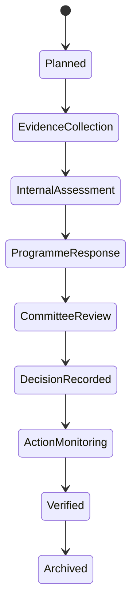

# Role Blueprint 11 — Quality, Leadership, Audit and Regulatory Journey Book

This book preserves recovered Parts 2–5 and is preceded in the main handbook by a composite Part 1 assembled only from approved quality-governance records.

## Recovered part 1

_Source record: `031-role-blueprint-11-part-2-quality-findings-corrective-actions-verification-escalation-and-c.md`_

## Role Blueprint 11, Part 2 — Quality findings, corrective actions, verification, escalation and closure

### 11.20 A finding is not a dashboard colour

A quality finding is a structured, reviewable statement that a criterion is not met, is only partly met, or needs corrective action. It is not created automatically from a poor metric, an overdue task or AI output.

A finding must identify:

- The review and criterion
- Evidence considered
- Factual observation
- Required standard
- Gap between evidence and standard
- Impact and scope
- Severity or priority under configured policy
- Owner responsible for response
- Required response date
- Decision authority
- Verification requirement
- Related risks, if any

Example:

> **Proposed finding: assessment moderation evidence incomplete**  
> Criterion: Every course must have approved moderation evidence before final result release.  
> Observation: CSC 4792 moderation record confirms review but does not show verification of required corrections.  
> Impact: The institution cannot demonstrate that the required control operated fully for Semester 2, 2026.  
> Required response: School of Engineering to provide evidence or corrective-action plan by 10 September 2026.

This is specific, defensible and does not accuse an individual staff member.

---

## Action QAO-FND-04 — Create and issue a proposed quality finding

### 11.21 Entry point and preconditions

The QAO starts from:

> **Review assessment → Criterion outcome → Create proposed finding**

The action appears only when:

- The review is active and within the QAO’s scope.
- At least one relevant evidence assessment exists.
- The criterion has a recorded gap, insufficiency or required action.
- The QAO is not creating a finding against evidence they independently submitted.
- The configured policy permits the QAO to propose the finding.

If the evidence is inconclusive, the primary action is:

> `Request further verification`

not `Create finding`.

### 11.22 Proposed-finding form

The screen opens with evidence and criterion already linked. The QAO completes five panels.

#### A. Finding statement

Fields:

- Finding title
- Criterion and standards version — locked
- Factual observation — required
- Evidence references — required
- Why the evidence does not meet the criterion — required
- Scope: institution, school, programme, course or process
- Affected period
- Whether the finding is new, recurring or related to an earlier finding

The system warns if the QAO uses vague wording such as “poor quality” without describing the observable gap.

#### B. Impact and priority

The QAO selects configured values:

- Impact category
- Urgency
- Potential regulatory/accreditation relevance
- Student-impact category
- Financial/operational impact, if applicable
- Required escalation threshold

The QAO must provide a reason. Severity is not an unexplainable score.

Example:

> Priority: High  
> Reason: Result-release control evidence is incomplete for a large registered course and must be resolved before the next result board.

#### C. Response ownership

The QAO selects:

- Responsible office
- Named response owner
- Responsible executive or Dean, where required
- Response due date
- Whether the owner may delegate
- Required response format
- Required independent verifier

The system checks active assignments and conflicts of interest.

#### D. Required response

The QAO specifies whether the owner must:

- Provide missing evidence
- Explain why evidence is unavailable
- Correct a controlled process
- Produce a corrective-action plan
- Request an authorized exception
- Attend a review meeting
- Provide a timetable and accountable owner

#### E. Student-facing or public communication

Normally, findings are internal. The QAO selects a classification and confirms whether any communication is required. The system does not publish findings automatically.

### 11.23 Preview before issue

Before issuing, the QAO sees exactly what the response owner will receive:

> **Quality finding requiring response**  
> Review: Annual programme review — BSc Computer Science  
> Criterion: Assessment moderation  
> Required response by: 10 September 2026  
> `View finding and respond`

The preview distinguishes:

- Factual finding visible to response owner
- Restricted reviewer notes, if any
- Information not shared because it is confidential or unnecessary

### 11.24 Confirming a proposed finding

Primary action:

> `Issue proposed finding`

Confirmation text:

> This will notify the assigned response owner and create a governed response deadline. It does not close the review, amend academic records or establish individual misconduct.

The QAO cannot use an instant `Final finding` action unless the configured framework explicitly gives them that authority.

### 11.25 Domain behaviour

**Command:** `IssueProposedQualityFinding`

**Transaction:**

1. Revalidate review state, criterion and evidence references.
2. Check QAO scope and conflict rules.
3. Create immutable proposed-finding version.
4. Create response task and deadline.
5. Create independent-verification requirement where configured.
6. Add the item to the review timeline.
7. Write audit record.
8. Publish notification event through the outbox.

**Events:**

- `QualityFindingProposed`
- `QualityFindingResponseRequested`
- `QualityFindingVerificationPlanned`

The finding state becomes:

> `Awaiting responsible-owner response`

### 11.26 Errors and recovery

| Situation | Required response |
|---|---|
| No eligible response owner | Block issue; create assignment-resolution task |
| Evidence item was superseded during drafting | Show comparison and require QAO to reassess latest version |
| Duplicate open finding for same criterion | Show related finding; allow linking or authorized separate issue |
| Finding includes restricted student/staff content | Require minimization or restricted classification before issue |
| QAO loses connection after confirmation | Check idempotency reference; do not issue a duplicate finding |
| Deadline conflicts with committee deadline | Warn and require revised plan or documented escalation |
| QAO has conflict of interest | Block substantive issue; require reassignment |

---

## Action OWN-RSP-05 — Responsible owner responds to a finding

### 11.27 Responsible-owner experience

The owner begins from:

> **My tasks → Quality finding requiring response**

The page title identifies the exact requirement:

> **Respond to quality finding QF-2026-0184**

The owner sees:

- Finding statement
- Criterion and required standard
- Evidence considered
- Scope and impact explanation
- Response deadline
- Required response format
- Assigned QAO
- Existing related actions
- Escalation path
- What they can and cannot change

They cannot edit the QAO’s original finding statement. They can submit a response and evidence.

### 11.28 Response options

The owner selects one primary response:

1. **Provide additional evidence**  
   Used where the evidence exists but was not initially supplied.

2. **Accept finding and submit corrective-action plan**  
   Used where the gap is accepted.

3. **Disagree with finding and request review**  
   Requires evidence-based explanation; it does not erase the finding.

4. **Request approved exception**  
   Used only where institutional policy permits.

5. **State inability to respond by deadline**  
   Requires reason, proposed date and delegating authority where applicable.

The owner sees clear consequences before selection.

### 11.29 Corrective-action plan form

Where required, the plan contains:

- Root cause or contributing factors
- Corrective action
- Preventive action, if applicable
- Action owner
- Executive sponsor, if required
- Milestones
- Completion target
- Resources or dependencies
- Evidence that will demonstrate completion
- Risk if action is delayed
- Required verification role
- Student/staff communication needs
- Whether policy/configuration/system change is required

A plan cannot say only:

> “Staff will be reminded.”

unless the owner also defines the control change, owner, deadline and proof.

Example:

> Corrective action: Update moderation workflow to require documented confirmation of corrections before result-board package generation.  
> Owner: Examinations Officer.  
> Evidence: revised workflow version, completed test evidence and first approved package using the control.  
> Deadline: 30 September 2026.

### 11.30 Submit-response interaction

The response owner selects:

> `Submit response for QA review`

The button changes to:

> `Submitting response…`

The system:

- Blocks duplicate submission
- Scans attached evidence
- Validates required fields
- Saves the response as a versioned record
- Moves the finding to `Response under QA review`
- Creates QAO review task
- Sends a neutral notification

Confirmation:

> Response submitted. Quality Assurance will review it. The finding remains open until the required action is independently verified.

### 11.31 QAO review of response

The QAO sees side-by-side panels:

| Original finding | Responsible-owner response |
|---|---|
| Criterion and evidence gap | Explanation, evidence and proposed plan |
| Required response | Milestones and owner |
| Priority and deadline | Request for revised timeline, if any |
| Verification requirement | Proposed completion evidence |

The QAO can:

- Accept response and activate corrective-action plan
- Return response for clarification
- Accept additional evidence and revise assessment
- Refer dispute to configured authority
- Escalate missed/insufficient response
- Withdraw a proposed finding only with rationale and audit trail

Withdrawing a finding does not delete history. It records, for example:

> Withdrawn: subsequently submitted evidence demonstrated the required control was in place during the reviewed period.

---

## Action QAO-ACT-06 — Activate, track and update a corrective action

### 11.32 Action register

Each accepted corrective-action plan creates one or more **Quality Actions**.

The QAO opens:

> **Findings and actions → Active actions**

Each card shows:

> **QF-2026-0184 — Moderation-control improvement**  
> Owner: Examinations Officer  
> Due: 30 September 2026  
> Status: Action in progress  
> Next milestone: workflow design approval, 12 September  
> `Review action`

#### Action fields

- Parent finding
- Action description
- Action owner
- Sponsor and verifier
- Scope
- Start and due date
- Milestones
- Dependencies
- Required evidence of completion
- Status
- Risk and escalation rule
- Change-management link
- Related policy/system version
- Communication requirement

Statuses:

- Not started
- In progress
- Awaiting evidence
- Evidence submitted
- Verification in progress
- Returned for completion
- Verified complete
- Closed by authority
- Cancelled by authorized decision

### 11.33 Owner updates an action

The action owner can:

- Record milestone completion
- Upload evidence
- Explain a delay
- Request due-date change
- Add a dependency or risk
- Request reassignment
- Submit action for verification

They cannot mark the action `Verified complete`.

When an owner requests a due-date change, they must enter:

- Reason
- New date
- Impact on finding/risk
- Mitigation
- Required approval authority

The QAO receives:

> **Due-date change requested**  
> Original: 30 September  
> Proposed: 15 October  
> Reason: dependency on approved assessment-workflow release  
> `Review request`

### 11.34 Overdue escalation

At the configured threshold:

1. The owner receives reminder.
2. The sponsor receives notice.
3. The QAO sees an overdue task.
4. The finding is escalated only to the configured authority.
5. The escalation record states the missed milestone and impact.
6. The action remains open; the system does not automatically impose a sanction.

Example executive notice:

> Quality action QF-2026-0184 is overdue. The required moderation control has not yet been independently verified. Decision required: approve revised plan, assign resources, or escalate under governance procedure.

---

## Action QAO-VER-07 — Independently verify corrective action

### 11.35 Verification assignment

The system assigns an independent verifier according to the configured framework.

The verifier cannot be:

- The action owner
- The person who submitted completion evidence
- The person whose process is being independently assessed, unless an authorized exception is recorded

The verifier receives:

> **Verification required — Quality action QF-2026-0184**

They see:

- Original finding
- Corrective-action plan
- Required completion evidence
- Owner updates
- Related policy/configuration/system changes
- Test or operating evidence
- Verification deadline
- Required decision authority

### 11.36 Verification decision

The verifier chooses:

- Verified complete
- Partly complete—further work required
- Evidence insufficient
- Not yet operating effectively
- Cannot verify—conflict or missing access
- Recommend closure to authority

For `Verified complete`, the verifier must record:

- Evidence reviewed
- Test/inspection performed
- Date and scope
- Limitation
- Whether control operated in practice, not only whether a document was updated
- Recommendation

Example:

> Verified complete. The revised moderation workflow requires correction-confirmation before board package creation. The verifier reviewed three packages generated after release and confirmed the control operated as designed.

### 11.37 Closure authority

Verification does not itself close a material finding unless policy permits it.

The configured closure authority receives:

> **Finding ready for closure decision**  
> QF-2026-0184  
> Independent verification: complete  
> Recommended outcome: close with assurance  
> `Review closure package`

Available actions:

- Close with assurance
- Close with continuing monitoring
- Return for further action
- Escalate
- Record authorized exception

The authority must enter a rationale and, where required, meeting reference.

The system confirms:

> Closing this finding preserves its full history, evidence and verification record. It does not delete the original gap.

---

### 11.38 Finding and action architecture

#### Entities

- `QualityFinding`
- `FindingVersion`
- `FindingResponse`
- `CorrectiveActionPlan`
- `QualityAction`
- `ActionMilestone`
- `VerificationAssignment`
- `VerificationAssessment`
- `ClosureDecision`
- `QualityEscalation`

#### Commands

| Command | Authorized actor |
|---|---|
| `IssueProposedQualityFinding` | QAO |
| `SubmitFindingResponse` | Assigned responsible owner |
| `AcceptCorrectiveActionPlan` | QAO / configured authority |
| `UpdateQualityAction` | Assigned action owner |
| `RequestActionDueDateChange` | Action owner |
| `AssignIndependentVerifier` | QAO / configured authority |
| `SubmitQualityActionForVerification` | Action owner |
| `RecordQualityVerification` | Independent verifier |
| `CloseQualityFinding` | Configured closure authority |
| `EscalateQualityFinding` | QAO / authorized authority |

#### Events

- `QualityFindingProposed`
- `QualityFindingResponseSubmitted`
- `CorrectiveActionPlanActivated`
- `QualityActionMilestoneCompleted`
- `QualityActionOverdue`
- `QualityActionSubmittedForVerification`
- `QualityActionVerified`
- `QualityFindingClosureRecommended`
- `QualityFindingClosed`
- `QualityFindingEscalated`

No external reporting tool or AI assistant may issue, accept, verify or close a finding.

### 11.39 Notification rules

| Event | Recipient | Message purpose |
|---|---|---|
| Proposed finding issued | Responsible owner | State action, criterion and deadline |
| Response submitted | QAO | Review response |
| Action overdue | Owner, sponsor, QAO | Prompt governed follow-up |
| Verification assigned | Independent verifier | Complete verification |
| Closure decision | Owner, QAO, relevant authority | Confirm official outcome |
| Finding escalated | Configured authority | Request decision/resource action |

Email and SMS contain only neutral prompts and secure links. Detailed quality content remains in the authenticated workspace.

### 11.40 Accessibility and recovery

- Findings, evidence and action plans can be completed fully by keyboard.
- Severity/status uses text and an accessible label, not colour alone.
- Long action plans use autosave and step validation.
- Error summary links to incomplete or invalid fields.
- A user does not lose a drafted response after a recoverable timeout.
- If an action update is submitted twice after connection loss, idempotency prevents duplicate milestones.
- Mobile users can review and update actions without horizontally scrolling critical information.
- Restricted evidence previews provide an accessible alternative where format permits.

### 11.41 Part 2 acceptance requirements

Part 2 is accepted only when:

- A finding names the standard, evidence gap, scope, impact, owner and required response.
- A poor metric, alert or AI output does not automatically become a finding.
- Response owners cannot alter the original finding.
- Corrective-action plans define accountable action, deadlines, evidence and verification.
- The person responsible for correction cannot independently verify it.
- Overdue action escalates through configured governance, not arbitrary punishment.
- Closure preserves the original finding, response, evidence and decision history.
- No user can silently change a status to “resolved.”
- Every finding, response, action, verification and closure decision is versioned and auditable.

---

## Recovered part 2

_Source record: `032-role-blueprint-11-part-3-programme-review-accreditation-committees-and-regulatory-submissi.md`_

## Role Blueprint 11, Part 3 — Programme review, accreditation, committees and regulatory submission

### 11.42 Programme review is a governed lifecycle

A programme review is not a form upload. It examines a defined programme against a versioned institutional, professional-body or regulatory framework.

It may be:

- Scheduled annual review
- Periodic comprehensive review
- New-programme proposal review
- Curriculum-change review
- Accreditation readiness review
- Regulator-requested review
- Follow-up review after conditions or findings

Each review uses the applicable framework version, programme version, cohort scope and effective dates. A framework can change without rewriting the system.

### 11.43 Programme-review workspace

The QAO starts at:

> **Programme reviews → 2026 cycle**

A review card states:

> **BSc Computer Science — Annual review**  
> Framework: Institutional Programme Review 2026 v2  
> Evidence: 12 of 16 items accepted  
> Findings: 2 active  
> Committee: School Quality Committee, 18 September  
> `Open review`

The page has these tabs:

- Overview
- Review framework
- Evidence plan
- Programme response
- Criteria assessments
- Findings and actions
- Committee package
- Decision and follow-up
- History and archive

The QAO sees evidence and indicators for the selected programme, not unrestricted school-wide records.

### 11.44 Action QAO-PRG-08 — Start a programme review

The QAO selects:

> **Programme reviews → Create review**

The system pre-fills only approved configuration:

- Programme identity and curriculum version
- Academic year/review cycle
- Review type
- Applicable framework versions
- Required authorities
- Required evidence catalogue
- Previous review and active findings

The QAO confirms:

- Review reason
- Scope: programme, delivery site, modes, cohort or course range
- Review lead
- Programme response owner
- Internal reviewers
- Required independent reviewer
- Committee route
- Key dates
- Conflict declarations

#### Programme-response owner experience

The Programme Coordinator or Head of Department receives:

> **Programme review assigned**  
> BSc Computer Science · 2026 annual review  
> Your role: provide programme response and required evidence.  
> Evidence deadline: 3 September  
> Committee date: 18 September  
> `Open programme review`

They can submit evidence and responses, but cannot certify their own review.

### 11.45 Framework-to-evidence mapping

For every framework criterion, the system displays:

| Criterion | Required evidence | Status | Responsible owner | Assessment |
|---|---|---|---|---|
| Programme purpose and outcomes | Approved specification, outcome map | Submitted | Programme Coordinator | Awaiting assessment |
| Curriculum delivery | Course and teaching plan summary | Accepted | Head of Department | Partly sufficient |
| Assessment quality | Moderation and External Examiner evidence | Gap identified | Examinations Officer | Finding proposed |
| Student outcomes | Certified continuation/progression metrics | Accepted | Metric Owner | Sufficient |
| Resources and staffing | Approved staff profile/facility evidence | Awaiting response | School Administrator | Not assessed |

The framework page explains each criterion in plain language and links to the exact evidence—not an opaque compliance percentage.

### 11.46 Programme self-evaluation experience

The programme response owner completes a structured self-evaluation.

For each criterion, they state:

- Current practice
- Evidence reference
- Strengths
- Known gap or risk
- Action already in progress
- Required institutional support
- Whether the criterion is not applicable and why

A self-evaluation cannot claim compliance by selecting a box without linked evidence.

Before submitting, the owner confirms:

> This response is accurate to the best of my knowledge and identifies material gaps known to the programme team.

The QAO sees the self-evaluation alongside independently sourced evidence and previous-review actions.

### 11.47 Programme-review assessment

The QAO and assigned reviewers assess one criterion at a time.

For each criterion, the reviewer sees:

- Framework wording and version
- Programme self-evaluation
- Submitted evidence
- Certified indicator links
- Previous findings and actions
- External-review evidence, where present
- Reviewer assessment and rationale
- Required follow-up

Available assessment outcomes:

- Meets criterion
- Partly meets criterion
- Does not meet criterion
- Evidence insufficient
- Not applicable—approved rationale required
- Requires external/committee decision

A reviewer cannot select `Meets criterion` where a mandatory evidence item is missing unless an authorized exception is recorded.

### 11.48 Accreditation readiness and external frameworks

An accreditation review uses an **Accreditation Framework Profile**, configured with:

- Accrediting body or regulator
- Applicable qualification/programme types
- Framework version
- Submission format
- Evidence requirements
- Required signatories
- Submission deadline
- Confidentiality classification
- External-reviewer access rules
- Condition/recommendation vocabulary
- Renewal cycle

The system must support different accreditation bodies without embedding their criteria in application code.

#### Accreditation readiness view

The QAO sees:

> **Accreditation readiness — BSc Computer Science**  
> Submission deadline: 15 October 2026  
> 22 required evidence items  
> 17 accepted · 3 awaiting clarification · 2 gaps  
> `Open readiness plan`

This view identifies preparation needs. It does not claim the programme is accredited.

### 11.49 External reviewer experience

An External Reviewer receives a restricted guest workspace.

Header:

> **External Review workspace · BSc Computer Science · Accreditation 2026**

They can see only:

- Assigned programme and review scope
- Applicable framework and submission deadline
- Selected evidence items
- Required review questions
- Secure document viewer
- Their own comments and report draft
- Contact route for procedural support

They can:

- Review assigned evidence
- Request clarification through the QAO
- Record observation, recommendation or concern
- Submit their review report
- Confirm conflicts of interest

They cannot:

- Browse other programmes
- View unrelated students, staff, finance, support or disciplinary information
- Alter SIS records
- Close findings
- Submit the institution’s regulatory return
- Download evidence beyond configured permission

All external access expires automatically at the end of the assignment.

### 11.50 Committee package preparation

A committee package is a frozen, versioned decision package—not live changing data.

The QAO selects:

> **Committee package → Generate draft package**

The system verifies:

- Required criteria have assessment outcomes
- Evidence versions are fixed
- Active findings and action status are included
- Conflict declarations are complete
- Required external reviews are received or explicitly noted
- Certified metric snapshots exist
- Unresolved data-quality limitations are visible
- Committee authority and meeting date are valid

The QAO chooses included sections:

- Executive summary
- Programme scope and framework
- Self-evaluation
- Criterion assessments
- Evidence index
- Findings and recommended actions
- External-review report
- Data-quality limitations
- Decision options
- Previous decision/action follow-up
- Required sign-offs

The package gets:

- Package identifier
- Version
- Generated timestamp
- Source snapshot references
- Integrity checksum
- Classification
- Expiry/access rule

### 11.51 Committee-member experience

A committee member enters from:

> **My meetings → Programme Review Committee → Review package**

They see:

- Meeting agenda
- Their declared role and voting authority
- Conflict-of-interest action
- Package summary
- Evidence index
- Decision items
- Draft recommendations
- Meeting notes and actions, depending on authority

Before access, the system requires a conflict declaration:

- No conflict
- Conflict declared—abstain
- Conflict declared—leave specified agenda item
- Conflict requires chair review

A conflicted member cannot cast a decision for that item.

#### Committee decision action

For each decision item, authorized members can record:

- Approve recommended conclusion
- Return for clarification
- Approve with conditions
- Require corrective action
- Refer to another authority
- Defer decision with reason

The chair or authorized secretary records the formal outcome and meeting reference. Individual members cannot later edit approved minutes.

### 11.52 Regulatory submission workflow

A regulatory report is an official submission, not an exported spreadsheet sent by email without control.

The Regulatory Reporting User starts from:

> **Regulatory reporting → Create submission**

They select:

- Regulator/body
- Report type and template version
- Reporting period
- Institution/programme scope
- Required metrics and evidence
- Submission deadline
- Required signatories
- Delivery method

The system assembles a draft from certified metrics and approved evidence only.

Every field shows:

- Source report/metric version
- Data date
- Definition
- Filter/scope
- Validation status
- Responsible owner
- Limitation, if any

A user cannot type over a certified result without creating a controlled explanatory note and obtaining the required approval.

### 11.53 Submission validation and authorization

Before submission, the system validates:

- Required fields and template version
- Certified metric status
- Arithmetic consistency
- Required evidence and attachments
- Approval chain
- Signatory authority
- Submission deadline
- Duplicate submission risk
- Export classification
- Final file checksum

The final review page states:

> **Ready for authorized submission**  
> Report: Annual Higher-Education Return  
> Period: 2026  
> Required approvals: 3 of 3 completed  
> Data snapshot: REG-2026-0041  
> `Submit to regulator`

After the action, the system records:

- Submitted by
- Authority used
- Submission time
- Delivery method
- Regulator acknowledgement/reference
- Final checksum
- Exact submitted package version

If delivery fails:

> Submission package is approved but delivery could not be confirmed. Do not submit again yet. The system is checking the regulator response.

Idempotency prevents duplicate statutory submissions.

### 11.54 Conditions, recommendations and post-submission actions

When a regulator or accrediting body returns a condition, recommendation or request for clarification, the QAO creates a controlled response case.

It includes:

- External reference
- Requirement wording
- Deadline
- Affected scope
- Evidence required
- Response owner
- Approval route
- Submission method
- Related internal finding/actions

The regulator’s wording is retained as source evidence. Internal users may summarize it, but cannot rewrite its meaning.

### 11.55 Commands, events and audit

| Command | Authorized role |
|---|---|
| `StartProgrammeReview` | QAO |
| `SubmitProgrammeSelfEvaluation` | Assigned Programme Owner |
| `AssessProgrammeCriterion` | Assigned reviewer |
| `AssignExternalReviewer` | QAO / configured authority |
| `SubmitExternalReviewReport` | Assigned External Reviewer |
| `GenerateQualityCommitteePackage` | QAO |
| `RecordCommitteeQualityDecision` | Chair/authorized secretary |
| `CreateRegulatorySubmission` | Regulatory Reporting User |
| `ApproveRegulatorySubmission` | Configured signatory |
| `SubmitRegulatoryReturn` | Authorized submission role |

Representative events:

- `ProgrammeReviewStarted`
- `ProgrammeSelfEvaluationSubmitted`
- `ProgrammeCriterionAssessed`
- `ExternalReviewerAssigned`
- `ExternalReviewReportSubmitted`
- `QualityCommitteePackageFrozen`
- `QualityCommitteeDecisionRecorded`
- `RegulatorySubmissionPrepared`
- `RegulatorySubmissionApproved`
- `RegulatorySubmissionDelivered`
- `RegulatoryResponseReceived`

All evidence views, downloads, comments, votes, sign-offs, exports and submissions are auditable.

### 11.56 Accessibility, failure and recovery

- Committee package navigation is keyboard accessible and works with screen readers.
- Every finding and decision status uses text, not colour alone.
- External reviewers can use accessible documents and request an alternative format.
- A draft self-evaluation or review report is autosaved.
- A late evidence submission remains possible only if policy allows and is visibly marked late.
- A changed criterion/framework version creates a review-impact task; it does not silently alter the active review.
- If package generation fails, the prior package remains available with its original date and version.
- If a committee member’s authority expires during the meeting, their decision is blocked and logged.
- If a regulatory delivery acknowledgement is delayed, status remains `Delivery confirmation pending`, not `Submitted successfully`.

### 11.57 Part 3 acceptance requirements

Part 3 is accepted only when:

- Programme reviews use versioned frameworks, programme scope and evidence mapping.
- Programme owners submit self-evaluation but cannot independently certify compliance.
- External reviewers receive narrow, time-limited access.
- Committee packages are frozen, versioned and reproducible.
- Conflicted committee members cannot decide affected matters.
- Regulatory reports draw from certified metrics and approved evidence only.
- Official submissions enforce approval chain, checksum, delivery confirmation and duplicate protection.
- Regulatory conditions become controlled internal response cases.
- No programme becomes “accredited” merely because a readiness checklist is complete.
- Every decision, evidence access, export and submission remains auditable.

---

## Recovered part 3

_Source record: `033-role-blueprint-11-part-4-executive-leadership-institutional-decisions-interventions-risk-a.md`_

## Role Blueprint 11, Part 4 — Executive Leadership: institutional decisions, interventions, risk and accountable follow-through

Executive Leadership is not a larger dashboard. It is a controlled workspace for an authorized Vice-Chancellor, Deputy Vice-Chancellor, Registrar, Chief Financial Officer, Senate/committee chair, or equivalent role to make institutional decisions from governed evidence.

The active title, authority and scope are configured by institution.

> **Executive Leadership workspace · Institution-wide · 2026 Strategic Cycle**

### 11.58 Leadership home page

The home page is ordered by decisions and obligations, not charts.

#### A. Decisions requiring my authority

Example:

> **Approve revised institutional intervention**  
> Issue: First-year continuation decline  
> Sponsor: Deputy Vice-Chancellor Academic  
> Required decision: approve resources and revised milestones  
> Due: 12 September 2026  
> `Review decision package`

The leader sees:

- Decision requested
- Authority basis
- Responsible sponsor and operational owner
- Deadline
- Evidence summary
- Risks of delay
- Available actions

#### B. Institutional obligations at risk

Examples:

- Accreditation condition due
- Regulatory return awaiting sign-off
- Material quality finding overdue
- Result-release governance exception
- Strategic-plan milestone missed
- Critical data-quality limitation affecting a reported metric

This does not expose all operational work; it surfaces only issues configured for leadership attention.

#### C. Institutional health

The leader sees certified, aggregate indicators such as:

- Admission demand and conversion
- Registration completion
- Progression and completion
- Graduate outcomes
- Programme-review status
- Assessment and result-release reliability
- Financial sustainability measures
- Staff and teaching-capacity measures
- Student-support service capacity
- Data-quality and system-health measures

Each indicator includes definition, data date, source, limitation, owner and certified-report link.

#### D. My active interventions

> **Assessment reliability improvement**  
> Status: 3 of 5 milestones complete  
> Next decision: approve examination-system rollout  
> Evidence due: 20 September  
> `Open intervention`

#### E. Decision calendar

- Senate or equivalent meetings
- Council/board meetings
- Accreditation meetings
- Regulatory deadlines
- Strategic-review sessions
- Delegated-decision deadlines

### 11.59 Leadership information boundaries

Leadership sees aggregate information by default.

| Matter | Default leadership view | Individual detail allowed only when |
|---|---|---|
| Student progression | Programme/cohort patterns | Formal escalation, defined academic purpose and authorized scope |
| Counselling | Service capacity and waiting-time aggregate | Never routine access to counselling notes |
| Welfare | Demand and service-performance aggregate | Formal operational escalation with minimum information |
| Finance | Collection/clearance aggregate | Authorized institutional finance decision |
| Discipline | Case-volume/trend aggregate | Formal decision role under disciplinary policy |
| Staff performance | Approved aggregate/quality-process measures | Authorized HR process, outside this project’s ordinary leadership view |
| Quality findings | Full finding/action evidence in assigned authority scope | Leader is assigned sponsor/closure/decision authority |

A leader may not drill from “14 students awaiting academic follow-up” into names unless the configured policy and current decision require it.

---

## Action EXE-DEC-01 — Review and record an institutional decision

### 11.60 Entry point

The leader starts from:

> **Decisions requiring my authority → Review decision package**

The system builds the package from versioned, governed records. A leader does not assemble evidence manually from emails.

### 11.61 Decision package screen

The page is divided into six sections.

#### A. Decision required

At the top:

> **Decision required:** Approve institutional intervention for first-year continuation  
> **Authority:** Deputy Vice-Chancellor Academic, delegated under Academic Strategy Rule 2026-v1  
> **Decision deadline:** 12 September 2026

#### B. Recommendation

- Decision sponsor
- Requested action
- Recommended option
- Why action is needed
- Cost/resource implication
- Effect of approving, returning or declining
- Dependencies

#### C. Evidence

- Certified indicators
- Quality-review findings
- Relevant committee recommendations
- Risk assessment
- Previous decisions
- Data-quality limitations
- Attached approved evidence

A leader sees a concise summary first, then can open source evidence. Each item states source, date, definition and status.

#### D. Options and consequences

Configured options may include:

- Approve
- Approve with conditions
- Return for clarification
- Refer to another authority
- Decline with reason
- Defer with review date
- Delegate permitted review

The system shows the outcome of each action before confirmation.

#### E. Governance checks

- Authority currently active
- Required prior recommendations present
- Conflict-of-interest declaration
- Required consultation completed
- Budget authority, if relevant
- Related legal/regulatory constraint
- Required signatories

#### F. Decision history

- Who requested decision
- Previous decision versions
- Revisions
- Delegations
- Meeting references
- Outstanding actions

### 11.62 Decision action and confirmation

The leader selects an option, enters rationale and reviews the decision summary.

For `Approve with conditions`:

- Conditions
- Responsible owner
- Completion deadline
- Verification evidence
- Follow-up authority
- Notification recipients

Confirmation:

> You are approving this intervention subject to two conditions. This will create accountable actions and notify the assigned owners. It will not change student records, academic results or quality findings directly.

The decision button is disabled while submission is processing, preventing duplicate approvals.

### 11.63 Architecture behaviour

**Command:** `RecordInstitutionalDecision`

**Preconditions:**

- Active leadership role has current authority.
- Decision package is still current and has not changed since review.
- Conflict declaration is complete.
- Required prior approvals/recommendations exist.
- Decision is within the active delegation limit.

**Transaction:**

1. Revalidate package snapshot and authority.
2. Record immutable decision version and rationale.
3. Create actions, conditions and deadlines.
4. Update related intervention/risk/finding state where applicable.
5. Write audit record.
6. Publish governed events.

**Events:**

- `InstitutionalDecisionRecorded`
- `InstitutionalDecisionConditionCreated`
- `InstitutionalActionAssigned`
- `InstitutionalDecisionReturnedForClarification`

### 11.64 Error and recovery

| Situation | Required response |
|---|---|
| Authority expired | “Your authority for this decision is no longer active. No decision was recorded.” |
| Package changed while open | Show changes; require the leader to review the latest version |
| Conflict declared | Block decision; provide delegation/reassignment route |
| Required recommendation missing | Explain missing requirement and return package |
| Connection drops after action | Check idempotency reference; do not ask leader to vote/approve again blindly |
| Decision deadline missed | Preserve package; show late status and configured escalation route |

---

## Action EXE-INT-02 — Create and govern an institutional intervention

### 11.65 User goal

A leader identifies a material institutional issue and needs to convert it into accountable, measurable action—not a vague instruction such as “improve student success.”

### 11.66 Entry points

- A certified indicator: `Create intervention`
- A quality finding: `Create institutional intervention`
- A risk register item
- A committee decision
- A strategic-plan review
- A regulatory condition

The system preserves the source trigger but does not assume the trigger itself determines the solution.

### 11.67 Intervention creation screen

#### Step 1 — Define the issue

- Plain-language issue statement
- Source evidence
- Scope
- Affected population/process
- Known limitations
- Urgency
- Strategic objective linked
- Required decision route

Example:

> Issue: Continuation among first-year engineering students declined from 78% to 65% across two cohorts.  
> Evidence: Certified metric RET-2.1; data limitation: 3% outcome pending verification.

#### Step 2 — Define intended outcome

The leader specifies:

- Target outcome
- Baseline
- Target measure and metric definition
- Target date
- Expected beneficiaries
- Risks/harms to avoid
- Equity or subgroup review requirement
- Success evidence

A target must not overwrite the observed metric.

#### Step 3 — Choose intervention model

The intervention can include:

- Academic-support expansion
- Curriculum review
- Assessment process improvement
- Advising-capacity change
- Financial-support coordination
- Staff development
- Information-system correction
- Policy review
- Resource allocation
- Other approved institutional action

Each type is a configured reusable template with required fields—not hard-coded logic.

#### Step 4 — Assign accountability

- Executive sponsor
- Operational owner
- Participating offices
- Quality verifier
- Finance/budget owner, where required
- Risk owner
- Decision authority
- Review meeting

No intervention activates without a named accountable operational owner.

#### Step 5 — Plan milestones

For every milestone:

- Description
- Owner
- Due date
- Dependency
- Evidence of completion
- Risk if late
- Escalation route
- Student/staff communication requirement

#### Step 6 — Review and activate

The leader sees impact, resources, dependencies, measures and ownership before selecting:

> `Approve and activate intervention`

### 11.68 Intervention workspace

Once active, the page shows:

- Purpose and strategic objective
- Evidence baseline
- Current metric outcome
- Target—clearly labelled as a target
- Milestone timeline
- Owners and dependencies
- Budget/approval status where appropriate
- Risks and issues
- Quality findings linked
- Communication actions
- Latest review decision
- Next executive review date

A target and observed outcome are visually distinct:

> **Observed continuation:** 65%  
> **Approved target:** 75% by 2027  
> **Current measurement period:** 2026

### 11.69 Intervention updates and leadership review

The operational owner can submit a progress update:

- Milestone state
- Evidence
- Delay/recovery plan
- New risk
- Requested executive decision
- Metric observation

The leader does not merely see a completion percentage. They see:

> Milestone overdue: adviser-capacity allocation  
> Impact: support rollout delayed by two weeks  
> Proposed recovery: appoint temporary advisers by 10 September  
> Decision required: approve temporary allocation

The leader can approve a recovery plan, request more evidence, reassign permitted ownership, alter a target through governance, or close/continue intervention based on verified evidence.

They cannot manually set the actual metric to “improved.”

---

## Action EXE-RSK-03 — Manage institutional risk and escalation

### 11.70 Risk record

An institutional risk may be linked to a quality finding, regulatory obligation, system incident, finance issue or strategic intervention.

A risk record contains:

- Risk statement
- Cause and consequence
- Scope
- Likelihood and impact under configured scale
- Existing controls
- Control owner
- Mitigation actions
- Contingency plan
- Review date
- Escalation threshold
- Risk acceptance authority
- Linked evidence

Risk scoring is configurable. A high score prompts attention; it does not automatically make a policy decision.

### 11.71 Leadership risk screen

A leader sees:

> **Risk: result-release delay may affect graduation cycle**  
> Current level: high under Risk Framework 2026-v1  
> Existing control: examinations validation and board schedule  
> Mitigation: additional moderation capacity  
> Owner: Registrar  
> Next review: 4 September  
> `Review risk`

Available actions:

- Accept risk within authority
- Require mitigation
- Escalate
- Request independent assurance
- Return for clarification
- Close only after control verification

The leader cannot close a risk because a deadline passed or because a chart changed colour.

---

## Action EXE-DEL-04 — Delegate an authorized decision or task

### 11.72 Delegation experience

A leader selects:

> `Delegate`

The delegation form requires:

- Delegate
- Specific decision/task
- Scope
- Start and expiry date
- Monetary/authority limit, where relevant
- Whether sub-delegation is allowed
- Required reporting-back date
- Conflict check
- Reason and authority basis

The interface states:

> Delegating review does not transfer accountability for this institutional decision unless policy explicitly provides otherwise.

The delegate sees a separate assigned decision/task; they do not inherit the leader’s entire workspace.

Delegation expires automatically. A decision made after expiry is blocked.

---

### 11.73 Executive notifications

Leadership receives only actionable notices:

| Event | Notification |
|---|---|
| Decision package ready | “A decision requiring your authority is ready for review.” |
| Intervention milestone overdue | “An active intervention requires executive attention.” |
| Material risk escalated | “A risk has reached the configured executive threshold.” |
| Regulatory deadline near | “Regulatory submission approval is due in 3 days.” |
| Quality finding ready for closure | “A quality decision package is ready for your authority.” |

Sensitive content stays inside the authenticated workspace. SMS/email contains neutral wording and a secure link.

### 11.74 Architecture, commands and events

#### Entities

- `InstitutionalDecisionPackage`
- `InstitutionalDecision`
- `StrategicObjective`
- `InstitutionalIntervention`
- `InterventionMilestone`
- `InstitutionalRisk`
- `RiskControl`
- `Delegation`
- `ExecutiveReviewMeeting`

#### Commands

| Command | Authorized actor |
|---|---|
| `RecordInstitutionalDecision` | Active authorized leader |
| `CreateInstitutionalIntervention` | Active authorized leader |
| `ActivateInstitutionalIntervention` | Configured authority |
| `SubmitInterventionProgressUpdate` | Assigned operational owner |
| `RecordExecutiveInterventionReview` | Authorized leader |
| `CreateInstitutionalRisk` | Authorized owner |
| `RecordRiskTreatmentDecision` | Authorized leader |
| `DelegateInstitutionalAuthority` | Authorized leader |

#### Events

- `InstitutionalDecisionRecorded`
- `InstitutionalInterventionActivated`
- `InterventionMilestoneOverdue`
- `ExecutiveInterventionReviewCompleted`
- `InstitutionalRiskEscalated`
- `RiskTreatmentDecisionRecorded`
- `InstitutionalAuthorityDelegated`
- `DelegatedAuthorityExpired`

### 11.75 Accessibility and information safeguards

- Every decision, intervention and risk action is fully keyboard operable.
- Statuses use plain-language text and do not rely on colour.
- Evidence summaries have accessible source links and alternatives for charts/tables.
- Mobile views retain decision evidence, options and confirmation—not only a simplified “Approve” button.
- Long decision packages save reading position and support low-bandwidth document loading.
- AI-generated summaries are labelled, source-linked and never presented as the official decision record.
- Individual student/support data is suppressed unless necessary, authorized and purpose-logged.

### 11.76 Part 4 acceptance requirements

Part 4 is accepted only when:

- Leaders begin with decisions, obligations, interventions and risks—not decorative dashboards.
- Every leadership decision has an authority basis, evidence package, options, rationale and audit trail.
- A decision package cannot be approved after a material source change without re-review.
- Institutional interventions define baseline, target, owner, milestones, evidence and review cycle.
- Observed values and targets remain visibly separate.
- Leaders cannot alter source metrics, student records or quality findings to improve reporting.
- Risk acceptance, mitigation and closure follow configured authority.
- Delegation is scoped, time-bound and does not silently transfer unlimited powers.
- Leadership defaults to aggregate, privacy-preserving information.
- AI assists evidence interpretation only; human authorities make and record institutional decisions.

---

## Recovered part 4

_Source record: `034-role-blueprint-11-part-5-internal-audit-and-regulatory-reporting-operations.md`_

## Role Blueprint 11, Part 5 — Internal audit and regulatory reporting operations

### 11.77 Internal Auditor workspace

The Internal Auditor independently tests whether institutional controls operate as approved. They do not perform routine admissions, finance, examinations, quality or support-service work.

Header:

> **Internal Audit workspace · Institutional scope · 2026 Audit Plan**

Navigation:

- Audit plan
- Active audits
- Evidence requests
- Control tests
- Audit findings
- Management responses
- Follow-up verification
- Audit committee packages
- Archive

The home page prioritizes:

- Audits requiring planning or fieldwork
- Evidence requests overdue
- Control tests needing review
- Open audit findings
- Management actions past due
- Audit Committee deadlines
- Access/logging exceptions requiring investigation

### 11.78 Audit independence and data boundaries

The Auditor may access evidence only where:

- The audit engagement is active.
- The audit scope authorizes it.
- The evidence is necessary for the control being tested.
- Access is logged with audit purpose.
- Restricted information is minimized, masked or independently approved.

The Auditor may inspect whether counselling access controls work. They do not routinely read counselling notes.

The Auditor may inspect finance refund approvals. They do not approve refunds.

The Auditor may inspect examination result-release controls. They do not release results.

### 11.79 Action AUD-PLN-01 — Create audit engagement and test plan

The Auditor begins from:

> **Audit plan → Create engagement**

#### Step 1 — Engagement scope

Fields:

- Audit title
- Audit type: operational, financial, academic, IT, compliance, follow-up or configured equivalent
- Scope and period
- Objectives
- Standards/control framework
- Audited office/process
- Planned start/end dates
- Audit Lead and team
- Required independence declarations
- Classification
- Audit Committee route

#### Step 2 — Control objectives

Each objective links to a control, for example:

> Control objective: Only authorized users may release official results after required board approval.

The Auditor specifies:

- Control owner
- Expected control activity
- Frequency
- Evidence expected
- Test method
- Population/sample definition
- Sampling rationale
- Materiality/exception rule
- Required access

#### Step 3 — Audit plan review

Before activation, the system checks:

- Auditor independence
- Scope completeness
- Conflicts with operational assignments
- Required Audit Committee approval
- Access requests and classification

Primary action:

> `Activate audit engagement`

No evidence request is sent until the engagement is active.

### 11.80 Action AUD-TST-02 — Test a control

The Auditor opens:

> **Active audits → Result-release control → Test control**

The screen shows:

- Control objective
- Required evidence
- Defined population
- Test period
- Sampling method
- Sample selected
- Test steps
- Expected outcome
- Exceptions found
- Working-paper notes
- Review/sign-off status

#### Example test

**Control:** Official results can be released only after approved result-board decision.

The Auditor tests a configured sample of released result packages and verifies:

- Correct board package exists
- Required authority/signatories were active
- Release occurred after approval
- Snapshot/checksum was valid
- No later unauthorized alteration occurred
- Student notification followed official release

The Auditor records each sampled result package as:

- Passed test
- Failed test
- Not testable—evidence unavailable
- Exception accepted under policy

They cannot change the result package while testing.

#### Architecture behaviour

**Command:** `RecordAuditControlTest`

Creates:

- Test execution record
- Sample reference
- Evidence references viewed
- Outcome
- Exception, if any
- Working-paper version
- Reviewer/sign-off requirement
- Audit log

**Event:** `AuditControlTestRecorded`

### 11.81 Audit evidence request

The Auditor selects:

> `Request audit evidence`

The request states:

- Audit engagement
- Control being tested
- Evidence requested
- Period and sample scope
- Due date
- Classification
- Secure submission route
- Contact for procedural clarification

The recipient sees:

> **Audit evidence requested**  
> Control: official result release authorization  
> Required: result-board approval records for selected packages  
> Due: 4 September 2026  
> `Provide evidence`

The system distinguishes between an audit evidence request and a Quality Assurance request. They may share document-control infrastructure, but remain separate workflows and records.

### 11.82 Audit finding and management response

An audit finding follows the same disciplined principles as QA, but it remains an independent audit finding with its own framework.

It records:

- Control objective
- Condition observed
- Criterion/expected control
- Cause or contributing factor, where established
- Risk/effect
- Evidence and sample basis
- Recommendation
- Management response owner
- Due date
- Follow-up verification requirement
- Audit Committee route

Management can:

- Accept finding and submit action plan
- Provide additional evidence
- Disagree with evidence-based explanation
- Request factual correction
- Request an authorized extension

Management cannot alter the Auditor’s original finding or working papers.

The Auditor independently verifies completion before recommending closure to the configured authority.

### 11.83 Audit Committee package

The Auditor generates a frozen package containing:

- Audit plan and scope
- Control-test outcomes
- Findings and severity rationale
- Management responses
- Overdue actions
- Follow-up verification
- Limitations
- Required Audit Committee decisions

Committee members declare conflicts, review the package, record decisions and receive only the evidence necessary for their governance role.

---

## Regulatory Reporting User workspace

### 11.84 Role boundary

The Regulatory Reporting User prepares and coordinates an official report. They do not decide academic outcomes, change source records or invent figures to meet a deadline.

Header:

> **Regulatory Reporting workspace · Institution-wide · Reporting Year 2026**

Navigation:

- Reporting calendar
- Draft submissions
- Certified metrics
- Evidence and attachments
- Validation exceptions
- Approval and sign-off
- Delivery tracking
- Regulator correspondence
- Corrections and resubmissions
- Submission archive

### 11.85 Reporting calendar and obligations

The home page shows each configured obligation:

> **Annual enrolment return**  
> Regulator: configured authority  
> Due: 30 September 2026  
> Status: Data preparation  
> Required approvals: 0 of 3  
> `Open submission`

For each obligation, the system stores:

- Regulator/body
- Report type
- Template version
- Deadline and extension rules
- Required metrics
- Required evidence
- Approval chain
- Submission method
- Contact route
- Retention and classification
- Correction/resubmission policy

### 11.86 Action REG-PRP-01 — Prepare official submission

The Reporting User selects:

> **Reporting calendar → Annual enrolment return → Prepare submission**

The system creates a draft with:

- Submission reference
- Report template version
- Reporting period
- Institutional scope
- Required sections
- Metric/data requirements
- Approval workflow
- Deadline
- Source snapshot status

#### Submission preparation screen

Each section shows:

- Field/question
- Required source metric or evidence
- Certified status
- Definition and population
- Data date
- Validation state
- Responsible Metric Owner
- Permitted explanation field
- Attachment requirement

Example:

> **Field: Total first-year enrolment**  
> Source: certified metric ENR-1.4  
> Period: 2026 intake  
> Definition: students with completed registration as at configured census date  
> Value: 2,430  
> Data fresh as at: 25 August 2026  
> `View source report`

The Reporting User cannot replace `2,430` with another number. If it is wrong, they raise a data-quality issue against the authoritative source.

### 11.87 Validation before approval

The system validates:

- Required fields
- Template version
- Metric certification status
- Formula and total consistency
- Population overlap/double counting
- Mandatory evidence
- Required narrative explanation
- Data freshness
- Small-cell/privacy rules
- Signatory authority
- Prior submission/resubmission status

A failure is specific:

> **Cannot progress to approval**  
> Graduate-outcome field uses metric GRD-4.0, which is currently under data-quality review. Use a newly certified metric or resolve the source issue.

The system does not allow staff to bypass a validation failure by entering a hand-calculated figure.

### 11.88 Action REG-APR-02 — Approve and sign official submission

An authorized signatory opens:

> **Approvals → Regulatory submission awaiting sign-off**

They see:

- Report identity and deadline
- Submission version
- Section summary
- Certified-source status
- Unresolved limitations
- Required evidence
- Previous submission history
- Delivery method
- Legal/regulatory declaration
- Their signatory authority

The signatory can:

- Approve and sign
- Return for correction
- Request clarification
- Delegate review if permitted
- Decline with reason

Primary action:

> `Approve official submission`

Confirmation:

> You are approving Submission REG-2026-0041 for official delivery. This approval is attached to the frozen submission version and does not authorize changes to source academic or financial records.

### 11.89 Action REG-SUB-03 — Deliver and confirm submission

After all approvals, the authorized submission role selects:

> `Submit to regulator`

The system:

1. Rechecks frozen version, checksum and signatory state.
2. Creates delivery attempt with idempotency reference.
3. Sends using configured secure method.
4. Records transport outcome.
5. Waits for acknowledgement where supported.
6. Moves the submission to the appropriate status.

Statuses:

- Draft
- Data-quality review required
- Validation failed
- Awaiting approval
- Approved for delivery
- Delivery in progress
- Submitted—acknowledgement pending
- Submitted—acknowledged
- Delivery failed
- Correction required
- Superseded by resubmission
- Archived

A provider timeout produces:

> Delivery could not be confirmed. Do not submit again yet. The system is checking the delivery reference.

The system checks before permitting retry, preventing duplicate returns.

### 11.90 Regulator query, correction and resubmission

A regulator query creates a linked response case:

- Original submission version
- Regulator reference
- Query wording and date
- Deadline
- Responsible owner
- Affected section/metric
- Required evidence
- Approval path
- Response method

If a source value must change:

1. Correct the authoritative source through its own controlled workflow.
2. Recalculate and certify the affected metric.
3. Create a new submission version.
4. Explain the correction.
5. Obtain required approvals.
6. Submit a correction/resubmission.
7. Preserve the original submitted package and acknowledgement.

The system never overwrites a submitted regulator return.

### 11.91 Reporting access and exports

Reports and export files include:

- Requester
- Purpose
- Report/template version
- Filters
- Classification
- Row count
- Approver where required
- Download time
- Expiry
- File checksum

An exported spreadsheet is an extract. It is never an authoritative source and cannot be re-uploaded as an official correction.

### 11.92 Commands, events and audit

| Command | Responsible role |
|---|---|
| `CreateAuditEngagement` | Internal Auditor |
| `RecordAuditControlTest` | Assigned Auditor |
| `IssueAuditFinding` | Authorized Auditor |
| `SubmitAuditManagementResponse` | Assigned management owner |
| `RecordAuditFollowUpVerification` | Auditor |
| `CreateRegulatorySubmission` | Regulatory Reporting User |
| `RaiseSubmissionDataQualityIssue` | Reporting User / Metric Owner |
| `ApproveRegulatorySubmission` | Authorized signatory |
| `SubmitRegulatoryReturn` | Authorized submission role |
| `CreateRegulatoryCorrection` | Authorized Reporting User |

Representative events:

- `AuditEngagementActivated`
- `AuditControlTestRecorded`
- `AuditFindingIssued`
- `AuditManagementResponseSubmitted`
- `AuditFindingVerified`
- `RegulatorySubmissionCreated`
- `RegulatoryValidationFailed`
- `RegulatorySubmissionApproved`
- `RegulatoryDeliveryAttempted`
- `RegulatorySubmissionAcknowledged`
- `RegulatoryCorrectionSubmitted`

### 11.93 Accessibility and recovery

- All audit-test and reporting tasks are keyboard operable.
- Errors identify the exact report field, control-test item or evidence gap.
- Draft narrative fields autosave.
- A failed export/download never deletes the report package.
- Screen readers receive status announcements for validation, approval and delivery.
- Mobile users can review, comment and approve—but high-impact submission confirmation remains deliberate and readable.
- Sensitive details never appear in email/SMS previews.
- Access expiry during review prevents approval/submission and preserves a secure draft where possible.

### 11.94 Part 5 acceptance requirements

Part 5 is accepted only when:

- Auditors can independently plan, test and document controls without operating them.
- Audit evidence access is scoped, minimized and logged.
- Audit findings and QA findings remain distinct records and workflows.
- Regulatory fields originate from certified metrics/evidence, not hand-entered replacement values.
- Official submissions have validation, sign-off, checksum, delivery confirmation and duplicate protection.
- Regulator queries and corrections produce linked, versioned resubmissions.
- Submitted returns, audit papers, findings and exports remain archived and auditable.
- External providers and AI cannot submit official reports or close audit findings.

**Role Blueprint 11: Quality Assurance, Executive Leadership, Audit and Regulatory Reporting is complete.**
