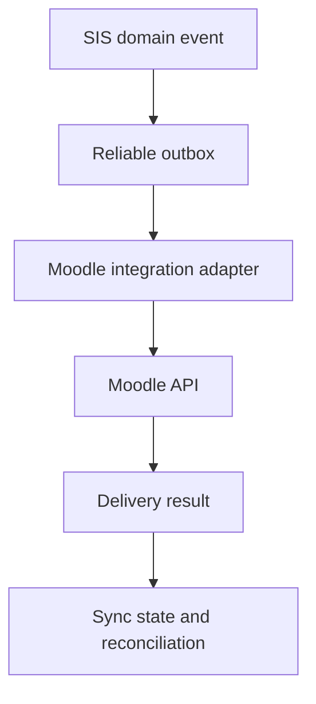

# Role Blueprint 12 — System, Identity, Moodle and Integration Operations Journey Book

This book combines all three recovered operational parts and preserves separation between platform administration, identity/access administration, Moodle administration and integration support.

## Recovered part 1

_Source record: `035-role-blueprint-12-part-1-system-administration-and-identity-access-administration.md`_

## Role Blueprint 12, Part 1 — System Administration and Identity & Access Administration

This part specifies the day-to-day operational experience for the two roles that protect the platform itself:

- **System Administrator** — platform configuration, availability, releases, service health and operational recovery.
- **Identity & Access Administrator** — identities, role assignments, access reviews, authentication recovery and privileged-access control.

Neither role is a “superuser” who may browse or change any student record.

### 12.1 Separate roles, separate authority

| Role | Primary responsibility | May do | Must not do |
|---|---|---|---|
| System Administrator | Platform configuration, service health, release controls, operational incidents | Monitor services, manage approved configuration, execute recovery runbooks | Alter admissions, results, finance balances, quality findings or support notes |
| Identity & Access Administrator | Accounts, role/scope assignments, MFA, access reviews, privileged access | Create/recover accounts, grant approved roles, revoke access, review logs | Invent institutional authority or access restricted case content |
| Security Administrator, where configured | Security policy, threat response and sensitive audit review | Investigate security incidents, enforce technical controls | Approve academic/financial/business decisions |
| Moodle Administrator | Managed separately in Part 2 | Moodle configuration and governed SIS sync | Change official SIS results or academic registration |
| Integration-support Officer | Managed separately in Part 3 | Monitor/reconcile integrations | Directly edit source-domain records to “fix” an event |

Header examples:

> **System Operations workspace · Production environment**

> **Identity and Access workspace · Main Institution**

Every elevated session records an active role, scope, reason and expiry.

### 12.2 System Administrator home page

The System Administrator starts with operational health, not personal records.

Primary areas:

- Service health
- Failed jobs and event deliveries
- Scheduled maintenance
- Release/change queue
- Backup and recovery verification
- Capacity and performance
- Security and access alerts
- Integration status summary
- Incident work queue
- Operational runbooks

Example card:

> **Result-release notification delivery delayed**  
> Queue age: 18 minutes  
> Affected process: official result notification  
> Official results remain released; notification delivery is delayed.  
> `Open incident`

The System Administrator sees process references and counts. Identifiable student records are revealed only when necessary for incident resolution and purpose-logged.

### 12.3 System configuration model

Configuration is versioned and classified.

| Configuration class | Examples | Change control |
|---|---|---|
| Technical | Service endpoints, queue limits, monitoring thresholds | Approved operational change |
| Security | Session duration, MFA policy, encryption keys, password rules | Security approval and heightened audit |
| Institutional workflow | Role mappings, approval workflow references | Business owner plus change control |
| Academic/financial policy | Progression rules, fee policy, grading rules | Owned by authorized domain; System Administrator cannot alter alone |
| Integration | Moodle mapping, payment-provider credentials, regulator endpoint | Integration owner plus technical approval |
| User interface | Branding, content version, notification template | Configured content approval |

The System Administrator can deploy approved configuration. They cannot create or alter academic policy merely because they can reach the configuration screen.

### 12.4 Action OPS-CHG-01 — Apply an approved production change

#### Entry point

> **Change queue → Approved changes → Open change**

The administrator sees:

- Change reference
- Requested configuration/version
- Business owner
- Risk classification
- Required approvals
- Planned maintenance window
- Rollback plan
- Test evidence
- Affected services and integrations
- Student/staff communication plan
- Implementation runbook

#### Pre-flight checks

Before the action becomes available, the system verifies:

- Change is approved and unexpired
- Correct environment
- Required backups/checkpoints exist
- Required test evidence is attached
- No incompatible active release exists
- Maintenance window is open, where required
- Administrator has current production-change authority

#### Execution interaction

Primary action:

> `Begin controlled deployment`

The page enters a progress state:

1. Create deployment/operation record.
2. Confirm backup or restore point.
3. Apply approved version.
4. Run automated health checks.
5. Run configured smoke tests.
6. Confirm service health.
7. Mark completed, rolled back or requires incident response.

The screen must never imply success before health checks pass.

#### Rollback

If a required check fails:

> Change did not pass the required health check. The new version has not been confirmed as safe.  
> `Start rollback` · `Open incident`

Rollback uses the approved rollback plan. It does not delete audit history or silently restore unrelated records.

#### Architecture

**Command:** `ExecuteApprovedOperationalChange`

**Events:**

- `OperationalChangeStarted`
- `OperationalChangeHealthCheckFailed`
- `OperationalChangeRolledBack`
- `OperationalChangeCompleted`

### 12.5 Action OPS-INC-02 — Triage and resolve an operational incident

#### Incident creation

An incident may originate from:

- Monitoring threshold breach
- Failed scheduled job
- Integration delivery failure
- User-reported outage
- Security alert
- Failed release
- Data-reconciliation discrepancy
- Backup verification failure

The incident record includes:

- Incident reference
- Affected service/process
- Time detected
- Severity under configured operational policy
- Impact statement
- Assigned incident owner
- Current status
- Customer/student/staff communication status
- Timeline
- Linked changes, alerts and runbooks
- Recovery and reconciliation tasks

#### Triage screen

The System Administrator sees:

> **Incident INC-2026-041 — Moodle enrolment sync delayed**  
> Started: 09:18  
> Impact: newly registered students may not yet see course access  
> Official registration remains valid in SIS  
> Current status: investigating  
> `Open runbook`

Available actions:

- Acknowledge and assign
- Start approved runbook
- Add impact update
- Escalate incident
- Place service in maintenance mode where permitted
- Trigger safe retry
- Mark technical recovery complete
- Create reconciliation task
- Request business-owner validation

The System Administrator cannot mark an incident fully resolved until technical recovery and required data reconciliation are complete.

#### Student-facing communication

The system communicates in plain language:

> Course access is taking longer than usual after registration. Your official registration is still recorded. Please do not register again. We are restoring course access.

It avoids technical terms such as “message broker failure.”

### 12.6 Backup, recovery and reconciliation

The System Administrator manages backup operations but must prove recoverability.

The workspace shows:

- Latest successful backup
- Backup age
- Encryption status
- Restore-test date and outcome
- Recovery-point objective
- Recovery-time objective
- Failed backup alerts
- Legal-hold/archive considerations

A successful backup job is not enough. The system schedules and records controlled restore tests.

After recovery, the administrator must complete or assign reconciliation:

- Events created during outage
- Payment/provider callbacks
- Moodle enrolment/assessment synchronization
- Notification queues
- Report snapshot integrity
- User changes made during degraded service

No partial recovery may be labelled complete.

---

## Identity and Access Administration

### 12.7 Identity & Access Administrator home page

Primary areas:

- New/updated identity requests
- Role and scope assignments awaiting approval
- Acting/delegated appointments
- Expiring role assignments
- Access-review campaigns
- Account recovery and verification cases
- Privileged-access requests
- Suspended/locked accounts
- Authentication/MFA incidents
- Sensitive access alerts

Example:

> **Dean role expires in 7 days**  
> Dr. Banda · School of Engineering  
> Acting appointment ends: 2 September 2026  
> `Review assignment`

### 12.8 Person identity versus account versus role

The system stores three separate concepts:

| Record | Meaning |
|---|---|
| Person identity | The individual: verified name, institutional/person identifier and approved contact channels |
| User account | Login credential and authentication state |
| Role assignment | Authority, scope, effective period, capabilities and delegation limits |

Creating an account does not automatically create a staff, Dean, lecturer, finance or administrator experience.

A person with multiple roles receives one account and explicitly switches workspace.

### 12.9 Action IAM-ROL-01 — Grant or change a role assignment

#### Entry point

> **Identity and access → Role assignments → Create assignment**

The administrator searches for the person using a permitted identifier. Search results are minimized to prevent broad browsing.

The assignment form requires:

- Person
- Role
- Organizational scope
- Effective start and end date
- Employment/appointment reference
- Authority source
- Approved capabilities
- Acting or permanent status
- Delegation limit
- Required approver
- Reason

Example:

> Role: School Dean  
> Scope: School of Engineering  
> Effective: 1 September 2026–31 August 2027  
> Appointment evidence: Senate/HR reference  
> Workspace: Dean  
> No authority to access counselling notes.

#### Validation

The system checks:

- Active appointment/authority evidence
- Conflicting roles
- Scope validity
- Segregation-of-duties conflicts
- Required training/acknowledgement
- Existing active assignment
- Required approvals
- Effective-date overlap

It warns but does not automatically deny legitimate multi-role cases. A person can be Dean and Lecturer, but their contexts remain separate.

#### Approval and activation

After required approval:

> `Activate role assignment`

The system creates the role assignment, notifies the person and adds it to access-review schedules.

**Command:** `GrantRoleAssignment`

**Events:**

- `RoleAssignmentRequested`
- `RoleAssignmentApproved`
- `RoleAssignmentActivated`
- `RoleAssignmentExpiryScheduled`

### 12.10 Action IAM-REC-02 — Recover account access

A student or staff member may begin from:

> **Sign in → Need help signing in?**

The flow supports approved recovery methods such as:

- Verified email
- Verified mobile number
- Identity proofing through approved institutional route
- Service-desk assisted recovery
- MFA recovery code
- In-person verification where configured

The system does not make a staff member answer security questions that rely on inaccessible personal memory as the only route.

#### Recovery states

- Recovery requested
- Identity verification pending
- Additional proof required
- Recovery approved
- Reset link issued
- Account restored
- Recovery denied
- Security escalation required

The Identity Administrator sees only the information necessary to verify recovery. They do not access the person’s academic, finance or counselling records.

### 12.11 Privileged access and “break-glass” access

Emergency elevated access is rare and tightly controlled.

A user requesting break-glass access must provide:

- Urgent operational reason
- Requested scope
- Duration
- Incident reference
- Approving authority where required

The system grants the minimum access for the shortest configured period, displays a persistent elevated-access banner, and records every action.

> **Emergency access active — expires in 25 minutes**  
> Reason: incident INC-2026-041  
> All actions are subject to enhanced audit.

Break-glass access is never used to browse counselling notes, alter results, bypass finance controls or make ordinary work easier.

### 12.12 Access reviews and revocation

The system schedules reviews by role risk level.

Reviewers receive:

> **Quarterly access review**  
> 18 role assignments require confirmation.  
> `Start review`

For each assignment, the reviewer can:

- Confirm still required
- Reduce scope
- Change end date
- Reassign review
- Revoke access
- Request clarification

Revocation takes effect according to configured security policy. Expired acting appointments revoke automatically unless renewed through the same governed workflow.

When access changes while a user is composing an action:

> Your role assignment has changed. This action was not completed.

Draft data is protected from unauthorized reopening.

### 12.13 Identity, access and recovery errors

| Situation | Required behaviour |
|---|---|
| Duplicate person identity suspected | Create matching-review case; do not merge automatically |
| Staff member’s appointment evidence missing | Role remains pending; no privileged workspace appears |
| Account is locked after repeated failures | Show neutral recovery route; log security event |
| MFA device lost | Use configured recovery; do not disable MFA permanently without verification |
| Role expiry occurs during session | End elevated action capability; preserve safe draft |
| Administrator assigns conflicting roles | Require segregation-of-duties review |
| User tries inaccessible recovery method | Offer approved accessible alternative |
| Account recovery appears suspicious | Pause recovery and route security review |
| Role assignment is revoked in error | Use controlled reinstatement with reason and audit; do not edit old history |

### 12.14 Acceptance requirements

Part 1 is accepted only when:

- System Administration and Identity & Access Administration have separate permissions.
- Operational changes require approved change records, health checks and rollback capability.
- Incidents remain open until recovery and required reconciliation are complete.
- Restore testing proves backup usability.
- A person, account and role assignment are separate records.
- Role assignments are scoped, time-bound, approved and reviewed.
- Multi-role users explicitly switch workspace.
- Access recovery is secure and has accessible alternatives.
- Privileged emergency access is time-limited, minimal and enhanced-audited.
- No administrator has unrestricted authority to browse or alter business-domain records.

---

## Recovered part 2

_Source record: `036-role-blueprint-12-part-2-moodle-administrator-real-sis-moodle-learning-integration.md`_

## Role Blueprint 12, Part 2 — Moodle Administrator: real SIS–Moodle learning integration

### 12.15 Integration boundary: who owns what

The SIS and Moodle remain separate systems with a controlled synchronization contract.

| Information/process | Authoritative system | Moodle role |
|---|---|---|
| Person and login identity | SIS/approved Identity Provider | Uses federated identity |
| Programme and official course registration | SIS | Receives approved enrolment |
| Official class list | SIS | Receives synchronized course participants |
| Course shell | SIS creates/authorizes offering; Moodle hosts learning space | Hosts teaching content and activity |
| Teaching assignment | SIS | Receives teaching role assignment |
| Tutorial Group (TG) membership | SIS by default | Receives group membership; may propose allowed local groups |
| Learning materials and activities | Moodle | Authoritative |
| Quiz/assignment activity and submission status | Moodle | Authoritative learning evidence |
| Official Continuous Assessment (CA) and final result | SIS | Moodle provides governed grade data for staging only |
| Official result release/progression | SIS | Cannot release or determine |

Moodle must never directly overwrite an official SIS mark, registration, progression outcome, or student record.

---

### 12.16 Moodle Administrator workspace

Header:

> **Moodle Administration workspace · Production learning environment**

Navigation:

- Sync health
- Course-shell queue
- Enrolment and role queue
- Tutorial Group queue
- Assessment mapping
- Grade-transfer staging
- Reconciliation cases
- Manual exception requests
- Moodle availability and maintenance
- Archive and retention
- Integration configuration

The home page answers:

1. Which students or staff are waiting for Moodle access?
2. Which course shells failed to create or update?
3. Which TG memberships are out of sync?
4. Which grade transfers require validation?
5. Which data mismatch could affect teaching or learning?
6. Which failure needs an incident, retry or domain-owner decision?

Example:

> **Course access delayed**  
> CSC 4792 · Semester 2, 2026  
> 14 newly registered students awaiting Moodle enrolment  
> Last sync attempt: 8 minutes ago  
> Official registration remains valid in SIS.  
> `Open reconciliation case`

### 12.17 Integration architecture

The integration uses reliable domain events, an outbox and an adapter. Moodle is never called directly from an academic-registration screen.

Examples of SIS events:

- `CourseOfferingPublished`
- `TeachingAssignmentConfirmed`
- `StudentAcademicRegistrationConfirmed`
- `StudentAcademicRegistrationCancelled`
- `TutorialGroupAssignmentChanged`
- `StudentIdentityUpdated`
- `CourseOfferingClosed`

The Moodle Adapter translates each event into Moodle-specific API calls. Moodle-specific failures never alter the underlying SIS event or official registration.

### 12.18 Core synchronization records

The system stores:

- `MoodleConnection`
- `MoodleCourseMapping`
- `MoodleUserMapping`
- `MoodleRoleMapping`
- `MoodleTutorialGroupMapping`
- `MoodleAssessmentMapping`
- `MoodleSyncOperation`
- `MoodleSyncCheckpoint`
- `MoodleReconciliationCase`
- `MoodleGradeTransferBatch`

Each record contains external identifiers, mapping/version information, last confirmed synchronization time, state, retry history and error classification.

A staff member does not fix a mismatch by editing an external identifier directly in production. They use a controlled mapping-correction case.

---

## Action MOD-SHL-01 — Create and manage a Moodle course shell

### 12.19 Trigger and preconditions

A course shell is created only after the SIS has an approved academic course offering.

Required SIS facts:

- Course offering exists
- Academic period is active
- Course title/code/version is valid
- Owning department/programme is assigned
- Teaching workspace owner is identified
- Moodle publication policy allows creation
- No conflicting active Moodle mapping exists

The event is:

> `CourseOfferingPublished`

### 12.20 Course-shell queue experience

The Moodle Administrator opens:

> **Course-shell queue → Awaiting creation**

A queue card shows:

> **CSC 4792 — Data Mining and Warehousing**  
> Semester 2, 2026 · 118 registered students  
> Lead lecturer: assigned  
> Shell state: awaiting Moodle creation  
> `Review shell`

The Administrator sees SIS facts and proposed Moodle mapping:

- Official course code/title
- Academic period
- Course offering identifier
- Department/programme scope
- Requested Moodle course category
- Publication/visibility date
- Teaching role assignments
- Expected participant count
- Existing historical shell, if any

They do not manually type a new course title unless an approved mapping rule or correction authorizes it.

### 12.21 Shell creation interaction

The primary action is normally automated. Where manual confirmation is configured, the Administrator selects:

> `Create Moodle shell`

The system performs:

1. Idempotency check against `CourseOfferingId + AcademicPeriod`.
2. Create or identify mapped Moodle category.
3. Create shell using approved template.
4. Apply course short name, full name and dates.
5. Apply controlled visibility state.
6. Create baseline Moodle roles and groups.
7. Store Moodle course identifier and mapping version.
8. Queue teaching/enrolment synchronization.
9. Run verification query.
10. Update sync state.

Confirmation:

> Moodle shell created and verified. Teaching staff and registered students will be synchronized next.

A shell can be:

- Planned
- Created—hidden
- Created—visible
- Creation failed
- Update required
- Closing
- Archived
- Retention hold

The Administrator cannot make an archived historical shell the active shell for a new offering without approved mapping and academic-owner confirmation.

### 12.22 Shell failure and recovery

| Situation | Required behaviour |
|---|---|
| Moodle API timeout | Mark `confirmation pending`; query before retrying |
| Duplicate Moodle course found | Open mapping-review case; do not create another shell |
| Invalid course template | Block creation; route to approved template configuration owner |
| Missing academic owner | Keep shell pending; request teaching-assignment correction |
| Course title changed in SIS | Synchronize permitted metadata; preserve Moodle teaching content |
| Course offering cancelled | Hide/close shell according to policy; preserve required learning records |
| Moodle is unavailable | Queue operation; SIS registration remains authoritative |
| Template has unapproved grade settings | Block publication; alert Moodle Administrator and academic configuration owner |

---

## Action MOD-ENR-02 — Synchronize students and teaching staff

### 12.23 Student enrolment workflow

A confirmed SIS academic registration produces:

> `StudentAcademicRegistrationConfirmed`

The integration first validates:

- Student has an active institutional identity
- Identity mapping exists or can be provisioned
- Moodle shell mapping exists
- Student registration is active
- Registration is within synchronization window
- No configured academic/disciplinary restriction blocks Moodle access
- No duplicate active enrolment mapping exists

The integration then:

1. Creates/updates Moodle user account through approved identity method.
2. Enrols student in the mapped course shell.
3. Applies student role.
4. Applies required Tutorial Group membership.
5. Records operation outcome.
6. Performs a verification check.
7. Updates SIS-facing learning-access status.

Student portal result:

> **Moodle access: active**  
> CSC 4792 was added to your learning area at 14:32.

If the operation is delayed:

> **Moodle access is being prepared**  
> Your official course registration is complete. Do not register again. We are restoring learning access.

### 12.24 Teaching-staff synchronization

A confirmed teaching assignment produces:

> `TeachingAssignmentConfirmed`

The Moodle role mapping is configured, for example:

| SIS teaching assignment | Moodle role |
|---|---|
| Lead Lecturer | Teacher |
| Lecturer | Teacher or configured equivalent |
| Tutor with quiz authority | Non-editing Teacher plus approved quiz capability, or configured restricted role |
| Tutor without quiz authority | Tutor/support role |
| External Examiner | Restricted reviewer role, if approved |
| Teaching Assistant | Configured limited role |

A Tutor may assign or administer quizzes only when:

- They have an approved course/TG teaching assignment.
- Quiz authority is explicitly granted.
- The Moodle role mapping includes only the approved capability.
- The authority is within effective dates.
- Their actions remain audit logged.

The Moodle Administrator cannot casually give a tutor broad course-editing power because “they help with the class.”

### 12.25 De-enrolment and access change

When registration is cancelled, suspended or changed, the SIS sends a domain event. Moodle access changes according to approved policy.

Possible outcomes:

- Remove from active course
- Suspend access while retaining record
- Move to historical/auditor role
- Retain access until a configured academic deadline
- Keep assessment evidence but prevent new submissions

The integration must preserve learning evidence where retention/policy requires it. It must not erase a student’s Moodle submissions because a registration was corrected.

### 12.26 Tutorial Group (TG) synchronization

A Tutorial Group is a managed academic grouping, not an informal Moodle group.

The SIS is authoritative for:

- TG identity
- Course offering
- Membership
- Tutor assignment
- Capacity, where configured
- Effective period

Example:

> **TG-CSC4792-04**  
> Tutor: M. Phiri  
> Members: 28 of 30  
> Effective: Semester 2, 2026

When membership changes, the event is:

> `TutorialGroupAssignmentChanged`

The adapter creates or updates the mapped Moodle group and membership.

Moodle may support teaching-only local grouping where policy permits, but it must be visibly labelled:

> Local Moodle group — not an official Tutorial Group

It cannot alter the SIS official TG assignment.

---

## Action MOD-GRD-03 — Governed Moodle assessment and grade transfer

### 12.27 Assessment mapping is mandatory

A Moodle quiz, assignment or activity does not automatically become an official CA component.

Before grade transfer, an authorized academic owner configures an assessment mapping:

- SIS course offering
- Moodle course shell
- Moodle activity
- Official assessment component
- Weight/maximum mark
- Eligibility rules
- Due date
- Grade scale/version
- Responsible lecturer/coordinator
- Moderation requirement
- Transfer schedule
- Whether manual review is mandatory

The Moodle Administrator manages the integration configuration; the academic owner approves the academic mapping.

Example:

> Moodle activity: Quiz 2  
> SIS component: Continuous Assessment Quiz 2  
> Maximum: 20  
> Transfer: staged for lecturer review  
> Official use: CA component only after approval

### 12.28 Grade-transfer staging queue

The Moodle Administrator opens:

> **Grade-transfer staging → Awaiting validation**

A batch card states:

> **CSC 4792 — Quiz 2**  
> 118 expected participants · 112 grade records received  
> 4 no-submission outcomes · 2 mapping exceptions  
> Mapping: CA-QUIZ2-v1  
> `Review transfer batch`

The system displays:

- Moodle activity and grade item
- Assessment mapping version
- Expected official class list
- Received grades
- Missing/no-submission status
- Exemptions/deferred status from SIS where permitted
- Out-of-range values
- Duplicates
- Moodle activity completion timestamp
- Data freshness
- Transfer checksum

The Moodle Administrator can resolve integration/mapping errors. They cannot certify grades as official or decide a student’s absence/eligibility.

### 12.29 Lecturer and Examinations handoff

After technical validation, the batch becomes:

> `Ready for academic review`

The responsible Lecturer or Course Coordinator sees:

> Moodle grade transfer ready for review  
> Quiz 2 · 112 grades imported  
> No submissions: 4  
> Technical mapping checks passed  
> `Review grade transfer`

Only the authorized academic workflow can approve grade data into the SIS assessment record. Moodle remains the learning source; SIS becomes official only after governed academic approval.

### 12.30 Grade-transfer failures

| Situation | Behaviour |
|---|---|
| Moodle activity deleted after mapping | Block transfer; create mapping exception |
| Grade scale differs from approved component | Block transfer; require academic mapping correction |
| Student appears in Moodle but not official SIS list | Do not create official grade; flag discrepancy |
| Registered student missing from Moodle | Create enrolment reconciliation task |
| Moodle grade changed after approved transfer | Create change-detection event; never overwrite official CA automatically |
| Lecturer attempts unofficial direct export | Mark as extract only; it cannot update official SIS marks |
| Duplicate Moodle grade event | Detect by activity/user/version; retain one staged record |
| Moodle unavailable during transfer | Preserve last confirmed batch; retry through queue |
| Assessment mapping expires | Stop new transfer and require authorized renewal |

---

## Action MOD-REC-04 — Reconcile SIS and Moodle differences

### 12.31 Reconciliation queue

The Moodle Administrator sees separate cases:

- SIS registration exists, Moodle enrolment missing
- Moodle enrolment exists, SIS registration inactive
- Staff role mismatch
- TG membership mismatch
- Course-shell metadata mismatch
- Assessment mapping mismatch
- Grade-transfer discrepancy
- Identity mapping conflict
- Historical course/archive issue

A case includes:

- SIS and Moodle facts side by side
- Last confirmed synchronization time
- Source events
- Retry history
- Current impact
- Safe recommended action
- Required domain owner, if any

Example:

> **Student enrolled in Moodle but not currently registered in SIS**  
> SIS status: registration cancelled 24 August  
> Moodle status: active student role  
> Impact: course access should be reviewed  
> `Suspend Moodle access` · `Request registration review`

The Administrator must not choose “make SIS registration active” from this screen.

### 12.32 Reconciliation action rules

| Difference | Moodle Administrator may do | Must route to |
|---|---|---|
| SIS student registration missing in Moodle | Retry/provision Moodle enrolment | Registration if source registration is unclear |
| Moodle-only participant | Suspend Moodle role under policy | Registration/records for academic source decision |
| Tutor has wrong Moodle capability | Correct approved role mapping | Teaching-assignment owner if authority unclear |
| TG mismatch | Retry SIS-authoritative group update | Programme/department if official TG data needs correction |
| Moodle activity no longer mapped | Disable transfer and preserve records | Academic owner for new mapping |
| Moodle grade differs after SIS approval | Record discrepancy and alert | Lecturer/Examinations controlled amendment workflow |
| Identity collision | Pause sync and protect both accounts | Identity & Access Administrator |

### 12.33 Moodle availability and maintenance

The Moodle Administrator can schedule maintenance only through approved operational change controls.

Student-facing message:

> Moodle will be unavailable from 22:00 to 23:00 for planned maintenance. Your official SIS registration and records are unaffected. Please save work before the maintenance period.

For unplanned outage:

> Moodle is temporarily unavailable. Your official registration remains valid. We are restoring access; do not submit duplicate registration requests.

The system records whether assessment deadlines require an academic-owner decision. The Moodle Administrator cannot unilaterally extend assessment deadlines or change grades.

### 12.34 Archive and end-of-period workflow

At course end, the Moodle Administrator receives a closure queue:

- Grades awaiting approved transfer
- Active assessment attempts
- Required course export/archive
- Teaching-content retention state
- Student access policy
- Legal/appeal holds
- New-period shell relationship

The closure process:

1. Confirm official grade-transfer window/status.
2. Preserve Moodle activity/submission evidence according to policy.
3. Apply student-access end-date policy.
4. Archive course shell and mappings.
5. Retain required audit/export references.
6. Block accidental reuse as new-period shell.
7. Confirm archive integrity.

Historical Moodle data remains linked to the original course offering and period.

### 12.35 Moodle commands, events and audit

#### Commands

| Command | Authorized role |
|---|---|
| `CreateMoodleCourseShell` | Moodle integration workflow / Moodle Administrator |
| `SynchronizeMoodleEnrolment` | Integration workflow |
| `SynchronizeMoodleTeachingRole` | Integration workflow |
| `SynchronizeMoodleTutorialGroup` | Integration workflow |
| `ApproveMoodleAssessmentMapping` | Authorized academic owner |
| `StageMoodleGradeTransfer` | Integration workflow |
| `ResolveMoodleReconciliationCase` | Moodle Administrator |
| `ArchiveMoodleCourseShell` | Moodle Administrator under policy |
| `ScheduleMoodleMaintenance` | Moodle Administrator via approved change |

#### Events

- `MoodleCourseShellCreated`
- `MoodleEnrolmentSynchronized`
- `MoodleTeachingRoleSynchronized`
- `MoodleTutorialGroupSynchronized`
- `MoodleGradeTransferStaged`
- `MoodleGradeDiscrepancyDetected`
- `MoodleReconciliationRequired`
- `MoodleCourseArchiveCompleted`
- `MoodleIntegrationHealthDegraded`

Audit captures:

- Source SIS event
- Moodle API request/result reference
- Mapping version
- Acting user or service identity
- Before/after synchronization state
- Retry and reconciliation action
- Any manual override request
- Grade-transfer batch checksum
- Access/export/archive operation

### 12.36 Accessibility, mobile and low-bandwidth requirements

- Students can reach learning content from the SIS portal through a clear **Learning area** link, but the integration is real—not merely the link.
- The student portal shows readable Moodle access/sync state.
- Staff queues work on low-bandwidth browsers with pagination and server-side filtering.
- All manual reconciliation actions support keyboard operation and text status.
- Sync progress and failures are announced to screen readers.
- Errors explain the affected course/process and safe next action.
- No student is asked to repeat academic registration because Moodle access is delayed.

### 12.37 Part 2 acceptance requirements

Part 2 is accepted only when:

- SIS remains authoritative for identity, official registration, staff assignment, official Tutorial Groups and official results.
- Moodle has real synchronized shells, enrolments, staff roles and TG membership.
- A tutor’s quiz authority is explicit, scoped and time-bound.
- Moodle assessment data requires an approved mapping and staged academic review before becoming official.
- Moodle cannot overwrite official CA, final results, progression or registration.
- Sync operations are idempotent, monitored, retryable and reconcilable.
- SIS/Moodle mismatches are handled through controlled cases, not manual source-record edits.
- Moodle outages do not falsely change official academic status.
- Historical course materials, submissions and mappings are retained and archived under policy.
- Every mapping, sync, transfer, reconciliation, exception and archive action is auditable.

---

## Recovered part 3

_Source record: `037-role-blueprint-12-part-3-integration-support-officer-monitored-recoverable-and-governed-ex.md`_

## Role Blueprint 12, Part 3 — Integration-support Officer: monitored, recoverable and governed external connections

The Integration-support Officer ensures that external services exchange the right information at the right time. They do not use integrations as a shortcut to edit admissions, results, payments, student-support cases or reports.

### 12.38 Integration-support workspace

Header:

> **Integration Support workspace · Production environment**

Navigation:

- Integration health
- Event-delivery queue
- Reconciliation cases
- Provider callbacks
- Scheduled imports
- Mapping configuration
- Incident handover
- Replay and recovery
- Data-quality exceptions
- Integration archive

The home page is operational and action-oriented:

- Failed or delayed deliveries
- Provider callbacks awaiting verification
- Reconciliation backlog
- Expiring credentials/certificates
- Scheduled import failures
- Dead-letter events
- Integration incidents
- Recent recovered operations
- Mapping changes awaiting approval

Example:

> **Payment-provider callback delayed**  
> 27 payment confirmations awaiting provider response  
> Oldest: 19 minutes  
> Student accounts are not yet updated.  
> `Open queue`

### 12.39 Integration design contract

Every integration uses a shared contract:

| Requirement | Required behaviour |
|---|---|
| Source authority | Define which system owns each fact |
| Adapter | Isolate provider-specific API/file/protocol logic |
| Event/outbox | Record institutional event before external delivery |
| Idempotency | Safely handle retry and duplicate delivery |
| Mapping version | Record each identifier/data transformation version |
| Validation | Reject unsafe/malformed/excessive data |
| Reconciliation | Compare source and destination after delivery |
| Audit | Record request, response, retry, correction and access |
| Failure recovery | Retry safely; route unresolved differences to owner |
| Security | Least-privilege credentials, rotation and secrets isolation |

An integration may report external facts. It cannot independently perform an institutional decision.

### 12.40 Integration catalogue

The platform supports configurable adapters for:

- Identity provider / authentication service
- Moodle
- Payment providers, banks and mobile-money services
- Email, SMS and notification providers
- Qualification/evidence verification services, including configured ECZ/ZAQA-type sources
- Document malware-scanning and storage service
- Regulatory submission endpoint
- Reporting/analytics platform
- HR or staff-assignment source, where connected
- Other institution-approved services

Each integration has:

- Owner
- Purpose
- Data categories
- Source and destination authority
- Credential owner
- Operational hours/service-level target
- Retry policy
- Reconciliation frequency
- Failure escalation route
- Retention/monitoring requirements
- Privacy assessment
- Effective dates

### 12.41 Integration health screen

Opening an integration shows:

> **Mobile-money payment provider**  
> Status: degraded  
> Last successful callback: 14:02  
> Delayed events: 27  
> Failed events: 0  
> Credential expiry: 68 days  
> Reconciliation due: 16:00  
> `View event queue` · `Open incident`

The officer sees:

- Availability state
- Last successful delivery
- Event counts by state
- Queue age
- Error category trend
- Credentials/configuration state, never secret value
- Recent mapping/version changes
- Reconciliation result
- Incident links
- Runbook

Statuses use text:

- Healthy
- Degraded
- Delayed
- Failing
- Maintenance
- Disabled by authorized decision
- Unknown—health check unavailable

---

## Action INT-EVT-01 — Review, retry and recover an event delivery

### 12.42 Event queue

The officer opens:

> **Event delivery queue → Needs attention**

Each event shows:

- Institutional event type
- Source-domain reference
- Destination integration
- Created time
- Last attempt
- Attempt count
- Error category
- Idempotency reference
- Current impact
- Safe next action

Example:

> **PaymentReceived event**  
> Payment reference: masked  
> Destination: Finance allocation service  
> Status: delivery failed—destination timeout  
> Attempts: 2 of 5  
> `Review event`

The officer sees only minimum business context. A payment reference is masked; a counselling referral displays no narrative.

### 12.43 Event detail and safe actions

The event page shows:

- Source event payload in minimized/secured form
- Schema version
- Mapping version
- Delivery attempts
- Provider response/error classification
- Related reconciliation case
- Retry schedule
- Runbook
- Audit timeline

Available actions:

- Retry now, if retry-safe
- Pause further delivery
- Acknowledge operational issue
- Open/attach incident
- Request mapping review
- Route to domain owner
- Mark as resolved only after confirmed delivery/reconciliation
- Replay approved range, where authorized

The officer cannot edit the source event payload to make it “work.”

#### Retry interaction

Selecting `Retry now` shows:

> This will resend the same event using idempotency reference `…`. It will not create a second payment, enrolment, notification or record change if the destination already processed it.

The button becomes `Retrying…` and prevents duplicate clicks.

**Command:** `RetryIntegrationEventDelivery`

**Events:**

- `IntegrationEventRetryScheduled`
- `IntegrationEventDelivered`
- `IntegrationEventDeliveryFailed`
- `IntegrationEventMovedToDeadLetterQueue`

### 12.44 Dead-letter events

An event enters the dead-letter queue only after configured retries fail or the failure is non-retryable.

Examples:

- Invalid destination mapping
- Revoked destination credential
- Unsupported schema
- Permanently malformed external callback
- Source reference no longer resolvable
- Policy-blocked transmission

A dead-letter record requires a resolution path:

- Correct mapping and replay
- Correct source through authorized domain workflow, then emit new event
- Mark as no longer applicable with authorization
- Escalate to security/incident response
- Retain for audit

It cannot be deleted to make the queue look clean.

---

## Action INT-REC-02 — Reconcile an external integration

### 12.45 Reconciliation principles

Reconciliation compares institutional and external facts after transfer. It detects differences; it does not decide which system is “right” without knowing the authority boundary.

Example authority rules:

| Integration | External system may confirm | SIS/domain remains authoritative for |
|---|---|---|
| Payment provider | Payment received, reversed, payout completed | Charge allocation, financial clearance, refund approval |
| Moodle | Learning activity/submission/grade data | Registration, official CA/final result |
| Identity provider | Authentication assertion | Person identity, role/scope authority |
| Qualification verifier | Verification response | Admissions decision |
| SMS/email provider | Delivery status | Institutional notification record and workflow state |
| Regulator endpoint | Delivery acknowledgement/query | Institutional source records and report approval |

### 12.46 Reconciliation queue

The officer selects:

> **Reconciliation → Open cases**

A case contains:

- Integration and data type
- Source record reference
- External record reference
- Last confirmed sync time
- Difference detected
- Authority matrix
- Impact
- Assigned owner
- Recommended safe action
- Evidence and event history

Example:

> **Payment received externally but not allocated**  
> Provider: mobile money  
> External amount: K1,250  
> Finance status: unmatched payment  
> Authority: provider confirms value; Finance allocates charges  
> `Route to Finance reconciliation`

The officer cannot allocate payment value from this case.

### 12.47 Reconciliation actions

| Difference | Integration-support action | Domain-owner action |
|---|---|---|
| Provider payment exists, no SIS payment record | Verify callback/import and replay safely | Finance matches and allocates |
| SIS charge missing at provider | Confirm payment-intention sync | Finance determines whether new intention is needed |
| Moodle student access missing | Retry valid enrolment event | Registration fixes source status if incorrect |
| Qualification verification response delayed | Retry/check provider and log state | Admissions Officer assesses result |
| Email delivery failed | Retry/alternative approved channel | Workflow owner decides any escalation |
| Regulator acknowledgement absent | Check delivery reference | Regulatory user decides resubmission after approval |
| Identity-provider identifier mismatch | Pause sync, protect accounts | Identity Administrator resolves identity mapping |

### 12.48 Reconciliation completion

A case may be marked technically reconciled only when:

- Destination delivery is confirmed, or
- Correct domain action has been recorded, or
- The event is authorized as no longer applicable, and
- Required downstream state has been checked.

The interface asks:

> What proves this difference is resolved?

The officer selects evidence such as confirmed response, reconciliation report, corrected mapping version or linked domain case. A one-word note is insufficient.

---

## Action INT-MAP-03 — Change an integration mapping safely

### 12.49 Mapping change request

Mappings convert controlled identifiers and fields across systems. They are versioned because changing one can affect thousands of records.

The officer begins:

> **Mapping configuration → Request mapping change**

Fields:

- Integration
- Existing mapping version
- Proposed mapping
- Business purpose
- Affected record types
- Estimated volume
- Data classification impact
- Test plan
- Rollback plan
- Required domain owner
- Required technical/security approval
- Planned effective date

Example:

> Change: map SIS Tutorial Group `TG-CSC4792-04` to revised Moodle group identifier.  
> Impact: 28 student memberships.  
> Validation: compare membership before/after; no change to official SIS TG record.

The officer cannot activate the change directly if it affects academic, finance, identity or regulatory data.

### 12.50 Test, approve and release mapping

The workflow is:

1. Draft mapping.
2. Test with approved synthetic or non-production sample.
3. Record expected/actual comparison.
4. Obtain domain and technical approval.
5. Schedule release.
6. Apply mapping version.
7. Monitor first live events.
8. Reconcile affected records.
9. Roll back if required.

A mapping is not “fixed” merely because the technical request returns HTTP success.

---

## Action INT-IMP-04 — Process a scheduled import

### 12.51 Import queue

Scheduled imports may bring approved data from banks, sponsors, qualification verification services or other sources.

The officer sees:

- Import name
- Expected schedule
- Last successful import
- File/API reference
- Row count
- Valid rows
- Rejected rows
- Duplicate rows
- Validation state
- Reconciliation state

For a bank file:

> **Daily bank statement import**  
> Received: 1,240 rows  
> Accepted for Finance reconciliation: 1,231  
> Rejected: 9 malformed rows  
> `Review rejected rows`

A malformed row is isolated; valid rows may proceed if policy permits. The officer cannot manually adjust amount, account number or transaction date to force acceptance.

### 12.52 Import validation

The system validates:

- Source authenticity/signature where available
- Expected file/API schema
- File checksum
- Duplicate delivery
- Date/period validity
- Mandatory identifiers
- Field type/range
- Malicious/unexpected content
- Record count anomaly
- Mapping version

Rejected content is retained with a reason and controlled access. It is not silently discarded.

---

### 12.53 Notification provider integration

Notifications have two separate facts:

1. **Institutional notification created** — authoritative workflow record.
2. **Channel delivery status** — provider feedback.

The Integration-support Officer monitors:

- Queued
- Sent to provider
- Delivered where supported
- Failed
- Bounced
- Retried
- Suppressed by preference/policy
- Provider unavailable

A failed email/SMS does not automatically mean the student has ignored a required task. The originating workflow decides approved escalation, such as portal notification, alternative channel or staff task.

Sensitive messages remain neutral outside the portal:

> You have an update from the university. Sign in securely to view it.

---

### 12.54 Qualification/evidence verification integration

For admissions evidence verification, the integration can:

- Submit a permitted verification request
- Receive a verification response
- Store source, date, response status and reference
- Detect mismatch or unavailable service
- Route the case to an Admissions Officer

It cannot:

- Admit/reject an applicant
- Decide equivalence
- Replace human review of unclear evidence
- Change an applicant’s submitted document
- Treat a failed external lookup as proof of fraud

Applicant-facing wording:

> Your qualification verification is still in progress. We will contact you if more information is required.

---

### 12.55 Security, credentials and secrets

The Integration-support Officer can view credential health but not raw secret values.

They can see:

- Credential owner
- Last rotation date
- Expiry date
- Scope/permissions summary
- Environment
- Associated integration
- Rotation runbook
- Recent authentication failures

Credential rotation follows approved change control. Old credentials are revoked only after verified cutover, unless an urgent security procedure requires otherwise.

Integration logs mask secrets, authentication headers, personal identifiers and financial references as required.

### 12.56 Integration incidents and business communication

When an integration failure affects users, the officer works with the System Administrator and domain owner.

The incident page separates:

- Technical status
- Business impact
- Student/staff communication
- Recovery action
- Reconciliation action
- Closure evidence

Example:

> **Identity-provider authentication disruption**  
> Technical: login assertion failures from provider  
> Business impact: some users cannot sign in  
> Safe communication: “Sign-in is temporarily unavailable. Your academic and financial records remain unchanged.”  
> Recovery: provider escalation and fallback policy  
> Closure: successful login tests plus queued authentication-event reconciliation

The officer does not send unrelated institutional messages or disclose provider/internal infrastructure detail.

### 12.57 Integration archive and retention

Archived integration records include:

- Integration definitions and ownership
- Mapping versions
- Event payload references
- Delivery attempts
- Provider responses
- Reconciliation cases
- Import files/checksums
- Credential-rotation history
- Incident links
- Export/access logs
- Retired adapters and compatibility notes

Retention is set by data classification, regulatory obligation, finance/audit need and institutional policy. A legal hold prevents routine disposal.

### 12.58 Commands, events and audit

#### Commands

| Command | Authorized role |
|---|---|
| `RetryIntegrationEventDelivery` | Integration-support Officer |
| `PauseIntegrationDelivery` | Authorized Integration-support Officer |
| `CreateIntegrationReconciliationCase` | Integration workflow / Officer |
| `ResolveIntegrationReconciliationCase` | Integration-support Officer with evidence |
| `RequestIntegrationMappingChange` | Integration-support Officer |
| `ApproveIntegrationMappingChange` | Domain/technical approvers |
| `ReplayApprovedIntegrationRange` | Authorized Officer |
| `AcknowledgeIntegrationIncident` | Integration-support Officer |
| `RotateIntegrationCredential` | Authorized technical/security role |

#### Events

- `IntegrationHealthDegraded`
- `IntegrationEventDeliveryFailed`
- `IntegrationEventDelivered`
- `IntegrationReconciliationRequired`
- `IntegrationReconciliationResolved`
- `IntegrationMappingChangeRequested`
- `IntegrationMappingVersionActivated`
- `ScheduledImportFailed`
- `ExternalProviderCallbackReceived`
- `IntegrationCredentialExpiring`
- `IntegrationIncidentEscalated`

Every operation records the acting user/service identity, integration, source event, mapping version, scope, reason, retries, linked incident, evidence of resolution and timestamps.

### 12.59 Accessibility and failure recovery

- Queues use plain-language error categories and keyboard-operable filters.
- A failed event always shows its business impact and safe next step.
- Retry controls explain whether the operation is idempotent.
- Error details provide a technical reference for staff but avoid exposing secrets.
- Low-bandwidth mode supports paginated lists and delayed document loading.
- Screen readers receive updates when an event moves from retrying to delivered/failed.
- Manual corrections are routed to the authoritative domain workflow; they are never performed by editing a queue record.

### 12.60 Part 3 acceptance requirements

Part 3 is accepted only when:

- Every integration has a documented authority boundary, owner, adapter, mapping version, retry and reconciliation policy.
- External events are delivered through reliable, idempotent processing.
- Failed events, dead letters and imports cannot be silently deleted.
- Integration-support staff cannot change source-domain academic, financial, admissions or support records.
- Reconciliation proves resolution against the correct authority boundary.
- Mapping changes are tested, approved, versioned, monitored and reversible.
- Notification delivery is separate from institutional workflow completion.
- Qualification verification assists admissions but never decides it.
- Credentials are scoped, rotated and never exposed in logs.
- Every integration action, retry, replay, import, mapping change and reconciliation is auditable.

**Role Blueprint 12: Operations users is complete.**
