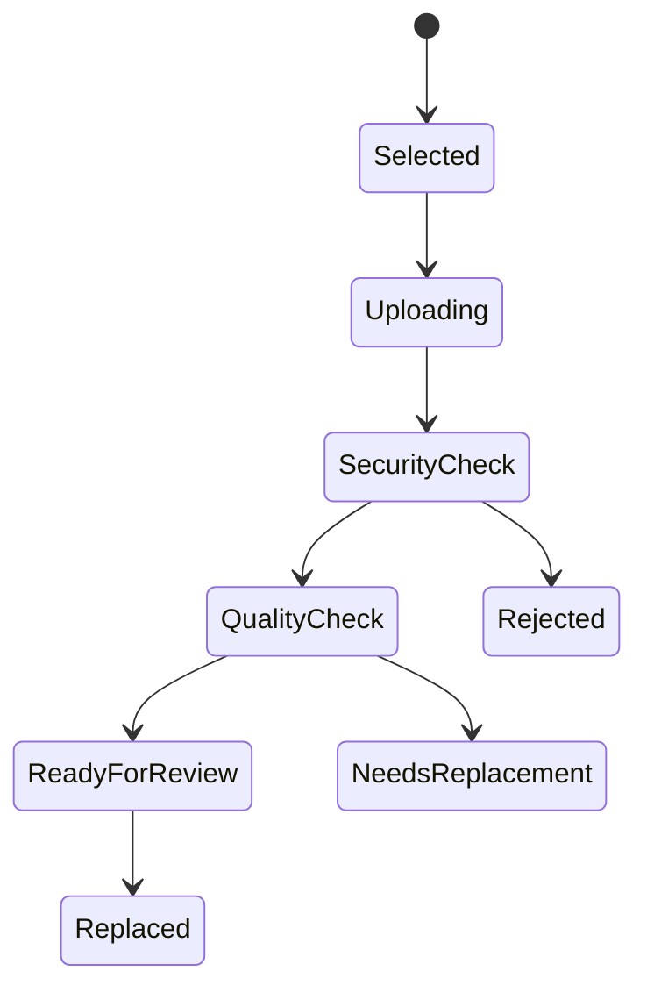

# Cross-Blueprint Implementation Set, Part 2B — Saving, drafts, multi-step forms, upload and formal submission

> Approved cross-blueprint implementation contract.

## 14.12 `UI-SAVE-001` — Save state and draft recovery

### Purpose

Make it clear whether information is only in the current browser, saved as an institutional draft, submitted, or awaiting confirmation.

### Required visible states

| State | User-facing text |
|---|---|
| Local unsaved change | `Changes not yet saved` |
| Saving | `Saving…` |
| Saved draft | `Draft saved at 14:32` |
| Save failed | `We could not save your changes. Try again.` |
| Offline/connection issue | `Connection lost. Your latest changes may not be saved yet.` |
| Submitted | `Submitted on 25 August 2026 at 14:32` |
| Submission confirmation pending | `Checking whether your submission was received…` |

Never use only a spinning icon or a green tick without text.

### Autosave rules

Autosave is allowed only for workflows explicitly marked as draftable:

- Application draft
- Student request draft
- Evidence response draft
- Quality-review assessment draft
- Support request draft, subject to strict privacy controls
- Action-plan draft

Autosave is not used for:

- Final approval
- Result release
- Payment confirmation
- Regulatory submission
- Refund approval
- Disciplinary decision
- Certificate authorization

Those actions require deliberate confirmation.

### Save interaction

- Trigger save after a short pause following meaningful change, when the form is draftable.
- Save before leaving a multi-step form where possible.
- Do not repeatedly display disruptive “Saved” notifications.
- If save fails, keep the user’s current values and provide retry.
- If the server reports a concurrent change, do not overwrite it silently.

### Concurrent edit conflict

> **This record changed while you were editing it.**  
> Your draft has not overwritten the newer record.  
> `Compare changes` · `Reload latest version` · `Save a copy for review`

The user sees what changed, who changed it where appropriate, and when. Sensitive records restrict comparison according to access policy.

---

## 14.13 `UI-FLOW-001` — Multi-step task flow

### Purpose

Support long, high-stakes journeys such as applications, registration, evidence submission, policy configuration and support requests without overwhelming the user.

### Anatomy

- Task title
- Short purpose statement
- Named step list
- Current-step indicator
- Step completion state
- Step content
- Back action
- Save draft/exit action where permitted
- Continue action
- Final review/submission step
- Help/support route

### Step naming rules

Steps must describe the user’s goal, for example:

1. Choose programme
2. Personal details
3. Qualifications
4. Supporting documents
5. Review and submit

Not:

1. Step one
2. Data capture
3. Attachments
4. Confirmation

### Step behaviour

- A user can return to completed steps before final submission.
- Future steps remain unavailable when prerequisites are missing, with an explanation.
- The system saves draft state on each successfully completed step.
- A step is marked complete only when required fields currently pass validation.
- A later change that invalidates another step marks the affected step `Needs attention`.

Example:

> **Qualifications — needs attention**  
> You changed your country of qualification. Review the evidence requirements before submitting.

### Mobile behaviour

- Use a compact progress summary, such as `Step 2 of 5: Personal details`.
- Allow opening the full step list.
- Keep Back, Save draft and Continue readable and reachable without overlaying content.
- Do not force horizontal scrolling.

---

## 14.14 `UI-UPLOAD-001` — Supporting-document upload

### Purpose

Receive evidence safely and clearly, including application documents, handwritten signed letters, academic evidence, policy evidence, refund evidence and approved supporting records.

### Required anatomy

- Document requirement title
- Why it is needed
- Required/optional state
- Accepted file types
- Maximum size
- Quality guidance
- Select/upload control
- Upload progress
- Scan/validation state
- Preview/download action where permitted
- Replace/remove action where permitted
- Version/status history

Example:

> **Handwritten signed programme-change letter — required**  
> Include your name, student number, requested programme, reason, date and signature.  
> Upload a clear PDF, JPG or PNG, up to 10 MB.

### Upload state model

### Safety checks

The upload service must:

- Accept only configured file types.
- Inspect actual file content, not filename alone.
- Scan for malware.
- Create file checksum.
- Store classification and retention rule.
- Strip or control unsafe active content where appropriate.
- Reject encrypted/protected files if they cannot be safely reviewed, with a clear message.
- Prevent direct external-file URLs from bypassing the upload process.

### Document-quality checks

Where technically feasible, the system checks:

- File can open
- Page/image is readable enough
- Orientation
- Excessive blur/darkness
- Missing pages where count is known
- Duplicate file checksum
- Required signature area where relevant, as a review prompt—not an automatic legal conclusion

A quality check is assistance, not final verification.

### User messages

| Situation | Message |
|---|---|
| Upload in progress | `Uploading document… 62%` |
| Malware/security failure | `This file could not be accepted because it did not pass the security check. Please upload a safe copy.` |
| Unreadable image | `This image may be difficult to read. Upload a clearer photo or scan before submitting.` |
| Wrong file type | `Upload a PDF, JPG or PNG file.` |
| File too large | `This file is larger than the 10 MB limit. Use a smaller clear copy.` |
| Duplicate document | `This appears to be the same file already uploaded. Review the existing document before uploading again.` |
| Connection lost | `Upload paused. Keep this page open and retry when your connection returns.` |

The user does not need to re-enter other form data because a document upload failed.

### Replacement and versioning

A submitted document is not overwritten.

If replacement is permitted:

> **Replace document**  
> The earlier file will remain in the secure history. Explain why you are replacing it.

Replacement reasons:

- Clearer copy
- Wrong document
- Updated document
- Requested clarification
- Other approved reason

Staff cannot silently replace an applicant’s/student’s uploaded document.

---

## 14.15 `UI-UPLOAD-002` — Document review and verification status

### Purpose

Show progress after upload without misleading the user that an uploaded document has already been accepted as authentic.

Approved states:

- Draft upload
- Uploaded—security check in progress
- Uploaded—ready for review
- Verification in progress
- Accepted
- Clarification required
- Replacement required
- Rejected with reason
- Expired/superseded

Applicant/student view:

> **Academic transcript**  
> Status: Verification in progress  
> Last updated: 25 August 2026  
> No action is needed unless we ask for clarification.

Staff view includes reviewer assignment, evidence source and verification notes according to role.

No user-facing status says merely `Pending`.

---

## 14.16 `UI-REVIEW-001` — Review before formal submission

### Purpose

Give the user one clear opportunity to inspect all submitted information, identify missing items and understand declarations before creating an institutional record.

### Anatomy

- Summary by named section
- Completion/missing status
- `Edit` link for each editable section
- Document list and status
- Fees/payment status where relevant
- Declaration(s)
- Submission consequences
- Final primary action
- Support route

Example:

> **Review your application**  
> Check your details before submission. After submitting, some changes may require a formal correction request.

Each section shows either:

> **Qualifications — complete**  
> 3 qualifications entered  
> `Edit`

or:

> **Supporting documents — action needed**  
> Handwritten signed declaration letter is missing.  
> `Add document`

### Declaration controls

A declaration must:

- State exactly what the user confirms.
- Use a required checkbox only when legally/processually appropriate.
- Link to full policy/terms where needed.
- Record declaration wording version, time and authenticated person.
- Avoid pre-ticked agreement boxes.
- Be readable without scrolling through a tiny panel.

### Submission confirmation

Before the final action, show:

> `Submit application`  
> You will receive a reference number after the institution confirms receipt.

For irreversible/high-impact actions, confirmation repeats the action in plain language:

> You are about to submit your programme-change request. You can no longer edit it directly after submission.

---

## 14.17 `UI-SUBMIT-001` — Duplicate-submission prevention

### Purpose

Prevent accidental repeated applications, payments, requests, approvals and regulatory submissions when users double-click, refresh, reopen a tab or lose connection.

### Required behaviour

1. Create an idempotency reference before formal submission.
2. Disable repeated primary action after first valid activation.
3. Change button text to meaningful progress:
   - `Submitting application…`
   - `Saving decision…`
   - `Confirming payment…`
4. Retain submission payload and idempotency reference safely.
5. On uncertain network state, check server outcome before enabling another attempt.
6. Return the existing confirmation if the same request was already accepted.

### Uncertain outcome message

> **We could not confirm whether your request was received.**  
> Do not submit again yet. We are checking your reference.

Possible final outcomes:

- Submission confirmed
- Submission not received; safe to retry
- Submission received; confirmation delayed
- Submission already exists; view existing record
- Manual support required

### Confirmation receipt

Every formal submission produces:

- Reference number
- Submission date/time
- Submitted action/type
- Current status
- Next step
- Link to record
- Receipt/download option where appropriate

The system must not call something “submitted” until the authoritative workflow has accepted it.

---

## 14.18 `UI-DRAFT-001` — Leave, discard and resume

When leaving an unsaved or draftable task, show the correct prompt.

### Unsaved change

> You have changes that are not saved.  
> `Save draft and exit` · `Keep editing` · `Discard changes`

### Submitted record

Do not show `Save draft` after formal submission. Show:

> This request was submitted on 25 August 2026.  
> `View status` · `Request correction`, if policy permits

### Resume list

The home page shows relevant unfinished work:

> **Continue your application**  
> Last saved: 25 August at 14:32  
> Next step: Supporting documents  
> `Resume`

Draft access expires and is deleted/archived only under configured retention policy. The user is notified before a draft is due to expire where policy permits.

## 14.19 Security, privacy and audit boundaries

The system records operational events such as:

- Draft created/saved/submitted
- Document upload attempted/completed/rejected
- Document version replaced
- Declaration accepted
- Submission reference created
- Duplicate prevented
- Review/verification state changed

It does not log:

- Password values
- Verification codes
- Full sensitive document contents in ordinary logs
- Raw counselling/free-text content
- Unnecessary keystrokes

Document viewing, download and replacement are sensitive audit events according to classification.

## 14.20 Acceptance requirements

Part 2B is accepted only when:

- Draft, saved, submitted and uncertain submission states are clearly different.
- Long workflows have named steps, safe navigation and retained progress.
- Document uploads are scanned, classified, versioned and recoverable.
- Handwritten-letter requirements can be configured by request type.
- Upload does not mean document verification or acceptance.
- Every formal submission has review, declaration, idempotency and receipt behaviour.
- Connection loss never causes blind resubmission or loss of valid information.
- Concurrent edits cannot silently overwrite another user’s change.
- Components are accessible, mobile-ready, low-bandwidth aware and free of unnecessary visual decoration.
