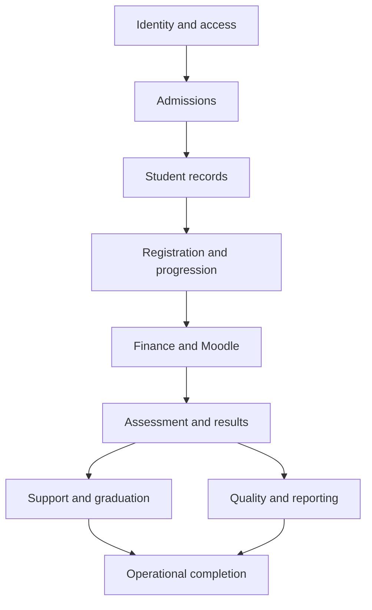

# Section 22 — MVP-to-complete-system expansion roadmap

> Approved final review/roadmap record.


## 22.1 Completion model

Each module progresses through four maturity levels:

| Level | Meaning |
|---|---|
| Designed | Requirements, permissions, workflows and tests are documented |
| Scaffolded | Module boundary, contracts and configuration structure exist |
| Functional | Core vertical journey works and is tested |
| Operational | Failure recovery, audit, security, accessibility and reporting are complete |

A module cannot be called complete merely because its main page opens.

## 22.2 Release progression

### Foundation releases

| Release | Outcome |
|---|---|
| `v0.1.0` | Repository, Docker, CI, documentation and design-system foundation |
| `v0.2.0` | Identity, authentication and authorization foundation |
| `v0.3.0` | Applicant application and document-submission journey |
| `v0.4.0` | Admissions evidence review, decision and offer |
| `v0.5.0` | Student conversion and academic registration |
| `v0.6.0` | Finance simulation, payment and clearance |
| `v0.7.0` | Moodle enrolment simulation and recovery |
| `v0.8.0` | Assessment staging and result release |
| `v0.9.0` | Audit, notifications, operations and demo hardening |
| `v1.0.0` | Approved presentation MVP |

Each release remains usable and demonstrable.

## 22.3 Expansion after the MVP

### Release family 1.1 — Student and academic depth

- Student profile correction requests
- Programme and study-plan management
- Course-add/drop workflows
- Prerequisite and repeat handling
- Academic progression calculation
- Deferred and supplementary assessment
- Academic standing and intervention
- Transcript basis and result amendment

### Release family 1.2 — Teaching and Moodle depth

- Teaching assignments
- Tutorial Group management
- Moodle course-shell provisioning
- Enrolment synchronization
- CA and grade-transfer staging
- Academic-calendar/deadline synchronization
- Reconciliation dashboards
- Controlled integration replay

### Release family 1.3 — Finance depth

- Sponsorships
- Payment allocation
- Partial payments
- Waivers and adjustments
- Refund approval
- Payment reversal
- Financial holds
- Reconciliation and ageing reports

### Release family 1.4 — Student support

- Adviser assignments and outreach
- Student-initiated support requests
- Counselling and disability-support boundaries
- Welfare and safeguarding escalation
- Restricted case notes
- Consent and information-sharing controls
- Support workload reporting without exposing confidential details

### Release family 1.5 — Quality and governance

- Programme review
- Evidence collection
- Findings and recommendations
- Corrective-action ownership
- Independent verification
- Conflict-of-interest controls
- Quality metrics and evidence history
- Leadership decision packages

### Release family 1.6 — Graduation and certification

- Graduation-readiness evaluation
- Award approval
- Certificate generation control
- Transcript/certificate verification
- Revocation and replacement history
- Graduate archive

### Release family 1.7 — Reporting and regulatory

- Versioned metric definitions
- Certified institutional reports
- Privacy suppression
- Regulatory submission packages
- Signatory approval
- Delivery acknowledgement
- Correction and resubmission
- Historical reproduction

### Release family 1.8 — Production integrations

- Real Moodle adapter
- Approved payment provider
- Email/SMS provider
- Document or qualification verification
- Object-storage provider
- Provider-health monitoring
- Credential rotation
- Reconciliation against external systems

### Release family 2.0 — Operationally complete platform

This release requires:

- All planned modules at operational maturity
- Production threat modelling
- Load and concurrency testing
- Backup/restore evidence
- Deployment redundancy
- Monitoring and alerting
- Formal privacy and retention configuration
- Complete accessibility testing
- Operational runbooks
- User acceptance and release approval

## 22.4 Expansion rule

Every new capability follows the same path:

```text
Approved requirement
→ task packet
→ vertical slice
→ database/API/event changes
→ permission and audit controls
→ failure and recovery tests
→ documentation and learning note
→ peer-reviewed pull request
→ staging demonstration
→ versioned release
```

A module may not bypass this process because it is being added after the MVP.

## 22.5 Compatibility during expansion

Later modules must not silently break the MVP.

Required controls:

- Additive database migrations wherever possible
- API and event schema versioning
- Backward-compatible configuration changes
- Regression tests for established journeys
- Migration notes for breaking changes
- Feature flags only where a staged rollout has a defined purpose
- Deprecation period before removing contracts
- Release and rollback documentation

For example, adding sponsorship rules must not change existing financial-clearance results without a new policy version and test evidence.

## 22.6 Module dependency order



This order prevents later modules from building on unstable records.

## 22.7 Expansion without codebase bloat

At the end of every release family:

- Review dependencies and remove unused packages.
- Check module boundaries and duplicated logic.
- Remove abandoned experiments and feature flags.
- Review database indexes and migration history.
- Update API/event contracts.
- Run the complete regression suite.
- Update `DESIGN-INDEX.md` and module maturity.
- Record technical debt with an owner and target release.
- Confirm that both developers understand the expansion.

Refactoring is planned work, not something postponed indefinitely.

## 22.8 Roadmap documents

The repository will maintain:

```text
docs/roadmap/
  PRODUCT-ROADMAP.md
  MODULE-MATURITY.md
  RELEASE-PLAN.md
  DEFERRED-FEATURES.md
  TECHNICAL-DEBT.md
```

`MODULE-MATURITY.md` will show:

| Module | Designed | Scaffolded | Functional | Operational | Target release |
|---|---:|---:|---:|---:|---|
| Admissions | Yes | Yes | Yes | Yes | `v1.0.0` |
| Student Support | Yes | Yes | No | No | `v1.4.0` |
| Regulatory Reporting | Yes | Yes | No | No | `v1.7.0` |

## 22.9 Meaning of system completion

“Complete” will mean:

- Every agreed in-scope module has reached its declared maturity level.
- All critical journeys work across module boundaries.
- Permissions, privacy and audit controls are proven.
- Failure recovery is tested.
- Documentation matches the implementation.
- Deferred features are explicitly excluded or assigned to a future version.
- The system can be operated, restored and explained—not merely demonstrated.

This roadmap will be included in the final repository so the MVP naturally grows toward the complete SIS without losing the approved architecture.
