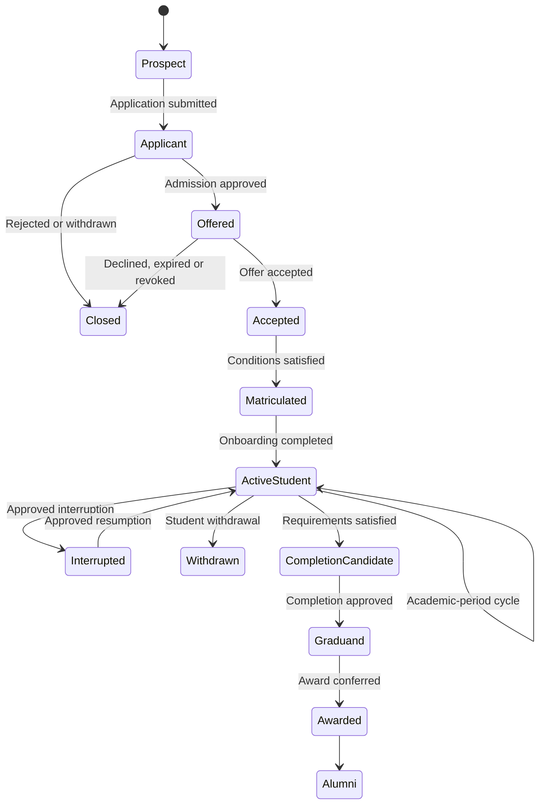
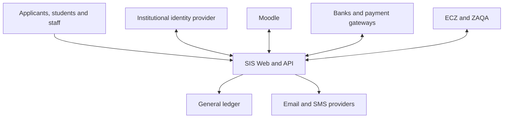
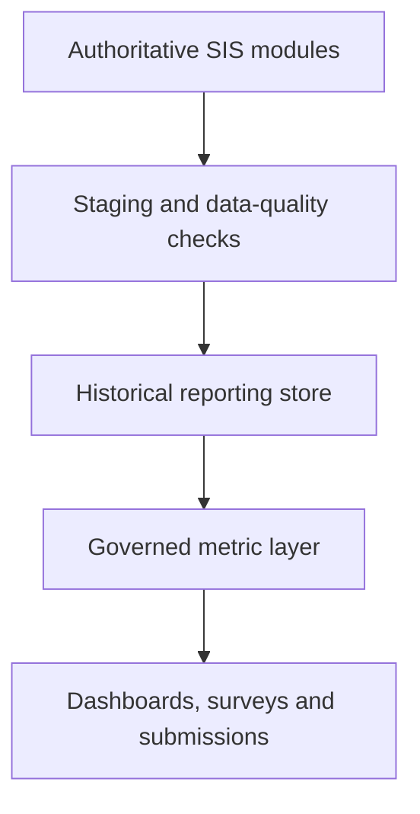
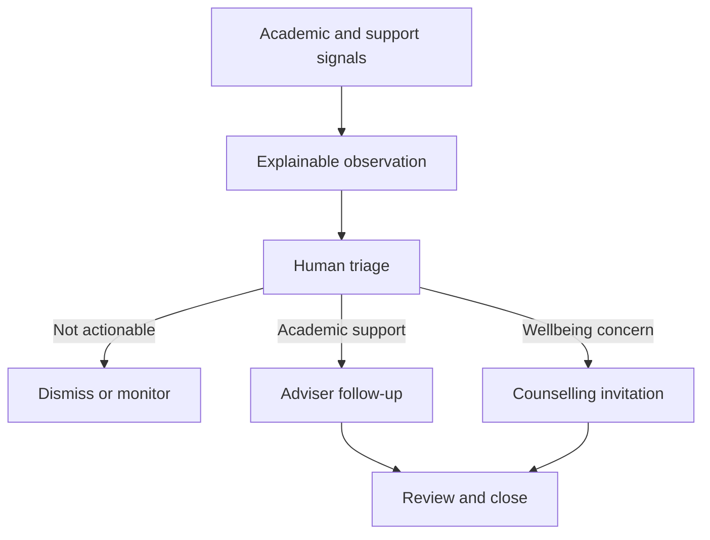
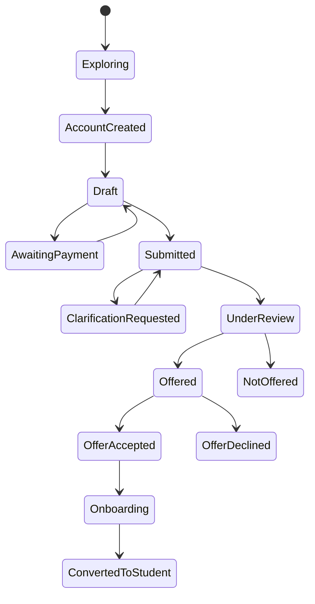
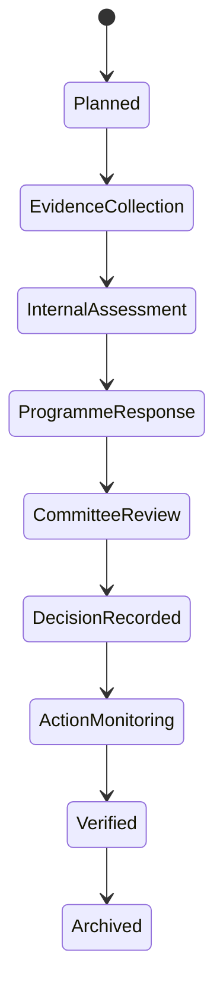
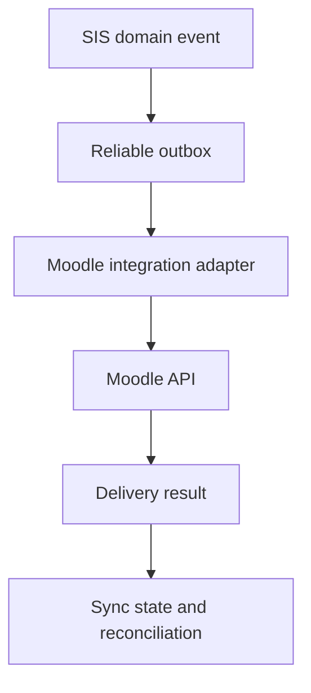
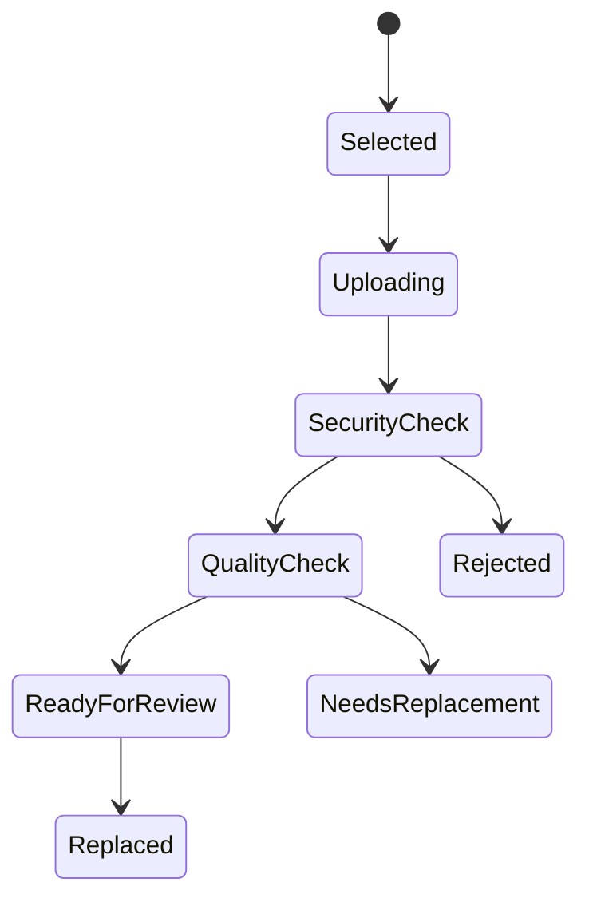
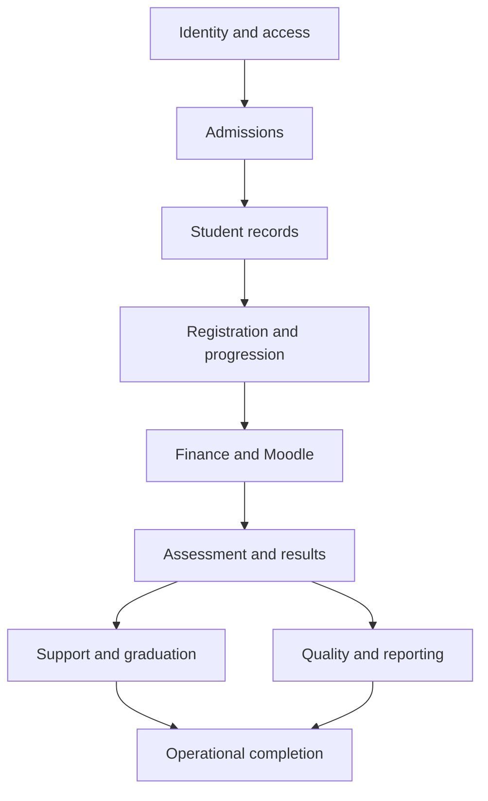

# Generated Design Output Compendium

This contains the 70 recovered assistant-generated design records in chronological order, without unrelated conversation or legacy implementation attachments.

## Design output 01

_Source: `01-design-sections/001-design-section-1-domain-architecture-and-ownership.md`_

### Design Section 1 — Domain architecture and ownership

The SIS will use explicit domain ownership. Each domain module owns its records, rules and state transitions. Other modules may interact only through published commands, queries or domain events—not by directly modifying another module’s tables.

#### Foundational modelling rules

1. **Institutional structure is an effective-dated graph**

   - Organisational unit types are configurable: university, college, school, faculty, institute, directorate, department, centre and campus.
   - Relationships such as `reports-to`, `academically-owned-by`, `delivered-by` and `located-at` are separately recorded.
   - The model does not assume every programme follows a fixed School → Department hierarchy.
   - Historical structures remain queryable after reorganisations.

2. **People, positions and access are separate**

   - A person can simultaneously be a student, lecturer, supervisor, adviser or staff member.
   - Positions such as Dean or Head of Department exist independently of their occupants.
   - Appointments assign people to positions for effective date ranges.
   - Permissions are scoped by organisational unit, programme, course offering, case type and academic period.
   - Identity providers authenticate users; the SIS remains authoritative for SIS permissions.

3. **Programmes and curricula are versioned**

   - A programme is a stable identity, such as Bachelor of Computer Science.
   - A curriculum version defines requirements applicable from a particular intake or date.
   - Existing students remain attached to their admitted curriculum unless an approved curriculum-transfer process occurs.
   - Curriculum components can include coursework, research, practicum, clinical placement, internship, seminar, dissertation or thesis.
   - Programme ownership, teaching responsibility and delivery location are separate relationships.

4. **A student is not represented by one fixed “type”**

   A student can have multiple concurrent classifications:

   - Academic career: undergraduate, taught postgraduate or research postgraduate.
   - Programme attempt and curriculum version.
   - Full-time, part-time or another configured study load.
   - Campus, distance, blended or online delivery.
   - Government-sponsored, self-sponsored, scholarship or another funding category.
   - Domestic or international.
   - Active, interrupted, withdrawn, completed or another lifecycle status.

5. **Official records are state-controlled**

   - Applications, registrations, marks, results, progression decisions and awards use explicit state machines.
   - Published or approved records cannot be silently overwritten.
   - Corrections require authority, reason, evidence, version history and audit records.
   - Hard deletion is prohibited for official academic and financial transactions.

#### Domain modules

| Domain module | Authoritative responsibility |
|---|---|
| Institution and Organisation | Institutional profile, campuses, organisational units, relationships, positions, committees and effective-dated appointments |
| Party, Identity and Access | People, contact details, accounts, institutional identifiers, role assignments, delegations, consent and authentication-provider links |
| Academic Policy and Calendar | Academic years, semesters/terms, teaching periods, deadlines, grading schemes, progression-policy versions and institutional code sets |
| Curriculum and Catalogue | Qualifications, programmes, curriculum versions, courses, credits, prerequisites, elective groups, research components and completion requirements |
| Admissions | Undergraduate and postgraduate applications, programme choices, documents, referees, evaluations, decisions, offers, acceptance and admission conditions |
| Student Registry | Student numbers, academic careers, programme attempts, curriculum assignment, student statuses, biographical record and status history |
| Academic Delivery | Course offerings, class sections, capacity, delivery mode, timetable references, lecturers, teaching teams and venues |
| Registration | Institutional registration, course registration, add/drop, withdrawal, exemptions, overrides, prerequisite checks and registration approvals |
| Student Finance | Fee rules, assessed charges, invoices, statements, sponsorships, scholarships, payments, allocations, refunds, balances and financial holds |
| Moodle Integration | Moodle identity/course mappings, provisioning requests, enrolment synchronisation, reconciliation, contextual launches and grade-import staging |
| Assessment and Examinations | Assessment schemes, assessment items, examination scheduling, candidate lists, marks, moderation, missing-mark resolution and board preparation |
| Results and Progression | Official course outcomes, GPA calculations, academic standing, progression decisions, exclusions, result amendments and academic appeals |
| Postgraduate Research | Supervisors, research proposals, ethics clearance, milestones, progress reviews, thesis/dissertation submission, examination, viva and corrections |
| Student Success and Support | Risk signals, alert reviews, intervention cases, action plans, referrals, follow-ups and intervention outcomes |
| Counselling, Wellbeing and Conduct | Restricted counselling/wellbeing cases, discipline cases, evidence, hearings, decisions and authorised disclosures |
| Graduation and Credentials | Completion evaluation, clearance, graduation applications, award approval, conferral, transcripts, certificates and alumni handoff |
| Documents and Communications | Document metadata, templates, generated letters, notifications, email/SMS requests and communication history |
| Workflow and Governance | Approval tasks, work queues, committee actions, escalation timers and workflow execution; business rules remain owned by the relevant domain |
| Reporting and Compliance | Governed read models, statutory reports, operational dashboards, data-quality reports and controlled exports |
| Integration and Data Exchange | External-system registrations, API clients, import batches, mappings, idempotency records, outbox delivery and reconciliation |

#### Sensitive-domain separation

Student success, counselling, wellbeing and discipline may reuse a common case-management framework, but they must not share unrestricted visibility:

- Academic advisers can see intervention information relevant to academic support.
- Counsellors can see protected counselling details.
- Discipline officers can see conduct-case records.
- Ordinary lecturers cannot see counselling or discipline details.
- Early-alert models receive only the minimum authorised attributes.
- Reports use aggregated or pseudonymised data unless identifiable data is explicitly authorised.

#### Critical authority boundaries

- The SIS is authoritative for programmes, registrations, official results, progression and awards.
- Moodle is authoritative for learning activities, submissions, participation and provisional gradebook details.
- Imported Moodle marks remain provisional until validated, moderated and officially published in the SIS.
- The student-finance module owns student balances; the external general ledger owns institutional accounting.
- Banks and payment gateways report transactions but cannot directly mark a student as financially cleared.
- AI can recommend, summarise and draft actions but cannot change authoritative records.

---

## Design output 02

_Source: `01-design-sections/002-design-section-2-stakeholders-roles-and-access-control.md`_

### Design Section 2 — Stakeholders, roles and access control

#### Stakeholder catalogue

| Stakeholder group | Principal responsibilities |
|---|---|
| Prospects and applicants | Create accounts, submit applications, upload evidence, provide referees, track decisions, accept offers and satisfy admission conditions |
| Students | Complete onboarding, maintain permitted personal details, register, view finances, access Moodle, view published results, request documents, submit appeals and apply for graduation |
| Postgraduate candidates | Perform student functions plus manage proposals, ethics applications, supervision records, milestones, thesis submissions and corrections |
| Alumni | Verify awards, request transcripts and manage permitted contact information |
| Lecturers and instructors | Access assigned offerings, class lists, provisional assessments, attendance, marks and academic interventions |
| Supervisors | Manage assigned research candidates, progress reviews, milestone recommendations and thesis readiness |
| Markers, moderators and external examiners | Perform explicitly assigned assessment, moderation or examination duties |
| Academic advisers and student-success staff | Review authorised risk alerts, coordinate interventions and monitor outcomes |
| Counsellors and wellbeing officers | Manage protected support cases and authorised referrals |
| Discipline and appeals officers | Manage conduct cases, hearings, decisions and appeal workflows |
| Programme coordinators and Heads of Department | Manage programme delivery, approve offerings, teaching assignments, overrides and departmental academic decisions |
| Deans and school boards | Review school-level admissions, results, progression and programme decisions |
| Senate and authorised committees | Approve academic policies, final results, progression exceptions, programmes and awards |
| Admissions officers | Validate applications, documents, evaluations, decisions, offers and admission conditions |
| Registry and academic-office staff | Maintain student records, registrations, results, status changes, transcripts and graduation processes |
| Examination officers | Schedule examinations, assign venues, generate candidate lists, manage missing marks and prepare board documentation |
| Finance officers | Configure fee rules, assess charges, post verified payments, manage sponsorships, refunds and financial holds |
| Executive management | Access authorised institutional dashboards and approved aggregated reports |
| ICT administrators | Configure infrastructure, integrations and operational settings without receiving unrestricted academic authority |
| Security and identity administrators | Manage accounts, identity-provider connections, service accounts and security policies |
| Data-protection officers and auditors | Review processing records, access logs, consent, incidents and compliance evidence |
| Regulators and government agencies | Receive specifically authorised statutory reports |
| Sponsors and scholarship providers | Receive limited sponsored-student financial or progress information under an established legal basis |
| Parents or guardians | Receive only information for which the student has granted valid, revocable consent or where another legal basis applies |
| External systems | Moodle, identity provider, banks, payment gateways, general ledger, email/SMS services and approved reporting systems |

#### Authorisation model

The system will combine:

- **RBAC:** roles provide reusable permission bundles.
- **ABAC:** decisions consider attributes such as record state, sensitivity, academic period and programme.
- **Relationship-based access:** access can depend on being the assigned lecturer, adviser, supervisor, examiner or case officer.
- **Scoped assignments:** every role assignment applies to a defined institutional or record scope.
- **Effective dates:** assignments automatically begin and expire on approved dates.

An authorisation decision evaluates:

```text
Principal + Capability + Resource + Scope + Relationship + Record State + Time
```

Access is granted only when every required condition is satisfied. The default outcome is denial.

#### Role-assignment examples

```text
Dean @ School of Engineering @ 2026-01-01..2028-12-31
Lecturer @ CourseOffering(CSC4792, Semester-1-2026)
Supervisor @ ResearchCandidate(STU-2026-0042)
FinanceOfficer @ MainCampus
ExternalExaminer @ ThesisExamination(EXAM-0192) @ 2026-07-01..2026-09-30
Counsellor @ CounsellingService
```

A person may hold several assignments simultaneously. The interface must show the currently active context so the user understands under which authority an action is being performed.

#### Capability design

Permissions will use stable, namespaced identifiers rather than ambiguous labels:

```text
admissions.application.review
admissions.offer.approve
curriculum.version.publish
registration.override.request
registration.override.approve
finance.payment.verify
assessment.mark.submit
assessment.moderation.complete
results.board.recommend
results.publish
progression.decision.approve
research.milestone.review
student_success.case.manage
counselling.case.read_sensitive
discipline.decision.approve
graduation.award.confer
audit.log.read
```

Every protected API operation, background command and interface action must reference one or more documented capabilities.

#### Mandatory segregation of duties

- A user cannot approve their own request or override.
- Application assessment and final admission approval are separate capabilities.
- Mark entry, moderation, board recommendation and official result publication are separate actions.
- The person who captures a financial refund cannot be its sole approver.
- Award eligibility calculation and award conferral are separate actions.
- Security administration does not automatically grant access to counselling, discipline, marks or financial records.
- Developers and database operators do not receive routine business-user permissions.
- Temporary delegation must specify the delegator, delegate, reason, scope and expiry date.

#### Identity lifecycle

1. A prospect creates and verifies an applicant account.
2. Duplicate-person checks occur before creating a new person record.
3. An accepted applicant is linked to a student record rather than recreated.
4. Matriculation generates the institutional student identifier.
5. Institutional identity provisioning is requested through an integration event.
6. Staff identities may originate from an identity provider or approved administrative provisioning.
7. Graduation changes access to the alumni profile without deleting the person or student history.
8. Suspended or departed users lose active capabilities while their historical actions remain attributable.

#### Exceptional access

Emergency access is permitted only through a controlled break-glass process:

- Explicit justification.
- Short expiry.
- Strong authentication.
- Immediate audit event.
- Notification to the responsible security or data-protection officer.
- Post-access review.
- No break-glass access to protected counselling notes unless separately authorised.

#### Audit requirements

Every material action records:

- Actor and active role assignment.
- Resource and institutional scope.
- Action and business reason.
- Date, time and originating channel.
- Before-and-after values where appropriate.
- Approval chain.
- Request and correlation identifiers.
- Integration or service-account identity.
- Whether AI assisted in producing a recommendation or draft.

---

## Design output 03

_Source: `01-design-sections/003-design-section-3-student-lifecycle-and-principal-use-cases.md`_

### Design Section 3 — Student lifecycle and principal use cases

The SIS will not represent the entire student journey with one `student_status` field. Applications, offers, programme attempts, term registrations, course registrations, research candidature and awards each have independent state machines.

This prevents invalid situations such as treating an academically suspended student as having a rejected application or treating withdrawal from one course as withdrawal from the university.

#### Conceptual lifecycle



This diagram is conceptual. Each arrow is implemented through the separate controlled records described below.

#### Lifecycle phases and principal use cases

| Phase | Principal use cases | Required outcome |
|---|---|---|
| Institutional setup | Configure institution, organisational units, calendars, programme catalogue, curricula, admission cycles, fee rules and workflows | Institution is ready to accept applicants |
| Prospect engagement | Create prospect account, verify contact details, browse programmes, check requirements and begin application | Verified prospect and draft application |
| Application | Select programme choices, provide qualifications, referees and documents, pay an application fee where required, declare information and submit | Immutable submitted application version |
| Admissions processing | Validate documents, request corrections, verify eligibility, score or evaluate, interview, recommend, approve, waitlist or reject | Authorised decision for each programme choice |
| Offer and acceptance | Issue offer, communicate conditions, accept/decline, upload missing evidence and verify conditions | Accepted and condition-cleared admission |
| Matriculation | Resolve duplicate identities, create academic career and programme attempt, assign curriculum and issue student identifier | Authoritative student record |
| Onboarding | Complete profile, policies, consent, orientation, identity provisioning and required documents | Onboarding checklist satisfied |
| Student finance | Assess fees, apply sponsorships/scholarships, post verified payments and calculate financial clearance | Current student-account position |
| Institutional registration | Submit registration, validate eligibility, obtain academic approval and financial clearance | Registered for an academic period |
| Course registration | Select courses, validate curriculum, prerequisites, timetable and capacity, obtain overrides and enrol | Authoritative course registrations |
| Moodle provisioning | Provision authorised users, course shells and enrolments; reconcile failures and changes | Moodle reflects eligible registrations |
| Teaching and learning | Access learning content, record permitted attendance or engagement information and manage teaching activities | Learning activity evidence |
| Assessment and examinations | Configure assessments, schedule examinations, capture marks, moderate and prepare board decisions | Validated provisional outcomes |
| Results and progression | Approve and publish official results, calculate standing and determine progression | Official academic-period decision |
| Student success | Detect risk, validate alerts, create interventions, assign actions, follow up and measure outcomes | Closed or continuing support case |
| Postgraduate research | Assign supervisors, approve proposal and ethics, monitor milestones, submit thesis, examine and complete corrections | Approved research completion |
| Interruption and withdrawal | Request, assess and approve interruption, resumption, transfer or withdrawal | Effective-dated programme status change |
| Completion and graduation | Evaluate requirements, resolve exceptions, complete clearance, approve award and confer | Official award and credential |
| Alumni services | Verify credentials, request records and maintain permitted contact information | Controlled continuing access |

#### Separate lifecycle records

##### 1. Application

An application belongs to a person and an admission cycle. It may contain several ranked programme choices.

```text
DRAFT
→ SUBMITTED
→ UNDER_VALIDATION
→ UNDER_EVALUATION
→ DECISION_COMPLETE
→ CLOSED
```

Exception states:

```text
CORRECTION_REQUIRED
WITHDRAWN
CANCELLED
```

A submitted application is versioned. Applicant corrections create a new version while retaining the submitted evidence and declaration history.

Each programme choice has its own decision:

```text
PENDING
→ ELIGIBLE
→ UNDER_REVIEW
→ RECOMMENDED
→ APPROVED | WAITLISTED | REJECTED
```

An approved programme choice may generate an offer. Approval of one choice does not delete the history of other choices.

##### 2. Offer

```text
DRAFT
→ APPROVED
→ ISSUED
→ ACCEPTED | DECLINED | EXPIRED | REVOKED
```

Rules:

- Only an approved offer can be issued.
- Revocation requires authority, reason and audit evidence.
- Acceptance does not automatically mean all conditions are satisfied.
- Matriculation requires an accepted offer and clearance of mandatory conditions.

##### 3. Programme attempt

A student can have more than one programme attempt over time and, where policy permits, concurrent academic careers.

```text
ADMITTED
→ ACTIVE
→ INTERRUPTED
→ ACTIVE
→ COMPLETION_PENDING
→ COMPLETED
```

Terminal or exceptional states:

```text
WITHDRAWN
TERMINATED
TRANSFERRED
CANCELLED
```

Academic warning or probation is not stored as the programme-attempt state. It is an academic-standing decision attached to a specific period.

##### 4. Institutional registration

Institutional registration confirms that the student is eligible to study during a particular academic period.

```text
AWAITING_STUDENT_INPUT
→ AWAITING_ACADEMIC_APPROVAL
→ AWAITING_FINANCIAL_CLEARANCE
→ REGISTERED
```

Exception states:

```text
CHANGES_REQUIRED
REJECTED
CANCELLED
EXPIRED
```

Rules:

- Academic and financial clearance are independently recorded.
- A payment does not directly change registration state.
- The finance domain recalculates clearance and publishes the outcome.
- An authorised registration override records its rule, approver, reason and expiry.

##### 5. Course registration

```text
PLANNED
→ REQUESTED
→ VALIDATING
→ PENDING_APPROVAL
→ ENROLLED
```

Possible later states:

```text
DROPPED
WITHDRAWN
CANCELLED
COMPLETED
```

Validation includes:

- Active programme attempt.
- Eligible institutional-registration state.
- Curriculum applicability.
- Prerequisites and co-requisites.
- Repeated-course rules.
- Credit-load limits.
- Timetable conflicts where schedule data is available.
- Offering capacity.
- Academic and financial holds.
- Approved exemptions or overrides.

##### 6. Moodle enrolment

Moodle enrolment is an integration state, not the academic registration record.

```text
PENDING
→ PROCESSING
→ SYNCHRONISED
```

Failure and change states:

```text
RETRY_SCHEDULED
FAILED
SUSPENSION_PENDING
SUSPENDED
REMOVAL_PENDING
REMOVED
RECONCILIATION_REQUIRED
```

The SIS registration remains authoritative even if Moodle is unavailable.

##### 7. Completion and award

```text
NOT_ELIGIBLE
→ POTENTIALLY_ELIGIBLE
→ UNDER_EVALUATION
→ REQUIREMENTS_SATISFIED
→ CLEARANCE_PENDING
→ APPROVED_FOR_AWARD
→ CONFERRED
```

No transcript or certificate may represent an award as conferred before the authorised conferral event.

#### Academic-period cycle

Each active student repeats the following controlled cycle:

```text
Period eligibility
→ Fee assessment
→ Institutional registration
→ Course registration
→ Moodle provisioning
→ Learning and assessment
→ Result approval
→ Progression decision
→ Next-period eligibility or completion evaluation
```

Failure at one stage creates an actionable hold, exception or work item; it must not silently move the student backwards or delete completed work.

#### Global lifecycle rules

- Every state transition has an actor, timestamp, reason and correlation identifier.
- Only documented transitions are permitted.
- Backdating requires a dedicated capability and reason.
- Reversals create compensating records; they do not erase history.
- Official identifiers are unique and never reused.
- A student’s record remains continuous across transfers, interruptions and new programme attempts.
- AI may explain requirements or identify possible exceptions but cannot execute official transitions.
- Integration failure cannot alter an already approved academic decision.
- Configurable university rules determine eligibility, but the state meanings remain stable across installations.

---

## Design output 04

_Source: `01-design-sections/004-design-section-4-curriculum-programmes-and-academic-delivery.md`_

### Design Section 4 — Curriculum, programmes and academic delivery

The academic model will support multiple schools, departments, programmes and delivery arrangements without assuming that the unit owning a programme must teach every course in that programme.

#### Core academic hierarchy

```text
Qualification
└── Programme
    └── Curriculum Version
        └── Requirement Structure
            ├── Required courses
            ├── Elective groups
            ├── Research components
            ├── Practicum or clinical components
            ├── Credit requirements
            └── Completion rules
```

A programme is not itself a list of courses. Its approved curriculum version defines what a particular intake must complete.

#### Principal academic entities

| Entity | Meaning |
|---|---|
| Qualification | The award category, level and title, such as bachelor’s degree, postgraduate diploma, master’s degree or doctorate |
| Programme | A stable course of study leading to a qualification |
| Programme Version | Effective-dated programme metadata such as title, duration, delivery modes and admission rules |
| Curriculum Version | The requirements assigned to an intake or approved student cohort |
| Curriculum Requirement | A required course, elective group, research milestone, practicum, credit total or other completion condition |
| Course | Stable institutional identity for a unit of learning |
| Course Version | Approved course title, credits, learning outcomes, prerequisites and other versioned attributes |
| Course Equivalence | Approved relationship between interchangeable or replacement courses |
| Course Offering | Delivery of a course version during a defined academic period |
| Section | A teaching group within an offering |
| Teaching Assignment | Effective-dated assignment of a lecturer, tutor, coordinator or other teaching responsibility |
| Programme Attempt | A student’s enrolment in a programme and curriculum version |
| Course Registration | A student’s authoritative enrolment in a particular course offering |

#### Qualification and programme configuration

Each programme defines:

- Qualification and academic career.
- Owning organisational unit.
- Contributing organisational units.
- Lead programme coordinator position.
- Permitted campuses and delivery modes.
- Full-time and part-time duration ranges.
- Admission routes and entry requirements.
- Applicable academic calendars.
- Curriculum versions.
- Award title and transcript title.
- Whether it supports taught, research or combined components.
- Applicable grading and progression policy.
- Professional or regulatory accreditation metadata.
- Programme status and effective dates.

Programme configuration must not encode logic in programme names. For example, the system must not infer that a programme is postgraduate because its title contains “Master.”

#### Flexible curriculum structure

A curriculum version can contain hierarchical requirement groups:

```text
All-of
Any-of
Minimum-count
Minimum-credits
Maximum-credits
Choose-from-list
Conditional requirement
Non-course requirement
Research milestone group
```

Example:

```text
Master of Science Curriculum 2026
├── Complete all 6 core courses
├── Complete at least 2 electives from Group A
├── Maintain the configured minimum GPA
├── Complete Research Methodology
├── Obtain ethics clearance where applicable
├── Pass research proposal milestone
└── Complete and pass dissertation examination
```

A PhD curriculum may contain primarily non-course requirements but can still include prescribed courses or seminars.

#### Curriculum lifecycle

```text
DRAFT
→ UNDER_REVIEW
→ APPROVED
→ PUBLISHED
→ SUPERSEDED
→ RETIRED
```

Rules:

- Only published curricula can receive new students.
- Published curriculum requirements cannot be edited in place.
- Changes create a new curriculum version.
- Existing students remain attached to their assigned version.
- Moving a student to another version requires an approved transition plan.
- The transition records satisfied, substituted, waived and outstanding requirements.
- Retiring a programme does not delete its students or historical curricula.

#### Course lifecycle

```text
DRAFT
→ UNDER_REVIEW
→ APPROVED
→ ACTIVE
→ RETIRED
```

A course version defines:

- Code and title.
- Owning academic unit.
- Credit value.
- Academic level.
- Learning outcomes.
- Contact or study hours where required.
- Prerequisites and co-requisites.
- Anti-requisites and prohibited combinations.
- Repeatability rules.
- Default assessment scheme.
- Delivery constraints.
- Effective dates.

A course code may not be reused for an unrelated course.

#### Cross-school academic integration

Cross-school delivery is represented explicitly through four separate relationships:

1. **Programme ownership:** The unit academically responsible for the programme.
2. **Curriculum contribution:** A unit contributes courses or requirements to another unit’s programme.
3. **Course ownership:** The unit responsible for maintaining the course definition.
4. **Offering delivery:** The unit responsible for teaching a particular course offering.

Example:

```text
School A owns Programme P.
School B owns Course C.
Programme P includes Course C.
School B delivers Course C to students from Programmes P, Q and R.
```

This arrangement creates one course offering with authorised sections or reserved capacities, not three duplicated course definitions.

Joint programmes may have:

- One lead owner.
- Multiple contributing owners.
- Defined approval responsibilities.
- Shared curriculum governance.
- Explicit revenue or workload metadata for reporting without embedding accounting rules.

#### Academic calendar model

The system will support a configurable period hierarchy:

```text
Academic Year
├── Semester or Term
│   ├── Registration period
│   ├── Teaching period
│   ├── Examination period
│   └── Result-processing period
└── Optional block, quarter or session
```

Rules:

- “Semester” is not hard-coded as the only period type.
- Registration, teaching, assessment and examination dates are separate.
- Deadlines may vary by campus, programme, student category or offering.
- Every transaction records the applicable policy and calendar version.
- Date extensions require an authorised exception.

#### Course-offering lifecycle

```text
PLANNED
→ AWAITING_APPROVAL
→ APPROVED
→ OPEN_FOR_REGISTRATION
→ REGISTRATION_CLOSED
→ IN_PROGRESS
→ ASSESSMENT_PROCESSING
→ COMPLETED
→ CLOSED
```

Exceptional states:

```text
CANCELLED
SUSPENDED
ARCHIVED
```

An offering defines:

- Course and course version.
- Academic period.
- Delivering unit.
- Campus and delivery mode.
- Capacity and waitlist policy.
- Sections and groups.
- Teaching assignments.
- Registration dates.
- Moodle mapping.
- Assessment-scheme instance.
- Published schedule references.

Cancellation requires a reason, impact analysis and resolution of existing registrations.

#### Teaching allocation

Teaching assignments support:

- Course coordinator.
- Lecturer.
- Tutor or teaching assistant.
- Marker.
- Moderator.
- Clinical or practicum supervisor.
- Guest lecturer.
- External examiner where appropriate.

Each assignment has:

- Person.
- Position or assignment role.
- Offering or section scope.
- Effective dates.
- Workload contribution.
- Required capabilities.
- Confirmation state.

A lecturer receives class and assessment access only after the assignment becomes active.

#### Registration rule engine

Course-registration validation will use versioned rules rather than hard-coded programme checks.

Rules can evaluate:

- Curriculum applicability.
- Prerequisites and co-requisites.
- Equivalent courses already completed.
- Failed or repeated courses.
- Minimum and maximum credit load.
- Timetable conflicts.
- Offering capacity.
- Programme and level restrictions.
- Academic standing.
- Financial or administrative holds.
- Required approvals.
- Deadline compliance.

Each result is returned as one of:

```text
PASS
WARNING
BLOCK
APPROVAL_REQUIRED
```

Every warning or block includes a stable rule code and a user-readable explanation.

#### Credit transfer, exemption and prior learning

The model distinguishes:

- **Credit transfer:** External or previous institutional credit counts toward completion.
- **Course exemption:** A requirement is waived, with or without replacement credit.
- **Course substitution:** Another approved course satisfies the requirement.
- **Recognition of prior learning:** Prior formal, informal or professional learning is evaluated.
- **Curriculum transition:** Completed work is mapped when changing curriculum versions.

Each decision requires evidence, evaluator, authority, date, reason and effect on completion calculations.

#### Timetabling boundary

The initial SIS will support:

- Manual creation and import of teaching schedules.
- Venues, dates, recurrence and section schedules.
- Timetable-conflict detection during registration.
- Published student and lecturer timetables.
- Integration contracts for a future specialised timetabling engine.

Automatic timetable optimisation is not required in the initial implementation.

---

## Design output 05

_Source: `01-design-sections/005-design-section-5-assessment-examinations-results-and-progression-operations.md`_

### Design Section 5 — Assessment, examinations, results and progression operations

The previous amendment defines how academic rules are configured. This section defines how assessments and official academic decisions move operationally through the system.

#### 1. Assessment-scheme instantiation

When a course offering is approved, it receives an immutable assessment-scheme instance based on the applicable approved policy.

The instance contains:

- CA and examination weights.
- Assessment components.
- Minimum component requirements.
- Calculation and rounding rules.
- Supplementary and deferred rules.
- Moderation requirements.
- Result approval route.
- Applicable school, programme, course and policy versions.

Changes after registration begins require an approved amendment and impact analysis. Students must be notified when an authorised change affects them.

#### 2. Assessment-component workflow

```text
DRAFT
→ APPROVED
→ OPEN
→ MARK_CAPTURE
→ SUBMITTED
→ MODERATION
→ APPROVED
→ LOCKED
```

Exceptional states:

```text
RETURNED_FOR_CORRECTION
CANCELLED
REPLACED
WITHHELD
```

Rules:

- Only assigned staff can capture marks.
- Marks must remain within the component’s valid range.
- Bulk uploads use a validated staging area before committing.
- The system reports missing, duplicate and out-of-range values.
- Submitted marks become read-only to the marker.
- Corrections after submission require a documented return or amendment.
- Locked components cannot be silently changed.

#### 3. Non-numeric assessment outcomes

The system must not store every exceptional outcome as zero.

Supported result conditions include:

```text
MARK_RECORDED
ABSENT
ABSENT_WITH_PERMISSION
DEFERRED
MISSING_MARK
INCOMPLETE
EXEMPT
CARRIED_FORWARD
WITHHELD
MISCONDUCT_PENDING
CANCELLED
```

A numeric zero means the student genuinely received zero. It must not mean absent, missing or withheld.

#### 4. Moodle grade ingestion

Moodle assessment data enters an import staging process:

```text
RECEIVED
→ VALIDATED
→ MAPPED
→ REVIEWED
→ ACCEPTED
→ POSTED_AS_PROVISIONAL
```

Failure states:

```text
MAPPING_REQUIRED
CONFLICT
REJECTED
RECONCILIATION_REQUIRED
```

Each imported mark records:

- Moodle instance.
- Moodle course and activity identifiers.
- SIS course offering and assessment component.
- Student and enrolment mapping.
- Original Moodle value.
- Conversion formula where required.
- Import time and source response.
- Reviewing staff member.
- Final accepted SIS value.

Moodle cannot overwrite moderated, board-approved or published results.

#### 5. Examination planning

An examination event contains:

- Course offering.
- Examination type.
- Academic and examination period.
- Date, time and duration.
- Venue or delivery channel.
- Candidate list.
- Seating allocation.
- Invigilators.
- Paper and script-control metadata.
- Approved accommodations.
- Conflict and capacity status.

Examination types are configurable and may include:

```text
MID_SEMESTER
END_OF_SEMESTER
MID_YEAR
FINAL
SUPPLEMENTARY
DEFERRED
SPECIAL
PRACTICAL
ORAL
VIVA
```

#### 6. Examination-event lifecycle

```text
PLANNED
→ CONFLICT_CHECK
→ APPROVED
→ PUBLISHED
→ READY
→ IN_PROGRESS
→ COMPLETED
→ INCIDENT_REVIEW
→ CLOSED
```

Exceptional states:

```text
RESCHEDULED
POSTPONED
CANCELLED
INVALIDATED
```

Publishing an examination timetable requires:

- Venue-capacity validation.
- Candidate conflict detection.
- Invigilator conflict detection.
- Approved duration.
- Required accommodations.
- Authorised timetable approval.

A published event may only be changed through a controlled rescheduling process with affected-user notification.

#### 7. Candidate eligibility

The candidate list is generated from authoritative course registrations.

Eligibility checks include:

- Active course registration.
- Permitted institutional-registration state.
- Applicable examination-entry rules.
- Approved financial or administrative holds.
- Academic misconduct restrictions.
- Deferred or supplementary eligibility.
- Approved special arrangements.

Exclusion from an examination requires a recorded rule, authority and communication. Moodle enrolment alone never establishes examination eligibility.

#### 8. Examination accommodations

The examination office receives only the accommodation instructions necessary to arrange the examination, such as:

- Additional time.
- Accessible venue.
- Assistive technology.
- Reader or scribe.
- Rest breaks.
- Alternative assessment arrangement.

Medical or counselling details remain in their protected domains.

#### 9. Examination materials and scripts

The system supports:

- Paper setters and moderators.
- Secure paper versions.
- Approval status.
- Controlled release windows.
- Encrypted document storage.
- Printed-copy accountability.
- Script issue and return tracking.
- Anonymous candidate numbers where enabled.
- Marker and moderator allocations.
- Lost-script and compromised-paper incidents.

Access to examination papers must be separately permissioned and strongly audited.

#### 10. Examination attendance and incidents

Attendance records distinguish:

```text
PRESENT
ABSENT
LATE
REMOVED
SPECIAL_ARRANGEMENT
ATTENDANCE_UNCONFIRMED
```

Incident records may cover:

- Suspected misconduct.
- Candidate illness.
- Power or network interruption.
- Incorrect paper.
- Venue disruption.
- Lost or damaged script.
- Invigilator irregularity.
- Security compromise.

An incident can place affected results into `WITHHELD` or `REVIEW_REQUIRED` without altering marks.

#### 11. Mark calculation

The calculation engine uses the immutable assessment-scheme and policy snapshots.

It must preserve:

- Raw component mark.
- Normalised component mark.
- Weighted contribution.
- Pre-rounded total.
- Rounded total.
- Grade.
- Result code.
- Calculation formula version.
- Calculation trace.

Every calculated result must be reproducible from stored inputs.

#### 12. Course-result workflow

```text
INCOMPLETE
→ CALCULATED
→ VALIDATION_REQUIRED
→ VALIDATED
→ MODERATION_COMPLETE
→ BOARD_RECOMMENDED
→ APPROVED
→ PUBLISHED
```

Alternative states include:

```text
MISSING_MARKS
RETURNED_FOR_CORRECTION
WITHHELD
DEFERRED
SUPPLEMENTARY_REQUIRED
MISCONDUCT_PENDING
AMENDMENT_PENDING
```

Publication is a distinct authorised action. A calculated result is not automatically official.

#### 13. Configurable result-approval route

An institution may configure an approval route such as:

```text
Course Coordinator
→ Departmental Examination Board
→ School or Faculty Board
→ Senate or Authorised Committee
→ Publication
```

Another institution may use fewer or differently named levels.

Each stage records:

- Submitted result set.
- Exceptions.
- Quorum where required.
- Recommendation.
- Approver or committee.
- Meeting reference.
- Decision date.
- Returned corrections.
- Attached evidence.

#### 14. Grade and GPA policies

Grade scales are effective-dated and may define:

- Mark boundaries.
- Letter grades.
- Grade points.
- Pass and fail classifications.
- Non-GPA result codes.
- Repeat treatment.
- Supplementary treatment.
- Credit weighting.
- Rounding precision.

The system stores both numeric results and the applied grade-policy version.

GPA, cumulative GPA, weighted average and degree classification are separate configurable calculations. The system must not assume every programme uses GPA.

#### 15. Progression workflow

After applicable official results are approved:

```text
NOT_EVALUATED
→ CALCULATED
→ EXCEPTIONS_IDENTIFIED
→ ACADEMIC_REVIEW
→ BOARD_RECOMMENDED
→ APPROVED
→ PUBLISHED
```

Possible decision outcomes are those approved in the academic-rules amendment, including:

```text
PROCEED
PROCEED_WITH_CARRY
PROCEED_WITH_RESTRICTIONS
SUPPLEMENTARY_PENDING
REPEAT_FAILED_COURSES
REPEAT_STAGE
INTERRUPTION_REQUIRED
EXCLUDE
COMPLETION_PENDING
BOARD_REVIEW_REQUIRED
```

#### 16. Academic standing versus progression

These concepts remain separate:

- **Academic standing** describes the student’s academic condition, such as good standing, warning or probation.
- **Progression decision** determines the permitted next action, such as proceeding, carrying courses or repeating a stage.
- **Programme-attempt state** indicates whether the overall programme attempt is active, interrupted, completed or terminated.

An institution configures its standing categories and thresholds.

#### 17. Missing marks and incomplete decisions

A progression run must not silently treat missing marks as failures.

When mandatory marks are missing:

1. The affected result becomes `MISSING_MARKS`.
2. The progression decision becomes `BOARD_REVIEW_REQUIRED` or remains pending.
3. A work item is assigned to the responsible academic unit.
4. Escalation deadlines apply.
5. Resolution is audited.
6. Progression is recalculated using the same policy version.

#### 18. Appeals and result amendments

```text
DRAFT_APPEAL
→ SUBMITTED
→ ADMISSIBILITY_REVIEW
→ UNDER_REVIEW
→ DECISION
→ IMPLEMENTATION
→ CLOSED
```

Possible decisions include:

```text
UPHELD
PARTIALLY_UPHELD
DISMISSED
RETURNED_FOR_REMARK
PROCEDURAL_REVIEW_REQUIRED
```

A published-result amendment creates a new official version linked to the previous result. It does not overwrite history.

Before approving an amendment, the system identifies impacts on:

- Progression.
- Prerequisites and registrations.
- Academic standing.
- Fees.
- Graduation eligibility.
- Transcript versions.
- Previously issued credentials.
- Student-success alerts.

Affected downstream decisions are recalculated or sent for authorised review.

#### 19. Publication and student access

Students may see:

- Provisional marks only when institutional policy permits.
- Official results only after publication.
- Outstanding or withheld statuses with an authorised explanation.
- Progression decisions.
- Supplementary or repeat requirements.
- Appeal instructions and deadlines.

Students must not see internal board comments, confidential misconduct evidence or another student’s results.

#### 20. Early detection integration

Student-success rules may use authorised provisional indicators such as:

- Repeated low assessment performance.
- Missing assessments.
- Low attendance or Moodle engagement.
- Failed prerequisite courses.
- Excessive carry load.

These indicators remain support signals, not official results. A risk alert cannot change a mark, standing or progression decision.

---

## Design output 06

_Source: `01-design-sections/006-design-section-6-admissions-onboarding-and-student-finance.md`_

### Design Section 6 — Admissions, onboarding and student finance

#### 1. Admission-cycle configuration

An admission cycle defines:

- Intake and academic year.
- Application opening and closing dates.
- Undergraduate, taught-postgraduate and research-postgraduate routes.
- Available programmes and capacities.
- Application-form version.
- Entry-requirement versions.
- Required documents.
- Application fee where applicable.
- Evaluation rubrics.
- Decision and offer deadlines.
- Responsible academic and administrative units.

```text
DRAFT
→ APPROVED
→ OPEN
→ CLOSED_TO_APPLICATIONS
→ UNDER_PROCESSING
→ DECISIONS_COMPLETE
→ ARCHIVED
```

#### 2. Configurable application forms

Forms are assembled from approved field and document definitions. Different routes can request different information.

| Route | Example requirements |
|---|---|
| Undergraduate | School results, certificates, identity evidence, programme choices and sponsorship category |
| Taught postgraduate | Previous degrees, transcripts, employment history, references and programme-specific statements |
| Research postgraduate | Qualifications, transcripts, research proposal, intended field, references, publications and potential-supervisor information |
| International applicant | Passport, qualification equivalence, immigration-related evidence and international contact information |

A submitted application retains the exact form and requirement versions used at submission.

#### 3. Applicant identity and duplicate prevention

- A person is created once and may submit applications in different cycles.
- Email address is not used as the permanent person identifier.
- Duplicate checks may compare names, date of birth, identity numbers, previous student numbers and verified contact details.
- Possible duplicates enter a human review queue.
- The system never automatically merges people.
- A merge requires authority, evidence, before-and-after history and reversible identifiers.

#### 4. Admission processing stages

```text
Submission
→ Completeness validation
→ Document verification
→ Eligibility evaluation
→ Academic evaluation
→ Selection and ranking
→ Recommendation
→ Authorised decision
→ Offer
```

Eligibility and selection remain separate:

- **Eligibility** determines whether minimum entry requirements are satisfied.
- **Selection** determines whether an eligible applicant receives an available place.

An eligible applicant is not automatically admitted.

#### 5. Programme-choice processing

Each programme choice independently records:

- Preference rank.
- Entry requirements.
- Eligibility outcome.
- Evaluation score or recommendation.
- Capacity status.
- Academic-unit review.
- Final decision.

If institutional policy permits, an unsuccessful first choice may be considered for another choice without creating a duplicate application.

#### 6. Postgraduate evaluation

Research-postgraduate applications may include:

- Research-area classification.
- Proposal review.
- Academic preparation review.
- Reference reports.
- Interview.
- Supervisor expertise match.
- Supervisor workload and capacity.
- Resource or laboratory availability.
- Ethics-risk indication.
- School and graduate-studies approval.

A possible-supervisor match is not yet a formal supervision assignment. Formal assignment occurs after matriculation through the postgraduate-research domain.

#### 7. Admission decisions and offers

Supported decisions include:

```text
ADMIT
ADMIT_WITH_CONDITIONS
WAITLIST
REJECT
REFER_TO_ALTERNATIVE_PROGRAMME
REQUEST_FURTHER_REVIEW
```

Conditions may include:

- Certified documents.
- Final qualification results.
- Bridging course.
- English-language evidence.
- Funding evidence.
- Research-proposal revision.
- Supervisor availability.
- Regulatory clearance.

A condition defines its evidence, responsible reviewer, deadline and whether it blocks matriculation.

#### 8. AI in admissions

AI may:

- Extract candidate-provided information from documents.
- Suggest possible duplicate records.
- Identify missing evidence.
- Summarise a research proposal.
- Compare submitted information against published requirements.
- Draft applicant communications.

AI cannot:

- Reject an applicant.
- Approve an offer.
- Rank applicants without an approved human-reviewed method.
- fabricate missing evidence.
- silently change submitted information.

Every AI-derived value remains unverified until confirmed by an authorised person.

#### 9. Offer acceptance and matriculation

```text
Offer accepted
→ Mandatory conditions reviewed
→ Identity resolved
→ Admission record confirmed
→ Academic career created
→ Programme attempt created
→ Curriculum version assigned
→ Student identifier issued
→ Onboarding initiated
```

Matriculation is idempotent: repeating the command cannot create additional students or programme attempts.

#### 10. Onboarding checklists

Onboarding uses configurable task templates. Tasks may include:

- Personal-details confirmation.
- Emergency-contact information.
- Identity-provider account provisioning.
- Policy acknowledgement.
- Data-consent choices.
- Document submission.
- Programme orientation.
- Library or external-service referral.
- Student-finance setup.
- Scholarship or sponsorship confirmation.
- Accessibility-support referral.
- Initial academic-adviser assignment.
- Moodle orientation.
- Student-card request.

Each task has:

```text
NOT_STARTED
→ IN_PROGRESS
→ SUBMITTED
→ VERIFIED
→ COMPLETED
```

Alternative states:

```text
CHANGES_REQUIRED
WAIVED
NOT_APPLICABLE
EXPIRED
```

A checklist rule determines which tasks block institutional registration.

---

### Student finance

#### 11. Student-account boundary

The SIS student-finance module owns:

- Student charges.
- Invoices and statements.
- Scholarships and sponsorships.
- Payments and allocations.
- Credit notes and adjustments.
- Refund requests.
- Payment arrangements.
- Financial holds.
- Registration clearance.
- Repeat-course and assessment fees.

The external general ledger remains authoritative for institutional accounting.

#### 12. Fee configuration

A versioned fee schedule can use:

- Academic career.
- Programme and curriculum.
- Campus.
- Delivery mode.
- Full-time or part-time load.
- Domestic or international classification.
- Sponsorship category.
- Course credits.
- Course type.
- Repeat attempt.
- Laboratory or clinical component.
- Academic period.
- Approved waiver.

Supported calculation methods include:

```text
Flat programme fee
Fee per academic period
Fee per course
Fee per credit
Component-specific fee
Tiered fee
Percentage-based fee
Institution-approved formula
```

Formulas use a restricted, tested rule model—not arbitrary executable code.

#### 13. Fee-assessment workflow

```text
Eligibility established
→ Applicable fee rules resolved
→ Assessment simulated
→ Charge lines generated
→ Validation
→ Charges posted
→ Invoice or statement issued
```

Every charge line records:

- Fee rule and version.
- Calculation inputs.
- Amount and currency.
- Academic period.
- Programme or course.
- Sponsorship responsibility.
- Posting and due dates.
- Reversal relationship where applicable.

#### 14. Immutable student subledger

Posted financial transactions are not edited or deleted.

Corrections use:

- Reversal.
- Credit note.
- Debit adjustment.
- Reallocation.
- Refund.

The account balance must always be reproducible from posted ledger transactions.

#### 15. Payment processing

```text
RECEIVED
→ VALIDATION
→ VERIFIED
→ POSTED
→ ALLOCATED
→ RECONCILED
```

Exception states:

```text
DUPLICATE_SUSPECTED
UNMATCHED
FAILED
REVERSED
REFUND_PENDING
REFUNDED
```

A payment records:

- Provider transaction reference.
- Payer.
- Amount and currency.
- Payment channel.
- Value date.
- Student or invoice reference.
- Verification evidence.
- Allocation history.
- Reconciliation status.

Provider transaction references and idempotency keys prevent duplicate posting.

#### 16. Scholarships and sponsorships

A sponsorship agreement defines:

- Sponsor.
- Covered students or eligibility group.
- Applicable periods.
- Covered fee categories.
- Percentage or amount limits.
- Conditions.
- Sponsor billing arrangements.
- Start and end dates.

A sponsor promise is not treated as cash received. The system separately tracks:

- Student responsibility.
- Sponsor responsibility.
- Amount invoiced.
- Amount paid.
- Outstanding sponsor balance.

#### 17. Financial clearance

```text
NOT_EVALUATED
→ PENDING
→ CLEARED | HELD | MANUAL_REVIEW
```

Clearance policy may consider:

- Required percentage paid.
- Outstanding balance.
- Approved sponsorship.
- Payment arrangement.
- Overdue charges.
- Pending or unmatched payments.
- Approved exemption.

A verified payment causes finance to recalculate clearance. The payment gateway cannot directly register the student.

#### 18. Financial holds

A hold records:

- Stable hold code.
- Reason.
- Scope.
- Actions blocked.
- Start and expiry.
- Responsible office.
- Resolution instructions.
- Override authority.

A hold may block specific actions rather than the entire account, such as:

```text
BLOCK_REGISTRATION
BLOCK_EXAM_SLIP
BLOCK_TRANSCRIPT
BLOCK_GRADUATION_CLEARANCE
```

Sensitive financial amounts are not exposed to lecturers or invigilators.

#### 19. Repeat-course and laboratory fees

Repeat registration receives the applicable attempt and component information from registration.

If a laboratory component is validly carried forward:

- The finance policy determines whether the laboratory charge is removed.
- The exemption references the approved academic carry-forward decision.
- Finance does not independently decide academic equivalence.

#### 20. Refunds

```text
REQUESTED
→ ELIGIBILITY_REVIEW
→ FINANCE_REVIEW
→ APPROVED
→ PAYMENT_PENDING
→ PAID
→ RECONCILED
```

Refund calculations may consider:

- Withdrawal date.
- Refund policy version.
- Non-refundable charges.
- Sponsorship source.
- Existing allocations.
- Outstanding balances.

The requester cannot be the sole refund approver.

#### 21. General-ledger export

Approved financial postings are grouped into journal-export batches:

```text
PREPARED
→ VALIDATED
→ APPROVED
→ EXPORTED
→ ACKNOWLEDGED
→ RECONCILED
```

The export contains accounting codes and summarised or detailed entries according to institutional configuration. Rejected entries return to a reconciliation queue; they do not alter the student subledger.

#### 22. Student financial self-service

Students can:

- View charge explanations.
- Download statements and receipts.
- Submit payment references.
- View payment allocation.
- View sponsorship coverage.
- Request an approved payment arrangement.
- Submit refund requests.
- See holds and resolution instructions.

Students cannot edit posted transactions or mark themselves financially cleared.

---

## Design output 07

_Source: `01-design-sections/007-design-section-7-postgraduate-research-lifecycle.md`_

### Design Section 7 — Postgraduate research lifecycle

UNZA publishes postgraduate progress forms intended to follow each stage of a student’s progress, including research registration, supervisor review and thesis submission. Its research-ethics structure also distinguishes Humanities and Social Sciences, Natural and Applied Sciences, and Biomedical ethics committees. [UNZA postgraduate forms](https://graduate.unza.zm/graduate/forms), [UNZA research ethics](https://www.unza.zm/r-and-i/research-ethics)

The SIS will model these as configurable digital workflows rather than reproducing paper forms.

#### 1. Coursework and research pathways

| Programme pattern | Supported lifecycle |
|---|---|
| Taught postgraduate diploma | Coursework, assessment, results and completion |
| Taught master’s | Coursework followed by dissertation or research project |
| Mixed master’s | Coursework and research running partly in parallel |
| Master’s by research | Proposal, ethics where required, research, dissertation and examination |
| Doctorate | Proposal, optional prescribed coursework, ethics, milestones, thesis and examination |

The curriculum determines when the research candidature begins and which coursework must be completed first.

#### 2. Research candidature

A `ResearchCandidature` is linked to the student’s programme attempt.

```text
PRE_RESEARCH_REQUIREMENTS
→ PROVISIONAL_CANDIDATURE
→ PROPOSAL_DEVELOPMENT
→ PROPOSAL_APPROVAL
→ ETHICS_AND_PERMISSIONS
→ ACTIVE_RESEARCH
→ SUBMISSION_PREPARATION
→ THESIS_SUBMITTED
→ UNDER_EXAMINATION
→ CORRECTIONS
→ EXAMINATION_COMPLETE
→ COMPLETION_APPROVED
```

Exceptional states include:

```text
INTERRUPTED
EXTENSION_APPROVED
SUSPENDED
WITHDRAWN
TERMINATED
RESEARCH_CHANGE_PENDING
```

Not every programme uses every stage. The applicable route comes from the approved curriculum and research-policy versions.

#### 3. Supervision team

A supervision team may contain:

- Principal supervisor.
- Co-supervisor.
- Specialist adviser.
- Industrial or clinical supervisor.
- Research mentor.

A supervisor assignment records:

- Person.
- Role.
- Department and institution.
- Expertise areas.
- Internal or external status.
- Effective dates.
- Workload allocation.
- Conflict-of-interest declaration.
- Acceptance.
- Approval route.

```text
PROPOSED
→ INVITED
→ ACCEPTED
→ APPROVED
→ ACTIVE
→ ENDED
```

Alternative states include:

```text
DECLINED
REPLACEMENT_REQUIRED
SUSPENDED
WITHDRAWN
```

#### 4. Supervisor capacity

The system validates:

- Maximum active candidates.
- Programme level the supervisor may supervise.
- Required qualifications or experience.
- Subject-area alignment.
- Existing workload.
- Conflicts of interest.
- Institutional affiliation.

A capacity warning can trigger review but cannot automatically assign or reject a supervisor.

#### 5. Supervisor changes

A supervisor-change request records:

- Requesting party.
- Reason.
- Student comments.
- Current supervisor comments where appropriate.
- Proposed replacement.
- Research continuity assessment.
- Intellectual-property or data-access implications.
- Approval.

Historical supervision remains visible after the change.

#### 6. Research proposal

Each proposal version contains:

- Title.
- Research problem.
- Aim and objectives.
- Questions or hypotheses.
- Literature foundation.
- Methodology.
- Study population or data sources.
- Data-management plan.
- Ethical considerations.
- Work plan.
- Budget where applicable.
- References.
- Supporting instruments.

Proposal workflow:

```text
DRAFT
→ SUPERVISOR_REVIEW
→ DEPARTMENTAL_REVIEW
→ SCHOOL_POSTGRADUATE_REVIEW
→ GRADUATE_AUTHORITY_APPROVAL
→ APPROVED
```

Possible outcomes:

```text
CHANGES_REQUIRED
REJECTED
WITHDRAWN
SUPERSEDED
```

The exact approval levels are configurable.

#### 7. Proposal amendments

An approved proposal is not edited in place.

Material changes—such as title, objectives, methodology, population, data sources or supervisor—create an amendment:

```text
DRAFT_AMENDMENT
→ IMPACT_REVIEW
→ SUPERVISOR_APPROVAL
→ ACADEMIC_APPROVAL
→ ETHICS_REVIEW_IF_REQUIRED
→ EFFECTIVE
```

The original proposal remains part of the research record.

#### 8. Ethics determination

Every research project receives an ethics determination:

```text
NOT_ASSESSED
→ ETHICS_NOT_REQUIRED
```

or:

```text
NOT_ASSESSED
→ ETHICS_REQUIRED
→ APPLICATION_PREPARATION
→ SUBMITTED
→ UNDER_REVIEW
→ APPROVED
```

Other outcomes include:

```text
MODIFICATIONS_REQUIRED
DEFERRED
REJECTED
EXPIRED
SUSPENDED
REVOKED
```

A decision that ethics review is unnecessary still requires an authorised basis.

#### 9. Ethics committees and evidence

Committee configuration supports different review bodies and study categories. For the Zambia profile, example committees include:

- Humanities and Social Sciences Research Ethics Committee.
- Natural and Applied Sciences Research Ethics Committee.
- Biomedical Research Ethics Committee.

The ethics record may include:

- Full proposal.
- Proposal summary.
- Participant information.
- Consent forms.
- Questionnaires or interview guides.
- Institutional permission.
- External ethics approval.
- Clearance reference.
- Approval conditions.
- Effective and expiry dates.

These reflect document categories publicly listed by UNZA’s research-ethics service. [UNZA ethics requirements](https://www.unza.zm/r-and-i/research-ethics)

#### 10. Research cannot begin prematurely

Where ethics clearance is required:

- Data collection cannot be marked as started before approval.
- Expired clearance blocks new data collection.
- Material amendments may require renewed ethics review.
- Ethics approval does not itself approve academic quality.
- Academic proposal approval and ethics approval remain separate decisions.

#### 11. Milestone plan

A candidature receives an approved milestone plan, which may contain:

- Coursework completion.
- Concept note.
- Proposal seminar.
- Proposal approval.
- Ethics submission.
- Ethics approval.
- Data collection.
- Progress seminar.
- Analysis.
- Draft chapter submissions.
- Conference or publication requirement.
- Notice of intention to submit.
- Thesis submission.
- Viva.
- Corrections.
- Final repository deposit.

Each milestone records:

```text
NOT_STARTED
→ IN_PROGRESS
→ SUBMITTED
→ UNDER_REVIEW
→ SATISFIED
```

Alternative outcomes:

```text
CHANGES_REQUIRED
OVERDUE
WAIVED
NOT_APPLICABLE
FAILED
```

#### 12. Progress reviews

Progress reviews record:

- Student report.
- Supervisor report.
- Work completed.
- Delays and risks.
- Ethics status.
- Resources required.
- Updated completion forecast.
- Recommended actions.
- Student response.
- Committee decision.

Review frequency is configurable by programme and study mode.

Repeated unsatisfactory progress does not automatically terminate candidature. It initiates the applicable warning, support and academic-review process.

#### 13. Extensions and interruptions

Requests record:

- Requested dates.
- Reason.
- Supporting evidence.
- Supervisor recommendation.
- Funding implications.
- Ethics and data implications.
- Maximum-candidature impact.
- Fee implications.
- Approval.

Approved interruptions pause only deadlines identified by policy. They do not delete earlier milestones or financial transactions.

#### 14. Thesis-submission readiness

Before submission, the system checks:

- Required coursework.
- Proposal approval.
- Ethics and permission compliance.
- Mandatory milestones.
- Registration status.
- Supervisor recommendation.
- Formatting requirements.
- Originality or similarity-review evidence.
- Notice-of-intention period.
- Financial requirements where applicable.

A failed check produces a specific requirement, not a general “not eligible” message.

#### 15. Unsupported supervisor recommendation

A supervisor recommendation is recorded but must not become an unchallengeable technical lock.

Where a supervisor does not recommend submission:

```text
SUBMISSION_NOT_RECOMMENDED
→ REASONS_RECORDED
→ STUDENT_NOTIFIED
→ POSTGRADUATE_COMMITTEE_REVIEW
→ SUBMISSION_ALLOWED | FURTHER_WORK_REQUIRED
```

UNZA’s public thesis-submission form similarly provides for a supervisor who does not support submission to provide a report through the academic structure. [UNZA thesis-submission form](https://graduate.unza.zm/images/files/progress/5.pdf)

#### 16. Thesis submission

The submission package contains:

- Thesis or dissertation version.
- Abstract.
- Metadata.
- Declarations.
- Supervisor recommendation.
- Ethics references.
- Similarity-review evidence.
- Associated publications where required.
- Restricted-data declarations.
- Embargo request where applicable.

```text
DRAFT_SUBMISSION
→ SUBMITTED
→ ADMINISTRATIVE_CHECK
→ ACADEMIC_CHECK
→ ACCEPTED_FOR_EXAMINATION
```

Alternative outcomes:

```text
CHANGES_REQUIRED
WITHDRAWN
REJECTED_AS_INCOMPLETE
```

#### 17. Examiner management

Examiner records include:

- Internal or external status.
- Expertise.
- Institution.
- Conflict-of-interest declaration.
- Nomination.
- Approval.
- Invitation.
- Acceptance.
- Report deadline.
- Report receipt.

Examiner identity and reports are protected according to institutional policy.

#### 18. Thesis examination

```text
EXAMINERS_APPOINTED
→ THESIS_DISPATCHED
→ REPORTS_PENDING
→ REPORTS_RECEIVED
→ VIVA_PENDING
→ PANEL_DECISION
→ CORRECTIONS_REQUIRED
→ CORRECTIONS_VERIFIED
→ EXAMINATION_COMPLETE
```

The viva stage can be optional where programme rules do not require it.

Configurable examination outcomes include:

```text
PASS
PASS_WITH_MINOR_CORRECTIONS
PASS_WITH_MAJOR_CORRECTIONS
REVISE_AND_RESUBMIT
REEXAMINATION_REQUIRED
FAIL
```

The institution defines the meaning, deadlines and authority for each outcome.

#### 19. Corrections and resubmission

Every correction cycle records:

- Required corrections.
- Responsible reviewer.
- Deadline.
- Submitted corrected version.
- Student response matrix.
- Verification decision.
- Remaining issues.
- Attempt number.

The initially examined thesis and all corrected versions remain preserved.

#### 20. Research examination fees

Student finance can assess:

- Research-period fees.
- Continuation fees.
- Examination fees.
- Re-examination fees.
- Extension-related charges.
- Approved waivers.

Academic modules send the relevant event and context; they never calculate the monetary amount.

#### 21. Final completion and repository deposit

```text
EXAMINATION_COMPLETE
→ FINAL_VERSION_SUBMITTED
→ REPOSITORY_AND_METADATA_CHECK
→ COMPLETION_RECOMMENDED
→ COMPLETION_APPROVED
→ AWARD_ELIGIBLE
```

The final record includes:

- Approved thesis version.
- Repository identifier.
- Embargo and access conditions.
- Final title and abstract.
- Supervisors.
- Examination outcome.
- Completion date.
- Research outputs.

Award conferral remains the responsibility of the graduation and credentials domain.

---

## Design output 08

_Source: `01-design-sections/008-design-section-8-student-success-counselling-wellbeing-and-discipline.md`_

### Design Section 8 — Student success, counselling, wellbeing and discipline

UNZA’s public structure places counselling, student orientation and discipline within Student Affairs, while describing counselling interaction as professional, confidential and voluntary. The SIS will preserve these local responsibilities while keeping their records technically separated. [UNZA Counselling Centre](https://www.unza.zm/dosa/counselling-centre), [UNZA Student Affairs](https://unza.zm/dosa/about-unit)

#### 1. Student-success objective

The purpose is to identify academic difficulty early and coordinate practical support.

The system must answer:

```text
What warning sign was detected?
Why was it detected?
Who reviewed it?
What support was agreed?
Who is responsible?
When is follow-up due?
Did the intervention help?
```

A risk score without an intervention process is not considered a complete feature.

#### 2. Permitted signal sources

Student-success signals may originate from:

- Low or declining assessment performance.
- Failed or missed assessments.
- Repeated course attempts.
- Excessive carry courses.
- Prerequisite blockage.
- Attendance information.
- Moodle inactivity or reduced engagement.
- Registration delays.
- Financial-clearance difficulties.
- Repeated timetable or workload problems.
- Overdue postgraduate milestones.
- Student self-referral.
- Lecturer, adviser or supervisor referral.

A signal records:

- Stable signal code.
- Source system and record.
- Observation date.
- Rule or model version.
- Severity.
- Explanation.
- Supporting evidence references.
- Expiry or review date.

#### 3. Prohibited signal use

The early-detection system must not:

- Diagnose a mental-health condition.
- treat a disciplinary allegation as proof of misconduct.
- use counselling notes as predictive features.
- expose health or counselling information to lecturers.
- use protected characteristics to impose adverse actions.
- automatically suspend, exclude or deregister a student.
- permanently label a student as “high risk.”
- send identifiable counselling data to an external AI provider.

Protected attributes may be used in a separately governed fairness audit, but not as ordinary prediction inputs.

#### 4. Rules-based detection

Transparent rules remain the primary and fallback mechanism.

Example:

```text
IF two required assessments are missing
AND the course is still active
THEN create MISSING_ASSESSMENTS signal
WITH explanation and evidence
```

Each rule has:

- Owner.
- Purpose.
- Data inputs.
- Scope.
- Thresholds.
- Version.
- Effective dates.
- Severity.
- Recommended review route.
- Test cases.
- Approval.

Rules may vary by school, programme, course type or academic period.

#### 5. Predictive-model governance

Any predictive model requires a model-registry record containing:

- Approved use case.
- Owner and responsible office.
- Training-data provenance.
- Permitted features.
- Excluded features.
- Validation results.
- False-positive and false-negative rates.
- Fairness evaluation.
- Explanation method.
- Alert threshold.
- Applicable student population.
- Deployment date.
- Review and expiry dates.
- Rollback plan.

```text
DRAFT
→ VALIDATION
→ GOVERNANCE_REVIEW
→ APPROVED
→ PILOT
→ ACTIVE
→ SUSPENDED
→ RETIRED
```

Before predictive profiling is enabled, the institution must complete a privacy and risk assessment. This aligns the system with Zambia’s personal-data protection framework and the NIST AI risk-management approach. [Zambia Data Protection Act](https://www.parliament.gov.zm/node/8853), [NIST AI RMF](https://www.nist.gov/itl/ai-risk-management-framework)

#### 6. Human-reviewed alert workflow

```text
DETECTED
→ TRIAGE
→ VALIDATED
→ STUDENT_CONTACT
→ CASE_OPENED
→ ACTION_PLAN
→ ACTIVE_SUPPORT
→ FOLLOW_UP
→ RESOLVED
→ CLOSED
```

Alternative outcomes:

```text
FALSE_POSITIVE
DUPLICATE
INSUFFICIENT_EVIDENCE
STUDENT_DECLINED_SUPPORT
REFERRED
MONITORING_ONLY
```

AI or a rule creates a signal, not a case. An authorised staff member must validate it before intervention.

#### 7. Staff triage

The reviewer must:

- Confirm that the source data is current.
- Check whether the issue is already resolved.
- Consider missing or delayed data.
- Check for duplicate alerts.
- Read the explanation.
- Record whether the signal is valid.
- Select the appropriate support route.
- Record the review reason.

The reviewer cannot see counselling details merely because a student-success alert exists.

#### 8. Intervention case

A case contains:

- Student.
- Validated signals.
- Assigned adviser or team.
- Student’s stated concern.
- Agreed objectives.
- Action plan.
- Due dates.
- Communications.
- Referrals.
- Follow-up reviews.
- Outcome.
- Closure reason.

Possible actions include:

- Academic-adviser meeting.
- Tutoring.
- Study-skills support.
- Course-load review.
- Registration correction.
- Prerequisite planning.
- Financial-counselling referral.
- Lecturer consultation.
- Supervisor meeting.
- Counselling referral.
- Accessibility-support referral.
- Research milestone recovery plan.

#### 9. Student participation

Where appropriate, the student can:

- See the academic signal and plain-language explanation.
- Correct inaccurate source information.
- Request a review.
- Accept or decline non-mandatory support.
- View agreed actions and deadlines.
- Upload requested evidence.
- Provide progress feedback.

The student does not see confidential third-party reports or protected internal notes.

#### 10. Intervention outcomes

A case may close as:

```text
GOALS_MET
PARTIALLY_RESOLVED
REFERRED_TO_ANOTHER_SERVICE
STUDENT_DECLINED
NO_CONTACT
NO_LONGER_APPLICABLE
PROGRAMME_STATUS_CHANGED
```

The system tracks whether interventions were completed and whether subsequent performance improved, but it must not claim that an intervention caused the improvement without valid analysis.

#### 11. Work queues and escalation

Dashboards show:

- Unreviewed signals.
- High-priority cases.
- Students not yet contacted.
- Overdue actions.
- Referrals awaiting acceptance.
- Cases without follow-up.
- Adviser workload.
- Repeated unresolved signals.

Escalation goes to the responsible role assignment, not a hard-coded person.

---

### Counselling and wellbeing

#### 12. Counselling access routes

Students may access counselling through:

- Self-referral.
- Appointment request.
- Walk-in registration.
- Academic-adviser referral with student agreement.
- Student-success referral.
- Crisis referral under an approved safety procedure.

The SIS supports the workflow but does not replace professional counselling practice.

#### 13. Counselling workflow

```text
REFERRAL_OR_REQUEST
→ INTAKE
→ APPOINTMENT_SCHEDULED
→ ACTIVE_SUPPORT
→ REVIEW
→ CLOSED
```

Alternative states:

```text
WAITLISTED
REFERRED_EXTERNALLY
STUDENT_DECLINED
NO_SHOW
TRANSFERRED
URGENT_RESPONSE
```

#### 14. Confidential record separation

Counselling data is stored in a protected record space containing:

- Referral source.
- Consent.
- Appointment information.
- Assigned counsellor.
- Restricted case notes.
- Safety plan where authorised.
- Professional referrals.
- Closure summary.
- Disclosure history.

Ordinary academic users may see at most:

```text
Referral offered
Referral accepted
Referral completed
```

They cannot see the reason, notes, diagnosis or session content.

#### 15. Neutral communications

Appointment reminders must use neutral wording, such as:

> You have an appointment with Student Support.

SMS and email must not expose sensitive details on a shared device.

#### 16. Counselling AI restrictions

AI may assist with:

- Appointment scheduling.
- Resource discovery.
- Administrative reminders.
- De-identified service-demand reporting.

AI may not:

- Diagnose.
- provide autonomous crisis decisions.
- generate clinical notes without an approved professional process.
- disclose case content.
- decide that a student is safe.
- replace a counsellor.

#### 17. Urgent safety situations

The SIS is not an emergency-response service.

An urgent case provides:

- Institution-approved emergency contacts.
- Immediate routing to authorised personnel.
- Timestamped acknowledgement.
- Escalation if not accepted.
- Minimum necessary information.
- Post-incident review.

No chatbot message may be presented as emergency care.

---

### Student discipline

#### 18. Discipline case workflow

```text
REPORT_RECEIVED
→ TRIAGE
→ JURISDICTION_CONFIRMED
→ NOTICE_ISSUED
→ INVESTIGATION
→ HEARING
→ DECISION
→ SANCTION_IMPLEMENTATION
→ APPEAL_PERIOD
→ CLOSED
```

Alternative outcomes:

```text
NO_CASE_TO_ANSWER
REFERRED_TO_ANOTHER_AUTHORITY
INFORMAL_RESOLUTION
WITHDRAWN
DISMISSED
APPEALED
```

#### 19. Procedural safeguards

The discipline module records:

- Allegation.
- Applicable rule version.
- Reporter.
- Evidence.
- Notice to the student.
- Student response.
- Investigator.
- Hearing membership.
- Conflicts of interest.
- Findings.
- Reasons.
- Sanction.
- Appeal rights and deadline.

A report or allegation is not treated as a proven offence.

#### 20. Sanctions and system effects

An approved decision may issue explicit commands such as:

```text
Create registration hold
Withhold specified result
Suspend Moodle access
Restrict campus service
Record academic-misconduct outcome
End or suspend programme attempt
```

Every effect must reference the authorised decision and effective dates. Discipline staff do not directly edit registration, results or Moodle tables.

#### 21. Discipline appeals

```text
APPEAL_SUBMITTED
→ ADMISSIBILITY_REVIEW
→ PANEL_REVIEW
→ DECISION
→ IMPLEMENTATION
→ CLOSED
```

Possible outcomes include:

```text
UPHELD
VARIED
OVERTURNED
RETURNED_FOR_REHEARING
```

Original and appeal decisions remain preserved.

#### 22. Separation between support and discipline

- Seeking counselling must not be treated as evidence in a discipline case.
- Counselling notes cannot be requested through ordinary discipline permissions.
- A counsellor is not automatically a discipline investigator.
- Student-success cases do not expose allegations.
- Discipline sanctions expose only the minimum operational restriction required by another domain.
- Combined reporting uses anonymised or aggregated information.

#### 23. Audit and access review

Sensitive access records include:

- Who opened the case.
- Which sections they viewed.
- Reason for access.
- Export or print activity.
- Disclosure to another office.
- Break-glass access.
- Access revocation.
- Periodic role review.

Managers receive service-level and aggregated reports, not unrestricted case notes.

---

## Design output 09

_Source: `01-design-sections/009-design-section-9-integration-architecture.md`_

### Design Section 9 — Integration architecture

The integration architecture will use adapters around the modular monolith. Domain modules never contain Moodle-, bank-, SMS- or vendor-specific logic.



#### 1. Source-of-truth matrix

| Information | Authoritative source |
|---|---|
| Person and student identity | SIS |
| Authentication credentials | Institutional identity provider or SIS applicant authentication |
| SIS roles and permissions | SIS |
| Organisation, programmes and curricula | SIS |
| Course offerings and registrations | SIS |
| Moodle course-shell mapping | SIS integration registry |
| Learning content, activities and submissions | Moodle |
| Raw marks for Moodle-managed offerings | Moodle |
| Approved assessment rules | SIS |
| Moderated and official results | SIS |
| Progression and awards | SIS |
| Student charges, balances and clearance | SIS student-finance module |
| Bank or gateway transaction evidence | Bank or payment gateway |
| Institutional accounting | External general ledger |
| ECZ result confirmation | ECZ |
| Qualification evaluation | ZAQA |
| Admission decision | SIS |
| Communication content and intent | SIS |
| Email or SMS delivery status | Messaging provider |

#### 2. Integration styles

| Style | Use |
|---|---|
| Synchronous API | Immediate validation, queries and commands requiring a direct response |
| Asynchronous event | Provisioning, notifications, accounting exports and other recoverable background operations |
| Authenticated webhook | Payment notifications and approved external-system events |
| Scheduled reconciliation | Detecting drift between the SIS and external systems |
| Controlled batch exchange | Legacy systems, banks or authorities without suitable APIs |
| Manual verification adapter | External portals where automated integration is unavailable |

Core academic transactions must not depend on Moodle, SMS or another external service being online.

#### 3. Integration components

The integration domain contains:

- Connection registry.
- Credential and endpoint references.
- API client adapters.
- Webhook ingress.
- Transactional outbox.
- Consumer inbox.
- Background workers.
- Retry scheduler.
- Dead-letter queue.
- Mapping registry.
- Reconciliation engine.
- Integration audit log.
- Operational dashboard.

#### 4. Transactional outbox

When a domain transaction succeeds, its event is written to the outbox in the same database transaction.

```text
Business record committed
+ Outbox event committed
→ Worker claims event
→ Adapter sends request
→ Response recorded
→ Delivery marked successful
```

This prevents a course registration from succeeding while its Moodle-provisioning request is accidentally lost.

#### 5. Delivery guarantees

The system uses **at-least-once delivery with idempotent processing**.

It does not claim impossible end-to-end “exactly once” network delivery.

Every operation uses:

- Event identifier.
- Idempotency key.
- Source-system identifier.
- Correlation identifier.
- Causation identifier.
- Attempt number.
- Payload version.
- Created and processed timestamps.

Consumers store processed identifiers so repeated messages do not repeat business effects.

#### 6. Integration-operation lifecycle

```text
PENDING
→ PROCESSING
→ SUCCEEDED
```

Failure states:

```text
RETRY_SCHEDULED
FAILED
DEAD_LETTER
MANUAL_REVIEW
CANCELLED
SUPERSEDED
```

Retries use capped exponential backoff with jitter. Validation, authentication and permanent mapping errors go directly to manual review rather than retrying indefinitely.

#### 7. API standards

- HTTP APIs will be described with OpenAPI 3.1.1. [OpenAPI 3.1.1](https://spec.openapis.org/oas/v3.1.1.html)
- Machine-readable API errors will follow RFC 9457 Problem Details. [RFC 9457](https://www.rfc-editor.org/info/rfc9457/)
- Event envelopes will follow CloudEvents conventions. [CloudEvents](https://cloudevents.io/)
- Higher-education exchange models will align where practical with 1EdTech Edu-API without exposing internal database entities directly. [1EdTech Edu-API](https://standards.1edtech.org/edu-api/)

Example event name:

```text
zm.sis.registration.course-enrolled.v1
```

#### 8. API contract rules

Every external API specifies:

- Authentication.
- Required capability or client scope.
- Request and response schema.
- Validation rules.
- Idempotency behaviour.
- Pagination.
- Filtering.
- Error codes.
- Rate limits.
- Audit behaviour.
- Example requests and responses.
- Version and deprecation policy.

Database tables are never treated as an integration contract.

---

### Moodle integration

#### 9. Moodle connection

Each installation defines one or more Moodle connections containing:

- Base URL.
- Moodle version.
- External-service endpoint.
- LTI registration.
- Credential reference.
- Enabled capabilities.
- Role mappings.
- Category mappings.
- Synchronisation settings.
- Health status.

Secrets are stored through a protected secret-management mechanism, not directly in ordinary configuration tables.

#### 10. Moodle mapping records

The SIS maintains:

```text
MoodleUserMap
MoodleCourseMap
MoodleSectionMap
MoodleRoleMap
MoodleEnrolmentMap
MoodleGradeItemMap
MoodleGradeSnapshot
MoodleSyncOperation
MoodleReconciliationRun
```

A mapping contains both SIS and Moodle identifiers. Names and course codes are not used as the sole mapping keys.

#### 11. Moodle course provisioning

```text
Course offering approved
→ Moodle provisioning requested
→ Category resolved
→ Course shell created or matched
→ Stable mapping stored
→ Teaching team provisioned
→ Assessment mapping prepared
→ Reconciliation performed
```

The adapter uses Moodle’s supported External Services framework rather than writing directly to Moodle’s database. [Moodle External Services](https://moodledev.io/docs/5.0/apis/subsystems/external)

#### 12. Student enrolment

```text
Institutional registration eligible
+ Course registration ENROLLED
+ Institutional identity available
= Moodle enrolment requested
```

A successful academic registration remains valid even if Moodle provisioning is pending.

The student sees:

```text
Academic registration: Complete
Moodle access: Provisioning pending
```

#### 13. Registration changes

| SIS action | Moodle effect |
|---|---|
| Course registration approved | Enrol or reactivate |
| Course dropped before retention threshold | Suspend or remove according to policy |
| Course withdrawn after academic activity | Suspend while retaining required history |
| Programme interruption | Suspend applicable enrolments |
| Registration reinstated | Reactivate |
| Course offering cancelled | Suspend course access and notify affected users |

Moodle data is not destructively removed when academic or audit history must be retained.

#### 14. Teaching assignments

An active teaching assignment provisions the applicable Moodle role:

- Course coordinator.
- Lecturer.
- Tutor.
- Marker.
- Moderator.

Expiry or withdrawal of the assignment removes the derived Moodle capability without deleting the person’s account.

#### 15. Gradebook integration modes

Every Moodle-enabled offering selects one mode:

```text
SIS_MANAGED_GRADE_ITEMS
MAPPED_MOODLE_GRADE_ITEMS
```

##### SIS-managed grade items

- SIS provisions approved assessment components to Moodle.
- Moodle item identifiers are stored automatically.
- Lecturers enter marks into those Moodle items.
- Structural changes require SIS approval.

##### Mapped Moodle grade items

- Existing Moodle items are mapped to approved SIS components.
- Mapping requires academic validation.
- Unmapped items cannot contribute to official results.

The recommended default is `SIS_MANAGED_GRADE_ITEMS`.

#### 16. Single-entry mark flow

```text
Lecturer enters mark in Moodle
→ Moodle mark retrieved once
→ Source and mapping validated
→ Provisional SIS mark staged
→ Lecturer certifies submission
→ Immutable snapshot created
→ Moderation and boards occur in SIS
→ Official result published in SIS
```

There is no ordinary re-entry of marks into the SIS.

#### 17. Grade synchronisation controls

Each imported mark stores:

- Moodle instance.
- Course identifier.
- Grade-item identifier.
- Moodle user identifier.
- SIS student and registration.
- Original value.
- Moodle modification timestamp.
- Import timestamp.
- Source checksum.
- Mapping version.
- Accepted SIS value.
- Validation status.

A Moodle change after certification produces a conflict and cannot silently alter the submitted snapshot.

#### 18. Moodle reconciliation

Reconciliation compares:

- Users.
- Course shells.
- Teaching assignments.
- Student enrolments.
- Grade items.
- Grade values.
- Suspensions and removals.

Detected differences are classified:

```text
MISSING_IN_MOODLE
UNEXPECTED_IN_MOODLE
ATTRIBUTE_MISMATCH
ROLE_MISMATCH
ENROLMENT_MISMATCH
GRADE_MISMATCH
MAPPING_MISSING
```

Safe differences may be repaired automatically. Grade conflicts, unexpected enrolments and identity conflicts require review.

#### 19. LTI and contextual access

LTI 1.3/LTI Advantage will support secure contextual launch and role-aware access where applicable. LTI 1.3 uses the modern OAuth 2.0, JWT and OpenID Connect security model. [1EdTech LTI](https://www.1edtech.org/standards/lti)

LTI does not replace authoritative registration or the Moodle External Services provisioning adapter.

---

### Identity integration

#### 20. Authentication design

- Applicants may use SIS-managed accounts before admission.
- Matriculated students receive an institutional identity.
- Staff normally authenticate through the institutional identity provider.
- SIS authorisation remains based on SIS role assignments.
- Moodle and the SIS should use the same identity provider where possible.
- Passwords are never synchronised between the SIS and Moodle.

OpenID Connect is the primary SSO protocol. [OpenID Connect Core](https://openid.net/specs/openid-connect-core-1_0.html)

#### 21. Identity provisioning

Where supported, SCIM can provision institutional users and groups. SCIM is an HTTP-based standard for managing identity resources such as users and groups. [RFC 7644](https://www.rfc-editor.org/info/rfc7644/)

Where SCIM is unavailable, a provider-specific adapter implements the same internal port.

#### 22. Identity-linking rules

- External subject identifiers are stored per identity provider.
- Email is not used as the permanent identity link.
- Account-link conflicts require human resolution.
- Disabling authentication does not delete academic history.
- Local emergency accounts are separately controlled and audited.

---

### Financial integrations

#### 23. Payment gateway and bank flow

```text
Payment reference generated
→ Student pays through provider
→ Authenticated notification received
→ Signature and replay checks
→ Transaction staged
→ Duplicate detection
→ Payment verified
→ Student ledger posted
→ Allocation applied
→ Financial clearance recalculated
→ Bank reconciliation
```

A notification alone does not prove settlement if the provider requires later verification or reconciliation.

#### 24. Payment controls

- Provider transaction identifiers are unique.
- Callback signatures are validated.
- Replay attempts are rejected.
- Amount and currency are verified.
- Overpayments enter the configured allocation or refund process.
- Unmatched payments enter a work queue.
- Manual payment posting requires evidence and segregation of duties.

#### 25. General-ledger integration

The SIS exports approved journal batches and receives:

```text
ACCEPTED
PARTIALLY_ACCEPTED
REJECTED
ACKNOWLEDGEMENT_MISSING
```

A rejected general-ledger export does not remove the corresponding student-account transaction. It creates a reconciliation issue.

---

### Qualification and communication integrations

#### 26. ECZ and ZAQA

The system supports adapter contracts for:

- ECZ result confirmation.
- ZAQA qualification verification.
- ZAQA foreign-qualification evaluation.
- Verification-status checks.
- Reference and certificate retrieval where permitted.

If automated access is unavailable, the same workflow supports manual portal verification and evidence capture. The system must not scrape protected portals.

#### 27. Email and SMS

```text
Communication requested
→ Template rendered
→ Recipient and consent validated
→ Provider submission
→ Delivery receipt
→ Delivered | Failed | Expired
```

Messages use versioned templates. Sensitive counselling, discipline or detailed financial information is not included in ordinary SMS.

#### 28. Document storage

Uploaded documents pass through:

```text
Upload
→ File-type validation
→ Malware scanning
→ Checksum
→ Encrypted storage
→ Metadata registration
→ Access-policy assignment
```

External links use short-lived signed access tokens. Public object URLs are prohibited for applicant, student, examination and counselling documents.

#### 29. Security requirements

External integrations require:

- TLS.
- Least-privilege service accounts.
- Credential rotation.
- Secret redaction from logs.
- Signed or authenticated webhooks.
- Replay protection.
- Request timeouts.
- Rate limiting.
- Input validation.
- Egress restrictions where practical.
- Full correlation and audit identifiers.

#### 30. Integration observability

The operational dashboard shows:

- Connection health.
- Pending and failed operations.
- Retry counts.
- Dead-letter items.
- Moodle drift.
- Unmatched payments.
- Expiring credentials.
- API latency and error rate.
- Last successful reconciliation.
- Data awaiting manual verification.

#### 31. Testing

Every adapter must provide:

- Contract tests.
- Sandbox or test configuration.
- Deterministic fake implementation.
- Failure and timeout tests.
- Duplicate-delivery tests.
- Retry tests.
- Schema compatibility tests.
- Reconciliation tests.
- No-production-data test fixtures.

---

## Design output 10

_Source: `01-design-sections/010-design-section-10-security-privacy-audit-records-and-resilience.md`_

### Design Section 10 — Security, privacy, audit, records and resilience

This section uses a risk-tiered, defence-in-depth model. It treats every request according to the sensitivity of the data and action instead of assuming that anyone inside the university network is automatically trusted.

#### 1. Security approach considered

| Approach | Assessment |
|---|---|
| Minimum legal compliance | Cheaper initially but produces disconnected controls and weak operational security |
| Network-perimeter security | Inadequate because compromised staff accounts and internal devices would be implicitly trusted |
| Risk-tiered defence in depth | **Selected:** combines identity, authorisation, encryption, monitoring, privacy governance and recovery controls |

The implementation will organise cybersecurity outcomes around **Govern, Identify, Protect, Detect, Respond and Recover**, following the structure of [NIST Cybersecurity Framework 2.0](https://csrc.nist.gov/pubs/cswp/29/the-nist-cybersecurity-framework-csf-20/final).

#### 2. Zambia legal baseline

The deployment must maintain compliance evidence for:

- Zambia Data Protection Act No. 3 of 2021.
- Cyber Security Act No. 3 of 2025.
- Cyber Crime Act No. 4 of 2025.
- Electronic Communications and Transactions Act No. 4 of 2021.
- Applicable higher-education, financial, employment and records policies.
- Current regulations and directions issued under these laws.

The Data Protection Act requires processing records, privacy-impact assessment for specified high-risk processing, security safeguards, a data-protection officer, breach handling, retention controls and data-subject rights. [Zambia Data Protection Act](https://www.parliament.gov.zm/sites/default/files/documents/acts/Act%20No.%203%20The%20Data%20Protection%20Act%202021_0.pdf)

The system supports compliance, but the institution remains responsible for confirming its current legal duties before production deployment.

#### 3. Governance responsibilities

| Responsibility | Owner |
|---|---|
| Institutional cybersecurity risk and funding | University executive or governing authority |
| Privacy compliance and DPIA review | Data Protection Officer |
| Security operations and technical controls | CICT security function |
| Data classification, access and retention | Relevant institutional data owner |
| Daily application operation | SIS system owner |
| Independent assurance | Internal Audit or authorised independent auditor |
| Incident coordination | Designated incident commander |
| Legal and regulatory notification | DPO and authorised institutional officer |

Before production, the institution must record:

- Its data-controller or processor registration where required.
- Its appointed DPO.
- Responsible data owners.
- Approved security and privacy policies.
- Regulatory and incident-notification contacts.

No vendor becomes the institutional data owner merely because it hosts or supports the system.

#### 4. Security-control register

Every security control records:

```text
Control identifier
Risk addressed
Control owner
Systems and data covered
Implementation evidence
Test method
Last test result
Review date
Exception and compensating control
```

Security exceptions require an owner, reason, expiry date and documented risk acceptance. Permanent undocumented exceptions are prohibited.

#### 5. Personal-data inventory

The SIS maintains a record of processing activities containing:

- Data category and individual fields.
- Purpose of collection.
- Data-subject category.
- Collection source.
- Required or optional status.
- Applicable authority or justification.
- Sensitive-data classification.
- Internal and external recipients.
- Processor and subprocessor.
- Storage and backup location.
- Retention rule.
- Responsible data owner.
- Related privacy notice.
- Cross-border transfer status.

A production form cannot introduce a new personal-data field without an approved inventory entry.

#### 6. Data classification

| Classification | Examples | Default control |
|---|---|---|
| `PUBLIC` | Published programme catalogue, public calendar, approved notices | Public distribution permitted |
| `INTERNAL` | Procedures, ordinary operational metrics, internal templates | Authenticated institutional access |
| `CONFIDENTIAL` | Applications, contact details, registrations, marks and financial records | Scoped business access, encrypted storage |
| `RESTRICTED` | NRC/passport data, counselling and health information, discipline evidence, bank details, examination papers, credentials and cryptographic secrets | Named capabilities, additional encryption, view auditing and export restrictions |

Classification applies at document and field level. One record can contain fields with different classifications.

#### 7. Privacy notices and minimisation

Every collection point explains:

- Who is collecting the information.
- Why it is required.
- Which fields are mandatory.
- The consequence of not providing mandatory information.
- Intended recipients.
- Retention criteria.
- Whether external or cross-border processing is involved.
- How the person can exercise applicable rights.

Consent is recorded separately where consent is the appropriate justification. It cannot be hidden inside general terms.

NRC, marital status, disability, health, ethnicity and similar information cannot be collected merely because a database template provides space for them. Each field requires a defined institutional purpose.

#### 8. Data-protection impact assessment

A DPIA is required before introducing high-risk processing such as:

- Predictive student profiling.
- Large-scale sensitive-data processing.
- Counselling, health or disability platforms.
- Biometric identity verification.
- New external AI processing.
- Foreign hosting or support access.
- Large-scale monitoring.
- New high-volume data sharing.
- Major changes to admissions or student-success models.

Workflow:

```text
DRAFT
→ DATA_OWNER_REVIEW
→ SECURITY_REVIEW
→ DPO_REVIEW
→ RISK_TREATMENT
→ APPROVED | CHANGES_REQUIRED | REJECTED
→ PERIODIC_REVIEW
```

A materially changed processing activity reopens the DPIA.

#### 9. Zambia data residency

The default deployment profile requires personal data, replicas, uploaded documents, logs containing personal data and backups to be hosted in Zambia.

The Data Protection Act states that personal data should be processed and stored on infrastructure located in Zambia, subject to prescribed exceptions, while sensitive personal data receives stricter local-storage treatment. Cross-border transfers therefore cannot be enabled merely by selecting an international cloud region. [Zambia Data Protection Act—cross-border provisions](https://www.parliament.gov.zm/sites/default/files/documents/acts/Act%20No.%203%20The%20Data%20Protection%20Act%202021_0.pdf)

Any permitted external transfer requires:

- Documented legal basis.
- Applicable approval or prescribed route.
- Approved contractual protection.
- Data-location evidence.
- Transfer register entry.
- Minimum necessary fields.
- Encryption.
- Exit and deletion process.

Identifiable student information must not be sent to an external AI provider by default.

#### 10. Identity assurance

Separate identity lifecycles are supported for:

- Prospective applicants.
- Submitted applicants.
- Matriculated students.
- Staff.
- External supervisors and examiners.
- Vendors and support personnel.
- Service accounts.

Applicants may start with a lower-assurance account. Identity assurance increases before admission acceptance, matriculation, refunds, transcript access or other sensitive operations.

The system prohibits:

- Shared user accounts.
- Student numbers as default passwords.
- NRC numbers as passwords or security answers.
- Staff impersonation without an audited support workflow.
- Direct use of email addresses as permanent identity keys.

#### 11. Authentication and account recovery

Mandatory controls include:

- MFA for staff, administrators and external examiners.
- Step-up authentication for high-risk actions.
- Rate limiting and automated-attack detection.
- Secure session expiry and revocation.
- Notification of important account changes.
- Separate privileged administrator accounts.
- Revocation when a staff assignment ends.

Passkeys or hardware-backed credentials are preferred for privileged users. TOTP is an acceptable alternative. SMS may support applicant accessibility or controlled recovery, but must not be the sole protection for high-risk staff approvals.

Step-up authentication applies to:

```text
Officialising results
Changing fee rules
Approving refunds
Granting privileged roles
Using break-glass access
Exporting restricted records
Changing verified identity details
Issuing credentials
```

Recovery verifies identity proportionately, not through easily discovered questions. Changes to a verified phone number or email notify both the old and new channels where possible.

Authentication design will follow the current [NIST SP 800-63B-4](https://csrc.nist.gov/pubs/sp/800/63/b/4/final).

#### 12. Authorisation model

Access is calculated as:

```text
Capability
+ organisational scope
+ relationship to the record
+ record state
+ effective dates
+ additional conditions
```

Example:

```text
Capability: results.moderate
Scope: School of Natural Sciences
Relationship: Assigned moderator
Record state: SUBMITTED_FOR_MODERATION
Effective period: Current semester
```

Possessing a job title alone does not grant unrestricted access. Every request is denied unless an applicable assignment authorises it.

#### 13. Separation of duties

| Action | Required separation |
|---|---|
| Role request | Requester cannot approve their own privileged access |
| Mark entry | Marker cannot solely officialise the result set |
| Fee configuration | Configurer cannot solely approve and activate the same fee version |
| Refund | Request, verification and payment authorisation are separated |
| Credential issue | Preparation and final issue approval are separated |
| Bulk data export | Requester and authoriser are separated for restricted datasets |

Smaller institutions may configure compatible role combinations, but the system must expose the resulting control risk and prohibit self-approval.

#### 14. Temporary and emergency access

Privileged support access is just-in-time and time-limited.

Break-glass access requires:

- Strong MFA.
- Selected emergency reason.
- Incident or case reference.
- Requested scope.
- Automatic expiry.
- Notification to the security or data owner.
- Detailed audit record.
- Mandatory retrospective review.

Break-glass access does not disable audit logging.

#### 15. Encryption and key management

The system requires:

- TLS for data in transit.
- Encryption for databases, object storage and backups.
- Additional field-level protection for NRC/passport values, bank details and highly restricted information.
- Password hashing using a modern memory-hard algorithm.
- Keys stored separately from encrypted data.
- Key rotation and revocation.
- Short-lived signed document links.
- Separate access to keys and production data.

Secrets, tokens and private keys cannot appear in:

- Source code.
- ordinary configuration tables.
- application logs.
- support screenshots.
- test fixtures.
- database exports.

#### 16. Environment separation

Production, test, training and development environments are separated by credentials, storage and access policy.

Production personal data cannot be copied into development or demonstrations. Testing uses synthetic or properly anonymised data.

Database migrations require:

- Reviewed migration scripts.
- Pre-migration backup.
- Compatibility checks.
- Reconciliation counts.
- Rollback or forward-recovery procedure.
- Audit evidence.

#### 17. Secure development lifecycle

The application will use:

- Threat modelling.
- Security requirements in user stories.
- Peer code review.
- Static analysis.
- Dependency and secret scanning.
- Software bill of materials.
- API and input-validation testing.
- Dynamic security testing.
- Signed and traceable builds.
- Controlled deployment approvals.
- Independent penetration testing before production.

The target is [OWASP ASVS 5.0](https://owasp.org/www-project-application-security-verification-standard/) Level 2 for the general application, with applicable Level 3 controls for authentication, official results, finance, counselling, credentials and privileged administration.

Development practices will align with the [NIST Secure Software Development Framework](https://csrc.nist.gov/pubs/sp/800/218/final).

#### 18. Vulnerability management

A vulnerability record contains:

```text
Affected component
Severity
Exploitability
External exposure
Data at risk
Available mitigation
Owner
Remediation deadline
Verification result
Exception expiry
```

Suggested starting targets are:

| Condition | Initial target |
|---|---|
| Critical and actively exploited | Contain within 24 hours |
| Other critical vulnerability | Mitigate within 72 hours and correct within 7 days |
| High severity | Correct within 30 days |
| Medium severity | Correct within 90 days |

The institution approves final targets according to risk and operational capacity. An expired exception automatically re-enters escalation.

#### 19. Audit-event model

Every material audit event records:

- Event identifier.
- Correlation and request identifiers.
- Actor and effective identity.
- Any impersonating or delegated identity.
- Role and scope used.
- Action.
- Target record.
- Previous and new values, appropriately masked.
- Reason or decision reference.
- Source channel and device information where lawful.
- Event time.
- Outcome.
- Software and policy version.

Important **reads** are also audited, particularly counselling, discipline, identity documents, health information and bulk student records.

#### 20. Audit integrity

Audit records are append-only. Corrections create new events instead of rewriting history.

Protection includes:

- Restricted log administration.
- Centralised security logging.
- Synchronized timestamps.
- Periodic signed or hash-linked integrity evidence.
- Immutable or write-protected copies.
- Separate monitoring for attempts to disable logging.
- Auditing of access to audit records.

Passwords, authentication tokens, full counselling notes and unrestricted identity values must never be copied into logs.

#### 21. Security monitoring

High-risk events include:

- Repeated authentication failures.
- Unusual privileged access.
- Bulk record viewing or exporting.
- Role escalation.
- Break-glass use.
- Contact-detail changes followed by a refund.
- Marks altered after certification.
- Unusual fee or ledger adjustments.
- Credential signing-key activity.
- API-key misuse.
- Disabled or missing audit agents.
- Unexpected database-administrator access.

An alert opens an investigation; it does not automatically accuse or discipline a person.

#### 22. Data-subject rights workflow

The SIS supports requests for applicable:

- Access.
- Notification.
- Rectification.
- Erasure.
- Restriction.
- Objection.
- Portability.
- Disclosure information.
- Complaint handling.

```text
REQUEST_RECEIVED
→ IDENTITY_VERIFICATION
→ REQUEST_SCOPED
→ DATA_OWNER_SEARCH
→ THIRD_PARTY_REVIEW
→ DPO_REVIEW
→ FULFILLED | PARTIALLY_FULFILLED | LAWFULLY_REFUSED
→ CLOSED
```

The response records what was provided, withheld, corrected or retained and why.

Erasure is not automatic. Official results, awards, financial transactions and other authorised permanent records may need to remain where institutional or legal obligations apply. Any refusal provides a review or complaint route.

#### 23. Records-retention schedule

Retention is configured by record class rather than one global number.

| Record category | Retention treatment |
|---|---|
| Official results, awards, transcript and correction lineage | Permanent or institutionally approved archival retention |
| Programme attempts and registration history | Long-term official record |
| Applications and supporting evidence | Policy-defined period based on outcome |
| Examination scripts and working evidence | Assessment-policy period |
| Appeals and discipline cases | Policy-defined case retention |
| Counselling and health information | Restricted and retained only as professionally and legally required |
| Integration payloads and temporary files | Short operational period |
| Audit and security evidence | Security and accountability period |
| Backups | Defined recovery cycle, not permanent archival storage |

Retention states:

```text
ACTIVE
→ CLOSED
→ RETENTION_RUNNING
→ DISPOSAL_ELIGIBLE
→ OWNER_AND_DPO_REVIEW
→ DESTROYED | ANONYMISED | ARCHIVED
```

A legal or investigation hold suspends disposal without altering the original retention rule.

#### 24. Secure disposal and exports

Disposal records:

- Data covered.
- Retention authority.
- Approver.
- Disposal method.
- Completion time.
- Affected replicas and storage systems.
- Backup-expiry treatment.
- Verification evidence.

Restricted exports require purpose, scope, approval and expiry. Export files are encrypted, access-controlled and automatically removed from temporary storage.

Printing or downloading restricted information produces an audit event. Temporary exports must not become unofficial permanent student databases on staff laptops.

#### 25. Electronic approvals and signatures

A digital approval records:

```text
Signer identity
Authorised role and scope
Document or decision hash
Approval meaning
Date and time
Authentication strength
Policy version
Revocation or correction lineage
```

A pasted image of a handwritten signature is not treated as a secure digital signature.

This supports the legal environment for electronic records and secure electronic transactions established by the [Electronic Communications and Transactions Act, 2021](https://www.parliament.gov.zm/sites/default/files/documents/acts/Act%20No.%204%20of%202021%2C%20The%20Electronic%20Communications%20and%20Transactions_0.pdf).

#### 26. Third-party and processor controls

Contracts for hosting, Moodle support, SMS, payment services, document processing or AI must specify:

- Data processed and permitted purpose.
- Zambia hosting and access location.
- Confidentiality.
- Encryption.
- Staff access controls.
- Incident-notification period.
- Audit rights.
- Subprocessor approval.
- Data return and deletion.
- Backup treatment.
- Service continuity.
- Exit assistance.
- Prohibition on unrelated analytics or model training.

Vendor support access is approved, temporary and audited. A processor cannot quietly add a new subprocessor.

#### 27. Critical-information assessment

The design does not assume that every university SIS is automatically designated critical infrastructure. The institution must record whether the Zambia Cyber Security Agency has formally designated any relevant information or infrastructure.

If designated, the system’s compliance profile activates controls for:

- Registration following designation.
- Applicable Zambia hosting.
- Cyber audits.
- Situational-awareness reporting.
- Required threat-detection mechanisms.
- Immediate incident notification.
- Preliminary incident reporting within the applicable period.

The Cyber Security Act specifies registration, local-hosting, audit and incident-reporting duties for designated critical information and infrastructure. [Zambia Cyber Security Act, 2025](https://www.parliament.gov.zm/sites/default/files/documents/acts/Act%20No.%203%20of%202025%2C%20The%20Cyber%20Security_0.pdf)

#### 28. Recovery objectives

Proposed initial objectives are:

| Service tier | Examples | RPO | RTO |
|---|---|---:|---:|
| Tier 1 | Core student record, registration, official results, identity authorisation and student ledger | 15 minutes | 4 hours |
| Tier 2 | Admissions, assessment workflows, examinations, document access and integrations | 1 hour | 8 hours |
| Tier 3 | Analytics, historical reporting and non-critical portals | 24 hours | 48 hours |

These are design targets, not guarantees. They become operational commitments only after infrastructure sizing, failover and restore testing.

#### 29. Backup architecture

The production design requires:

- At least three recoverable copies.
- Separate storage or security domains.
- One immutable or offline-protected copy.
- Geographic separation between Zambia-based locations.
- Encryption.
- Separate backup-administrator credentials.
- Database point-in-time recovery.
- Document-storage versioning.
- Backup monitoring.
- Recorded restoration tests.

A successful backup job is not accepted as recovery proof. Tier 1 restores should be tested at least quarterly, with a full disaster-recovery exercise at least annually and after major architectural changes.

#### 30. Zambia-relevant operational continuity

The system must tolerate power, network and external-provider interruptions.

Continuity provisions include:

- UPS and generator planning for institution-hosted infrastructure.
- Redundant connectivity where feasible.
- Queued integration operations.
- Registration and examination critical-period readiness.
- A separately reachable service-status channel.
- Controlled manual continuity procedures.
- Reconciliation after service restoration.

The design does not permit unsupervised offline changes to authoritative student records. Where temporary manual capture is necessary, it uses numbered records, responsible officers, dual verification and later reconciliation.

#### 31. Incident response

```text
DETECTED
→ TRIAGED
→ INCIDENT_DECLARED
→ CONTAINMENT
→ EVIDENCE_PRESERVATION
→ ERADICATION
→ RECOVERY
→ REGULATORY_AND_SUBJECT_NOTIFICATION
→ LESSONS_LEARNED
→ CLOSED
```

Each incident records:

- First detection and confirmation times.
- Systems and data affected.
- Incident commander.
- Decisions and actions.
- Evidence and chain of custody.
- Notifications.
- Recovery validation.
- Root cause.
- Corrective actions.
- Responsible owners and deadlines.

#### 32. Breach-notification clocks

For a breach affecting personal data, the Data Protection Act requires notification to the Data Protection Commissioner within 24 hours and notification to affected data subjects as soon as practicable. [Data Protection Act—security-breach duties](https://www.parliament.gov.zm/sites/default/files/documents/acts/Act%20No.%203%20The%20Data%20Protection%20Act%202021_0.pdf)

Where formally designated critical information is involved, the Cyber Security Act introduces additional immediate and preliminary reporting duties.

The system therefore maintains separate notification clocks and escalates them continuously. Only an authorised officer submits a regulatory notification, but an incident cannot be silently closed while a notification deadline remains unresolved.

#### 33. Security assurance and go-live gate

Before production use, the institution must have evidence of:

- Approved data inventory and retention schedule.
- DPO and data-owner assignments.
- Required registration and residency position.
- Completed DPIAs.
- Tested authorisation matrix.
- MFA and recovery controls.
- Processor agreements.
- Threat model.
- Security testing and penetration-test results.
- Remediation of unresolved critical findings.
- Successful backup restoration.
- Incident-response exercise.
- Monitoring and alert ownership.
- Disaster-recovery test.
- Staff training.
- Migration reconciliation and rollback plan.

A final-year prototype that has not passed these gates must remain clearly labelled as a prototype and use synthetic data. It cannot claim institution-wide production security merely because the features exist.

---

## Design output 11

_Source: `01-design-sections/011-design-section-11-quality-assurance-regulatory-reporting-analytics-and-responsible-ai.md`_

### Design Section 11 — Quality assurance, regulatory reporting, analytics and responsible AI

UNZA’s Quality Assurance Directorate is responsible for programme accreditation, qualification registration, programme and course reviews, continuous improvement, tracer studies, student feedback and Student Evaluation of Teaching. Its public description says SET is mandatory and conducted near the end of each teaching period. [UNZA Quality Assurance Directorate](https://www.unza.zm/qad)

The design will therefore treat quality assurance as an operational lifecycle supported by verified evidence—not merely a collection of dashboards.

#### 1. Selected reporting architecture

| Approach | Assessment |
|---|---|
| Run every report directly against the operational database | Simple initially, but large reports can disrupt registration and results processing |
| Build a large independent enterprise warehouse immediately | Powerful but excessive for the first implementation and difficult to reconcile |
| Operational read models plus a staged analytical warehouse | **Selected:** supports daily work, reproducible official reports and later advanced analytics |

The architecture will be introduced progressively. The final-year implementation can prove the reporting pattern without building every future data mart.

#### 2. Reporting objectives

Every institutional report must answer:

```text
What question does this report answer?
Who owns its definition?
Which source records were used?
What period or cohort is covered?
Which rules were applied?
When was the data refreshed?
Was it validated and approved?
Can the result be reproduced?
What action should follow?
```

A dashboard without metric definitions, ownership and source lineage is not considered an official reporting feature.

#### 3. Reporting layers

| Layer | Purpose | Freshness |
|---|---|---|
| Operational | Work queues, missing marks, pending applications, integration failures | Real or near-real time |
| Management | Enrolment, progression, finance, workload and service performance | Scheduled refresh |
| Quality assurance | Programme performance, SET, moderation, reviews and improvement plans | Periodic and review-cycle based |
| Regulatory | HEA, ZAQA and approved professional-body submissions | Frozen and authorised snapshot |
| Strategic | Trends, forecasting and institutional planning | Historical warehouse |
| Public | Approved, aggregated institutional information | Publication schedule |

An operational dashboard is not automatically an authorised regulatory report.

#### 4. Analytical data flow



The reporting store is read-only from the user’s perspective. Corrections must be made through the authoritative operational module and then propagated again.

#### 5. Reporting source-of-truth rules

- Admissions remains authoritative for application and admission facts.
- Academic records remains authoritative for programme attempts, registrations, results and awards.
- Finance remains authoritative for charges, payments and financial clearance.
- Moodle remains authoritative for learning activity and raw Moodle-managed marks.
- Human-resource or staff records remain authoritative for staff appointments and qualifications.
- Quality Assurance owns approved quality definitions, review evidence and submitted quality reports.
- The analytical warehouse stores historical copies and calculated measures but does not become the source of official transactions.

A report cannot correct a student’s result, programme status or payment.

#### 6. Historical analytical model

The analytical model supports dimensions such as:

```text
Academic period
Census date
Campus
School
Department
Programme
Curriculum edition
Course
Course offering
Delivery mode
Student cohort
Admission route
Qualification level
Sponsorship category
```

Example analytical facts include:

```text
Application
Admission offer
Enrolment
Course registration
Assessment result
Progression decision
Award
Payment
Research milestone
Student-support intervention
Survey response
Quality finding
```

Organisation, programme and curriculum dimensions retain effective history. A report for 2024 must use the organisational and curriculum structures effective in 2024 rather than today’s renamed structures.

#### 7. Metric registry

Every governed measure contains:

- Stable metric code.
- Plain-language name.
- Purpose.
- Owner.
- Numerator.
- Denominator.
- Inclusion and exclusion rules.
- Time period.
- Cohort logic.
- Source fields.
- Treatment of missing data.
- Breakdown dimensions.
- Privacy restrictions.
- Version and effective dates.
- Validation tests.
- Approval status.

Example:

```text
Metric: FIRST_YEAR_RETENTION_RATE
Numerator: Eligible first-year students continuing into the next defined period
Denominator: Approved entering cohort
Exclusions: Deceased students and institution-approved exclusions
Version: 2027.1
Owner: Academic Affairs
```

Terms such as “dropout,” “completion,” “active student” and “graduate” cannot be defined differently by separate dashboards without explicit versions.

#### 8. Census dates and cohort freezing

Official reporting uses institution-approved census dates.

```text
OPEN_COLLECTION
→ PRELIMINARY_CENSUS
→ DATA_VALIDATION
→ CENSUS_FROZEN
→ REPORT_APPROVED
→ SUBMITTED
```

Transactions posted after the census remain valid operationally but do not silently rewrite an already submitted report. They enter a subsequent period or an authorised amendment.

#### 9. Report catalogue

Every standard report records:

- Report code and title.
- Business owner.
- Intended audience.
- Fields and filters.
- Metric versions.
- Source datasets.
- Refresh schedule.
- Data classification.
- Required approvals.
- Permitted export formats.
- Retention rule.
- Regulatory deadline where applicable.
- Previous submitted versions.

Ad hoc reports may be created, but they are labelled as exploratory until their definitions and validation are approved.

#### 10. Official report lifecycle

```text
DRAFT
→ DATA_VALIDATION
→ OWNER_REVIEW
→ QUALITY_ASSURANCE_REVIEW
→ AUTHORISED
→ SUBMITTED_OR_PUBLISHED
→ ACKNOWLEDGED
```

Alternative states include:

```text
CHANGES_REQUIRED
REJECTED_BY_RECIPIENT
AMENDMENT_REQUIRED
WITHDRAWN
SUPERSEDED
```

A resubmission preserves the original report, rejection details, correction reason and replacement version.

#### 11. Data-quality framework

Checks include:

- Completeness.
- Valid values.
- Uniqueness.
- Referential integrity.
- Cross-module consistency.
- Timeliness.
- Duplicate identities.
- Unmapped programmes or courses.
- Impossible dates.
- Accreditation-status conflicts.
- Unexpected changes from prior periods.
- Reconciliation with submitted totals.

A quality issue records:

```text
Issue type
Affected records
Source module
Severity
Detected rule
Responsible data owner
Correction status
Resolution evidence
```

#### 12. Data-quality workflow

```text
DETECTED
→ TRIAGED
→ ASSIGNED
→ SOURCE_CORRECTION
→ REVALIDATED
→ RESOLVED
```

Possible outcomes include:

```text
FALSE_POSITIVE
ACCEPTED_WITH_EXPLANATION
DEFERRED_WITH_OWNER
ESCALATED
```

Reporting staff cannot patch warehouse figures merely to make totals balance.

#### 13. Certified reporting snapshots

Every official snapshot stores:

- Exact source-cut time.
- Query and metric versions.
- Included record identifiers.
- Row counts and control totals.
- Validation results.
- Approver.
- Output checksum.
- Submission reference.
- Recipient acknowledgement.

The same snapshot can therefore be reproduced for an auditor without relying on the current operational database state.

---

### Zambian regulatory and quality-assurance reporting

#### 14. HEA national student indexing

In March 2026, HEA announced that students in higher-education institutions would be indexed in a central national database, with each student receiving an index number. [HEA national student-indexing announcement](https://hea.org.zm/hea-moves-to-index-all-students-in-historic-reform/)

The SIS will therefore reserve a configurable `NationalEducationIdentifier` rather than assuming that the university student number is sufficient.

The mapping records:

```text
Internal person identifier
Internal student number
HEA index number
Submission batch
Submitted identity attributes
Matching outcome
HEA response
Effective date
Verification status
```

Possible states include:

```text
NOT_SUBMITTED
→ READY_FOR_SUBMISSION
→ SUBMITTED
→ MATCHED_EXISTING | NEW_INDEX_ASSIGNED
→ VERIFIED
```

Exceptions include:

```text
DUPLICATE_CANDIDATE
IDENTITY_MISMATCH
REJECTED
MANUAL_REVIEW
```

The national index does not replace the internal institutional identifier, and an external mismatch cannot silently alter the student’s legal identity.

The exact data fields and API or file format remain adapter configuration until HEA publishes or supplies the applicable technical contract.

#### 15. HEA annual institutional self-assessment

The current HEA audit tool requires annual institutional self-assessment supported by records such as enrolments, graduates, institutional policies, quality-assurance implementation, research and consultancy information and other governance evidence. [HEA institutional audit tool](https://hea.org.zm/wp-content/uploads/2024/02/AUDIT-TOOL-FOR-HIGHER-EDUCATION-INSTITUTIONS.pdf)

The system supports:

```text
Audit cycle
Applicable standard version
Criterion
Performance indicator
Institutional finding
Self-assessment score
Strength
Weakness
Recommendation
Supporting evidence
Responsible unit
Approver
```

The current tool’s scoring structure is imported as a versioned regulatory template rather than permanently coded into the application.

#### 16. Audit and compliance calendar

The compliance calendar tracks:

- Annual HEA audit and self-assessment.
- Institutional and learning-programme audit fees.
- Programme accreditation expiry.
- ZAQA qualification-registration status.
- Professional-body accreditation.
- Curriculum-review due dates.
- Fire, health or other institutional certificates where relevant.
- Regulatory submissions.
- Required improvement reports.
- Scheduled external visits.

HEA’s 2026 notice confirms that public and private HEIs are subject to annual institutional audit requirements. [HEA 2026 institutional audit notice](https://hea.org.zm/payment-of-2026-annual-institutional-audit-fee-by-31st-march-2026/)

Deadlines are configurable because regulations and regulatory calendars may change.

#### 17. Quality-evidence repository

Evidence is stored as governed records rather than loose folders.

Each item contains:

- Evidence title and type.
- Responsible office.
- Applicable standard and criterion.
- Institution, campus, programme or course scope.
- Effective period.
- Confidentiality classification.
- Document version.
- Approving authority.
- Verification status.
- Expiry date.
- Previous and replacement versions.
- Regulatory submissions in which it was used.

One approved item may support several audit criteria without creating uncontrolled duplicate files.

#### 18. Accreditation and qualification register

The register distinguishes:

```text
Institutional recognition
HEA learning-programme accreditation
ZAQA qualification registration
Professional-body accreditation
Internal Senate approval
```

These are related but not interchangeable.

A programme record captures:

- Accrediting authority.
- Application reference.
- Programme and curriculum edition.
- Campus and delivery mode covered.
- Approved student capacity where applicable.
- Effective and expiry dates.
- Conditions.
- Certificates and decision letters.
- Review or renewal date.
- Responsible officer.
- Evidence submitted.
- Current status.

ZAQA evaluates qualification details such as delivery mode, duration, entry requirements, aims, assessment, learning outcomes and trainer or assessor qualifications before placement on the Zambia Qualifications Framework. [ZAQA institutional services](https://www.zaqa.gov.zm/institutions/)

#### 19. Accreditation status controls

```text
INTERNAL_DEVELOPMENT
→ INTERNALLY_APPROVED
→ SUBMISSION_PREPARATION
→ SUBMITTED
→ UNDER_REVIEW
→ ACCREDITED
→ ACTIVE
→ RENEWAL_DUE
```

Alternative outcomes include:

```text
CHANGES_REQUIRED
CONDITIONALLY_ACCREDITED
REJECTED
SUSPENDED
EXPIRED
WITHDRAWN
```

The system warns before expiry and can prevent a new intake where policy requires. It must not automatically abandon existing students. Expiry or withdrawal triggers an authorised teach-out, transfer or other student-protection plan.

#### 20. Programme accreditation evidence

The evidence package can include:

- Programme rationale and needs assessment.
- Stakeholder consultation.
- Aims and learning outcomes.
- ZQF-level alignment.
- Curriculum and course descriptions.
- Teaching and learning plan.
- Assessment policy.
- Staffing and qualifications.
- Staff workload.
- Facilities and learning support.
- Internal quality assurance.
- Financial resources.
- Academic regulations.
- Recognition of prior learning.
- Delivery-mode evidence.

These categories reflect HEA’s published learning-programme accreditation template. [HEA programme accreditation template](https://hea.org.zm/wp-content/uploads/2021/12/Template-for-Submission-of-Learning-Programmes-for-Accreditation-1.pdf)

#### 21. Periodic programme review

Every active programme receives a review plan derived from institutional and regulatory policy.

The review data pack contains:

- Application and enrolment trends.
- Student capacity and actual intake.
- Retention and progression.
- Failure, repetition and withdrawal patterns.
- Completion and time-to-completion.
- Graduate outcomes.
- Course and programme learning outcomes.
- SET results.
- External-examiner and moderation findings.
- Appeals and complaints.
- Academic staff qualifications and workload.
- Infrastructure and learning resources.
- Research and industry engagement.
- Accreditation conditions.
- Professional-body feedback.
- Employer and alumni input.

Workflow:

```text
REVIEW_DUE
→ SELF_EVALUATION
→ EVIDENCE_COLLECTION
→ STAKEHOLDER_REVIEW
→ ACADEMIC_REVIEW
→ QUALITY_ASSURANCE_REVIEW
→ DECISION
→ IMPROVEMENT_PLAN
```

Possible decisions include:

```text
CONTINUE
REVISE
SUSPEND_NEW_INTAKE
TEACH_OUT
REPLACE
CLOSE
```

Programme closure remains an authorised academic decision, not an analytical recommendation.

#### 22. Quality findings and improvement actions

A finding may originate from:

- Internal review.
- HEA or ZAQA audit.
- Professional accreditation.
- External examiner.
- Student feedback.
- Graduate tracer study.
- Academic board.
- Data-quality monitoring.
- Service complaint.
- Risk review.

```text
FINDING_RECORDED
→ VALIDATED
→ ACTION_PLAN_APPROVED
→ IMPLEMENTATION
→ EVIDENCE_SUBMITTED
→ EFFECTIVENESS_REVIEW
→ CLOSED
```

Every action has an owner, due date, expected outcome and evidence. Uploading a policy document alone does not prove that the improvement was effective.

---

### Student feedback and graduate outcomes

#### 23. Student Evaluation of Teaching

SET is configured by academic period, course offering and teaching assignment.

Controls include:

- Only eligible enrolled students participate.
- Completion status is stored separately from answers.
- Lecturers cannot identify individual respondents.
- Results are withheld from teaching staff until the configured assessment point has passed.
- Small response groups are suppressed or combined.
- Free-text responses are protected from unnecessary disclosure.
- Response rate is shown with every result.
- Staff can respond and record an improvement action.
- SET results are never the sole basis for staff discipline or promotion.

For the UNZA profile, SET is enabled as a mandatory end-of-period quality task. The SIS does not withhold an official academic result merely because SET is incomplete unless an approved institutional policy explicitly authorises that consequence and provides a review route.

#### 24. Survey design

The survey module supports:

- Versioned questionnaires.
- Target cohort.
- Eligibility rules.
- Consent and privacy notice.
- Anonymous, pseudonymous or identified mode.
- Distribution channels.
- Reminders.
- Branching questions.
- Multilingual text.
- Response window.
- Response-rate monitoring.
- Data-quality checks.
- Analysis plan.
- Publication approval.

Survey questions cannot be changed after launch without creating a new instrument version.

#### 25. Graduate tracer studies

Graduate follow-up may capture:

- Employment status.
- Time to first employment.
- Employment sector.
- Relationship between employment and qualification.
- Further study.
- Self-employment or entrepreneurship.
- Skills used.
- Skills gaps.
- Career satisfaction.
- Employer feedback.
- Career-support experience.

HEA’s National Graduate Survey is explicitly intended to study employment, skills relevance, programme-to-work relationships, funding and career satisfaction for evidence-based higher-education improvement. [HEA National Graduate Survey](https://hea.org.zm/nationalgraduatesurvey/about/)

Alumni communication preferences are respected, and graduate contact information is not automatically transferred to unrelated marketing.

---

### Dashboards, privacy and AI

#### 26. Governed institutional indicators

Supported indicator families include:

- Application demand and conversion.
- Applicant demographics where lawful.
- Enrolment and national student indexing.
- Student-to-staff ratios.
- Course load and lecturer workload.
- Retention and progression.
- Assessment performance.
- Repeats and carry courses.
- Completion and graduation.
- Time to completion.
- Research candidature progress.
- Financial clearance.
- Student-support demand and outcomes.
- Moodle participation.
- Programme accreditation.
- SET and survey response.
- Graduate employment and skills alignment.
- Integration and data-quality performance.

No single dashboard presents every indicator to every role.

#### 27. Role-specific dashboards

| Role | Typical view |
|---|---|
| Lecturer | Assigned offerings, assessment completion and authorised SET aggregates |
| Academic adviser | Assigned students, curriculum progress and support actions |
| Head of Department | Course delivery, staffing, results and programme indicators |
| Dean | School-level programme, quality and workload trends |
| Quality Assurance | Accreditation, audit evidence, findings and programme reviews |
| Registrar/Academic Affairs | Admissions, registration, progression, results and awards |
| Finance | Student-account, sponsorship and clearance indicators |
| Student Affairs | Aggregated service and case-workload information |
| CICT | Data pipelines, integrations, jobs and system health |
| Executive management | Approved institutional strategic indicators |
| Regulator-facing officer | Certified submission packages and acknowledgements |

A summary value may allow drill-down only when the user is also authorised to view the underlying records.

#### 28. Privacy-preserving analytics

Controls include:

- Minimum necessary attributes.
- Aggregation.
- Pseudonymised analytical identifiers.
- Small-cell suppression.
- Restricted demographic combinations.
- Separate identified and de-identified zones.
- Controlled research extracts.
- Purpose-bound access.
- Export auditing.
- Approved retention periods.

A user must not be able to identify a counselling client, disability case or disciplinary subject by filtering several small categories.

#### 29. Spreadsheet and export governance

Exports record:

- Requester.
- Purpose.
- Report and metric version.
- Filters used.
- Row count.
- Classification.
- Authoriser where required.
- Download time.
- Expiry.
- File checksum.

Downloaded spreadsheets are labelled as extracts and do not become authoritative databases. Changes made in Excel cannot be uploaded directly as official corrections without passing the source module’s validation and approval workflow.

#### 30. AI use-case register

Every analytical or generative AI feature requires:

- Approved purpose.
- Responsible owner.
- Data categories.
- Model or provider.
- Hosting location.
- Privacy assessment.
- Validation evidence.
- Known limitations.
- Human reviewer.
- Output-retention rule.
- Monitoring measures.
- Review and expiry dates.
- Disable or rollback procedure.

#### 31. Permitted AI assistance

AI may assist with:

- Drafting narrative summaries of approved indicators.
- Matching evidence to audit criteria.
- Finding potentially missing evidence.
- Detecting unusual data-quality patterns.
- Suggesting questions for programme reviewers.
- Comparing learning outcomes to approved frameworks.
- Summarising anonymised survey themes.
- Explaining a governed metric in plain language.
- Identifying potentially outdated curriculum topics for human review.

Every output must identify its source data and remain subject to human confirmation.

#### 32. Prohibited AI decisions

AI may not:

- Accredit or reject a programme.
- Submit a regulatory report without authorisation.
- Invent missing evidence.
- Rank lecturers solely from SET responses.
- close a quality finding.
- change official statistics.
- determine staff discipline.
- remove a student from a programme.
- infer a sensitive attribute for reporting.
- present a prediction as an observed fact.
- train an external model on identifiable institutional data without approval.

This directly aligns with HEA’s current position that AI may help identify gaps and summarise evidence but must not replace reviewers, approve programmes or remove institutional accountability. [HEA responsible-AI quality assurance guidance](https://hea.org.zm/ai-must-assist-not-replace-quality-assurance-judgement/)

#### 33. Natural-language reporting

An authorised user may ask questions such as:

> How many first-year students in the School of Engineering remained active into the next academic year?

The assistant queries only the governed semantic layer. It returns:

- Metric definition.
- Period.
- Filters.
- Data freshness.
- Result.
- Permitted breakdown.
- Limitations.
- Link to the certified source report.

It cannot execute unrestricted queries against the production database.

#### 34. Predictive analytics separation

Observed and predicted values remain clearly separated.

```text
Observed enrolment: 2,430
Forecast enrolment: 2,610
Forecast confidence and assumptions: displayed separately
```

A forecast never overwrites an approved institutional target or official count.

Predictive models require:

- Holdout validation.
- Error measures.
- Population definition.
- Bias and subgroup analysis.
- Drift monitoring.
- Versioning.
- Human interpretation.
- Retirement criteria.

#### 35. Pipeline and report failures

If a reporting pipeline fails:

- The last certified report remains available.
- It is clearly labelled with its original data date.
- The dashboard shows that refresh failed.
- No partial refresh is presented as complete.
- The failure enters an operational work queue.
- Regulatory deadlines escalate to the responsible role.
- Recovery and reconciliation are recorded.

#### 36. Verification and testing

The reporting domain requires:

- Metric unit tests.
- Known-answer datasets.
- Source-to-report reconciliation.
- Duplicate and missing-data tests.
- Historical-dimension tests.
- Snapshot reproducibility tests.
- Authorisation tests.
- Small-cell suppression tests.
- Survey-anonymity tests.
- Regulatory-template validation.
- Pipeline failure and restart tests.
- AI factuality and access-boundary evaluation.
- Comparison of report totals with previous submitted periods.

---

## Design output 12

_Source: `01-design-sections/012-design-section-12-portals-ux-accessibility-and-communications.md`_

### Design Section 12 — Portals, UX, accessibility and communications

This section directly addresses the original problem: an unprofessional interface, disorganized features and workflows that are difficult to complete.

#### 12.1 Selected portal architecture

Three approaches were considered:

| Approach | Advantage | Main problem | Decision |
|---|---|---|---|
| One universal dashboard | One entry point | Becomes crowded and exposes irrelevant functions | Rejected |
| Completely separate portals | Simple for each department | Inconsistent navigation, duplicated features and fragmented identity | Rejected |
| Shared platform with role-specific workspaces | Consistent experience with focused workflows | Requires disciplined shared design standards | Selected |

The system will use one identity and a shared interface framework, with specialized workspaces for each role.

UNZA currently exposes separate entry points for its [SIS](https://sis.unza.zm/), [undergraduate applications](https://applications.unza.zm/) and [postgraduate services](https://pgonline.unza.zm/). The redesign preserves route-specific processes while making them feel like parts of one coherent institutional platform.

#### 12.2 Portal and workspace structure

| Workspace | Primary users | Main capabilities |
|---|---|---|
| Public and applicant portal | Prospective applicants | Programme discovery, eligibility guidance, application, document submission, fee payment and status tracking |
| Student portal | Registered students | Registration, finance, timetable, Moodle access, results, appeals, support, research and graduation |
| Teaching workspace | Lecturers and tutors | Class lists, Moodle access, assessment status, grade-submission monitoring and academic communication |
| Advisory workspace | Academic advisers and supervisors | Advisee cases, research milestones, progress review and intervention tasks |
| Administrative workspace | Admissions, records and examinations staff | Work queues, verification, decisions, records, examinations and controlled corrections |
| Finance workspace | Cashiers and finance officers | Billing, payments, reconciliation, sponsorship and financial clearance |
| Student-support workspace | Counsellors, disability services, accommodation and discipline officers | Restricted cases, appointments, referrals and support plans |
| Quality and leadership workspace | QA officers and authorized management | Programme monitoring, regulatory reports, trends and approved aggregates |
| Operations workspace | ICT and integration administrators | Identity, integrations, failed events, reconciliation and service health |

A person holding several roles will use an explicit workspace switcher. The active role, institution scope and academic period will always be visible so that users do not accidentally act in the wrong context.

#### 12.3 Shared navigation model

Every workspace will use the same basic structure:

- Home
- My tasks
- Relevant records and services
- Notifications
- Help and support
- User profile and workspace switcher

Navigation items will be ordered around user tasks rather than the university’s internal departmental structure.

The interface will avoid:

- Large undifferentiated menus
- Dashboards filled with decorative charts
- Important actions hidden in icon-only buttons
- Multiple names for the same service
- Features appearing merely because a user can technically access them

Breadcrumbs and page titles will show where the user is, while permission-aware search will help authorized staff locate records without exposing unrestricted institution-wide data.

#### 12.4 Task-focused home pages

The home page will answer four questions:

1. What requires my attention?
2. What is approaching its deadline?
3. What recently changed?
4. Where do I continue unfinished work?

Student and applicant home pages will emphasize milestones and required actions. Staff home pages will emphasize assigned queues, overdue cases, service interruptions and decisions awaiting approval.

Analytics remain available in the appropriate workspace but will not displace operational tasks.

#### 12.5 Applicant experience

The applicant portal will provide:

- Programme and intake selection
- Zambia-specific qualification routes
- ECZ and ZAQA evidence requirements
- NRC, passport and contact-data capture
- Autosaved application drafts
- Document-upload progress and validation
- Application-fee instructions and payment status
- A final review before submission
- Offer viewing, acceptance and onboarding
- Clear status history

An applicant will never see only “Pending.” Status displays must explain:

- Current status
- Why the application is in that state
- Whether the applicant must act
- What happens next
- Responsible office
- Expected or statutory deadline, where applicable
- Last update time

#### 12.6 Student experience

The student home page will combine essential information without becoming a single oversized dashboard:

- Current academic period and registration status
- Outstanding registration actions
- Financial balance and clearance status
- Timetable and upcoming academic events
- Moodle course access and synchronization status
- Released results
- Appeals or requests in progress
- Research milestones, where applicable
- Support appointments and referrals visible to the student
- Graduation-readiness progress

Moodle will open through a clearly labelled learning area. The interface will distinguish SIS-held official records from Moodle learning activities so students are not presented with conflicting versions of marks or enrolment.

#### 12.7 Staff work queues

Administrative work will be organized as managed cases rather than disconnected lists.

Each work item will show:

- Applicant or student
- Case type
- Current state
- Assigned officer or team
- Priority and due date
- Required next action
- Blocking reason
- Supporting documents
- Decision and audit history

Bulk actions will only be provided where the same decision can safely apply to every selected record. High-impact approvals, record corrections and adverse decisions will require individual review.

#### 12.8 Form design

Long processes will use structured multi-step forms with:

- Meaningful step names
- Visible progress
- Automatic and manual draft saving
- Conditional questions
- Local examples such as `+260`, NRC and ECZ formats
- File type and size guidance before upload
- A review page before submission
- A submission receipt and reference number

Validation will occur at a useful point and will not interrupt users on every keystroke. Previously entered information will remain available after validation or recoverable service errors.

#### 12.9 Error prevention and recovery

Errors will be reported in plain language and connected to a recovery action.

For example:

> Payment received, but reconciliation is still in progress. Do not pay again. Check again later or contact Student Finance using reference FIN-20418.

Error handling will include:

- A page-level error summary
- Inline identification of affected fields
- Links from the summary to each field
- Preservation of valid data
- Safe retry controls
- Duplicate-submission prevention
- Last-saved timestamps
- Service reference numbers
- Clear separation between invalid information, authorization denial and system failure

W3C guidance requires erroneous fields to be identified and their errors described in text; colour alone is insufficient. [W3C error-identification guidance](https://www.w3.org/WAI/WCAG22/Understanding/error-identification.html)

High-impact actions will provide a preview of their consequences. Reversible actions will offer undo; irreversible actions will require deliberate confirmation.

#### 12.10 Mobile and low-bandwidth operation

All essential applicant and student journeys must work on a mobile browser without installing an application.

The interface will support:

- Responsive layouts from narrow mobile screens upward
- No horizontal scrolling in critical workflows
- Lightweight pages and compressed assets
- Lazy loading of nonessential content
- Server-side filtering and pagination for large tables
- Resumable or retryable document uploads
- Draft saving during intermittent connectivity
- Clear “last updated” and connection-status information
- Email and SMS fallbacks for important notifications

Official transactions will not silently complete offline. A draft may be retained, but registration, payment confirmation, application submission or approval is complete only after the server issues a receipt.

A separate native mobile application is not part of the initial implementation.

#### 12.11 Accessibility standard

The target is WCAG 2.2 Level AA across public, applicant, student and staff interfaces. WCAG 2.2 adds requirements covering areas such as unobscured focus, accessible authentication, target size and consistent help. [W3C WCAG 2.2 overview](https://www.w3.org/WAI/standards-guidelines/wcag/new-in-22/)

Requirements include:

- Complete keyboard operation
- Visible and unobscured keyboard focus
- Correct headings, landmarks, labels and table structures
- Screen-reader announcements for status changes
- Sufficient text and interface contrast
- Zoom and text reflow without loss of function
- No information conveyed by colour alone
- Text alternatives for meaningful images
- Captions or transcripts for instructional media
- Accessible modal dialogs and notifications
- Touch targets meeting the WCAG minimum, with larger targets preferred for primary actions
- Reduced-motion support
- Accessible authentication and account recovery

The WCAG 2.2 target-size criterion establishes a minimum of 24 by 24 CSS pixels in covered cases. [W3C target-size guidance](https://www.w3.org/WAI/WCAG22/Understanding/target-size-minimum.html)

Authentication will support password managers and copy-and-paste. Image-only CAPTCHA mechanisms will not be the sole verification route. [W3C accessible-authentication guidance](https://www.w3.org/WAI/WCAG22/Understanding/accessible-authentication-minimum.html)

#### 12.12 Professional visual design system

The platform will use a versioned institutional design system covering:

- Typography
- Colour and contrast
- Spacing
- Page layouts
- Buttons and links
- Forms
- Tables
- Status labels
- Alerts
- Dialogs
- Timelines
- Loading, empty and error states

The visual language will be restrained and professional. Transactional screens will avoid excessive gradients, oversized promotional banners, decorative cards and animation.

Institution branding will be configurable rather than hard-coded. Status colours will always be accompanied by text or an icon with an accessible label.

Dense staff tables may provide compact and comfortable display modes. On mobile, appropriate records will convert to structured cards instead of forcing desktop tables onto small screens.

#### 12.13 Notifications and communications

The in-system notification centre is the authoritative record. Email and SMS are delivery channels, not separate workflow systems.

Notifications will include:

- Event or decision
- Plain-language explanation
- Required action
- Deadline
- Direct link to the relevant task
- Responsible office or support route

Messages and tasks will remain distinct: a message informs the user; a task requires action.

Delivery states will include queued, sent, delivered where supported, failed and retried. Duplicate messages will be suppressed, and sensitive details will be minimized in SMS and email previews.

Users may configure optional communication preferences, but mandatory academic, financial, safety and regulatory notices cannot be disabled.

#### 12.14 Help and service recovery

Help will appear in a consistent location throughout the platform, supporting the WCAG 2.2 consistent-help requirement.

It will provide:

- Context-sensitive instructions
- Searchable guidance
- Examples for complex fields
- Contact details for the responsible office
- Support-ticket submission
- Ticket status and conversation history
- Service-health information
- Account-recovery guidance

Automated assistance may later help users locate information, but it will not become the only support channel or make institutional decisions.

#### 12.15 Privacy within the interface

Privacy will be visible in the interaction design:

- NRC, passport and financial details masked where full display is unnecessary
- Explanations of why sensitive information is requested
- Restricted notes separated from user-visible reasons
- Warnings before downloading sensitive records
- Session-expiry warnings with draft preservation
- Prominent sign-out for shared devices
- Permission-aware search results
- No sensitive information in lock-screen notification previews

Concurrent edits will not silently overwrite one another. The second user will be shown the conflict and given an appropriate comparison or reload option.

#### 12.16 Language and local conventions

English will be the initial operating language, with the interface prepared for later language packs.

The system will consistently use:

- Zambian date, currency and telephone conventions
- Institution-approved terminology
- Plain language alongside formal regulatory terms
- Consistent names for programmes, courses, academic periods and decisions
- Time-zone-aware deadlines

Technical states and internal codes will not be exposed as the primary explanation to students.

#### 12.17 UX verification and acceptance

Critical journeys will be tested with representative applicants, students, lecturers, advisers and administrative staff, including users with disabilities and users relying on lower-end mobile devices or unreliable connectivity.

Section 12 will be accepted when:

- Critical journeys work on desktop and mobile
- Every critical task is keyboard operable
- Screen-reader and focus testing passes
- Forms retain information after recoverable failures
- Errors explain both the problem and recovery action
- Statuses include reasons and next steps
- Users do not encounter conflicting Moodle and SIS records
- Permission-aware navigation and search are verified
- Important notifications link to the correct task
- Applicants and students can complete core journeys without staff interpretation
- Staff can process their queues without navigating unrelated modules

Section 12 is ready for approval. After approval, Section 13 will define the implementation scope, legacy-data migration, testing strategy, deployment and phased release.

---

## Design output 13

_Source: `01-design-sections/013-design-section-12b-proactive-student-observation-and-follow-up.md`_

### Addition to Section 12A — Role and workspace assignment

A user account represents the person. It does not determine the interface by itself.

For example:

| Account | Role | Scope | Resulting experience |
|---|---|---|---|
| Dr. Banda | Dean | School of Engineering | Dean’s oversight and decision workspace |
| Dr. Banda | Lecturer | Department of Computer Science | Teaching workspace |
| Dr. Banda | Supervisor | Assigned postgraduate students | Research-supervision workspace |

The header must always display the active context:

> **Dean workspace · School of Engineering · 2026 Academic Year**

Changing workspace must be deliberate. Elevated dean powers must not silently appear while the person is operating as a lecturer.

Role assignments also require:

- Effective start and end dates
- Acting or delegated appointments
- Organizational scope
- Approved capabilities
- Delegation limits
- Audit history

## Dean experience

We need to distinguish at least two different dean roles.

### 1. Dean of a School or Faculty

The School Dean is responsible for academic governance and institutional oversight within a particular school.

The Dean is not an academic adviser with more students. The difference is:

- The adviser works directly with assigned students.
- The Head of Department coordinates a department.
- The Dean oversees the school, handles escalations and makes authorized decisions.
- The Dean should normally begin with patterns and exceptions, not confidential individual-case details.

#### Dean home page

The Dean’s home page will be organized into six areas.

##### A. Decisions requiring attention

This is the first section because it requires the Dean’s personal action.

Examples might include:

- Academic exceptions referred to the Dean
- Progression recommendations
- Appeal recommendations
- Late-registration exceptions
- Programme or department submissions
- Examination irregularities requiring school-level action
- Postgraduate milestones escalated to the school
- Decisions returned for clarification

The exact authority will follow approved university regulations. Developers must not assume that the Dean can approve every academic action.

Every decision card shows:

- Matter requiring a decision
- Student, cohort or programme affected
- Referring office
- Policy or rule involved
- Supporting evidence
- Submission date
- Decision deadline
- Previous recommendations
- Available actions

Available actions should be explicit:

- `Approve`
- `Decline`
- `Return for clarification`
- `Refer to another authority`
- `Delegate review`

The Dean cannot directly alter the underlying evidence while making the decision.

##### B. School academic health

The Dean sees school-level indicators such as:

- Registration completion
- Course enrolment irregularities
- Missing or late grade submissions
- Progression outcomes
- Pass and failure patterns
- Courses with unusual withdrawal rates
- Programme-review deadlines
- Accreditation and quality-assurance actions
- Postgraduate milestone delays
- Moodle synchronization coverage

Every indicator shows its definition, date range, source and last refresh time.

An unusual course failure rate should be presented as:

> CSC 4792 has a 42% failure rate, compared with 18% in its previous offering. Results include 118 students and were last refreshed on 16 August 2026.

It should not merely display a red chart without explanation.

##### C. Student-success overview

The Dean sees:

- Students awaiting academic outreach
- Overdue adviser follow-ups
- Departments with unassigned advisees
- Repeated registration difficulties
- Cohorts with significant engagement decline
- Number of support referrals offered
- Number of unresolved academic interventions

The Dean normally sees aggregates first.

Individual names appear only when:

- The case has been formally escalated to the Dean
- The Dean is the assigned decision-maker
- A policy requires school-level involvement
- The Dean opens a permitted list for a valid academic purpose

The Dean does not see counselling-session notes.

##### D. Department and programme overview

The Dean can move from:

> School → Department → Programme → Cohort → permitted individual case

The dashboard should show which departments have:

- Overdue academic actions
- Unresolved course problems
- Advising workload imbalances
- Programme-review deadlines
- Missing grade submissions
- Repeated student-support concerns

The Dean can assign an institutional action to the Head of Department without personally taking over every case.

##### E. Delegation and follow-up

The Dean can delegate permitted work to:

- Deputy Dean
- Assistant Dean
- Head of Department
- Programme coordinator
- School administrator

A delegated task must show its scope, deadline and whether the delegate may make the final decision or only provide a recommendation.

Delegation must expire automatically and remain auditable.

##### F. Calendar and institutional deadlines

The Dean sees:

- Examination-board meetings
- Senate submission deadlines
- Programme-review deadlines
- Academic-calendar events
- Graduation-clearance milestones
- School committee meetings
- Pending decisions approaching their deadlines

### 2. Dean of Students

The Dean of Students is a different role and needs a different workspace.

At UNZA, Student Affairs covers areas such as student governance, welfare, discipline, accommodation, orientation and counselling coordination. The Counselling Centre provides professional and confidential services. [UNZA Student Affairs structure](https://unza.zm/dosa/about), [UNZA Dean of Student Affairs](https://www.unza.zm/dean-of-student-affairs)

The Dean of Students workspace therefore concentrates on:

- Student-welfare service demand
- Counselling Centre capacity and waiting time
- Accommodation and residence concerns
- Orientation and student engagement
- Student-governance matters
- Welfare escalations
- Disciplinary workflows
- Campus-level support patterns
- Overdue support cases
- Service policy and resource needs

The Dean of Students may see that a counselling referral is awaiting attention, but does not automatically see the counselling notes.

For example:

> 18 students are awaiting first contact from the Counselling Centre. Four have waited beyond the approved service period.

This supports management without exposing confidential discussions.

### Role boundaries for student support

| Role | May see | May do | Must not see or do |
|---|---|---|---|
| School Dean | School trends, academic escalations and overdue academic interventions | Assign action, request review and make authorized academic decisions | Browse counselling notes |
| Dean of Students | Institution-wide welfare operations and formally escalated welfare matters | Coordinate services, capacity and policy response | Routinely read private counselling-session content |
| Head of Department | Department and programme observations | Assign advisers and resolve department-level academic issues | View confidential wellbeing notes |
| Programme coordinator | Relevant cohort and programme concerns | Coordinate programme follow-up | Access unrelated student cases |
| Academic adviser | Assigned advisees and explainable academic observations | Contact, advise, create follow-up and offer referral | Diagnose mental-health conditions |
| Lecturer | Observations from courses they teach | Submit a concern or academic referral | Browse the student’s other support cases |
| Counsellor | Accepted referrals, self-referrals and necessary background | Triage, counsel and manage confidential follow-up | Access unrelated academic information without purpose |
| Student | Their own concerns, appointments and agreed actions | Request, accept, reschedule or decline ordinary support | See restricted staff or clinical notes |

## Design Section 12B — Proactive Student Observation and Follow-up

This is large enough to become its own design because it connects Moodle, academic records, advising, counselling, privacy and communications.

It must not be designed as an automatic “at-risk student” score.



### 12B.1 What creates an observation

Possible signals include:

- Registration remaining incomplete near a deadline
- Repeated class absence where reliable attendance exists
- No Moodle access after confirmed enrolment
- Several consecutive assessments without submission
- A significant decline from the student’s own previous academic pattern
- Repeated course failure
- An overdue research milestone
- An adviser or lecturer submitting a concern
- A student requesting help
- Repeated missed advising appointments
- Accommodation or financial difficulty reported through an approved channel

These are observations, not diagnoses.

Poor grades alone must never be interpreted as depression, misconduct or another personal condition. Financial difficulty must first lead to appropriate financial or welfare assistance—not automatic counselling or discipline.

Every observation rule must have:

- A name
- Purpose
- Data source
- Trigger condition
- Responsible owner
- Effective date
- Review date
- Permitted recipients
- Follow-up expectation
- Privacy classification

### 12B.2 Observation queue

Authorized users receive a Student Success queue.

A queue card could appear as:

> **Chanda M. — BSc Computer Science**  
> Academic participation observation  
> Three consecutive CSC 4792 assessments have no submission.  
> First detected: 12 August 2026  
> Last confirmed: 16 August 2026  
> No outreach recorded  
> Assigned adviser: M. Phiri  
>  
> `Review observation`

The card must not display an unexplained label such as `HIGH RISK`.

Priority should instead say:

> Follow-up recommended before the assessment deadline on 20 August.

Each card shows:

- What occurred
- Source system
- Courses or processes involved
- When it started
- When the data was last confirmed
- Whether the observation may be incomplete
- Existing follow-up
- Assigned staff member
- Recommended response time

### 12B.3 Observation review screen

Opening the observation presents five sections.

#### A. Why this observation exists

This shows the exact triggering events.

For example:

- Assignment 1: submitted
- Assignment 2: no submission
- Assignment 3: no submission
- Assignment 4: no submission
- Moodle enrolment: confirmed
- Last Moodle activity: 31 July 2026

The adviser can understand the concern without relying on an unexplained algorithm.

#### B. Relevant student context

Only relevant information is shown:

- Programme and year
- Current registration state
- Assigned adviser
- Relevant course enrolments
- Existing academic intervention
- Preferred contact method
- Accessibility or communication accommodation, if the adviser is permitted to know it

Counselling-session details do not appear.

#### C. Previous outreach

The timeline shows:

- Who contacted the student
- Channel used
- Date and time
- Delivery status
- Student response
- Agreed next action
- Follow-up date

This prevents several offices from repeatedly sending the same message.

#### D. Actions

Available actions include:

- `Contact student`
- `Assign adviser`
- `Create follow-up task`
- `Offer academic-support appointment`
- `Offer counselling referral`
- `Refer to financial-support service`
- `Monitor until a selected date`
- `Mark observation inaccurate`
- `Merge with an existing case`
- `Escalate under approved safety procedure`

#### E. Confidentiality notice

The screen explicitly reminds the staff member:

> Record only information necessary for academic follow-up. Private counselling information belongs in the restricted Counselling workspace.

### 12B.4 Human triage

The system may create an observation automatically, but a human reviews it before it becomes a sensitive referral.

Triage decisions include:

#### Monitor

Used when the signal is early or incomplete.

The reviewer selects:

- Review date
- Condition to recheck
- Responsible person

#### Begin academic follow-up

Creates a task for the adviser with:

- Reason
- Due date
- Suggested contact method
- Relevant academic information
- Expected follow-up result

#### Offer another support service

The adviser may offer:

- Academic skills support
- Financial guidance
- Disability support
- Accommodation support
- Counselling
- Career guidance
- Health-services contact

The adviser must not select counselling as a default response to every academic concern.

#### Dismiss observation

A reason is required:

- Data inaccurate
- Expected situation
- Already resolved
- Duplicate observation
- Student no longer enrolled
- Not actionable
- Other approved reason

Dismissal remains auditable and may later be reviewed if the pattern continues.

### 12B.5 Student experience

The student should experience support, not surveillance.

Bad notification:

> You have been classified as a high-risk student.

Approved notification:

> We noticed that you may be having difficulty completing recent activities in CSC 4792. Your academic adviser is available to help you review your options.

Available actions:

- `Book an adviser appointment`
- `Ask to be contacted`
- `Request another type of support`
- `I do not need help right now`

Declining ordinary support does not create a disciplinary record.

Inside the portal, the student can see:

- Why the invitation was sent
- Who will receive their response
- Available support choices
- Appointment availability
- Any agreed academic actions
- Next follow-up date
- How to correct inaccurate information

Sensitive messages sent by SMS or email remain neutral and direct the student to sign in for details.

### 12B.6 Counselling referral experience

An academic observation does not automatically create a counselling case.

The sequence is:

1. An authorized staff member offers counselling support.
2. The student accepts, self-refers or responds according to approved safeguarding policy.
3. The Counselling Centre receives a referral containing only necessary context.
4. A counsellor accepts and triages it.
5. Confidential counselling records are created in a restricted area.
6. The referring office receives only an appropriate service status.

Possible status visible to the adviser:

- Referral offered
- Student accepted
- Counselling Centre received referral
- Appointment scheduled
- Support in progress
- Follow-up no longer required
- Student declined

The adviser must not see:

- Session notes
- Diagnosis
- Personal disclosures
- Clinical assessments
- Counselor-only risk documentation

Any safety exception follows an explicit institutional safeguarding policy and is audited.

### 12B.7 Follow-up lifecycle

Every active observation has:

- Owner
- Current status
- Next action
- Due date
- Contact history
- Escalation route
- Closure reason

Statuses will be specific:

- New observation
- Awaiting triage
- Monitoring
- Assigned for academic follow-up
- Student contacted
- Awaiting student response
- Appointment scheduled
- Referred to support service
- Follow-up in progress
- Resolved
- Closed without contact
- Dismissed as inaccurate

Cases cannot remain indefinitely as simply `Open`.

When follow-up becomes overdue:

1. The assigned staff member receives a reminder.
2. The supervisor sees it in their overdue queue.
3. Formal escalation occurs only according to the configured service rule.
4. The Dean sees individual details only if the case reaches an authorized dean-level escalation.

### 12B.8 Dean’s proactive-support view

#### School Dean

The School Dean sees academic patterns such as:

- Number awaiting adviser contact
- Overdue academic follow-ups
- Departments with high observation volume
- Courses producing repeated participation concerns
- Adviser workload
- Intervention completion
- Academic outcomes after intervention

This enables structural action—for example, additional tutorials—rather than blaming individual students.

#### Dean of Students

The Dean of Students sees:

- Counselling and welfare referral volumes
- Waiting times
- Overdue first contacts
- Support-service capacity
- Referral sources
- Campus and school patterns
- Appointment availability
- Aggregate closure outcomes
- Urgent operational escalations

Neither dean receives an unrestricted counselling-record search.

### 12B.9 Important microinteraction and error states

| Situation | UI behaviour |
|---|---|
| Observation already has an open case | Offer to merge; do not send duplicate outreach |
| Data is stale | Show last-confirmed time and prevent unsupported final decisions |
| Student has no verified contact method | Create a contact-update task; do not silently fail |
| Adviser is not assigned | Route to programme or department assignment queue |
| Message delivery fails | Preserve message, show failure reason and offer another approved channel |
| Student declines support | Record response respectfully; do not classify as misconduct |
| Appointment becomes unavailable | Preserve the referral and offer alternative times |
| Counselling capacity is full | Show next available option and the institution’s urgent-support route |
| Moodle data cannot be refreshed | Retain previous confirmed information and visibly mark it as stale |
| Observation is inaccurate | Allow correction and record why the rule produced a false signal |

### 12B.10 Acceptance requirements

This feature is accepted only when:

- Every observation explains why it exists
- Source and data freshness are visible
- No observation automatically becomes a mental-health diagnosis
- A human reviews sensitive referrals
- Students receive supportive, non-accusatory language
- Students can respond or correct inaccurate information
- Academic and counselling records remain separated
- Dean, adviser and counsellor views expose different information
- Duplicate outreach is prevented
- Every follow-up has an owner and deadline
- Overdue cases escalate through configured policy
- Counselling notes remain confidential
- The effectiveness and fairness of observation rules can be reviewed

This should be added as a required **Section 12B**, while the Dean-specific experience becomes part of Section 12A. The next useful design pass is the complete screen-by-screen applicant, student, adviser, dean and counsellor experience so every navigation step and interaction is explicit.

---

## Design output 14

_Source: `02-role-blueprints/001-role-blueprint-catalogue.md`_

## Revised experience-design method

### 1. A role will receive an entire experience blueprint

Each role will have its own chapter containing:

1. Role purpose
2. Organizational scope
3. Lifecycle and work context
4. Default workspace
5. Navigation
6. Home-page structure
7. Information the role can see
8. Information the role cannot see
9. Complete action inventory
10. Each action described screen by screen
11. Cross-role handoffs
12. Notifications
13. Empty, loading, blocked and error states
14. Mobile and accessibility behaviour
15. Architecture commands and events
16. Audit requirements
17. Acceptance tests

The existing portal matrix becomes only a role inventory—not the final experience design.

### 2. Experience is determined by more than the user type

The system should calculate an experience from:

> **Identity + active role + organizational scope + lifecycle state + assigned work + permissions + current context**

For example, “student” is not one fixed experience.

A student may currently be:

- An admitted applicant completing onboarding
- A first-year student registering for the first time
- A continuing student
- A student repeating a course
- A sponsored student
- A postgraduate researcher
- A student awaiting graduation
- A student with an active appeal
- A student receiving an academic intervention

Their navigation may remain familiar, but their home page, tasks, warnings and available actions change according to their state.

### 3. Every action receives a multi-layer action contract

Each action will be specified at five levels.

| Level | What must be defined |
|---|---|
| Institutional and policy | Who may perform it, under what conditions and according to which rule |
| Domain architecture | Entities, state transitions, invariants and resulting events |
| Application architecture | Permission check, command handling, integrations, transaction and audit |
| Experience design | Entry point, sequence, decisions, feedback, errors and recovery |
| Interface design | Pages, controls, labels, hierarchy, responsive and accessible behaviour |

## Example of the required depth

### Action ADV-OBS-04: Adviser sends a support invitation

#### A. User goal

The adviser has reviewed an academic observation and wants to contact the student respectfully, offer assistance and create a follow-up responsibility.

#### B. Preconditions

Before showing the action, the system verifies that:

- The user is operating in the Adviser workspace
- The student is assigned to the adviser or explicitly referred to them
- The observation is still active
- The observation data is not too stale for action
- The student has at least one permitted communication channel
- There is no duplicate open outreach for the same concern
- The adviser is not attempting to access restricted counselling information

If these conditions are not met, the action remains visible with the reason it cannot currently be used.

#### C. Adviser’s starting experience

The adviser begins from:

> **My advisees → Support observations → Awaiting review**

The observation card shows:

- Student name and programme
- Why the observation was created
- Course or process involved
- Source and last-confirmed time
- Previous outreach
- Recommended follow-up date
- Existing assigned staff
- `Review observation` action

The interface must not provide a one-click `Send message` button directly from the queue because the adviser first needs context.

#### D. Observation review

After selecting `Review observation`, the adviser sees:

1. Why the observation exists
2. Relevant academic events
3. Information freshness
4. Previous communication
5. Existing support actions
6. Student’s verified contact methods
7. Available next actions

The primary action is:

> `Contact student`

#### E. Message composer

Selecting `Contact student` opens a focused panel containing:

- Purpose of contact
- Communication channel
- Approved message template
- Student-visible message
- Response choices offered to the student
- Adviser’s reply route
- Follow-up date
- Internal note, clearly separated from the student-visible message

Default message:

> We noticed that you may be having difficulty completing recent activities in CSC 4792. I am available to help you review the situation and discuss your options.

The adviser may personalize the message but must not introduce diagnoses, threats or unapproved disciplinary language.

#### F. Message preview

Before sending, the adviser can select:

> `Preview as student`

The preview shows:

- Notification title
- Message
- Adviser’s identity
- Available response buttons
- Whether SMS or email contains only a short notice
- What the student sees after signing in

This prevents staff from accidentally sending internal language to students.

#### G. Sending interaction

The primary button is:

> `Send support invitation`

When selected:

1. The button changes to `Sending invitation…`
2. Duplicate clicks are blocked
3. The composer remains visible
4. The system creates an idempotent outreach request
5. The observation moves to `Outreach queued`
6. A follow-up task is created
7. An audit record is written
8. A communication event is placed in the reliable event outbox

The interface must not immediately say `Student contacted`.

The first confirmation is:

> Invitation recorded and queued for delivery.

After provider confirmation, its status becomes:

> Delivered by SMS at 14:32.

#### H. Architectural behaviour

The application executes a command equivalent to:

`RequestStudentSupportOutreach`

The transaction creates or updates:

- Student observation
- Outreach attempt
- Follow-up task
- Communication record
- Audit entry
- Outbox event

Possible resulting events include:

- `StudentSupportOutreachRequested`
- `StudentSupportOutreachQueued`
- `StudentSupportOutreachDelivered`
- `StudentSupportOutreachFailed`
- `StudentRespondedToSupportInvitation`
- `AdviserFollowUpScheduled`

Moodle, email and SMS providers do not directly update the student observation. They return delivery events that the SIS processes through the integration layer.

#### I. Student experience

The student receives a neutral notice:

> Your academic adviser has sent you a support message. Sign in to view it securely.

After signing in, the student sees:

- The reason for the outreach
- The adviser’s name
- The full message
- Suggested actions
- Privacy explanation
- Response deadline where relevant

Available responses might include:

- `Book an appointment`
- `Ask my adviser to contact me`
- `Request another type of support`
- `I have already resolved this`
- `I do not need support right now`

Selecting a response immediately shows what happens next.

For example:

> Your adviser has received your request and will contact you through your verified mobile number. Follow-up is due by 20 August.

#### J. Delivery and error states

##### No verified contact method

The adviser sees:

> This student has no verified phone number or email address. Create a contact-update task or use an approved institutional contact route.

The system does not pretend to send the message.

##### Duplicate outreach

> A support invitation for this observation was sent by M. Phiri on 15 August and is awaiting a response.

Actions:

- `View existing outreach`
- `Add follow-up note`
- `Send another message` only if policy allows

##### Connection lost before confirmation

> We could not confirm whether the request was received. Do not send it again yet. Checking request status…

The application checks the idempotency reference before enabling Retry.

##### Communication provider failure

> The invitation was recorded but could not be delivered by SMS. Nothing needs to be re-entered.

Actions:

- `Retry SMS`
- `Use verified email`
- `Create manual contact task`

The observation is not marked `Student contacted`.

##### Access changed during composition

> Your assignment to this student has changed. The message was not sent.

The draft is protected from unauthorized reopening.

#### K. Adviser’s follow-up experience

After delivery, the adviser’s timeline shows:

- Message sent
- Delivery status
- Student response
- Follow-up due date
- Next assigned action

The card moves from `Awaiting review` to either:

- Awaiting student response
- Appointment requested
- Adviser follow-up required
- Student declined
- Delivery failed
- Resolved

#### L. Audit record

The audit trail stores:

- Acting user
- Active role
- Organizational scope
- Observation
- Student
- Message-template identifier
- Final message
- Channel
- Date and time
- Delivery updates
- Follow-up date
- Student response
- Any subsequent changes

#### M. Interface and accessibility requirements

- The composer must work as a full page on narrow mobile screens
- Focus moves to the composer heading when opened
- Sending status is announced to screen readers
- Delivery state is not communicated by colour alone
- Internal and student-visible text must have strong visual separation
- Keyboard users can preview, return and send without losing the draft
- Reduced-motion settings are respected

That is the depth every important action requires.

## Role blueprint catalogue

We should now build full chapters in the following order.

### Group 1 — Applicant and student experiences

1. Prospective applicant
2. Applicant
3. Offered applicant
4. New student completing onboarding
5. Continuing undergraduate student
6. Postgraduate taught student
7. Postgraduate researcher
8. Student completing graduation clearance
9. Former student or alumnus requesting records

### Group 2 — Academic users

10. Lecturer or tutor
11. Academic adviser
12. Research supervisor
13. Programme coordinator
14. Head of Department
15. School or Faculty Dean
16. External examiner

### Group 3 — Student Affairs

17. Counsellor
18. Disability-support officer
19. Student-welfare officer
20. Accommodation officer
21. Disciplinary case officer or committee member
22. Dean of Students
23. Deputy or Assistant Dean of Students

### Group 4 — Administrative users

24. Admissions officer
25. Academic-records officer
26. Examinations officer
27. Graduation and Senate officer
28. Cashier
29. Finance and reconciliation officer
30. Sponsorship officer
31. Academic Affairs manager or Registrar

### Group 5 — Governance and operations

32. Quality-assurance officer
33. Executive leadership
34. System administrator
35. Identity and access administrator
36. Moodle administrator
37. Integration-support officer
38. Auditor
39. Regulator or authorized reporting user

This catalogue will be validated against the institutional structure so we do not invent authority simply from a job title.

## Documentation structure for AI-agent implementation

To keep the project manageable, the final design should be divided into linked specifications:

1. **Institutional and domain architecture**
2. **Role experience blueprints**
3. **Action and workflow contracts**
4. **UI component and microinteraction system**
5. **Permissions and information-visibility matrix**
6. **Error, recovery and notification catalogue**
7. **Architecture-to-UX traceability matrix**
8. **Acceptance and end-to-end test scenarios**

Every development task will reference an exact chain such as:

| Requirement | Role | Screen | Action | Domain command | Resulting event | Test |
|---|---|---|---|---|---|---|
| Student support outreach | Adviser | Observation review | ADV-OBS-04 | `RequestStudentSupportOutreach` | `StudentSupportOutreachRequested` | E2E-ADV-04 |

This prevents one AI agent from building an API, another building a screen and a third interpreting the workflow differently.

Sections 1–11 can remain as the approved institutional and domain foundation. However, Section 12, 12A and 12B should remain open while we produce these complete role and action blueprints.

The next design chapter should now begin with the **prospective applicant and applicant experience**, including every screen, action, architecture command, state, error and recovery path.

---

## Design output 15

_Source: `02-role-blueprints/002-role-blueprint-1-prospective-applicant-and-applicant.md`_

## Role Blueprint 1 — Prospective Applicant and Applicant  
### Part 1: Role, scope and application lifecycle

This blueprint covers a person from first exploring programmes through application submission, a decision, offer acceptance and handover into student onboarding.

It does not yet cover enrolled-student actions such as registration, results or finance clearance. Those belong to the Student Blueprint.

---

### 1. Role definitions

#### 1.1 Prospective applicant

A prospective applicant is a visitor who has not created an account or started an application.

Their purpose is to understand:

- Available programmes and intakes
- Entry requirements
- Fees and application deadlines
- Required supporting documents
- Whether they are likely eligible
- How to begin an application

They may browse public information without authentication. They cannot submit, reserve a place, upload evidence, view another person’s application or receive a formal admission decision.

#### 1.2 Applicant

An applicant is a person with an authenticated account who has started, submitted, or received a decision on an application.

They may:

- Maintain their own profile and contact details
- Start or resume an application for a permitted intake
- Save drafts
- Submit evidence
- Pay an application fee where required
- Submit an application
- Respond to an authorized request for clarification
- View their own status history and decision
- Accept or decline an offer
- Begin onboarding after accepting an offer

They may not:

- Change submitted facts after the permitted correction deadline
- Edit a decision, eligibility outcome or staff-only notes
- See internal verification notes, staff recommendations, scoring rules or other applicants’ information
- Submit an application on behalf of another person, unless a separately designed authorized-agent process exists
- Create duplicate applications for the same programme/intake where policy prohibits it

#### 1.3 Applicant account is not a student account

The system must distinguish:

| Concept | Meaning |
|---|---|
| Person identity | The real person, retained across journeys |
| Applicant account | Login credentials and applicant-facing permissions |
| Application | A specific request for admission to a programme, intake and study mode |
| Admission offer | An authorized decision on an application |
| Student record | An official academic record created only after approved conversion/onboarding |

An application is not automatically a student record. An offer is not automatically registration. This prevents premature creation of academic records, billing obligations or Moodle access.

---

### 2. Applicant lifecycle

The system uses explicit states. It must never show a vague state such as only `Pending`.



Some steps are conditional. For example, `AwaitingPayment` appears only when an application fee applies, and `ClarificationRequested` appears only when an authorized officer requests more information.

#### 2.1 Applicant-facing status language

| System state | Applicant sees | Required explanation |
|---|---|---|
| Draft | Application not submitted | What remains incomplete and the deadline |
| Awaiting payment | Payment required before submission | Amount, reference, due date and payment instructions |
| Submitted | Received; initial checks may follow | Submission time, reference number and next expected stage |
| Clarification requested | More information needed | Exact item requested, why it is needed, who can see it and response deadline |
| Under review | Application is being assessed | Review stage, last update, whether applicant action is needed and expected decision period where defined |
| Offered | Admission offer available | Programme, conditions, acceptance deadline and next actions |
| Not offered | Admission decision available | Decision explanation allowed by policy, support/contact route and permitted next options |
| Offer accepted | Offer accepted; onboarding required | Remaining onboarding tasks and deadline |
| Onboarding | Preparing student record | Completed and remaining onboarding actions |
| Converted to student | Onboarding completed | Student number, first registration task and student-portal entry point |

Internal staff states may be more detailed, but public wording must be clear, accurate and non-technical.

---

### 3. Experience context and workspace

#### 3.1 Public experience

The public area provides a calm, searchable admissions space with these primary navigation items:

- Find a programme
- Entry requirements
- Intakes and deadlines
- Fees and funding information
- How to apply
- Help and contact
- Sign in / Create account

The public area must not force account creation merely to read requirements.

#### 3.2 Applicant workspace

After sign-in, the applicant sees:

- Home
- My applications
- My tasks
- Payments
- Notifications
- Help and support
- Profile and security

The header always shows:

> Applicant portal · [Selected intake] · [Last saved / connection state]

If an applicant has multiple applications that policy allows, the selected application is visibly named in the header and page title. Actions must never silently affect a different application.

#### 3.3 Applicant home page

The applicant home page answers:

1. What should I do next?
2. What deadline matters most?
3. What has changed in my application?
4. Where can I continue safely?

It contains, in priority order:

- **Required action card** — for example, “Upload certified ECZ result statement”
- **Application progress** — current stage and completed steps
- **Deadline panel** — application, payment, clarification or offer deadlines
- **Application status timeline** — clear history with dates and times
- **Payment status** — only where payment applies
- **Help route** — relevant office, ticket history and reference number
- **Notifications** — decisions, requests and delivery outcomes

Decorative dashboards, institution-wide statistics and unrelated news must not displace an applicant’s required actions.

---

### 4. Identity, access and scope rules

#### 4.1 Account creation does not prove eligibility or identity

Creating an account proves only that the person has completed the configured account-verification steps. It does not prove:

- Eligibility for a programme
- Authenticity of qualifications
- Citizenship, residency or sponsorship status
- The correctness of an NRC, passport or examination number
- Admission entitlement

Those claims require their own validation and, where required, authorized human verification.

#### 4.2 Scope rule

An applicant may access only:

- Their own account
- Their own applications
- Their own submitted documents
- Their own payment references and receipts
- Their own communications and support tickets

Every request uses the authenticated person identity plus the selected application identifier. The system must not accept a browser-supplied application ID without checking ownership.

#### 4.3 Shared-device protection

On an applicant portal:

- Sessions expire after a configured period of inactivity.
- The user receives a warning before expiry.
- Unsaved valid form data is preserved as a draft where safe.
- Sensitive pages mask identifiers where full display is unnecessary.
- Logout is always visible.
- Browser back-navigation must not reveal a prior applicant’s data after logout.
- Public computers must not be remembered as trusted devices.

---

### 5. Domain architecture contract

#### 5.1 Core entities

| Entity | Purpose |
|---|---|
| Person | Canonical identity record for the individual |
| Applicant account | Authentication and communication-verification state |
| Intake | Approved admissions period, dates, rules and capacity configuration |
| Programme offering | Programme available for a particular intake, mode and campus |
| Application | Applicant’s admission request |
| Application section | Completeness and version state for each form section |
| Evidence item | A declared qualification, identity or supporting item |
| Document submission | Secure file, metadata, malware-scan status and verification outcome |
| Payment obligation | Required application fee or waiver decision |
| Payment transaction | Received payment and reconciliation state |
| Admissions decision | Authorized outcome, reason category and decision date |
| Offer | Offer terms, acceptance deadline and conditions |
| Applicant task | Action required from the applicant |
| Communication | In-app message, email/SMS delivery state and template |
| Audit event | Immutable record of a material action |

#### 5.2 Key invariants

The system must enforce these rules:

- Only a configured open intake can accept a new application.
- An applicant cannot submit until all mandatory sections are valid.
- A required payment must be reconciled or an approved waiver recorded before submission, unless the intake rule explicitly permits otherwise.
- Submitted application data is versioned and protected from direct silent editing.
- Any authorized post-submission correction creates an audit trail showing old and new values, requester, approver and reason.
- Each final application submission receives a unique, human-readable reference number.
- An offer can be accepted only once, before expiry and by the applicant who received it.
- Student-record creation occurs only through the approved offer-acceptance/onboarding workflow.
- Staff-facing internal notes and applicant-facing explanations are separate fields with separate visibility rules.

#### 5.3 Commands and events introduced in this blueprint

| Command | Main result |
|---|---|
| `CreateApplicantAccount` | Creates account in a verification-required state |
| `VerifyApplicantContactMethod` | Records verified phone or email channel |
| `StartApplication` | Creates a draft application for an eligible open intake |
| `SaveApplicationDraft` | Saves versioned, validated draft information |
| `SubmitApplication` | Locks the submitted version and begins admissions workflow |
| `RequestApplicationClarification` | Creates an applicant task and controlled reopening |
| `RespondToClarificationRequest` | Submits requested response/evidence |
| `RecordOfferResponse` | Accepts or declines a valid offer |
| `BeginApplicantOnboarding` | Creates controlled onboarding tasks after acceptance |
| `ConvertApplicantToStudent` | Creates the student record after all approval conditions are met |

Representative resulting events:

- `ApplicantAccountCreated`
- `ApplicantContactVerified`
- `ApplicationStarted`
- `ApplicationDraftSaved`
- `ApplicationSubmitted`
- `ApplicationClarificationRequested`
- `ApplicantClarificationSubmitted`
- `AdmissionOfferMade`
- `OfferAccepted`
- `OfferDeclined`
- `ApplicantOnboardingStarted`
- `ApplicantConvertedToStudent`

All commands require authorization, input validation, idempotency protection where retries are possible, audit logging and reliable event publication.

---

### 6. Part 1 acceptance tests

Part 1 is accepted when:

- A visitor can browse programmes and requirements without creating an account.
- An applicant can see only their own applications and records.
- Every application status includes a reason, next step and last-update time.
- An applicant never becomes a student solely by creating an account, submitting an application or receiving an offer.
- A submitted application cannot be silently changed.
- Deadlines use the configured Zambia time zone and show the time where relevant.
- Session expiry protects data without unnecessarily losing a valid draft.
- Offer acceptance is blocked after expiry, duplicate response or identity mismatch.
- The visible workspace always makes the active application and intake clear.
- Commands, events, state changes and audit records can be traced in automated tests.

---

## Design output 16

_Source: `02-role-blueprints/003-role-blueprint-1-prospective-applicant-and-applicant.md`_

## Role Blueprint 1 — Prospective Applicant and Applicant  
### Part 2: Public programme discovery and eligibility guidance

This part defines how a person finds a suitable programme, understands entry requirements and receives useful—but non-binding—eligibility guidance before creating an account or application.

---

### 1. Purpose and boundary

The public discovery experience must help a prospective applicant answer:

1. What programmes are available?
2. Which intake, campus and study modes are open?
3. What are the entry requirements?
4. What documents and fees will I need?
5. Am I likely to meet the published requirements?
6. What do I do next?

It must not:

- Guarantee admission
- Replace formal verification of ECZ, ZAQA or other evidence
- Hide closed or unavailable programmes without explanation
- Invent requirements from incomplete data
- Recommend a programme solely from grades without explaining the basis
- Collect sensitive personal information before it is necessary

The public result is always described as **guidance**, not an admission decision.

---

### 2. Information architecture

The public admissions area contains:

- **Find a programme**
- **Programme details**
- **Compare programmes**
- **Entry requirements**
- **Intakes and deadlines**
- **Fees and funding information**
- **Eligibility guidance**
- **How to apply**
- **Help and contact**
- **Create account / Sign in**

A person can reach a programme page from search, faculty/school navigation, a shared link, a direct URL or a saved comparison.

---

### 3. Programme catalogue

#### 3.1 Programme search screen

The page title is:

> Find a programme

It includes one prominent search field:

> Search by programme name, subject or qualification

Example search terms:

- `Computer Science`
- `Radiography`
- `Business`
- `Diploma`
- `Postgraduate`

Search results update only after a brief pause or when the user submits the search. The interface must not interrupt typing with constant loading movement.

Available filters are displayed as labelled controls, not icon-only controls:

- Level: Certificate, Diploma, Bachelor’s, Master’s, PhD
- Study mode: Full-time, Part-time, Distance, Online—where offered
- Campus or location
- School or faculty
- Intake
- Qualification route
- Availability: Open for applications, Opens soon, Not currently open

Filters must be reflected in the page URL so a person can share or return to the same result set.

#### 3.2 Search-result card

Each programme result shows:

- Official programme name
- Award level
- School/faculty
- Duration
- Campus or delivery location
- Study mode
- Current intake availability
- Application deadline, where open
- Entry-requirement summary
- `View programme`
- `Compare`

Example:

> **BSc Computer Science**  
> Bachelor’s degree · School of Natural Sciences  
> Full-time · Main Campus · 4 years  
> Applications open until 30 September 2026  
> Requires approved Grade 12 subjects and minimum grades.  
> `View programme`  `Compare`

A programme shown as unavailable must say why:

> This programme is not accepting applications for the selected intake. The next planned intake is being confirmed.

It must not display an inactive button without explanation.

#### 3.3 Result states

| Situation | Interface response |
|---|---|
| No search entered | Show popular programmes, browse-by-school links and guidance—not an empty results area |
| No results | Explain that no programme matched; retain search term and filters; suggest removing filters or browsing schools |
| Search service loading | Show stable skeleton cards and announce “Searching programmes” to screen readers |
| Catalogue temporarily unavailable | Show a service message, contact route and retry control; never display stale results as current without a visible last-updated date |
| Closed programme | Show it, label it clearly and offer a related open programme only as a suggestion |
| Programme retired | Preserve public record page where appropriate, label it “No longer offered” and prevent new applications |
| Programme changed after a saved comparison | Show “Requirements updated” with date and allow the user to refresh comparison |

---

### 4. Programme detail page

The programme page is the authoritative public presentation for a configured programme offering.

It displays:

#### A. Overview

- Official name and award
- School/faculty and department
- Programme code where it is meaningful to applicants
- Duration
- Campus and delivery mode
- Intake availability
- Application deadline
- Tuition/fee information or a clear link to the approved fee schedule

#### B. What the programme covers

A plain-language overview and approved learning/outcome summary. It must not make unverified claims about guaranteed employment, accreditation or professional registration.

#### C. Entry requirements

Requirements are structured, not buried in a PDF:

- Required qualification route
- Required subjects
- Minimum grades or points
- Required prior qualification for postgraduate routes
- Additional examination, interview, portfolio or health requirements where approved
- Whether the requirement is mandatory, alternative or recommended
- Evidence required for each condition

For example:

> **English:** Grade 12 requirement — mandatory  
> **Mathematics:** Grade 12 requirement — mandatory  
> **Science subject:** one approved subject — mandatory  
> **Verified result statement:** required before final decision

The exact qualification rules are configuration controlled by the authorized admissions/regulatory office. Developers must not hard-code requirements into page components.

#### D. Application checklist

The applicant sees a programme-specific checklist:

- Personal identity information
- Contact details
- Qualification details
- Required supporting documents
- Application fee or fee-waiver process
- Programme-specific evidence
- Submission deadline

#### E. Actions

- `Check my eligibility`
- `Start application`
- `Save programme`
- `Compare`
- `Ask a question`

The `Start application` action checks that the intake is open before opening account creation or application start.

---

### 5. Programme comparison

Comparison is optional and should remain simple.

A person may compare up to three programme offerings at once. The comparison page shows only meaningful differences:

| Field | Programme A | Programme B |
|---|---|---|
| Award level | | |
| Duration | | |
| Campus/mode | | |
| Intake status | | |
| Deadline | | |
| Core entry requirements | | |
| Additional selection requirements | | |
| Fee-schedule link | | |

The comparison must not rank programmes as “better” or recommend one based solely on incomplete eligibility data.

If a programme becomes unavailable while it is being compared, the page labels the change and preserves the other entries.

---

### 6. Eligibility guidance

#### 6.1 Purpose

Eligibility guidance helps a prospective applicant compare the facts they provide with the **published requirements**.

The result is not an admission decision and must always state:

> This is an initial guidance result based on the information you entered. Your application and documents will still be formally assessed.

#### 6.2 Entry points

The person may select `Check my eligibility` from:

- A programme page
- A comparison page
- The public admissions home page

The selected programme and intake remain visible throughout the check.

#### 6.3 Eligibility-guidance flow

The flow uses short steps. It asks only for information necessary for the selected programme and route.

1. **Choose qualification route**  
   Example: Grade 12/ECZ, diploma, degree, international qualification, postgraduate route.

2. **Enter subjects and grades or previous qualification**  
   The page provides programme-specific required fields and examples.

3. **Answer programme-specific conditions**  
   For example, whether a required portfolio, examination or professional prerequisite is available.

4. **Review entered information**

5. **View guidance result**

The user can go back without losing information. Data is retained only for the current session unless the user chooses to save it after creating an account.

#### 6.4 Guidance outcomes

| Outcome | Meaning | Applicant-facing language |
|---|---|---|
| Appears to meet published requirements | Entered information matches baseline published conditions | “Based on the information entered, you appear to meet the published minimum requirements.” |
| May meet requirements; verification needed | Information is incomplete or requires formal equivalency review | “Your information may meet the requirements, but formal verification is required.” |
| Missing required information | The system cannot evaluate a requirement | “We need more information before providing guidance.” |
| Does not currently match published requirements | Entered data does not meet a clear mandatory rule | “Based on the information entered, this programme’s published minimum requirement is not yet met.” |
| Guidance unavailable | Rules are not configured sufficiently for automated comparison | “Eligibility guidance is not available for this programme. Please review the entry requirements or contact Admissions.” |

No outcome may say:

- “You are admitted”
- “You are rejected”
- “You are high risk”
- “You are ineligible forever”

Where policy permits, a person who does not match one programme may be shown related programmes or alternative routes—but the system must explain why they are suggested.

#### 6.5 Result screen

The result displays:

- Selected programme and intake
- Entered qualification route
- Each requirement
- The user-entered information used
- Result for each requirement: appears met, not yet met, needs verification or information missing
- Clear disclaimer
- Next steps
- `Start application`
- `Change information`
- `Compare another programme`
- `Save or email this guidance` only after identity/account safeguards are met

Example:

> **Mathematics requirement — appears met**  
> You entered Grade 4 in Mathematics. The published minimum is Grade 6 or better.  
>
> **Verified ECZ result statement — formal verification required**  
> You will need to upload the required evidence during your application.

Colour may support the result but cannot be the only indicator. Each outcome includes visible text and an accessible status label.

---

### 7. Microinteractions and validation

| User action | Interface behaviour |
|---|---|
| Types a programme name | Search waits briefly before querying; keyboard focus remains in the field |
| Applies a filter | Result count updates; selected filter is visible and removable |
| Opens a programme | Focus lands on programme title; browser URL identifies the offering |
| Selects Compare | Button changes to `Added to comparison`; a screen-reader announcement confirms it |
| Reaches three-programme comparison limit | Explain the limit and offer `View comparison` or `Remove a programme` |
| Chooses a qualification route | Only relevant fields appear; hidden fields are not treated as missing |
| Enters a grade | Validate format after leaving the field or continuing; do not interrupt each keystroke |
| Enters an uncertain result | Offer “I do not know this yet” where policy allows, then classify guidance as incomplete |
| Changes programme mid-check | Explain that requirements differ and ask whether to restart the guidance check |
| Attempts to start an application for closed intake | Explain the intake is closed and offer future-intake or notification options where configured |

Error messages must say both what is wrong and how to fix it.

Example:

> Enter a grade from 1 to 9, or choose “I do not know this result yet.” Do not enter a percentage.

---

### 8. Architecture contract

#### 8.1 Core entities introduced

| Entity | Purpose |
|---|---|
| Programme catalogue record | Public summary of an approved programme |
| Programme offering | A programme available for a defined intake, mode and location |
| Entry requirement rule | Versioned, authorized requirement condition |
| Qualification route | The applicant’s route into the programme |
| Eligibility guidance session | Temporary comparison session and entered facts |
| Eligibility outcome | Explainable, non-binding result for each rule |
| Public content version | Published programme/requirement content and effective dates |

#### 8.2 Commands

| Command | Authorization | Result |
|---|---|---|
| `SearchProgrammeCatalogue` | Public | Returns published programme offerings only |
| `ViewProgrammeOffering` | Public | Returns current approved public details |
| `StartEligibilityGuidance` | Public | Creates temporary guidance session |
| `EvaluatePublishedRequirements` | Public | Evaluates only configured published rules |
| `SaveProgrammeComparison` | Public/session | Retains selected programme references |
| `StartApplicationFromProgramme` | Authenticated applicant | Checks intake status before draft creation |

#### 8.3 Events

- `EligibilityGuidanceStarted`
- `EligibilityGuidanceEvaluated`
- `ProgrammeOfferingViewed`
- `ProgrammeComparisonUpdated`
- `ProgrammeOfferingPublicationChanged`

No eligibility-guidance event may automatically create an application, admissions case or student-support observation.

#### 8.4 Data freshness and versioning

Every programme and requirement page records:

- Published version
- Effective date
- Last updated date
- Owning office
- Applicable intake

When a requirement changes, the institution must define whether applications already started continue under the prior version or must follow the new version. The system records which version applied when the applicant started and submitted their application.

---

### 9. Acceptance tests

Part 2 is accepted when:

- A visitor can find a programme using search, filters and school/faculty browsing.
- A programme page displays current, approved and intake-specific information.
- Closed, retired and unavailable programmes are explained rather than silently hidden.
- Requirements are structured, accessible and versioned.
- Eligibility guidance explains each conclusion and never promises admission.
- The guidance check works with keyboard-only navigation, screen readers and narrow mobile screens.
- Search, filters, comparison and eligibility checks retain context safely.
- A person cannot start an application for a closed intake.
- A requirement change is visible and traceable to its applicable version.
- The system avoids collecting identity documents, NRC/passport data or unnecessary sensitive information during public guidance.
- Public catalogue and guidance failures provide a recovery route and do not misrepresent stale information as current.

---

## Design output 17

_Source: `02-role-blueprints/004-role-blueprint-1-prospective-applicant-and-applicant.md`_

## Role Blueprint 1 — Prospective Applicant and Applicant  
### Part 3: Account creation, password, phone-number verification and secure sign-in

This part defines the first authenticated experience. It must feel simple to a prospective applicant, including on a low-bandwidth phone, while preventing duplicate accounts, account takeover and accidental disclosure of personal information.

---

### 1. Purpose and scope

This part covers:

- Creating an applicant account
- Verifying an email address and/or mobile number
- Creating, entering and changing a password
- Signing in and signing out
- Password reset and account recovery
- Suspicious sign-in handling
- Session expiry and shared-device protection
- Accessibility and recovery behaviour

It does not verify that an applicant is the legal holder of an NRC, passport, ECZ result or qualification. Those are separate formal-verification processes later in the application workflow.

---

### 2. Account model

#### 2.1 Minimum account data

An account is created with only information needed to establish secure access:

- Given name
- Family name
- Preferred email address and/or mobile number
- Password
- Consent to required terms and privacy notice
- Contact-verification status
- Account-security state

The initial registration screen should not ask for:

- NRC or passport number
- Full residential address
- Examination results
- Programme selection
- Employment information
- Medical, disability, sponsor or financial details

Those belong to later steps, when there is a clear reason to collect them.

#### 2.2 Contact policy

The institution configures whether an applicant must have:

- A verified email address
- A verified mobile number
- Both
- At least one verified contact method

For the initial system, the recommended rule is:

> At least one verified contact method is required before an application can be started; both email and mobile number should be encouraged where the applicant can provide them.

The interface must clearly show which method is verified and which is only entered but unverified.

---

### 3. Entry points

A visitor may begin account creation by selecting:

- `Create account` from public navigation
- `Start application` from a programme page
- `Save eligibility guidance`
- `Continue application` from a shared but unauthenticated link
- `Sign in` after an expired session

Where the user started from a programme or eligibility check, the system preserves that context after successful registration and sign-in.

Example:

> You are creating an account to apply for **BSc Computer Science · January 2027 intake**.

The applicant may remove the saved programme context before continuing.

---

### 4. Create-account experience

#### 4.1 Screen layout

The page title is:

> Create your applicant account

A concise explanation appears above the form:

> Create an account to save your application and receive secure updates. This does not submit an application or confirm admission.

The form uses one logical vertical sequence:

1. Name
2. Contact method
3. Password
4. Terms and privacy acknowledgement
5. `Create account`

The primary action remains visible on mobile without requiring a horizontal scroll.

#### 4.2 Name fields

Fields:

- Given name
- Family name
- Other names — optional, with explanation where relevant

The form permits legitimate names containing spaces, hyphens, apostrophes and non-English characters. It must not reject a name merely because it does not follow a narrow Western format.

Validation occurs when the user leaves the field or submits the form.

Example error:

> Enter your given name as you would like it shown in your application.

The applicant may later provide legal/official-name evidence during formal application steps if the institution requires it.

#### 4.3 Email address entry

The label is:

> Email address

Supporting text:

> Use an email address you can access. We will send a verification link and important account notices here.

Behaviour:

- Leading/trailing spaces are removed safely.
- The address is normalized for comparison where appropriate.
- The system checks basic format but does not claim the inbox exists before verification.
- The entered email is not exposed in full on later screens unless necessary.

Format error:

> Enter an email address in the format name@example.com.

Existing-account response:

> An account may already exist for this email address. Sign in or reset your password to continue.

The system should avoid revealing whether an account definitely exists to an unauthorized person. The same response is used for sign-in and recovery where appropriate.

#### 4.4 Mobile-number entry

The label is:

> Mobile number

Supporting text:

> Enter a number that can receive an SMS verification code. Example: +260 97 123 4567.

The country selector defaults to Zambia (`+260`) but remains changeable for international applicants.

The interface:

- Stores the number in normalized international form.
- Lets the person enter spaces for readability.
- Shows the interpreted number before sending the code.
- Does not silently change the country code.
- States whether SMS charges may apply through the person’s mobile provider.

Format error:

> Check your mobile number. Include the country code, for example +260.

A mobile number is a communication channel, not proof of legal identity.

#### 4.5 Password creation

The label is:

> Create password

The page presents requirements before submission, for example:

- At least the configured minimum length
- Not found in a known-compromised-password list where this control is enabled
- Not identical to the email address or mobile number
- Not a previously used password where password history applies

The exact complexity policy is centrally configured. The interface must not force arbitrary character-pattern rules merely because they are traditional.

Password behaviour:

- The password field supports paste and password managers.
- The user can reveal or hide the password using an accessible labelled control, for example `Show password`.
- Caps Lock warning appears only when detected and is never the only explanation for failure.
- The application does not display password strength as a score without actionable guidance.

Helpful message:

> Use a long password that you do not use on another website.

Error example:

> Choose a longer password. It must contain at least 12 characters.

#### 4.6 Terms and privacy acknowledgement

The applicant sees:

- Link to privacy notice
- Link to applicant terms
- A clear statement of why contact details are collected
- Required acknowledgement control

The system records:

- Policy version
- Date and time accepted
- Language/version presented
- Account identifier
- Source channel

A pre-ticked consent box must not be used. Required processing notices must be distinguished from optional marketing preferences.

---

### 5. Account-creation submission behaviour

When the applicant selects `Create account`:

1. Client-side validation highlights immediately detectable errors.
2. Valid entered information remains visible and editable.
3. The primary button becomes `Creating account…`.
4. Duplicate taps/clicks are prevented.
5. The server validates the request again.
6. The password is transmitted only over a protected connection and never written to logs.
7. The system creates an account in `VerificationRequired` state.
8. A verification challenge is generated for the selected contact method.
9. An audit record and secure delivery request are created.
10. The applicant sees a precise confirmation screen.

Confirmation:

> Your account has been created. Verify your mobile number to continue. We sent a code to **+260 97••• 4567**.

The system must not say “Your account is fully active” before the required contact channel is verified.

#### 5.1 Connection interruption

If the connection drops after submission:

> We are checking whether your account was created. Do not submit the form again yet.

The client checks the idempotency reference. It then shows one of:

- `Account created — continue to verification`
- `Account not created — safely retry`
- `We could not confirm the result — contact support with reference ACC-…`

The applicant must not receive duplicate accounts merely because they tapped twice or their connection failed.

---

### 6. Contact verification

#### 6.1 Verification screen

The page title is:

> Verify your mobile number  
> or  
> Verify your email address

It displays:

- Masked contact destination
- Explanation of why verification is needed
- Verification-code input or email-link instructions
- Expiry time
- Resend control and permitted retry time
- `Use a different number/email`
- Help route if access to the contact method was lost

#### 6.2 SMS one-time code

For mobile verification:

- The code uses a configurable expiry period.
- The input accepts pasted codes.
- On mobile, the browser may suggest the received code without making automatic submission mandatory.
- The user can enter the code one character at a time or paste the full code.
- Screen readers receive one clear announcement, not six noisy field announcements.
- The system restricts repeated failed attempts and resends to prevent abuse.

Success:

> Mobile number verified. You can now start an application.

Expired-code error:

> This verification code has expired. Request a new code and enter it here.

Incorrect-code error:

> That code does not match. Check the latest message we sent, or request a new code.

#### 6.3 Email verification

For email verification:

- A signed, single-use verification link is delivered.
- The page explains that the user can return to this browser after opening their email.
- The link expires and cannot be reused.
- The email body contains a neutral explanation and does not include sensitive application details.
- If the link is opened on another device, the system verifies the email but requires normal sign-in before exposing the account.

Success:

> Email address verified. Sign in to continue securely.

#### 6.4 Resend behaviour

The `Resend code` or `Resend link` control:

- Is disabled only for a visible, short anti-abuse interval.
- Shows the countdown in text, for example `You can request another code in 28 seconds`.
- Does not make the user guess whether a resend happened.
- Shows a new masked destination confirmation.
- Invalidates the previous verification code where policy requires it.

The system must record every verification send, attempt, expiry and result without storing the code itself in readable form.

#### 6.5 Lost-access route

If the applicant cannot access the original number or email:

> Use a different contact method

The system requires the applicant to:

1. Enter the replacement contact method.
2. Verify the replacement.
3. Re-authenticate or complete the configured security check.
4. Receive confirmation that the account contact has changed.

High-risk changes, such as replacing the only verified contact method after a password reset, may enter a temporary protection state and notify the previous verified contact where safe.

---

### 7. Sign-in experience

#### 7.1 Screen

The page title is:

> Sign in to your applicant account

Fields:

- Email address or mobile number
- Password
- `Sign in`
- `Forgot password?`
- `Create account`

The page supports password managers, copy/paste and keyboard-only use.

The system uses a generic failed-sign-in message:

> We could not sign you in with those details. Check them and try again, or reset your password.

It must not reveal whether the account, email, mobile number or password was the issue.

#### 7.2 Successful sign-in

After successful sign-in:

- The user returns to the intended page when it is safe.
- Otherwise, the user goes to applicant home.
- The system displays a brief non-blocking confirmation if necessary.
- The active session is associated with account, device/session metadata and risk state.
- An account-security event is recorded.

If required contact verification remains incomplete:

> Your account is not yet ready to start an application. Verify your mobile number or email address.

The applicant is directed to verification, not silently blocked later in the form.

#### 7.3 Failed attempts and protection

Repeated failed sign-in attempts trigger progressive protection without exposing account existence:

- Short delay after repeated failures
- CAPTCHA-free or accessible alternative challenge where a challenge is necessary
- Temporary rate limit if the attack pattern continues
- Security notification to the account holder after a configurable threshold
- Support route for legitimate users who are blocked

The system must not use image-only CAPTCHA as the sole recovery mechanism.

#### 7.4 Unusual sign-in

If configured risk signals indicate an unusual sign-in—for example, a new device combined with a suspicious pattern—the system may require an additional verification step.

The message remains neutral:

> For your security, verify this sign-in using your verified contact method.

The system records why additional verification was required, but does not expose sensitive fraud-detection rules to the user.

---

### 8. Password reset and account recovery

#### 8.1 Forgotten-password flow

Starting from `Forgot password?`, the user provides email or mobile number.

The response is always generic:

> If an account matches those details, we sent instructions to continue.

This reduces account-enumeration risk.

The reset instruction:

- Is time-limited and single-use.
- Does not reveal application information.
- Requires a new password that passes current policy.
- Invalidates active sessions after successful reset, except the newly created recovery session where appropriate.
- Sends an account-security notification to verified channels.

#### 8.2 Reset-password screen

The page contains:

- New password
- Confirm password
- Password requirements
- `Reset password`

Mismatch error:

> The passwords do not match. Enter the same new password in both fields.

Success:

> Your password has been reset. Sign in using your new password.

#### 8.3 Lost password and lost contact method

This is a higher-risk recovery case. The system must not let a person take over an account simply by supplying a name or an unverified new number.

The interface provides:

> I cannot access my password or verified contact method

It creates a restricted account-recovery request. The future detailed recovery blueprint must define:

- Required evidence and allowed verification routes
- Human-review authority
- Service timelines
- How recovered access is communicated
- How impersonation risk is reduced
- Audit and escalation requirements

Until that review is complete, the applicant cannot access or change the account.

---

### 9. Session, sign-out and shared-device behaviour

#### 9.1 Session expiry

Before a session expires, show a modal or focused notice:

> Your session will expire in 2 minutes to protect your information. Continue session?

Actions:

- `Continue session`
- `Sign out now`

If the user is editing a valid draft, the system saves it where safe before expiry. Password fields, verification codes and payment authorizations are never preserved as drafts.

#### 9.2 Sign out

Selecting `Sign out`:

1. Ends the server-side session.
2. Clears session tokens from the browser securely.
3. Returns to public admissions home.
4. Prevents protected pages from being restored from browser cache.
5. Shows: `You have signed out safely.`

---

### 10. Accessibility and low-bandwidth requirements

- All fields have persistent visible labels; placeholders never replace labels.
- Validation errors are linked to the correct field and announced to screen readers.
- Password visibility controls have accessible names and states.
- Verification-code input can be completed with keyboard, paste, speech input and screen-reader navigation.
- Error colour is always paired with text and an icon or status label.
- Focus moves to the page heading after a route change and to the error summary after a failed submission.
- Forms work at 200% zoom and on narrow mobile screens without horizontal scrolling.
- SMS verification is not the only route where the configured policy permits email verification.
- On slow connections, the interface retains entered non-sensitive values and clearly distinguishes `Saving`, `Saved`, `Not saved`, and `Retry needed`.
- No account or password status is exposed through a push notification preview or an unprotected email subject line.

---

### 11. Architecture contract

#### 11.1 Account states

| State | Meaning |
|---|---|
| `RegistrationStarted` | The account-creation request has begun but is not complete |
| `VerificationRequired` | Account exists; required contact verification is incomplete |
| `Active` | Account meets basic access requirements |
| `ProtectionRequired` | Additional security check is required before sensitive action |
| `RecoveryPending` | Human-controlled recovery process is underway |
| `TemporarilyRestricted` | Access is limited because of security or abuse controls |
| `Closed` | Account is no longer available for sign-in under retention policy |

#### 11.2 Commands

| Command | Primary result |
|---|---|
| `CreateApplicantAccount` | Creates an account in `VerificationRequired` state |
| `RequestContactVerification` | Generates and sends a verification challenge |
| `VerifyApplicantContactMethod` | Records verified contact method |
| `AuthenticateApplicant` | Creates a controlled applicant session |
| `RequestPasswordReset` | Creates a secure password-reset challenge |
| `ResetApplicantPassword` | Updates password and revokes relevant sessions |
| `ChangeApplicantContactMethod` | Requests controlled replacement of a contact method |
| `InitiateAccountRecovery` | Creates a restricted recovery case |
| `TerminateApplicantSession` | Ends the active session |

#### 11.3 Resulting events

- `ApplicantAccountCreated`
- `ApplicantVerificationRequested`
- `ApplicantContactVerified`
- `ApplicantSignInSucceeded`
- `ApplicantSignInFailed`
- `ApplicantSecurityChallengeRequired`
- `ApplicantPasswordResetRequested`
- `ApplicantPasswordResetCompleted`
- `ApplicantContactChangeRequested`
- `ApplicantContactChanged`
- `ApplicantAccountRecoveryInitiated`
- `ApplicantSessionTerminated`

#### 11.4 Audit record

For security-sensitive events, record:

- Account/person identifier
- Event type
- Date and time
- Session/device metadata as permitted
- Contact channel involved, masked in routine views
- Outcome
- Security-control reason where applicable
- Correlation/idempotency reference
- Acting user, for any human recovery action

Passwords, one-time codes, raw reset tokens and full secrets must never appear in audit logs, notifications or support tickets.

---

### 12. Part 3 acceptance tests

Part 3 is accepted when:

- An applicant can create an account with the minimum necessary information.
- Account/contact verification is clearly separate from formal identity and eligibility verification.
- Email and mobile number are normalized, verified and safely masked.
- Existing-account, failed-sign-in and password-reset responses do not expose whether an account exists.
- Password managers, paste and accessible authentication methods work.
- A duplicate submit or interrupted connection does not create duplicate accounts.
- Verification expiry, resend, wrong-code, lost-access and delivery-failure states all provide a clear recovery route.
- Repeated failed sign-ins are protected without making legitimate recovery inaccessible.
- Password reset revokes appropriate existing sessions and generates security notifications.
- A logged-out browser cannot reveal prior protected content through back navigation.
- Every security-sensitive action is auditable without storing secrets.
- Keyboard, screen-reader, zoom, mobile and low-bandwidth tests pass.

---

## Design output 18

_Source: `02-role-blueprints/005-role-blueprint-1-prospective-applicant-and-applicant.md`_

## Role Blueprint 1 — Prospective Applicant and Applicant  
### Part 4: Starting, saving, resuming and managing an application draft

This part covers the period between choosing to apply and formally submitting an application. Its purpose is to let applicants complete a complex application safely over time, especially on mobile devices or unreliable connections.

---

### 1. Core principle

An application draft is a private, editable working record. It is **not** an application received by Admissions.

The interface must state this plainly:

> Your application is a draft until you review it and select **Submit application**. Admissions cannot assess a draft.

A draft may be saved automatically, saved manually, resumed on another device, and safely corrected before submission.

---

### 2. Starting an application

#### 2.1 Entry points

An authenticated applicant can select `Start application` from:

- A programme detail page
- An eligibility-guidance result
- The applicant home page
- `My applications`

If they started before signing in, the selected programme, intake and eligibility-guidance context are restored after successful authentication.

#### 2.2 Start-application confirmation

Before creating the draft, the system presents a short confirmation screen:

> **Start an application**  
> Programme: BSc Computer Science  
> Intake: January 2027  
> Mode: Full-time  
> Campus: Main Campus  
>
> You can save your progress and return later. Your application will not be sent until you submit it.

Actions:

- `Start application`
- `Choose a different programme`
- `Cancel`

The applicant must make this choice deliberately. A programme page’s `Start application` button must not silently create an unwanted draft.

#### 2.3 Preconditions

The system checks:

- Applicant is signed in with an active account.
- Required contact method is verified.
- Selected programme offering is published and open for the chosen intake.
- The deadline has not passed in the configured Zambia time zone.
- The applicant is allowed to create another application under the applicable admissions rule.
- There is no existing active draft or submitted application that conflicts with the selected programme/intake/mode.
- Any applicable application fee rule is available.

If a check fails, the applicant sees the reason and valid next action.

Example:

> You already have a draft application for BSc Computer Science, January 2027. Continue that application instead of creating another one.

Actions:

- `Continue existing draft`
- `View my applications`

#### 2.4 Multiple applications

The system must use configurable rules rather than assuming one application per person.

Possible institutional rules include:

- One application per programme offering
- A maximum number of active applications per intake
- Permitted first, second and third choices within one application
- Separate undergraduate and postgraduate applications
- Restricted reapplication after a final decision

The applicant interface shows the applicable rule in plain language before they start.

Example:

> You may apply for up to three programme choices in this intake. Your choices will be assessed according to the published admissions rules.

---

### 3. Draft-application shell

After creation, the applicant lands on an application overview page.

#### 3.1 Page header

The header always shows:

> Application draft · BSc Computer Science · January 2027

It also shows:

- Application reference, labelled as draft reference where appropriate
- Deadline
- Last saved state
- Application progress
- `Save and exit`
- `Help`

Example saving states:

- `Saving changes…`
- `All changes saved at 14:32`
- `Changes not yet saved`
- `We could not save your latest changes`

A saved-state message must be textual, not colour-only.

#### 3.2 Application sections

The default sections are configured by programme, intake and qualification route. A typical application may include:

1. Programme choices
2. Personal details
3. Contact details
4. Citizenship/residency details where required
5. Qualifications and results
6. Supporting documents
7. Funding or sponsorship information where required
8. Programme-specific requirements
9. Application-fee payment
10. Review and declaration

Each section displays one of these states:

| State | Meaning |
|---|---|
| Not started | No saved information yet |
| In progress | Some information saved, but required items remain |
| Needs attention | Invalid, missing, expired or returned information |
| Complete | Current required information is valid |
| Locked | Cannot currently be edited; explanation is provided |
| Not required | Does not apply to the chosen route or programme |

The interface must not label a section `Complete` merely because the applicant visited it.

#### 3.3 Progress indicator

Progress shows:

> 4 of 9 required sections complete

It must not imply that the application is ready to submit until every required item, payment/waiver condition and declaration is complete.

Selecting a progress item takes the applicant directly to the relevant section.

---

### 4. Saving behaviour

#### 4.1 Automatic saving

The system autosaves valid, non-sensitive field changes after a short pause and when the applicant moves between sections.

For each save:

1. The interface shows `Saving changes…`.
2. The request includes application ID, draft version and idempotency reference.
3. The server validates ownership, application state and permitted fields.
4. The server writes a new draft version or field change.
5. The interface confirms `All changes saved at [time]`.

Autosave must not continuously save incomplete or obviously invalid typing as final data. It may preserve locally entered values within the open screen, but it should wait for an appropriate checkpoint before sending the data.

#### 4.2 Manual save

Every editable application page also has:

> `Save and continue later`

This action:

- Saves all valid information in the current section.
- Clearly identifies any invalid or incomplete required fields.
- Returns the applicant to the application overview.
- Shows the latest saved time.

#### 4.3 What may never be automatically retained

The system must not persist the following in browser local storage or unprotected drafts:

- Passwords
- Verification codes
- Payment-card details
- Bank credentials
- Other secrets

Files and sensitive form information may be stored only in approved, secure server-side draft storage after explicit save conditions are met.

#### 4.4 Failed save

If autosave fails:

> Your latest changes have not been saved. Keep this page open while we retry.

Actions:

- `Retry save`
- `Download entered answers` where safe and approved
- `Return to application overview` only after a warning

The system must not display `Saved` if the server did not confirm persistence.

---

### 5. Resume experience

#### 5.1 Applicant home card

An unfinished application appears at the top of applicant home:

> **Continue your application**  
> BSc Computer Science · January 2027  
> 4 of 9 required sections complete  
> Next: Add your qualification results  
> Deadline: 30 September 2026, 23:59 CAT  
> Last saved: today, 14:32  
>
> `Continue application`

The card prioritizes the earliest required deadline, not generic promotional content.

#### 5.2 My applications page

This page lists every application the applicant is permitted to see.

Columns or mobile cards show:

- Programme and intake
- Application reference
- Current status
- Current required action
- Deadline
- Last updated
- `Continue`, `View`, or other permitted action

Example:

| Programme | Intake | Status | Next action |
|---|---|---|---|
| BSc Computer Science | Jan 2027 | Draft | Enter qualifications |
| Bachelor of Education | Jan 2027 | Submitted | No action required |

#### 5.3 Resume on another device

A draft is server-side, so the applicant can sign in from another device and continue.

The system displays the current saved version, not an uncertain browser copy. If local unsaved changes exist on the original device, they must not silently overwrite the latest server version.

---

### 6. Concurrent editing and version conflicts

An applicant may accidentally open the same application in two browser tabs or on two devices.

#### 6.1 Standard conflict response

If the applicant tries to save an older version after another version has already been saved:

> This application was updated elsewhere at 14:36. Your latest changes have not been applied yet.

The interface shows:

- Information updated elsewhere
- The applicant’s unsaved changes
- `Review differences`
- `Reload latest version`
- `Keep editing` where safe

The system must never silently overwrite a newer saved version.

#### 6.2 Field-level conflict

Where technically feasible, non-overlapping field changes may merge. Conflicting changes to the same field require the applicant to choose which value to retain.

Example:

> **Mobile number changed in another session**  
> Current saved value: +260 97••• 4567  
> Your entered value: +260 96••• 1234  
>
> `Keep my entered value`  
> `Use saved value`

High-risk data, such as contact method changes, may require re-verification after conflict resolution.

---

### 7. Changing programme or intake

#### 7.1 Before substantial completion

The applicant may choose `Change programme` from the overview.

The system explains:

> Changing your programme may change required subjects, documents, fees and deadlines. Some answers may no longer apply.

The applicant selects a new offering, reviews the effect, then confirms.

#### 7.2 Impact review

Before the change is applied, show:

- Current programme and new programme
- Sections that remain valid
- Sections that must be reviewed
- New mandatory documents or conditions
- Removed requirements
- Fee or deadline changes
- Whether a new eligibility check is recommended

Actions:

- `Apply change`
- `Keep current programme`

The original selection and change reason are retained in audit history.

#### 7.3 After formal submission

A submitted application cannot be changed through this draft feature. Any change after submission follows the controlled clarification/correction workflow in later parts of this blueprint.

---

### 8. Discarding a draft

#### 8.1 Applicant action

An applicant can select `Discard draft` from the application overview’s secondary actions.

The confirmation screen states:

> Discard this draft application?  
> This removes your unfinished application for BSc Computer Science, January 2027. You cannot undo this action.

It includes:

- Programme and intake
- Draft reference
- Whether payment has been made
- Whether an application deadline is near
- `Keep draft`
- `Discard draft`

The destructive action is visually distinct but not hidden.

#### 8.2 Payment protection

If a payment has been initiated, received or is awaiting reconciliation, the draft cannot simply be discarded.

The user sees:

> This draft has a payment record. Contact Admissions or Finance before it can be withdrawn, so your payment can be handled correctly.

The system creates a support route or controlled withdrawal request rather than losing the payment/application link.

#### 8.3 Retention

Discarding hides the draft from normal applicant navigation. It does not necessarily erase institutional records immediately. Retention and deletion follow approved data-retention rules.

The audit record captures:

- Applicant
- Draft
- Date/time
- Reason, if collected
- Payment state
- Resulting retention status

---

### 9. Deadline behaviour

#### 9.1 Approaching deadline

The system shows reminders at configured intervals, for example:

> Your application deadline is in 3 days. Complete and submit it before 23:59 CAT on 30 September 2026.

A reminder must clearly distinguish:

- Draft saved
- Ready to submit
- Submitted

It must never imply that saving a draft met the deadline.

#### 9.2 Deadline passes while editing

When a deadline passes, the server is authoritative.

If the applicant tries to save or submit after the deadline:

> Applications for this intake closed at 23:59 CAT on 30 September 2026. Your draft was not submitted.

The previously saved draft remains viewable where permitted, but editing and submission are locked unless an authorized extension exists.

The system records the exact server time, not the applicant device clock.

#### 9.3 Authorized extension

An authorized admissions role may grant a documented extension for a specific applicant or class of applications. The applicant sees:

> Your application deadline has been extended to 5 October 2026, 17:00 CAT.

The reason is shown only where policy allows. Every extension is auditable.

---

### 10. Notifications and applicant tasks

Draft-related notifications are sent only when meaningful:

- Account verified; application can begin
- Draft started
- Required application deadline approaching
- Payment or document action required
- Draft locked because the deadline passed
- Programme requirement changed materially
- Save/recovery issue requiring applicant action

Routine autosaves must not generate notifications.

Each notification includes:

- Clear event description
- Application reference
- Required action, if any
- Deadline
- Direct secure link to the application
- Responsible office/help route

Email and SMS notices remain neutral:

> You have an update about your application. Sign in to view it securely.

---

### 11. Architecture contract

#### 11.1 Application draft states

| State | Meaning |
|---|---|
| `Created` | Draft exists but no section has been meaningfully completed |
| `InProgress` | Applicant has saved information but requirements remain |
| `ReadyForReview` | Required sections appear complete; applicant must still review and declare |
| `Blocked` | A defined condition prevents further progress, such as unverified contact, expired deadline or unresolved payment rule |
| `Locked` | Draft is no longer editable, for example after deadline or submission |
| `Discarded` | Applicant abandoned draft through confirmed workflow |
| `Submitted` | Formal submission complete; controlled post-submission process applies |

#### 11.2 Commands

| Command | Main result |
|---|---|
| `StartApplication` | Creates a draft linked to applicant, programme offering and intake |
| `SaveApplicationDraft` | Saves a validated version of draft data |
| `ResumeApplicationDraft` | Retrieves applicant-owned current version |
| `ChangeApplicationProgrammeOffering` | Changes programme/intake after impact review |
| `DiscardApplicationDraft` | Moves eligible draft into discarded state |
| `LockApplicationDraft` | Prevents editing because of deadline, submission or other rule |
| `GrantApplicationDeadlineExtension` | Records an authorized exception and new deadline |

#### 11.3 Events

- `ApplicationDraftCreated`
- `ApplicationDraftSaved`
- `ApplicationDraftSaveFailed`
- `ApplicationDraftConflictDetected`
- `ApplicationProgrammeOfferingChanged`
- `ApplicationDraftDiscarded`
- `ApplicationDeadlineApproaching`
- `ApplicationDraftLocked`
- `ApplicationDeadlineExtended`

#### 11.4 Audit requirements

The system records:

- Applicant and application identifiers
- Programme offering, intake and requirement version
- Draft version number
- Timestamp and actor
- Significant field changes
- Submission/deadline state
- Programme changes and impact confirmation
- Discard action and reason where available
- Authorized extension, approver and justification
- Conflict detection and selected resolution

Autosave events may be summarized to avoid an unusable audit trail, but material field changes and state transitions must remain traceable.

---

### 12. Part 4 acceptance tests

Part 4 is accepted when:

- A verified applicant can start an application only for an eligible open programme offering.
- Creating a draft requires clear confirmation and does not submit an application.
- The applicant always sees selected programme, intake, deadline, status and last saved state.
- The system distinguishes not started, in progress, needs attention, complete, locked and not required sections.
- Autosave does not falsely claim success and a manual save path is always available.
- A draft can be resumed safely from another device.
- Conflicting edits never silently overwrite newer data.
- Changing programme shows its effect on requirements, documents, fees and deadlines before confirmation.
- A draft with payment activity cannot be discarded without controlled handling.
- Server time, not device time, controls the deadline.
- A deadline extension is authorized, visible and auditable.
- Keyboard, mobile, screen-reader, low-bandwidth and interrupted-save tests pass.

---

## Design output 19

_Source: `02-role-blueprints/006-role-blueprint-1-prospective-applicant-and-applicant.md`_

## Role Blueprint 1 — Prospective Applicant and Applicant  
### Part 5: Completing application sections

This part defines the applicant-facing forms for:

1. Programme choices  
2. Personal details  
3. Contact details  
4. Citizenship and residency details, where required  
5. Qualifications and results  
6. Programme-specific information  

Document upload, payment, review/declaration and submission are covered in later parts.

---

### 1. Shared form contract

Every application section uses the same experience rules.

#### 1.1 Section page structure

Each section contains:

- Clear title and short purpose
- Why information is requested, especially for sensitive fields
- Persistent field labels and examples
- Required/optional indicator in text
- `Save and continue`
- `Save and return later`
- `Back`
- Current save state
- Help route linked to the responsible office

At the bottom, the applicant sees:

> Information marked * is required for this application.

#### 1.2 Validation behaviour

Validation occurs:

- When the applicant leaves a completed field, where helpful
- When they select `Save and continue`
- Again on the server before data is saved

It must not:

- Show errors before the applicant has had an opportunity to complete a field
- Delete entered valid information after a recoverable error
- Use colour alone
- Make the applicant guess the correct format

A failed section submission displays:

1. An error summary at the top
2. A link to each affected field
3. Inline error text beside each field
4. Focus on the error summary

Example:

> **There are 2 details to correct**  
> - Enter a valid date of birth.  
> - Select the qualification route you will use for this application.

---

### 2. Section A — Programme choices

#### 2.1 Purpose

Programme choices capture the programme offering(s) the applicant wishes to be considered for, subject to configured admissions rules.

This section appears first because the selected programme controls later questions, requirements, documents, fees and deadlines.

#### 2.2 Default state

If the applicant started from a programme page, the first choice is prefilled and visibly labelled:

> You selected this programme before starting your application. You may change it before submission, subject to the intake rules.

If the applicant began from the dashboard, they select a programme offering here.

#### 2.3 Choice interface

For each permitted choice, the applicant sees:

- Choice order: First, Second, Third—where allowed
- Programme search
- Programme name
- Award/level
- Campus
- Study mode
- Intake
- Entry-requirement summary
- Availability state
- `Remove choice` where permitted

The system does not let an applicant choose the same programme offering twice.

#### 2.4 Choice order

Where order matters, the system explains:

> Your choices will be assessed according to the institution’s approved admissions rules. Listing a programme first does not by itself guarantee priority or admission.

Applicants can reorder choices before submission using accessible `Move up` and `Move down` controls as well as drag-and-drop where supported.

#### 2.5 Errors and recovery

| Situation | Applicant experience |
|---|---|
| Choice becomes unavailable | Explain why; require replacement before submission if the choice is no longer valid |
| Duplicate choice | “You have already selected this programme for this intake. Choose a different programme.” |
| Maximum choices reached | Explain the allowed maximum and provide remove/change controls |
| Programme requires another qualification route | Explain the requirement and provide `Review qualification route` |
| Applicant changes first choice | Show affected requirements/documents and require confirmation |
| Programme catalogue unavailable | Preserve selected choices; prevent new selection and offer retry |

#### 2.6 Architecture rules

- Choice count, order and permitted combinations are configuration driven.
- The saved choice references a specific programme-offering version, not only a programme name.
- Later programme changes retain audit history.
- A choice may be locked after submission or according to an authorized clarification workflow.

---

### 3. Section B — Personal details

#### 3.1 Purpose and privacy

This section collects the personal information needed to identify the applicant in the admissions process, communicate decisions and meet approved regulatory requirements.

Before sensitive fields, the page states:

> We use this information to process your application and verify your records. Only authorized staff can access it according to their role.

#### 3.2 Fields

The exact field set is governed by institutional policy, but the form supports:

- Given name
- Family name
- Other names—optional
- Preferred name—optional, where supported
- Date of birth
- Sex/gender field only where there is an approved institutional purpose and lawful basis
- Country of birth—where required
- Nationality/citizenship—where required
- NRC, passport or another identity-document type/number—only at the approved point in the process
- Previous applicant or student number—optional, for record matching
- Name-change explanation/evidence indicator—where names differ across documents

The form must distinguish:

- **Legal/official name:** used for verification and official records
- **Preferred name:** used in permitted communications

A preferred name must not overwrite the legal name on official admission documents unless policy allows it.

#### 3.3 Date of birth

Input options should support:

- Keyboard entry using the displayed date format
- Calendar selection for users who prefer it
- Screen-reader accessible separate day/month/year controls where needed

The system must not rely on a date picker alone.

Errors:

> Enter your date of birth using day, month and year.

> Check your date of birth. It cannot be in the future.

If age limits apply to a programme, the system explains the rule without making unsupported assumptions.

#### 3.4 Identity-number entry

The form first asks:

> Which identity document will you use?

Options are configuration-driven, for example:

- NRC
- Passport
- Refugee/other approved identity document
- I do not currently have an approved identity document

Only then does it display the relevant number field and format guidance.

The system:

- Normalizes whitespace and permitted separators.
- Validates only safe format rules client-side.
- Does not claim identity is verified merely because a pattern matches.
- Masks the identifier after save except when full display is needed for controlled confirmation.
- Does not include it in email/SMS notices, URLs, analytics tools or standard error messages.

If an applicant has no required document, the form explains the available institutional route rather than presenting a dead end.

---

### 4. Section C — Contact details

#### 4.1 Purpose

This section confirms the contact information Admissions may use for application-related communication.

It is separate from account security contacts because a person may need to provide an alternate contact or correspondence address, subject to policy.

#### 4.2 Fields

- Verified primary email address
- Verified primary mobile number
- Preferred communication channel
- Alternate email—optional
- Alternate mobile number—optional
- Postal/residential address where required
- District, province and country, using approved geographic lists
- Emergency contact only where the admissions process has an approved reason to collect it

Verified account contacts appear with status:

> **Mobile number:** +260 97••• 4567 — Verified  
> `Change mobile number`

Changing a primary verified account contact starts the controlled contact-change flow from Part 3; it must not be edited directly as ordinary application text.

#### 4.3 Communication preference

The applicant may select a preferred channel for non-mandatory reminders. The interface states:

> Important admission, financial and regulatory messages may still be sent through required channels.

The preference does not remove the applicant’s responsibility to monitor the portal and official notices.

#### 4.4 Address design

Address fields use local conventions and avoid forcing applicants into a foreign address pattern.

The applicant may select:

- Country
- Province/region
- District/city
- Area/locality
- Address line(s)
- Postal address where applicable

If an applicant cannot provide a formal street address, the form provides an approved alternative path rather than rejecting the entry.

---

### 5. Section D — Citizenship, residency and applicant category

#### 5.1 Purpose

This section determines which approved admissions rules, fee rules and evidence requirements may apply. It must never use citizenship/residency information to make an unexplained decision.

#### 5.2 Fields

Depending on institutional policy and programme, the form may collect:

- Citizenship/nationality
- Country of ordinary residence
- Applicant category, for example local, international or another approved category
- Immigration/residency evidence requirement indicator
- Sponsorship or government-placement route indicator where relevant
- Refugee/asylum or protected-status route only through an approved, restricted workflow where required

The system shows why an answer is necessary.

Example:

> Your country of residence may affect the documents and fee schedule that apply to your application.

#### 5.3 Sensitive-data boundary

The system must collect only the minimum category information required for admissions processing.

It must not:

- Infer nationality from name, telephone code or address
- Guess residency status
- Expose immigration evidence to roles without a verified business purpose
- Use citizenship as a proxy for academic merit
- Include sensitive status in general staff search results

Any sensitive evidence follows document access controls and an auditable verification process.

#### 5.4 Changes after save

If this section changes, the system identifies affected areas:

> Your applicant category has changed. Review your fee, document and qualification requirements before continuing.

The system does not silently remove already uploaded documents or payment records. It creates an impact-review task where needed.

---

### 6. Section E — Qualifications and results

#### 6.1 Purpose

The applicant declares the qualifications and academic results that they want Admissions to assess. These declarations are later supported by documents and formal verification.

A qualification is not considered verified merely because the applicant entered it.

#### 6.2 Qualification route

The first question is:

> Which qualification route will you use for this application?

Examples:

- Grade 12 / ECZ route
- Diploma route
- Bachelor’s degree route
- Postgraduate route
- International qualification route
- Mature-entry or other approved route

Choosing a route changes subsequent questions and required evidence. The interface shows:

> Your selected route: Grade 12 / ECZ  
> `Change route`

Changing the route later triggers the Part 4 impact review.

#### 6.3 Qualification list

The applicant can add one or more qualifications using:

> `Add qualification`

Each qualification captures only the fields relevant to its type:

| Field | Example |
|---|---|
| Qualification type | Grade 12, Diploma, Bachelor’s degree |
| Awarding institution/examination body | ECZ or named institution |
| Examination/candidate number | Where required |
| Completion year | 2025 |
| Status | Completed, awaiting result, in progress |
| Subject results | Subject and grade, where applicable |
| Classification/grade | Where relevant |
| Qualification/document reference | Where relevant |

A qualification card provides:

- `Edit`
- `Remove`
- `Add supporting document`—when document stage is available
- Current verification status, if formal verification has begun

#### 6.4 Grade 12/ECZ results

For routes requiring Grade 12 results:

- The applicant enters subjects and grades in structured rows.
- A subject search uses an approved subject list but provides a controlled “other subject” option where necessary.
- Grade values are constrained to the approved grading scale.
- The applicant can say a result is awaited, where the intake permits it.
- The system identifies missing required subject areas based on the selected programme requirements.

Example:

> Mathematics — Grade 4  
> `Edit` `Remove`

If the person enters `Maths`, the system may suggest the official subject title while preserving the user’s ability to correct it.

The system must not declare ECZ data authentic unless it has been verified through an approved process or integration.

#### 6.5 International and prior qualifications

For international, diploma or degree routes, the interface asks for:

- Award title
- Institution/examination body
- Country
- Completion status/year
- Grading classification as issued
- Whether an equivalency assessment is required
- Required evidence checklist

The interface states:

> Your qualification may require equivalency assessment before Admissions can make a final decision.

It must not automatically convert a foreign grade into a local equivalent unless an approved, versioned equivalency rule exists.

#### 6.6 Qualification errors and recovery

| Situation | Applicant experience |
|---|---|
| Missing required subject | Identify the exact requirement and return link |
| Grade invalid for selected scale | Explain allowed grades and preserve the typed value until correction |
| Examination number format invalid | Show expected format, but do not claim it is unverified/false |
| Result is awaiting release | Show programme rule and whether the application may continue |
| Same qualification added twice | Offer to view/edit the existing qualification |
| Route changed | Show impact on requirements and documents; require review |
| Qualification requires verification | Mark it `Declared — verification required`, not `Rejected` |
| Required programme rule unavailable | Show support path; do not generate a false eligibility result |

---

### 7. Section F — Programme-specific information

Some programmes require additional information. This section appears only when configured for the selected programme or route.

Examples may include:

- Portfolio declaration
- Interview availability
- Required professional registration evidence
- Clinical-placement readiness requirements
- Research proposal summary for postgraduate study
- Intended supervisor information—where the programme permits applicant input
- Relevant work experience for approved mature-entry routes
- Language proficiency evidence for programmes that require it

#### 7.1 Conditional form contract

Every programme-specific question must have:

- Authorized owner
- Published purpose
- Requirement status: mandatory, conditional or optional
- Applicable programme offering and intake
- Validation rule
- Document requirement, where applicable
- Retention classification
- Applicant-visible explanation

The UI states why it is being asked:

> This programme requires a research proposal summary so the department can assess alignment with its approved research areas.

The system must not display a question simply because a generic form component supports it.

#### 7.2 Research proposal summary example

Where required, the applicant sees:

- Research interest/title
- Summary or abstract
- Proposed field/discipline
- Optional proposed supervisor preference, clearly labelled as preference only
- Upload requirement, if a proposal document is required

The interface must not imply that naming a supervisor creates a supervision agreement.

---

### 8. Cross-section review rules

Before a section is marked `Complete`, the system checks:

- Required fields are present.
- Format and internal consistency rules pass.
- Conditions triggered by selected route/programme have been addressed.
- Dependent sections are not made invalid by a recent change.
- The applicant has saved the latest version.

When data in one section affects another, the system creates a clear task rather than silently changing facts.

Example:

> Your selected programme requires Mathematics. Review your qualification results before this section can be completed.

---

### 9. Architecture contract

#### 9.1 Core entities introduced

| Entity | Purpose |
|---|---|
| Application programme choice | Ordered selection of a programme offering |
| Applicant profile snapshot | Versioned personal details used for the application |
| Application contact record | Application-specific communication and address data |
| Applicant category assessment input | Citizenship/residency data used for configured rules |
| Qualification declaration | Applicant-entered academic qualification |
| Subject result declaration | Structured result under a qualification |
| Programme-specific response | Response to authorized conditional question |
| Requirement impact | Record of sections/tasks affected by a changed answer |

#### 9.2 Commands

| Command | Result |
|---|---|
| `SetApplicationProgrammeChoices` | Creates/updates configured programme choices |
| `SaveApplicationPersonalDetails` | Saves versioned personal information |
| `SaveApplicationContactDetails` | Saves application contact data and preferences |
| `SaveApplicantCategoryInformation` | Saves citizenship/residency inputs |
| `SetApplicationQualificationRoute` | Sets route and evaluates dependent requirements |
| `AddQualificationDeclaration` | Adds a declared qualification |
| `UpdateQualificationDeclaration` | Updates permitted qualification details |
| `RecordSubjectResultDeclaration` | Adds/updates a subject result |
| `SaveProgrammeSpecificResponse` | Saves approved conditional information |
| `RecalculateApplicationRequirements` | Creates/removes requirement tasks after a material change |

#### 9.3 Events

- `ApplicationProgrammeChoicesUpdated`
- `ApplicationPersonalDetailsSaved`
- `ApplicationContactDetailsSaved`
- `ApplicantCategoryInformationChanged`
- `ApplicationQualificationRouteChanged`
- `QualificationDeclared`
- `QualificationDeclarationUpdated`
- `SubjectResultDeclared`
- `ProgrammeSpecificResponseSaved`
- `ApplicationRequirementImpactDetected`

#### 9.4 Audit and visibility

The system records:

- Acting applicant
- Application and draft version
- Changed section and field category
- Timestamp
- Previous and new value for material changes
- Requirement-impact outcome
- Programme/qualification rule version used

Access to full identity numbers, citizenship/residency evidence and sensitive programme-specific data is restricted by role, purpose and organizational scope. Routine staff screens show masked or minimized data.

---

### 10. Part 5 acceptance tests

Part 5 is accepted when:

- Programme-choice limits, combinations and order follow configured institutional rules.
- Applicants cannot select duplicate programme offerings.
- Every personal, citizenship and qualification field explains its purpose where it is not obvious.
- Identity-number format validation does not falsely represent formal identity verification.
- Verified account contacts cannot be silently overwritten in an application form.
- A change in citizenship, residency, route or programme creates a visible impact review.
- Qualification information is structured, editable before submission and clearly labelled as declared until verified.
- International qualifications are not auto-converted without approved equivalency rules.
- Programme-specific questions appear only when authorized and applicable.
- Errors identify the exact field and recovery action.
- Sensitive data is masked and kept out of URLs, ordinary notifications and unauthorized views.
- All section dependencies and resulting applicant tasks are traceable in automated tests.
- Keyboard, screen-reader, zoom, mobile and low-bandwidth form completion tests pass.

---

## Design output 20

_Source: `02-role-blueprints/007-role-blueprint-1-prospective-applicant-and-applicant.md`_

## Role Blueprint 1 — Prospective Applicant and Applicant  
### Part 6: Supporting-document upload, malware safety, document quality checks, replacement and verification workflow

This part defines how applicants provide supporting evidence safely and how the system separates:

> **Uploaded** → **Safe to process** → **Readable/complete** → **Formally verified**

Uploading a document never proves that it is genuine, current or sufficient for admission.

---

### 1. Purpose and document categories

The application shows only documents required by the applicant’s programme, intake, qualification route and applicant category.

Typical categories include:

- NRC, passport or another approved identity document
- ECZ/Grade 12 result statement
- Diploma, degree certificate or transcript
- ZAQA or other equivalency evidence, where required
- Proof of residency or immigration status, where required
- Sponsorship letter
- Programme-specific portfolio
- Research proposal
- Professional-registration evidence
- Other authorized supporting document

Every requested document card states:

- Document name
- Why it is required
- Whether it is mandatory, conditional or optional
- Accepted file types
- Maximum permitted size
- Deadline
- Whether original, certified or translated evidence is required
- Current status
- `Upload` or `Replace` action

Example:

> **Grade 12/ECZ result statement — Required**  
> We need this to verify the results declared in your application.  
> Accepted: PDF, JPG or PNG · Maximum size: 10 MB  
> Status: Not uploaded  
> `Upload document`

---

### 2. Document status language

Applicants must see a specific, understandable status.

| Internal state | Applicant-facing status | Meaning |
|---|---|---|
| `NotProvided` | Not uploaded | No file has been received |
| `UploadInProgress` | Uploading | File transfer is underway |
| `SecurityScanPending` | Checking file safety | Upload received; safety checks are running |
| `SecurityScanFailed` | File could not be accepted | File failed a safety or technical check |
| `AwaitingQualityCheck` | Received; checking readability | File is safe but still being reviewed for quality/completeness |
| `NeedsReplacement` | Replace this document | File is unreadable, incomplete, wrong or outdated |
| `AwaitingVerification` | Received; verification required | Readable document awaits authorized assessment |
| `Verified` | Verified | Authorized verification has been completed |
| `NotAccepted` | Not accepted | Formal assessment found it does not meet the applicable requirement |
| `Waived` | Not required for your application | Authorized rule or decision removes the requirement |
| `Withdrawn` | Replaced or withdrawn | Superseded file retained according to record policy |

The applicant should never see internal technical terms such as `AV_QUARANTINED` or `OCR_LOW_CONFIDENCE` as the primary explanation.

---

### 3. Upload experience

#### 3.1 Upload panel

Selecting `Upload document` opens a focused panel or full mobile page.

It contains:

- Document category and purpose
- File-format and size rules
- Clear visual examples of acceptable scans/photos
- `Choose file`
- Drag-and-drop zone on desktop as an additional option
- Camera/photo option on mobile where supported
- Guidance for multi-page documents
- `Cancel`

The standard required formats are configuration-driven. The recommended initial set is:

- PDF
- JPG/JPEG
- PNG

Executable files, archives, macros-enabled documents and unsupported formats are not accepted.

#### 3.2 Before upload

The page offers practical guidance:

- Use a clear, well-lit image.
- Include all pages.
- Ensure text, photograph and document edges are readable.
- Do not upload a password-protected file.
- Hide nothing required for verification.
- Do not submit another person’s document unless the category explicitly requires it.

This guidance must be available before the applicant spends data uploading a large file.

#### 3.3 Upload progress

During transfer, show:

> Uploading 3.8 MB of 7.2 MB · 53%

Actions:

- `Cancel upload`
- `Retry` after recoverable failure

On unreliable connections:

- Uploads use resumable transfer where supported.
- The applicant can leave the page only after a clear warning if the file is not yet received.
- A failed upload must not force the user to re-enter unrelated application information.

#### 3.4 Successful receipt

After transfer completes, the system does **not** say “document accepted.”

It says:

> Document received. We are checking that the file is safe and readable.

The card then enters `Checking file safety`.

---

### 4. File safety and malware controls

#### 4.1 Untrusted-file boundary

Every uploaded file is untrusted until safety controls complete.

The system must:

1. Place the file in a quarantined upload area.
2. Validate the actual file content and type, not only extension or browser-provided MIME type.
3. Check permitted format, file size and page/image limits.
4. Scan for malware using an approved scanning service.
5. Reject encrypted/password-protected files where they cannot be scanned.
6. Prevent file execution, direct public serving and unsafe preview generation.
7. Store accepted files in restricted object storage.
8. Issue short-lived, authorized viewing links only after security processing.
9. Log scan outcome without exposing threat details to applicants.

A file must never be opened directly in an administrator’s desktop environment merely because it was uploaded.

#### 4.2 Unsafe or unsupported file

If the system rejects a file:

> We could not accept this file. Upload a clear PDF, JPG or PNG that is not password protected and is within the 10 MB limit.

Where appropriate, the system identifies the safe reason:

- Unsupported format
- File too large
- Password protected
- Upload incomplete
- File could not be processed safely

It must not disclose detailed malware signatures, internal scanning technology or security rules.

#### 4.3 Suspected malicious content

If a file triggers malware controls:

- The file remains quarantined.
- It is not previewed or made visible to standard admissions staff.
- The applicant receives a neutral, non-accusatory message.
- A security event is created for authorized operations staff.
- The applicant can upload a clean replacement.
- Repeated abuse follows an approved security-response policy.

Applicant message:

> This file could not be processed safely. It was not added to your application. Please upload a new file in an accepted format.

---

### 5. Document-quality checks

#### 5.1 Automated technical quality checks

After a file passes safety scanning, the system may perform bounded technical checks such as:

- File opens successfully
- Page count is within configured limit
- Image resolution is above minimum threshold
- Image is excessively blurred, dark, cropped or rotated
- Required document sides/pages may be missing where detectable
- Text extraction confidence is low
- Declared document category appears inconsistent with file characteristics

These checks support applicant guidance and staff queues. They do not determine document authenticity or admission.

#### 5.2 Applicant-visible quality result

If the system detects a likely issue:

> This image may be difficult to read because it is blurred or too dark. You can replace it now, or continue and wait for formal review.

Where a document is unreadable, the system may block progression only if the requirement is mandatory and the quality failure is clear.

Example:

> We cannot read the document number or results on this image. Upload a clearer image showing the full page.

The interface gives exact practical correction advice:

- Retake in good light
- Place the document on a flat surface
- Include the entire page
- Upload all pages
- Avoid screenshots of compressed copies

#### 5.3 OCR and AI boundary

Optical character recognition or AI-assisted quality checks may be used only to:

- Help classify a file into the expected document category
- Detect likely unreadability/incompleteness
- Pre-fill a review suggestion for the applicant or staff member
- Identify a mismatch requiring human review

They may not:

- Declare an identity document genuine
- Verify examination results autonomously
- Reject an applicant
- Infer citizenship, ethnicity, disability or other sensitive attributes
- Alter applicant-declared information without confirmation
- Replace authorized human verification

Any such feature must appear in the approved AI use-case register described in Section 11.

---

### 6. Document preview and applicant control

#### 6.1 Preview

After safety processing, the applicant may select `Preview document`.

The preview page shows:

- Document category
- Filename, masked where appropriate
- Upload date/time
- Page count
- Current status
- Thumbnail/secure preview
- `Replace document`
- `Download my copy` only if policy permits
- `Return to documents`

Previews require authenticated, application-owned access. URLs must be short-lived and must not be guessable.

#### 6.2 Replacement

Selecting `Replace document` explains:

> Uploading a replacement will not erase the previous document immediately. Admissions will use the latest accepted version, while prior versions remain in the audit record.

The applicant uploads the new version using the same safe-upload process.

After a valid replacement is received:

- The new document becomes the active candidate for review.
- The prior document status becomes `Replaced` or `Withdrawn`.
- Any completed verification of the old document is not silently transferred.
- Staff receive a review task where replacement affects an active decision.

#### 6.3 Removing a document

Applicants may remove an optional document before submission where policy permits.

Required documents cannot be removed if doing so leaves the application incomplete. The interface explains what must happen instead:

> This document is required for your application. Replace it with a correct version rather than removing it.

After submission, removal follows the controlled clarification/correction process, not ordinary applicant self-service.

---

### 7. Formal document verification

#### 7.1 Separation of duties

An authorized verification officer reviews documents after safety and quality checks.

Their future staff blueprint will define the full staff experience. For this applicant blueprint, the important rule is:

> The applicant can see the outcome and required next step, but not staff-only verification notes, fraud indicators, internal checklists or unrelated records.

#### 7.2 Verification outcomes

An authorized officer may record:

- Verified
- Verification pending external source
- Needs replacement
- Not accepted
- Requirement waived
- Escalated for further review

Each outcome must contain:

- Verification decision
- Applicable requirement
- Evidence considered
- Authorized staff member/role
- Date/time
- Applicant-visible reason, where a response is required
- Internal restricted rationale, where necessary
- Next action and deadline

#### 7.3 Applicant experience when replacement is needed

The applicant receives:

> **Action needed: replace your Grade 12 result statement**  
> The document does not show all required pages. Upload a complete copy by 10 October 2026, 17:00 CAT.

Actions:

- `View requirement`
- `Replace document`
- `Ask Admissions for help`

The applicant does not see an unexplained red status or a generic “Rejected.”

#### 7.4 Applicant experience when document is not accepted

Where policy permits an explanation:

> Your uploaded document cannot be accepted for this requirement because it does not meet the published evidence rule. Review the required document or contact Admissions if you believe this is incorrect.

The decision explanation must be sufficiently specific to allow correction or appeal, but must not disclose security-sensitive verification methods.

#### 7.5 External verification delays

If verification depends on an external body or service:

> Your document was received and is awaiting external verification. No action is required from you now.

The status includes:

- Last update
- Expected review period where defined
- Contact route if the deadline approaches
- Whether the application can continue while verification is pending

The system must not leave the applicant with only `Pending`.

---

### 8. Privacy, retention and access rules

Documents may contain high-risk personal information. The system must:

- Classify each document category.
- Minimize staff access by role, purpose and organizational scope.
- Mask identifiers in ordinary list views.
- Prohibit document content from general search indexes.
- Exclude documents from training AI models unless explicitly approved under institutional policy.
- Use encrypted transport and approved storage encryption.
- Record every material viewing, download, replacement, verification and export event.
- Apply documented retention and disposal schedules.
- Prevent documents from appearing in email or SMS attachments by default.
- Warn staff before downloading sensitive documents.

Applicant-facing file names must be sanitized. The system must not display server paths, internal storage keys or scanning metadata.

---

### 9. Failure and recovery catalogue

| Situation | Applicant-facing behaviour | System behaviour |
|---|---|---|
| Connection fails mid-upload | Show resumable/retry state; preserve application draft | Retain only confirmed upload chunks; avoid duplicate document records |
| File too large | State size limit before and after selection | Reject before storage where possible |
| Unsupported type | Identify accepted formats | Reject actual unsafe/unapproved content |
| Password-protected PDF | Explain it cannot be checked safely | Do not bypass scan or request password |
| Malware/safety failure | Neutral upload-failed message; allow clean replacement | Quarantine, log and alert authorized security operation |
| File unreadable | Explain likely issue and practical correction | Create quality-check result |
| Applicant uploads wrong category | Explain expected document and allow replacement | Keep audit trail; do not map it as verified |
| Applicant uploads duplicate file | Show existing document and ask whether to replace | Use checksum/matching only as assistance, not identity proof |
| Required document rule changes | Show updated requirement and deadline | Version requirement and create applicant task |
| Verification takes too long | Show last update and help route | Escalate according to configured service-level rule |
| Staff requests replacement after submission | Create controlled applicant task | Unlock only document-response scope, not unrelated submitted facts |

---

### 10. Architecture contract

#### 10.1 Core entities

| Entity | Purpose |
|---|---|
| Document requirement | Versioned evidence requirement for programme/intake/route |
| Document submission | Applicant’s uploaded evidence record |
| File object | Secure stored file and technical metadata |
| Security scan result | Safety-processing outcome |
| Document quality assessment | Technical readability/completeness observations |
| Document verification case | Authorized formal-review record |
| Document version relationship | Links replacements and withdrawn files |
| Document access event | Auditable viewing/download/export record |

#### 10.2 Commands

| Command | Main result |
|---|---|
| `InitiateDocumentUpload` | Creates controlled upload session |
| `CompleteDocumentUpload` | Registers uploaded file for quarantine processing |
| `ProcessDocumentSecurityScan` | Validates/scans content and permits/rejects processing |
| `AssessDocumentTechnicalQuality` | Produces non-final quality observations |
| `ReplaceDocumentSubmission` | Links secure replacement to requirement |
| `WithdrawOptionalDocument` | Withdraws permitted optional document |
| `RequestDocumentReplacement` | Creates applicant action from authorized review |
| `RecordDocumentVerificationOutcome` | Records human-authorized verification outcome |
| `GrantDocumentRequirementWaiver` | Records authorized exception |

#### 10.3 Events

- `DocumentUploadInitiated`
- `DocumentUploadCompleted`
- `DocumentSecurityScanPassed`
- `DocumentSecurityScanFailed`
- `DocumentQualityAssessmentCompleted`
- `DocumentReplacementSubmitted`
- `DocumentReplacementRequested`
- `DocumentVerificationCompleted`
- `DocumentRequirementWaived`
- `SensitiveDocumentAccessed`

#### 10.4 Audit requirements

For every document lifecycle action, record:

- Application and document-requirement identifiers
- Applicant/acting-user identifier
- File version and checksum
- Upload, scan, quality and verification timestamps
- Outcome and authorized decision-maker
- Applicant-visible reason where applicable
- Access/download/export records
- Replacement/withdrawal chain
- Requirement and policy version used

Do not store raw files, malware signatures, verification secrets or scan-provider credentials inside general audit events.

---

### 11. Part 6 acceptance tests

Part 6 is accepted when:

- Applicants see only document requirements relevant to their application.
- Every document status has a clear, non-technical explanation and next action.
- Untrusted uploads are quarantined, validated by actual content and scanned before normal access.
- Unsafe, encrypted, oversized and unsupported files are rejected safely.
- Applicants can resume interrupted uploads where supported.
- Successful upload is never presented as formal verification.
- Automated quality checks provide guidance but do not make admission decisions.
- AI/OCR cannot autonomously authenticate documents, reject applicants or change declared data.
- Applicants can securely preview and replace documents without losing audit history.
- Staff-only verification and security information is never exposed to applicants.
- Sensitive documents are excluded from ordinary search, notifications and unauthorized downloads.
- Controlled post-submission replacement works without reopening unrelated submitted data.
- Keyboard, mobile, screen-reader, low-bandwidth, malware-handling and document-access tests pass.

---

## Design output 21

_Source: `02-role-blueprints/008-role-blueprint-1-prospective-applicant-and-applicant.md`_

## Role Blueprint 1 — Prospective Applicant and Applicant  
### Part 7: Application-fee payment, fee waiver, reconciliation, receipts, refunds and payment failure recovery

This part defines the applicant’s fee experience from fee calculation to confirmed payment, including waivers, reconciliation, refunds and recovery from failed or uncertain payments.

The key rule is:

> A payment attempt, bank transfer, mobile-money prompt or uploaded receipt is not confirmed payment until the authorized reconciliation process records it.

---

### 1. Payment scope and separation

The application-fee journey handles only fees configured for an admissions application. It does not create tuition billing, student registration fees, accommodation fees or a student finance account.

Each fee obligation is tied to:

- Applicant
- Application
- Programme offering and intake
- Applicable applicant category
- Fee schedule/version
- Currency
- Amount
- Payment deadline
- Waiver or exemption status
- Reconciliation state

The applicant always sees the approved amount, currency and rule that applies to the current application.

---

### 2. Payment home

The applicant reaches payment from:

- Application overview: `Application fee`
- A required-action card
- Applicant home: `Payments`
- Submission readiness check

The page title is:

> Application fee

It displays:

- Application reference
- Programme/intake
- Fee description
- Amount and currency
- Payment deadline
- Payment status
- Permitted payment methods
- Fee-waiver/exemption route, if available
- Help route

Example:

> **Application fee**  
> Application: APP-2027-001842  
> BSc Computer Science · January 2027  
> Amount due: ZMW [configured amount]  
> Payment deadline: 30 September 2026, 23:59 CAT  
> Status: Payment required  
>
> `Pay now`  `Request fee waiver`  `View payment instructions`

The system must not display an amount as authoritative when the fee schedule is unavailable or uncertain.

---

### 3. Fee calculation and visibility

#### 3.1 Fee source

The payment amount is calculated only from an approved, versioned fee schedule and configured eligibility rules.

Inputs may include:

- Intake
- Programme or application type
- Applicant category
- Study level
- Approved waiver/exemption status
- Currency rule
- Authorized late-fee rule where applicable

The applicant sees a plain-language explanation:

> This fee applies to undergraduate applications for the January 2027 intake under the current fee schedule.

#### 3.2 Fee change before payment

If the official fee changes before payment, the system shows:

> The application fee has changed from ZMW [old amount] to ZMW [new amount] under the updated fee schedule dated [date]. Review the new amount before paying.

The rule governing applications already started must be explicit:

- original fee preserved,
- new fee applies immediately, or
- transition rule applies.

The schedule version used is recorded in the application payment obligation.

#### 3.3 Fee change after payment

A confirmed payment is not silently re-priced. If an additional amount is legitimately required under an approved rule, it appears as a separate, explained obligation—not as an unexplained changed receipt.

---

### 4. Payment methods

The institution configures the methods offered for each fee obligation. Possible methods include:

- Mobile money
- Bank transfer/deposit
- Online card payment through approved provider
- Approved in-person cashier payment
- Sponsorship or institutional payment route
- Fee waiver/exemption

The page does not show unavailable payment methods.

#### 4.1 Mobile-money payment

Selecting mobile money shows:

- Amount
- Applicant/application reference
- Mobile number to be charged or payment instructions
- Provider-specific confirmation message
- `Continue to payment`
- `Cancel`

Before redirecting or initiating a provider request, show a final summary:

> You are about to request payment of ZMW [amount] for application APP-2027-001842. Check the number and amount before continuing.

The applicant should not have to enter their application reference manually if the payment provider supports secure reference transfer.

#### 4.2 Online card payment

The application redirects to, or securely embeds, the approved payment provider’s hosted payment page.

The SIS must:

- Use provider tokens/references rather than handling raw card numbers where possible.
- Clearly say when the applicant is leaving the portal.
- Preserve the application context.
- Return the applicant to a secure payment-result page.
- Treat provider return parameters as untrusted until server-side verification occurs.

Applicant message before redirect:

> You will continue to our approved payment provider to pay ZMW [amount]. Your application will remain open in this browser.

#### 4.3 Bank transfer or deposit

The page provides:

- Approved bank/payment details
- Exact amount
- Unique payment reference
- Deadline
- Expected reconciliation period
- Instructions not to alter the reference
- `I have made this payment`

Selecting `I have made this payment` does not mark the fee as paid. It changes the applicant-facing status only to:

> Payment reported; reconciliation pending

The system may allow receipt/proof upload only if the institution has approved it, and it must use the document-safety workflow from Part 6.

#### 4.4 In-person payment

For approved cashier payment, the system provides:

- Application reference
- Amount due
- Authorized payment location/hours
- Reference to present at the cashier

After payment, the applicant sees:

> Payment will appear here after Finance has reconciled it. Keep your official receipt.

A cashier receipt number is not automatically trusted until reconciliation confirms it.

---

### 5. Payment states

| Internal state | Applicant-facing status | Meaning |
|---|---|---|
| `NotRequired` | No application fee required | No payment is required under the applicable rule |
| `PaymentRequired` | Payment required | Fee must be paid or waived before the next controlled stage |
| `PaymentInitiated` | Payment in progress | A provider/payment process has started |
| `PaymentReported` | Payment reported; reconciliation pending | Applicant indicated bank/cash payment, or a provider response is being checked |
| `PaymentPendingProvider` | Waiting for payment confirmation | Provider has not yet confirmed final outcome |
| `PaymentConfirmed` | Payment confirmed | Finance/system reconciliation accepted the payment |
| `PaymentFailed` | Payment was not completed | No confirmed payment was received |
| `PaymentExpired` | Payment request expired | Initiated payment was not completed in time |
| `PaymentDuplicateReview` | Payment needs review | Possible duplicate or unmatched payment requires Finance review |
| `WaiverRequested` | Fee waiver request under review | Applicant requested permitted waiver/exemption |
| `Waived` | Fee waived | Authorized waiver removes payment requirement |
| `RefundPending` | Refund request under review | Authorized refund workflow is in progress |
| `Refunded` | Refund completed | Refund is confirmed through approved Finance process |

The applicant must never see `Paid` based only on a browser redirect, screenshot or self-reported transfer.

---

### 6. Payment confirmation and reconciliation

#### 6.1 Reliable confirmation sequence

For a payment-provider method:

1. Applicant initiates payment.
2. Provider processes the request.
3. Provider returns an immediate user-facing result where available.
4. Provider sends a signed server-to-server confirmation/webhook.
5. The system validates signature, amount, currency, reference, transaction uniqueness and obligation state.
6. The payment is recorded or routed for exception review.
7. The fee obligation becomes `PaymentConfirmed`.
8. The application receives a payment receipt.
9. The applicant receives an in-portal notification and neutral delivery notice.

For bank, cash or sponsorship routes:

1. Payment or authorization is recorded by the source.
2. Finance/reconciliation process matches it to the unique application reference.
3. Amount, currency, payer, date and duplicate conditions are checked.
4. An authorized user confirms or rejects the match.
5. The applicant sees the confirmed outcome.

#### 6.2 Confirmed-payment result

The applicant sees:

> **Payment confirmed**  
> Amount: ZMW [amount]  
> Application: APP-2027-001842  
> Receipt number: REC-2027-…  
> Confirmed on: [date/time]  
>
> Your application fee requirement is complete. Continue your application.

Actions:

- `Download receipt`
- `Return to application`
- `View payment history`

The receipt is generated from authoritative payment records and is downloadable only by the applicant or an authorized role.

#### 6.3 Amount mismatch

If the amount received does not match the obligation:

> We received a payment linked to your application, but the amount requires review. Do not pay again until Finance updates this page.

The system must not automatically mark a partial or excess payment as complete.

---

### 7. Fee waiver or exemption

#### 7.1 Availability

`Request fee waiver` is shown only where the fee policy permits a waiver/exemption route.

The page explains:

- Eligibility basis/categories
- Evidence required
- Decision authority
- Deadline
- Expected response time where defined
- Whether the application can proceed while review is pending

#### 7.2 Waiver request flow

The applicant:

1. Selects the approved waiver/exemption reason.
2. Reads the requirements.
3. Uploads required evidence through the Part 6 document process.
4. Confirms that the information is accurate.
5. Selects `Submit waiver request`.

The system creates a separate waiver case connected to the payment obligation. It does not alter the fee amount merely because a request was made.

Applicant confirmation:

> Your fee-waiver request has been received. Your application fee is still under review. We will notify you when a decision is made.

#### 7.3 Waiver decision

Possible outcomes:

- Approved → obligation becomes `Waived`
- Partially approved → revised explained obligation, where policy allows
- More evidence required → applicant task with deadline
- Not approved → original payment obligation remains, with payment deadline or revised deadline if authorized
- Withdrawn → applicant may pay normally

Applicant-facing explanations must give the next action without revealing restricted staff notes.

---

### 8. Payment failure and recovery

#### 8.1 Provider-declared failure

If a provider confirms failure:

> Your payment was not completed. No confirmed payment has been received for this application.

Actions:

- `Try again`
- `Choose another payment method`
- `Return to application`
- `Get payment help`

The applicant does not need to re-enter unrelated application details.

#### 8.2 Connection lost or uncertain result

If the applicant loses connection after authorizing payment:

> We are checking your payment status. Do not pay again yet.

The page shows a processing reference and periodically checks the authoritative payment status.

Possible final outcomes:

- Payment confirmed
- Payment not completed; safe to retry
- Payment still awaiting confirmation
- Payment requires Finance review

#### 8.3 Duplicate payment protection

Before creating a new payment request, the system checks for:

- Existing confirmed payment
- Active provider payment request
- Recently initiated request with uncertain outcome
- Bank/cash report awaiting reconciliation
- Duplicate transaction reference

If a potential duplicate exists:

> A payment attempt for this application is still being checked. Do not pay again until the status is updated.

#### 8.4 Payment deadline arrives while payment is pending

If the applicant initiated payment before the deadline but confirmation arrives later, the institution’s policy must define the outcome.

The applicant sees a clear state, for example:

> Your payment was started before the deadline and is awaiting confirmation. Admissions will apply the approved payment-timing rule.

The system records:

- Obligation deadline
- Payment initiation time
- Provider/cash/bank received time
- Confirmation/reconciliation time
- Applicable deadline rule

---

### 9. Refunds

#### 9.1 Applicant-facing boundary

Applicants cannot simply press `Refund` on a confirmed fee. Refunds require an approved institutional policy and authorized Finance process.

The applicant may see:

> Request payment review

when a permitted reason exists, such as:

- Duplicate payment
- Payment made for wrong application
- Approved application withdrawal condition
- System or reconciliation error
- Other policy-defined reason

#### 9.2 Payment-review request

The applicant selects a reason, provides the minimum required explanation and confirms.

The page states:

> A payment review is not a guaranteed refund. Finance will assess your request under the applicable fee policy.

The system creates a controlled payment-review case. It does not expose bank-account change fields before Finance determines that a refund is appropriate.

#### 9.3 Refund decision and payout

If refund is approved:

- Finance uses an approved, verified payout process.
- The original payment reference remains linked to the refund.
- The applicant sees refund amount, method, decision date and current status.
- Any repayment destination change requires strong verification and audit.
- The applicant receives a refund receipt after final confirmation.

Applicant status:

> Refund approved; payment is being processed by Finance. We will update this page when the refund is completed.

---

### 10. Notifications and receipts

#### 10.1 In-system notification is authoritative

Important payment events create in-system notifications:

- Payment required
- Payment initiation recorded
- Payment confirmed
- Payment failed
- Reconciliation pending beyond service period
- Fee waiver requested/approved/declined
- Payment review/refund status changed

Email/SMS messages are neutral:

> There is an update about your application payment. Sign in to view it securely.

They must not include an NRC, full payment identifier, banking details or sensitive waiver reason.

#### 10.2 Receipt contents

A receipt contains only approved information:

- Institution identity
- Receipt number
- Applicant/application reference
- Payment description
- Amount and currency
- Payment date/confirmation date
- Payment method summary
- Transaction/reference number, appropriately masked where necessary
- Fee-schedule version where relevant
- Verification or receipt-validation reference

A receipt does not expose raw card data, full bank details, internal reconciliation notes or provider secrets.

---

### 11. Architecture contract

#### 11.1 Core entities

| Entity | Purpose |
|---|---|
| Fee schedule | Versioned authorized fee rules |
| Payment obligation | Amount/rule due for one application |
| Payment initiation | Request started with a provider or channel |
| Payment transaction | Received payment record |
| Reconciliation case | Matching/review process for incoming payment |
| Payment receipt | Authoritative confirmation document |
| Waiver request | Applicant request for permitted fee waiver |
| Waiver decision | Authorized outcome linked to obligation |
| Payment review/refund case | Controlled financial exception process |
| Refund transaction | Confirmed repayment record |

#### 11.2 Commands

| Command | Main result |
|---|---|
| `CalculateApplicationFeeObligation` | Creates/version-controls payment obligation |
| `InitiateApplicationFeePayment` | Starts approved payment method |
| `RecordPaymentProviderConfirmation` | Validates provider confirmation |
| `ReportOfflineApplicationPayment` | Records applicant-reported bank/cash payment |
| `ReconcileApplicationPayment` | Authoritatively matches/accepts/rejects payment |
| `IssueApplicationPaymentReceipt` | Creates authoritative receipt |
| `RequestApplicationFeeWaiver` | Opens waiver case |
| `RecordFeeWaiverDecision` | Approves/declines/adjusts waiver by authority |
| `RequestPaymentReview` | Opens permitted duplicate/error/refund review |
| `RecordRefundDecision` | Records authorized refund decision |
| `ConfirmApplicationFeeRefund` | Confirms completed refund |

#### 11.3 Events

- `ApplicationFeeObligationCreated`
- `ApplicationFeePaymentInitiated`
- `ApplicationFeePaymentProviderConfirmed`
- `ApplicationFeePaymentReported`
- `ApplicationFeePaymentReconciled`
- `ApplicationFeePaymentFailed`
- `ApplicationFeeReceiptIssued`
- `ApplicationFeeWaiverRequested`
- `ApplicationFeeWaiverDecided`
- `ApplicationPaymentReviewRequested`
- `ApplicationFeeRefundApproved`
- `ApplicationFeeRefundCompleted`

#### 11.4 Audit requirements

For all payment/waiver/refund actions, record:

- Applicant and application identifiers
- Fee schedule and obligation version
- Amount/currency
- Payment method
- Provider/bank/cash reference, protected and masked in ordinary views
- Initiation, receipt and confirmation times
- Reconciliation actor and outcome
- Waiver/refund authority and decision reason
- Receipt identifier
- Correlation/idempotency reference
- All material status transitions

Raw card data, provider secrets and confidential financial verification information must never be stored in general application logs.

---

### 12. Part 7 acceptance tests

Part 7 is accepted when:

- Each applicant sees the correct versioned fee obligation for their application.
- A payment attempt is never treated as confirmed payment without authoritative reconciliation.
- Payment methods shown are configured, available and explained.
- Provider redirects, webhooks and browser return messages cannot independently mark a fee as paid.
- Duplicate payment attempts are detected and applicants are told not to pay again while status is uncertain.
- Failed, expired, interrupted and uncertain payments preserve application context and offer recovery.
- Bank/cash payments remain pending until authorized reconciliation.
- Fee-waiver requests are separate, evidence-based and auditable.
- Fee-waiver request status does not silently cancel the original obligation.
- Receipts are generated only from authoritative confirmed-payment records.
- Refunds follow controlled approval and payout processes.
- Payment data is protected, access controlled and absent from ordinary notifications/logs.
- Mobile, low-bandwidth, keyboard, screen-reader, provider-failure and reconciliation-delay tests pass.

---

## Design output 22

_Source: `02-role-blueprints/009-role-blueprint-1-prospective-applicant-and-applicant.md`_

## Role Blueprint 1 — Prospective Applicant and Applicant  
### Part 8: Application review, declarations, formal submission, receipt and duplicate-submission prevention

This part defines the final applicant-controlled stage before Admissions receives an application.

The central rule is:

> An application is submitted only when the server has validated the required conditions, recorded the applicant’s declarations and issued an authoritative submission receipt.

A green progress bar, a saved draft, an uploaded document or a payment attempt does not equal submission.

---

### 1. Entry to review

The applicant reaches review from the application overview by selecting:

> `Review and submit`

The action is enabled only when the system believes the application may be ready for review. It is not a submission button.

If requirements are incomplete, the applicant sees:

> Your application is not ready to submit yet.

The page lists each blocking issue with a direct action.

Example:

| Issue | Required action |
|---|---|
| Grade 12 result statement not uploaded | `Upload document` |
| Mathematics result missing | `Update qualifications` |
| Application fee not confirmed | `View payment status` |
| Required declaration not accepted | `Review declaration` |

The applicant can still enter the review page to understand what remains. The system must not hide the final stage behind a disabled button without an explanation.

---

### 2. Review page

#### 2.1 Purpose

The review page lets the applicant inspect exactly what will be submitted, correct permitted errors and make informed declarations.

Page title:

> Review your application

Supporting text:

> Check your information carefully. After you submit, Admissions will receive this version. Changes will require an approved correction or clarification process.

#### 2.2 Review structure

The page presents a structured summary rather than a long ungrouped form.

Sections:

1. Programme choices
2. Personal details
3. Contact details
4. Citizenship/residency information, where applicable
5. Qualifications and results
6. Programme-specific responses
7. Supporting documents
8. Application-fee status or waiver
9. Declarations
10. Submission confirmation

Each section shows:

- Completion state
- A concise summary
- Last updated time
- `Edit` action where editing is still permitted
- Required supporting-document status
- Any unresolved warning

Example:

> **Qualifications and results — Ready**  
> Grade 12 / ECZ route · 8 subject results declared  
> ECZ result statement: Received; verification required  
> `Edit qualifications`

#### 2.3 Sensitive-data display

The review page uses purposeful masking:

- NRC/passport numbers are partially masked.
- Full document contents are not embedded in the summary.
- Financial transaction references are masked.
- Sensitive category information is displayed only where necessary for the applicant to verify it.

The applicant can deliberately select a controlled `View full value` action where justified. This action expires when the page/session ends and is not available in ordinary notifications.

#### 2.4 Edit-return behaviour

Selecting `Edit` returns the applicant to the correct section. Before leaving review, the system warns if there are unsaved changes on the review screen.

After saving edits:

- The system recalculates relevant requirements.
- The applicant returns to review.
- Changed sections are highlighted as `Updated since your last review`.
- If a change makes a previously complete requirement incomplete, the submit action is blocked and the reason is shown.

---

### 3. Submission readiness checks

Before showing the final submission action, the server performs authoritative checks.

#### 3.1 Required checks

- Applicant account is active and required contact methods are verified.
- Application is in editable draft state.
- Programme choice/intake remains open and applicable.
- Submission deadline has not passed according to server time.
- Required application sections are complete and internally valid.
- Required documents are uploaded and meet the configured minimum stage for submission.
- Required payment is confirmed, or an authorized waiver/exemption exists.
- Required programme-specific conditions are satisfied.
- Required declarations are presented in the correct version and accepted.
- No unresolved duplicate-application rule is triggered.
- Applicant is still authorized to act on the application.
- No security restriction prevents submission.
- Current draft version is the version the applicant reviewed.

#### 3.2 Document-stage rule

The institution must configure whether a document must be:

- Uploaded only
- Security scanned
- Technically readable
- Formally verified

before application submission is allowed.

For most ordinary applications, formal document verification will occur after submission. The application must state that clearly:

> Your documents have been received and will be formally verified during assessment.

The system must not require formal verification before submission unless a published rule specifically requires it.

#### 3.3 Readiness changes while applicant is reviewing

If a prerequisite changes—such as payment becoming confirmed or a programme closing—the page updates with a clear message.

Example:

> Your application fee was confirmed at 14:32. You may now submit your application.

Or:

> This intake closed while you were reviewing your application. Your draft was not submitted.

The server remains authoritative; browser state alone cannot finalize submission.

---

### 4. Declarations

#### 4.1 Declaration design

Declarations are not a single vague checkbox. Each declaration is:

- Versioned
- Owned by an authorized office
- Linked to a stated purpose
- Applicable to a programme/intake/applicant route
- Presented in readable language
- Accepted separately where legally or operationally necessary
- Recorded with date/time and application version

Typical declarations may cover:

- Information is complete and accurate to the applicant’s knowledge
- Documents are authentic and may be verified
- The applicant understands that providing false information may have consequences under applicable institutional rules
- Consent/acknowledgement for necessary admissions processing
- Programme-specific declaration, where approved
- Confirmation that the applicant reviewed their programme choices

The system distinguishes required processing acknowledgements from optional communication preferences.

#### 4.2 Declaration page

The final review page contains a section titled:

> Confirm your application

For each declaration, the applicant sees:

- Full statement or a clear expandable version
- Link to the governing notice/policy
- Whether acceptance is required
- Acceptance control
- Current document/version date

The applicant must be able to read the full declaration without leaving the submission process.

A simple typed name, checkbox or configured electronic confirmation may be used according to policy. The system must not claim a signature has a legal effect beyond what the institution has approved.

#### 4.3 Validation

If a required declaration is not accepted:

> Confirm that the information in your application is accurate before submitting.

The system preserves other accepted declarations and does not reset the entire page after one correction.

#### 4.4 Changed declaration version

If a declaration changes after the applicant last reviewed it:

> The application declaration has been updated. Read and confirm the latest version before submitting.

Previous acceptance does not automatically apply to the new version where policy requires fresh confirmation.

---

### 5. Formal submission interaction

#### 5.1 Final confirmation screen

After all readiness checks pass, the applicant sees a final confirmation panel:

> **Submit application?**  
> You are submitting your application for:  
> BSc Computer Science · January 2027 intake  
>
> Admissions will receive the version shown above. You may not edit it directly after submission.  
>
> `Submit application`  
> `Return to review`

The submit button is explicit and distinct from `Save draft`.

#### 5.2 Submission sequence

When the applicant selects `Submit application`:

1. Button changes to `Submitting application…`.
2. Repeat clicks and duplicate taps are blocked.
3. The current draft version and a unique idempotency key are sent.
4. The server repeats all readiness and authorization checks.
5. The server creates an immutable application-submission snapshot.
6. The application state changes to `Submitted`.
7. Direct applicant editing is locked.
8. A submission reference and receipt are generated.
9. Audit event and reliable notification event are written in the same logical transaction.
10. Admissions work-item creation occurs through the controlled workflow/event path.
11. Applicant receives confirmation only after the transaction succeeds.

The applicant must never see a success message before the application server confirms submission.

#### 5.3 Submission confirmation

Success page:

> **Application submitted successfully**  
> Reference: APP-2027-001842  
> Submitted: 28 August 2026, 14:37 CAT  
> Programme: BSc Computer Science · January 2027  
>
> Admissions has received your application. You will be notified if more information is needed or when a decision is available.

Actions:

- `Download submission receipt`
- `View application status`
- `Return to applicant home`

A neutral SMS/email notice may say:

> Your application has been submitted. Sign in to view your receipt and status.

---

### 6. Submission receipt

#### 6.1 Purpose

The receipt is the authoritative applicant-facing record that the institution received a specific application version at a specific time.

It is not an admission letter, payment receipt or proof that all evidence has been verified.

#### 6.2 Receipt contents

The receipt contains:

- Institution identity
- Submission reference
- Submission timestamp in Zambia time
- Applicant name
- Programme choice(s) and intake
- Application version/snapshot identifier
- Submission status
- Payment/waiver completion status
- Document summary/statuses
- Outstanding post-submission action, if any
- Secure receipt-verification reference
- Contact/help route

It must not include:

- Full NRC/passport number
- Full payment credentials
- Full document contents
- Staff notes
- Internal risk/security data
- Other applicants’ data

#### 6.3 Availability

The receipt is:

- Displayed immediately after confirmation
- Available in `My applications`
- Available for secure download while policy permits
- Reissuable from the authoritative submission snapshot

A downloaded copy is an applicant extract; it does not permit changes to the official application.

---

### 7. Duplicate-submission prevention

#### 7.1 Browser-level prevention

The interface prevents ordinary accidental duplication by:

- Disabling the submit button after the first action
- Showing in-progress state
- Keeping the confirmation page open
- Avoiding automatic browser retries that could re-submit
- Using a one-time idempotency reference for each submit attempt

#### 7.2 Server-level prevention

The server is the final protection.

It must:

- Treat the submission command as idempotent.
- Reject a repeat submission of the same draft with the same key by returning the original success result.
- Reject or route for review duplicate applications that violate configured admissions rules.
- Enforce unique references.
- Check the application state before state transition.
- Use database transaction/concurrency controls so two devices cannot submit different versions simultaneously.
- Write submission, audit and outbox records together or recover safely.

#### 7.3 Applicant duplicate scenarios

| Situation | Applicant experience |
|---|---|
| Double tap/click | Button remains `Submitting application…`; only one submission is created |
| Connection drops after submit | “We are checking whether your application was submitted. Do not submit again yet.” |
| Same draft opened on two devices | First valid submit succeeds; second device receives “This application was submitted at [time].” |
| Existing submitted application conflicts with new draft | Explain applicable rule and direct applicant to existing application or help route |
| Applicant begins a second draft for same offering | Continue existing draft instead of creating a new one |
| Submitted application is re-opened via back button | Show submitted receipt/status, never a writable old form |

---

### 8. Failure and recovery catalogue

| Situation | Applicant-facing response | System behaviour |
|---|---|---|
| Required section incomplete | List exact missing items with direct links | Do not create submission |
| Payment still pending | Explain payment is not yet confirmed; do not require duplicate payment | Preserve draft/review state |
| Document scan/readability failure | Direct applicant to replace affected document | Block only according to configured rule |
| Deadline passed | Explain exact deadline/time; application remains unsubmitted | Lock submission according to policy |
| Declaration changed | Require applicant to read/accept new version | Record current version only |
| Session expires | Preserve safe draft; require sign-in before submission | Never preserve submission authorization |
| Network interruption | Check idempotency result before enabling retry | Prevent duplicate submissions |
| Draft changed elsewhere | Show conflict; require review of latest version | Do not submit stale version |
| Security restriction | Explain secure next step without exposing detection rule | Prevent submission until resolved |
| Receipt generation delay | Confirm only after authoritative submission; receipt can be reissued | Queue receipt event safely |

---

### 9. Post-submission applicant state

After submission, applicant navigation changes:

- `Continue application` becomes `View application`
- Draft edit actions disappear
- Status timeline begins with `Application submitted`
- Documents display post-submission states
- Applicant tasks appear only for authorized clarification, correction or further evidence
- Payment section becomes a history/receipt view
- The applicant sees support contact and expected next stage

The system must not allow post-submission edits through browser cache, old URLs or stale API requests.

---

### 10. Architecture contract

#### 10.1 Core entities

| Entity | Purpose |
|---|---|
| Application review snapshot | Read model for applicant’s current review |
| Application declaration | Versioned declaration accepted by applicant |
| Application submission snapshot | Immutable formal record submitted to Admissions |
| Submission receipt | Applicant-facing proof of receipt |
| Submission idempotency record | Prevents duplicate processing |
| Submission readiness assessment | Server-side check record and blocking reasons |
| Admissions intake work item | Controlled handoff into staff assessment workflow |

#### 10.2 Commands

| Command | Main result |
|---|---|
| `GenerateApplicationReview` | Creates current review model and readiness assessment |
| `AcceptApplicationDeclaration` | Records acceptance of current required declaration version |
| `SubmitApplication` | Validates, snapshots and formally submits application |
| `IssueApplicationSubmissionReceipt` | Generates/reissues authoritative submission receipt |
| `CheckApplicationSubmissionStatus` | Resolves uncertain submit result safely |

#### 10.3 Events

- `ApplicationReviewGenerated`
- `ApplicationDeclarationAccepted`
- `ApplicationSubmissionAttempted`
- `ApplicationSubmitted`
- `ApplicationSubmissionBlocked`
- `ApplicationSubmissionDuplicatePrevented`
- `ApplicationSubmissionReceiptIssued`
- `AdmissionsAssessmentWorkItemCreated`

#### 10.4 Audit requirements

The submission audit record must include:

- Applicant/person and application identifiers
- Active application/draft version
- Programme offering(s), intake and requirement versions
- Submission time and authoritative server time zone
- Readiness-check result
- Declaration identifiers and accepted versions
- Payment/waiver status
- Document status summary
- Submission idempotency/correlation reference
- Resulting submission snapshot and receipt identifier
- Any failed/duplicate attempt, without storing unnecessary sensitive values

---

### 11. Part 8 acceptance tests

Part 8 is accepted when:

- Applicants can review every submitted section in a structured, understandable format.
- The review page makes all missing, invalid or blocked requirements explicit.
- Sensitive values are masked by default.
- Required declarations are versioned, readable and individually recorded.
- Submission cannot occur until server-side checks pass.
- A draft, successful upload or payment attempt is never represented as formal submission.
- The system creates an immutable snapshot and receipt only after successful submission.
- Network interruptions, double clicks, multiple devices and browser back navigation cannot create duplicate submissions.
- After submission, normal applicant editing is blocked at the UI and server levels.
- Receipt contents are accurate, privacy-preserving and reissuable.
- Admissions receives a controlled work item only after authoritative submission.
- Keyboard, screen-reader, mobile, low-bandwidth and submission-recovery tests pass.

---

## Design output 23

_Source: `02-role-blueprints/010-role-blueprint-1-prospective-applicant-and-applicant.md`_

## Role Blueprint 1 — Prospective Applicant and Applicant  
### Part 9: Application status tracking, clarification requests, controlled post-submission corrections, decision viewing and applicant support

This part begins immediately after formal submission. The applicant no longer edits an ordinary draft; they track a controlled case with clear status, tasks and secure communication.

The governing principle is:

> A submitted application remains authoritative. Any later change is a controlled, scoped and auditable response—not a return to unrestricted draft editing.

---

### 1. Post-submission application home

Selecting `View application` opens an application status page.

Page title:

> Application APP-2027-001842

The top summary always displays:

- Selected programme(s) and intake
- Current status
- Plain-language explanation
- Whether applicant action is required
- Current/next deadline
- Last updated time
- Responsible office or service route
- Application submission receipt link

Example:

> **Under review**  
> Admissions is assessing your submitted application and supporting documents.  
> **No action is required from you now.**  
> Last updated: 4 September 2026, 10:16 CAT  
> Responsible office: Admissions

The applicant must never see only `Pending`, `Processing` or an internal status code.

---

### 2. Applicant-facing status model

| Internal state | Applicant-facing status | Required explanation |
|---|---|---|
| `Submitted` | Application received | Submission date/time, what happens next and whether an initial check is pending |
| `InitialChecks` | Initial checks in progress | What is being checked, whether applicant action is needed |
| `ClarificationRequired` | Action needed: provide information | Exact request, reason, deadline and secure response action |
| `AwaitingApplicantResponse` | Waiting for your response | Same request, remaining time and consequence of no response where policy permits |
| `ClarificationReceived` | Information received | Receipt time and next review step |
| `UnderAssessment` | Under review | Review stage, last update and no-action/required-action statement |
| `ExternalVerificationPending` | Verification in progress | External dependency, last update and whether application assessment can continue |
| `DecisionApproved` | Decision being prepared | Only where this internal state may safely be exposed; no premature offer promise |
| `Offered` | Admission offer available | Offer deadline and `View offer` action |
| `NotOffered` | Admission decision available | Allowed explanation, next options and support route |
| `Waitlisted` | Waiting-list decision | Position is not shown unless policy permits; expected review point and next steps |
| `Withdrawn` | Application withdrawn | Withdrawal time, reason category where appropriate and payment-review route |
| `Closed` | Application closed | Closure reason, final date and permitted further action |

Public wording is configured and approved by Admissions/Registrar. Developers must not expose staff workflow steps that could mislead applicants or compromise assessment integrity.

---

### 3. Status timeline

The status page includes a chronological timeline. Each event contains:

- Date/time in CAT
- Plain-language title
- Explanation
- Required action, if any
- Relevant document/payment/task link
- Responsible office, where appropriate

Example:

> **4 September 2026, 10:16 CAT — Under review**  
> Admissions has started assessing your application and supporting evidence. No action is required now.

The timeline distinguishes:

- **Applicant-visible events**: submission received, clarification request, document replacement request, payment confirmation, decision available.
- **Staff-only events**: internal assignment, verification notes, fraud flags, internal recommendations, quality-control steps.

Applicant-visible timelines must not expose staff names unless their role in applicant communication is approved.

---

### 4. Clarification requests

#### 4.1 Purpose

An authorized staff member may request clarification when the submitted application lacks required, readable, consistent or sufficiently supported information.

A clarification request is not an invitation for an applicant to rewrite their entire application.

#### 4.2 Request card

An open request appears at the top of the application status page:

> **Action needed by 10 October 2026, 17:00 CAT**  
> Provide a complete Grade 12 result statement. The document you submitted does not include all required pages.  
>
> `Respond to request`

It shows:

- Request reference
- Exact item(s) required
- Plain-language reason
- Deadline
- Whether the response is mandatory
- Consequence of no response where approved
- Allowed response types: explanation, corrected field, replacement document, both
- Responsible office/help route
- Previous communication related to the request

#### 4.3 Scoped response workspace

Selecting `Respond to request` opens a limited task workspace. Only permitted sections are editable.

Example:

> **Provide a complete Grade 12 result statement**  
> You may upload a replacement document and add an explanation. Other submitted application details cannot be changed from this page.

Available actions may include:

- `Upload replacement document`
- `Correct requested qualification field`
- `Add explanation`
- `Ask a question`
- `Submit response`

The page does not show an unrestricted `Edit application` button.

#### 4.4 Clarification response

Before submission, the applicant reviews the response:

- Requested item
- New/replacement evidence
- Field corrections, with old and new values
- Applicant explanation
- Declaration that the response is accurate
- Response deadline

Selecting `Submit response`:

1. Locks the response version.
2. Records old/new values.
3. Updates request status to `Clarification received`.
4. Adds event/audit records.
5. Routes the response to the authorized work queue.
6. Returns a response receipt.

Confirmation:

> Your response has been received. Admissions will review it and update your application status.

#### 4.5 Request expiry

When a clarification deadline approaches, the applicant receives an in-system reminder and neutral email/SMS notice.

If the deadline passes:

> The response deadline has passed. Your application is awaiting an Admissions decision under the applicable rule.

The system does not automatically fabricate a rejection. It follows the configured policy: extension, closure, assessment using available evidence or authorized staff decision.

---

### 5. Controlled post-submission corrections

#### 5.1 Applicant-initiated correction request

An applicant may discover an error after submission. They select:

> `Request a correction`

The form first asks what needs correction:

- Personal/contact information
- Qualification/result information
- Programme choice
- Uploaded document
- Other approved category

The system then evaluates whether self-service correction is allowed for that category and stage.

#### 5.2 Correction policy outcomes

| Situation | Applicant experience |
|---|---|
| Correction allowed before assessment begins | Opens a narrow, controlled correction task |
| Correction requires Admissions approval | Creates request; applicant cannot directly overwrite submitted data |
| Change affects programme rules/fee/deadline | Explains impact; routes to authorized review |
| Change is not permitted after submission | Explains rule and offers support/appeal route where applicable |
| Applicant only needs to replace a document | Routes to document-replacement task |
| Existing clarification already covers issue | Directs applicant to that open task instead of creating duplicate work |

#### 5.3 Correction request

The applicant provides:

- Correction category
- Current submitted value, displayed securely
- Proposed correction
- Reason
- Supporting evidence where required
- Confirmation

The system shows:

> Your requested correction will be reviewed. Your submitted application remains unchanged until an authorized officer approves the request.

#### 5.4 Approved correction

When an officer approves a correction:

- The original submitted snapshot remains immutable.
- A controlled amendment version is created.
- The old and new value, authority, reason and effective date are recorded.
- Any affected requirements are recalculated.
- The applicant sees an update in the timeline.

Example:

> Your contact-details correction was approved on 8 October 2026. The updated mobile number is now used for application communication.

#### 5.5 Declined correction

Where policy permits an explanation:

> Your requested programme-choice correction could not be approved because programme choices were locked after the published deadline.

The system shows the relevant policy/help route and does not expose restricted internal notes.

---

### 6. Decision viewing

#### 6.1 Decision notification

When an authorized decision is released, the applicant receives:

> An admission decision is available for your application. Sign in to view it securely.

Email/SMS does not state whether the decision is an offer or non-offer.

#### 6.2 Decision page

The page title is:

> Admission decision

It shows:

- Application reference
- Programme/intake
- Decision date
- Decision outcome
- Authorized decision message
- Applicable conditions or next steps
- Contact/help route
- Decision document, where policy provides one
- Review/appeal option, only when permitted

The decision page must be deliberately opened by the authenticated applicant; it is not displayed in a notification preview.

#### 6.3 Offer available

If the decision is an offer, the page shows:

> **You have received an admission offer**  
> Review the offer conditions and respond by [deadline].  
>
> `View offer`

Acceptance/decline and onboarding are specified in Part 10.

#### 6.4 Not offered

If an applicant is not offered a place, the system presents respectful, factual wording.

Example:

> **Admission decision**  
> We are unable to offer you a place in BSc Computer Science for the January 2027 intake.

It then provides only policy-approved information, such as:

- Decision reason category or explanation
- Whether another programme choice remains under consideration
- Whether an appeal/review route exists
- Relevant future intake information
- Admissions contact route

It must not expose comparative rankings, other applicants’ data, confidential assessor notes or an invented explanation.

#### 6.5 Waitlist

If waitlisting is authorized:

> **Your application is on the waiting list**  
> This means a final place is not currently available. We will update you by [review date] or earlier if a place becomes available.

The system does not promise admission or expose ranking unless policy explicitly permits it.

---

### 7. Applicant support and secure communication

#### 7.1 Contextual help

Every status, clarification and decision page contains:

- `Get help with this application`
- Responsible office contact details
- Contextual guidance
- Support-ticket route
- Application reference prefilled
- Service hours and expected response period where configured

The applicant does not need to repeatedly explain which application they are asking about.

#### 7.2 Support-ticket creation

A ticket begins with a category:

- Technical access problem
- Application form question
- Document upload issue
- Payment issue
- Clarification request question
- Decision question
- Other approved topic

The applicant writes a message and may attach files only where policy permits. Attachments use the Part 6 safety process.

The ticket shows:

- Ticket reference
- Current status
- Assigned office/team, not necessarily individual staff name
- Messages and timestamps
- Next expected response time
- Secure applicant reply action

Sensitive information must not be requested through ordinary email. Staff must direct the applicant back into the secure portal when evidence or identity data is needed.

#### 7.3 Message versus task

The interface distinguishes:

- **Message:** information only; no applicant action needed.
- **Task:** a required or optional action with deadline and completion state.

A clarification request is a task. A payment-confirmation notice is normally a message.

---

### 8. Withdrawal

#### 8.1 Applicant withdrawal request

Before a final decision or at permitted stages, the applicant may select:

> `Request to withdraw application`

The confirmation page displays:

- Application/programme/intake
- Current application stage
- Impact on pending decision
- Payment policy note
- Whether a refund request is separate
- Optional reason category
- `Keep application`
- `Submit withdrawal request`

The applicant cannot assume withdrawal automatically produces a refund.

#### 8.2 Result

Where self-service withdrawal is permitted, the system creates a withdrawal state and receipt. Otherwise it creates a review request.

Applicant confirmation:

> Your withdrawal request has been received. We will update this page when Admissions confirms the outcome.

The application, payment and document records remain subject to retention policy.

---

### 9. Notifications, reminders and escalation

Notifications are created for:

- Clarification or correction request issued
- Deadline approaching
- Applicant response received
- Document replacement required
- Payment/waiver status affecting assessment
- Decision released
- Offer response deadline approaching
- Support-ticket response
- Withdrawal outcome

Required-action reminders must:

- Link to the exact secure task
- State deadline in CAT
- Avoid sensitive details in email/SMS
- Suppress duplicates
- Escalate within the responsible office when service deadlines are missed

Applicants can adjust optional communication preferences, but cannot disable mandatory decision, deadline or security notices.

---

### 10. Architecture contract

#### 10.1 Core entities

| Entity | Purpose |
|---|---|
| Application status event | Applicant-visible and staff-visible lifecycle event |
| Clarification request | Scoped request for post-submission information |
| Clarification response | Immutable applicant response to a request |
| Correction request | Applicant-initiated change request |
| Application amendment | Authorized post-submission correction version |
| Admission decision | Authorized decision and applicant-visible message |
| Support ticket | Secure applicant-assistance case |
| Withdrawal request | Controlled request to end an active application |
| Applicant notification | Authoritative in-system communication record |

#### 10.2 Commands

| Command | Main result |
|---|---|
| `PublishApplicantStatusUpdate` | Adds approved applicant-visible status event |
| `RequestApplicationClarification` | Creates scoped applicant task |
| `SubmitClarificationResponse` | Submits response/evidence to an open request |
| `RequestApplicationCorrection` | Opens permitted correction request |
| `ApproveApplicationAmendment` | Creates audited post-submission amendment |
| `DeclineApplicationAmendment` | Records authorized non-approval |
| `ReleaseAdmissionDecision` | Makes authorized decision visible to applicant |
| `CreateApplicantSupportTicket` | Opens secure support case |
| `RequestApplicationWithdrawal` | Starts controlled withdrawal process |

#### 10.3 Events

- `ApplicantStatusPublished`
- `ApplicationClarificationRequested`
- `ApplicationClarificationResponseSubmitted`
- `ApplicationCorrectionRequested`
- `ApplicationAmendmentApproved`
- `ApplicationAmendmentDeclined`
- `AdmissionDecisionReleased`
- `ApplicantSupportTicketCreated`
- `ApplicationWithdrawalRequested`
- `ApplicationWithdrawalConfirmed`

#### 10.4 Audit requirements

The system records:

- Application/person identifiers
- Status transition and applicant-visible wording version
- Request/correction scope and deadline
- Old/new values for approved amendment
- Acting staff role, organizational scope and authority
- Applicant response receipt/version
- Decision release authority/date
- Support-ticket access and attachment events
- Withdrawal request/outcome
- Notification delivery events

Internal notes, fraud indicators, external-verification secrets and confidential assessor comments remain separate from applicant-visible records.

---

### 11. Part 9 acceptance tests

Part 9 is accepted when:

- Every applicant status explains current state, next step, responsibility and last update.
- Applicants cannot see staff-only notes, rankings, security signals or unrelated workflow information.
- Clarification tasks are scoped; they never reopen the full submitted application.
- Every clarification response has a receipt and audit trail.
- Applicant-initiated corrections require controlled approval where appropriate.
- Original submitted data remains preserved after any authorized amendment.
- Decision notifications reveal no outcome until the applicant signs in securely.
- Offer, waitlist and non-offer screens use accurate, respectful, policy-controlled wording.
- Support tickets remain connected to the correct application and protect sensitive information.
- Payment refunds remain separate from an application withdrawal request.
- Deadlines, expiries and reminders use authoritative server time and avoid duplicate notices.
- Keyboard, mobile, screen-reader, low-bandwidth, correction-conflict and decision-release tests pass.

---

## Design output 24

_Source: `02-role-blueprints/011-role-blueprint-1-prospective-applicant-and-applicant.md`_

## Role Blueprint 1 — Prospective Applicant and Applicant  
### Part 10: Offer acceptance, conditions, onboarding handoff and conversion to a student record

This is the final part of Role Blueprint 1.

It defines how an admitted applicant reviews and responds to an offer, completes required onboarding conditions, and is converted into a student record without prematurely granting student status, registration, finance clearance or learning-system access.

The key rule is:

> **Offer made** ≠ **offer accepted** ≠ **onboarding complete** ≠ **student record created** ≠ **registered student**

---

### 1. Offer availability

When an authorized admissions decision creates an offer, the applicant sees an in-portal task:

> **Action needed: respond to your admission offer**  
> Respond by 15 December 2026, 17:00 CAT.  
> `View offer`

Email/SMS notification remains neutral:

> There is an important update about your application. Sign in to view it securely.

It must not disclose the offer outcome in a lock-screen preview or unprotected email subject.

---

### 2. Offer page

#### 2.1 Offer summary

The offer page title is:

> Admission offer

It shows:

- Applicant name
- Offer reference
- Programme and award
- Intake
- Campus and study mode
- Offer date
- Acceptance deadline
- Conditions, if any
- Required onboarding actions
- Official offer letter, where issued
- Admissions contact route

Example:

> **Bachelor of Science in Computer Science**  
> January 2027 intake · Full-time · Main Campus  
> Respond by 15 December 2026, 17:00 CAT  
>  
> Your offer is conditional on final verification of your Grade 12 result statement.

The page does not claim that a student is registered or guaranteed a timetable, accommodation, funding or Moodle access.

#### 2.2 Offer-letter access

The applicant can securely view or download the approved offer letter.

The letter includes only authorized content:

- Offer reference
- Programme/intake/mode/campus
- Offer conditions
- Acceptance deadline
- Required next steps
- Approved institutional contacts
- Authenticity/verification reference

It does not expose internal admissions deliberations, rankings, staff notes or unrelated applicant data.

---

### 3. Offer conditions

#### 3.1 Condition types

Each condition is explicit, versioned and linked to an authority. Examples include:

- Final qualification verification
- Submission of outstanding document
- Original/certified evidence check
- Programme-specific requirement
- Fee/payment condition where policy permits
- Sponsorship confirmation
- Immigration/residency requirement
- Medical, professional or placement requirement where legitimately required

The system must not use an unexplained generic status such as `Conditional`.

#### 3.2 Condition card

Each condition shows:

- What is required
- Why it is required
- Who is responsible: applicant, Admissions, Finance or another office
- Deadline
- Current status
- Available action
- Whether acceptance can occur before the condition is completed

Example:

> **Provide original certificate for verification**  
> Required before your student record can be finalized.  
> Responsible: You  
> Deadline: 10 January 2027, 17:00 CAT  
> Status: Action required  
> `View instructions`

#### 3.3 Condition outcomes

| State | Applicant-facing wording |
|---|---|
| Not yet due | Requirement will be available on [date] |
| Action required | You need to complete this condition |
| Evidence received | We received your evidence; verification is pending |
| Awaiting external confirmation | Verification is in progress; no action required now |
| Met | This condition is complete |
| Not met | This condition has not been met; review next steps |
| Waived | This condition is not required under an authorized decision |
| Expired | The deadline passed; contact Admissions or follow the stated rule |

No automated system may revoke an offer merely because a condition becomes complex. Any adverse consequence follows an authorized policy and staff decision.

---

### 4. Accepting an offer

#### 4.1 Acceptance page

Selecting `Accept offer` opens a final acknowledgement page:

> **Accept this admission offer?**  
> You are accepting an offer for:  
> BSc Computer Science · January 2027  
>
> You will then complete required onboarding actions. Acceptance does not yet mean you are registered for classes.

The applicant must review:

- Programme/intake/mode/campus
- Conditions
- Offer deadline
- Onboarding requirements
- Any approved fee or sponsorship obligations
- Consequence of missing a condition/deadline where policy permits

Required acceptance declarations may include:

- The applicant understands the offer terms and conditions.
- The applicant accepts the offered programme/intake.
- Information provided remains accurate to their knowledge.
- The applicant understands that registration is a separate later process.

#### 4.2 Acceptance sequence

When the applicant selects `Accept offer`:

1. The button becomes `Recording acceptance…`.
2. Duplicate clicks are prevented.
3. The system checks offer ownership, validity, deadline and current state.
4. Required offer declarations are validated.
5. Acceptance is recorded as an immutable response.
6. The offer becomes `Accepted`.
7. Onboarding tasks are created.
8. Applicant status becomes `Offer accepted; onboarding required`.
9. Audit and reliable notification events are written.
10. A confirmation receipt is displayed.

Confirmation:

> **Offer accepted**  
> Your next step is to complete onboarding requirements by 10 January 2027.  
> `View onboarding tasks`

#### 4.3 Deadline and expired offer

If the applicant tries to accept after expiry:

> This offer expired at 17:00 CAT on 15 December 2026. Contact Admissions only if the published policy permits a late-response review.

The system never silently extend an offer. An extension requires an authorized staff action and audit record.

---

### 5. Declining an offer

#### 5.1 Decline flow

Selecting `Decline offer` shows:

> **Decline this admission offer?**  
> You will not be enrolled in BSc Computer Science for the January 2027 intake through this offer.

The applicant may optionally select a reason, such as:

- Accepted another institution/place
- Financial reasons
- Programme choice changed
- Unable to attend
- Other
- Prefer not to say

The reason is optional unless institutional policy explicitly requires it.

#### 5.2 Confirmation

> Your offer has been declined. If you change your mind, contact Admissions only if the applicable offer policy permits reconsideration.

The system records a final response, preserves offer history and releases capacity only through the authorized admissions workflow.

---

### 6. Onboarding workspace

#### 6.1 Purpose

After offer acceptance, the applicant stays in a dedicated **Onboarding workspace**. They should not be dropped into a generic student portal with unclear status.

Header:

> Accepted applicant onboarding · January 2027

Home page answers:

1. What must I complete before becoming a student?
2. Which condition is blocking my record?
3. What has been completed?
4. When can I register?

#### 6.2 Onboarding tasks

Tasks are configuration-driven and may include:

- Confirm final contact details
- Provide/verify remaining evidence
- Complete required declarations
- Confirm sponsorship route
- Meet a programme-specific condition
- Receive official student number
- Review orientation information
- Proceed to first registration when the academic period opens

Each task shows:

- Required/optional status
- Owner
- Deadline
- Status
- Explanation
- Action
- Help route

Example:

> **Confirm your preferred contact details — Required**  
> Used for official registration and academic communication.  
> Status: Ready to complete  
> `Review contact details`

#### 6.3 Tasks owned by the institution

Some tasks depend on staff or external services. The applicant sees clear wording:

> **Verify Grade 12 result statement**  
> Responsible: Admissions  
> Status: Verification in progress  
> No action is required from you now.

The system must not make applicants chase staff tasks without explaining what is happening.

#### 6.4 Completion display

The onboarding home shows:

> 3 of 5 required onboarding tasks complete

It distinguishes:

- Applicant action required
- Institution action pending
- Completed
- Blocked
- Not applicable

A generic `Onboarding pending` status is not sufficient.

---

### 7. Conversion to student record

#### 7.1 Preconditions

Conversion occurs only when the configured conditions are satisfied:

- Offer is accepted and not withdrawn/expired.
- Required offer conditions are met or formally waived.
- Required onboarding tasks are complete.
- Identity/contact requirements are at the approved status.
- Programme/intake remains valid for conversion.
- No authorized hold prevents record creation.
- Conversion authority/rules permit creation.

The system does not create a student record merely because an offer was issued or accepted.

#### 7.2 Conversion command

An authorized workflow executes:

> `ConvertApplicantToStudent`

It creates or links:

- Canonical person record
- Student record
- Student number
- Programme admission/enrolment intent record
- Cohort/intake association
- Student portal entitlement
- Initial registration eligibility/task
- Audit and integration events

The conversion process must search for and link possible existing student/person records using controlled matching. It must not blindly create duplicates because an applicant used a different email or spelling variation.

#### 7.3 Applicant-facing confirmation

After conversion:

> **Your student record is ready**  
> Student number: [student number]  
> Programme: BSc Computer Science · January 2027  
>
> Your next step is registration. Registration opens on [date].  
> `Go to student portal`

The applicant’s former application remains available as a read-only historical record.

#### 7.4 Handoff boundary

The Student Blueprint begins at:

> **New student preparing for first registration**

It will define registration, billing, course selection, timetable, Moodle access and ongoing student services.

The applicant blueprint does not authorize any of those actions before the student record and registration rules permit them.

---

### 8. Failure and recovery catalogue

| Situation | Applicant-facing behaviour | System behaviour |
|---|---|---|
| Offer deadline approaching | Reminder with exact deadline and secure offer link | Suppress duplicates; log delivery |
| Offer expires | Explain expiry and approved late-response route | Lock acceptance unless extension is authorized |
| Applicant accepts on two devices | One acceptance recorded; second receives final status | Idempotent response handling |
| Offer withdrawn before acceptance | Explain authorized withdrawal and contact/appeal route where applicable | Prevent acceptance; preserve audit trail |
| Condition needs replacement evidence | Scoped task; document workflow from Part 6 | Do not reopen all application sections |
| Staff-owned verification delayed | Show status, last update and help route | Escalate under service rules |
| Applicant declines by mistake | Show clear confirmation before final decline | Policy-controlled reconsideration only |
| Conversion detects a likely existing student/person record | Applicant sees `Record preparation in progress` | Route to controlled identity-resolution queue |
| Student number creation/integration fails | Keep accepted-onboarding state; do not claim conversion | Create operational work item and reconcile |
| Registration not yet open | Show opening date and preparation tasks | Do not expose unavailable registration actions |

---

### 9. Notifications and communications

Notifications are created for:

- Offer released
- Offer deadline approaching
- Offer accepted or declined
- Condition/task created or updated
- Onboarding completion blocked
- Student record created
- Registration period opened, where configured

Mandatory messages cannot be disabled. Email/SMS remain neutral:

> There is an update about your admission onboarding. Sign in to view it securely.

No message contains full student number, condition evidence, identity numbers or decision-sensitive details unless delivered through the authenticated portal.

---

### 10. Architecture contract

#### 10.1 Core entities

| Entity | Purpose |
|---|---|
| Admission offer | Authorized admission proposal with terms/expiry |
| Offer condition | Versioned requirement attached to an offer |
| Offer response | Immutable applicant acceptance or decline |
| Onboarding case | Accepted applicant’s controlled transition record |
| Onboarding task | Applicant- or institution-owned onboarding action |
| Applicant-to-student conversion record | Traceable transformation/linking record |
| Student record | Official academic identity created after conversion |
| Registration eligibility | Controlled handoff to first registration |

#### 10.2 Commands

| Command | Main result |
|---|---|
| `ReleaseAdmissionOffer` | Publishes authorized offer to applicant |
| `AcceptAdmissionOffer` | Records valid acceptance and starts onboarding |
| `DeclineAdmissionOffer` | Records valid decline |
| `ExtendAdmissionOffer` | Records authorized extension |
| `UpdateOfferConditionStatus` | Records condition completion/waiver/failure |
| `CreateOnboardingTask` | Adds a configured onboarding action |
| `CompleteOnboardingTask` | Records applicant/institution completion |
| `ConvertApplicantToStudent` | Creates/links student record and entitlement |
| `CreateInitialRegistrationEligibility` | Opens future registration handoff |

#### 10.3 Events

- `AdmissionOfferReleased`
- `AdmissionOfferAccepted`
- `AdmissionOfferDeclined`
- `AdmissionOfferExtended`
- `OfferConditionStatusChanged`
- `ApplicantOnboardingStarted`
- `OnboardingTaskCompleted`
- `ApplicantConversionRequested`
- `ApplicantConvertedToStudent`
- `InitialRegistrationEligibilityCreated`

#### 10.4 Audit requirements

Record:

- Offer/condition version, terms and expiry
- Applicant response and declarations
- Exact response time and active session context
- Extension/withdrawal authority and reason
- Onboarding task owner, status and evidence link
- Conversion matching decision and authorized actor
- New student record/student number
- Integration outcomes and reconciliation actions
- Registration-handoff state

The original applicant account, submitted application snapshot and offer history remain preserved under retention policy.

---

### 11. Part 10 acceptance tests

Part 10 is accepted when:

- Applicants can securely view a clear, complete offer before responding.
- Offer acceptance, offer conditions, onboarding, student conversion and registration are distinct states.
- Applicants cannot accept expired, withdrawn, already answered or unauthorized offers.
- Acceptance/decline is idempotent and auditable.
- Every offer condition identifies owner, deadline, status and next action.
- Institution-owned onboarding tasks are visible without exposing internal notes.
- No student record is created before all configured conversion conditions are met or formally waived.
- Conversion prevents duplicate person/student records through controlled matching and review.
- Applicants receive a student number and student-portal handoff only after successful conversion.
- Applicant historical records remain read-only after conversion.
- Offer expiry, condition delay, duplicate response, conversion failure and registration-not-open states have clear recovery behaviour.
- Keyboard, mobile, screen-reader, low-bandwidth and cross-system handoff tests pass.

**Role Blueprint 1 is now complete: Prospective Applicant and Applicant.**

The next blueprint should be **Role Blueprint 2: New student and continuing undergraduate student**, beginning with:

> Part 1: Student identity, portal entry, first-registration readiness and the student home experience.

---

## Design output 25

_Source: `02-role-blueprints/012-role-blueprint-2-new-student-and-continuing-undergraduate-student.md`_

## Role Blueprint 2 — New Student and Continuing Undergraduate Student  
### Part 1: Student identity, portal entry, first-registration readiness and student home experience

This blueprint covers a person who has been converted from an accepted applicant into a student record, as well as a continuing undergraduate student returning for a later academic period.

It begins before registration is complete and will later progress through registration, billing, courses, timetable, results, support and graduation.

---

### 1. Student identity and lifecycle

A student account remains connected to the same underlying person identity and applicant history. The system does not create a separate unrelated identity merely because the person becomes a student.

The student portal header always shows:

> Student portal · [Active academic period] · [Student number] · [Current registration status]

A person who is also a lecturer, adviser or staff member uses the explicit workspace switcher. Student privileges must not silently combine with staff privileges.

#### 1.1 Critical distinction

| State | Meaning |
|---|---|
| Accepted applicant | Offer accepted; onboarding may still be incomplete |
| Student record created | Student number exists; person is entitled to enter student portal |
| Registration eligible | Institution has opened and permitted first/next registration |
| Registration in progress | Student has started but not completed registration |
| Registered student | Registration has completed for the academic period |
| Continuing student | Student has prior academic history and is preparing or completing another period’s registration |
| Inactive/not registered | Student record exists, but no active registration for the selected period |
| Completed/awarded | Programme completion recorded; normal student actions are restricted |
| Withdrawn, suspended or otherwise held | Access/actions follow authorized academic and disciplinary rules |

A student record, student number or accepted offer does **not** by itself mean the person is currently registered for classes.

---

### 2. Portal-entry experience

#### 2.1 First sign-in after conversion

When the student first signs in after applicant conversion, the system recognizes the transition.

Page title:

> Welcome to the student portal

The page explains:

> Your student record has been created. Complete the required steps below before you can register for your first academic period.

It shows:

- Student number
- Programme, intake, campus and mode
- Current academic period
- Registration opening date or current registration deadline
- Remaining onboarding/registration-readiness tasks
- `Go to my student home`

The user is not forced to learn a new account/password if the institution uses the same approved identity account. If a separate identity activation is required, the transition uses a secure, auditable linking flow—not an unexplained second account.

#### 2.2 Continuing-student entry

A continuing student signs in directly to student home. If a new academic period is open:

> Registration for [period] is now open. Complete registration by [deadline].

If the period has not opened:

> Your next registration period opens on [date]. You can still view your current academic record and prepare any required information.

#### 2.3 Entry after session expiry

If a session expires, the student returns to secure sign-in. After successful sign-in, the system returns them to their intended task only if:

- Their permission remains valid
- The academic period is still active
- The task is still available
- No sensitive operation, such as payment authorization, must be restarted

---

### 3. Student home page

The student home page is task-focused. It is not a decorative dashboard and does not bury urgent actions under charts or announcements.

It answers:

1. Am I registered for the current period?
2. What must I do next?
3. What deadline or hold affects me?
4. What academic information is available now?
5. Where do I continue a task I started?

#### 3.1 Home-page order

The page displays sections in this order:

1. **Registration status and required action**
2. **Urgent tasks and deadlines**
3. **Holds and what they mean**
4. **Current period summary**
5. **Academic, finance and learning shortcuts**
6. **Recent updates**
7. **Support and help**

#### 3.2 Registration-status card

Examples:

> **Not yet registered — January 2027**  
> Registration is open until 20 January 2027, 17:00 CAT.  
> Complete programme, financial and course-registration requirements.  
> `Start registration`

> **Registration in progress**  
> You have completed 2 of 5 registration steps.  
> Next: Review your financial clearance status.  
> `Continue registration`

> **Registered — January 2027**  
> You are registered for 5 courses.  
> `View timetable`  `View registered courses`

The status card must never use a vague word such as only `Active`.

#### 3.3 Tasks and deadlines

Tasks are shown as cards with:

- What is needed
- Why it is needed
- Deadline
- Current owner: student or institution
- Direct action
- Consequence of no action, where policy allows

Example:

> **Select your courses — Required**  
> You need to select approved courses for Semester 1 before registration can be finalized.  
> Due: 18 January 2027, 17:00 CAT  
> `Choose courses`

Institution-owned tasks are also visible:

> **Finance is reconciling your sponsorship confirmation**  
> No action is required from you now. Last updated today at 09:20 CAT.

#### 3.4 Holds

A hold is an authorized restriction that prevents a defined action. It must never appear as an unexplained red label.

Each hold displays:

- Hold name
- What it affects
- Why it exists
- Responsible office
- Required student action, if any
- Whether a review/appeal route exists
- Last updated

Example:

> **Financial-clearance hold**  
> This currently prevents final registration.  
> Finance is awaiting sponsorship confirmation.  
> `View financial clearance`

The student must not be able to see confidential disciplinary, health or counselling detail merely because a hold exists.

#### 3.5 Current-period summary

Once registered, the home page provides:

- Registered programme
- Academic year/semester
- Course count
- Timetable shortcut
- Moodle synchronization status
- Financial balance/clearance summary
- Released-results shortcut
- Adviser contact, where assigned
- Open support appointments or agreed actions visible to the student

This section gives a summary; it does not replace the authoritative detail pages.

---

### 4. Navigation

The student portal uses consistent primary navigation:

- Home
- Registration
- My studies
- Timetable and learning
- Finance
- Results and academic record
- Requests and support
- Notifications
- Help
- Profile and workspace switcher

Navigation is permission and state aware.

Examples:

- `Registration` remains available during registration preparation.
- `Results` may show historical results even when the current period is not registered.
- `Timetable` clearly distinguishes “not available until registration is complete” from a technical failure.
- `Finance` does not expose staff-only reconciliation or sponsorship notes.
- A research section appears only for students with approved postgraduate/research context.

The system must not remove an important feature merely because it is temporarily blocked. It should show the feature and explain the prerequisite where doing so helps the student progress.

---

### 5. Registration-readiness experience

#### 5.1 Readiness page

Selecting `Start registration` opens:

> Registration readiness

The page lists the conditions that must be met before final registration.

Typical conditions:

- Student record active
- Correct programme/intake
- Registration period open
- Required prior result/progression decision available
- Financial clearance or authorized payment arrangement
- Required programme conditions satisfied
- No blocking academic/administrative hold
- Course selection complete
- Required declaration accepted

Each item has a state:

- Ready
- Action required
- Awaiting institution
- Blocked
- Not applicable
- Complete

#### 5.2 New-student readiness

For a new student, the system may show:

- Student record created
- Offer conditions met
- Official contact details confirmed
- Orientation information available
- First-registration period open
- Financial clearance status
- Initial course package ready for review

It must not assume every new student manually selects every course. Some programmes may use an institution-defined initial course package, while others require student selection. This is configured by programme and period.

#### 5.3 Continuing-student readiness

For a continuing student, readiness may include:

- Prior period progression outcome
- Required repeat or prerequisite course status
- Outstanding academic decision
- Financial clearance
- Programme change/leave-of-absence return condition
- Registration opening and deadline

The system must not infer a progression outcome from raw grades alone; it uses the authorized progression decision.

---

### 6. First-registration handoff from applicant onboarding

When a converted applicant follows `Go to student portal`, the system creates one of two experiences:

| Situation | Student experience |
|---|---|
| Registration not open | Welcome page with opening date, preparation tasks and help |
| Registration open; no blocking conditions | Registration readiness with `Start registration` |
| Registration open; conditions pending | Readiness page showing exact pending conditions |
| Conversion/integration still reconciling | “Student record preparation in progress”; no false registration action |
| Applicant onboarding incomplete | Return to narrow onboarding task; student registration remains unavailable |

The portal must not show a student an empty home page after conversion. There must always be an explanation of their current academic state and next expected institutional step.

---

### 7. Profile, identity and contact changes

#### 7.1 Student profile

The student profile contains:

- Official name
- Preferred name where supported
- Student number
- Programme information
- Verified contact methods
- Communication preference
- Address/contact details where the student is permitted to maintain them
- Account security settings
- Privacy/help information

The profile distinguishes personal contact changes from academic-record changes.

#### 7.2 Controlled changes

| Change | Student action | System handling |
|---|---|---|
| Mobile/email change | Request secure contact change | Requires verification; updates communication record |
| Address change | Update permitted contact address | Validates and audits change |
| Preferred name | Request/update according to policy | Does not overwrite legal/official record without approval |
| Official/legal name | Submit controlled correction request with evidence | Requires authorized records review |
| Programme change | Submit separate programme-change request | Never edited as profile text |
| Student number | No self-service change | Controlled records process only |

A change to a student’s primary contact method must not silently overwrite the original applicant history; the system maintains effective dates and audit records.

---

### 8. Student notifications

The notification centre is the authoritative record.

It categorizes messages:

- Required task
- Deadline reminder
- Academic update
- Finance update
- Learning/timetable update
- Support update
- System/service update
- Security notice

Each notification includes:

- What happened
- Whether student action is required
- Deadline
- Direct secure link
- Responsible office
- Delivery status where relevant

Example:

> **Registration is now open**  
> Complete your January 2027 registration by 20 January 2027, 17:00 CAT.  
> `Start registration`

Email/SMS are delivery channels. They must be neutral and never reveal results, balance details, disciplinary information or support/counselling details.

---

### 9. Empty, blocked and recovery states

| Situation | Student-facing response |
|---|---|
| No current registration period | “There is no registration period open for your programme right now.” Show next expected period where configured |
| Registration not yet open | Show opening date, preparation tasks and support route |
| No adviser assigned | “An academic adviser has not yet been assigned.” Show responsible department route |
| Timetable not yet generated | Explain whether course selection/registration is pending or timetable publication is pending |
| Finance status unavailable | State that status could not refresh; show last confirmed status and retry/help route |
| Moodle sync delayed | Show SIS registration state separately; do not imply that Moodle delay cancels registration |
| Account role/scope issue | Explain current portal access and secure support route without exposing internal permission logic |
| Connection lost during task | Preserve safe draft; show whether changes were saved and allow retry |
| Service outage | Display service status/reference and prevent false completion messages |

---

### 10. Accessibility and low-bandwidth requirements

- Student identity, registration state and next action appear in text, not colour alone.
- Home-page priority content loads before secondary content.
- Tables convert to structured cards on narrow screens where necessary.
- All navigation, cards, holds and tasks are keyboard operable.
- Status changes and task counts are announced to screen readers.
- The portal works at high zoom and with reduced motion.
- Important registration actions remain usable on mobile browsers without installing an application.
- Slow external systems, including Moodle and payment providers, display last-confirmed status and retry options.
- Essential tasks do not depend on image-only CAPTCHAs, hover-only controls or drag-and-drop alone.

---

### 11. Architecture contract

#### 11.1 Core entities

| Entity | Purpose |
|---|---|
| Student record | Official academic identity after conversion |
| Student-period status | Student state for a particular academic period |
| Registration readiness assessment | Conditions required before registration |
| Registration hold | Authorized restriction on a specified action |
| Student task | Action assigned to student or institution |
| Student profile version | Time-bound profile/contact data |
| Student portal entitlement | Access to student workspace |
| Student notification | Authoritative communication record |
| External-service status | Moodle/payment/integration freshness and state |

#### 11.2 Commands

| Command | Main result |
|---|---|
| `OpenStudentPortalSession` | Resolves active student role, scope and current period |
| `GenerateRegistrationReadinessAssessment` | Evaluates current registration prerequisites |
| `CreateStudentRegistrationTask` | Creates a required/optional readiness task |
| `PublishStudentHold` | Publishes permitted hold summary and action |
| `UpdateStudentContactDetails` | Saves controlled contact/profile change |
| `RequestOfficialStudentRecordCorrection` | Opens authorized records-correction request |
| `PublishStudentNotification` | Creates in-system notice and delivery event |
| `RefreshExternalServiceStatus` | Updates Moodle/finance/service state safely |

#### 11.3 Events

- `StudentPortalAccessGranted`
- `StudentPeriodStatusChanged`
- `RegistrationReadinessAssessed`
- `StudentRegistrationTaskCreated`
- `StudentHoldPublished`
- `StudentContactDetailsUpdated`
- `StudentRecordCorrectionRequested`
- `StudentNotificationPublished`
- `ExternalServiceStatusUpdated`

#### 11.4 Audit requirements

The system records:

- Student/person identifier
- Active role and academic-period context
- Portal-entry and registration-readiness outcomes
- Holds and permitted applicant-visible explanations
- Profile/contact effective-date changes
- Student-task creation/completion
- Notification and delivery events
- External-service refresh time/source
- Access to sensitive profile or academic information

Internal hold rationale, counselling records, disciplinary investigation notes and staff-only financial details remain excluded from standard student views and audit extracts.

---

### 12. Part 1 acceptance tests

Part 1 is accepted when:

- A newly converted applicant can enter the student portal without being incorrectly shown as registered.
- New and continuing students receive state-appropriate home pages.
- The header always identifies current student role, academic period and registration status.
- Registration readiness explains each condition, owner and next action.
- Holds describe their effect and recovery route without exposing restricted details.
- Student profile changes are separated from academic-record changes.
- The portal distinguishes SIS registration, finance, timetable and Moodle synchronization states.
- Empty, delayed, blocked and service-failure states are actionable.
- No student is shown a blank portal after conversion.
- Mobile, keyboard, screen-reader, high-zoom, slow-network and session-recovery testing pass.
- Architecture events and audit records provide traceability for every state shown to the student.

---

## Design output 26

_Source: `02-role-blueprints/013-role-blueprint-2-new-student-and-continuing-undergraduate-student.md`_

## Role Blueprint 2 — New Student and Continuing Undergraduate Student  
### Part 2: Financial clearance, sponsorship status, payment options and registration holds

This part defines what a student sees and can do when finance affects registration.

The core rule is:

> **Invoice issued** ≠ **payment attempted** ≠ **payment confirmed** ≠ **financially cleared** ≠ **registered**

Financial clearance is an authorized status for a defined academic period. It is not simply a number displayed on a dashboard.

---

### 1. Finance home

The student reaches this area from:

- Home-page registration-readiness task
- `Finance` navigation item
- A registration hold card
- A payment notification

Page title:

> Finance and clearance

The top summary displays:

- Student number
- Academic period
- Current financial-clearance status
- Outstanding amount, where the student is permitted to see it
- Next required action
- Payment deadline
- Sponsorship status, where applicable
- Latest refresh time
- Finance support route

Example:

> **Financial clearance: Action required**  
> January 2027 registration is not yet financially cleared.  
> Outstanding amount: ZMW [amount]  
> Payment deadline: 18 January 2027, 17:00 CAT  
> `View invoice`  `Make payment`  `View payment plan`

The interface must not present a red balance without saying whether it actually blocks registration.

---

### 2. Financial-clearance status model

| Internal state | Student-facing status | Meaning |
|---|---|---|
| `NotAssessed` | Clearance is being prepared | Billing/eligibility information is not ready yet |
| `NoFinancialRequirement` | No finance action required | No fee/payment condition applies for this period |
| `InvoiceAvailable` | Payment or funding action required | An obligation exists; registration clearance is not yet confirmed |
| `PaymentPending` | Payment is being confirmed | Payment was initiated/received but reconciliation remains incomplete |
| `SponsorshipPending` | Sponsorship confirmation in progress | Sponsor/award information is awaiting authorized confirmation |
| `PaymentPlanPending` | Payment arrangement under review | A request exists but does not yet clear registration |
| `PartiallyCleared` | Further finance action required | Some approved requirement is met; a remaining condition applies |
| `FinanciallyCleared` | Financial clearance complete | Finance condition for current registration is satisfied |
| `HoldApplied` | Registration is currently blocked | A defined finance hold prevents specified action |
| `ExceptionUnderReview` | Finance is reviewing your case | Student should not pay again unless Finance instructs them |
| `ClearanceExpired` | Clearance needs review | A prior conditional/temporary clearance is no longer valid |

The wording is configurable under policy, but every status must identify the applicable academic period.

---

### 3. Invoice and charge breakdown

#### 3.1 Invoice page

Selecting `View invoice` opens:

> Invoice for January 2027

The page provides a transparent breakdown:

- Charge description
- Amount/currency
- Applicable academic period
- Due date
- Payment/clearance rule
- Previous payments/credits applied
- Balance
- Fee-schedule/version date
- Official invoice reference
- `Download invoice`
- `Make payment`
- `Ask Finance`

The student can see only charges they are authorized to view. Staff adjustments appear as a student-safe description, not as internal accounting codes.

#### 3.2 Charge categories

Possible configured categories:

- Tuition
- Registration fee
- Examination fee
- Student-service fee
- Accommodation fee
- Laboratory/clinical/programme fee
- Library or other approved charge
- Prior-period balance
- Approved credit, scholarship or waiver
- Adjustment under authorized finance process

Every item must state the reason and period. The system must never combine several unrelated periods into one unexplained total.

#### 3.3 Disputed charge

Where policy permits, a student may select:

> `Question this charge`

The student selects a reason, writes an explanation and attaches approved supporting evidence through the safe document process.

The system creates a finance-review case. It does not remove the charge or automatically clear registration merely because the student disputes it.

---

### 4. Student payment journey

#### 4.1 Reuse of secure payment controls

The technical payment controls from Applicant Blueprint Part 7 are reused:

- Approved providers/methods only
- Provider tokenization where available
- Server-side confirmation
- Idempotency protection
- Reconciliation before final status
- Neutral notifications
- Controlled refund/review process

The student experience differs because payments may apply to invoices, instalments, accommodation or other authorized obligations—not only an application fee.

#### 4.2 Payment selection screen

Page title:

> Make a payment

It displays:

- Student number, masked where appropriate
- Invoice/charge reference
- Academic period
- Amount due
- Payment amount field, only if partial payment is permitted
- Available payment methods
- Payment deadline
- Effect on clearance, expressed plainly

Example:

> Paying ZMW [amount] will meet the current registration payment requirement. Finance will confirm clearance after payment is reconciled.

If a partial payment does not permit registration:

> A partial payment may reduce your balance but will not complete financial clearance unless you have an approved payment arrangement.

#### 4.3 Payment methods

Methods are configuration driven and may include:

- Mobile money
- Bank transfer/deposit
- Approved online card provider
- In-person cashier
- Sponsor payment
- Approved instalment/payment plan

The student never enters raw card details into the SIS when a hosted provider page is available.

#### 4.4 Payment confirmation

After authoritative reconciliation:

> **Payment confirmed**  
> ZMW [amount] was applied to your January 2027 invoice.  
> Remaining balance: ZMW [amount]  
> Financial clearance: [Complete / Further action required]

`Payment confirmed` and `Financial clearance complete` are separate messages because a payment may not settle every applicable requirement.

---

### 5. Sponsorship, scholarship and third-party funding

#### 5.1 Student-facing sponsorship card

Where funding is recorded, Finance home shows:

> **Sponsorship status: Confirmation in progress**  
> Sponsor: [approved display name]  
> Academic period: January 2027  
> Finance is verifying the sponsorship authorization.  
> No action is required from you now.

The student sees only the information needed to understand their financial obligation. They do not see sponsor contracts, internal budget notes or other sponsored students.

#### 5.2 Sponsorship outcomes

| Status | Student-facing explanation |
|---|---|
| Not recorded | No confirmed sponsorship is currently linked to this period |
| Submitted for review | Funding information was received; Finance is reviewing it |
| Confirmed | Sponsorship has been applied to eligible charges |
| Partial sponsorship | Sponsor covers specified charges; student must address remaining balance |
| Expired/not applicable | Sponsorship does not currently apply to this period |
| Declined/withdrawn | Sponsorship could not be applied; see Finance for permitted explanation |
| Requires student action | Finance needs an approved document or confirmation from the student |

#### 5.3 Sponsor evidence

If the student must provide a sponsorship letter or award notice:

- It is requested as a scoped finance task.
- Upload uses the Part 6 safe-document process.
- The system does not say sponsorship is confirmed merely because a letter is uploaded.
- Finance/authorized officers complete formal assessment.

#### 5.4 Sponsor payments

A sponsor or third party cannot access the student portal merely from knowing a student number. Any sponsor-facing function requires its own future role blueprint and controlled identity/authorization model.

---

### 6. Payment plans and financial exceptions

#### 6.1 Payment-plan request

If policy permits:

> `Request payment arrangement`

The student sees:

- Eligibility guidance
- Required initial payment, if any
- Available plan options
- Effect on registration
- Required evidence or declaration
- Decision authority
- Deadline and expected response period

The student submits a request; the system creates `PaymentPlanPending`.

It must not display the student as cleared until an authorized arrangement is approved.

#### 6.2 Approved plan

If approved, the student sees:

> **Payment arrangement approved**  
> You may complete registration for January 2027 under this arrangement.  
> Next instalment: ZMW [amount] due [date].

The registration system receives an authorized clearance entitlement with its scope and expiry—not a vague note saying “allowed.”

#### 6.3 Declined or expired plan

> Your requested payment arrangement was not approved. Your financial clearance remains incomplete. Review payment options or contact Finance.

If a plan is later missed, the system applies only the policy-approved effect. It does not automatically make decisions beyond the configured rule.

#### 6.4 Emergency or exceptional cases

Where the institution has an approved hardship/emergency route, the student may submit a limited request. The system keeps:

- Financial evidence
- Welfare/counselling content
- Academic records

separated by role and purpose. Finance staff do not gain access to confidential counselling notes merely because a hardship request exists.

---

### 7. Financial holds and registration effect

#### 7.1 Hold card

A finance hold appears in both Finance home and Registration readiness.

Example:

> **Financial-clearance hold**  
> Effect: You cannot complete registration for January 2027.  
> Reason: The current registration payment requirement is not yet met.  
> Responsible office: Student Finance  
> `View payment options`

The hold indicates what it blocks:

- Final registration
- Course changes
- Results release
- Transcript request
- Graduation clearance

Each effect is separately configured. A hold must not silently block unrelated services.

#### 7.2 Hold resolution

The system removes or updates the hold only when:

- Payment is authoritatively reconciled
- Sponsorship is confirmed
- Payment plan is approved
- Fee waiver/exception is approved
- Authorized finance staff resolve the hold under policy

The student cannot clear a hold by uploading a payment screenshot or changing a payment reference.

#### 7.3 Temporary clearance

If temporary/conditional clearance is permitted, the card says:

> **Temporary financial clearance until 31 January 2027**  
> You may register now. Your next required finance action is due on [date].

The expiry and consequences are explicit and auditable.

---

### 8. Receipts, credits, refunds and payment review

#### 8.1 Finance history

`Payment history` shows:

- Date
- Payment/credit/refund description
- Amount/currency
- Applied charge(s)
- Status
- Receipt/reference
- `View receipt`

It does not disclose provider secrets or unrelated financial records.

#### 8.2 Excess/duplicate payment

If an overpayment or possible duplicate is detected:

> Finance is reviewing a payment linked to your account. Do not make another payment for this item until the review is complete.

The student can see the review status but cannot initiate an uncontrolled automatic transfer/refund.

#### 8.3 Refund/credit

Refunds and credits follow authorized finance rules. The student sees:

- Reason category
- Amount
- Status
- Decision date
- Next step
- Receipt after completion

Any payout-account change requires a controlled identity and anti-fraud process.

---

### 9. Failure and recovery catalogue

| Situation | Student-facing response | System behaviour |
|---|---|---|
| Invoice service unavailable | Show last confirmed balance/time and retry/support route | Do not present stale data as real-time |
| Payment provider return uncertain | “We are checking your payment. Do not pay again yet.” | Resolve using authoritative provider/reconciliation records |
| Payment confirmed but hold remains | Explain remaining clearance condition | Recalculate clearance; create finance exception if inconsistent |
| Sponsor confirmation delayed | Show current owner, last update and expected period | Escalate under service rule |
| Student pays wrong reference | Create reconciliation-review status | Do not misapply payment automatically |
| Partial payment made | Show remaining balance and clearance impact | Apply according to authorized allocation rule |
| Payment-plan request rejected | Explain next finance action | Keep original obligation active |
| Student disputes charge | Create scoped review case | Preserve invoice/hold until authorized decision |
| Financial clearance expires | Explain reason/date and required action | Apply scope-specific hold rules |
| Duplicate payment attempt | Prevent new initiation while earlier attempt is uncertain | Use idempotency and duplicate detection |

---

### 10. Accessibility and low-bandwidth requirements

- All balances, clearance states and holds include text—not colours alone.
- Invoice tables are available as accessible tables on desktop and structured cards on mobile.
- Amounts show currency clearly and use consistent Zambian formatting.
- Payment actions can be completed using keyboard and screen reader.
- Redirects to payment providers announce that the student is leaving the portal.
- Payment status refresh includes a visible last-updated time.
- Low-bandwidth users can access payment instructions without loading heavy documents.
- Receipts are available in accessible HTML view before optional download.
- Financial support/help is available without requiring a phone call only.

---

### 11. Architecture contract

#### 11.1 Core entities

| Entity | Purpose |
|---|---|
| Student finance account | Period-aware account summary |
| Student invoice | Authoritative charge document |
| Charge line | One explained financial obligation |
| Payment transaction | Received/reconciled payment |
| Payment allocation | Application of a payment to approved charges |
| Financial-clearance assessment | Authoritative registration finance status |
| Sponsorship record | Controlled third-party funding entitlement |
| Payment-plan request/arrangement | Authorized conditional-payment pathway |
| Financial hold | Restriction with scope, reason and expiry |
| Finance review case | Dispute, exception, duplicate or refund review |
| Financial receipt | Applicant/student-facing payment evidence |

#### 11.2 Commands

| Command | Main result |
|---|---|
| `GenerateStudentInvoice` | Creates authorized period charges |
| `InitiateStudentPayment` | Starts payment against selected obligation |
| `ReconcileStudentPayment` | Confirms/matches payment and allocation |
| `AssessStudentFinancialClearance` | Determines current clearance under rules |
| `RecordSponsorshipStatus` | Updates authorized sponsorship outcome |
| `RequestStudentPaymentPlan` | Opens payment-arrangement request |
| `ApproveStudentPaymentPlan` | Grants scoped clearance entitlement |
| `ApplyStudentFinancialHold` | Applies authorized hold and effects |
| `RequestFinanceReview` | Opens controlled charge/payment review |
| `IssueStudentFinanceReceipt` | Generates authoritative receipt |

#### 11.3 Events

- `StudentInvoiceIssued`
- `StudentPaymentInitiated`
- `StudentPaymentReconciled`
- `StudentFinancialClearanceAssessed`
- `StudentSponsorshipStatusChanged`
- `StudentPaymentPlanRequested`
- `StudentPaymentPlanApproved`
- `StudentFinancialHoldApplied`
- `StudentFinancialHoldReleased`
- `StudentFinanceReviewRequested`
- `StudentFinanceReceiptIssued`

#### 11.4 Audit requirements

Record:

- Student/account/academic-period context
- Charge and fee-schedule version
- Payment method, amount, currency and protected reference
- Allocation/reconciliation outcome and authority
- Sponsorship entitlement scope
- Payment-plan decision and expiry
- Hold scope, reason category, application and release
- Finance review/refund outcomes
- Receipt identifiers
- All applicant/student-visible status updates

Raw card data, provider credentials, confidential sponsor agreements and restricted hardship evidence remain outside ordinary logs and views.

---

### 12. Part 2 acceptance tests

Part 2 is accepted when:

- Students can understand the difference between invoice, payment, reconciliation, clearance and registration.
- Every charge is explained by period, reason, amount and applicable fee schedule.
- Payments never complete clearance until authoritative reconciliation and rule evaluation occur.
- Sponsorship, waivers and payment arrangements have distinct visible states.
- A financial hold states exactly what it blocks, why and how to resolve it.
- Partial payments and confirmed payments accurately show their effect on remaining clearance.
- Students cannot clear a hold with a screenshot, self-reported payment or browser redirect.
- Refunds, credits and payment reviews follow controlled workflows.
- Stale finance data is visibly labelled and has a recovery route.
- Financial details remain private in notifications, mobile screens and unauthorized staff views.
- Keyboard, screen-reader, mobile, provider-failure and reconciliation-delay tests pass.

---

## Design output 27

_Source: `02-role-blueprints/014-role-blueprint-2-new-student-and-continuing-undergraduate-student.md`_

## Role Blueprint 2 — New Student and Continuing Undergraduate Student  
### Part 3: Programme progression, course selection, prerequisite checks, repeats, supplementary eligibility and registration workflow

This part defines how the system determines a student’s academic path and permits registration. It covers full-year courses, half-courses, repeats, progression, supplementary exams, course-based payment and long-running activities such as research or industrial training.

The system must use a versioned academic-rule engine. These rules must never be hard-coded in screens or scattered through application code.

---

### 1. Course and academic-period model

#### 1.1 Course types

| Course type | Meaning | Result/progression handling |
|---|---|---|
| Half-course | A course taught and assessed within one semester/half of the academic year | Has a result in that semester; may be passed, failed, deferred, supplementary-eligible, etc. |
| Full-year course | A course taught and assessed across the full academic year | Final progression result is recorded only at its defined completion point |
| Extended activity course | A course introduced in one year but formally completed in a later year, such as research or industrial training | Remains `In progress` until its approved completion point; it is not marked failed merely because it continues into the next year |
| Repeat course | A previously failed course the student must take again | Linked to original attempt and repeat rule |
| Prerequisite course | A course that must be completed or meet a configured condition before another course can be taken | Enforced by rules, with authorized overrides only |
| Co-requisite course | A course that must be taken before or alongside another course | Enforced at selection/registration time |

The official catalogue defines the type, credits, year level, semester, prerequisites, assessment rules, payment basis and progression implications of each course version.

---

### 2. Academic-result states

A course attempt must use a specific result state. `Failed` is not the default for unfinished activity.

| State | Meaning |
|---|---|
| Not started | Student has not begun the registered course |
| In progress | Learning/research/training remains legitimately underway |
| Assessment pending | Teaching complete; authorized result not yet published |
| Passed | Student met the approved pass rule |
| Failed | Final authorized result is below the approved pass rule |
| Supplementary eligible | Student may sit supplementary assessment under approved rules |
| Supplementary passed | Student passed via approved supplementary assessment |
| Supplementary failed | Student did not pass supplementary assessment |
| Deferred | Authorized postponement; not yet a fail |
| Withdrawn | Authorized withdrawal from the course |
| Incomplete | Required academic work remains; distinct from fail |
| Exempted/credited | Course requirement met through approved credit/exemption |
| Repeat required | Student must register a further attempt |
| Not applicable | Course does not apply to this student/pathway |

A research or industrial-training course that begins in Year 3 and completes in Year 4 remains `In progress` during the approved period. It must not be labelled `Failed` because it does not have a final mark at the end of Year 3.

---

### 3. Progression policy supplied for this system

The following rules are now captured as explicit policy requirements from your design direction.

#### 3.1 Progression with failed half-courses

A student may progress to the next academic year and register for permitted next-year courses when all applicable conditions are met:

- The student has **passed the relevant full-year course(s)**.
- The student has failed **fewer than three half-courses**.
- The failed half-courses are registered as repeats.
- The student meets all prerequisites/co-requisites for new courses.
- There is no academic, financial or administrative hold.
- Course-based payment/financial clearance is satisfied for both repeat and newly selected courses.

The student’s outcome is:

> **Progress with repeat courses**

They remain in the next academic year but carry the failed half-courses alongside permitted new courses.

Example:

> You passed your full-year course and have two failed half-courses. You may progress to Year 2, subject to registering and paying for the two repeat courses and your approved Year 2 courses.

#### 3.2 Full-year course failure

If a student fails a full-year course, the system produces:

> **Repeat year required**

The student registers the required repeat-year course package according to the approved programme regulation. They must not be offered ordinary next-year courses merely because a UI screen has a generic “Add courses” button.

#### 3.3 More than three failed half-courses

If a student fails **more than three half-courses**, the system produces:

> **Repeat year required**

The repeat-year course package contains the failed courses and any other courses required by approved regulations. The system does not assume that every previously passed course must be repeated.

#### 3.4 Important unresolved boundary: exactly three failed half-courses

Your stated rules specify:

- Fewer than three failed half-courses → progression with repeats
- More than three failed half-courses → repeat year

This leaves **exactly three failed half-courses** undecided.

Developers must not guess. The academic policy configuration requires an explicit rule before production use:

| Rule option | Effect |
|---|---|
| Treat three as progression with repeats | Student progresses and repeats three half-courses |
| Treat three as repeat year | Student repeats year requirements |
| Refer three to an academic board | System creates an academic-decision case |

Until the authorised regulation chooses one, the system status is:

> **Progression decision required**

The student sees that a decision is pending, not an incorrect repeat/progression result.

#### 3.5 Extended research/industrial-training course

Where a course begins in Year 3 but is completed in Year 4:

- The course catalogue marks it as `Extended activity course`.
- It has an approved start period and completion period.
- The Year 3 progression engine recognizes it as legitimately `In progress`.
- It does not count as a failed course, repeat or failed prerequisite unless an authorized final assessment later records a fail.
- The student can progress to Year 4 where other rules permit.
- The student home displays the course as an active milestone, for example:

> **Industrial Training — In progress**  
> Started: Year 3, Semester 2  
> Completion due: Year 4, Semester 1  
> Next milestone: Submit supervisor evaluation by 15 February 2027.

---

### 4. Supplementary-examination policy supplied for this system

#### 4.1 Eligibility rule

After official results publication, a student may be eligible for supplementary examinations only when all configured requirements are met.

Your stated policy requirements are:

- The student must have a **continuous-assessment (CA) score of 50 or above** for the failed course.
- The student must have failed **fewer than three courses** within the applicable supplementary assessment scope.
- Supplementary eligibility is assessed only after the authorized result-publication process.
- A student with **CA of 40** is not eligible to sit a supplementary examination.

The student sees a course-specific status, for example:

> **CSC 4792 — Supplementary eligible**  
> Your CA score meets the supplementary requirement. You have met the applicable failed-course limit.  
> Supplementary examination date: [date]  
> `View supplementary instructions`

Or:

> **CSC 4792 — Not eligible for supplementary examination**  
> Your CA score does not meet the minimum requirement for supplementary eligibility.  
> Next academic action: register the course as a repeat, subject to the progression decision.

#### 4.2 Unresolved CA boundary

Your direction explicitly sets:

- CA **50 or above** → eligible, if other conditions are met
- CA **40** → ineligible

It does not yet define CA scores **41–49**.

The rule configuration must therefore contain an approved value before production:

- `CA ≥ 50: eligible; CA < 50: ineligible`, or
- another regulation-approved threshold/exception rule.

Until confirmed, the system must show:

> **Supplementary eligibility awaiting rule confirmation**

It must not permit or refuse supplementary examination based on developer assumption.

#### 4.3 Failed-course-count boundary for supplementary

The phrase “failed less than 3 courses” is encoded as:

- 0–2 failed applicable courses → may be eligible if CA rule and all other conditions pass.
- 3 or more → not eligible, unless a formal academic rule says otherwise.

The exact scope must be configured:

- Failed courses in one semester,
- Failed courses in one academic year,
- Failed half-courses only,
- All courses including full-year courses.

The student-facing explanation must name the rule scope.

#### 4.4 Supplementary workflow

1. Official course results are published.
2. The rule engine assesses course-level CA, result, failed-course count and any exclusions.
3. Eligible students receive a supplementary task.
4. Student views date, venue/online instructions, fee requirement if any and deadline.
5. Student confirms participation where policy requires it.
6. Finance confirms any supplementary fee requirement.
7. Examinations records supplementary attendance and result.
8. Final course outcome updates to `Supplementary passed` or `Supplementary failed`.
9. The progression decision recalculates if the supplementary result changes the course outcome.

A supplementary result must never overwrite the original result. It is a linked subsequent assessment outcome.

---

### 5. Progression outcome page

After authorized results/progression processing, the student sees:

> Academic progression for 2026/2027

The page explains the conclusion, not merely a classification.

#### 5.1 Progress with repeats

> **Outcome: Progress to Year 2 with repeat courses**  
> You passed the required full-year course(s).  
> You must repeat:  
> - [Half-course A]  
> - [Half-course B]  
>
> You may now review your Year 2 courses and repeats. Course choices remain subject to prerequisites, capacity and financial clearance.  
> `Plan my registration`

#### 5.2 Repeat year required

> **Outcome: Repeat year required**  
> You must repeat the required course package before progressing to the next academic year.  
> Reason: [approved explanation, such as “A required full-year course was not passed.”]  
>
> `View repeat-year course plan`  
> `Get academic-advice support`

#### 5.3 Decision pending

> **Outcome: Academic progression decision required**  
> Your result pattern requires an authorized academic decision under the applicable regulation.  
> No action is required from you now unless a task appears below.

The student does not see staff recommendations, board deliberations or another student’s outcome.

---

### 6. Course planning and selection

#### 6.1 Course-plan page

Page title:

> Plan your courses for [academic period]

The page separates:

1. **Required repeat courses**
2. **Required new-year courses**
3. **Available elective courses**
4. **Extended activities already in progress**
5. **Courses unavailable and why**

Each course card shows:

- Course code/title
- Credit value
- Course type: half/full/extended
- Semester/period
- Requirement status: mandatory, elective, repeat
- Prerequisite/co-requisite status
- Payment amount/fee category, where course-based payment applies
- Capacity/waitlist status, where relevant
- `Add course`, `Remove`, or `View requirement`

#### 6.2 Repeat courses

Repeat courses are automatically proposed, not hidden among electives.

The student sees:

> **Repeat courses required**  
> These courses are required because of your prior authorized results. They cannot be removed without an approved academic decision.

Where regulations permit sequencing alternatives, the system explains those choices rather than forcing an opaque package.

#### 6.3 New courses while carrying repeats

For a student allowed to progress with fewer than three failed half-courses:

- Required repeats appear first.
- Permitted next-year courses appear separately.
- The system checks timetable conflicts, credit/academic-load limits, prerequisites and payment requirements across the combined package.
- The student cannot remove a repeat course merely to make the schedule easier, unless an authorized academic exception exists.

#### 6.4 Prerequisite check

When the student selects a course, the system evaluates:

- Passed prerequisite
- Approved co-requisite selection
- Authorized exemption/credit
- Permitted concurrent enrolment rule
- Progression-year rule
- Attempt limit
- Course capacity
- Timetable conflict
- Academic-load limit
- Financial/payment readiness

Blocked example:

> You cannot add Advanced Database Systems yet because Database Systems must be passed first.  
> `View prerequisite`  `Review available courses`

Permitted concurrent example:

> You may take Research Methods while Industrial Training remains in progress. Industrial Training is an extended activity and is not a failed prerequisite.

#### 6.5 Course-selection confirmation

Before selection is saved, the student sees:

- Selected course list
- Repeat/new/elective labels
- Credit or academic-load summary
- Per-course charge and total provisional charge
- Conflicts and warnings
- Conditions still preventing final registration

Selecting `Save course plan` saves a draft plan; it does not finalise registration.

---

### 7. Course-based payment

#### 7.1 Charge generation

Each selected, required repeat, or institution-assigned course can generate a course-based financial obligation according to the approved fee schedule.

The student’s provisional course-plan summary shows:

| Course | Type | Fee basis | Amount |
|---|---|---|---|
| CSC 2101 | Repeat half-course | Repeat-course fee | ZMW [configured amount] |
| CSC 2202 | New half-course | Standard course fee | ZMW [configured amount] |
| Industrial Training | Extended activity | No new course charge this period / configured charge | ZMW [configured amount] |

The exact amounts and billing logic are versioned configuration. No UI component calculates fees itself.

#### 7.2 Payment effect

The system explains:

> Your provisional course plan creates charges based on the selected and required courses. Financial clearance will be reassessed after the plan is confirmed and payment/sponsorship rules are met.

Adding or removing an elective before final registration recalculates provisional charges. Any payment already received is handled by Finance allocation rules, not silently deleted or reassigned by the student interface.

#### 7.3 Repeat-year billing

For repeat-year outcomes:

- Only courses required by the approved repeat package generate charges.
- Previously passed courses are not automatically billed again.
- Extended activities are charged only according to their configured period/rule.
- Sponsors/payment plans are re-evaluated for the new period.

---

### 8. First/continuing registration workflow

#### 8.1 Steps

The registration workflow is a controlled sequence:

1. Confirm academic progression/entry status
2. Review required repeats and continuing activities
3. Build or review course plan
4. Resolve prerequisite/load/timetable issues
5. Save provisional course plan
6. Generate/refresh course-based financial obligation
7. Meet financial-clearance requirement
8. Review registration summary and required declaration
9. Submit registration
10. Receive registration receipt and timetable/Moodle synchronization status

The system shows completion status for every step. It never silently registers a course because it appeared in a list.

#### 8.2 Registration lock

After final registration:

- The course set becomes the official registered course load.
- Changes use controlled add/drop/late-registration workflows.
- Charges and entitlement updates are recalculated through authorized rules.
- Moodle/course-roster events are sent through integration controls.
- The student receives an official registration receipt.

#### 8.3 Academic advice route

When course selection is blocked by complex repeat/prerequisite patterns, the student sees:

> Your course plan needs academic review. Your adviser or department must confirm the permitted academic load.

The student can request advice, but the system does not automatically override academic rules or assign them to a random staff member.

---

### 9. Error and recovery catalogue

| Situation | Student-facing response | System behaviour |
|---|---|---|
| Failed full-year course | Explain repeat-year outcome and required package | Block normal next-year course selection |
| Fewer than three failed half-courses plus passed full-year course | Show progress-with-repeats package | Permit only valid combined course plan |
| More than three failed half-courses | Explain repeat-year outcome | Generate repeat-plan requirements |
| Exactly three failed half-courses | Show decision pending until regulation is configured/decision made | Do not infer outcome |
| CA 50+ and eligible failed-course count | Show supplementary task after results publication | Create exam/fee workflow |
| CA 40 | Show ineligible explanation and repeat-path action | Do not create supplementary booking |
| CA 41–49 | Show rule-pending state until policy is defined | Do not infer eligibility |
| Extended research/industrial training | Display `In progress` with milestone | Exclude from fail count until final result |
| Prerequisite missing | Identify exact course/rule and alternatives | Block selection |
| Timetable conflict | Show conflicting activities and alternatives | Prevent conflicting final registration |
| Capacity full | Explain waitlist or alternative, where authorized | Do not over-enrol |
| Course plan changes fee | Show updated provisional charge before confirmation | Recalculate finance obligation |
| Finance not cleared | Preserve course plan; direct to clearance | Block final registration only |
| Results amended after plan | Explain changed progression impact | Recalculate plan and require review |

---

### 10. Architecture contract

#### 10.1 Core entities

| Entity | Purpose |
|---|---|
| Course catalogue version | Approved definition of course type, credits, prerequisites and rules |
| Course offering | Course available in a specified period |
| Course attempt | Student’s linked attempt/result for a course |
| Continuous-assessment record | Authorized CA component used under supplementary rule |
| Supplementary eligibility assessment | Explainable evaluation of eligibility |
| Supplementary examination attempt | Subsequent assessment linked to original course attempt |
| Progression assessment | Versioned academic-year outcome |
| Repeat-course requirement | Course student must repeat |
| Extended-activity enrolment | Long-running research/training course record |
| Student course plan | Draft/proposed set of period courses |
| Registration record | Final authorized period registration |
| Course-based charge | Financial obligation generated by selected/required course |

#### 10.2 Commands

| Command | Main result |
|---|---|
| `PublishAuthorizedCourseResults` | Makes approved results available |
| `AssessSupplementaryEligibility` | Evaluates CA, fail count and course rules |
| `RecordSupplementaryResult` | Records authorized supplementary outcome |
| `AssessStudentProgression` | Determines progress/repeat/decision-pending outcome |
| `GenerateRepeatCourseRequirements` | Creates mandatory repeats |
| `CreateOrUpdateStudentCoursePlan` | Saves provisional plan |
| `ValidateCoursePlan` | Tests prerequisites, load, conflicts and availability |
| `GenerateCourseBasedCharges` | Creates/recalculates fee obligation |
| `SubmitStudentRegistration` | Locks valid course plan after clearance/declarations |
| `RecordExtendedActivityMilestone` | Tracks research/industrial-training progress without false fail |

#### 10.3 Events

- `AuthorizedCourseResultsPublished`
- `SupplementaryEligibilityAssessed`
- `SupplementaryExamScheduled`
- `SupplementaryResultRecorded`
- `StudentProgressionAssessed`
- `RepeatCourseRequirementsCreated`
- `ExtendedActivityMilestoneRecorded`
- `StudentCoursePlanSaved`
- `StudentCoursePlanValidationFailed`
- `CourseBasedChargesGenerated`
- `StudentRegistrationSubmitted`
- `StudentRegistrationCompleted`

#### 10.4 Audit requirements

The system records:

- Regulation/policy and course-catalogue version
- Authorized source of results and CA score
- Supplementary eligibility inputs and result
- Progression calculation inputs, exclusions and outcome
- Human academic-board decision where required
- Course-plan changes, rules checked and overrides
- Fee schedule/course-charge version
- Registration declaration and final course package
- Extended-activity milestone/status changes
- Acting role, organizational scope and timestamp for every override

---

### 11. Part 3 acceptance tests

Part 3 is accepted when:

- A full-year course, half-course and extended activity have distinct result/progression handling.
- A Year 3 activity legitimately completing in Year 4 stays `In progress` and is not counted as a failure before final assessment.
- A student who passed required full-year courses and failed fewer than three half-courses can progress with required repeats and valid next-year courses.
- A failed full-year course produces repeat-year requirements.
- More than three failed half-courses produces repeat-year requirements.
- Exactly three failed half-courses cannot be silently classified until the institutional rule is set.
- CA 50+ with permitted failed-course count produces supplementary eligibility after official result release.
- CA 40 does not produce supplementary eligibility.
- CA 41–49 cannot be silently decided until the institutional threshold is approved.
- Supplementary results remain linked to, rather than overwrite, original results.
- Course selection checks prerequisites, co-requisites, repeat obligations, capacity, timetable conflict, load and payment effects.
- Charges are generated from course-based financial rules, including repeat courses.
- Final registration remains blocked until academic, finance and declaration conditions are satisfied.
- All decisions, exceptions and rule versions are traceable and testable.

---

## Design output 28

_Source: `02-role-blueprints/015-role-blueprint-2-new-student-and-continuing-undergraduate-student.md`_

## Role Blueprint 2 — New Student and Continuing Undergraduate Student  
### Part 4: Final registration, add/drop, timetable publication and Moodle handoff

This part begins after the student has an academically valid course plan and the required financial-clearance condition is satisfied.

It defines how a proposed course plan becomes official registration, how changes are controlled and how the student receives a trustworthy timetable and learning-system access.

---

### 1. Registration review

Before final registration, the student sees:

> Review registration for January 2027

The review shows:

- Programme and current year level
- Academic-period dates
- Progression outcome
- Required repeat courses
- New courses
- Extended research/industrial-training activities in progress
- Total academic load/credits
- Prerequisite and timetable validation result
- Course-based charges and financial-clearance status
- Registration deadline
- Required registration declaration

Each course is labelled clearly:

| Course | Status | Reason |
|---|---|---|
| CSC 2101 | Repeat required | Previous attempt not passed |
| CSC 2202 | New required course | Year 2 programme requirement |
| Industrial Training | In progress | Continues from Year 3 to Year 4 |
| CSC 2250 | Elective | Selected by student |

The student cannot confuse a repeat, new course and in-progress extended activity.

---

### 2. Final registration

#### 2.1 Preconditions

The system permits `Submit registration` only when:

- Student record is active.
- Registration period is open.
- Progression outcome is authorized.
- Required repeat courses are included.
- Course plan passes prerequisite, co-requisite, load, capacity and timetable checks.
- Financial clearance is complete or an authorized exception applies.
- Required declarations are accepted.
- No registration-blocking hold exists.
- Current course-plan version is the one reviewed by the student.

#### 2.2 Registration declaration

The student confirms versioned declarations such as:

- I have reviewed my registered courses.
- I understand that course changes follow approved add/drop rules.
- My information remains accurate to my knowledge.
- I understand the academic and financial obligations for this period.

These declarations are separate from payment consent and optional communication preferences.

#### 2.3 Submit-registration interaction

When the student selects `Submit registration`:

1. The button becomes `Submitting registration…`.
2. Duplicate taps/clicks are blocked.
3. The server repeats all precondition checks.
4. The course-plan snapshot becomes the official registration record.
5. Course places are confirmed/allocated.
6. Course-based financial allocations are finalized according to policy.
7. Registration hold state is recalculated.
8. Student-registration receipt is generated.
9. Timetable-generation and Moodle-enrolment events are placed in the reliable integration outbox.
10. The student sees success only after authoritative registration completes.

Success screen:

> **Registration completed**  
> You are registered for January 2027.  
> Registered courses: 5  
> Registration reference: REG-2027-…  
>
> `View timetable`  
> `View registered courses`  
> `Download registration receipt`

#### 2.4 Registration receipt

The receipt includes:

- Student number
- Programme and academic period
- Registration reference and timestamp
- Official registered course list
- Repeat/new/extended-activity labels
- Current financial-clearance status
- Relevant approved conditions
- Receipt verification reference
- Responsible office/help route

It does not include confidential finance, disciplinary, counselling or staff-only data.

---

### 3. Timetable publication

#### 3.1 Student timetable page

Page title:

> My timetable

The page offers:

- Week view
- Day view
- List view
- Course filter
- Location/campus details
- Lecturer/tutor contact only where authorized
- Delivery mode: in-person, online or hybrid
- Link to course learning area when available
- Last updated time
- `Download calendar` only where approved

Each activity shows:

- Course
- Activity type: lecture, tutorial, laboratory, clinical session, examination, etc.
- Start/end time in CAT
- Venue or online link
- Instructor/teaching team where policy permits
- Changes/cancellation status

#### 3.2 Timetable integrity

The timetable is generated from authoritative course-offering, registration and room/activity data. It must not be manually assembled in the student UI.

The system checks and flags:

- Student timetable collisions
- Room conflicts
- Lecturer conflicts
- Capacity issues
- Campus/travel-time rules where configured
- Changed/cancelled activity

If a timetable cannot be generated:

> Your registration is complete, but timetable information is still being prepared. Check again later. Your registration has not been affected.

#### 3.3 Timetable updates

If an activity changes:

> **Timetable updated**  
> CSC 2202 tutorial now starts at 10:00 on Thursday in LT-3.  
> Updated: 12 January 2027, 15:20 CAT

The system preserves prior event history for operational audit but shows students the latest authoritative timetable.

---

### 4. Moodle and learning-system handoff

#### 4.1 Separation of systems

The SIS remains authoritative for:

- Official registration
- Course entitlement
- Programme/course record
- Official results and progression

Moodle remains authoritative for:

- Learning materials
- Learning activities
- Assignment participation
- Classroom discussion
- Course-level learning workflow

The student UI must not present Moodle marks as official final results unless they have passed through the authorized examinations workflow.

#### 4.2 Enrollment synchronization

After registration, the system sends a controlled course-enrolment event to Moodle.

Student-facing status:

| State | Student sees |
|---|---|
| Queued | Course access is being prepared |
| Synced | Moodle access available |
| Delayed | Registration is complete; Moodle access is delayed |
| Failed | Moodle access needs support; registration remains valid |
| Removed after approved change | Course access ended because registration changed |

Example:

> **CSC 2202 Moodle access — Being prepared**  
> Your registration is complete. Course access normally appears after synchronization.  
> Last checked: 14:32 CAT

The student must never be told to pay/register again merely because Moodle synchronization is delayed.

#### 4.3 First Moodle entry

Selecting `Open learning area`:

- Opens Moodle through approved single sign-on where available.
- Sends the minimum necessary identity/course-enrolment information.
- Returns the student to the SIS on sign-out where appropriate.
- Does not expose SIS payment/discipline/support data to Moodle.

---

### 5. Add/drop and late-change workflow

#### 5.1 Add/drop window

When the configured add/drop period is open, the student sees:

> Course changes are open until 2 February 2027, 17:00 CAT.

The page separates:

- Currently registered courses
- Available courses
- Pending change requests
- Financial/timetable effect
- Add/drop deadline

#### 5.2 Adding a course

Selecting `Add course` triggers validation before a request can be submitted:

- Course availability/capacity
- Programme/year rule
- Prerequisites/co-requisites
- Academic-load limit
- Timetable collision
- Financial effect
- Required adviser/department approval

The student sees the effect before confirming:

> Adding CSC 2250 will increase your academic load by 3 credits and add ZMW [amount] to your provisional charges.  
> `Request add`  `Cancel`

Where self-service addition is allowed, the system completes it only after all checks pass. Otherwise it creates a controlled request for academic approval.

#### 5.3 Dropping a course

Selecting `Drop course` shows:

- Whether the course is required, repeat, elective or extended activity
- Academic progression effect
- Financial/refund/credit effect
- Deadline
- Need for adviser/department approval
- Impact on Moodle access and timetable

A required repeat or compulsory course cannot be casually dropped.

Example:

> You cannot drop CSC 2101 through self-service because it is a required repeat course. Request academic advice if you believe an exception applies.

#### 5.4 Change approval and effect

Approved course changes:

- Create a new registration amendment version.
- Update course roster and timetable.
- Recalculate charges/clearance.
- Send Moodle enrolment/removal events.
- Notify the student of the exact result.

A student is not told “Course added” until the final authorized registration amendment is complete.

#### 5.5 Late registration/change

After the normal deadline, the student sees a controlled request route if policy permits:

> The normal add/drop period has closed. Request a late change only if you have an approved reason.

The request records reason, evidence where applicable, authority and decision. It does not grant automatic late access.

---

### 6. Waitlists and capacity

Where a course offering uses a waitlist:

- The student sees their waitlist status and the course’s next review point.
- The system does not promise a place.
- Offer of a place has a configurable response period.
- Accepting a waitlist place triggers a fresh prerequisite, timetable, load and finance check.
- If the student does not respond in time, the offer expires according to policy.

Applicant-facing wording:

> You are on the waitlist for CSC 2250. We will notify you if a place becomes available. Your registration for other courses remains unchanged.

---

### 7. Registration reversal and withdrawal from period

A final registration may need reversal only through authorized processes, for example:

- Confirmed administrative error
- Authorized programme/period withdrawal
- Fraud/identity-resolution outcome
- Academic decision
- Finance reversal under approved rule

The student cannot “delete” a completed registration.

The portal instead provides contextual requests:

- `Request registration review`
- `Request academic withdrawal`
- `Ask Finance`
- `Contact Records`

Each request shows likely consequences for courses, fees, Moodle access, accommodation and academic record according to approved policy.

---

### 8. Failure and recovery catalogue

| Situation | Student-facing behaviour | System behaviour |
|---|---|---|
| Financial clearance lost during registration | Explain exact change; preserve course plan | Block final registration and recalculate status |
| Course becomes full before submission | Explain capacity change and alternatives | Prevent over-enrolment |
| Timetable conflict emerges | Identify conflicting activities | Require plan correction/authorized override |
| Moodle sync delayed | Show registration complete and access pending | Retry integration; create operations task |
| Moodle sync fails | Offer support route; do not undo registration | Reconcile through integration queue |
| Course add changes charge | Show revised fee before confirmation | Recalculate invoice/clearance |
| Course drop has refund effect | Explain that Finance review may be required | Create approved credit/refund workflow |
| Add/drop period closed | Show late-change policy route | Prevent ordinary self-service change |
| Two devices submit registration | One registration succeeds; other sees final result | Idempotent transaction |
| Browser disconnects during submission | Check registration status; do not retry blindly | Resolve through submission reference |
| Timetable data unavailable | Show last known data/date and service status | Avoid false timetable completion |

---

### 9. Accessibility and low-bandwidth requirements

- Registration steps, course status and timetable changes use plain text in addition to colour.
- Course cards provide accessible course title, type, time, location and action labels.
- Tables have accessible headers; mobile view uses equivalent structured cards.
- Drag-and-drop is never the only way to arrange/change courses.
- Timetable has a list view for screen readers and low-bandwidth users.
- Registration receipt and timetable have accessible HTML views before optional download.
- Moodle access delays are explained without requiring the student to navigate a separate support site.
- Course-change confirmations state academic and financial impact before irreversible actions.

---

### 10. Architecture contract

#### 10.1 Core entities

| Entity | Purpose |
|---|---|
| Registration snapshot | Immutable official period-registration record |
| Registration amendment | Authorized add/drop/late-change version |
| Course roster membership | Student entitlement to a course offering |
| Timetable activity | Authoritative scheduled learning activity |
| Student timetable projection | Student-specific timetable read model |
| Moodle enrolment state | Integration status for registered course |
| Course-change request | Controlled addition/drop request |
| Course waitlist entry | Managed capacity queue |
| Registration receipt | Official proof of period registration |

#### 10.2 Commands

| Command | Main result |
|---|---|
| `SubmitStudentRegistration` | Creates official registration snapshot |
| `GenerateStudentTimetable` | Builds timetable from authoritative data |
| `PublishTimetableChange` | Makes updated activity visible |
| `RequestCourseAddition` | Validates/creates add request |
| `RequestCourseDrop` | Validates/creates drop request |
| `ApproveRegistrationAmendment` | Applies authorized course change |
| `SynchronizeMoodleEnrolment` | Updates learning-system entitlement |
| `JoinCourseWaitlist` | Creates controlled waitlist entry |
| `AcceptWaitlistCoursePlace` | Converts offered place after revalidation |
| `RequestLateRegistrationChange` | Opens policy-controlled late-change case |

#### 10.3 Events

- `StudentRegistrationCompleted`
- `RegistrationReceiptIssued`
- `StudentTimetableGenerated`
- `StudentTimetableChanged`
- `CourseAdditionRequested`
- `CourseDropRequested`
- `RegistrationAmendmentApproved`
- `MoodleEnrolmentQueued`
- `MoodleEnrolmentSynchronized`
- `MoodleEnrolmentFailed`
- `CourseWaitlistJoined`
- `CourseWaitlistPlaceOffered`

#### 10.4 Audit requirements

Record:

- Student, programme and academic-period scope
- Registration snapshot/version
- Courses, repeat/new/extended labels and academic-load calculation
- Precondition-check outcome
- Student declarations and submission time
- Timetable source/version and material change history
- Course-change request, authority, impact and result
- Charge/finance effect
- Moodle integration request/result
- Waitlist ordering and offer/expiry outcome
- Any override, reason and authorizing role

---

### 11. Part 4 acceptance tests

Part 4 is accepted when:

- Final registration is possible only after all authorized academic, finance, declaration and hold conditions pass.
- Registration turns a validated course plan into an immutable official snapshot with receipt.
- A student can tell required repeats, new courses and extended activities apart.
- Timetable availability/delay is clearly separated from registration completion.
- Moodle delay/failure never falsely suggests that registration failed.
- Add/drop requests show academic, timetable and financial consequences before confirmation.
- Required repeat/compulsory courses cannot be casually dropped.
- Course capacity, waitlist, prerequisite, load and timetable rules are enforced server-side.
- All post-registration changes create controlled amendments, never silent edits.
- Registration and Moodle events are traceable and recover from duplicate/disconnected submissions.
- Keyboard, screen-reader, mobile, low-bandwidth and cross-system tests pass.

---

## Design output 29

_Source: `02-role-blueprints/016-role-blueprint-2-new-student-and-continuing-undergraduate-student.md`_

## Role Blueprint 2 — New Student and Continuing Undergraduate Student  
### Part 5: Learning progress, assessment visibility, Moodle synchronization, official results, supplementary exams and academic-record requests

This part defines a real SIS–Moodle integration and the student experience from course learning through official results.

The core distinction is:

> **Moodle manages teaching and learning activity.**  
> **The SIS manages official registration, assessment governance, approved results, progression and academic records.**

They synchronize useful data in both directions, but Moodle activity data must not automatically become an official result without the approved academic workflow.

---

### 1. Assessment model

Each course offering has a versioned **assessment plan** approved before teaching begins.

The plan defines:

- Assessment components
- Weight/maximum mark
- Due/open/close dates
- Whether individual or group based
- Required submission type
- Marking/moderation requirement
- Whether it contributes to continuous assessment (CA)
- Whether it contributes to final course result
- Late-submission rule
- Make-up/deferred-assessment rule
- Result-release rule
- Moodle activity mapping, where applicable

#### 1.1 Assessment types supported

| Assessment type | Typical Moodle role | SIS/official-record role |
|---|---|---|
| Quiz/test | Online quiz, timed test | Approved component score after lecturer/review workflow |
| Assignment | File/text submission | CA component after marking and approval |
| Practical/laboratory assessment | Moodle instructions/evidence where appropriate | Mark entered or imported through controlled workflow |
| Group assignment/project | Group activity/submission | Individual/group result with approved allocation rule |
| Presentation/oral assessment | Booking/materials/rubric support | Official mark entered by authorized assessor |
| Clinical/field assessment | Placement/evidence support where approved | Controlled professional/clinical assessment record |
| Mid-semester examination | Schedule/materials where appropriate | Authorized CA/examination component |
| Final examination | Timetable/notice access only where required | Examination result through examinations workflow |
| Research/dissertation milestone | Milestone activity, feedback and evidence | Progress milestone; final mark follows approved assessment |
| Industrial-training milestone | Logs/evidence/supervisor feedback | `In progress` until final authorized completion |
| Supplementary examination | Candidate information/instructions | Separate linked official assessment attempt |

A course can contain several assessment types. The system must not assume every course is only quizzes and assignments.

---

### 2. Real Moodle integration architecture

#### 2.1 Synchronization principle

The integration is event-driven with scheduled reconciliation. It provides near-real-time updates where possible and detects/corrects missed or conflicting updates.

It is **not**:

- A hyperlink to Moodle
- A nightly blind export
- A process where staff retype every enrolment and grade manually
- A process where Moodle silently overwrites official SIS records

#### 2.2 SIS → Moodle synchronization

The SIS is authoritative for student identity, official course registration and staff teaching entitlement.

When an approved event occurs, the integration synchronizes:

| SIS event | Moodle update |
|---|---|
| Student registration completed | Create/update student enrolment in correct Moodle course |
| Registration amendment approved | Add/remove student from course |
| Programme/course section assigned | Assign student to Moodle group/cohort where configured |
| Lecturer/tutor teaching assignment approved | Create/update teacher/non-editing teacher role |
| Course offering published | Create/link Moodle course shell using approved template |
| Timetable/assessment-plan update | Update applicable calendar/assessment metadata |
| Student withdrawal/course drop effective | Suspend/remove enrolment according to policy |
| Student identity/contact change | Update minimum permitted profile data |
| Academic period/course closes | Archive/lock access according to policy |

Each outbound update has:

- Source event ID
- Correlation ID
- Idempotency key
- Payload version
- Delivery status
- Retry policy
- Reconciliation record

#### 2.3 Moodle → SIS synchronization

Moodle returns approved learning data to the SIS through defined mappings:

| Moodle source | SIS use |
|---|---|
| Course/activity metadata | Displays student learning-plan view and validates assessment mapping |
| Activity due dates | Supports student task calendar |
| Submission status | Shows “submitted/not submitted” learning-progress status |
| Quiz attempt/completion | Supports learning-progress display and authorized CA workflow |
| Gradebook component value | Imported into staging for lecturer/examination approval—not instantly official result |
| Feedback-release status | Shows whether course feedback is available in Moodle |
| Course participation/activity signal | May support explainable adviser observation under Section 12B, never automatic discipline/diagnosis |
| Role/enrolment change reported by Moodle | Reconciled against SIS authoritative entitlement |
| Synchronization failure | Creates operations work item; does not change official registration |

The SIS accepts only mappings approved for that course offering and assessment-plan version.

#### 2.4 Reconciliation

At scheduled intervals, the integration compares:

- SIS registered student roster vs Moodle enrolments
- SIS lecturer/tutor assignment vs Moodle teaching roles
- SIS assessment-plan components vs Moodle activities/gradebook items
- Moodle grade-import batch vs expected eligible students
- Moodle course closure status vs academic-period status

Mismatches create a visible operational queue. They never silently become an unofficial second truth.

---

### 3. Student learning area

#### 3.1 Course learning card

From `My studies`, the student sees each registered course with both academic and learning status.

Example:

> **CSC 4792 — Data Mining and Warehousing**  
> Registration: Registered  
> Moodle access: Synced 14:32 CAT  
> Learning progress: 3 of 5 published assessments submitted  
> Official result: Not yet released  
>
> `Open learning area`  `View assessment plan`

This is an integrated summary, not merely a Moodle link.

#### 3.2 Assessment-plan page

Page title:

> Assessment plan — CSC 4792

The page shows:

- Assessment component
- Type
- Weight
- Due date
- Submission/attendance status
- Mark/feedback availability
- Whether the component contributes to CA
- Source of truth
- Official status

Example:

| Component | Weight | Due date | Learning status | Official status |
|---|---:|---|---|---|
| Assignment 1 | 15% | 10 Mar | Submitted | Mark awaiting release |
| Quiz 1 | 10% | 17 Mar | Completed | CA component pending approval |
| Mid-semester test | 25% | 28 Mar | Scheduled | Not yet assessed |
| Final exam | 50% | 12 Jun | Not yet available | Examinations result pending |

The student can see what counts toward CA without seeing hidden grading formulas, staff moderation notes or other students’ results.

#### 3.3 Student action from SIS

For each Moodle-based assessment, the SIS provides contextual actions:

- `Open assignment`
- `Open quiz`
- `View feedback in Moodle`
- `View submission status`
- `Request approved assessment support`
- `Report access problem`

The student returns to the specific Moodle activity through secure single sign-on and course/activity identifiers, not a generic Moodle homepage.

#### 3.4 Learning and official result separation

The page labels every value:

- **Moodle learning mark:** provisional/coursework value visible in Moodle
- **Official CA component:** approved/imported component in SIS
- **Official course result:** released through examinations/academic approval

Example:

> Moodle currently shows 18/20 for Quiz 1. This is learning feedback and is not yet your official course result.

This prevents a student from assuming an LMS gradebook total is automatically the official mark.

---

### 4. Student assessment experience

#### 4.1 Assessment notifications

The student receives task notifications for:

- Assessment published
- Due date approaching
- Submission confirmed by Moodle
- Submission could not be synchronized
- Mark/feedback released in Moodle
- Official CA component released in SIS where policy permits
- Official course result released
- Supplementary exam eligibility/outcome
- Assessment schedule changed

Notifications distinguish a learning deadline from an official examination event.

#### 4.2 Submission status

The SIS displays a privacy-safe mirrored status:

- Not opened, where Moodle provides this and policy permits
- In progress
- Submitted
- Submitted late
- Missing
- Not applicable
- Sync delayed/unavailable

If Moodle is unavailable, the SIS says:

> Moodle submission status could not be refreshed. Check Moodle directly when it is available. Your official registration remains unchanged.

It does not label an assignment “missing” only because a synchronization request failed.

#### 4.3 Extensions, deferrals and special arrangements

Students cannot change assessment deadlines themselves.

They may select:

> `Request assessment support or extension`

The request route is configuration driven and may go to a lecturer, programme office, disability-support officer or examinations office, depending on assessment type and policy.

The student sees:

- Request category
- Evidence/privacy notice
- Who will receive the request
- Current deadline
- Decision status
- Approved adjusted arrangement where applicable

Confidential disability/counselling information remains in its restricted workspace. Teaching staff see only the approved accommodation necessary to conduct assessment.

---

### 5. Official CA and result processing

#### 5.1 CA import and approval

Moodle grade data can support official CA, but the process is controlled:

1. Moodle activity is mapped to an approved SIS assessment component.
2. Moodle grades are imported into a **staging batch**.
3. The lecturer/tutor reviews completeness, anomalies and mappings.
4. Authorized moderation/examination roles approve the batch according to policy.
5. The approved component becomes an official CA record in the SIS.
6. Students see it only when the release rule permits.

Moodle cannot directly overwrite:

- Official CA
- Final examination mark
- Course result
- Progression outcome
- Supplementary eligibility

#### 5.2 Student CA view

When CA visibility is permitted:

> **Continuous assessment — CSC 4792**  
> Official CA currently recorded: 52/100  
> Last approved component: Mid-semester test  
> Status: Provisional until final course result is released.

The system must clarify whether this is:

- Running CA total
- Final CA total
- Published component summary only
- Not yet available

#### 5.3 Results publication

Official results are released only after:

- Marks are authorized according to examination governance.
- Required moderation/board process is complete.
- Result-release date is reached.
- Any configured finance/records restrictions are evaluated under policy.
- Publication batch completes successfully.

When results are released, the student receives a secure notification:

> Your official results for January 2027 are available. Sign in to view them.

#### 5.4 Results page

Page title:

> Official results — January 2027

For each course, the student sees:

- Course code/title
- Course type: half/full/extended
- Attempt number
- Official outcome: passed, failed, in progress, deferred, etc.
- Official grade/mark where policy permits
- Supplementary eligibility/outcome, where applicable
- Repeat requirement, if any
- Publication date
- `Request result review` where permitted

For an extended activity:

> **Industrial Training — In progress**  
> This activity continues into Year 4. A final result will be released after its approved completion requirements are met.

It must not be presented as an F/failed result simply because a final grade does not yet exist.

---

### 6. Supplementary-examination experience

This applies the configurable policy established in Part 3.

#### 6.1 Eligibility display

When official results publish, an eligible student sees:

> **Supplementary examination available**  
> Course: CSC 4792  
> Basis: Your approved CA and applicable failed-course count meet the configured supplementary rule.  
> Confirm participation by [deadline].  
> `View supplementary details`

An ineligible student sees a factual explanation:

> You are not eligible for a supplementary examination for this course under the current approved rule.  
> Next academic action: [repeat/progression decision].

The system never exposes other courses or students’ information to explain a failed-course-count rule.

#### 6.2 Candidate workflow

The student can:

- View course, date, time, venue/modality and candidate instructions
- View supplementary fee requirement, if applicable
- Confirm attendance/participation where policy requires
- Pay required fee through Finance workflow
- View approved accommodation information
- Receive final supplementary result

The system prevents booking where eligibility, deadline, payment or capacity conditions fail.

#### 6.3 Final outcome

After authorized supplementary processing:

> **Supplementary result released**  
> CSC 4792 — Supplementary passed  
> Your academic progression status has been updated.

The original attempt remains visible historically. The system shows the final official outcome according to transcript/reporting rules but preserves all linked attempts internally.

---

### 7. Result corrections, review and appeal

#### 7.1 Student request

Where policy permits, the student selects:

> `Request result review`

The page shows:

- Course/result in question
- Request deadline
- Permitted grounds
- Required explanation/evidence
- Applicable fee, if any
- Responsible office
- Outcome timeline
- What a result review can and cannot do

The student cannot directly edit an official mark.

#### 7.2 Controlled review

A request creates a restricted examination-review case.

Possible outcomes:

- No change
- Clerical correction
- Mark amended after authorized review
- Further academic process required
- Request ineligible/out of time
- Withdrawn by student

If a result changes:

- Original published result remains auditable.
- Authorized amended result version is recorded.
- Progression, repeat requirement, supplementary status, course plan and finance effects are recalculated.
- Student receives a clear result-change notice.
- No staff member can silently overwrite a released result.

---

### 8. Academic-record requests

#### 8.1 Student academic record

The student can view a read-only academic record showing:

- Programme
- Academic periods
- Registered courses
- Official results/outcomes
- Progression outcomes
- Credits/academic-load information where approved
- Current student status

This view is not a replaceable spreadsheet and does not expose staff notes.

#### 8.2 Transcript and confirmation requests

The student may request:

- Official transcript
- Statement of results
- Registration confirmation
- Expected-completion confirmation where permitted
- Other approved academic document

The request page shows:

- Document type
- Purpose/recipient where needed
- Applicable fee
- Delivery method
- Processing time
- Current financial/records prerequisites
- Request status

A document request becomes a controlled work item. Downloaded copies carry authenticity/verification information and do not become editable official records.

---

### 9. Moodle integration failures and recovery

| Situation | Student-facing behaviour | System/integration behaviour |
|---|---|---|
| Registered in SIS but no Moodle course yet | Registration shown as complete; learning access pending | Retry provisioning; create operations task |
| Moodle enrolment exists but SIS registration removed | Explain controlled access update if relevant | Reconcile and suspend/remove Moodle role per policy |
| Moodle mark exists but mapping missing | Student sees Moodle feedback only; no official CA import | Route mapping issue to academic/operations queue |
| Grade import fails | Official result remains unchanged | Preserve batch; retry/reconcile; notify staff only as needed |
| Moodle activity deleted/changed | Show learning-plan mismatch where student impact exists | Require authorized assessment-plan change, not silent re-map |
| Moodle unavailable during deadline | Show Moodle service status and approved contingency route | Record incident; staff apply approved extension/contingency process |
| Duplicate Moodle accounts | Student sees secure access-recovery instruction | Identity/integration administrator resolves controlled merge |
| Lecturer role missing | Student can report learning-access problem | Reconcile teaching assignment; do not grant student staff powers |
| SIS result amended | Student sees official update | Never overwrite Moodle history blindly; publish bounded result status if needed |

---

### 10. Architecture contract

#### 10.1 Core entities

| Entity | Purpose |
|---|---|
| Assessment plan | Versioned course assessment design |
| Assessment component | One weighted/ruled assessment item |
| Moodle course mapping | Link between SIS course offering and Moodle course |
| Moodle activity mapping | Link between SIS assessment component and Moodle activity |
| Moodle enrolment projection | Synced learner/teacher entitlement state |
| Learning-progress projection | Student-safe view of activity/submission state |
| Grade-import batch | Staged Moodle grade data awaiting approval |
| Official CA record | Authorized continuous-assessment component/total |
| Official course-result record | Released course outcome |
| Result-review case | Controlled correction/appeal workflow |
| Academic-document request | Transcript/statement/confirmation request |

#### 10.2 Commands

| Command | Main result |
|---|---|
| `PublishAssessmentPlan` | Makes authorized assessment plan available |
| `ProvisionMoodleCourse` | Creates/links course shell and template |
| `SynchronizeMoodleEnrolment` | Adds/updates/removes learner/teacher roles |
| `SynchronizeMoodleLearningProgress` | Imports safe activity/submission states |
| `ImportMoodleGradeBatch` | Stages mapped Moodle grade components |
| `ApproveOfficialCABatch` | Converts approved components to official CA records |
| `ReleaseOfficialCourseResults` | Publishes authorized course results |
| `AssessSupplementaryEligibility` | Creates student-specific eligibility outcome |
| `RecordSupplementaryResult` | Records approved supplementary result |
| `RequestResultReview` | Opens controlled result-review case |
| `IssueAcademicDocument` | Produces authorized academic record/document |

#### 10.3 Events

- `AssessmentPlanPublished`
- `MoodleCourseProvisioned`
- `MoodleEnrolmentSynchronized`
- `MoodleLearningProgressSynchronized`
- `MoodleGradeBatchImported`
- `OfficialCAApproved`
- `OfficialCourseResultsReleased`
- `SupplementaryEligibilityPublished`
- `SupplementaryResultReleased`
- `ResultReviewRequested`
- `OfficialResultAmended`
- `AcademicDocumentRequested`
- `AcademicDocumentIssued`

#### 10.4 Audit and data-governance requirements

Record:

- Course/assessment-plan/mapping version
- Source system and synchronization timestamps
- Enrolment/role change outcome
- Grade import batch, source values, approving role and moderation state
- Official CA/result publication authority
- Result-review requests and amendments
- Student access to results and academic documents
- Integration retries, mismatches and reconciliation outcome

The system must not:

- Train external AI models on identifiable Moodle activity or submitted work without approval.
- Make a progression, discipline, counselling or admission decision from Moodle engagement automatically.
- Let Moodle overwrite official SIS results.
- Expose staff grading notes, peer feedback, private forum content or other students’ activity to unauthorized users.

---

### 11. Part 5 acceptance tests

Part 5 is accepted when:

- Moodle provisioning, enrolment, role assignment and course-group synchronization occur from authoritative SIS events.
- Moodle activities and gradebook items map only to approved versioned assessment components.
- Students see an integrated course view with registration, learning, assessment and official-result status.
- Moodle marks are clearly labelled as learning/provisional until approved through the official CA/result process.
- Grade imports are staged, reviewed and authorized before becoming official.
- Students can see assessment deadlines, submissions and feedback access without Moodle becoming the official academic-record system.
- Moodle outages/sync delays do not falsely affect registration, grades or progression.
- Extended research/industrial training remains `In progress` until approved completion.
- Supplementary eligibility uses the approved configurable policy and appears only after official results are released.
- Result corrections are controlled, versioned and recalculate affected progression/finance outcomes.
- Transcript/academic-document requests use authoritative SIS records and a controlled workflow.
- Moodle/SIS reconciliation, access control, privacy boundaries, keyboard, mobile and low-bandwidth tests pass.

---

## Design output 30

_Source: `02-role-blueprints/017-role-blueprint-2-new-student-and-continuing-undergraduate-student.md`_

## Role Blueprint 2 — New Student and Continuing Undergraduate Student  
### Part 6: Academic advising, student-success observations, support referrals, wellbeing boundaries, appointments and follow-up

This part defines how a student experiences academic support, adviser contact, referrals and follow-up.

It implements the earlier Section 12B from the student’s perspective. The student must experience a clear offer of support—not surveillance, accusation or unexplained automated classification.

The governing rule is:

> Academic signals may prompt a human-reviewed support invitation. They do not diagnose a student, create discipline, or automatically disclose private information to staff.

---

### 1. Student support area

The student opens:

> Requests and support

The page contains:

- My academic adviser
- Academic-support appointments
- Support invitations
- My requests
- Referrals I have accepted
- Support appointments
- Agreed actions and next dates
- Help and urgent-support information

It must not show hidden internal risk scores, staff-only case notes or counselling-session notes.

---

### 2. Adviser relationship

#### 2.1 Adviser card

Where an adviser is assigned, the student sees:

> **Your academic adviser**  
> Dr. [Name]  
> Department: [Department]  
> Available for: course planning, progression, academic difficulties and referrals to appropriate support.  
>
> `Book an appointment`  `Send a message`

The card shows:

- Adviser name and approved contact route
- Department/programme scope
- Availability
- Appointment method: in-person, online, phone where approved
- Accessibility/communication accommodation route
- Whether the adviser is temporarily unavailable and the alternative contact

If no adviser is assigned:

> An academic adviser has not yet been assigned.  
> `Contact your programme office`

The system creates an administrative task; it does not pretend the student has an adviser.

#### 2.2 Adviser communication boundary

The student can send a secure message to their adviser about academic matters.

The composer clearly states:

> Do not include urgent safety concerns or private counselling information here. Use the appropriate support or emergency route if needed.

Messages are part of an academic-support case, not the student’s academic transcript. The student sees delivery/read status only where policy permits.

---

### 3. Support invitations based on academic observations

#### 3.1 Student notification

If an authorized staff member sends a support invitation after human review, the student receives a neutral notice:

> Your academic adviser has sent you a support message. Sign in to view it securely.

The message must never say:

- “You are high risk.”
- “The system detected you are depressed.”
- “You are under surveillance.”
- “You have failed.”
- “You must attend counselling” unless an approved safeguarding rule truly requires a specific action.

#### 3.2 Invitation page

After secure sign-in, the student sees:

> **Academic-support invitation**  
> We noticed that you may be having difficulty completing recent activities in CSC 4792. Your academic adviser is available to help you review your options.

The page identifies:

- What triggered the invitation, in understandable terms
- Course/process involved
- Data freshness
- Adviser or responsible office
- Available support options
- Privacy explanation
- Whether a response is required or optional

Example explanation:

> Three recent assessment activities are recorded as not submitted. This information was last confirmed from Moodle on 16 August 2026.

The student can correct factual inaccuracy:

> `This information is not correct`

This creates a review task. It does not require the student to disclose personal circumstances.

#### 3.3 Student responses

Available actions may include:

- `Book an adviser appointment`
- `Ask my adviser to contact me`
- `Request academic-skills support`
- `Request financial-support guidance`
- `Request disability-support guidance`
- `Request counselling support`
- `I have resolved this`
- `I do not need support right now`
- `Report incorrect information`

For ordinary academic support, declining or ignoring an invitation does not create a disciplinary record.

After a response, the student sees the consequence before final confirmation.

Example:

> Your adviser will receive your appointment request. They will see that you asked for academic support; they will not receive counselling information.

---

### 4. Student-initiated support request

#### 4.1 Start request

The student selects:

> `Request support`

They choose the kind of support needed:

- Academic advising
- Course/assessment difficulty
- Academic-skills support
- Financial-support guidance
- Disability/accessibility support
- Accommodation/residence support
- Counselling/wellbeing support
- Career support
- Other approved support

The system asks only questions needed to route the request.

#### 4.2 Privacy-first routing

Before the student submits, the page states exactly who will receive the request.

Example:

> Your request will go to the Counselling Centre. Your lecturer and academic adviser will not see the details unless you choose to share information or an approved safeguarding rule requires limited disclosure.

For academic-support requests:

> Your request will go to your academic adviser and/or programme support team. It will not include private counselling records.

#### 4.3 Request form

The form includes:

- Support category
- Optional course or academic period
- Preferred contact method
- Preferred appointment times
- Accessibility/communication requirement where the receiving service needs it
- Brief explanation
- Consent/acknowledgement relevant to the service
- Urgent-help warning where appropriate

The student can choose:

> `I prefer not to provide details now`

This creates a request for contact without forcing disclosure.

---

### 5. Counselling and wellbeing boundary

#### 5.1 Counselling is separate

A student may:

- Self-refer directly to counselling.
- Accept a counselling offer from an adviser/support office.
- Be referred through an approved safeguarding process.

An academic observation alone must not automatically create a counselling case.

#### 5.2 Counselling referral sequence

For an ordinary referral:

1. Student selects or accepts `Request counselling support`.
2. The system explains that the Counselling Centre receives the request.
3. Student chooses contact/appointment preference.
4. Counsellor triages and accepts the referral.
5. Student receives appointment/support information.
6. Adviser receives only an appropriate service status, if they made the referral.

Adviser-visible status is limited to:

- Counselling offered
- Student accepted
- Counselling Centre received referral
- Appointment scheduled
- Support in progress
- Student declined
- Follow-up no longer required

The adviser does **not** see session notes, diagnosis, personal disclosures, clinical assessment or counselor-only risk documentation.

#### 5.3 Urgent support

The system displays a distinct urgent-support route:

> If you or someone else is in immediate danger, use the institution’s emergency contact or local emergency services now. This portal request is not monitored as an emergency channel.

The exact emergency contact is configurable and verified by the responsible office. The portal must never promise immediate response unless the service actually provides it.

---

### 6. Appointment booking

#### 6.1 Availability

A student can book appointments only with:

- Their assigned adviser
- An authorized programme support team
- A service to which they have access or a valid referral
- A counsellor/service booking pool, subject to confidentiality rules

The scheduler shows:

- Appointment type
- Duration
- In-person/online/phone option
- Location or secure link
- Available times in CAT
- Required preparation
- Cancellation/reschedule policy
- Accessibility option

#### 6.2 Booking flow

1. Student selects service/person.
2. Student selects available time.
3. System checks slot still available.
4. Student adds optional agenda/preparation note.
5. Student confirms.
6. Appointment is created and calendar/notification events are sent.
7. Student sees a booking reference.

Confirmation:

> Your academic-advising appointment is booked for 14 September 2026 at 10:00 CAT.  
> Location: School of Natural Sciences, Room 12.  
> `Add to calendar`  `Reschedule`

#### 6.3 Cancellation and no-show

The student may cancel/reschedule within the configured period. The system explains any policy implications without threat language.

If the student misses an appointment:

> You missed an academic-support appointment on [date]. You can book another appointment or ask your adviser to contact you.

Repeated missed appointments may create an adviser follow-up task, but are not automatically discipline or a wellbeing diagnosis.

---

### 7. Support plan and follow-up

#### 7.1 Student-visible support plan

After an academic-advising appointment, the student can see agreed actions that are appropriate for them to view:

- Book tutorial session
- Submit missed work request where permitted
- Attend academic-skills workshop
- Meet adviser again
- Review course plan
- Contact Finance
- Consider counselling support

Each action contains:

- What needs to happen
- Owner: student, adviser, another office
- Due date
- Completion state
- Secure action link

The student does not see private staff reflections or confidential third-party information.

#### 7.2 Follow-up status

Example:

> **Academic-support follow-up**  
> Next action: Book a CSC 4792 tutorial session  
> Due: 22 August 2026  
> Owner: You  
> `Book tutorial`

A student can mark a task complete only where the task is student-confirmable. Actions requiring staff verification remain `Awaiting confirmation`.

#### 7.3 Resolution

When the follow-up is complete, the student sees:

> This academic-support follow-up is complete. You may request further support at any time.

Closing a support follow-up does not erase academic evidence, counselling records or official results. Each record follows its own retention/access rule.

---

### 8. Student-data correction and transparency

#### 8.1 Correcting observation information

If the student selects `This information is not correct`, they choose a reason:

- I submitted the activity
- I was not enrolled at the time
- The course/activity is incorrect
- The data is outdated
- Other

The student can provide a short explanation or attach approved evidence where necessary.

The interface states:

> This will be reviewed by the responsible academic team. It does not change your official result or course record by itself.

#### 8.2 What the student can see

The student may see:

- Reason for an outreach invitation
- Source system and last-confirmed time
- Support invitations and their own responses
- Their appointments
- Student-visible agreed actions
- Service status appropriate to the referral

The student does not automatically see:

- Internal scoring/priority rules
- Other students’ data
- Staff-only triage notes
- Counselling records
- Fraud/security flags
- Staff disciplinary observations
- Sensitive information supplied by a third party where disclosure could create risk

---

### 9. Notifications and communication

Notifications are created for:

- New support invitation
- Adviser assignment/change
- Appointment booked, changed, cancelled or missed
- Support request received
- Referral status change
- Student task deadline
- Follow-up reminder
- Data-correction outcome

Sensitive details are only in the authenticated portal. Email/SMS stays neutral:

> You have an update about a support request. Sign in to view it securely.

The system suppresses duplicate outreach when an active support case already exists for the same concern.

---

### 10. Failure and recovery catalogue

| Situation | Student-facing response | System behaviour |
|---|---|---|
| Adviser not assigned | Show programme office route | Create assignment work item |
| Appointment slot taken before confirmation | Explain and show remaining slots | Do not create duplicate booking |
| Online appointment link unavailable | Show service update and alternative contact | Alert responsible service |
| Student declines ordinary support | Record respectfully; no discipline label | Close/monitor under configured policy |
| Student reports inaccurate observation | Explain review process | Create evidence/review task |
| Moodle data stale | Show last-confirmed time | Prevent unsupported conclusions |
| Counselling appointment capacity full | Show next available route and urgent-support advice | Maintain referral queue |
| Adviser changes role/department | Preserve case history; show new responsible contact | Reassign authorized active tasks |
| Message delivery fails | Show in-portal message as authoritative | Retry approved delivery channel |
| Student cannot access appointment tools | Offer accessible/assisted booking route | Record support need without exposing details unnecessarily |

---

### 11. Architecture contract

#### 11.1 Core entities

| Entity | Purpose |
|---|---|
| Adviser assignment | Student-to-adviser relationship, scope and effective period |
| Student-success observation | Explainable academic/support signal |
| Support invitation | Human-reviewed outreach offered to student |
| Student support request | Student-initiated request for service |
| Referral | Controlled handoff to support service |
| Appointment | Scheduled meeting/service interaction |
| Support plan | Student-visible agreed actions and due dates |
| Support follow-up | Managed case state and escalation path |
| Observation-correction request | Student challenge to observation accuracy |
| Restricted counselling case | Confidential service record, separate from academic support case |

#### 11.2 Commands

| Command | Main result |
|---|---|
| `ViewStudentSupportStatus` | Produces student-safe support view |
| `RespondToSupportInvitation` | Records student response |
| `CreateStudentSupportRequest` | Routes student request to authorized service |
| `RequestCounsellingSupport` | Creates confidential counselling referral |
| `BookStudentSupportAppointment` | Reserves validated appointment slot |
| `RescheduleStudentSupportAppointment` | Changes appointment under policy |
| `RecordStudentSupportPlanAction` | Records permitted student action |
| `ChallengeStudentSuccessObservation` | Opens observation-correction review |
| `CloseStudentSupportFollowUp` | Records authorized resolution |

#### 11.3 Events

- `StudentSupportInvitationPublished`
- `StudentSupportInvitationResponded`
- `StudentSupportRequestCreated`
- `StudentCounsellingReferralCreated`
- `StudentSupportAppointmentBooked`
- `StudentSupportAppointmentChanged`
- `StudentSupportPlanUpdated`
- `StudentObservationCorrectionRequested`
- `StudentSupportFollowUpResolved`

#### 11.4 Audit and privacy requirements

Record:

- Student/person and active academic context
- Observation source, freshness and human-review outcome
- Invitation/response status
- Appointment creation/change/no-show
- Referral recipient/service and minimum necessary context
- Student-visible support-plan actions
- Access to restricted counselling workspace
- Authorized closure/escalation action

Do not place counselling notes, diagnosis, personal disclosures, safeguarding assessments or private accommodation information in general student-success, adviser, lecturer, dean or finance records.

---

### 12. Part 6 acceptance tests

Part 6 is accepted when:

- Students can identify their adviser, book accessible appointments and request academic help.
- Support invitations explain what occurred and are phrased supportively.
- A student can challenge incorrect observation data without changing an official record automatically.
- Students can decline ordinary support without being labelled for discipline.
- Counselling is a separate, consent-aware referral path; academic observation never automatically becomes a counselling case.
- Advisers can see only limited service status after a counselling referral, never confidential notes.
- Student-visible support plans distinguish student tasks from staff-owned tasks.
- Appointment, missed-appointment and capacity states offer clear recovery.
- Notifications protect sensitive information outside the secure portal.
- Moodle/activity data is visibly fresh, explainable and never interpreted as a diagnosis.
- Keyboard, screen-reader, mobile, low-bandwidth and privacy-boundary testing pass.

---

## Design output 31

_Source: `02-role-blueprints/018-role-blueprint-2-new-student-and-continuing-undergraduate-student.md`_

## Role Blueprint 2 — New Student and Continuing Undergraduate Student  
### Part 7: Student requests and casework — programme change, leave of absence, withdrawal, readmission, deferment, complaints, disciplinary boundaries and records updates

This part defines formal student-initiated requests that can affect a programme, registration, finance, academic record or student status.

The governing rule is:

> A request is not its outcome. The student submits a controlled case; an authorized role decides it under a versioned policy, and the system records the resulting change.

---

### 1. Student requests home

The student opens:

> Requests and support → My requests

The page lists all active and historical requests the student is permitted to view.

Each request card shows:

- Request type
- Reference number
- Current status
- Date submitted
- Responsible office
- Next action and deadline
- Effect on current registration, where known
- `View request`

Example:

> **Programme-change request**  
> REF: REQ-2027-00418  
> Status: Awaiting academic review  
> Submitted: 14 January 2027  
> Current effect: Your existing registration remains active.  
> `View request`

The system distinguishes requests from routine support messages and from official decisions.

---

### 2. Shared request lifecycle

Every formal request uses a clear lifecycle.

| State | Student-facing wording |
|---|---|
| Draft | Not submitted |
| Submitted | Request received |
| Needs information | Action needed: provide information |
| Under review | Being assessed |
| Awaiting external/committee decision | Awaiting authorized decision |
| Approved | Request approved |
| Approved with conditions | Request approved; complete conditions |
| Declined | Request not approved |
| Withdrawn | Request withdrawn |
| Cancelled/expired | Request closed without decision or after deadline |
| Implementing | Approved change is being applied |
| Completed | Change has been applied |
| Review/appeal available | You may request review by [deadline], where policy permits |

The student must never see an unexplained status such as only `Pending`.

---

### 3. Programme-change request

#### 3.1 Purpose

A programme-change request lets a student request movement from one programme to another. It is not a simple profile edit or course-selection action.

#### 3.2 Start screen

The student selects:

> `Request programme change`

The system first shows eligibility/context information:

- Current programme and year level
- Requested programme/offering search
- Applicable intake/academic period
- Published programme-change rules
- Deadline
- Required academic/entry conditions
- Current registration effect
- Possible finance/sponsorship effect
- Whether a place/capacity decision is required

#### 3.3 Request form

The student provides:

- Requested programme
- Reason category
- Explanation
- Supporting evidence where policy requires it
- Acknowledgement of possible course, fee and progression effects
- Contact preference

Before submission, the system gives an impact preview:

> If approved, your current course plan may no longer apply. Finance, timetable and Moodle access will be reassessed. Your current programme remains active until the change is formally implemented.

#### 3.4 Decision and implementation

Approval does not immediately rewrite the programme record. The system:

1. Records authorized academic/records decision.
2. Checks target programme capacity and entry/progression rules.
3. Determines effective period.
4. Produces migration plan: credit recognition, required courses, repeat status and fee impact.
5. Requires further student acknowledgement only where policy requires it.
6. Applies programme change in a controlled transaction.
7. Recalculates registration, finance, timetable and Moodle entitlement.
8. Preserves historical programme/registration record.

Student confirmation:

> Your programme change to [programme] is complete from [effective period]. Review your updated registration tasks.

---

### 4. Leave of absence

#### 4.1 Request start

The student selects:

> `Request leave of absence`

The page explains:

- Difference between leave, withdrawal and failing to register
- Eligible period(s)
- Deadline
- Documentation/evidence rule
- Academic, financial, accommodation and sponsorship implications
- Return/readmission requirements
- Whether approval is required before stopping attendance

The system must never tell a student “you are on leave” merely because they stopped accessing Moodle or missed classes.

#### 4.2 Request form

The student chooses:

- Start period/date
- Intended return period, where required
- Reason category
- Minimum necessary explanation
- Supporting evidence through secure document workflow, if required
- Preferred contact method

Sensitive reasons are minimized. Staff who only need the absence period/outcome must not automatically see confidential medical or counselling evidence.

#### 4.3 Approval and effect

If approved:

> **Leave of absence approved**  
> Effective: [date/period]  
> Expected return: [period]  
> Current registration effect: [stated effect]  
> Next required action: Apply for return/readmission by [date], if applicable.

The system then applies only the policy-authorized effects to:

- Registration
- Course attempts
- Fees/payment plan
- Moodle access
- Accommodation
- Sponsorship
- Timetable
- Student status

Each effect is shown before the student confirms any required next step.

---

### 5. Withdrawal from programme or academic period

#### 5.1 Distinction from leave

| Action | Meaning |
|---|---|
| Course drop | Controlled removal of one course; covered in Part 4 |
| Leave of absence | Temporary approved pause with intended return |
| Withdrawal from period | Ends current-period participation under policy |
| Withdrawal from programme | Ends programme enrolment/status |
| Non-registration | No completed registration for a period; not automatically withdrawal |

The interface explains this distinction before the student selects a high-impact request.

#### 5.2 Withdrawal request

The student sees consequences before submission:

- Academic-record effect
- Current course-result effect
- Fee/payment-plan effect
- Refund/credit-review route
- Accommodation/sponsorship effect
- Moodle access effect
- Return/readmission route
- Deadline and approval requirement

Confirmation:

> Request withdrawal from [programme/period]? This request may affect your registration, fees and future return to study. It is not a payment-refund request.

The system uses a separate finance review for refunds/credits.

#### 5.3 Authorized implementation

A withdrawal is implemented only after authorized decision. The system creates an effective-dated student-status change and adjusts dependent entitlements. Historical records remain intact.

---

### 6. Readmission and return from leave

#### 6.1 Availability

A former student or student on approved leave sees:

> `Request return to study`

The page appears only when a policy/configuration allows the request.

It shows:

- Previous programme/status
- Requested return period
- Required conditions
- Outstanding academic/financial requirements
- Evidence/documents required
- Deadline
- Whether the request creates a new application or restores an existing student record

#### 6.2 Decision rules

The system must not blindly restore old access.

Authorized decision process checks:

- Approved leave/withdrawal history
- Programme availability
- Curriculum/catalogue version
- Progression/repeat requirements
- Outstanding finance holds
- Changed entry/registration rules
- Capacity
- Required evidence
- Any authorized restriction

If approved, the system creates a **return plan** that may include updated curriculum mapping, repeat courses, financial tasks and reactivated student entitlements.

---

### 7. Deferment

#### 7.1 Applicant versus student deferment

- An applicant deferment applies before student conversion and belongs to Applicant Blueprint 1.
- A student deferment applies to an approved academic/registration period after student status exists.

The system must keep these records distinct.

#### 7.2 Student deferment request

The student sees:

> `Request deferment`

The page explains the specific process defined for their programme/period and its effect on:

- Current registration
- Offer/return status
- Course schedule
- Fees
- Sponsorship
- Accommodation
- Expected return period

No deferment is effective until the authorized decision is recorded.

---

### 8. Complaints and service concerns

#### 8.1 Complaint categories

The student may submit a service complaint or concern about:

- Admissions/records service
- Finance service
- Teaching/learning service process
- Accommodation/student service
- Accessibility barrier
- Staff conduct, through approved route
- System/service failure
- Other authorized category

The interface tells the student whether the issue is:

- A service complaint
- A result-review request
- A discipline matter
- A harassment/safety report
- An emergency
- Another formal process

It routes the student to the correct process without forcing sensitive information into a generic ticket.

#### 8.2 Complaint form

The student sees:

- Confidentiality notice
- Recipient office
- What information to include
- Evidence upload control
- Emergency/safety route
- Expected handling process
- Anti-retaliation/appropriate conduct statement where applicable
- Reference number after submission

The system provides a safe alternative if the complaint concerns the normal receiving office.

#### 8.3 Student-visible case updates

The student can see:

- Receipt of complaint
- Assigned handling office/team where safe
- Requests for more information
- Outcome/closure statement appropriate for disclosure
- Review/appeal route where available

The student does not see private staff investigation notes, witness details, unrelated disciplinary records or protected disclosures.

---

### 9. Disciplinary-case boundary

The student cannot create, alter or close a disciplinary record through ordinary requests.

If a formal disciplinary case concerns the student:

- The student receives only the notice, rights, meeting details, evidence-access process and response route required by approved policy.
- The system separates allegation, evidence, decision and appeal stages.
- Confidential third-party and investigation information is restricted.
- A support or counselling referral remains separate from discipline unless an authorized safeguarding policy requires a limited connection.
- Academic-support observations do not automatically create discipline cases.

The detailed disciplinary-officer and committee workflow belongs to a later staff role blueprint.

---

### 10. Official-record correction requests

#### 10.1 What can be requested

The student may request correction of controlled records, for example:

- Official/legal name
- Date of birth
- Identity-document details
- Programme/history data shown incorrectly
- Contact-data issue not handled by normal profile update
- Duplicate student record concern

They cannot directly edit these records after they become official.

#### 10.2 Correction form

The page shows:

- Current value, masked where sensitive
- Requested value
- Reason
- Required evidence
- Privacy explanation
- Office responsible
- Resulting impact warning

Example:

> Correcting your official name may affect transcript, certificate and examination records. Your existing official record remains unchanged until Records approves the correction.

---

### 11. Notifications and communication

Notifications are created for:

- Request submitted
- Information requested
- Review/committee decision required
- Request approved, declined or implemented
- Return/readmission window opened
- Complaint response/action
- Disciplinary notice where applicable
- Records correction completed

Email/SMS remain neutral:

> There is an update about a student request. Sign in to view it securely.

High-impact decisions are never conveyed solely by SMS/email. The authoritative notice remains in the authenticated portal.

---

### 12. Failure and recovery catalogue

| Situation | Student-facing behaviour | System behaviour |
|---|---|---|
| Policy window closed | Explain deadline and permitted late-review route | Block ordinary submission |
| Duplicate open request | Link existing request; avoid parallel conflicting cases | Enforce duplicate rules |
| Programme target unavailable | Explain availability/capacity; preserve current status | Do not start invalid transfer |
| Evidence upload fails | Preserve request draft and use secure retry process | Reuse document-safety workflow |
| Withdrawal affects payment | Show separate finance review route | Do not promise refund |
| Readmission decision delayed | Show owner, last update and next expected stage | Escalate according to service rule |
| Complaint concerns receiving office | Offer approved alternative route | Restrict routing/visibility |
| Disciplinary notice requires response | Show deadline and rights/support route | Preserve procedural audit trail |
| Record correction affects issued transcript | Explain reissue/verification process | Version record; preserve history |
| Request decision changes registration | Show precise effective date and updated tasks | Recalculate entitlements/integrations safely |

---

### 13. Architecture contract

#### 13.1 Core entities

| Entity | Purpose |
|---|---|
| Student request | Base controlled request/case |
| Programme-change case | Requested programme movement and implementation plan |
| Leave-of-absence case | Temporary approved study pause |
| Withdrawal case | Controlled programme/period withdrawal |
| Return/readmission case | Request to reactivate study after leave/withdrawal |
| Student deferment case | Authorized period postponement |
| Service complaint case | Complaint/concern workflow |
| Disciplinary case notice | Restricted student-visible disciplinary process record |
| Official-record correction case | Controlled correction of authoritative record |
| Student-status history | Effective-dated status changes |

#### 13.2 Commands

| Command | Main result |
|---|---|
| `CreateStudentRequest` | Starts authorized request case |
| `SubmitProgrammeChangeRequest` | Opens programme-change assessment |
| `SubmitLeaveOfAbsenceRequest` | Opens leave case |
| `SubmitStudentWithdrawalRequest` | Opens withdrawal case |
| `SubmitReadmissionRequest` | Opens return-to-study assessment |
| `SubmitStudentDefermentRequest` | Opens deferment assessment |
| `CreateStudentComplaint` | Routes service complaint safely |
| `RequestOfficialStudentRecordCorrection` | Opens record-correction case |
| `RecordStudentRequestDecision` | Records authorized outcome |
| `ImplementStudentStatusChange` | Applies approved effective-dated change |

#### 13.3 Events

- `StudentRequestSubmitted`
- `StudentRequestInformationRequested`
- `ProgrammeChangeApproved`
- `StudentLeaveApproved`
- `StudentWithdrawalApproved`
- `StudentReadmissionApproved`
- `StudentDefermentApproved`
- `StudentComplaintSubmitted`
- `StudentRecordCorrectionApproved`
- `StudentStatusChanged`
- `StudentRequestImplemented`

#### 13.4 Audit requirements

Record:

- Student/person, active role and academic-period context
- Request type, policy/version and deadline
- Submitted information/evidence references
- Decision-maker role, scope and authority
- Student-visible reason and restricted internal rationale
- Effective date and dependent-system impact
- Student acknowledgement where required
- Notification/delivery and review/appeal outcome
- Access to sensitive complaint, discipline or evidence records

---

### 14. Part 7 acceptance tests

Part 7 is accepted when:

- Students can distinguish course changes, leave, withdrawal, deferment and non-registration.
- High-impact changes are requests with explicit consequences, not profile edits.
- Programme-change approval produces an effective-dated migration plan and safely recalculates registration, finance, timetable and Moodle access.
- Leave/withdrawal/readmission states do not silently erase academic or financial history.
- Refunds remain a separate controlled Finance process.
- Complaint routing is privacy-aware and provides alternatives when the normal office is implicated.
- Academic-support records remain separate from disciplinary processes unless an authorized policy explicitly links them.
- Official-record corrections are evidence-based, versioned and auditable.
- Students see clear request status, next action, responsible office and review route.
- Keyboard, screen-reader, mobile, low-bandwidth, policy-window and cross-system-impact tests pass.

---

## Design output 32

_Source: `02-role-blueprints/019-role-blueprint-2-new-student-and-continuing-undergraduate-student.md`_

## Role Blueprint 2 — New Student and Continuing Undergraduate Student  
### Part 8: Graduation readiness, clearance, award confirmation, transcripts, alumni handoff and post-completion access

This part defines the student experience from approaching programme completion through graduation clearance, Senate/authorized award confirmation, certification and alumni transition.

The key rule is:

> Completing courses does not automatically mean cleared to graduate, and clearance does not automatically mean an award has been formally conferred.

---

### 1. Graduation-readiness home

When a student reaches a configured final-year/completion stage, the student home includes:

> **Graduation readiness**

The card shows:

- Programme and expected completion period
- Academic completion progress
- Outstanding required courses/credits
- Extended activities still in progress
- Clearance items
- Graduation-application status, where required
- Award/ceremony status
- Next required action

Example:

> **Graduation readiness: In progress**  
> 112 of 120 required credits complete  
> Outstanding: Industrial Training final evaluation  
> Expected completion: June 2027  
> `View graduation readiness`

The system must not promise graduation based on an estimated completion date.

---

### 2. Academic-completion audit

#### 2.1 Degree-audit page

Page title:

> Programme completion audit

The page compares the student’s authoritative academic record against the approved programme/curriculum version applicable to them.

It shows:

- Programme and curriculum/catalogue version
- Required credits and completed credits
- Compulsory courses
- Electives/option groups
- Repeat-course outcomes
- Prerequisite completion
- Required practical/clinical/research/industrial-training activities
- Minimum grade/GPA/classification requirements where applicable
- Transfer credits/exemptions
- Outstanding requirements
- Latest audit date/time
- `Request academic advice`

#### 2.2 Requirement states

| State | Student-facing meaning |
|---|---|
| Complete | Requirement is met through an authorized result/credit |
| In progress | Legitimate activity continues; final outcome not yet available |
| Outstanding | Requirement has not yet been met |
| Awaiting result | Assessment occurred; official result is not released |
| Requires review | An academic/records decision is needed |
| Not applicable | Requirement does not apply under approved curriculum/pathway |
| Waived/credited | Requirement met through authorized decision |

An extended research or industrial-training activity continues as `In progress` until its approved completion. It is not shown as failed simply because it crosses academic years.

#### 2.3 Audit integrity

The completion audit uses the student’s applicable historical curriculum version. It must not retrospectively assess the student against a later revised curriculum without an authorized transition decision.

Any exception, substitution or waiver requires:

- Policy/authority reference
- Approver
- Effective date
- Student-visible explanation where appropriate
- Audit record

---

### 3. Graduation application and declaration

#### 3.1 When required

If institutional policy requires students to apply to graduate, the portal creates:

> **Apply to graduate**

The page appears only when the student is sufficiently near completion according to configured rules.

#### 3.2 Application page

The student reviews:

- Official/legal name for certificate
- Programme and award
- Expected completion period
- Contact and delivery details
- Ceremony participation preference, where applicable
- Accessibility/accommodation request for ceremony, handled through restricted support workflow
- Graduation declaration
- Required handwritten signed request letter, where the institution configures it
- Other supporting evidence, if required

The student is told:

> Submitting a graduation application does not confirm that you have met all academic or clearance requirements.

#### 3.3 Official name confirmation

The certificate name is drawn from the official records field, not a display-name field.

If the student identifies an error:

> Request official-record correction

The graduation application remains pending until the authorized records decision is complete where the timing/policy requires it.

#### 3.4 Submission receipt

After valid submission:

> Graduation application received  
> Reference: GRAD-2027-…  
> Your academic and clearance requirements will be assessed.  
> `View graduation status`

---

### 4. Graduation-clearance workflow

#### 4.1 Student-facing clearance page

Page title:

> Graduation clearance

The page divides requirements by responsible area:

1. Academic completion  
2. Examinations and award approval  
3. Finance  
4. Library  
5. Department/school property or professional requirement  
6. Accommodation/residence, where applicable  
7. Research/industrial training, where applicable  
8. Records and identity/certificate details  
9. Graduation application/declaration  

Each item shows:

- Requirement
- Responsible office
- Current status
- Why it matters
- Required student action
- Deadline, if any
- Last updated
- `View details` or action link

Example:

> **Library clearance**  
> Responsible: University Library  
> Status: Awaiting library confirmation  
> No action is required from you now.

#### 4.2 Clearance statuses

| Status | Meaning |
|---|---|
| Not started | Requirement has not been assessed yet |
| Student action required | Student must complete a defined action |
| Awaiting office confirmation | Institution is checking/processing |
| Cleared | Requirement is complete |
| Blocked | A specific issue prevents clearance |
| Waiver/review requested | Authorized exception process is underway |
| Not applicable | Requirement does not apply |
| Expired/recheck required | Earlier conditional clearance needs fresh review |

No clearance item may say only `Pending`.

#### 4.3 Finance clearance

Graduation finance clearance reuses the Finance domain but has its own scope:

> This finance status applies to graduation clearance. It may differ from your past registration clearance.

A student can see approved balance/hold explanation and the controlled payment-review route. They cannot see internal finance notes or sponsor agreements.

#### 4.4 Library/property clearance

The student sees only the necessary summary, for example:

> One library item is overdue. Return it or contact the Library to resolve this clearance.

The system does not reveal other patrons’ information, internal disciplinary notes or staff comments.

#### 4.5 Academic/award clearance

Academic completion and award approval are distinct:

> **Academic requirements:** Complete  
> **Award approval:** Awaiting authorized confirmation

Students must not be shown `Graduated` before the institution’s authorized award process is complete.

---

### 5. Award confirmation

#### 5.1 Award decision

After all applicable academic and institutional requirements are satisfied, an authorized academic/governance process confirms the award.

Student-facing status:

> **Award approved**  
> Your award has been confirmed for [programme/award].  
> Award confirmation date: [date]  
> Ceremony information: [available/pending]

The system records the award authority and date but does not expose confidential committee deliberations.

#### 5.2 Award outcome issues

If award confirmation cannot proceed, the student sees the permitted factual outcome:

> Your graduation review requires further action.  
> Outstanding item: [student-safe explanation]  
> Responsible office: [office]  
> `View graduation clearance`

The system must not invent a reason or expose restricted findings.

#### 5.3 Final classification

Where classification is part of an approved award rule, the system displays it only after authorized confirmation.

The calculation uses:

- Applicable programme/curriculum rules
- Approved course results
- Credits
- Exemptions/substitutions
- Classification policy version
- Authorized exceptions

The UI shows:

> Final classification: [authorized classification]  
> Confirmed on [date].

It must not display a live “predicted class” as an official fact.

---

### 6. Ceremony, certificate and completion documents

#### 6.1 Ceremony information

Where a ceremony is scheduled, the graduate sees:

- Ceremony date/time/location
- Attendance confirmation
- Guest/ticket rules where applicable
- Gown/collection information
- Accessibility/accommodation request route
- Ceremony updates
- Contact route

Attendance does not determine award validity.

#### 6.2 Certificate status

Certificate states are explicit:

- Not yet available
- In production
- Ready for collection
- Dispatched
- Collected
- Replacement requested

Collection/dispatch requires appropriate identity verification and collection audit.

The system must not expose a certificate download unless the institution has an approved, secure digital-certificate service.

#### 6.3 Official documents

The graduate can request controlled documents:

- Official transcript
- Statement of results
- Award confirmation letter
- Graduation confirmation
- Replacement certificate request
- Other approved record

Each document request carries a verification reference and is generated from authoritative award/record data.

---

### 7. Alumni handoff and post-completion access

#### 7.1 Status transition

After award confirmation, the person’s lifecycle may move to:

> **Awarded graduate / alumnus**

The person retains the same identity account. The active workspace becomes:

> Alumni and records

The user can still access permitted historical information without retaining inappropriate student-operational privileges.

#### 7.2 Post-completion access

Permitted access may include:

- Read-only academic record
- Transcript/letter requests
- Certificate status
- Contact-detail updates
- Alumni communications preferences
- Career/alumni services where approved
- Support ticket history where retention permits

Access removed or restricted after completion may include:

- New course registration
- Current Moodle learner enrolment
- Student finance actions unrelated to historic obligations
- Current timetable
- Student-only welfare/service bookings, unless policy permits continuing access

#### 7.3 Alumni communication preferences

Alumni may manage optional communication preferences independently from mandatory record/security notices.

The system must keep consent versions, channel preferences and opt-out history without deleting required academic-record communications.

---

### 8. Failure and recovery catalogue

| Situation | Student-facing behaviour | System behaviour |
|---|---|---|
| Final course result not released | Show `Awaiting result`; do not claim completion | Re-run audit after official release |
| Extended activity still in progress | Explain milestone/completion date | Exclude from failed-course assumption |
| Curriculum mismatch | Show `Requires academic review` | Route to programme/records decision queue |
| Clearance office delayed | Show owner, last update and escalation route | Create overdue service task |
| Finance issue disputed | Provide finance-review route | Keep clearance status policy-controlled |
| Official name correction pending | Explain certificate processing may wait | Link to records-correction case |
| Ceremony details unavailable | Show award status separately | Do not imply award is pending |
| Certificate production delayed | Show production status and help route | Create operational work item |
| Award data/integration mismatch | Do not publish award until reconciled | Reconcile records/governance output |
| Student accesses old student link | Route to alumni/records workspace | Preserve permitted historical access |

---

### 9. Accessibility and low-bandwidth requirements

- Degree-audit and clearance tables have accessible headers and mobile-card equivalents.
- Every requirement uses textual status, not colour alone.
- Graduation tasks remain available on a mobile browser.
- Certificate/legal-name information is masked where full display is unnecessary.
- Ceremony accessibility requests use a privacy-aware route.
- All documents have accessible HTML detail before optional PDF download.
- Long clearance pages offer in-page navigation and progress summary.
- Delayed office/integration status includes last-updated time and help route.

---

### 10. Architecture contract

#### 10.1 Core entities

| Entity | Purpose |
|---|---|
| Programme completion audit | Versioned evaluation against applicable curriculum |
| Graduation application | Student request/declaration to graduate |
| Graduation-clearance item | Department/office requirement and status |
| Award recommendation | Authorized academic completion recommendation |
| Award record | Confirmed programme award |
| Award classification | Authorized classification where applicable |
| Ceremony participation record | Optional event attendance/arrangements |
| Certificate record | Production, collection and replacement status |
| Alumni profile/entitlement | Post-completion access and communication state |
| Academic document request | Transcript/award-letter/confirmation process |

#### 10.2 Commands

| Command | Main result |
|---|---|
| `GenerateProgrammeCompletionAudit` | Evaluates academic completion under applicable curriculum |
| `SubmitGraduationApplication` | Creates controlled graduation request |
| `UpdateGraduationClearanceItem` | Records authorized office outcome |
| `RequestGraduationClearanceReview` | Opens an exception/dispute route |
| `ConfirmAcademicAward` | Records authorized award decision |
| `CalculateAwardClassification` | Applies versioned approved classification rule |
| `PublishAwardConfirmation` | Releases award to graduate |
| `UpdateCertificateStatus` | Records certificate lifecycle event |
| `TransitionStudentToAlumniEntitlement` | Adjusts post-completion portal access |
| `IssueAcademicDocument` | Creates verified official document |

#### 10.3 Events

- `ProgrammeCompletionAuditGenerated`
- `GraduationApplicationSubmitted`
- `GraduationClearanceItemUpdated`
- `GraduationClearanceCompleted`
- `AcademicAwardConfirmed`
- `AwardClassificationConfirmed`
- `AwardPublishedToGraduate`
- `CertificateStatusUpdated`
- `StudentAlumniTransitionCompleted`
- `AcademicDocumentIssued`

#### 10.4 Audit requirements

Record:

- Student/programme/curriculum version
- Degree-audit inputs and result
- All clearance-item owners, status changes and evidence references
- Graduation declarations and required handwritten-letter attachment, where configured
- Award authority, date and classification-rule version
- Certificate production/collection/distribution event
- Alumni entitlement change
- Academic-document request, issue and verification references
- Every exception, substitution, waiver and appeal outcome

---

### 11. Part 8 acceptance tests

Part 8 is accepted when:

- Students can see an accurate, curriculum-version-aware completion audit.
- Extended research/industrial-training activities remain `In progress` until officially completed.
- Clearance items identify owner, status, next action and last update.
- Academic completion, institutional clearance and formal award confirmation are distinct.
- A graduation application does not falsely promise award or ceremony eligibility.
- Certificate name uses the official record and controlled correction workflow.
- Financial, library and other clearance information is limited to necessary student-facing detail.
- Award/classification is published only after authorized confirmation.
- Ceremony, certificate and award status are independent and understandable.
- Alumni access retains permitted records while removing inappropriate student-operational actions.
- Academic documents are generated from authoritative records with verification references.
- Keyboard, screen-reader, mobile, low-bandwidth, delayed-clearance and cross-system reconciliation tests pass.

**Role Blueprint 2 is now complete: New Student and Continuing Undergraduate Student.**

The next role blueprint should be:

> **Role Blueprint 3: Lecturer and Tutor** — beginning with teaching assignment, course workspace, real SIS–Moodle synchronization, class-list integrity and assessment-plan setup.

---

## Design output 33

_Source: `02-role-blueprints/020-role-blueprint-3-lecturer-and-tutor.md`_

## Role Blueprint 3 — Lecturer and Tutor  
### Part 1: Teaching assignment, course workspace, class-list integrity and SIS–Moodle synchronization

This blueprint covers lecturers, tutors, course coordinators and other teaching staff while they are operating in a teaching role.

A person may also be a student, adviser, supervisor, Head of Department or Dean. They use one identity but explicitly switch to:

> Teaching workspace · [Department/School scope] · [Academic period]

Teaching permissions must never appear merely because someone has a staff account.

---

### 1. Role purpose and boundaries

#### 1.1 Lecturer

A lecturer is assigned to teach, assess, coordinate or oversee one or more course offerings.

They may, according to their specific assignment:

- View authorized class lists
- Access Moodle course workspace
- Create or propose assessment plans
- Review Moodle grade-import batches
- Record permitted assessment information
- Communicate with enrolled students
- Request timetable/course changes
- Refer an academic concern
- Submit grades for moderation/approval

They may not:

- Browse unrelated student records
- Change official registration, finance clearance or progression outcomes
- See confidential counselling or disciplinary records
- Unilaterally release official final results
- Alter another lecturer’s course without assignment/authority
- Grant themselves Moodle roles or edit their teaching scope

#### 1.2 Tutor

A tutor is assigned a narrower teaching scope, for example a tutorial group, laboratory group, practical session or course support activity.

A tutor may see only:

- Assigned course offering(s)
- Assigned section/group roster
- Approved assessment/attendance responsibilities
- Moodle tools allowed by their teaching assignment

A tutor cannot automatically view every group in the course, enter final course grades or access lecturer-only moderation details.

#### 1.3 Course coordinator

Where configured, a course coordinator has a course-wide academic coordination role. They may manage the approved assessment-plan configuration, grade-import review, tutor allocations and course-level learning workflow, subject to department/examinations policy.

This role is explicit; it is not assumed from being the most senior lecturer listed on a course.

---

### 2. Teaching assignment lifecycle

A teaching workspace becomes available only after an authorized assignment exists.

| State | Meaning |
|---|---|
| Proposed | Assignment prepared but not active |
| Awaiting approval | Pending authorized confirmation |
| Active | Person may access defined teaching scope |
| Scheduled future assignment | Access begins on configured date |
| Temporarily delegated | Limited delegated role with expiry |
| Suspended | Access temporarily unavailable |
| Ended | Teaching entitlement has ended |
| Reconciliation required | SIS/Moodle role mismatch requires operations review |

Every assignment records:

- Staff person
- Role: lecturer, tutor, coordinator, assessor, moderator, etc.
- Course offering
- Academic period
- Section/group scope
- Effective dates
- Permitted capabilities
- Delegation/acting authority, where applicable
- Authorizing office/role
- Audit history

---

### 3. Teaching workspace home

The lecturer/tutor home page is a work queue, not a generic analytics dashboard.

It answers:

1. Which classes am I teaching now?
2. What teaching, assessment or grading action is due?
3. Is any course/Moodle integration unhealthy?
4. Which student-support or academic issues need my limited action?
5. What timetable or course change affects me?

#### 3.1 Home-page sections

1. **Urgent actions**
   - Assessment plan awaiting approval
   - Grade batch requiring review
   - Submission deadline approaching
   - Moodle synchronization issue affecting students
   - Timetable change requiring acknowledgement

2. **My current course offerings**
   - Course, group/section, enrolment count
   - Next teaching session
   - Moodle state
   - Assessment status
   - `Open course workspace`

3. **Academic support observations to submit**
   - Only concerns the lecturer has authority to create from their course
   - Not a student-risk dashboard

4. **Teaching and integration notices**
   - Roster updates
   - Added/dropped students
   - Moodle role changes
   - Course-shell provisioning status

5. **Completed/recent work**
   - Submitted grade batches
   - Resolved support referrals
   - Recent communications

#### 3.2 Course card

Example:

> **CSC 4792 — Data Mining and Warehousing**  
> Lecturer · Course coordinator  
> 118 registered students · 4 tutorial groups  
> Moodle: Synced 14:32 CAT  
> Assessment plan: Published  
> Next action: Review Quiz 1 grade import  
>
> `Open course workspace`

A tutor card is scoped:

> **CSC 4792 — Tutorial Group B**  
> Tutor · 28 assigned students  
> Moodle group: Synced  
> Next session: Thursday, 10:00 CAT  
>
> `Open group workspace`

---

### 4. Course workspace

#### 4.1 Course header

The course workspace header always displays:

> CSC 4792 · January 2027 · Lecturer workspace · [Course-wide / Group B scope]

It includes:

- Course title/code
- Academic period
- Teaching role and scope
- Moodle synchronization state
- Registration roster freshness time
- Course status: planned, active, assessment period, closed/archived
- `Open Moodle course`
- `Report an issue`

#### 4.2 Navigation

The default course workspace navigation is:

- Overview
- Class list
- Assessment plan
- Learning and Moodle status
- Grade review and submission
- Student communication
- Academic concerns/referrals
- Timetable and teaching sessions
- Course documents
- Course history

Items appear only when the active assignment permits them.

---

### 5. Authoritative class list

#### 5.1 Roster source

The SIS is the authoritative source for official course membership.

The class list is generated from:

- Completed registration
- Approved registration amendments
- Authorized programme/course transfers
- Approved withdrawal/drop effective dates
- Group/section assignments
- Course capacity/waitlist rules

Moodle reflects the roster; it does not decide it.

#### 5.2 Class-list page

The lecturer sees:

- Student name
- Student number, partially masked in compact view where appropriate
- Group/section
- Registration state for that course
- Moodle enrolment state
- Accommodation flag only when the lecturer needs an approved action—not medical/disability detail
- Assessment eligibility/status where permitted
- Contact/message action
- Academic concern action
- Last roster update

A tutor sees only students assigned to their group unless their assignment explicitly permits course-wide access.

#### 5.3 Roster updates

When a student is added, dropped or moved:

> **Roster updated**  
> Chanda M. was added to Tutorial Group B.  
> Effective: 16 January 2027, 09:10 CAT  
> Moodle group synchronization: queued.

The lecturer/tutor cannot manually add an unregistered student to the official class list. If a student appears physically in class but not in the roster, staff use:

> `Report registration mismatch`

This creates a records/registration work item.

---

### 6. Real SIS–Moodle staff integration

#### 6.1 What the lecturer sees

The Moodle integration panel is operational, not decorative.

For each course, it shows:

- Moodle course-shell link/identifier
- Provisioning status
- Student enrolment totals: SIS vs Moodle
- Tutor/lecturer role synchronization state
- Group/section synchronization state
- Assessment-plan/activity mappings
- Grade-import batch status
- Last successful synchronization
- Mismatches requiring action
- `Open Moodle course`
- `View synchronization details`
- `Report integration issue`

Example:

> **Moodle synchronization healthy**  
> SIS registered students: 118  
> Moodle enrolled students: 118  
> Teaching roles: 4 of 4 synchronized  
> Assessment mappings: 5 of 5 active  
> Last synchronized: today, 14:32 CAT

#### 6.2 Staff-useful synchronization

The system synchronizes actual teaching data:

| Direction | Data |
|---|---|
| SIS → Moodle | Course shell, official course code/title, period, registered learners, lecturer/tutor roles, groups/sections, active/inactive status, approved assessment metadata, relevant calendar dates |
| Moodle → SIS | Activity/submission status, mapped grade components into staging, grade-feedback release state, activity schedule changes where permitted, course/group synchronization acknowledgements, integration errors |

The lecturer does not have to manually rebuild each roster, group or gradebook mapping for every course offering.

#### 6.3 Moodle course-shell creation

When a course offering is published, the system:

1. Creates or links a Moodle shell using an approved course template.
2. Applies official code/title/period metadata.
3. Sets course visibility according to academic-period rules.
4. Synchronizes assigned teaching roles.
5. Adds students only after approved registration.
6. Creates configured groups/sections.
7. Records shell and template version in the SIS integration record.

A lecturer sees the result, not a raw integration log:

> Course learning area is ready. Students will receive access after registration synchronization.

#### 6.4 Mapping safety

A Moodle activity can contribute to official CA only when it is mapped to:

- The correct SIS course offering
- The correct academic period
- An approved assessment-plan component
- A defined grade scale/weight
- A configured release and moderation workflow

The interface must block a lecturer from mapping an arbitrary Moodle quiz to an official assessment after results are already under review unless an authorized academic change process approves it.

---

### 7. Lecturer/tutor visibility boundaries

| Information | Lecturer | Tutor | Must not be exposed |
|---|---|---|---|
| Official registered students in assigned scope | Yes | Assigned group only | Other courses/programmes |
| Moodle access/sync state | Yes | Assigned group/course as configured | Unrelated Moodle courses |
| Assessment submission status | Yes | Assigned responsibilities only | Private student activity outside course |
| Approved accommodation instruction | Where needed to teach/assess | Where needed | Diagnosis, counselling notes |
| Official course result after release | Course scope | As assigned | Full academic record by default |
| Finance clearance | Only a minimal “registration valid/invalid” effect where necessary | Same | Balance, sponsor details |
| Student support | Submit limited concern | Submit limited concern | Counselling/discipline case notes |
| Academic adviser relationship | Usually not needed | Usually not needed | Full support case history |

---

### 8. Communication with students

#### 8.1 Course announcement

The lecturer/coordinator may send an approved course announcement to the current roster.

The composer requires:

- Course scope
- Audience: course-wide or selected authorized group
- Message title/body
- Optional Moodle activity/context link
- Delivery channel
- Send time
- Preview as student

Before send, the system shows roster count and warns if a student is pending Moodle synchronization.

Announcements are stored in the authoritative communication record. Moodle may receive a synchronized course announcement where configured, but duplicate sending is suppressed.

#### 8.2 Direct message

A lecturer/tutor may contact an assigned student about course participation or academic matters. The interface reminds staff:

> Do not include counselling, medical, disciplinary or other restricted information in course communication.

Course communication does not become an official academic result or counselling record.

---

### 9. Academic concerns and student-success handoff

A lecturer/tutor may select:

> `Submit academic concern`

They must identify a permitted observable basis, such as:

- Repeated missed assessment submissions
- Attendance concern where attendance data is reliable
- Course-access issue
- Academic-integrity concern through separate approved route
- Student explicitly requested academic help

The staff member cannot label a student mentally unwell, dishonest or “high risk” without an authorized process.

The concern is routed to the adviser/student-success workflow described in Section 12B and Blueprint 2 Part 6. The lecturer sees only the minimum acknowledgement/status permitted for their role.

---

### 10. Failure and recovery catalogue

| Situation | Lecturer/tutor experience | System behaviour |
|---|---|---|
| No active teaching assignment | Explain access is unavailable; show department/admin route | Block course workspace |
| Moodle shell not created | Show provisioning status; teaching assignment remains valid | Create/retry operations task |
| Roster mismatch | Show SIS/Moodle count difference and `Report mismatch` | Reconcile through integration queue |
| Student added after course begins | Show effective date and Moodle sync state | Provision access through event workflow |
| Moodle role wrong | Show no elevated access until reconciled | Correct only from SIS assignment/authorized Moodle admin action |
| Assessment mapping missing | Block official grade import for that component | Route to coordinator/admin approval |
| Student asks why not on roster | Provide records route; no manual enrolment | Preserve official roster integrity |
| Sync delayed | Display last confirmed time; no false “healthy” state | Retry/escalate per operations rule |
| Lecturer attempts course-wide action as group tutor | Explain assignment scope | Deny action and audit if necessary |

---

### 11. Architecture contract

#### 11.1 Core entities

| Entity | Purpose |
|---|---|
| Teaching assignment | Authorized staff role/scope for course offering |
| Course offering | Period-specific official course instance |
| Teaching group/section | Tutorial/lab/teaching subgroup |
| Official course roster | SIS-authoritative student membership |
| Moodle course mapping | Link to Moodle shell/template/version |
| Moodle role projection | Synced lecturer/tutor/student entitlement |
| Assessment activity mapping | Approved SIS-component to Moodle-activity link |
| Course communication | Auditable course message/announcement |
| Academic concern | Limited observable concern routed to support workflow |
| Integration reconciliation item | Mismatch/failure requiring operational handling |

#### 11.2 Commands

| Command | Main result |
|---|---|
| `ActivateTeachingAssignment` | Grants time-bound course workspace scope |
| `GenerateOfficialCourseRoster` | Produces current authorized class list |
| `ProvisionMoodleCourse` | Creates/links Moodle shell |
| `SynchronizeMoodleTeachingRoles` | Applies lecturer/tutor permissions |
| `SynchronizeMoodleCourseRoster` | Applies student/groups enrolments |
| `PublishCourseAnnouncement` | Sends authorized course communication |
| `SubmitAcademicConcern` | Creates limited adviser/student-success handoff |
| `ReportCourseIntegrationMismatch` | Opens reconciliation issue |
| `ViewCourseSynchronizationStatus` | Returns staff-safe integration status |

#### 11.3 Events

- `TeachingAssignmentActivated`
- `OfficialCourseRosterUpdated`
- `MoodleCourseProvisioned`
- `MoodleTeachingRoleSynchronized`
- `MoodleCourseRosterSynchronized`
- `CourseCommunicationPublished`
- `AcademicConcernSubmitted`
- `CourseIntegrationMismatchDetected`
- `CourseIntegrationReconciled`

#### 11.4 Audit requirements

Record:

- Staff identity, active role, course/group scope and effective dates
- Every course-roster view/export and sensitive action
- Moodle role/roster synchronization requests and outcomes
- Assessment mapping changes and approval authority
- Course announcements and selected audience
- Academic-concern basis and routing outcome
- Integration mismatch, retry and reconciliation history
- Denied actions due to scope/authorization where policy requires it

---

### 12. Part 1 acceptance tests

Part 1 is accepted when:

- A lecturer/tutor sees only course and group scopes explicitly assigned to them.
- SIS remains authoritative for teaching assignment, course roster and student registration.
- Moodle course shells, roles, student enrolments and groups are automatically synchronized from SIS events.
- Staff see real synchronization health, counts, mappings and recovery status—not a simple Moodle button.
- A tutor cannot perform course-wide lecturer actions without an explicit expanded assignment.
- Moodle grade activity cannot become official CA without approved assessment-plan mapping.
- Lecturers cannot manually add unregistered students to official rosters.
- Course communication targets only authorized current roster/group membership.
- Academic concerns are limited to observable academic information and route to the governed student-support workflow.
- Moodle failures and roster mismatches have clear operational recovery paths.
- Keyboard, screen-reader, mobile, low-bandwidth, access-boundary and integration-reconciliation tests pass.

---

## Design output 34

_Source: `02-role-blueprints/021-role-blueprint-3-lecturer-and-tutor.md`_

## Role Blueprint 3 — Lecturer and Tutor  
### Part 2: Assessment-plan setup, Moodle activity mapping, gradebook governance, marking workflow and moderated CA submission

This part defines how lecturers, course coordinators and authorized tutors create and manage assessments without allowing Moodle or a single staff member to silently create official results.

The core rule is:

> An assessment may be created in Moodle for learning purposes, but it contributes to official Continuous Assessment (CA) only when it is included in an approved SIS assessment plan and passes the required review/moderation workflow.

---

### 1. Assessment-plan workspace

The course coordinator or assigned lecturer opens:

> CSC 4792 → Assessment plan

The page shows:

- Course and academic period
- Assessment-plan version
- Current status
- Total approved weighting
- CA contribution
- Final-exam contribution
- Assessment components
- Related Moodle activities
- Required approvals
- Students/TGs affected
- Last updated and published date

Example:

> **Assessment plan — CSC 4792 · January 2027**  
> Status: Draft awaiting course-coordinator approval  
> Continuous Assessment: 50%  
> Final Examination: 50%  
>  
> `Add assessment component`  `Review plan`  `Submit for approval`

The total weighting must be validated against the approved course rule. The system does not assume every course has a 50/50 CA/final-exam structure.

---

### 2. Assessment component

Each component in the plan records:

- Name, for example `Quiz 1`
- Assessment type
- Maximum mark
- Weight toward CA/final course result
- Applicable student group: whole class or selected TG(s)
- Opening, due and close dates
- Expected marking/release date
- Late-submission rule
- Deferred/special-arrangement rule
- Assigned creator/marker/moderator
- Moodle activity mapping, if applicable
- Result-visibility rule
- Whether it is practice only or contributes to official CA

#### 2.1 Component states

| Status | Meaning |
|---|---|
| Draft | Being prepared; not visible to students |
| Awaiting approval | Submitted for authorized review |
| Approved | May be published/used under the plan |
| Published | Students can see the assessment/instructions |
| Open | Students may complete or submit |
| Closed | Student activity window ended |
| Marking in progress | Marks are being recorded |
| Awaiting moderation | Marks require approved review |
| Approved for CA | Component marks can contribute to official CA |
| Released to students | Permitted marks/feedback visible |
| Superseded | Replaced through approved change control |
| Cancelled | Authorized cancellation with student communication |

---

### 3. Who may create or assign a quiz

#### 3.1 Lecturer/course-coordinator permissions

An assigned lecturer or course coordinator may create, edit, publish, mark and submit assessment components within their course authority.

They can create quizzes for:

- Whole official class list
- One or more Tutorial Groups (TGs)
- Configured assessment cohort, where policy permits

#### 3.2 Tutor quiz permissions

A tutor may create or assign quizzes only when their teaching assignment explicitly includes:

> **Quiz creation and marking permitted**

The assignment defines the scope:

| Tutor assignment | Quiz scope |
|---|---|
| Tutor · CSC 4792 · TG 2 | Quiz for TG 2 only |
| Tutor · CSC 4792 · TG 1 and TG 2 | Quiz for assigned TGs only |
| Tutor · CSC 4792 · course-wide quiz permission | Quiz for all officially registered students, subject to coordinator rules |
| Tutor · teaching only | Cannot create/assign official or graded quiz |

A tutor can create:

- **Practice quiz** — learning-only, does not count toward CA.
- **Approved quiz** — counts toward CA only if it is in the approved assessment plan.

The user interface must make this difference impossible to miss.

#### 3.3 Quiz-creation choice

When the tutor selects `Create quiz`, the first question is:

> What type of quiz are you creating?

Options:

- `Practice quiz — does not count toward CA`
- `Assessment quiz — must be linked to an approved assessment-plan component`

If the tutor chooses an assessment quiz without a valid component:

> This quiz cannot be used for official CA because no approved assessment component is available. Create it as practice, or ask the course coordinator to update the assessment plan.

---

### 4. Moodle activity mapping

#### 4.1 Mapping screen

For an approved assessment component, staff select:

> `Link Moodle activity`

The page displays:

- SIS assessment component
- Component weight/max mark
- Student scope: official class list or named TGs
- Expected dates
- Existing linked Moodle activity, if any
- Available Moodle activities in the correct course
- Grade scale/mapping
- Marking/release rule

A valid mapping requires:

- Same course offering and academic period
- Moodle activity belongs to the linked Moodle course
- Student scope matches or is an authorized subset
- Grade scale can be mapped safely
- Assessment component is approved
- Mapping is not already bound to another incompatible official component

#### 4.2 Example mapping

> **SIS component:** Quiz 1  
> **Contributes to CA:** 10%  
> **Student scope:** CSC 4792, all TGs  
> **Moodle activity:** Quiz 1 — Data Preparation  
> **Moodle maximum mark:** 20  
> **Official CA mapping:** 20 marks mapped to 10%  
>
> `Save mapping`

The screen calculates the transformation visibly. Staff must not guess how Moodle points become official weighted marks.

#### 4.3 TG-specific quiz

A TG-specific quiz is allowed only where the approved plan permits different assessment delivery for that TG or an authorized equivalent assessment arrangement exists.

The system requires the staff member to state:

- Why the quiz applies to specified TG(s)
- Whether all students receive equivalent assessment opportunity
- Whether the quiz is practice-only or CA-contributing
- Coordinator/moderator approval if it affects official CA

This prevents one TG from quietly receiving a different graded assessment without academic authorization.

---

### 5. Assessment-plan change control

#### 5.1 Before publication

Before any assessment is published to students, authorized staff may change the draft plan subject to course rules.

The system records:

- What changed
- Why
- Who changed it
- Approval status
- New plan version

#### 5.2 After publication

After students can see an assessment, changes are controlled.

The staff member selects:

> `Request assessment change`

They specify:

- Component affected
- Proposed change
- Reason
- Student impact
- Whether deadline, weight, scope, question set or marking rule changes
- Required approval route

Examples of changes requiring approval:

- Changing weight
- Moving deadline
- Cancelling assessment
- Changing which TGs are assessed
- Replacing quiz activity
- Changing grade scale
- Changing CA contribution

Student-visible message after approval:

> Quiz 1 deadline changed to 18 March 2027, 17:00 CAT. The course assessment plan has been updated.

The system must not silently edit a published assessment rule after students have acted on it.

---

### 6. Marking workflow

#### 6.1 Moodle-created marks

For Moodle quizzes/assignments:

1. Moodle records attempt/submission/initial mark.
2. Staff mark or review according to component rules.
3. Moodle feedback/mark may be released to students under Moodle rules.
4. The mapped marks are imported into an SIS **grade-import batch**.
5. The lecturer/coordinator checks the batch.
6. Required moderator reviews it.
7. Approved marks become official CA component records.
8. The student sees official CA only when release policy permits.

#### 6.2 Manually entered marks

For presentations, clinical work, practical assessments or other non-Moodle assessments, the assigned staff member uses a secure marking form.

The form shows only the permitted student scope:

- Whole official class list, for lecturer/coordinator
- Assigned TG, for tutor
- Assigned assessment group, where configured

Each entry includes:

- Student
- Assessment component
- Mark
- Absence/non-submission status
- Approved reason/arrangement where applicable
- Internal marker note, restricted
- Student-visible feedback, where permitted

The system validates the mark against the component maximum and approved grade scale.

#### 6.3 Bulk marking/import

Authorized staff may upload marks using a controlled template only when policy permits.

The template contains:

- Student number/reference
- Component identifier
- Mark/status
- No confidential profile data

Before import, the system displays:

- Recognized students
- Unknown/duplicate student identifiers
- Out-of-range marks
- Missing required entries
- Changes from previously staged marks
- TG/course scope mismatch

Nothing becomes official until the batch is reviewed and approved.

---

### 7. Gradebook governance

#### 7.1 Grade states

| State | Meaning |
|---|---|
| Moodle learning mark | Learning-system mark/feedback only |
| Imported for review | Entered SIS staging batch; not official |
| Returned for correction | Lecturer/tutor must correct issue |
| Awaiting moderation | Required reviewer has not approved |
| Approved official CA component | Official approved component mark |
| Released to student | Approved mark may be displayed |
| Locked | Cannot be changed without formal correction workflow |
| Superseded | Replaced by authorized correction version |

#### 7.2 Lecturer/tutor view

The gradebook clearly labels every column. For example:

| Student | Quiz 1 (Moodle) | Quiz 1 official CA | Assignment 1 | CA running total |
|---|---:|---:|---:|---:|
| Student A | 18/20 | Awaiting moderation | 14/15 | Not yet official |
| Student B | 16/20 | Approved | 12/15 | 28/35 provisional |

The staff member cannot mistake a Moodle value for an approved official mark.

#### 7.3 Grade release

A lecturer/tutor may release Moodle feedback if their assignment allows it. They cannot release official CA or final course results unless assigned as an authorized release role.

The screen separates:

- `Release Moodle feedback`
- `Submit official CA for moderation`
- `Release approved CA` — restricted authorized role
- `Submit final course results` — examinations workflow only

---

### 8. Moderation and CA approval

#### 8.1 Batch-review screen

The lecturer/coordinator opens:

> Grade batch review — Quiz 1

The page displays:

- Assessment component and plan version
- Student/TG scope
- Expected vs received marks
- Missing/late/absent cases
- Mark distribution
- Changes after prior review
- Moodle source/import time or manual-entry source
- Required moderator
- `Return for correction`
- `Submit for moderation`

The system can flag unusual patterns, but does not label them as errors automatically or make academic decisions.

#### 8.2 Moderator action

The authorized moderator can:

- Approve batch
- Return batch with explanation
- Request clarification
- Approve with documented condition where policy permits
- Refer to examinations/department authority

They cannot silently modify individual marks without an auditable correction reason and appropriate authority.

#### 8.3 Official CA creation

After approval, the system:

1. Locks the approved grade batch.
2. Creates official CA component records.
3. Recalculates approved CA totals according to assessment-plan rules.
4. Creates an audit event and result-release event.
5. Publishes student-visible information only if permitted.
6. Prevents Moodle from overwriting the official values.

---

### 9. Student visibility

The student sees the assessment plan and permitted statuses, but not staff-only workflow detail.

| Student may see | Student must not see |
|---|---|
| Assessment title, weight, deadline and instructions | Internal draft versions |
| Submission/completion status | Other students’ marks |
| Moodle feedback when released | Marker/moderator private notes |
| Approved CA component/total when released | Grade-import anomalies |
| Official course result after examinations release | Internal moderation discussion |
| Approved assessment change | Staff assignment/authority details |

---

### 10. Failure and recovery catalogue

| Situation | Staff-facing response | System behaviour |
|---|---|---|
| Tutor lacks quiz permission | Explain assignment scope and coordinator route | Block quiz creation |
| Tutor tries course-wide quiz from one TG scope | Show TG limitation | Prevent publication outside assigned scope |
| Assessment quiz has no approved component | Offer practice quiz or plan-update route | Block official mapping |
| Moodle activity deleted/changed | Show broken mapping and student impact | Block grade import; create integration issue |
| Weight total exceeds rule | Identify components causing total | Prevent plan approval |
| Mark exceeds maximum | Highlight entry and permitted range | Prevent batch submission |
| Student not on official class list | Show registration-mismatch route | Prevent official mark entry |
| Moodle import incomplete | Show missing student/source data | Keep batch non-official |
| Moderator returns marks | Show reason and correction task | Preserve prior version/audit |
| Published deadline change requested | Require approval and student communication | Version plan/change record |
| Connection fails during batch submit | Show checking status; prevent duplicate batch | Use idempotency/correlation record |

---

### 11. Architecture contract

#### 11.1 Core entities

| Entity | Purpose |
|---|---|
| Assessment plan version | Approved course assessment structure |
| Assessment component | One controlled assessment item |
| Assessment audience | Whole official class list, named TG(s) or approved group |
| Moodle activity mapping | SIS component to Moodle activity link |
| Gradebook entry | Mark/status for one student and component |
| Grade-import batch | Staged Moodle/manual marks |
| Moderation review | Authorized review outcome |
| Official CA component | Approved, immutable academic record component |
| Assessment-plan change request | Controlled post-publication adjustment |
| Quiz permission assignment | Tutor’s explicit creation/marking scope |

#### 11.2 Commands

| Command | Main result |
|---|---|
| `CreateAssessmentPlanDraft` | Creates versioned plan draft |
| `AddAssessmentComponent` | Adds permitted component |
| `AssignAssessmentAudience` | Defines official class list/TG scope |
| `MapMoodleActivityToAssessment` | Creates approved activity mapping |
| `PublishAssessmentComponent` | Makes approved assessment visible |
| `ImportMoodleGradeBatch` | Stages Moodle marks |
| `RecordManualAssessmentMarks` | Records marks within staff scope |
| `SubmitGradeBatchForModeration` | Sends batch to required reviewer |
| `ApproveOfficialCABatch` | Creates approved official CA |
| `RequestAssessmentPlanChange` | Starts controlled post-publication change |
| `ReleaseApprovedCA` | Publishes approved CA where authorized |

#### 11.3 Events

- `AssessmentPlanDraftCreated`
- `AssessmentComponentApproved`
- `AssessmentComponentPublished`
- `MoodleAssessmentActivityMapped`
- `MoodleGradeBatchImported`
- `GradeBatchSubmittedForModeration`
- `GradeBatchReturnedForCorrection`
- `OfficialCABatchApproved`
- `OfficialCAReleased`
- `AssessmentPlanChangeRequested`
- `AssessmentPlanChangeApproved`

#### 11.4 Audit requirements

Record:

- Course, academic period, plan version and component
- Staff identity, role, TG/course scope and assigned permission
- Audience definition
- Moodle mapping/version and import source
- Every mark change, batch status and reason
- Moderation authority and outcome
- Official CA calculation/release version
- Assessment change reason, approval and student notification
- Denied actions due to insufficient tutor scope

---

### 12. Part 2 acceptance tests

Part 2 is accepted when:

- Assessment plans are versioned, approved and visible before official assessments are published.
- A tutor can create/assign a quiz only within explicitly assigned TG/course scope.
- Practice quizzes are unmistakably separate from CA-contributing quizzes.
- A Moodle activity contributes to CA only through an approved component mapping.
- TG-specific graded quizzes require authorized equivalent-assessment rules and approval.
- Moodle marks are staged and moderated before they become official CA.
- Lecturers/tutors cannot enter marks for students outside their official class-list/TG scope.
- Weight, grade-scale, deadline and mark-range errors block unsafe publication or approval.
- Students see only approved assessment information and permitted marks/feedback.
- Grade changes, moderation actions and post-publication assessment changes are auditable.
- Moodle mapping/import failures have clear recovery paths.
- Keyboard, screen-reader, mobile, low-bandwidth and access-boundary tests pass.

---

## Design output 35

_Source: `02-role-blueprints/022-role-blueprint-3-lecturer-and-tutor.md`_

## Role Blueprint 3 — Lecturer and Tutor  
### Part 3: Final-result submission, moderation, examination-board workflow, result correction and controlled student-result release

This part defines how approved CA, final-examination marks and other authorized assessment outcomes become an official course result.

The key rule is:

> A lecturer or tutor may prepare and submit results within their authority. Official results are released only after the required moderation, examination governance and authorized publication workflow.

No Moodle total, spreadsheet upload or individual staff action may directly publish an official final result.

---

### 1. Result-preparation workspace

An authorized lecturer or course coordinator opens:

> CSC 4792 → Final results

The page displays:

- Course offering and academic period
- Assessment-plan version
- Official CA status
- Final-examination/import status
- Student count from the official class list
- Missing/exception cases
- Result formula/version
- Moderation and board stage
- Submission deadline
- Current result-release state

Example:

> **Final results — CSC 4792 · January 2027**  
> Official CA: Approved  
> Final examination marks: Awaiting import  
> Students on official class list: 118  
> Result submission deadline: 25 June 2027, 17:00 CAT  
> Status: Preparing results

A tutor sees this page only to the extent their assignment permits—for example, they may submit an assigned TG’s practical component but not calculate or submit the full course result.

---

### 2. Result inputs and calculation

#### 2.1 Authorized inputs

The final-result calculation uses only approved inputs:

- Official CA component records
- Authorized final-examination marks
- Approved practical/clinical/research assessment records
- Approved supplementary outcome, where applicable
- Authorized deferred/make-up assessment result
- Approved course-credit/exemption status
- Versioned course result rule

The formula is defined by the approved course/programme regulation and assessment plan.

Example:

> Official CA: 50%  
> Final examination: 50%  
> Pass threshold: configured course rule  
> Result formula version: CSC4792-2027-v1

The system must not calculate final results from raw Moodle totals unless those values have completed the official CA process.

#### 2.2 Automatic calculation with human review

The system may calculate proposed result outcomes, such as pass/fail or grade, from approved inputs and configured rules.

However, it must flag—not decide—cases requiring human attention:

- Missing CA component
- Missing final examination mark
- Out-of-range mark
- Student not on official class list
- Inconsistent assessment attempt
- Approved deferred assessment
- Special accommodation result pending
- Formula/version mismatch
- Result changed after prior submission
- Course marked as extended/in progress

The system must never use an AI model to determine an official grade, progression outcome or disciplinary conclusion.

#### 2.3 Extended activities

For research, industrial training or another extended activity:

- The course remains `In progress` where the official completion period has not arrived.
- No final pass/fail result is generated prematurely.
- The result workspace shows applicable milestones and authorized final-assessment date.
- The student is not included in failed-course counts because a final result is not yet due.

---

### 3. Result states

| State | Meaning |
|---|---|
| Preparing results | Course team is assembling authorized inputs |
| Incomplete | One or more required result inputs missing |
| Ready for internal review | All required inputs present; calculations ready |
| Returned for correction | Reviewer found a defined issue |
| Submitted for moderation | Lecturer/coordinator submitted result batch |
| Under moderation | Assigned moderator/examiner reviewing |
| Submitted to examinations | Moderation complete; awaiting examinations process |
| Board review pending | Awaiting authorized academic/examination board |
| Approved for release | Authorized result publication permitted |
| Released | Official result visible to students |
| Amendment under review | A published result needs controlled correction |
| Superseded | Replaced by authorized amended result version |
| In progress | Extended activity not yet ready for final result |

A student-facing result is released only from `Released`.

---

### 4. Lecturer and tutor actions

#### 4.1 Lecturer/course coordinator

A lecturer or coordinator may:

- Review official CA data
- Import/enter authorized final-assessment marks
- Review calculated proposed outcomes
- Identify exceptions
- Attach permitted supporting record
- Submit batch for moderation
- Respond to moderator correction requests
- View status after submission

They may not:

- Bypass moderation/board rules
- Change an approved official result silently
- Release results to students without authority
- Include an unregistered student in the official result batch

#### 4.2 Tutor

A tutor may, only within explicit assignment scope:

- Submit marked component results for their TG
- Confirm attendance/assessment participation
- Correct returned component-mark issues
- View result-submission status relevant to their component

A tutor may not:

- Calculate the complete course final result
- Submit the course-wide official final result
- Release CA/final result
- Override a lecturer/coordinator or moderator
- View another TG’s detailed marks without authorized scope

---

### 5. Final-examination mark handling

#### 5.1 Examination mark source

Final-examination marks enter the result workflow through an authorized examinations process, for example:

- Controlled electronic marking system
- Approved mark-entry batch
- Authorized examination officer import
- Approved manual-entry process with dual review

The lecturer sees whether the marks are:

- Not received
- Imported for review
- Validated
- Returned due to issue
- Approved for result calculation

Raw exam scripts, candidate identifiers and confidential marking material remain within the authorised examination-security boundary.

#### 5.2 Missing or irregular exam result

If a student has no final-examination mark, the lecturer sees a specific reason where permitted:

- Absent
- Deferred examination approved
- Result withheld under authorized examination rule
- Mark not yet entered
- Assessment irregularity under separate restricted process
- Data mismatch requiring examinations reconciliation

The lecturer must not assume absence means failure. The final course outcome follows the configured examination rule and authorized decision.

---

### 6. Moderation workflow

#### 6.1 Submission for moderation

Before sending a result batch, the lecturer/coordinator sees a final checklist:

- Official class-list count reconciled
- CA components approved
- Final-examination status valid
- Formula/version confirmed
- Missing/exception cases resolved or classified
- Extended activities correctly excluded/in progress
- Required comments/evidence attached
- Result-submission declaration accepted

Selecting `Submit for moderation`:

1. Locks the submitted batch version.
2. Creates a moderation case.
3. Records the lecturer/coordinator declaration.
4. Sends the batch to the assigned moderator/examiner.
5. Prevents direct editing until returned.
6. Creates audit and notification events.

#### 6.2 Moderator review

The authorized moderator/examiner sees:

- Course/period and assessment-plan version
- Official class-list reconciliation
- Mark distributions and configured anomaly checks
- Missing/exception cases
- Formula calculation
- Prior result versions
- Supporting evidence/justifications
- Lecturer/coordinator notes
- Actions: `Approve`, `Return for correction`, `Request clarification`, `Refer to examinations`

A moderator may not silently overwrite a result. Any material mark correction requires:

- Reason
- Authority
- Evidence/reference
- Audit event
- Appropriate re-review

#### 6.3 Return for correction

The lecturer sees:

> **Results returned for correction**  
> Reason: Two students have final-examination marks outside the permitted range.  
> Required action: Correct or refer these entries before resubmitting.

The returned batch remains historically traceable. The corrected resubmission becomes a new version, not an erased replacement.

---

### 7. Examination-board workflow

#### 7.1 Board submission

After moderation, the system submits an approved result package to the authorized examinations/board workflow.

The package includes:

- Course/period
- Official class-list reconciliation
- Approved CA and examination outcomes
- Result formula/policy version
- Moderation decision
- Exception cases and authorized handling
- Required sign-off/declarations
- Batch hash/version for integrity

#### 7.2 Board decision

The board or authorized examinations authority may:

- Approve for release
- Return to course team/examinations for correction
- Request clarification
- Approve subject to a recorded condition
- Defer decision
- Refer a restricted matter to another authority

The system records the formal decision, date, authority and applicable conditions.

The student never sees internal board discussion. They see only the official released result or an approved student-facing status such as `Result not yet available`.

#### 7.3 Batch-release safety

Results are released as a controlled batch only when all configured checks pass.

The system prevents:

- Partial accidental release presented as complete
- A course result released before board authority
- A result from the wrong academic period
- Release to a student who is not on the authorized course record
- Unapproved result-file overwrite

If a release job fails, the last certified result state remains intact and operations receives a reconciliation task.

---

### 8. Student-result release

#### 8.1 Lecturer/tutor view after release

After results are officially released, teaching staff see:

> **Official results released**  
> Release date: 3 July 2027, 09:00 CAT  
> Students notified: [delivery summary]  
> Student queries/review requests: [count]

The lecturer can view released results within course scope but cannot alter them through routine grade entry.

#### 8.2 Student experience

Students receive a neutral notice:

> Your official results for January 2027 are available. Sign in to view them securely.

Inside the student portal, the result is labelled:

> **Official result — released**

It includes:

- Course
- Result/outcome
- Published date
- Supplementary eligibility where applicable
- Repeat/progression next action
- `Request result review` where policy permits

---

### 9. Published-result correction

#### 9.1 Correction triggers

An amendment may begin because of:

- Verified clerical/data-entry error
- Authorized result-review outcome
- Examination reconciliation issue
- Approved academic-board decision
- Corrected assessment input with documented authority

It must not begin merely because a staff member changes their mind without the required academic process.

#### 9.2 Amendment workflow

1. Authorized role opens a result-amendment case.
2. System identifies original official result/version.
3. Reason, evidence and affected student/course are recorded.
4. Corrected outcome is calculated using applicable rule version.
5. Required moderation/board approval occurs.
6. New official result version is approved.
7. Student progression, supplementary eligibility, registration and finance effects are recalculated.
8. Student receives secure amended-result notification.
9. Original result remains in immutable audit history as superseded.

Student-facing notice:

> An official result for CSC 4792 has been updated after an authorized review. Sign in to view the current result and next steps.

#### 9.3 Correction impact

If a correction changes a student’s progression/registration:

- The system creates a controlled academic-impact task.
- It does not silently remove student courses or Moodle access.
- Records/academic authority determine the effective action.
- The student sees clear explanation, dates and support route.

---

### 10. Failure and recovery catalogue

| Situation | Staff-facing response | System behaviour |
|---|---|---|
| CA not approved | Identify missing component/batch | Block final result submission |
| Final-exam marks missing | Show exact missing status | Block or apply approved deferred rule |
| Student not on official class list | Show reconciliation route | Prevent result inclusion |
| Tutor enters outside TG scope | Explain permission limit | Reject entry and audit scope denial |
| Formula changed after marking | Require versioned academic change approval | Recalculate only after authority |
| Batch submitted twice | Return original submission status | Idempotent handling |
| Moderator unavailable | Show assigned replacement/escalation route | Enforce delegation authority |
| Board returns batch | Show decision and required action | Preserve prior versions |
| Result-release job fails | Do not show partial release as complete | Retain certified state; reconcile/retry |
| Published result amended | Show amendment case and impact | Preserve original/audit and recalculate dependencies |
| Extended activity not complete | Show `In progress` | Exclude from false fail result |

---

### 11. Architecture contract

#### 11.1 Core entities

| Entity | Purpose |
|---|---|
| Final-result batch | Course-wide proposed official outcomes |
| Result-calculation rule | Versioned course/result formula |
| Final-assessment mark | Authorized examination or final-assessment input |
| Result exception | Missing, deferred, irregular or reconciliation case |
| Moderation case | Controlled academic review |
| Examination-board submission | Formal result package |
| Board decision | Authorized release/return/defer outcome |
| Official course-result version | Released or superseded final result |
| Result-amendment case | Controlled post-release correction |
| Academic-impact task | Follow-up caused by amended result |

#### 11.2 Commands

| Command | Main result |
|---|---|
| `PrepareFinalResultBatch` | Combines approved inputs into proposed results |
| `ValidateFinalResultBatch` | Checks class list, rules and exceptions |
| `SubmitFinalResultsForModeration` | Locks version and starts moderation |
| `RecordModerationDecision` | Approves/returns/refers result batch |
| `SubmitResultsToExaminationsBoard` | Creates formal board package |
| `RecordExaminationsBoardDecision` | Records release authority |
| `ReleaseOfficialCourseResults` | Publishes authorized outcomes |
| `RequestOfficialResultAmendment` | Opens controlled correction case |
| `ApproveOfficialResultAmendment` | Publishes approved revised result |
| `RecalculateAcademicImpact` | Updates affected progression/registration states |

#### 11.3 Events

- `FinalResultBatchPrepared`
- `FinalResultBatchValidated`
- `FinalResultsSubmittedForModeration`
- `FinalResultsReturnedForCorrection`
- `FinalResultsModerated`
- `ResultsSubmittedToExaminationsBoard`
- `ExaminationsBoardDecisionRecorded`
- `OfficialCourseResultsReleased`
- `OfficialResultAmendmentRequested`
- `OfficialResultAmended`
- `AcademicImpactRecalculated`

#### 11.4 Audit requirements

Record:

- Course, academic period, official class-list snapshot and plan/formula version
- CA and final-assessment input sources
- Lecturer/tutor scope and submitted declaration
- Missing/exception classification and authorized handling
- Moderation/board authority, decision and timestamp
- Batch hash/version and release job result
- Every post-release amendment, reason, evidence and impact
- Student notifications and visible result version
- Denied actions, especially cross-TG/cross-course grade access

---

### 12. Part 3 acceptance tests

Part 3 is accepted when:

- Only approved CA, final-assessment and configured rule inputs can produce proposed final results.
- Tutors cannot calculate, submit or release course-wide final results outside their explicit assignment.
- Extended research/industrial-training activity remains `In progress` until final authorized completion.
- Result batches reconcile against the official class list.
- Moderation and board stages are required and versioned before official release.
- Moodle totals cannot directly become official final results.
- Returned batches, duplicate submissions and formula changes preserve traceable versions.
- Student results are released only by the authorized batch-release process.
- Published-result corrections are controlled, auditable and recalculate affected academic/finance states safely.
- Partial release, wrong-period release and silent overwrite failures are prevented.
- Keyboard, screen-reader, mobile, low-bandwidth, authorization-boundary and release-recovery tests pass.

---

## Design output 36

_Source: `02-role-blueprints/023-role-blueprint-3-lecturer-and-tutor.md`_

## Role Blueprint 3 — Lecturer and Tutor  
### Part 4: Course communication, attendance and learning-participation signals, academic concerns, student referrals and follow-up boundaries

This part defines how teaching staff communicate with students, record reliable participation information and raise academic concerns responsibly.

The governing rule is:

> A lecturer or tutor may record what they directly observe in an assigned course or TG. They may offer or request academic support; they may not diagnose, discipline or browse confidential student-support information.

---

### 1. Course communication

#### 1.1 Communication types

Teaching staff choose a clear communication type:

| Type | Purpose | Audience |
|---|---|---|
| Course announcement | Course-wide academic information | Official class list or selected TGs |
| TG announcement | Tutorial/lab-specific information | Assigned TG only |
| Assessment notice | Quiz, assignment, feedback or deadline information | Affected course/TG audience |
| Direct academic message | Student-specific course matter | One student within assigned scope |
| Support invitation | Offer of help after an academic concern | Student through governed support workflow |
| Urgent course change | Cancellation, venue change or essential academic update | Affected official class list/TG |

The staff member cannot use a direct message to send sensitive counselling, medical, disciplinary or financial content.

#### 1.2 Announcement composer

The staff member selects:

> `Create announcement`

The composer contains:

- Course/TG audience
- Title
- Message
- Related assessment or timetable item, if applicable
- Delivery channels
- Send now/schedule
- Student preview
- Accessibility check: meaningful link text and image alternative text

Before sending, the system shows:

> Audience: CSC 4792 · TG 2 · 28 officially registered students  
> Students with Moodle access pending: 1

The system records the announcement centrally and synchronizes it to Moodle where configured. It prevents duplicate notices caused by both systems sending the same message.

#### 1.3 Student experience

A student sees the message in the SIS notification centre and, where configured, in the Moodle course. The message links to the exact assessment, timetable event or course page.

The student is not asked to interpret an internal code or search through unrelated Moodle forums.

---

### 2. Attendance and participation

#### 2.1 Attendance is optional/configured

Attendance is recorded only for courses, activities or programmes where the institution has approved it.

The system supports separate attendance rules for:

- Lecture
- Tutorial Group (TG)
- Laboratory/practical
- Clinical placement
- Field work
- Examination/session attendance
- Orientation or mandatory professional activity

A course may track attendance for one activity type but not another.

#### 2.2 Attendance session setup

An authorized lecturer/tutor selects:

> `Record attendance`

The session page shows:

- Course and TG scope
- Activity type
- Date/time
- Scheduled location
- Official class list
- Attendance rule
- Whether attendance affects eligibility/CA
- Link to approved accommodation/arrangement indicator where needed

The staff member records one approved status per student:

- Present
- Late
- Absent
- Excused absence
- Authorized alternative activity
- Not applicable

A tutor may record attendance only for assigned TGs or sessions.

#### 2.3 Attendance integrity

The system records:

- Who created the session
- Official class-list snapshot used
- Time session was opened/closed
- Staff member who recorded/changed status
- Reason category for later changes
- Whether the attendance is self-reported, staff-confirmed or device-assisted

Students cannot mark themselves present through the ordinary student portal unless an approved attendance process explicitly allows it.

#### 2.4 Corrections

If a student says attendance is incorrect, they select:

> `Request attendance correction`

The request identifies course, session and claimed correction. The lecturer/tutor sees it only within their scope and chooses:

- Approve correction
- Decline with permitted explanation
- Request information
- Refer to coordinator/department

Changes remain auditable; the original attendance entry is preserved.

---

### 3. Learning-participation signals

#### 3.1 Permitted signals

The teaching workspace may summarize reliable, course-relevant signals, for example:

- Repeated missing assessment submissions
- Quiz/assignment completion status
- Approved attendance pattern
- No Moodle access after confirmed enrollment
- Repeatedly missed required practical sessions
- Student’s explicit request for help
- Significant change in course participation, where data is reliable

Every signal shows:

- Exact source
- Date/time or period
- Data freshness
- Scope/course/TG
- Whether it is observed, imported or inferred
- Known limitations

Example:

> **Participation observation**  
> Student: Chanda M. · TG 2  
> Three consecutive CSC 4792 Moodle assessments are recorded as not submitted.  
> Last Moodle confirmation: 16 August 2027, 14:32 CAT.  
> `Review observation`

#### 3.2 Prohibited interpretations

The interface must not convert these observations into:

- Mental-health diagnosis
- “High-risk” label
- Misconduct finding
- Automatic grade penalty
- Automatic discipline case
- Automatic counselling referral
- Prediction presented as fact

A missed Moodle submission may be caused by access issues, teaching changes, authorized extension, accommodation, illness, external outage or an error. It requires human review.

---

### 4. Reviewing an academic concern

#### 4.1 Review page

Selecting `Review observation` opens a focused page:

1. **What happened**
   - Exact activity/attendance/submission events
   - Dates
   - Source system
   - Data freshness

2. **Relevant course context**
   - TG/course membership
   - Assessment deadline
   - Approved extension/alternative arrangement indicator, where teaching staff need it
   - Previous course-level outreach

3. **Existing course actions**
   - Announcement sent
   - Student message sent
   - Assessment support already approved
   - Existing academic-support case status, minimized

4. **Available actions**
   - Contact student about course
   - Correct observation data
   - Record course-support action
   - Submit academic concern to adviser/student-success team
   - Monitor until a chosen date
   - Dismiss as inaccurate/not actionable

The screen must not show counselling details, diagnosis, finance balance or unrelated course history.

#### 4.2 Submit academic concern

Before sending an academic concern, the staff member states:

- Observable basis
- Course/TG
- Student impact
- Any action already taken
- Recommended academic support
- Urgency/deadline based on course event
- Student-visible summary

The system provides a neutral default student message:

> Your teaching team noticed that you may be having difficulty completing recent course activities. Academic support is available if you would like help reviewing your options.

The staff member cannot replace this with threatening, diagnostic or disciplinary wording.

#### 4.3 Human handoff

The concern is routed to the authorized adviser/student-success queue.

The lecturer/tutor receives only an appropriate follow-up state, for example:

- Concern received
- Adviser assigned
- Student contacted
- Support offered
- Closed as inaccurate
- No further lecturer action required

They do not receive counselling notes, appointment content or private student disclosures.

---

### 5. Direct course-support actions

Before escalating, staff may take permitted course-level actions:

- Explain an assessment requirement
- Direct student to Moodle access help
- Refer student to tutorial support
- Record approved extension/alternative assessment arrangement
- Send a reminder
- Invite student to office hour
- Correct an attendance or group-assignment error

Each action appears in the course timeline so students do not receive duplicated messages from lecturer, tutor and adviser.

Example:

> **Course-support action recorded**  
> Tutorial invitation sent to Chanda M. on 17 August 2027.  
> Follow-up: review Moodle access on 20 August 2027.

A lecturer/tutor must not unilaterally waive course rules, alter official CA or change supplementary eligibility through a support action.

---

### 6. Assessment extension and accommodation boundary

A lecturer/tutor may receive an approved academic arrangement, for example:

> Extended Quiz 1 deadline approved until 22 August, 17:00 CAT.

The staff member sees only what is necessary to apply it:

- Affected assessment
- Required adjustment
- Effective dates
- Authorized source
- Whether further action is needed

They must not see:

- Medical diagnosis
- Counselling record
- Disability assessment detail
- Private personal explanation
- Financial hardship evidence

The staff member may request clarification about how to implement the approved arrangement, but not demand unnecessary personal disclosure from the student.

---

### 7. Course communication and data correction by students

A student can:

- Respond to a course message
- Ask a course question
- Request attendance correction
- Report Moodle/course-access issue
- Report an incorrect course-support observation
- Request approved assessment support

The lecturer/tutor sees these items in a course-scoped queue with:

- Student
- Course/TG
- Request type
- Date received
- Deadline
- Current status
- Required staff action

The staff member cannot view requests outside their assignment scope.

---

### 8. Attendance/participation analytics

Course-level summary indicators may help a lecturer manage teaching, such as:

- Attendance rate by TG
- Number of students with incomplete submission
- Moodle access synchronization coverage
- Assessment completion rate
- Number of extension arrangements active

These are operational summaries, not staff performance rankings or student discipline lists.

Individual names are shown only when the lecturer/tutor has a direct educational purpose and course/TG scope.

The system shows source, date range and data quality. A chart never replaces the underlying student list or explanation.

---

### 9. Failure and recovery catalogue

| Situation | Lecturer/tutor experience | System behaviour |
|---|---|---|
| Attendance disabled for course | Explain that no approved attendance process exists | Hide recording action |
| Tutor opens another TG | Explain scope restriction | Deny access |
| Moodle data stale | Show last-confirmed date; prevent unsupported conclusion | Retry/reconcile integration |
| Student has approved extension | Show assessment adjustment, not private reason | Apply mapped Moodle/SIS deadline safely |
| Student reports incorrect absence | Create correction request | Preserve original and decision audit |
| Duplicate support outreach exists | Show existing action; offer note/monitor | Suppress duplicate message |
| Staff tries to refer direct to counselling | Offer counselling-support request path with student consent context | Prevent automatic confidential referral |
| Assessment changes while attendance being recorded | Warn and refresh session context | Preserve valid entries/reconcile |
| Connection drops during attendance save | Show unsaved/saved status and retry | Idempotent session update |
| Course message cannot deliver by email/SMS | Preserve in-system notice | Retry approved channel; do not claim delivered |

---

### 10. Architecture contract

#### 10.1 Core entities

| Entity | Purpose |
|---|---|
| Course communication | Course/TG announcement or direct academic message |
| Attendance session | One approved class/activity attendance event |
| Attendance record | Student’s attendance status for session |
| Participation observation | Explainable course-level signal |
| Academic concern | Human-reviewed concern handed to adviser/student-success workflow |
| Course-support action | Teaching-team intervention/action |
| Assessment arrangement | Approved extension/accommodation instruction |
| Attendance-correction request | Student challenge to recorded attendance |
| Course support queue item | Staff action requiring course/TG response |

#### 10.2 Commands

| Command | Main result |
|---|---|
| `PublishCourseCommunication` | Sends auditable course/TG message |
| `CreateAttendanceSession` | Opens approved attendance activity |
| `RecordCourseAttendance` | Saves scoped attendance entries |
| `RequestAttendanceCorrection` | Creates student correction request |
| `RecordCourseSupportAction` | Logs permitted course-level support |
| `ReviewParticipationObservation` | Displays source/freshness and actions |
| `SubmitAcademicConcern` | Creates governed adviser/student-success handoff |
| `ApplyApprovedAssessmentArrangement` | Enforces limited approved extension/accommodation |
| `DismissParticipationObservation` | Records inaccurate/not-actionable decision |

#### 10.3 Events

- `CourseCommunicationPublished`
- `AttendanceSessionCreated`
- `CourseAttendanceRecorded`
- `AttendanceCorrectionRequested`
- `AttendanceCorrectionResolved`
- `ParticipationObservationDetected`
- `CourseSupportActionRecorded`
- `AcademicConcernSubmitted`
- `AssessmentArrangementApplied`
- `ParticipationObservationDismissed`

#### 10.4 Audit requirements

Record:

- Staff identity, active role, course/TG scope
- Announcement audience/content version/delivery state
- Attendance session/class-list snapshot and every status change
- Attendance-correction request and resolution
- Observation source, freshness, reason and human action
- Course-support action and student-visible communication
- Referral recipient and minimum necessary context
- Approved assessment arrangement and authorizing role
- Access to student course-level participation data

Private counselling information, disability diagnosis, financial detail, disciplinary investigation material and non-course student data remain outside this workspace.

---

### 11. Part 4 acceptance tests

Part 4 is accepted when:

- Lecturers/tutors can communicate only with students in their official class list or assigned TG.
- Attendance is available only for approved activities and staff scope.
- Attendance corrections preserve original entries and decision history.
- Participation signals always show source, date and freshness.
- No signal automatically becomes a diagnosis, discipline case, grade penalty or counselling referral.
- Teaching staff can offer appropriate course-level support and submit a limited academic concern.
- Student-success referrals expose only minimum permitted follow-up status to teaching staff.
- Approved assessment arrangements reveal implementation instructions, not confidential personal detail.
- Duplicate support outreach is prevented.
- Moodle delays/outages cannot falsely create a missing-submission or absence conclusion.
- Keyboard, screen-reader, mobile, low-bandwidth, privacy-boundary and integration-recovery tests pass.

---

## Design output 37

_Source: `02-role-blueprints/024-role-blueprint-3-lecturer-and-tutor.md`_

## Role Blueprint 3 — Lecturer and Tutor  
### Part 5: Teaching timetable, course materials, substitute/acting staff, course closure, archiving and teaching-history access

This part completes the Lecturer and Tutor blueprint. It governs the teaching lifecycle outside direct assessment: scheduled teaching, learning materials, temporary staff cover, closure and secure access to historical course records.

The governing rule is:

> Teaching staff can manage learning delivery within their assignment, but official schedules, staff roles, registration and academic records remain controlled institutional data.

---

### 1. Teaching timetable

#### 1.1 Staff timetable home

The teaching workspace includes:

> My teaching timetable

It shows:

- Day/week/list views
- Course and Tutorial Group (TG)
- Activity type: lecture, tutorial, laboratory, practical, clinical, field activity, examination support
- Start/end time in CAT
- Venue/campus or online location
- Current class-list count
- Course-material/assessment links
- Change/cancellation status
- Last updated time

A lecturer sees only sessions for their active assignments. A tutor sees only assigned TG/session scope.

#### 1.2 Session detail

Selecting a session opens:

> CSC 4792 · TG 2 Tutorial  
> Thursday, 10:00–12:00 CAT  
> Venue: LT-3  
> Official class-list count: 28  
>
> `Open attendance`  
> `Open course materials`  
> `Message TG`  
> `Report session issue`

The page must not show unrelated students, unrelated courses or confidential student records.

#### 1.3 Timetable changes

Teaching staff cannot silently move an official session by editing a calendar entry.

They select:

> `Request timetable change`

The request includes:

- Affected course/TG/session(s)
- Current date/time/location
- Proposed change
- Reason
- Student impact
- Required venue/online resource
- Whether an assessment deadline/event is affected
- Supporting evidence, if required

Before submission, the system displays affected official class-list/TG count and potential clashes.

Approved changes update the authoritative timetable and trigger:

- Student notification
- Staff notification
- Moodle calendar update where mapped
- Venue/resource update
- Audit event

---

### 2. Course materials and Moodle learning content

#### 2.1 Material management boundary

Moodle is the primary learning-content workspace. The SIS does not attempt to duplicate every file, page, discussion or learning activity.

The SIS provides controlled course-material metadata and integration status:

- Moodle course link
- Published/hidden state
- Material category
- Related assessment
- Target audience: full class or TG
- Publish date
- Last synchronization
- Accessibility review status where configured

#### 2.2 Staff course-material view

The teaching workspace shows:

> **Learning materials**  
> Moodle course: linked and synchronized  
> Published materials: 12  
> Materials awaiting scheduled release: 3  
> Accessibility check required: 1  
>
> `Open Moodle content`  
> `View linked material schedule`

A staff member creates/uploads learning materials in Moodle, subject to their Moodle role. The SIS receives and displays only the metadata necessary for the integrated student/course experience.

#### 2.3 Publication rules

Before publishing material to students, Moodle/course workflow prompts staff to confirm:

- Intended course/TG audience
- Availability date
- Accessibility requirements for meaningful content
- Related assessment/learning objective where configured
- Whether material is revised/replacing prior content

The system must not force staff to expose draft materials to students simply because the Moodle course shell exists.

#### 2.4 Accessibility and material quality

Where a material is intended for students, staff receive practical prompts:

- Provide text alternative for meaningful images
- Provide captions/transcript for instructional media
- Use readable document structure/headings
- Avoid image-only instructions
- Provide accessible alternative for scanned/non-selectable content
- Ensure links describe their destination

The system records only compliance support/status; it does not automatically judge academic quality or block all publishing based on an AI score.

---

### 3. Substitute and acting teaching staff

#### 3.1 Requesting cover

A lecturer may select:

> `Request teaching cover`

The request specifies:

- Course/TG/session scope
- Dates and times
- Reason category
- Proposed substitute, if known
- Required capabilities: teach, record attendance, set/mark quiz, grade component, access Moodle material
- Whether the substitute may communicate with students
- Expiry date
- Required departmental approval

The original lecturer cannot simply share their password or Moodle account.

#### 3.2 Approval and temporary assignment

After authorized approval, the substitute receives a separate, time-bound teaching assignment:

> Acting tutor · CSC 4792 · TG 2  
> Effective: 10–17 March 2027  
> Permitted: teach tutorial, access TG materials, record attendance, send TG announcements  
> Not permitted: release official CA or final results

The substitute uses their own account and active teaching workspace.

#### 3.3 Quiz/marking delegation

If the substitute must create or mark a quiz, the temporary assignment must explicitly include:

- Quiz creation permission
- TG/course scope
- Relevant assessment component
- Start/end dates
- Required lecturer/coordinator review

A substitute cannot inherit all original lecturer authority by default.

#### 3.4 End of cover

At the end date:

- Temporary access expires automatically.
- Moodle role is adjusted through synchronization.
- Outstanding marking/attendance work is returned to the responsible teaching role or reassigned explicitly.
- Student communication notes remain in the course record.
- Audit trail remains available to authorized users.

---

### 4. Course closure

#### 4.1 Closure preparation

When teaching ends, the course workspace presents:

> **Course closure checklist**

Items include:

- All required assessments closed
- Grade batches submitted/approved
- Result workflow completed or correctly in progress
- Deferred/supplementary cases identified
- Required course materials retained
- Moodle activities archived/locked according to policy
- Class-list/registration changes finalized
- Outstanding teaching support actions handed off
- Timetable sessions completed/cancelled appropriately
- Integration health checked

The system does not close a course merely because the last timetable date passed.

#### 4.2 Closure states

| State | Meaning |
|---|---|
| Active teaching | Course is being delivered |
| Assessment completion | Teaching ended; assessment/marking continues |
| Results governance | Results are in moderation/board workflow |
| Closed to students | Normal student learning activity ended |
| Archived | Course record retained under policy |
| Reopened under authorization | Limited temporary reopening for approved purpose |

#### 4.3 Student access after closure

The institution configures what students retain after course closure:

- Read-only access to materials
- Feedback access
- Submission history
- No further activity submission
- Continued access until a specified date
- Access removed after archive period

The staff interface explains the selected policy. Closure must not accidentally erase student submissions, feedback, grade evidence or course history.

---

### 5. Course archive and teaching history

#### 5.1 Lecturer/tutor history page

Teaching staff can access:

> My teaching history

It lists prior authorized assignments:

- Course
- Academic period
- Role and TG scope
- Course status
- Student count
- Assessment/result state
- Archive availability
- `View archived course`

Access is time-bound and policy controlled. A former tutor does not retain permanent unrestricted access to student data after their assignment ends.

#### 5.2 Archived-course view

The archived view is read-only by default and clearly marked:

> Archived course · January 2027  
> You are viewing historical records. Changes are not permitted.

It may include:

- Final official class-list snapshot
- Assessment-plan version
- Authorized grade/result status
- Teaching communications
- Attendance records, if retained
- Course materials metadata
- Moodle archive link where permitted
- Integration/audit history

It excludes unrelated current student information and restricted support/disciplinary records.

#### 5.3 Controlled reopening

A course may be reopened only for an approved reason, such as:

- Deferred/supplementary assessment
- Authorized result correction
- Evidence needed for formal review
- Required academic continuity

The reopening request specifies:

- Exact activity/data needed
- Who needs access
- Start/end date
- Student impact
- Authorization

The system grants the smallest possible scope, for the shortest possible period.

---

### 6. Teaching handover

When a lecturer’s assignment ends or a course coordinator changes:

- The incoming staff member receives only the approved current course history.
- Outstanding tasks are transferred explicitly.
- The outgoing staff member’s permissions expire by date/scope.
- No password/account sharing occurs.
- Students are notified only where the staff change affects them.
- The transition is auditable.

Handover may include:

- Assessment-plan state
- Unmarked/returned components
- Approved student arrangements
- Upcoming sessions
- Moodle integration status
- Open support/academic-concern status, minimized to what the incoming staff needs

Confidential counselling, private staff-performance notes and unrelated student information do not transfer through the teaching handover.

---

### 7. Failure and recovery catalogue

| Situation | Staff-facing behaviour | System behaviour |
|---|---|---|
| Timetable update conflicts with another session | Show conflict before request submission | Prevent unsafe approval |
| Moodle calendar sync fails | SIS timetable remains authoritative; show sync delay | Retry/reconcile integration |
| Substitute assignment expires during marking | Explain work must be reassigned | Remove elevated access; create handover task |
| Lecturer tries to share/copy a staff account | Direct to controlled cover request | No shared-account path |
| Course closes with marks incomplete | Identify blocking assessment/result task | Prevent final archive state |
| Archived content needed for result review | Request limited reopening | Grant scoped temporary access after approval |
| Material unavailable/inaccessible | Show student impact and remediation prompt | Preserve original/version history |
| Original lecturer leaves institution | Route uncompleted work to department authority | Preserve access/audit history |
| Moodle archive fails | Preserve SIS closure; flag archive issue | Create operations work item |
| Student access should continue after course closure | Show configured policy | Synchronize retained Moodle entitlement |

---

### 8. Architecture contract

#### 8.1 Core entities

| Entity | Purpose |
|---|---|
| Teaching timetable assignment | Staff-to-session/course/TG schedule entitlement |
| Timetable-change request | Controlled proposal to alter official session |
| Course-material metadata | SIS-visible index of Moodle learning materials |
| Material publication schedule | Controlled student availability state |
| Temporary teaching-cover assignment | Time-bound substitute/acting role |
| Course-closure checklist | Completion/governance tasks before archive |
| Course archive | Retained immutable historical course record |
| Course-reopening request | Limited post-closure access/change authorization |
| Teaching-handover record | Explicit transfer of active responsibilities |

#### 8.2 Commands

| Command | Main result |
|---|---|
| `ViewTeachingTimetable` | Returns staff-scoped official schedule |
| `RequestTeachingTimetableChange` | Opens controlled timetable-change case |
| `SynchronizeMoodleCourseCalendar` | Updates mapped Moodle dates/events |
| `RequestTeachingCover` | Requests temporary staff assignment |
| `ActivateTemporaryTeachingAssignment` | Grants time-bound scoped access |
| `BeginCourseClosure` | Creates closure checklist |
| `ArchiveCourseOffering` | Locks/retains final course record |
| `RequestCourseReopening` | Opens scoped archive-access request |
| `CompleteTeachingHandover` | Transfers authorized outstanding work |

#### 8.3 Events

- `TeachingTimetableChangeRequested`
- `TeachingTimetableChanged`
- `MoodleCourseCalendarSynchronized`
- `TeachingCoverRequested`
- `TemporaryTeachingAssignmentActivated`
- `TemporaryTeachingAssignmentExpired`
- `CourseClosureStarted`
- `CourseOfferingArchived`
- `CourseReopeningApproved`
- `TeachingHandoverCompleted`

#### 8.4 Audit requirements

Record:

- Staff identity, active teaching role, course/TG scope and dates
- Timetable-change request/reason/approver and student impact
- Material publication metadata and accessibility support state
- Substitute assignment capabilities, expiry and approvals
- Course-closure checklist completion and authorized archive date
- Archive/reopening scope, requester and evidence
- Teaching-handover responsibilities and recipients
- Moodle calendar/content/archive synchronization outcomes

---

### 9. Part 5 acceptance tests

Part 5 is accepted when:

- Teaching staff see only their authorized timetable/course/TG sessions.
- Official timetable changes require controlled approval and student notification.
- Moodle is used for learning material, while the SIS provides integrated metadata/status without duplicating content unnecessarily.
- Temporary substitutes use their own accounts with time-bound, capability-specific permissions.
- Substitute quiz/marking authority is explicitly assigned and never inherited wholesale.
- A course cannot be fully archived while required assessment/result work remains unresolved.
- Course closure preserves required submissions, evidence, feedback, result history and audit records.
- Historical course access is read-only by default and expires according to assignment/policy.
- Reopening is limited, approved and auditable.
- Teaching handover transfers necessary operational context without exposing confidential support/disciplinary data.
- Keyboard, screen-reader, mobile, low-bandwidth, substitute-expiry and archive-recovery tests pass.

**Role Blueprint 3 is now complete: Lecturer and Tutor.**

The next blueprint should be:

> **Role Blueprint 4: Academic Adviser** — starting with assigned-advisee list, academic overview, caseload priorities, support observations and advising appointment workflow.

---

## Design output 38

_Source: `02-role-blueprints/025-role-blueprint-4-academic-adviser.md`_

## Role Blueprint 4 — Academic Adviser  
### Part 1: Assigned-advisee list, academic overview, caseload priorities, support observations and advising appointments

An Academic Adviser is responsible for helping specifically assigned students understand their academic path, registration, progression, repeats and available support.

They are not a counsellor, disciplinary officer, finance officer or unrestricted student-record administrator.

The core rule is:

> An adviser sees the minimum information needed to provide academic guidance to their assigned students, and every support observation must explain what happened and where the information came from.

---

### 1. Adviser role and assignment

A person receives adviser access only through an authorized assignment.

The workspace header always shows:

> Academic Adviser workspace · [Programme/Department scope] · [Academic period]

An adviser assignment records:

- Adviser identity
- Assigned student(s), cohort, programme or year group
- Department/programme scope
- Effective start and end date
- Maximum caseload, where configured
- Acting/delegated adviser, where applicable
- Authorized capabilities
- Assignment authority and audit history

An adviser may also be a lecturer. They must deliberately switch between:

- **Teaching workspace** — course/TG responsibility  
- **Academic Adviser workspace** — assigned-student responsibility  

Access from one workspace does not silently expand access in the other.

---

### 2. Adviser home page

The adviser home answers:

1. Which students are assigned to me?
2. Who needs academic follow-up soon?
3. Which appointments or tasks are due?
4. Which student information is relevant to academic advice?
5. Where do I record an advising action safely?

The home page contains:

- **Urgent follow-up**
- **My assigned students**
- **Upcoming appointments**
- **Support observations awaiting review**
- **Overdue tasks**
- **Recent student responses**
- **Service/integration notices**

It is not a student-ranking dashboard.

---

### 3. Assigned-student list

#### 3.1 List purpose

The assigned-student list is the adviser’s official working list. It replaces scattered spreadsheets, informal lists and guesswork about who is assigned.

Page title:

> My assigned students

Each student row/card shows:

- Student name
- Student number
- Programme and year level
- Current registration status
- Current progression status
- Adviser relationship effective date
- Next academic deadline/task
- Open advising follow-up count
- Appointment status
- `Open student academic overview`

Example:

> **Chanda M.**  
> BSc Computer Science · Year 2  
> Registration: Registered  
> Progression: Progressing with 2 repeat half-courses  
> Next action: Review course plan by 20 January  
> `Open academic overview`

#### 3.2 Filters

The adviser can filter only within their assigned students by:

- Programme
- Year level
- Registration status
- Progression outcome
- Follow-up status
- Upcoming deadline
- Appointment status
- Support-observation status
- Assigned/acting-adviser status

A search result never reveals students outside the adviser’s assignment.

#### 3.3 Assignment changes

If a student is reassigned:

> **Adviser assignment changed**  
> This student is now assigned to [new adviser/team] from 1 February 2027.  
> You can view historical actions only as permitted by the retention and handover rule.

The old adviser cannot keep indefinite full access simply because they previously advised the student.

---

### 4. Student academic overview

#### 4.1 Page purpose

Selecting `Open academic overview` opens a student-specific adviser page.

Header:

> Chanda M. · BSc Computer Science · Year 2  
> Assigned adviser: You  
> Registration: Registered · January 2027

The page provides relevant academic context without becoming a full unrestricted student file.

#### 4.2 Adviser-visible information

The overview contains:

- Programme, year level and applicable curriculum version
- Current registration and course plan
- Repeat courses and progression outcome
- Official course results already released
- Current academic-period courses
- Prerequisite/repeat requirements
- Current timetable summary where useful for appointment planning
- Adviser/student tasks and agreed actions
- Academic-support observations
- Previous advising contact and appointment history
- Student contact preference
- Student-visible support/referral statuses
- Finance-clearance effect only where it blocks academic action

Example finance display:

> Financial clearance: Registration complete.  
> No further finance detail is needed for this advising task.

#### 4.3 Adviser must not see

The overview excludes:

- Counselling notes, diagnoses or private disclosures
- Disability assessment detail
- Full financial balance, sponsor details or payment history
- Disciplinary investigation/case notes
- Other lecturers’ private notes
- Unrelated course activity
- Other students’ data
- Raw AI scores or hidden risk classifications

If an approved accommodation affects a course or appointment, the adviser sees only the practical action required.

---

### 5. Caseload priorities

#### 5.1 Priority is not a “student risk score”

The home page may organize work by urgency, but it must not label students as `High risk` without explanation.

Instead, it uses clear work categories:

- Follow-up due soon
- New academic observation
- Student requested help
- Appointment requested
- Registration/course-plan issue
- Repeats/progression discussion needed
- Overdue adviser action
- Information needs review

#### 5.2 Priority card

Example:

> **Follow-up recommended before 20 August**  
> Chanda M. · BSc Computer Science · Year 2  
> Three consecutive CSC 4792 assessments are recorded as not submitted.  
> Source: Moodle · Last confirmed: 16 August, 14:32 CAT  
> No adviser outreach recorded.  
> `Review observation`

The card explains why it appears. It does not show an unexplained priority score.

#### 5.3 Caseload summary

The adviser sees workload information such as:

- Total assigned students
- Students with open follow-up
- Appointments this week
- Overdue adviser actions
- Unassigned students in their programme scope, where they have assignment-management authority
- Average time to first response, as service-quality information

This data supports workload management. It must not be used as an automatic staff-discipline ranking.

---

### 6. Support-observation review

#### 6.1 Observation sources

The adviser may see approved, explainable academic observations such as:

- Student requested academic help
- Incomplete registration near a deadline
- Repeated course failure
- Required repeat course not selected
- Several consecutive missed Moodle assessments
- No Moodle access after confirmed registration
- Missed advising appointments
- Lecturer/tutor academic concern
- Overdue research/industrial-training milestone
- Course-plan prerequisite problem

Every observation includes:

- What happened
- Source system/person
- Time period and last-confirmed date
- Whether data may be incomplete
- Existing related support action
- Student’s assigned adviser
- Recommended response date

#### 6.2 Observation review page

The adviser sees five areas:

1. **Why this observation exists**  
   Exact events, not a hidden score.

2. **Relevant academic context**  
   Programme, registration, course(s), progression/repeat status and current tasks.

3. **Previous contact and support**  
   Prior adviser outreach, appointment status and student response.

4. **Available actions**  
   Contact student, book/offer appointment, create academic-support task, refer to another service, monitor, dismiss as inaccurate, or escalate under an approved policy.

5. **Privacy reminder**  
   > Record only information needed for academic follow-up. Do not enter counselling or private clinical information here.

#### 6.3 Dismissal

An adviser may dismiss an observation only with an approved reason:

- Data inaccurate
- Already resolved
- Duplicate
- Expected situation
- Student no longer in applicable course/programme
- Not actionable
- Other authorized reason

Dismissal is auditable. It does not erase the underlying course or Moodle event.

---

### 7. Advising appointments

#### 7.1 Availability management

The adviser can publish appointment availability for assigned students.

They define:

- Appointment type: registration advice, progression/repeats, course planning, academic difficulty, general advising
- Duration
- Location or online option
- Available dates/times
- Booking window
- Preparation requirements
- Cancellation/rescheduling rule
- Whether a tutor/programme support officer may attend, where appropriate

The adviser can block personal/calendar times without exposing personal calendar details to students.

#### 7.2 Student booking

An assigned student sees:

> Book an appointment with your academic adviser

They choose an available slot and, optionally, select an agenda.

The adviser receives:

> **Appointment requested**  
> Chanda M.  
> Type: Progression and repeat-course planning  
> Requested: 14 September 2027, 10:00 CAT  
> `View appointment`

The system checks availability at confirmation to avoid double booking.

#### 7.3 Adviser appointment page

Before an appointment, the adviser sees:

- Student’s relevant academic context
- Student-selected agenda
- Current registration/course-plan status
- Repeat/progression status
- Open support observation/task
- Previous agreed actions
- Accessibility/communication arrangement where needed to conduct the appointment

The adviser does not see private counselling content.

#### 7.4 After the appointment

The adviser records:

- Appointment outcome category
- Student-visible agreed actions
- Adviser-owned follow-up action
- Next follow-up date
- Referral offered/accepted, where applicable
- Internal academic note, limited to necessary factual information

The adviser can choose:

> `Preview as student`

before saving any student-visible action or message.

Example student-visible action:

> Review your repeat-course plan before 20 January 2027.

Example internal academic note:

> Explained prerequisite conflict and directed student to registration support.

---

### 8. Referrals and boundaries

The adviser may offer or initiate appropriately scoped referrals:

- Academic-skills support
- Programme/course support
- Finance guidance
- Disability-support guidance
- Accommodation/residence support
- Career support
- Counselling support
- Urgent safeguarding route under approved policy

For ordinary counselling referral:

- The adviser offers the service.
- The student accepts/self-refers where policy requires.
- The Counselling Centre receives only necessary context.
- The adviser sees only limited service status.

The adviser must not automatically send a student to counselling because of poor grades, missed Moodle work or financial difficulty.

---

### 9. Failure and recovery catalogue

| Situation | Adviser experience | System behaviour |
|---|---|---|
| Student not assigned | Explain access is unavailable | Block overview; show assignment route |
| Adviser assignment ended | Show handover/retention rule | Remove active access safely |
| Observation source stale | Show last-confirmed date | Prevent unsupported final action |
| Duplicate active follow-up | Show existing case and contact history | Suppress duplicate outreach |
| Student has no verified contact | Offer contact-update/approved contact task | Do not pretend message was sent |
| Appointment slot taken | Show remaining availability | Do not double-book |
| Adviser absent/acting cover exists | Route student/task to acting adviser | Apply time-bound delegation |
| Student declines ordinary support | Record respectfully | No discipline label created |
| Referral service full | Show next option and urgent route where applicable | Preserve referral/request |
| Adviser tries to access counselling detail | Deny access and explain privacy boundary | Audit restricted access attempt |

---

### 10. Architecture contract

#### 10.1 Core entities

| Entity | Purpose |
|---|---|
| Adviser assignment | Student/adviser relationship and scope |
| Adviser caseload | Time-bound assigned-student set |
| Student academic overview | Adviser-safe academic read model |
| Student-success observation | Explainable academic/support signal |
| Adviser follow-up | Managed academic-support action |
| Advising appointment | Scheduled adviser/student interaction |
| Advising note | Restricted academic record of appointment/follow-up |
| Student-visible action | Agreed task displayed to student |
| Service referral | Controlled handoff to appropriate support service |
| Adviser handover | Transfer of active tasks/assignment context |

#### 10.2 Commands

| Command | Main result |
|---|---|
| `ViewAssignedAdvisees` | Returns adviser-scoped official student list |
| `OpenStudentAcademicOverview` | Provides minimized academic context |
| `ReviewStudentSuccessObservation` | Shows source, freshness and permitted actions |
| `CreateAdviserFollowUp` | Creates owned academic-support action |
| `PublishAdviserAvailability` | Makes bookable appointment slots available |
| `BookAdvisingAppointment` | Reserves valid appointment |
| `RecordAdvisingOutcome` | Saves controlled note/actions |
| `OfferStudentServiceReferral` | Creates student-aware support offer |
| `DismissStudentSuccessObservation` | Records authorized dismissal reason |
| `TransferAdviserCaseload` | Applies approved handover/reassignment |

#### 10.3 Events

- `AdviserAssignmentActivated`
- `StudentAcademicOverviewViewed`
- `StudentSuccessObservationReviewed`
- `AdviserFollowUpCreated`
- `AdvisingAppointmentBooked`
- `AdvisingAppointmentCompleted`
- `StudentVisibleActionCreated`
- `StudentServiceReferralOffered`
- `StudentSuccessObservationDismissed`
- `AdviserCaseloadTransferred`

#### 10.4 Audit requirements

Record:

- Adviser identity, active role and organizational scope
- Student/adviser assignment effective dates
- Adviser overview access
- Observation source/freshness and review outcome
- Appointment creation, change and completion
- Adviser note classification and visibility
- Student-visible action/referral offer
- Handover/reassignment details
- Any denied attempt to access counselling, discipline or unrelated student data

---

### 11. Part 1 acceptance tests

Part 1 is accepted when:

- An adviser can view only officially assigned students.
- The assigned-student list uses clear programme, registration, progression and task information.
- Academic overview contains enough context for advising while excluding counselling, disciplinary and unnecessary finance information.
- Caseload priorities explain the underlying reason and source; no hidden student-risk label is used.
- Every observation has source, time/freshness and human-review action.
- Advisers can create appointments, student-visible actions and follow-up tasks without exposing private details.
- Tutor/lecturer information and adviser information stay within their separate role scopes.
- Counselling referrals require student-aware, privacy-respecting workflow.
- Assignment changes and acting cover remove/transfer access safely.
- Keyboard, screen-reader, mobile, low-bandwidth, privacy-boundary and duplicate-outreach tests pass.

---

## Design output 39

_Source: `02-role-blueprints/026-role-blueprint-4-academic-adviser.md`_

## Role Blueprint 4 — Academic Adviser  
### Part 2: Adviser outreach, course-plan and progression guidance, referral decisions, follow-up process and escalation rules

This part explains the adviser’s action after opening a student’s academic overview or reviewing an academic-support observation.

The core rule is:

> Advisers guide and support. They do not override academic regulations, change official results, diagnose wellbeing conditions or make disciplinary decisions.

---

### 1. Contacting a student

#### 1.1 Starting point

From an academic observation or student overview, the adviser selects:

> `Contact student`

The system first checks:

- Student is currently assigned to the adviser.
- The observation/follow-up is still active.
- No recent identical message is awaiting response.
- Student has a verified permitted contact method.
- Adviser has not lost assignment/scope while the page was open.

If a condition fails, the action remains visible with a clear reason.

Example:

> A support invitation was sent on 15 August and the student has not responded yet. Review the existing message before sending another.

#### 1.2 Message composer

The page contains:

- Reason for contact
- Course/progression context
- Communication channel
- Approved message template
- Student-visible message
- Available student response choices
- Follow-up date
- Internal adviser note, clearly separated
- `Preview as student`
- `Send support invitation`

Default message:

> I would like to help you review your current academic situation and available options. You can book an advising appointment, ask me to contact you, or request another type of support.

The adviser may personalize the message but cannot add:

- Diagnosis
- Threats
- Disciplinary warning not authorized by the correct process
- Private counselling information
- Unverified assumptions about the student

#### 1.3 Student preview

Before sending, the adviser can select:

> `Preview as student`

The preview shows:

- Notification title
- Full secure-portal message
- Student response buttons
- Adviser identity
- What is visible in SMS/email
- What happens after each student response

This prevents accidental use of internal staff language in messages to students.

---

### 2. Sending and delivery status

#### 2.1 Send sequence

When the adviser selects `Send support invitation`:

1. The button becomes `Sending invitation…`.
2. Duplicate clicks are blocked.
3. The system creates an adviser-outreach request.
4. The observation/follow-up updates to `Invitation queued`.
5. A follow-up task with due date is created.
6. An audit record and communication-delivery event are written.
7. The adviser sees:

> Invitation recorded and queued for delivery.

The adviser must not immediately see `Student contacted` until delivery is confirmed.

#### 2.2 Delivery states

| Status | Adviser sees |
|---|---|
| Queued | Invitation recorded and queued |
| Sent | Invitation sent through [channel] |
| Delivered | Delivery confirmed, where provider supports it |
| Read in portal | Student opened the secure message, where policy permits |
| Failed | Delivery failed; choose a recovery action |
| Student responded | View student response |
| Expired/no response | Follow-up is due |

#### 2.3 Delivery failure

Example:

> The invitation was recorded but could not be delivered by SMS. Nothing needs to be re-entered.

Actions:

- `Retry SMS`
- `Use verified email`
- `Create manual contact task`
- `View contact details status`

The system never marks the student as contacted because the adviser pressed Send.

---

### 3. Course-plan and progression guidance

#### 3.1 Adviser guidance page

The adviser can select:

> `Review course plan and progression`

The page shows:

- Current programme and applicable curriculum version
- Current year level
- Official progression outcome
- Full-year-course outcome
- Failed/repeat half-courses
- Extended research/industrial-training activity marked `In progress`
- Prerequisite/co-requisite restrictions
- Current course plan
- Academic-load summary
- Registration deadline
- Finance-clearance effect only where it blocks registration
- Existing academic exceptions/decisions, where adviser may view them

#### 3.2 Guidance outcome: progression with repeats

For a student who may progress with repeat half-courses, the adviser sees:

> **Progression outcome: Progress with repeats**  
> Required repeat courses: 2  
> New-year courses available: 4  
> Course-plan validation: 1 prerequisite issue  
>
> `Open course plan`  `Create student action`

The adviser can explain the plan and help the student select valid courses. The adviser cannot remove required repeats or override prerequisites without the authorized academic-exception workflow.

#### 3.3 Guidance outcome: repeat year

For a student who must repeat:

> **Progression outcome: Repeat year required**  
> Reason: A required full-year course was not passed.  
> Required repeat-year course package: [summary]

The adviser can:

- Explain the official outcome
- Help the student understand the repeat package
- Create an appointment/follow-up task
- Refer the student to programme/department authority
- Request academic review only through the approved process

The adviser cannot manually enrol the student in next-year courses.

#### 3.4 Extended activity course

For a research or industrial-training activity that started in Year 3 and is completed in Year 4:

> **Industrial Training — In progress**  
> This activity is not a failed course.  
> Next milestone: Submit supervisor evaluation by [date].

The adviser sees milestone status and can offer support. They cannot record the final result unless separately assigned as assessor/supervisor.

#### 3.5 Rule uncertainty

When policy configuration cannot determine an outcome—for example, exactly three failed half-courses before the policy rule is set—the adviser sees:

> **Academic progression decision required**  
> The system cannot apply a final progression outcome until the authorized academic rule or decision is recorded.

The adviser must not tell the student they have progressed or must repeat until the authorized outcome is available.

---

### 4. Creating academic-support actions

#### 4.1 Student-visible action

From an appointment or academic overview, the adviser may create an action for the student.

Examples:

- Review repeat-course registration
- Book an academic-skills session
- Attend a tutorial
- Submit a permitted assessment-support request
- Contact Finance about a registration hold
- Upload required evidence
- Book a further advising appointment

Each action includes:

- Clear title
- Plain-language explanation
- Owner: student, adviser or another office
- Due date
- Secure action link
- Status
- What happens when it is completed

Example:

> **Review your repeat-course plan**  
> Confirm your required repeat courses before 20 January 2027.  
> Owner: You  
> `Open course plan`

#### 4.2 Adviser-owned action

An adviser may create their own follow-up action:

> Contact student if no appointment is booked by 18 January 2027.

The student cannot see private staff task wording unless the adviser deliberately creates a student-visible action.

#### 4.3 Completion

A student may mark a student-confirmable action complete. The adviser sees:

> Student marked this action complete on 17 January 2027.  
> `Review completion`

Actions requiring official verification remain:

> Awaiting adviser/office confirmation.

---

### 5. Referral decisions

#### 5.1 Adviser choice

The adviser selects:

> `Offer another support service`

They choose a service based on the student’s stated need or relevant academic situation:

- Academic-skills support
- Programme coordinator/department support
- Finance guidance
- Disability-support guidance
- Accommodation/residence support
- Career support
- Counselling support
- Other approved service

The adviser does not select a counselling referral as the automatic response to poor grades, missed assignments or a finance issue.

#### 5.2 Referral offer

The adviser writes a student-visible explanation:

> This service may help you review your options. You may accept, decline or ask for more information.

The student sees:

- Service name
- Why it is being offered
- What minimum information will be shared
- Who receives the request if accepted
- Whether the service is optional
- Appointment/request route

#### 5.3 Counselling referral boundary

For ordinary counselling support:

1. Adviser offers the referral.
2. Student accepts or self-refers.
3. Counselling Centre receives required minimum context.
4. Adviser sees only service status, if permitted.
5. Counselling notes remain private.

The adviser cannot read:

- Counselling-session notes
- Diagnosis
- Personal disclosure
- Clinical risk assessment
- Counsellor-only follow-up

---

### 6. Follow-up process

#### 6.1 Required fields

Every active adviser follow-up has:

- Student
- Adviser owner
- Reason
- Current status
- Next action
- Due date
- Contact history
- Student response
- Escalation route
- Closure reason

No follow-up may remain indefinitely as only `Open`.

#### 6.2 Follow-up statuses

| Status | Meaning |
|---|---|
| New | Adviser has not reviewed it yet |
| Under review | Adviser is checking academic context |
| Invitation queued | Contact request recorded; delivery pending |
| Awaiting student response | Invitation delivered; student action awaited |
| Appointment requested | Student requested an appointment |
| Appointment booked | Meeting is scheduled |
| Adviser action required | Adviser has a defined next action |
| Referred to service | Student accepted/was routed to approved service |
| Monitoring | Adviser will recheck on defined date |
| Resolved | Academic-support purpose completed |
| Closed without contact | Follow-up closed under approved reason |
| Dismissed as inaccurate | Underlying observation found incorrect/not actionable |

#### 6.3 Monitoring

Monitoring is used only when there is a defined reason and review date.

The adviser selects:

- What will be rechecked
- Review date
- Responsible person
- Possible next action

Example:

> Monitor Moodle submission status until 20 August 2027. If another required assessment is not submitted, review again.

Monitoring does not mean indefinite passive surveillance.

---

### 7. Escalation rules

#### 7.1 Overdue adviser action

If an adviser follow-up passes its due date:

1. Adviser receives an in-system reminder.
2. The adviser’s supervisor/programme coordinator sees an overdue work item.
3. Escalation occurs according to configured academic-service rule.
4. Individual student details are shown only to roles permitted to manage that case.

#### 7.2 Escalation to academic authority

An adviser may escalate a case to a programme coordinator, Head of Department or authorized academic board when:

- Progression rule requires formal decision
- Course-plan exception is requested
- Prerequisite/credit issue cannot be resolved
- Repeat-year package needs authority
- Student requests review of academic decision
- Required academic action is beyond adviser authority

The escalation includes:

- Student-safe summary
- Relevant academic evidence
- Adviser action taken
- Requested decision
- Deadline
- Supporting documents, if relevant

#### 7.3 Safeguarding escalation

If an adviser encounters an immediate safety concern, the system directs them to the approved urgent safeguarding/emergency process. It does not treat an ordinary advising note as an emergency case.

The exact emergency contacts, roles and response rules are configuration controlled and audited.

---

### 8. Closure

Before closing a follow-up, the adviser selects a reason:

- Student received academic guidance
- Course-plan issue resolved
- Student completed agreed action
- Referred service accepted responsibility
- Student declined optional support
- Student no longer assigned/applicable
- Duplicate case merged
- Observation inaccurate
- Other authorized reason

The system checks that any required next action is either complete, transferred to an authorized service or deliberately retained as another active task.

The student sees a respectful closure message where appropriate:

> This academic-support follow-up is complete. You can request further support at any time.

---

### 9. Failure and recovery catalogue

| Situation | Adviser experience | System behaviour |
|---|---|---|
| No verified student contact | Create contact-update or approved manual-contact task | Do not send message |
| Duplicate invitation | Show prior outreach and status | Suppress duplicate delivery |
| Student contact changes during message drafting | Require refresh/verify before send | Prevent message to obsolete contact |
| Course plan changes after advice | Show new version and request review | Preserve prior advice history |
| Progression rule not configured | Show decision-required state | Block final adviser recommendation |
| Finance clearance blocks registration | Show minimal effect and Finance route | Do not expose balance |
| Student declines support | Record choice respectfully | No disciplinary record |
| Referral capacity unavailable | Offer next available/support route | Keep request active |
| Adviser action overdue | Remind/escalate under configured rule | Keep audit trail |
| Adviser assignment ends | Transfer active follow-ups or close under rule | Remove access safely |

---

### 10. Architecture contract

#### 10.1 Core entities

| Entity | Purpose |
|---|---|
| Adviser outreach | A controlled invitation/contact attempt |
| Delivery attempt | Channel-specific send/delivery record |
| Advising follow-up | Managed academic-support case |
| Student-visible academic action | Action agreed with/assigned to student |
| Adviser-owned task | Internal adviser responsibility |
| Course-plan guidance record | Advising context linked to official plan/progression |
| Referral offer | Adviser offer of another support service |
| Escalation request | Request to academic authority/safeguarding route |
| Follow-up closure | Authorized end state and reason |

#### 10.2 Commands

| Command | Main result |
|---|---|
| `RequestStudentSupportOutreach` | Creates idempotent adviser invitation |
| `RecordOutreachDeliveryStatus` | Updates queued/sent/delivered/failed state |
| `CreateStudentVisibleAcademicAction` | Creates student task |
| `CreateAdviserFollowUpTask` | Creates adviser-owned next action |
| `OfferStudentServiceReferral` | Sends student-aware service offer |
| `SetAdviserFollowUpMonitoring` | Records defined monitoring plan |
| `EscalateAcademicAdvisingCase` | Routes case to authorized academic authority |
| `CloseAdviserFollowUp` | Records controlled closure outcome |
| `TransferAdviserFollowUp` | Moves active case under authorized handover |

#### 10.3 Events

- `StudentSupportOutreachRequested`
- `StudentSupportOutreachDelivered`
- `StudentSupportOutreachFailed`
- `StudentVisibleAcademicActionCreated`
- `AdviserFollowUpTaskCreated`
- `StudentServiceReferralOffered`
- `AdviserFollowUpMonitoringSet`
- `AcademicAdvisingCaseEscalated`
- `AdviserFollowUpClosed`
- `AdviserFollowUpTransferred`

#### 10.4 Audit requirements

Record:

- Adviser identity, role, assignment/scope
- Student and source observation
- Final student-visible message/template/version
- Delivery channel/outcome
- Follow-up reason, owner, due date and status changes
- Student response and agreed actions
- Referral service/minimum necessary context
- Escalation authority and decision
- Closure/transfer reason
- Attempts to act outside adviser authority

---

### 11. Part 2 acceptance tests

Part 2 is accepted when:

- Advisers can contact only currently assigned students through controlled, non-duplicated outreach.
- Student messages are previewable, respectful and separate from internal adviser notes.
- Delivery status never falsely states that a student was contacted.
- Advisers can explain officially calculated progression/course-plan outcomes without changing them.
- Unconfigured or ambiguous academic rules lead to decision-required status, not guesswork.
- Student-visible actions clearly state owner, deadline and next step.
- Counselling is offered through a privacy-aware acceptance/referral route.
- Advisers do not see confidential counselling, discipline or unnecessary finance information.
- Every follow-up has an owner, due date, status and closure reason.
- Overdue academic work escalates through configured authority without exposing data broadly.
- Keyboard, screen-reader, mobile, low-bandwidth, duplicate-message and referral-capacity tests pass.

---

## Design output 40

_Source: `02-role-blueprints/027-role-blueprint-4-academic-adviser.md`_

## Role Blueprint 4 — Academic Adviser  
### Part 3: Advising notes, academic exceptions, case handover, adviser workload management and historical access

This part completes the Academic Adviser blueprint. It defines what advisers record, how they support formal academic-exception requests, how cases move safely between advisers, and how historical access is limited.

The core rule is:

> Advising notes record necessary academic guidance and follow-up. They are not a place for private counselling details, unsupported opinions, discipline findings or informal decisions.

---

### 1. Advising notes

#### 1.1 When an adviser creates a note

An adviser may create a note after:

- An advising appointment
- Student outreach or response
- Course-plan discussion
- Progression/repeat-course discussion
- Academic-support action
- Formal academic-exception recommendation
- Transfer/handover of an active case

The note is linked to the specific student, adviser assignment, date and academic context.

#### 1.2 Note categories

The adviser must select a category before writing:

| Note category | Purpose | Student visibility |
|---|---|---|
| Appointment summary | Facts and agreed academic actions | Student-visible summary + restricted adviser detail |
| Course-plan guidance | Registration, prerequisite or repeat-course advice | Student-visible action where applicable |
| Progression guidance | Explanation of official progression outcome | Student-visible summary where appropriate |
| Academic-support follow-up | Contact/action related to observed academic difficulty | Student-visible action where appropriate |
| Academic-exception recommendation | Adviser recommendation to authorized decision-maker | Restricted, with student-safe summary |
| Handover note | Context needed by incoming adviser | Restricted to authorized successor |
| Administrative correction | Fixes an adviser record error | Audit-visible; may require controlled correction |

A note cannot be saved as an unclassified free-text record.

#### 1.3 Note-writing guidance

Before writing, the interface displays:

> Record factual academic information and agreed actions only. Do not record counselling disclosures, diagnoses, rumours, personal judgments or confidential third-party information.

Good note:

> Student reviewed two required repeat half-courses and agreed to complete the course-plan review by 20 January.

Not acceptable:

> Student seems depressed and probably has family problems.

The second example belongs neither in an academic note nor in a student record. If support is appropriate, the adviser offers the correct service using the referral process.

#### 1.4 Student-visible summary

Where a note creates a student-visible action, the adviser writes a separate plain-language summary.

Example:

- **Restricted adviser note:** “Explained prerequisite restriction for CSC 2202; student requested time to review repeat plan.”
- **Student-visible summary:** “Review your repeat-course plan and book an advising appointment if you need help.”

The student does not automatically see private internal adviser notes, but should not be surprised by hidden decisions or actions that affect them.

---

### 2. Editing and correcting notes

#### 2.1 No silent overwrite

After saving, an adviser cannot silently rewrite a substantive note.

They may:

- Correct a minor factual/typing error with reason
- Add a follow-up note
- Add clarification
- Request removal/redaction under approved records policy

The system keeps:

- Original note version
- Corrected version
- Reason
- Adviser/approver
- Time of change
- Whether student-visible content changed

#### 2.2 Incorrect or sensitive note

If an adviser accidentally records inappropriate sensitive information, they select:

> `Request note correction or restriction review`

The system routes the request to the authorized records/privacy role. The note is not simply deleted from the database or hidden without trace.

---

### 3. Academic exceptions

#### 3.1 Adviser role

An adviser may help a student understand and prepare a request for an academic exception. The adviser may provide a recommendation, but does not make the final academic decision unless separately assigned an authorized role.

Examples of exception requests:

- Prerequisite override
- Academic-load override
- Late course add/drop
- Repeat-course sequencing exception
- Progression decision requiring academic board review
- Extension of an approved academic deadline
- Curriculum substitution/credit issue
- Return/readmission academic plan
- Other regulation-defined exception

#### 3.2 Starting an exception case

The adviser selects:

> `Support academic-exception request`

The page shows:

- Student and current programme/period
- Exception type
- Applicable policy/rule
- Required decision authority
- Supporting evidence requirements
- Whether the student must attach a signed handwritten request letter
- Deadline
- Existing related request/case
- Predicted academic effect, clearly labelled as non-final

The adviser cannot create a hidden exception on behalf of a student where policy requires student consent/acknowledgement.

#### 3.3 Handwritten letter requirement

When the policy requires a request letter, the student must upload a signed handwritten letter through the secure document process before submission.

The adviser can see:

- Whether the letter is uploaded
- Whether it passed file-safety checks
- Whether it is readable/accepted for review

The adviser does not alter, replace or forge the student’s letter.

An approved accessible alternative, such as a digitally signed statement or assisted declaration, is available where the student cannot reasonably provide handwriting.

#### 3.4 Adviser recommendation

The adviser may add:

- Relevant academic facts
- Course-plan/progression context
- Action already taken
- Clear recommendation
- Requested decision
- Supporting document references
- Conflict-of-interest declaration where relevant

The adviser must not:

- Invent evidence
- State a recommendation as a final decision
- Override prerequisites/academic load in the student’s course plan
- Attach unrelated counselling/disciplinary information
- Hide a negative fact that is required for a fair decision

#### 3.5 Student review

Before the adviser submits a recommendation, the student sees the information intended to support their own request where policy allows.

The student confirms:

> I understand that this is a request for authorized academic review. It does not guarantee approval.

The final decision comes from the configured authority, such as programme coordinator, Head of Department, school board or other approved academic body.

---

### 4. Academic-exception decision and implementation

#### 4.1 Adviser view

The adviser sees:

- Submitted
- Awaiting information
- Under review
- Approved
- Approved with conditions
- Declined
- Withdrawn
- Implementing
- Completed

The adviser can respond to requests for academic clarification but cannot alter the final decision record.

#### 4.2 Approved exception

Example:

> **Prerequisite override approved**  
> Student may register CSC 3201 with the stated conditions for January 2027.  
> Authority: [authorized role/body]  
> Effective until: [date]

The system then applies the specific entitlement to course-plan validation. It does not grant the student unrestricted prerequisite bypasses in other courses.

#### 4.3 Declined exception

The student receives the authorized, student-safe reason and review route where applicable. The adviser can help explain the next academic option but cannot informally reverse the decision.

---

### 5. Case handover

#### 5.1 When handover occurs

A handover occurs when:

- Adviser assignment ends
- Adviser is on approved leave
- Student changes programme/department
- Caseload is rebalanced
- Adviser role changes
- Acting adviser is appointed
- Student requests reassignment under approved policy

The system never assumes an outgoing adviser continues access indefinitely.

#### 5.2 Handover screen

The outgoing adviser sees:

> Transfer active advising work

For each active student case, the page shows:

- Student
- Open follow-up
- Upcoming appointment
- Student-visible actions
- Pending academic-exception request
- Approved referral status, minimized
- Recommended next action
- Proposed receiving adviser/team
- Effective transfer date

The outgoing adviser adds only necessary academic context.

#### 5.3 Receiving adviser experience

The incoming adviser sees:

> You have received 12 assigned students and 4 active follow-ups.

For each transferred case, they can view:

- Assignment effective date
- Open tasks
- Student-visible commitments
- Relevant course-plan/progression context
- Necessary handover note
- Existing appointment/follow-up deadline

They do not automatically receive confidential counselling information, unrelated historic notes or closed cases beyond retention/need rules.

#### 5.4 Student notification

The student receives:

> Your academic adviser has changed to [name/team] from [date]. Your existing academic-support tasks remain active.

The student is not required to repeat all information they already provided through the adviser process.

---

### 6. Adviser workload management

#### 6.1 Workload view

The adviser sees a practical workload view:

- Number of assigned students
- New assignments
- Students awaiting first contact
- Appointments this week
- Adviser tasks due today/this week
- Overdue follow-ups
- Active exception recommendations
- Acting/temporary assignments
- Caseload capacity indicator, where configured

Example:

> **Your advising work this week**  
> Assigned students: 42  
> Follow-ups due: 6  
> Overdue: 1  
> Appointments booked: 8  
> New assignments: 3

This is a work-management view, not an automatic performance or disciplinary ranking.

#### 6.2 Capacity handling

If an adviser reaches the configured caseload limit:

> Your standard caseload limit has been reached. New assignments require programme/department approval or reassignment.

The adviser cannot silently reject an assigned student. The system routes capacity decisions to the authorized programme/department role.

#### 6.3 Supervisor/programme view

An authorized programme coordinator or Head of Department may see aggregate adviser workload:

- Number of advisees
- Unassigned students
- Overdue follow-ups
- Appointment capacity
- Case transfer needs

They do not automatically see detailed private notes for every advisee. Individual access is granted only when managing a specific authorized assignment, exception or escalation.

---

### 7. Historical access

#### 7.1 Current versus historical assignment

The system distinguishes:

- **Current assigned student** — normal adviser academic overview access
- **Former assigned student** — limited read-only history only where policy permits
- **Transferred active case** — outgoing adviser access ends on effective transfer date
- **Archived case** — accessible only for approved academic, audit or records purpose

#### 7.2 Historical case page

Where access is permitted, the page is marked:

> Historical adviser record — read only

It may show:

- Past assignment period
- Advising actions
- Student-visible actions
- Authorized exception outcome
- Handover record
- Audit history

It must not let a former adviser create new outreach, notes, appointments or referrals.

#### 7.3 Records retention

Retention periods and deletion/redaction processes are configured by record category and institutional policy. The application must not treat all advising notes as permanent student transcript content.

---

### 8. Failure and recovery catalogue

| Situation | Adviser experience | System behaviour |
|---|---|---|
| Note contains inappropriate private detail | Request controlled correction/restriction review | Preserve audit; limit access while reviewed |
| Student already has exception request | Link existing case; avoid duplicate submission | Enforce one active request rule where configured |
| Required handwritten letter missing | Explain student action; do not submit case | Use secure upload workflow |
| Adviser lacks exception recommendation authority | Explain role limit and route | Block submission |
| Policy deadline passed | Show permitted late-review route | Prevent ordinary request |
| Incoming adviser has no active assignment yet | Show assignment-pending state | Do not expose student details |
| Adviser caseload limit reached | Show programme reassignment route | Prevent unapproved self-assignment |
| Historical access expired | Explain retention/access rule | Deny normal view and audit event |
| Approved exception fails to update course plan | Show implementation pending | Create operations/reconciliation task |
| Student withdraws request during review | Show withdrawn status | Cancel future actions; preserve record |

---

### 9. Architecture contract

#### 9.1 Core entities

| Entity | Purpose |
|---|---|
| Advising note | Categorized, versioned academic guidance record |
| Note correction/restriction review | Controlled handling of erroneous/sensitive note |
| Academic-exception case | Student request plus adviser recommendation |
| Adviser recommendation | Scoped academic facts/recommendation |
| Exception decision | Authorized outcome and effective entitlement |
| Adviser handover package | Necessary active-case information transfer |
| Adviser workload summary | Aggregated assigned work/capacity view |
| Historical adviser record | Read-only past assignment/case data |
| Caseload-capacity rule | Configured assignment threshold |

#### 9.2 Commands

| Command | Main result |
|---|---|
| `CreateAdvisingNote` | Saves categorized adviser note |
| `CorrectAdvisingNote` | Creates versioned correction |
| `RequestAdvisingNoteRestrictionReview` | Routes sensitive/error concern |
| `CreateAcademicExceptionCase` | Opens student-aware exception request |
| `SubmitAdviserExceptionRecommendation` | Sends scoped recommendation for decision |
| `RecordAcademicExceptionDecision` | Stores authorized result |
| `ImplementAcademicExceptionEntitlement` | Applies narrow course/registration effect |
| `TransferAdviserCaseload` | Reassigns students/active cases |
| `ViewAdviserWorkloadSummary` | Returns scoped workload information |
| `ViewHistoricalAdviserRecord` | Provides authorized read-only history |

#### 9.3 Events

- `AdvisingNoteCreated`
- `AdvisingNoteCorrected`
- `AdvisingNoteRestrictionReviewRequested`
- `AcademicExceptionCaseCreated`
- `AdviserExceptionRecommendationSubmitted`
- `AcademicExceptionDecisionRecorded`
- `AcademicExceptionEntitlementImplemented`
- `AdviserCaseloadTransferred`
- `AdviserWorkloadThresholdReached`
- `HistoricalAdviserRecordAccessed`

#### 9.4 Audit requirements

Record:

- Adviser identity, active assignment and student scope
- Note category, version, visibility and correction history
- Exception policy/version, student consent/acknowledgement and required letter/evidence state
- Adviser recommendation and conflict-of-interest declaration
- Decision authority, effective period and implementation result
- Handover sender/receiver and transferred active tasks
- Workload summary access and assignment-capacity action
- Historical-record access reason and outcome

---

### 10. Part 3 acceptance tests

Part 3 is accepted when:

- Advising notes are categorized, factual, versioned and separate from counselling/disciplinary records.
- Student-visible actions and restricted adviser notes are clearly distinguished.
- Advisers cannot silently overwrite substantive notes.
- Academic exceptions are student-aware cases with policy, authority, evidence and handwritten-letter requirements where configured.
- Advisers can recommend but cannot silently grant an exception outside their authority.
- Approved exceptions apply only the precise authorized entitlement.
- Handover transfers active academic work while ending outgoing adviser access appropriately.
- Adviser workload supports capacity management without creating automatic staff rankings.
- Historical access is read-only, time-bound and purpose controlled.
- Keyboard, screen-reader, mobile, low-bandwidth, exception-implementation and handover tests pass.

**Role Blueprint 4 is now complete: Academic Adviser.**

The next blueprint should be:

> **Role Blueprint 5: Programme Coordinator and Head of Department** — beginning with programme oversight, course offerings, teaching assignments, adviser allocation, exception decisions and operational queues.

---

## Design output 41

_Source: `02-role-blueprints/028-role-blueprint-5-programme-coordinator-and-head-of-department.md`_

## Role Blueprint 5 — Programme Coordinator and Head of Department  
### Part 1: Programme oversight, course offerings, teaching assignments, adviser allocation, exception decisions and operational work queues

This blueprint covers two related but different roles.

- A **Programme Coordinator** manages the daily academic operation of one programme.
- A **Head of Department (HoD)** manages oversight across programmes and staff within their department.

A Head of Department is not simply a Programme Coordinator with a larger student list. Their approval scope, workload view and escalation duties are different.

---

### 1. Active role and scope

The workspace header always displays the active role and scope.

Examples:

> Programme Coordinator workspace · BSc Computer Science · January 2027

> Head of Department workspace · Department of Computer Science · January 2027

A person who holds both roles must deliberately switch workspace. HoD approval powers do not silently appear while they are working as a lecturer or programme coordinator.

---

### 2. Role boundaries

| Activity | Programme Coordinator | Head of Department |
|---|---|---|
| Monitor one programme’s registration/course delivery | Yes | Department-wide view |
| Propose course offerings and teaching needs | Yes | Review/approve where authorized |
| Allocate tutors/TGs within approved staffing plan | Yes, where authorized | Approve/resolve staffing gaps |
| Assign/rebalance advisers | Yes, where authorized | Oversight and approval for department rules |
| Review programme-level academic exceptions | May recommend/decide if configured | Decide/escalate under authority |
| View department workload and course-delivery issues | Programme only | Yes |
| Release final official results | No | No, unless separately assigned examination authority |
| View counselling notes or discipline files | No | No |
| Change student finance balances or sponsor records | No | No |
| Override university regulation without authority | No | No |

All authority is configuration driven by role, programme/department scope, effective dates and delegated authority.

---

### 3. Home page

#### 3.1 Programme Coordinator home

The Programme Coordinator home answers:

1. Is the programme ready for the academic period?
2. Which courses have staffing, timetable or Moodle issues?
3. Are students assigned to advisers?
4. Which academic decisions need review?
5. Which deadlines are at risk?

Sections:

- Urgent programme actions
- Course-offering readiness
- Teaching assignments and TG coverage
- Adviser allocation
- Registration and course-plan issues
- Academic-exception decisions
- Results/assessment governance status
- Moodle integration health
- Programme notices and deadlines

#### 3.2 HoD home

The HoD home starts with decisions and exceptions, then department patterns.

Sections:

- Decisions requiring HoD action
- Department operational risks
- Programme delivery overview
- Teaching/staffing gaps
- Adviser capacity and unassigned students
- Assessment/result-submission deadlines
- Course/Moodle integration issues
- Academic-exception escalations
- Department calendar and committee deadlines

The HoD sees department patterns first. Individual student details appear only when a formal case requires their decision or escalation.

---

### 4. Programme and department overview

#### 4.1 Programme overview

The Programme Coordinator sees:

- Current active students by year level
- Registration completion
- Students with repeat-course requirements
- Students awaiting progression decisions
- Required courses and elective availability
- Course capacity and Tutorial Group (TG) coverage
- Teaching assignments
- Adviser assignments
- Assessment-plan readiness
- Result-submission status
- Moodle synchronization health
- Upcoming academic deadlines

Each indicator includes:

- Definition
- Academic period
- Source
- Last updated time
- Direct link to the underlying permitted work list

Example:

> **Course staffing gap**  
> CSC 3201 has no approved tutor for TG 3.  
> Students affected: 31  
> Academic period: January 2027  
> `Assign tutor`  `Request staffing decision`

#### 4.2 Department overview

The HoD sees comparable information across programmes:

- Programmes with unstaffed required courses
- Tutor/lecturer workload distribution
- Unassigned advisees
- Overdue academic follow-ups
- Courses with missing assessment plans
- Courses with late result submission
- Moodle/schedule integration failures
- Programme-change or exception cases requiring HoD decision
- Aggregate progression/repeat patterns

The HoD does not receive unrestricted access to every student’s academic-support notes merely because a department metric is poor.

---

### 5. Course offerings

#### 5.1 Course-offering planning

A course offering is a specific instance of a course for a defined academic period, programme/year, campus/mode and delivery pattern.

The Programme Coordinator selects:

> `Manage course offerings`

For each offering, the page shows:

- Course code/title
- Programme and year level
- Half-course, full-year or extended activity type
- Academic period/semester
- Required/elective status
- Planned capacity
- Existing student demand/registration count
- TG requirement
- Lecturer/tutor assignment status
- Timetable status
- Assessment-plan status
- Moodle status
- Course-based fee rule reference
- `View` / `Request change`

#### 5.2 Create or change offering

The coordinator can propose:

- New offering
- Capacity change
- TG addition/removal
- Delivery-mode change
- Course cancellation
- Timetable requirement
- Teaching-assignment change
- Moodle template requirement

Before submitting, the system shows affected students, prerequisite/course-plan impact, fees and timetable/Moodle consequences.

High-impact changes require the configured approval route. A coordinator cannot silently cancel a required course after students have planned or registered.

#### 5.3 Extended activity courses

Research or industrial-training activities that span years are configured with:

- Start period
- Expected completion period
- Milestones
- Supervisor/assessor assignment requirement
- Course/payment rule
- Result state `In progress` until final authorized assessment

The coordinator must not configure an extended activity as failed merely because it crosses into the next year.

---

### 6. Teaching assignments and Tutorial Groups

#### 6.1 Teaching-assignment page

The coordinator selects:

> `Manage teaching assignments`

The page shows each course offering and required roles:

- Course coordinator
- Lecturer
- Tutor
- TG tutor
- Quiz creator/marker
- Assessor
- Moderator
- Substitute/acting staff

Example:

| Course | Required role | Assigned staff | Status |
|---|---|---|---|
| CSC 4792 | Lecturer | Dr. Banda | Active |
| CSC 4792 | TG 1 Tutor | Mr. Phiri | Active |
| CSC 4792 | TG 2 Tutor | — | Action required |
| CSC 4792 | Quiz moderator | Dr. Mbewe | Active |

#### 6.2 Tutor permissions

For each tutor, the coordinator configures only the required capability:

- Teach assigned TG
- View assigned TG official class list
- Record attendance
- Create practice quiz
- Create CA-contributing quiz
- Mark assigned component
- Submit marks for moderation
- Send TG announcement
- View course-wide information, only if explicitly needed

A tutor who can assign quizzes receives that permission by explicit assignment. It is not assumed from their job title.

#### 6.3 Assignment activation

A teaching assignment becomes active only after:

- Required approval
- Effective dates set
- Course/TG scope defined
- Capability set defined
- Conflict checks completed
- Moodle role synchronization succeeds or enters controlled retry state

The system uses each staff member’s account. No shared lecturer/tutor account is permitted.

---

### 7. Adviser allocation

#### 7.1 Adviser-allocation page

The coordinator sees:

> Adviser allocation — BSc Computer Science

The page shows:

- Students with assigned adviser
- Students without adviser
- Adviser caseload count
- Caseload limit
- Active/acting adviser status
- Year level/cohort
- Open follow-ups requiring handover
- `Assign adviser` / `Rebalance assignments`

#### 7.2 Assignment rules

Before assignment, the system checks:

- Adviser belongs to permitted programme/department scope
- Assignment is effective for the selected period
- Caseload limit
- Acting/delegated authority
- Conflict or existing active adviser
- Student programme/year eligibility
- Required approval for bulk assignment

The student receives a clear notification when their adviser changes.

#### 7.3 Bulk allocation

Bulk allocation may be used only when the same safe rule applies to all selected students.

The coordinator previews:

- Students affected
- Proposed adviser
- Caseload before/after
- Effective date
- Existing active follow-ups
- Students needing special handover

High-impact active cases are not silently transferred in bulk. They require individual handover review.

---

### 8. Academic-exception decisions

#### 8.1 Decision queue

The coordinator/HoD sees only cases within authority:

- Prerequisite override
- Academic-load exception
- Late add/drop request
- Repeat-course sequencing request
- Progression decision requiring review
- Curriculum substitution/credit issue
- Readmission academic plan
- Other approved exception

Each decision card shows:

- Student
- Programme/period
- Request type
- Applicable rule/policy version
- Student’s signed handwritten letter status where required
- Adviser recommendation
- Supporting evidence
- Deadline
- Current decision authority
- `Review case`

#### 8.2 Review screen

The reviewer sees:

1. Student request and student-visible explanation  
2. Signed letter/supporting-document status  
3. Relevant academic facts  
4. Applicable policy and version  
5. Adviser/programme recommendation  
6. Course-plan/progression impact  
7. Available decisions  

Available actions are explicit:

- `Approve`
- `Approve with conditions`
- `Decline`
- `Return for information`
- `Refer to Head of Department`
- `Refer to academic board`

The decision-maker cannot edit the student’s original request or adviser recommendation.

#### 8.3 Decision effect

A decision creates only the entitlement actually authorized.

Example:

> **Prerequisite override approved**  
> Student may take CSC 3201 in January 2027 while completing CSC 2202 under stated conditions.

The system applies this only to that student, course and period. It does not give a permanent general override.

---

### 9. Operational work queues

#### 9.1 Queue categories

The coordinator/HoD workspace organizes work into clear queues:

- Course offering needs approval
- Teaching/TG staffing gap
- Adviser assignment gap
- Registration/course-plan exception
- Assessment-plan issue
- Grade/result deadline issue
- Moodle synchronization failure
- Timetable issue
- Student case requiring authorized academic decision
- Programme/department deadline

#### 9.2 Work-item card

Each card shows:

- What is wrong or needed
- Affected programme/course/student count
- Owner
- Due date
- Current status
- Blocking reason
- Recommended action
- `Open item`

Example:

> **Moodle group synchronization failed**  
> CSC 4792 · TG 2  
> 28 registered students affected  
> Owner: Integration Support  
> Last update: today, 12:10 CAT  
> `View issue`

The coordinator can assign/monitor the issue but cannot manually force an unsafe Moodle update outside the integration controls.

---

### 10. Information boundaries

| Information | Coordinator | HoD |
|---|---|---|
| Programme course delivery data | Own programme | Department programmes |
| Teaching assignments/TG coverage | Own programme | Department-wide |
| Adviser workload | Own programme | Department aggregate/detail where needed |
| Student course/progression facts | Within active case/operational purpose | Only authorized decision/escalation cases |
| Counselling notes/diagnosis | No | No |
| Discipline investigation notes | No | No |
| Full finance balance/sponsor detail | No | No |
| Official final-result release control | No | No |
| Department staffing aggregate | Limited to programme needs | Yes |

---

### 11. Failure and recovery catalogue

| Situation | Coordinator/HoD experience | System behaviour |
|---|---|---|
| Required course has no lecturer/tutor | Show staffing gap and affected count | Prevent unsafe course readiness sign-off |
| Tutor assigned beyond capability | Explain required permission/approval | Block activation |
| TG capacity exceeded | Show demand/capacity and timetable impact | Prevent automatic over-enrolment |
| Course offering change affects registered students | Show impact review | Require approval/communication |
| Adviser caseload limit exceeded | Show reassignment options | Block unsafe bulk assignment |
| Exception letter missing | Return for student action | Do not allow final decision |
| Decision authority insufficient | Show referral route | Prevent decision |
| Moodle sync failure | Show issue owner/status | Retry and reconcile, not manual bypass |
| Timetable change conflicts | Show conflict | Block approval until resolved |
| Results deadline missed | Show course and responsible role | Escalate through academic governance rule |

---

### 12. Architecture contract

#### 12.1 Core entities

| Entity | Purpose |
|---|---|
| Programme operational profile | Current programme configuration/read model |
| Course-offering proposal | Proposed new/changed offering |
| Teaching assignment | Lecturer/tutor/capability/TG assignment |
| Tutorial Group | Approved teaching subgroup |
| Adviser-allocation plan | Student-to-adviser assignment plan |
| Academic-exception decision case | Authorized decision workflow |
| Programme operational work item | Managed issue/action |
| Programme readiness assessment | Course/staffing/timetable/Moodle readiness state |
| Department oversight view | HoD-scoped aggregate operational data |

#### 12.2 Commands

| Command | Main result |
|---|---|
| `ProposeCourseOfferingChange` | Creates controlled offering change |
| `AssignTeachingStaff` | Creates scoped teaching assignment |
| `ConfigureTutorCapability` | Sets tutor quiz/marking/TG permissions |
| `CreateTutorialGroup` | Creates approved TG structure |
| `AllocateAcademicAdviser` | Assigns/rebalances adviser |
| `ReviewAcademicExceptionCase` | Opens authorized decision view |
| `RecordAcademicExceptionDecision` | Approves/declines/refers case |
| `CreateProgrammeOperationalWorkItem` | Tracks staffing/integration/timetable issue |
| `AssessProgrammeReadiness` | Evaluates period readiness |
| `ViewDepartmentOperationalOverview` | Produces HoD-scoped overview |

#### 12.3 Events

- `CourseOfferingChangeProposed`
- `TeachingAssignmentCreated`
- `TutorCapabilityConfigured`
- `TutorialGroupCreated`
- `AcademicAdviserAllocated`
- `AcademicExceptionDecisionRecorded`
- `ProgrammeOperationalWorkItemCreated`
- `ProgrammeReadinessAssessed`
- `DepartmentOperationalIssueEscalated`
- `MoodleTeachingGroupSynchronizationRequested`

#### 12.4 Audit requirements

Record:

- Active coordinator/HoD role and scope
- Course/TG configuration versions
- Teaching assignment/capability/effective dates
- Adviser allocation/handover and caseload impact
- Academic-exception policy, letter/evidence, recommendation and final authority
- Work-item owner, due date, escalation and closure
- Programme readiness result and source freshness
- Access to student-specific academic case detail
- All denied actions due to insufficient scope or authority

---

### 13. Part 1 acceptance tests

Part 1 is accepted when:

- Programme Coordinator and HoD have distinct workspace scopes and decision powers.
- Course offerings show staffing, TG, timetable, assessment and Moodle readiness clearly.
- Tutor capabilities—especially quiz creation/marking—are explicit and TG/course scoped.
- Adviser allocation respects caseload, effective dates and controlled handover.
- Academic exceptions display policy, student letter/evidence, adviser recommendation and required authority.
- Decisions create only the precise approved entitlement.
- Operational work queues make staffing, Moodle, timetable and deadline issues actionable.
- Coordinators/HoDs cannot access counselling notes, discipline investigations or unnecessary finance data.
- Bulk actions preview impact and do not silently transfer high-impact student cases.
- Keyboard, screen-reader, mobile, low-bandwidth, role-boundary and integration-recovery tests pass.

---

## Design output 42

_Source: `02-role-blueprints/029-role-blueprint-5-programme-coordinator-and-head-of-department.md`_

## Role Blueprint 5 — Programme Coordinator and Head of Department  
### Part 2: Curriculum and course-rule management, academic calendars, capacity/TG planning, assessment oversight and programme-level progression monitoring

This part defines how the Programme Coordinator and Head of Department manage academic structures without allowing staff to casually change rules that affect current students.

The core rule is:

> Curriculum, progression, course, assessment and calendar rules are versioned academic policies. A change is proposed, reviewed, approved and made effective for a defined cohort/period; it is never silently applied to historical students.

---

### 1. Curriculum and course-rule workspace

#### 1.1 Programme curriculum page

The coordinator opens:

> BSc Computer Science → Curriculum and course rules

The page shows:

- Programme name and award
- Curriculum version
- Effective academic years/intakes
- Year levels
- Required courses
- Elective groups
- Half-courses, full-year courses and extended activities
- Credit/academic-load rules
- Prerequisites/co-requisites
- Progression rules
- Supplementary-examination rules
- Course-based fee rule references
- Approval status
- Published date
- `Propose change`

Historical curriculum versions remain available as read-only records.

#### 1.2 Course-rule detail

Selecting a course shows:

- Official code/title
- Course type: half-course, full-year or extended activity
- Start/completion period
- Credit value
- Required/elective status
- Prerequisite/co-requisite rules
- Assessment structure reference
- Repeat rule
- Supplementary eligibility rule reference
- Course-based fee rule reference
- Applicable programmes/year levels
- Current/past version history

For an industrial-training course starting in Year 3 and ending in Year 4, the detail page explicitly shows:

> Course type: Extended activity  
> Start: Year 3, Semester 2  
> Final completion: Year 4, Semester 1  
> Progression status before completion: In progress  
> It must not be counted as a failed course before final authorized assessment.

---

### 2. Configurable academic rules

The system stores academic rules as configuration, not source code.

#### 2.1 Progression-rule configuration

The coordinator/HoD can view, propose or approve—according to assigned authority—rules such as:

- Required full-year course must be passed before progression
- Maximum failed half-courses allowed for progression with repeats
- Outcome for exactly three failed half-courses
- Repeat-year course-package logic
- Maximum attempts for a course
- Prerequisite override authority
- Extended-activity progression treatment
- Academic-load limit for students carrying repeats

Each rule includes:

- Rule name
- Programme/course/year-level scope
- Effective start/end date
- Conditions
- Outcome
- Academic-policy reference
- Approval authority
- Test cases
- Version history

#### 2.2 Supplementary-examination configuration

The page shows configurable values:

- Minimum CA score
- Eligible/ineligible CA ranges
- Maximum failed-course count
- Scope of failed-course count: semester, academic year, programme or another approved scope
- Course types excluded from supplementary
- Supplementary attempt limit
- Supplementary fee requirement
- Required publication/confirmation deadline
- Final-result calculation rule after supplementary

Example:

> Supplementary rule: BSc Computer Science · 2027  
> CA minimum: 50  
> Failed-course limit: fewer than 3 applicable courses  
> CA 41–49 treatment: [configured outcome]  
> Effective for: January 2027 intake onward

A coordinator cannot change the rule for current results without the required academic-policy approval and impact review.

---

### 3. Change-control process

#### 3.1 Proposing a change

Staff select:

> `Propose curriculum or rule change`

The form requires:

- Change type
- Current version
- Proposed version
- Reason
- Affected programmes/cohorts
- Effective academic period
- Student/course impact
- Required consultation/approval route
- Test cases
- Migration plan for continuing students
- Supporting documents, including signed memorandum/letter where configured

#### 3.2 Impact preview

Before submission, the system displays:

- Students currently governed by the old version
- Students who would be affected by new rule
- Courses/assessment plans affected
- Registration/progression/fee effects
- Moodle mapping impact
- Required student communication
- Whether current academic period is already active

A policy change cannot silently recalculate an already approved progression outcome or released result.

#### 3.3 Approval and publication

After authorized approval:

1. New rule/curriculum version is stored.
2. Effective cohort/date is recorded.
3. Historical versions remain unchanged.
4. Required course/assessment/Moodle mappings are checked.
5. Student/staff communication tasks are created where needed.
6. New configuration is activated only after validation passes.

---

### 4. Academic calendar

#### 4.1 Programme calendar view

The Programme Coordinator sees a structured academic calendar containing:

- Registration opening/closing
- Add/drop period
- Teaching start/end
- Assessment windows
- Examination period
- Supplementary examination period
- Result-submission deadline
- Moderation/board deadlines
- Progression decision deadline
- Graduation/clearance milestones
- Programme-specific events: clinical placement, fieldwork, industrial training, research milestones

Each event shows source, owner, affected programme/course/TG and last update.

#### 4.2 Calendar change

A programme-specific calendar change requires:

- Affected course/TG/student count
- Assessment/timetable impact
- Moodle calendar impact
- Venue/resource availability
- Authority/approval route
- Student/staff communication plan

The system prevents staff from changing a Moodle date alone when the official SIS academic calendar remains different.

---

### 5. Capacity and Tutorial Group planning

#### 5.1 Capacity planning page

The coordinator sees each course offering:

- Planned capacity
- Current registered students
- Expected demand
- Number of TGs
- TG maximum size
- Assigned tutor/lecturer
- Venue capacity
- Timetable slots
- Waitlist count
- Moodle group synchronization state

Example:

> CSC 4792  
> Registered students: 118  
> TGs required: 4  
> TGs active: 3  
> TG 4 staffing: Action required  
> `Create TG`  `Request tutor`

#### 5.2 Creating a TG

The coordinator selects:

> `Create Tutorial Group`

They define:

- Course offering
- TG name/number
- Capacity
- Meeting pattern
- Tutor requirement
- Venue/online mode
- Student-allocation rule
- Moodle group requirement
- Effective date

The system validates timetable/venue conflicts and requires a tutor before the TG becomes available for student allocation, unless policy allows temporary unassigned grouping.

#### 5.3 Student allocation

Students are allocated using an approved rule, for example:

- Timetable preference where configured
- Capacity balancing
- Programme cohort
- Clinical/lab safety limit
- Explicit staff assignment

The system records the allocation reason. Students see their assigned TG and any approved change route.

The coordinator cannot move students in a way that creates timetable conflict or changes official course registration without validation.

---

### 6. Assessment oversight

#### 6.1 Assessment-readiness view

The coordinator sees course-level assessment status:

- Assessment plan approved/published
- Components mapped to Moodle
- Tutor/marker/moderator assigned
- Assessment dates/deadlines
- TG-specific assessment equivalence confirmation
- Grade-import status
- Moderation status
- Student-impacting change requests
- Missing/late result component

Example:

> **CSC 4792 Quiz 1**  
> Approved CA component: Yes  
> Moodle mapping: Active  
> Tutor marker: Assigned  
> TG equivalence: Confirmed  
> Grade batch: Awaiting moderation

#### 6.2 Coordinator actions

Within authority, the coordinator can:

- Request assessment-plan approval/change
- Allocate marker/moderator
- Check Moodle assessment mapping
- Review missing or delayed components
- Escalate late marking/result risks
- Ensure TG-specific quizzes meet approved equivalence rules
- Communicate approved assessment changes

The coordinator cannot manually alter student marks or release official course results unless separately assigned an examinations role.

#### 6.3 Assessment fairness monitoring

The system may show operational patterns such as:

- Component missing for a TG
- One TG has no published assessment
- Students unable to access Moodle activity after registration
- Mark batch missing after deadline
- Assessment change not communicated
- Unusual mark distribution requiring human review

These are prompts for review, not automatic judgments of staff misconduct or student cheating.

---

### 7. Programme-level progression monitoring

#### 7.1 Overview purpose

The coordinator/HoD sees programme patterns to plan teaching and support:

- Students progressing normally
- Students progressing with repeat courses
- Students requiring repeat year
- Students awaiting progression decision
- Students eligible for supplementary examination
- Students with extended activities in progress
- Unregistered continuing students
- Repeat-course demand for next period
- Adviser follow-up volume
- Courses with repeated prerequisite bottlenecks

#### 7.2 Explainable indicator

Example:

> **Year 2 progression overview**  
> Progressing normally: 86  
> Progressing with repeats: 21  
> Repeat year required: 9  
> Academic decision required: 3  
>  
> Source: authorized released results and progression rules version BSC-CS-2027-v1  
> Last refreshed: 4 July 2027, 10:15 CAT

The page identifies the rule version and source date. It does not hide the calculation behind a generic prediction.

#### 7.3 Individual student drill-down

The coordinator may open individual details only when they have a direct operational or decision purpose, such as:

- Progression decision required
- Academic-exception review
- Adviser assignment problem
- Course-plan validation failure
- Formal escalation

The HoD normally sees aggregate patterns first and opens individual cases only when authorized.

#### 7.4 No automatic adverse action

Programme monitoring must not automatically:

- Withdraw a student
- Remove them from a programme
- Block them from registration beyond the approved rule
- Label them a wellbeing/discipline concern
- Change an official result
- Create a staff performance decision

The system creates a work item for human review where needed.

---

### 8. Failure and recovery catalogue

| Situation | Coordinator/HoD experience | System behaviour |
|---|---|---|
| Rule change affects active students | Show impact and approval route | Prevent direct activation |
| No decision for exactly 3 failed half-courses | Show policy/board decision required | Do not infer outcome |
| CA 41–49 rule absent | Show supplementary rule incomplete | Block automatic eligibility decision |
| TG has no tutor | Show staffing gap | Block unsafe TG activation/flag readiness |
| Moodle group mapping fails | Show affected TG/student count | Retry/reconcile; do not change registration |
| Assessment weight totals invalid | Identify components | Block plan approval |
| Calendar date conflicts with exam window | Show conflict | Require approved resolution |
| Capacity lower than registered students | Show over-capacity work item | Prevent silent allocation |
| Progression data stale | Show last refresh/time | Block unsupported decision action |
| Historical curriculum version missing | Flag records/configuration issue | Prevent incorrect audit/progression calculation |

---

### 9. Architecture contract

#### 9.1 Core entities

| Entity | Purpose |
|---|---|
| Curriculum version | Approved programme requirements for defined cohorts |
| Course-rule version | Prerequisite, progression, repeat and supplementary rule configuration |
| Academic-calendar event | Authoritative programme/period date |
| Tutorial Group plan | TG capacity, session and assignment design |
| TG student allocation | Student-to-TG assignment with reason |
| Assessment-readiness assessment | Course/TG assessment governance status |
| Programme progression summary | Explainable aggregate academic-outcome view |
| Curriculum-change proposal | Controlled version/change case |
| Rule test case | Required validation scenario before activation |

#### 9.2 Commands

| Command | Main result |
|---|---|
| `ProposeCurriculumChange` | Creates new curriculum-version proposal |
| `ProposeAcademicRuleChange` | Creates progression/supplementary rule change |
| `ValidateAcademicRuleTestCases` | Tests proposed configuration |
| `PublishApprovedCurriculumVersion` | Activates approved version by scope/date |
| `CreateTutorialGroupPlan` | Creates TG plan |
| `AllocateStudentsToTutorialGroup` | Applies validated TG allocation |
| `AssessProgrammeAssessmentReadiness` | Produces assessment oversight status |
| `PublishProgrammeCalendarEvent` | Publishes authorized date/event |
| `GenerateProgrammeProgressionSummary` | Produces versioned aggregate results |
| `EscalateProgrammeOperationalRisk` | Opens staffing/assessment/configuration issue |

#### 9.3 Events

- `CurriculumChangeProposed`
- `AcademicRuleChangeProposed`
- `AcademicRuleTestCaseValidated`
- `CurriculumVersionPublished`
- `TutorialGroupPlanCreated`
- `StudentsAllocatedToTutorialGroup`
- `ProgrammeAssessmentReadinessAssessed`
- `ProgrammeCalendarEventPublished`
- `ProgrammeProgressionSummaryGenerated`
- `ProgrammeOperationalRiskEscalated`

#### 9.4 Audit requirements

Record:

- Active staff role and programme/department scope
- Current/proposed curriculum/rule version
- Approval authority, effective cohort/date and migration plan
- Test-case outcomes before activation
- Calendar/TG/capacity changes and affected students
- Assessment mapping/marker/moderator readiness status
- Programme-summary definition, source date and rule version
- Any individual student access from aggregate monitoring
- Configuration/integration failures and resolution

---

### 10. Part 2 acceptance tests

Part 2 is accepted when:

- Curriculum and academic rules are versioned, effective-dated and cohort scoped.
- Historical students continue to be evaluated under their applicable curriculum/rule version.
- Progression and supplementary thresholds are configurable rather than hard-coded.
- Ambiguous or incomplete policy rules produce a decision-required state, not an invented result.
- Extended research/industrial-training courses remain in progress until their approved completion point.
- TG capacity, tutor assignment, timetable and Moodle-group synchronization are checked before activation.
- Assessment oversight identifies missing mappings, TG inequity and delayed marking without altering marks automatically.
- Programme progression summaries state source, rule version and freshness.
- Individual student detail is accessed only for an authorized operational/decision purpose.
- Rule/calendar/capacity changes show student impact, require authority and notify affected users.
- Keyboard, screen-reader, mobile, low-bandwidth, stale-data and configuration-recovery tests pass.

---

## Design output 43

_Source: `02-role-blueprints/030-role-blueprint-5-programme-coordinator-and-head-of-department.md`_

## Role Blueprint 5 — Programme Coordinator and Head of Department  
### Part 3: Programme quality actions, staff handover, departmental approvals, governed reporting, audit and historical programme records

This part completes the Programme Coordinator and Head of Department blueprint.

It focuses on improving programme delivery and meeting governance requirements without allowing dashboards, exports or AI summaries to replace human academic judgment.

The core rule is:

> Coordinators and Heads of Department use evidence to assign, monitor and escalate academic work. They do not alter official statistics, close a quality finding without authority, or make high-impact student decisions from a dashboard alone.

---

### 1. Programme quality actions

#### 1.1 What creates a quality action

A quality action may begin from:

- Missing assessment plan or moderation
- Repeated result-submission delay
- Course without required tutor/TG coverage
- High course withdrawal or failure pattern requiring review
- Moodle/SIS integration problem affecting learning delivery
- Programme-review deadline
- External reviewer or accreditation recommendation
- Student feedback theme after approved anonymisation
- Repeated prerequisite or capacity bottleneck
- Academic-board action
- Department/School improvement initiative

A quality action is not automatically a finding of staff misconduct or programme failure.

#### 1.2 Quality-action page

The coordinator/HoD selects:

> `Create programme quality action`

The form requires:

- Title
- Source/evidence
- Programme/department scope
- Academic period
- Why action is needed
- Responsible owner
- Due date
- Intended result
- Required authority
- Student/staff impact
- Related policy/accreditation requirement
- Supporting documents

Example:

> **Action: Provide tutor for CSC 4792, TG 4**  
> Evidence: 31 registered students lack assigned TG tutor.  
> Owner: Programme Coordinator  
> Due: 18 January 2027  
> Intended result: TG 4 has approved tutor and synchronized Moodle group.

#### 1.3 Action statuses

| Status | Meaning |
|---|---|
| Draft | Not yet assigned |
| Open | Action assigned and active |
| Awaiting information | Owner needs evidence/clarification |
| In progress | Work is underway |
| Awaiting approval | Completed work requires authorized review |
| Completed | Required work verified complete |
| Closed by authority | Authorized quality closure recorded |
| Overdue | Due date passed |
| Cancelled | No longer applicable; reason recorded |

The system does not allow an ordinary coordinator to mark a regulatory/quality finding “closed” without the configured authority.

---

### 2. Departmental approvals

#### 2.1 Approval inbox

The HoD sees:

> Decisions requiring my approval

Examples:

- Course-offering change
- Tutor/lecturer assignment
- Temporary acting/cover assignment
- TG capacity/structure change
- Academic-exception case
- Curriculum/rule-change proposal
- Programme quality action requiring department approval
- Late result-submission exception
- Staff handover/reassignment
- Programme report sign-off

Each decision card includes:

- What is being approved
- Programme/course/student impact
- Relevant policy/version
- Requester
- Required decision by date
- Supporting evidence
- Available actions

#### 2.2 Decision screen

The HoD sees:

- Request summary
- Evidence/documents
- Affected users/count
- Prior decisions/history
- Policy and approval authority
- Risks/impact
- Student/staff communication requirement
- `Approve`
- `Approve with conditions`
- `Return for clarification`
- `Decline`
- `Refer to higher authority`

A HoD must not edit the requester’s original evidence or recommendation. Their decision is a separate, auditable record.

#### 2.3 Approval with conditions

Example:

> **Tutor assignment approved with conditions**  
> Assignment may begin after Moodle role synchronization completes.  
> Expiry: 30 June 2027.  
> Quiz-creation permission: Not granted.

The resulting entitlement is exactly scoped to the decision. It does not grant additional unrelated authority.

---

### 3. Staff handover and operational continuity

#### 3.1 Coordinator or HoD changes

A handover is required when:

- Programme Coordinator term ends
- HoD role changes
- Staff leave/are absent
- Acting coordinator/HoD is appointed
- Programme responsibility is reassigned
- Department is restructured

The system must not rely on informal email handover or continued access to a former staff member’s account.

#### 3.2 Handover workspace

The outgoing role holder sees:

> `Prepare programme handover`

The workspace lists:

- Current course-offering readiness
- Staffing/TG gaps
- Adviser-allocation gaps
- Open academic-exception cases
- Pending approvals
- Results/assessment deadlines
- Moodle/timetable integration issues
- Active quality actions
- Programme calendar milestones
- Reports awaiting sign-off

For each item, the outgoing staff member records:

- Current state
- Next action
- Owner
- Due date
- Necessary context
- Supporting document/reference
- Incoming role/person

#### 3.3 Incoming staff member

The incoming coordinator/HoD sees:

> **Handover received**  
> 14 active operational items require review.  
> `Review handover`

They receive only the information necessary to continue authorized work. They do not automatically receive private counselling, disciplinary, staff-performance or unrelated student records.

#### 3.4 Effective date and access

At the configured handover date:

- Incoming role permissions activate.
- Outgoing active permissions expire or move to read-only historical access.
- Open items transfer to new owner.
- Student-facing communication is sent only where a change affects students.
- Moodle/course/staff authority updates follow controlled assignments.
- Audit events record transfer outcome.

---

### 4. Governed programme reporting

#### 4.1 Report catalogue

The coordinator/HoD can access only approved reports for their scope, such as:

- Registration completion
- Course capacity/TG coverage
- Teaching assignment status
- Assessment-plan readiness
- Result-submission status
- Progression/repeat patterns
- Supplementary-exam demand
- Adviser allocation/workload summary
- Moodle synchronization health
- Programme completion/graduation readiness
- Quality-action progress

Each report displays:

- Metric definition
- Source systems
- Data period
- Filters
- Last refresh time
- Data-quality limitation
- Classification
- Certified/report version
- Export permission/status

#### 4.2 Drill-down

The default view is aggregate. Individual student details appear only when:

- The coordinator/HoD has a direct operational responsibility
- A specific decision/work item requires it
- The report’s permission rule permits it
- The user records a purpose where required

The system does not provide unrestricted “download all students” access.

#### 4.3 Exports

Where an export is permitted, the user chooses:

- Report
- Purpose
- Filters
- Destination/use
- Requested period
- Classification acknowledgement

The export record includes:

- Requester
- Report/metric version
- Filters
- Row count
- Classification
- Authoriser where required
- Download time
- Expiry
- File checksum

Downloaded spreadsheets are labelled as extracts and cannot be uploaded as official corrections.

---

### 5. AI-assisted programme insights

AI may assist coordinators/HoDs only within the approved responsible-AI controls from Section 11.

Permitted examples:

- Summarise anonymised student-feedback themes
- Identify missing evidence for a programme-quality action
- Highlight unusual data-quality patterns
- Draft a plain-language explanation of an approved metric
- Suggest questions for a programme-review meeting

Every AI output must show:

- Source data/report
- Period
- Known limitations
- Human reviewer
- Whether the result is an observation or prediction

AI may not:

- Approve/reject a programme
- Close a quality action
- Rank lecturers solely from student feedback
- Remove a student from a programme
- Determine staff discipline
- Present a forecast as an observed fact
- Change official data or statistics

---

### 6. Historical programme records

#### 6.1 Historical programme view

Past programme records are available in a read-only workspace:

> BSc Computer Science · January 2026 · Historical record

It may include:

- Curriculum/rule version
- Course offerings
- Teaching/TG assignments
- Approved assessment plans
- Result-release status
- Progression summary
- Quality actions
- Approved reports
- Calendar events
- Handover records
- Audit history

The page clearly states:

> Historical record — changes are not permitted.

#### 6.2 Correcting historical configuration

If an error is discovered in historical configuration or report data, staff cannot edit it directly.

They select:

> `Request historical record correction`

The request records:

- Item believed incorrect
- Current value/version
- Proposed correction
- Evidence
- Impact on past/current students
- Required authority
- Need for amended report/result communication

The system preserves the original historical version and records any authorized amendment.

---

### 7. Operational escalation

#### 7.1 Escalation triggers

An issue escalates when:

- Staffing gap reaches configured deadline
- Assessment plan is missing near publication date
- Result submission/moderation is overdue
- Moodle/SIS integration failure affects active teaching
- Adviser allocation remains incomplete
- Quality action becomes overdue
- Capacity/TG shortfall affects registered students
- Required academic decision is awaiting authority
- Regulatory/reporting deadline is at risk

#### 7.2 Escalation path

1. Work-item owner receives reminder.
2. Programme Coordinator sees programme-level overdue item.
3. HoD sees department-level escalation where configured.
4. School Dean/Academic Affairs receives escalation only when role/policy requires it.
5. Each escalation records owner, reason, date and next action.

Escalation does not automatically assign blame or alter student records.

---

### 8. Failure and recovery catalogue

| Situation | Coordinator/HoD experience | System behaviour |
|---|---|---|
| Quality action has no owner | Require assignment before activation | Prevent unowned open action |
| HoD approval expires/unavailable | Show acting/delegated approver route | Do not bypass authority |
| Handover misses active item | Reconciliation shows unassigned work | Create operational task |
| Report data is stale | Show last certified refresh/time | Prevent misrepresentation as current |
| Export too broad/sensitive | Explain permission/reduction requirement | Block or require authorization |
| AI summary has missing source data | Show limitation; require human review | Do not present as authoritative |
| Historical configuration correction impacts results | Route to controlled amendment process | Preserve original/audit |
| Moodle issue persists | Show affected courses/TGs/students and owner | Escalate/retry without changing registration |
| Quality deadline missed | Mark overdue and escalate | Preserve completion evidence |
| User switches from HoD to lecturer workspace | Remove HoD approval actions immediately | Enforce active-role context |

---

### 9. Architecture contract

#### 9.1 Core entities

| Entity | Purpose |
|---|---|
| Programme quality action | Managed improvement/compliance action |
| Department approval request | Scoped request requiring HoD/authority decision |
| Approval decision | Authorized approve/decline/return/referral record |
| Programme handover package | Active operational responsibility transfer |
| Governed programme report | Certified metric/report with scope and definition |
| Report export record | Auditable extract request/download |
| AI insight record | Controlled AI-assisted observation/summary |
| Historical programme record | Read-only prior programme configuration/operation state |
| Historical correction request | Controlled amendment of prior record |
| Operational escalation | Time-bound issue-routing record |

#### 9.2 Commands

| Command | Main result |
|---|---|
| `CreateProgrammeQualityAction` | Opens owned quality action |
| `UpdateProgrammeQualityAction` | Records progress/evidence |
| `CloseProgrammeQualityAction` | Closes action with authorized approval |
| `ReviewDepartmentApprovalRequest` | Opens HoD decision workspace |
| `RecordDepartmentApprovalDecision` | Records scoped authorized decision |
| `PrepareProgrammeHandover` | Creates transfer package |
| `AcceptProgrammeHandover` | Activates incoming responsibility |
| `GenerateGovernedProgrammeReport` | Produces scoped certified report |
| `RequestProgrammeReportExport` | Creates controlled extract |
| `RequestHistoricalProgrammeCorrection` | Opens historical amendment case |
| `EscalateProgrammeOperationalRisk` | Routes overdue/critical issue |

#### 9.3 Events

- `ProgrammeQualityActionCreated`
- `ProgrammeQualityActionOverdue`
- `ProgrammeQualityActionClosed`
- `DepartmentApprovalDecisionRecorded`
- `ProgrammeHandoverPrepared`
- `ProgrammeHandoverAccepted`
- `GovernedProgrammeReportGenerated`
- `ProgrammeReportExportRequested`
- `AIProgrammeInsightGenerated`
- `HistoricalProgrammeCorrectionRequested`
- `ProgrammeOperationalRiskEscalated`

#### 9.4 Audit requirements

Record:

- Active coordinator/HoD role, department/programme scope
- Quality-action evidence, owner, due date and closure authority
- Approval request, policy/version, decision and conditions
- Handover sender/receiver, effective date and transferred items
- Report definition/version, filters, sources and freshness
- Export request, authorization, checksum and expiry
- AI use case, source data, human reviewer and limitations
- Historical record/correction original and amended versions
- Escalation route, timing and resolution

---

### 10. Part 3 acceptance tests

Part 3 is accepted when:

- Quality actions have a clear evidence source, owner, deadline, status and authorized closure.
- HoD approvals are role/scope controlled and can be approved with precise conditions.
- Programme handover transfers open operational work without retaining outgoing unrestricted access.
- Reports identify metric definition, scope, source, period, freshness and data limitations.
- Exports are limited, purpose-recorded and treated as non-authoritative extracts.
- AI can assist with approved summaries/quality checks but cannot make academic, programme, student or staff decisions.
- Historical programme records are read-only, and corrections preserve original versions.
- Operational issues escalate through configured responsibility without changing student data automatically.
- Coordinators/HoDs cannot access restricted counselling, discipline or unnecessary finance records.
- Keyboard, screen-reader, mobile, low-bandwidth, approval-delegation, export-control and handover-recovery tests pass.

**Role Blueprint 5 is now complete: Programme Coordinator and Head of Department.**

The next blueprint should be:

> **Role Blueprint 6: School Dean and Dean of Students** — beginning with decision queues, school/student-affairs oversight, delegated authority, student-success patterns and restricted-case boundaries.

---

## Design output 44

_Source: `02-role-blueprints/031-role-blueprint-11-part-2-quality-findings-corrective-actions-verification-escalation-and-c.md`_

## Role Blueprint 11, Part 2 — Quality findings, corrective actions, verification, escalation and closure

### 11.20 A finding is not a dashboard colour

A quality finding is a structured, reviewable statement that a criterion is not met, is only partly met, or needs corrective action. It is not created automatically from a poor metric, an overdue task or AI output.

A finding must identify:

- The review and criterion
- Evidence considered
- Factual observation
- Required standard
- Gap between evidence and standard
- Impact and scope
- Severity or priority under configured policy
- Owner responsible for response
- Required response date
- Decision authority
- Verification requirement
- Related risks, if any

Example:

> **Proposed finding: assessment moderation evidence incomplete**  
> Criterion: Every course must have approved moderation evidence before final result release.  
> Observation: CSC 4792 moderation record confirms review but does not show verification of required corrections.  
> Impact: The institution cannot demonstrate that the required control operated fully for Semester 2, 2026.  
> Required response: School of Engineering to provide evidence or corrective-action plan by 10 September 2026.

This is specific, defensible and does not accuse an individual staff member.

---

## Action QAO-FND-04 — Create and issue a proposed quality finding

### 11.21 Entry point and preconditions

The QAO starts from:

> **Review assessment → Criterion outcome → Create proposed finding**

The action appears only when:

- The review is active and within the QAO’s scope.
- At least one relevant evidence assessment exists.
- The criterion has a recorded gap, insufficiency or required action.
- The QAO is not creating a finding against evidence they independently submitted.
- The configured policy permits the QAO to propose the finding.

If the evidence is inconclusive, the primary action is:

> `Request further verification`

not `Create finding`.

### 11.22 Proposed-finding form

The screen opens with evidence and criterion already linked. The QAO completes five panels.

#### A. Finding statement

Fields:

- Finding title
- Criterion and standards version — locked
- Factual observation — required
- Evidence references — required
- Why the evidence does not meet the criterion — required
- Scope: institution, school, programme, course or process
- Affected period
- Whether the finding is new, recurring or related to an earlier finding

The system warns if the QAO uses vague wording such as “poor quality” without describing the observable gap.

#### B. Impact and priority

The QAO selects configured values:

- Impact category
- Urgency
- Potential regulatory/accreditation relevance
- Student-impact category
- Financial/operational impact, if applicable
- Required escalation threshold

The QAO must provide a reason. Severity is not an unexplainable score.

Example:

> Priority: High  
> Reason: Result-release control evidence is incomplete for a large registered course and must be resolved before the next result board.

#### C. Response ownership

The QAO selects:

- Responsible office
- Named response owner
- Responsible executive or Dean, where required
- Response due date
- Whether the owner may delegate
- Required response format
- Required independent verifier

The system checks active assignments and conflicts of interest.

#### D. Required response

The QAO specifies whether the owner must:

- Provide missing evidence
- Explain why evidence is unavailable
- Correct a controlled process
- Produce a corrective-action plan
- Request an authorized exception
- Attend a review meeting
- Provide a timetable and accountable owner

#### E. Student-facing or public communication

Normally, findings are internal. The QAO selects a classification and confirms whether any communication is required. The system does not publish findings automatically.

### 11.23 Preview before issue

Before issuing, the QAO sees exactly what the response owner will receive:

> **Quality finding requiring response**  
> Review: Annual programme review — BSc Computer Science  
> Criterion: Assessment moderation  
> Required response by: 10 September 2026  
> `View finding and respond`

The preview distinguishes:

- Factual finding visible to response owner
- Restricted reviewer notes, if any
- Information not shared because it is confidential or unnecessary

### 11.24 Confirming a proposed finding

Primary action:

> `Issue proposed finding`

Confirmation text:

> This will notify the assigned response owner and create a governed response deadline. It does not close the review, amend academic records or establish individual misconduct.

The QAO cannot use an instant `Final finding` action unless the configured framework explicitly gives them that authority.

### 11.25 Domain behaviour

**Command:** `IssueProposedQualityFinding`

**Transaction:**

1. Revalidate review state, criterion and evidence references.
2. Check QAO scope and conflict rules.
3. Create immutable proposed-finding version.
4. Create response task and deadline.
5. Create independent-verification requirement where configured.
6. Add the item to the review timeline.
7. Write audit record.
8. Publish notification event through the outbox.

**Events:**

- `QualityFindingProposed`
- `QualityFindingResponseRequested`
- `QualityFindingVerificationPlanned`

The finding state becomes:

> `Awaiting responsible-owner response`

### 11.26 Errors and recovery

| Situation | Required response |
|---|---|
| No eligible response owner | Block issue; create assignment-resolution task |
| Evidence item was superseded during drafting | Show comparison and require QAO to reassess latest version |
| Duplicate open finding for same criterion | Show related finding; allow linking or authorized separate issue |
| Finding includes restricted student/staff content | Require minimization or restricted classification before issue |
| QAO loses connection after confirmation | Check idempotency reference; do not issue a duplicate finding |
| Deadline conflicts with committee deadline | Warn and require revised plan or documented escalation |
| QAO has conflict of interest | Block substantive issue; require reassignment |

---

## Action OWN-RSP-05 — Responsible owner responds to a finding

### 11.27 Responsible-owner experience

The owner begins from:

> **My tasks → Quality finding requiring response**

The page title identifies the exact requirement:

> **Respond to quality finding QF-2026-0184**

The owner sees:

- Finding statement
- Criterion and required standard
- Evidence considered
- Scope and impact explanation
- Response deadline
- Required response format
- Assigned QAO
- Existing related actions
- Escalation path
- What they can and cannot change

They cannot edit the QAO’s original finding statement. They can submit a response and evidence.

### 11.28 Response options

The owner selects one primary response:

1. **Provide additional evidence**  
   Used where the evidence exists but was not initially supplied.

2. **Accept finding and submit corrective-action plan**  
   Used where the gap is accepted.

3. **Disagree with finding and request review**  
   Requires evidence-based explanation; it does not erase the finding.

4. **Request approved exception**  
   Used only where institutional policy permits.

5. **State inability to respond by deadline**  
   Requires reason, proposed date and delegating authority where applicable.

The owner sees clear consequences before selection.

### 11.29 Corrective-action plan form

Where required, the plan contains:

- Root cause or contributing factors
- Corrective action
- Preventive action, if applicable
- Action owner
- Executive sponsor, if required
- Milestones
- Completion target
- Resources or dependencies
- Evidence that will demonstrate completion
- Risk if action is delayed
- Required verification role
- Student/staff communication needs
- Whether policy/configuration/system change is required

A plan cannot say only:

> “Staff will be reminded.”

unless the owner also defines the control change, owner, deadline and proof.

Example:

> Corrective action: Update moderation workflow to require documented confirmation of corrections before result-board package generation.  
> Owner: Examinations Officer.  
> Evidence: revised workflow version, completed test evidence and first approved package using the control.  
> Deadline: 30 September 2026.

### 11.30 Submit-response interaction

The response owner selects:

> `Submit response for QA review`

The button changes to:

> `Submitting response…`

The system:

- Blocks duplicate submission
- Scans attached evidence
- Validates required fields
- Saves the response as a versioned record
- Moves the finding to `Response under QA review`
- Creates QAO review task
- Sends a neutral notification

Confirmation:

> Response submitted. Quality Assurance will review it. The finding remains open until the required action is independently verified.

### 11.31 QAO review of response

The QAO sees side-by-side panels:

| Original finding | Responsible-owner response |
|---|---|
| Criterion and evidence gap | Explanation, evidence and proposed plan |
| Required response | Milestones and owner |
| Priority and deadline | Request for revised timeline, if any |
| Verification requirement | Proposed completion evidence |

The QAO can:

- Accept response and activate corrective-action plan
- Return response for clarification
- Accept additional evidence and revise assessment
- Refer dispute to configured authority
- Escalate missed/insufficient response
- Withdraw a proposed finding only with rationale and audit trail

Withdrawing a finding does not delete history. It records, for example:

> Withdrawn: subsequently submitted evidence demonstrated the required control was in place during the reviewed period.

---

## Action QAO-ACT-06 — Activate, track and update a corrective action

### 11.32 Action register

Each accepted corrective-action plan creates one or more **Quality Actions**.

The QAO opens:

> **Findings and actions → Active actions**

Each card shows:

> **QF-2026-0184 — Moderation-control improvement**  
> Owner: Examinations Officer  
> Due: 30 September 2026  
> Status: Action in progress  
> Next milestone: workflow design approval, 12 September  
> `Review action`

#### Action fields

- Parent finding
- Action description
- Action owner
- Sponsor and verifier
- Scope
- Start and due date
- Milestones
- Dependencies
- Required evidence of completion
- Status
- Risk and escalation rule
- Change-management link
- Related policy/system version
- Communication requirement

Statuses:

- Not started
- In progress
- Awaiting evidence
- Evidence submitted
- Verification in progress
- Returned for completion
- Verified complete
- Closed by authority
- Cancelled by authorized decision

### 11.33 Owner updates an action

The action owner can:

- Record milestone completion
- Upload evidence
- Explain a delay
- Request due-date change
- Add a dependency or risk
- Request reassignment
- Submit action for verification

They cannot mark the action `Verified complete`.

When an owner requests a due-date change, they must enter:

- Reason
- New date
- Impact on finding/risk
- Mitigation
- Required approval authority

The QAO receives:

> **Due-date change requested**  
> Original: 30 September  
> Proposed: 15 October  
> Reason: dependency on approved assessment-workflow release  
> `Review request`

### 11.34 Overdue escalation

At the configured threshold:

1. The owner receives reminder.
2. The sponsor receives notice.
3. The QAO sees an overdue task.
4. The finding is escalated only to the configured authority.
5. The escalation record states the missed milestone and impact.
6. The action remains open; the system does not automatically impose a sanction.

Example executive notice:

> Quality action QF-2026-0184 is overdue. The required moderation control has not yet been independently verified. Decision required: approve revised plan, assign resources, or escalate under governance procedure.

---

## Action QAO-VER-07 — Independently verify corrective action

### 11.35 Verification assignment

The system assigns an independent verifier according to the configured framework.

The verifier cannot be:

- The action owner
- The person who submitted completion evidence
- The person whose process is being independently assessed, unless an authorized exception is recorded

The verifier receives:

> **Verification required — Quality action QF-2026-0184**

They see:

- Original finding
- Corrective-action plan
- Required completion evidence
- Owner updates
- Related policy/configuration/system changes
- Test or operating evidence
- Verification deadline
- Required decision authority

### 11.36 Verification decision

The verifier chooses:

- Verified complete
- Partly complete—further work required
- Evidence insufficient
- Not yet operating effectively
- Cannot verify—conflict or missing access
- Recommend closure to authority

For `Verified complete`, the verifier must record:

- Evidence reviewed
- Test/inspection performed
- Date and scope
- Limitation
- Whether control operated in practice, not only whether a document was updated
- Recommendation

Example:

> Verified complete. The revised moderation workflow requires correction-confirmation before board package creation. The verifier reviewed three packages generated after release and confirmed the control operated as designed.

### 11.37 Closure authority

Verification does not itself close a material finding unless policy permits it.

The configured closure authority receives:

> **Finding ready for closure decision**  
> QF-2026-0184  
> Independent verification: complete  
> Recommended outcome: close with assurance  
> `Review closure package`

Available actions:

- Close with assurance
- Close with continuing monitoring
- Return for further action
- Escalate
- Record authorized exception

The authority must enter a rationale and, where required, meeting reference.

The system confirms:

> Closing this finding preserves its full history, evidence and verification record. It does not delete the original gap.

---

### 11.38 Finding and action architecture

#### Entities

- `QualityFinding`
- `FindingVersion`
- `FindingResponse`
- `CorrectiveActionPlan`
- `QualityAction`
- `ActionMilestone`
- `VerificationAssignment`
- `VerificationAssessment`
- `ClosureDecision`
- `QualityEscalation`

#### Commands

| Command | Authorized actor |
|---|---|
| `IssueProposedQualityFinding` | QAO |
| `SubmitFindingResponse` | Assigned responsible owner |
| `AcceptCorrectiveActionPlan` | QAO / configured authority |
| `UpdateQualityAction` | Assigned action owner |
| `RequestActionDueDateChange` | Action owner |
| `AssignIndependentVerifier` | QAO / configured authority |
| `SubmitQualityActionForVerification` | Action owner |
| `RecordQualityVerification` | Independent verifier |
| `CloseQualityFinding` | Configured closure authority |
| `EscalateQualityFinding` | QAO / authorized authority |

#### Events

- `QualityFindingProposed`
- `QualityFindingResponseSubmitted`
- `CorrectiveActionPlanActivated`
- `QualityActionMilestoneCompleted`
- `QualityActionOverdue`
- `QualityActionSubmittedForVerification`
- `QualityActionVerified`
- `QualityFindingClosureRecommended`
- `QualityFindingClosed`
- `QualityFindingEscalated`

No external reporting tool or AI assistant may issue, accept, verify or close a finding.

### 11.39 Notification rules

| Event | Recipient | Message purpose |
|---|---|---|
| Proposed finding issued | Responsible owner | State action, criterion and deadline |
| Response submitted | QAO | Review response |
| Action overdue | Owner, sponsor, QAO | Prompt governed follow-up |
| Verification assigned | Independent verifier | Complete verification |
| Closure decision | Owner, QAO, relevant authority | Confirm official outcome |
| Finding escalated | Configured authority | Request decision/resource action |

Email and SMS contain only neutral prompts and secure links. Detailed quality content remains in the authenticated workspace.

### 11.40 Accessibility and recovery

- Findings, evidence and action plans can be completed fully by keyboard.
- Severity/status uses text and an accessible label, not colour alone.
- Long action plans use autosave and step validation.
- Error summary links to incomplete or invalid fields.
- A user does not lose a drafted response after a recoverable timeout.
- If an action update is submitted twice after connection loss, idempotency prevents duplicate milestones.
- Mobile users can review and update actions without horizontally scrolling critical information.
- Restricted evidence previews provide an accessible alternative where format permits.

### 11.41 Part 2 acceptance requirements

Part 2 is accepted only when:

- A finding names the standard, evidence gap, scope, impact, owner and required response.
- A poor metric, alert or AI output does not automatically become a finding.
- Response owners cannot alter the original finding.
- Corrective-action plans define accountable action, deadlines, evidence and verification.
- The person responsible for correction cannot independently verify it.
- Overdue action escalates through configured governance, not arbitrary punishment.
- Closure preserves the original finding, response, evidence and decision history.
- No user can silently change a status to “resolved.”
- Every finding, response, action, verification and closure decision is versioned and auditable.

---

## Design output 45

_Source: `02-role-blueprints/032-role-blueprint-11-part-3-programme-review-accreditation-committees-and-regulatory-submissi.md`_

## Role Blueprint 11, Part 3 — Programme review, accreditation, committees and regulatory submission

### 11.42 Programme review is a governed lifecycle

A programme review is not a form upload. It examines a defined programme against a versioned institutional, professional-body or regulatory framework.

It may be:

- Scheduled annual review
- Periodic comprehensive review
- New-programme proposal review
- Curriculum-change review
- Accreditation readiness review
- Regulator-requested review
- Follow-up review after conditions or findings

Each review uses the applicable framework version, programme version, cohort scope and effective dates. A framework can change without rewriting the system.



### 11.43 Programme-review workspace

The QAO starts at:

> **Programme reviews → 2026 cycle**

A review card states:

> **BSc Computer Science — Annual review**  
> Framework: Institutional Programme Review 2026 v2  
> Evidence: 12 of 16 items accepted  
> Findings: 2 active  
> Committee: School Quality Committee, 18 September  
> `Open review`

The page has these tabs:

- Overview
- Review framework
- Evidence plan
- Programme response
- Criteria assessments
- Findings and actions
- Committee package
- Decision and follow-up
- History and archive

The QAO sees evidence and indicators for the selected programme, not unrestricted school-wide records.

### 11.44 Action QAO-PRG-08 — Start a programme review

The QAO selects:

> **Programme reviews → Create review**

The system pre-fills only approved configuration:

- Programme identity and curriculum version
- Academic year/review cycle
- Review type
- Applicable framework versions
- Required authorities
- Required evidence catalogue
- Previous review and active findings

The QAO confirms:

- Review reason
- Scope: programme, delivery site, modes, cohort or course range
- Review lead
- Programme response owner
- Internal reviewers
- Required independent reviewer
- Committee route
- Key dates
- Conflict declarations

#### Programme-response owner experience

The Programme Coordinator or Head of Department receives:

> **Programme review assigned**  
> BSc Computer Science · 2026 annual review  
> Your role: provide programme response and required evidence.  
> Evidence deadline: 3 September  
> Committee date: 18 September  
> `Open programme review`

They can submit evidence and responses, but cannot certify their own review.

### 11.45 Framework-to-evidence mapping

For every framework criterion, the system displays:

| Criterion | Required evidence | Status | Responsible owner | Assessment |
|---|---|---|---|---|
| Programme purpose and outcomes | Approved specification, outcome map | Submitted | Programme Coordinator | Awaiting assessment |
| Curriculum delivery | Course and teaching plan summary | Accepted | Head of Department | Partly sufficient |
| Assessment quality | Moderation and External Examiner evidence | Gap identified | Examinations Officer | Finding proposed |
| Student outcomes | Certified continuation/progression metrics | Accepted | Metric Owner | Sufficient |
| Resources and staffing | Approved staff profile/facility evidence | Awaiting response | School Administrator | Not assessed |

The framework page explains each criterion in plain language and links to the exact evidence—not an opaque compliance percentage.

### 11.46 Programme self-evaluation experience

The programme response owner completes a structured self-evaluation.

For each criterion, they state:

- Current practice
- Evidence reference
- Strengths
- Known gap or risk
- Action already in progress
- Required institutional support
- Whether the criterion is not applicable and why

A self-evaluation cannot claim compliance by selecting a box without linked evidence.

Before submitting, the owner confirms:

> This response is accurate to the best of my knowledge and identifies material gaps known to the programme team.

The QAO sees the self-evaluation alongside independently sourced evidence and previous-review actions.

### 11.47 Programme-review assessment

The QAO and assigned reviewers assess one criterion at a time.

For each criterion, the reviewer sees:

- Framework wording and version
- Programme self-evaluation
- Submitted evidence
- Certified indicator links
- Previous findings and actions
- External-review evidence, where present
- Reviewer assessment and rationale
- Required follow-up

Available assessment outcomes:

- Meets criterion
- Partly meets criterion
- Does not meet criterion
- Evidence insufficient
- Not applicable—approved rationale required
- Requires external/committee decision

A reviewer cannot select `Meets criterion` where a mandatory evidence item is missing unless an authorized exception is recorded.

### 11.48 Accreditation readiness and external frameworks

An accreditation review uses an **Accreditation Framework Profile**, configured with:

- Accrediting body or regulator
- Applicable qualification/programme types
- Framework version
- Submission format
- Evidence requirements
- Required signatories
- Submission deadline
- Confidentiality classification
- External-reviewer access rules
- Condition/recommendation vocabulary
- Renewal cycle

The system must support different accreditation bodies without embedding their criteria in application code.

#### Accreditation readiness view

The QAO sees:

> **Accreditation readiness — BSc Computer Science**  
> Submission deadline: 15 October 2026  
> 22 required evidence items  
> 17 accepted · 3 awaiting clarification · 2 gaps  
> `Open readiness plan`

This view identifies preparation needs. It does not claim the programme is accredited.

### 11.49 External reviewer experience

An External Reviewer receives a restricted guest workspace.

Header:

> **External Review workspace · BSc Computer Science · Accreditation 2026**

They can see only:

- Assigned programme and review scope
- Applicable framework and submission deadline
- Selected evidence items
- Required review questions
- Secure document viewer
- Their own comments and report draft
- Contact route for procedural support

They can:

- Review assigned evidence
- Request clarification through the QAO
- Record observation, recommendation or concern
- Submit their review report
- Confirm conflicts of interest

They cannot:

- Browse other programmes
- View unrelated students, staff, finance, support or disciplinary information
- Alter SIS records
- Close findings
- Submit the institution’s regulatory return
- Download evidence beyond configured permission

All external access expires automatically at the end of the assignment.

### 11.50 Committee package preparation

A committee package is a frozen, versioned decision package—not live changing data.

The QAO selects:

> **Committee package → Generate draft package**

The system verifies:

- Required criteria have assessment outcomes
- Evidence versions are fixed
- Active findings and action status are included
- Conflict declarations are complete
- Required external reviews are received or explicitly noted
- Certified metric snapshots exist
- Unresolved data-quality limitations are visible
- Committee authority and meeting date are valid

The QAO chooses included sections:

- Executive summary
- Programme scope and framework
- Self-evaluation
- Criterion assessments
- Evidence index
- Findings and recommended actions
- External-review report
- Data-quality limitations
- Decision options
- Previous decision/action follow-up
- Required sign-offs

The package gets:

- Package identifier
- Version
- Generated timestamp
- Source snapshot references
- Integrity checksum
- Classification
- Expiry/access rule

### 11.51 Committee-member experience

A committee member enters from:

> **My meetings → Programme Review Committee → Review package**

They see:

- Meeting agenda
- Their declared role and voting authority
- Conflict-of-interest action
- Package summary
- Evidence index
- Decision items
- Draft recommendations
- Meeting notes and actions, depending on authority

Before access, the system requires a conflict declaration:

- No conflict
- Conflict declared—abstain
- Conflict declared—leave specified agenda item
- Conflict requires chair review

A conflicted member cannot cast a decision for that item.

#### Committee decision action

For each decision item, authorized members can record:

- Approve recommended conclusion
- Return for clarification
- Approve with conditions
- Require corrective action
- Refer to another authority
- Defer decision with reason

The chair or authorized secretary records the formal outcome and meeting reference. Individual members cannot later edit approved minutes.

### 11.52 Regulatory submission workflow

A regulatory report is an official submission, not an exported spreadsheet sent by email without control.

The Regulatory Reporting User starts from:

> **Regulatory reporting → Create submission**

They select:

- Regulator/body
- Report type and template version
- Reporting period
- Institution/programme scope
- Required metrics and evidence
- Submission deadline
- Required signatories
- Delivery method

The system assembles a draft from certified metrics and approved evidence only.

Every field shows:

- Source report/metric version
- Data date
- Definition
- Filter/scope
- Validation status
- Responsible owner
- Limitation, if any

A user cannot type over a certified result without creating a controlled explanatory note and obtaining the required approval.

### 11.53 Submission validation and authorization

Before submission, the system validates:

- Required fields and template version
- Certified metric status
- Arithmetic consistency
- Required evidence and attachments
- Approval chain
- Signatory authority
- Submission deadline
- Duplicate submission risk
- Export classification
- Final file checksum

The final review page states:

> **Ready for authorized submission**  
> Report: Annual Higher-Education Return  
> Period: 2026  
> Required approvals: 3 of 3 completed  
> Data snapshot: REG-2026-0041  
> `Submit to regulator`

After the action, the system records:

- Submitted by
- Authority used
- Submission time
- Delivery method
- Regulator acknowledgement/reference
- Final checksum
- Exact submitted package version

If delivery fails:

> Submission package is approved but delivery could not be confirmed. Do not submit again yet. The system is checking the regulator response.

Idempotency prevents duplicate statutory submissions.

### 11.54 Conditions, recommendations and post-submission actions

When a regulator or accrediting body returns a condition, recommendation or request for clarification, the QAO creates a controlled response case.

It includes:

- External reference
- Requirement wording
- Deadline
- Affected scope
- Evidence required
- Response owner
- Approval route
- Submission method
- Related internal finding/actions

The regulator’s wording is retained as source evidence. Internal users may summarize it, but cannot rewrite its meaning.

### 11.55 Commands, events and audit

| Command | Authorized role |
|---|---|
| `StartProgrammeReview` | QAO |
| `SubmitProgrammeSelfEvaluation` | Assigned Programme Owner |
| `AssessProgrammeCriterion` | Assigned reviewer |
| `AssignExternalReviewer` | QAO / configured authority |
| `SubmitExternalReviewReport` | Assigned External Reviewer |
| `GenerateQualityCommitteePackage` | QAO |
| `RecordCommitteeQualityDecision` | Chair/authorized secretary |
| `CreateRegulatorySubmission` | Regulatory Reporting User |
| `ApproveRegulatorySubmission` | Configured signatory |
| `SubmitRegulatoryReturn` | Authorized submission role |

Representative events:

- `ProgrammeReviewStarted`
- `ProgrammeSelfEvaluationSubmitted`
- `ProgrammeCriterionAssessed`
- `ExternalReviewerAssigned`
- `ExternalReviewReportSubmitted`
- `QualityCommitteePackageFrozen`
- `QualityCommitteeDecisionRecorded`
- `RegulatorySubmissionPrepared`
- `RegulatorySubmissionApproved`
- `RegulatorySubmissionDelivered`
- `RegulatoryResponseReceived`

All evidence views, downloads, comments, votes, sign-offs, exports and submissions are auditable.

### 11.56 Accessibility, failure and recovery

- Committee package navigation is keyboard accessible and works with screen readers.
- Every finding and decision status uses text, not colour alone.
- External reviewers can use accessible documents and request an alternative format.
- A draft self-evaluation or review report is autosaved.
- A late evidence submission remains possible only if policy allows and is visibly marked late.
- A changed criterion/framework version creates a review-impact task; it does not silently alter the active review.
- If package generation fails, the prior package remains available with its original date and version.
- If a committee member’s authority expires during the meeting, their decision is blocked and logged.
- If a regulatory delivery acknowledgement is delayed, status remains `Delivery confirmation pending`, not `Submitted successfully`.

### 11.57 Part 3 acceptance requirements

Part 3 is accepted only when:

- Programme reviews use versioned frameworks, programme scope and evidence mapping.
- Programme owners submit self-evaluation but cannot independently certify compliance.
- External reviewers receive narrow, time-limited access.
- Committee packages are frozen, versioned and reproducible.
- Conflicted committee members cannot decide affected matters.
- Regulatory reports draw from certified metrics and approved evidence only.
- Official submissions enforce approval chain, checksum, delivery confirmation and duplicate protection.
- Regulatory conditions become controlled internal response cases.
- No programme becomes “accredited” merely because a readiness checklist is complete.
- Every decision, evidence access, export and submission remains auditable.

---

## Design output 46

_Source: `02-role-blueprints/033-role-blueprint-11-part-4-executive-leadership-institutional-decisions-interventions-risk-a.md`_

## Role Blueprint 11, Part 4 — Executive Leadership: institutional decisions, interventions, risk and accountable follow-through

Executive Leadership is not a larger dashboard. It is a controlled workspace for an authorized Vice-Chancellor, Deputy Vice-Chancellor, Registrar, Chief Financial Officer, Senate/committee chair, or equivalent role to make institutional decisions from governed evidence.

The active title, authority and scope are configured by institution.

> **Executive Leadership workspace · Institution-wide · 2026 Strategic Cycle**

### 11.58 Leadership home page

The home page is ordered by decisions and obligations, not charts.

#### A. Decisions requiring my authority

Example:

> **Approve revised institutional intervention**  
> Issue: First-year continuation decline  
> Sponsor: Deputy Vice-Chancellor Academic  
> Required decision: approve resources and revised milestones  
> Due: 12 September 2026  
> `Review decision package`

The leader sees:

- Decision requested
- Authority basis
- Responsible sponsor and operational owner
- Deadline
- Evidence summary
- Risks of delay
- Available actions

#### B. Institutional obligations at risk

Examples:

- Accreditation condition due
- Regulatory return awaiting sign-off
- Material quality finding overdue
- Result-release governance exception
- Strategic-plan milestone missed
- Critical data-quality limitation affecting a reported metric

This does not expose all operational work; it surfaces only issues configured for leadership attention.

#### C. Institutional health

The leader sees certified, aggregate indicators such as:

- Admission demand and conversion
- Registration completion
- Progression and completion
- Graduate outcomes
- Programme-review status
- Assessment and result-release reliability
- Financial sustainability measures
- Staff and teaching-capacity measures
- Student-support service capacity
- Data-quality and system-health measures

Each indicator includes definition, data date, source, limitation, owner and certified-report link.

#### D. My active interventions

> **Assessment reliability improvement**  
> Status: 3 of 5 milestones complete  
> Next decision: approve examination-system rollout  
> Evidence due: 20 September  
> `Open intervention`

#### E. Decision calendar

- Senate or equivalent meetings
- Council/board meetings
- Accreditation meetings
- Regulatory deadlines
- Strategic-review sessions
- Delegated-decision deadlines

### 11.59 Leadership information boundaries

Leadership sees aggregate information by default.

| Matter | Default leadership view | Individual detail allowed only when |
|---|---|---|
| Student progression | Programme/cohort patterns | Formal escalation, defined academic purpose and authorized scope |
| Counselling | Service capacity and waiting-time aggregate | Never routine access to counselling notes |
| Welfare | Demand and service-performance aggregate | Formal operational escalation with minimum information |
| Finance | Collection/clearance aggregate | Authorized institutional finance decision |
| Discipline | Case-volume/trend aggregate | Formal decision role under disciplinary policy |
| Staff performance | Approved aggregate/quality-process measures | Authorized HR process, outside this project’s ordinary leadership view |
| Quality findings | Full finding/action evidence in assigned authority scope | Leader is assigned sponsor/closure/decision authority |

A leader may not drill from “14 students awaiting academic follow-up” into names unless the configured policy and current decision require it.

---

## Action EXE-DEC-01 — Review and record an institutional decision

### 11.60 Entry point

The leader starts from:

> **Decisions requiring my authority → Review decision package**

The system builds the package from versioned, governed records. A leader does not assemble evidence manually from emails.

### 11.61 Decision package screen

The page is divided into six sections.

#### A. Decision required

At the top:

> **Decision required:** Approve institutional intervention for first-year continuation  
> **Authority:** Deputy Vice-Chancellor Academic, delegated under Academic Strategy Rule 2026-v1  
> **Decision deadline:** 12 September 2026

#### B. Recommendation

- Decision sponsor
- Requested action
- Recommended option
- Why action is needed
- Cost/resource implication
- Effect of approving, returning or declining
- Dependencies

#### C. Evidence

- Certified indicators
- Quality-review findings
- Relevant committee recommendations
- Risk assessment
- Previous decisions
- Data-quality limitations
- Attached approved evidence

A leader sees a concise summary first, then can open source evidence. Each item states source, date, definition and status.

#### D. Options and consequences

Configured options may include:

- Approve
- Approve with conditions
- Return for clarification
- Refer to another authority
- Decline with reason
- Defer with review date
- Delegate permitted review

The system shows the outcome of each action before confirmation.

#### E. Governance checks

- Authority currently active
- Required prior recommendations present
- Conflict-of-interest declaration
- Required consultation completed
- Budget authority, if relevant
- Related legal/regulatory constraint
- Required signatories

#### F. Decision history

- Who requested decision
- Previous decision versions
- Revisions
- Delegations
- Meeting references
- Outstanding actions

### 11.62 Decision action and confirmation

The leader selects an option, enters rationale and reviews the decision summary.

For `Approve with conditions`:

- Conditions
- Responsible owner
- Completion deadline
- Verification evidence
- Follow-up authority
- Notification recipients

Confirmation:

> You are approving this intervention subject to two conditions. This will create accountable actions and notify the assigned owners. It will not change student records, academic results or quality findings directly.

The decision button is disabled while submission is processing, preventing duplicate approvals.

### 11.63 Architecture behaviour

**Command:** `RecordInstitutionalDecision`

**Preconditions:**

- Active leadership role has current authority.
- Decision package is still current and has not changed since review.
- Conflict declaration is complete.
- Required prior approvals/recommendations exist.
- Decision is within the active delegation limit.

**Transaction:**

1. Revalidate package snapshot and authority.
2. Record immutable decision version and rationale.
3. Create actions, conditions and deadlines.
4. Update related intervention/risk/finding state where applicable.
5. Write audit record.
6. Publish governed events.

**Events:**

- `InstitutionalDecisionRecorded`
- `InstitutionalDecisionConditionCreated`
- `InstitutionalActionAssigned`
- `InstitutionalDecisionReturnedForClarification`

### 11.64 Error and recovery

| Situation | Required response |
|---|---|
| Authority expired | “Your authority for this decision is no longer active. No decision was recorded.” |
| Package changed while open | Show changes; require the leader to review the latest version |
| Conflict declared | Block decision; provide delegation/reassignment route |
| Required recommendation missing | Explain missing requirement and return package |
| Connection drops after action | Check idempotency reference; do not ask leader to vote/approve again blindly |
| Decision deadline missed | Preserve package; show late status and configured escalation route |

---

## Action EXE-INT-02 — Create and govern an institutional intervention

### 11.65 User goal

A leader identifies a material institutional issue and needs to convert it into accountable, measurable action—not a vague instruction such as “improve student success.”

### 11.66 Entry points

- A certified indicator: `Create intervention`
- A quality finding: `Create institutional intervention`
- A risk register item
- A committee decision
- A strategic-plan review
- A regulatory condition

The system preserves the source trigger but does not assume the trigger itself determines the solution.

### 11.67 Intervention creation screen

#### Step 1 — Define the issue

- Plain-language issue statement
- Source evidence
- Scope
- Affected population/process
- Known limitations
- Urgency
- Strategic objective linked
- Required decision route

Example:

> Issue: Continuation among first-year engineering students declined from 78% to 65% across two cohorts.  
> Evidence: Certified metric RET-2.1; data limitation: 3% outcome pending verification.

#### Step 2 — Define intended outcome

The leader specifies:

- Target outcome
- Baseline
- Target measure and metric definition
- Target date
- Expected beneficiaries
- Risks/harms to avoid
- Equity or subgroup review requirement
- Success evidence

A target must not overwrite the observed metric.

#### Step 3 — Choose intervention model

The intervention can include:

- Academic-support expansion
- Curriculum review
- Assessment process improvement
- Advising-capacity change
- Financial-support coordination
- Staff development
- Information-system correction
- Policy review
- Resource allocation
- Other approved institutional action

Each type is a configured reusable template with required fields—not hard-coded logic.

#### Step 4 — Assign accountability

- Executive sponsor
- Operational owner
- Participating offices
- Quality verifier
- Finance/budget owner, where required
- Risk owner
- Decision authority
- Review meeting

No intervention activates without a named accountable operational owner.

#### Step 5 — Plan milestones

For every milestone:

- Description
- Owner
- Due date
- Dependency
- Evidence of completion
- Risk if late
- Escalation route
- Student/staff communication requirement

#### Step 6 — Review and activate

The leader sees impact, resources, dependencies, measures and ownership before selecting:

> `Approve and activate intervention`

### 11.68 Intervention workspace

Once active, the page shows:

- Purpose and strategic objective
- Evidence baseline
- Current metric outcome
- Target—clearly labelled as a target
- Milestone timeline
- Owners and dependencies
- Budget/approval status where appropriate
- Risks and issues
- Quality findings linked
- Communication actions
- Latest review decision
- Next executive review date

A target and observed outcome are visually distinct:

> **Observed continuation:** 65%  
> **Approved target:** 75% by 2027  
> **Current measurement period:** 2026

### 11.69 Intervention updates and leadership review

The operational owner can submit a progress update:

- Milestone state
- Evidence
- Delay/recovery plan
- New risk
- Requested executive decision
- Metric observation

The leader does not merely see a completion percentage. They see:

> Milestone overdue: adviser-capacity allocation  
> Impact: support rollout delayed by two weeks  
> Proposed recovery: appoint temporary advisers by 10 September  
> Decision required: approve temporary allocation

The leader can approve a recovery plan, request more evidence, reassign permitted ownership, alter a target through governance, or close/continue intervention based on verified evidence.

They cannot manually set the actual metric to “improved.”

---

## Action EXE-RSK-03 — Manage institutional risk and escalation

### 11.70 Risk record

An institutional risk may be linked to a quality finding, regulatory obligation, system incident, finance issue or strategic intervention.

A risk record contains:

- Risk statement
- Cause and consequence
- Scope
- Likelihood and impact under configured scale
- Existing controls
- Control owner
- Mitigation actions
- Contingency plan
- Review date
- Escalation threshold
- Risk acceptance authority
- Linked evidence

Risk scoring is configurable. A high score prompts attention; it does not automatically make a policy decision.

### 11.71 Leadership risk screen

A leader sees:

> **Risk: result-release delay may affect graduation cycle**  
> Current level: high under Risk Framework 2026-v1  
> Existing control: examinations validation and board schedule  
> Mitigation: additional moderation capacity  
> Owner: Registrar  
> Next review: 4 September  
> `Review risk`

Available actions:

- Accept risk within authority
- Require mitigation
- Escalate
- Request independent assurance
- Return for clarification
- Close only after control verification

The leader cannot close a risk because a deadline passed or because a chart changed colour.

---

## Action EXE-DEL-04 — Delegate an authorized decision or task

### 11.72 Delegation experience

A leader selects:

> `Delegate`

The delegation form requires:

- Delegate
- Specific decision/task
- Scope
- Start and expiry date
- Monetary/authority limit, where relevant
- Whether sub-delegation is allowed
- Required reporting-back date
- Conflict check
- Reason and authority basis

The interface states:

> Delegating review does not transfer accountability for this institutional decision unless policy explicitly provides otherwise.

The delegate sees a separate assigned decision/task; they do not inherit the leader’s entire workspace.

Delegation expires automatically. A decision made after expiry is blocked.

---

### 11.73 Executive notifications

Leadership receives only actionable notices:

| Event | Notification |
|---|---|
| Decision package ready | “A decision requiring your authority is ready for review.” |
| Intervention milestone overdue | “An active intervention requires executive attention.” |
| Material risk escalated | “A risk has reached the configured executive threshold.” |
| Regulatory deadline near | “Regulatory submission approval is due in 3 days.” |
| Quality finding ready for closure | “A quality decision package is ready for your authority.” |

Sensitive content stays inside the authenticated workspace. SMS/email contains neutral wording and a secure link.

### 11.74 Architecture, commands and events

#### Entities

- `InstitutionalDecisionPackage`
- `InstitutionalDecision`
- `StrategicObjective`
- `InstitutionalIntervention`
- `InterventionMilestone`
- `InstitutionalRisk`
- `RiskControl`
- `Delegation`
- `ExecutiveReviewMeeting`

#### Commands

| Command | Authorized actor |
|---|---|
| `RecordInstitutionalDecision` | Active authorized leader |
| `CreateInstitutionalIntervention` | Active authorized leader |
| `ActivateInstitutionalIntervention` | Configured authority |
| `SubmitInterventionProgressUpdate` | Assigned operational owner |
| `RecordExecutiveInterventionReview` | Authorized leader |
| `CreateInstitutionalRisk` | Authorized owner |
| `RecordRiskTreatmentDecision` | Authorized leader |
| `DelegateInstitutionalAuthority` | Authorized leader |

#### Events

- `InstitutionalDecisionRecorded`
- `InstitutionalInterventionActivated`
- `InterventionMilestoneOverdue`
- `ExecutiveInterventionReviewCompleted`
- `InstitutionalRiskEscalated`
- `RiskTreatmentDecisionRecorded`
- `InstitutionalAuthorityDelegated`
- `DelegatedAuthorityExpired`

### 11.75 Accessibility and information safeguards

- Every decision, intervention and risk action is fully keyboard operable.
- Statuses use plain-language text and do not rely on colour.
- Evidence summaries have accessible source links and alternatives for charts/tables.
- Mobile views retain decision evidence, options and confirmation—not only a simplified “Approve” button.
- Long decision packages save reading position and support low-bandwidth document loading.
- AI-generated summaries are labelled, source-linked and never presented as the official decision record.
- Individual student/support data is suppressed unless necessary, authorized and purpose-logged.

### 11.76 Part 4 acceptance requirements

Part 4 is accepted only when:

- Leaders begin with decisions, obligations, interventions and risks—not decorative dashboards.
- Every leadership decision has an authority basis, evidence package, options, rationale and audit trail.
- A decision package cannot be approved after a material source change without re-review.
- Institutional interventions define baseline, target, owner, milestones, evidence and review cycle.
- Observed values and targets remain visibly separate.
- Leaders cannot alter source metrics, student records or quality findings to improve reporting.
- Risk acceptance, mitigation and closure follow configured authority.
- Delegation is scoped, time-bound and does not silently transfer unlimited powers.
- Leadership defaults to aggregate, privacy-preserving information.
- AI assists evidence interpretation only; human authorities make and record institutional decisions.

---

## Design output 47

_Source: `02-role-blueprints/034-role-blueprint-11-part-5-internal-audit-and-regulatory-reporting-operations.md`_

## Role Blueprint 11, Part 5 — Internal audit and regulatory reporting operations

### 11.77 Internal Auditor workspace

The Internal Auditor independently tests whether institutional controls operate as approved. They do not perform routine admissions, finance, examinations, quality or support-service work.

Header:

> **Internal Audit workspace · Institutional scope · 2026 Audit Plan**

Navigation:

- Audit plan
- Active audits
- Evidence requests
- Control tests
- Audit findings
- Management responses
- Follow-up verification
- Audit committee packages
- Archive

The home page prioritizes:

- Audits requiring planning or fieldwork
- Evidence requests overdue
- Control tests needing review
- Open audit findings
- Management actions past due
- Audit Committee deadlines
- Access/logging exceptions requiring investigation

### 11.78 Audit independence and data boundaries

The Auditor may access evidence only where:

- The audit engagement is active.
- The audit scope authorizes it.
- The evidence is necessary for the control being tested.
- Access is logged with audit purpose.
- Restricted information is minimized, masked or independently approved.

The Auditor may inspect whether counselling access controls work. They do not routinely read counselling notes.

The Auditor may inspect finance refund approvals. They do not approve refunds.

The Auditor may inspect examination result-release controls. They do not release results.

### 11.79 Action AUD-PLN-01 — Create audit engagement and test plan

The Auditor begins from:

> **Audit plan → Create engagement**

#### Step 1 — Engagement scope

Fields:

- Audit title
- Audit type: operational, financial, academic, IT, compliance, follow-up or configured equivalent
- Scope and period
- Objectives
- Standards/control framework
- Audited office/process
- Planned start/end dates
- Audit Lead and team
- Required independence declarations
- Classification
- Audit Committee route

#### Step 2 — Control objectives

Each objective links to a control, for example:

> Control objective: Only authorized users may release official results after required board approval.

The Auditor specifies:

- Control owner
- Expected control activity
- Frequency
- Evidence expected
- Test method
- Population/sample definition
- Sampling rationale
- Materiality/exception rule
- Required access

#### Step 3 — Audit plan review

Before activation, the system checks:

- Auditor independence
- Scope completeness
- Conflicts with operational assignments
- Required Audit Committee approval
- Access requests and classification

Primary action:

> `Activate audit engagement`

No evidence request is sent until the engagement is active.

### 11.80 Action AUD-TST-02 — Test a control

The Auditor opens:

> **Active audits → Result-release control → Test control**

The screen shows:

- Control objective
- Required evidence
- Defined population
- Test period
- Sampling method
- Sample selected
- Test steps
- Expected outcome
- Exceptions found
- Working-paper notes
- Review/sign-off status

#### Example test

**Control:** Official results can be released only after approved result-board decision.

The Auditor tests a configured sample of released result packages and verifies:

- Correct board package exists
- Required authority/signatories were active
- Release occurred after approval
- Snapshot/checksum was valid
- No later unauthorized alteration occurred
- Student notification followed official release

The Auditor records each sampled result package as:

- Passed test
- Failed test
- Not testable—evidence unavailable
- Exception accepted under policy

They cannot change the result package while testing.

#### Architecture behaviour

**Command:** `RecordAuditControlTest`

Creates:

- Test execution record
- Sample reference
- Evidence references viewed
- Outcome
- Exception, if any
- Working-paper version
- Reviewer/sign-off requirement
- Audit log

**Event:** `AuditControlTestRecorded`

### 11.81 Audit evidence request

The Auditor selects:

> `Request audit evidence`

The request states:

- Audit engagement
- Control being tested
- Evidence requested
- Period and sample scope
- Due date
- Classification
- Secure submission route
- Contact for procedural clarification

The recipient sees:

> **Audit evidence requested**  
> Control: official result release authorization  
> Required: result-board approval records for selected packages  
> Due: 4 September 2026  
> `Provide evidence`

The system distinguishes between an audit evidence request and a Quality Assurance request. They may share document-control infrastructure, but remain separate workflows and records.

### 11.82 Audit finding and management response

An audit finding follows the same disciplined principles as QA, but it remains an independent audit finding with its own framework.

It records:

- Control objective
- Condition observed
- Criterion/expected control
- Cause or contributing factor, where established
- Risk/effect
- Evidence and sample basis
- Recommendation
- Management response owner
- Due date
- Follow-up verification requirement
- Audit Committee route

Management can:

- Accept finding and submit action plan
- Provide additional evidence
- Disagree with evidence-based explanation
- Request factual correction
- Request an authorized extension

Management cannot alter the Auditor’s original finding or working papers.

The Auditor independently verifies completion before recommending closure to the configured authority.

### 11.83 Audit Committee package

The Auditor generates a frozen package containing:

- Audit plan and scope
- Control-test outcomes
- Findings and severity rationale
- Management responses
- Overdue actions
- Follow-up verification
- Limitations
- Required Audit Committee decisions

Committee members declare conflicts, review the package, record decisions and receive only the evidence necessary for their governance role.

---

## Regulatory Reporting User workspace

### 11.84 Role boundary

The Regulatory Reporting User prepares and coordinates an official report. They do not decide academic outcomes, change source records or invent figures to meet a deadline.

Header:

> **Regulatory Reporting workspace · Institution-wide · Reporting Year 2026**

Navigation:

- Reporting calendar
- Draft submissions
- Certified metrics
- Evidence and attachments
- Validation exceptions
- Approval and sign-off
- Delivery tracking
- Regulator correspondence
- Corrections and resubmissions
- Submission archive

### 11.85 Reporting calendar and obligations

The home page shows each configured obligation:

> **Annual enrolment return**  
> Regulator: configured authority  
> Due: 30 September 2026  
> Status: Data preparation  
> Required approvals: 0 of 3  
> `Open submission`

For each obligation, the system stores:

- Regulator/body
- Report type
- Template version
- Deadline and extension rules
- Required metrics
- Required evidence
- Approval chain
- Submission method
- Contact route
- Retention and classification
- Correction/resubmission policy

### 11.86 Action REG-PRP-01 — Prepare official submission

The Reporting User selects:

> **Reporting calendar → Annual enrolment return → Prepare submission**

The system creates a draft with:

- Submission reference
- Report template version
- Reporting period
- Institutional scope
- Required sections
- Metric/data requirements
- Approval workflow
- Deadline
- Source snapshot status

#### Submission preparation screen

Each section shows:

- Field/question
- Required source metric or evidence
- Certified status
- Definition and population
- Data date
- Validation state
- Responsible Metric Owner
- Permitted explanation field
- Attachment requirement

Example:

> **Field: Total first-year enrolment**  
> Source: certified metric ENR-1.4  
> Period: 2026 intake  
> Definition: students with completed registration as at configured census date  
> Value: 2,430  
> Data fresh as at: 25 August 2026  
> `View source report`

The Reporting User cannot replace `2,430` with another number. If it is wrong, they raise a data-quality issue against the authoritative source.

### 11.87 Validation before approval

The system validates:

- Required fields
- Template version
- Metric certification status
- Formula and total consistency
- Population overlap/double counting
- Mandatory evidence
- Required narrative explanation
- Data freshness
- Small-cell/privacy rules
- Signatory authority
- Prior submission/resubmission status

A failure is specific:

> **Cannot progress to approval**  
> Graduate-outcome field uses metric GRD-4.0, which is currently under data-quality review. Use a newly certified metric or resolve the source issue.

The system does not allow staff to bypass a validation failure by entering a hand-calculated figure.

### 11.88 Action REG-APR-02 — Approve and sign official submission

An authorized signatory opens:

> **Approvals → Regulatory submission awaiting sign-off**

They see:

- Report identity and deadline
- Submission version
- Section summary
- Certified-source status
- Unresolved limitations
- Required evidence
- Previous submission history
- Delivery method
- Legal/regulatory declaration
- Their signatory authority

The signatory can:

- Approve and sign
- Return for correction
- Request clarification
- Delegate review if permitted
- Decline with reason

Primary action:

> `Approve official submission`

Confirmation:

> You are approving Submission REG-2026-0041 for official delivery. This approval is attached to the frozen submission version and does not authorize changes to source academic or financial records.

### 11.89 Action REG-SUB-03 — Deliver and confirm submission

After all approvals, the authorized submission role selects:

> `Submit to regulator`

The system:

1. Rechecks frozen version, checksum and signatory state.
2. Creates delivery attempt with idempotency reference.
3. Sends using configured secure method.
4. Records transport outcome.
5. Waits for acknowledgement where supported.
6. Moves the submission to the appropriate status.

Statuses:

- Draft
- Data-quality review required
- Validation failed
- Awaiting approval
- Approved for delivery
- Delivery in progress
- Submitted—acknowledgement pending
- Submitted—acknowledged
- Delivery failed
- Correction required
- Superseded by resubmission
- Archived

A provider timeout produces:

> Delivery could not be confirmed. Do not submit again yet. The system is checking the delivery reference.

The system checks before permitting retry, preventing duplicate returns.

### 11.90 Regulator query, correction and resubmission

A regulator query creates a linked response case:

- Original submission version
- Regulator reference
- Query wording and date
- Deadline
- Responsible owner
- Affected section/metric
- Required evidence
- Approval path
- Response method

If a source value must change:

1. Correct the authoritative source through its own controlled workflow.
2. Recalculate and certify the affected metric.
3. Create a new submission version.
4. Explain the correction.
5. Obtain required approvals.
6. Submit a correction/resubmission.
7. Preserve the original submitted package and acknowledgement.

The system never overwrites a submitted regulator return.

### 11.91 Reporting access and exports

Reports and export files include:

- Requester
- Purpose
- Report/template version
- Filters
- Classification
- Row count
- Approver where required
- Download time
- Expiry
- File checksum

An exported spreadsheet is an extract. It is never an authoritative source and cannot be re-uploaded as an official correction.

### 11.92 Commands, events and audit

| Command | Responsible role |
|---|---|
| `CreateAuditEngagement` | Internal Auditor |
| `RecordAuditControlTest` | Assigned Auditor |
| `IssueAuditFinding` | Authorized Auditor |
| `SubmitAuditManagementResponse` | Assigned management owner |
| `RecordAuditFollowUpVerification` | Auditor |
| `CreateRegulatorySubmission` | Regulatory Reporting User |
| `RaiseSubmissionDataQualityIssue` | Reporting User / Metric Owner |
| `ApproveRegulatorySubmission` | Authorized signatory |
| `SubmitRegulatoryReturn` | Authorized submission role |
| `CreateRegulatoryCorrection` | Authorized Reporting User |

Representative events:

- `AuditEngagementActivated`
- `AuditControlTestRecorded`
- `AuditFindingIssued`
- `AuditManagementResponseSubmitted`
- `AuditFindingVerified`
- `RegulatorySubmissionCreated`
- `RegulatoryValidationFailed`
- `RegulatorySubmissionApproved`
- `RegulatoryDeliveryAttempted`
- `RegulatorySubmissionAcknowledged`
- `RegulatoryCorrectionSubmitted`

### 11.93 Accessibility and recovery

- All audit-test and reporting tasks are keyboard operable.
- Errors identify the exact report field, control-test item or evidence gap.
- Draft narrative fields autosave.
- A failed export/download never deletes the report package.
- Screen readers receive status announcements for validation, approval and delivery.
- Mobile users can review, comment and approve—but high-impact submission confirmation remains deliberate and readable.
- Sensitive details never appear in email/SMS previews.
- Access expiry during review prevents approval/submission and preserves a secure draft where possible.

### 11.94 Part 5 acceptance requirements

Part 5 is accepted only when:

- Auditors can independently plan, test and document controls without operating them.
- Audit evidence access is scoped, minimized and logged.
- Audit findings and QA findings remain distinct records and workflows.
- Regulatory fields originate from certified metrics/evidence, not hand-entered replacement values.
- Official submissions have validation, sign-off, checksum, delivery confirmation and duplicate protection.
- Regulator queries and corrections produce linked, versioned resubmissions.
- Submitted returns, audit papers, findings and exports remain archived and auditable.
- External providers and AI cannot submit official reports or close audit findings.

**Role Blueprint 11: Quality Assurance, Executive Leadership, Audit and Regulatory Reporting is complete.**

---

## Design output 48

_Source: `02-role-blueprints/035-role-blueprint-12-part-1-system-administration-and-identity-access-administration.md`_

## Role Blueprint 12, Part 1 — System Administration and Identity & Access Administration

This part specifies the day-to-day operational experience for the two roles that protect the platform itself:

- **System Administrator** — platform configuration, availability, releases, service health and operational recovery.
- **Identity & Access Administrator** — identities, role assignments, access reviews, authentication recovery and privileged-access control.

Neither role is a “superuser” who may browse or change any student record.

### 12.1 Separate roles, separate authority

| Role | Primary responsibility | May do | Must not do |
|---|---|---|---|
| System Administrator | Platform configuration, service health, release controls, operational incidents | Monitor services, manage approved configuration, execute recovery runbooks | Alter admissions, results, finance balances, quality findings or support notes |
| Identity & Access Administrator | Accounts, role/scope assignments, MFA, access reviews, privileged access | Create/recover accounts, grant approved roles, revoke access, review logs | Invent institutional authority or access restricted case content |
| Security Administrator, where configured | Security policy, threat response and sensitive audit review | Investigate security incidents, enforce technical controls | Approve academic/financial/business decisions |
| Moodle Administrator | Managed separately in Part 2 | Moodle configuration and governed SIS sync | Change official SIS results or academic registration |
| Integration-support Officer | Managed separately in Part 3 | Monitor/reconcile integrations | Directly edit source-domain records to “fix” an event |

Header examples:

> **System Operations workspace · Production environment**

> **Identity and Access workspace · Main Institution**

Every elevated session records an active role, scope, reason and expiry.

### 12.2 System Administrator home page

The System Administrator starts with operational health, not personal records.

Primary areas:

- Service health
- Failed jobs and event deliveries
- Scheduled maintenance
- Release/change queue
- Backup and recovery verification
- Capacity and performance
- Security and access alerts
- Integration status summary
- Incident work queue
- Operational runbooks

Example card:

> **Result-release notification delivery delayed**  
> Queue age: 18 minutes  
> Affected process: official result notification  
> Official results remain released; notification delivery is delayed.  
> `Open incident`

The System Administrator sees process references and counts. Identifiable student records are revealed only when necessary for incident resolution and purpose-logged.

### 12.3 System configuration model

Configuration is versioned and classified.

| Configuration class | Examples | Change control |
|---|---|---|
| Technical | Service endpoints, queue limits, monitoring thresholds | Approved operational change |
| Security | Session duration, MFA policy, encryption keys, password rules | Security approval and heightened audit |
| Institutional workflow | Role mappings, approval workflow references | Business owner plus change control |
| Academic/financial policy | Progression rules, fee policy, grading rules | Owned by authorized domain; System Administrator cannot alter alone |
| Integration | Moodle mapping, payment-provider credentials, regulator endpoint | Integration owner plus technical approval |
| User interface | Branding, content version, notification template | Configured content approval |

The System Administrator can deploy approved configuration. They cannot create or alter academic policy merely because they can reach the configuration screen.

### 12.4 Action OPS-CHG-01 — Apply an approved production change

#### Entry point

> **Change queue → Approved changes → Open change**

The administrator sees:

- Change reference
- Requested configuration/version
- Business owner
- Risk classification
- Required approvals
- Planned maintenance window
- Rollback plan
- Test evidence
- Affected services and integrations
- Student/staff communication plan
- Implementation runbook

#### Pre-flight checks

Before the action becomes available, the system verifies:

- Change is approved and unexpired
- Correct environment
- Required backups/checkpoints exist
- Required test evidence is attached
- No incompatible active release exists
- Maintenance window is open, where required
- Administrator has current production-change authority

#### Execution interaction

Primary action:

> `Begin controlled deployment`

The page enters a progress state:

1. Create deployment/operation record.
2. Confirm backup or restore point.
3. Apply approved version.
4. Run automated health checks.
5. Run configured smoke tests.
6. Confirm service health.
7. Mark completed, rolled back or requires incident response.

The screen must never imply success before health checks pass.

#### Rollback

If a required check fails:

> Change did not pass the required health check. The new version has not been confirmed as safe.  
> `Start rollback` · `Open incident`

Rollback uses the approved rollback plan. It does not delete audit history or silently restore unrelated records.

#### Architecture

**Command:** `ExecuteApprovedOperationalChange`

**Events:**

- `OperationalChangeStarted`
- `OperationalChangeHealthCheckFailed`
- `OperationalChangeRolledBack`
- `OperationalChangeCompleted`

### 12.5 Action OPS-INC-02 — Triage and resolve an operational incident

#### Incident creation

An incident may originate from:

- Monitoring threshold breach
- Failed scheduled job
- Integration delivery failure
- User-reported outage
- Security alert
- Failed release
- Data-reconciliation discrepancy
- Backup verification failure

The incident record includes:

- Incident reference
- Affected service/process
- Time detected
- Severity under configured operational policy
- Impact statement
- Assigned incident owner
- Current status
- Customer/student/staff communication status
- Timeline
- Linked changes, alerts and runbooks
- Recovery and reconciliation tasks

#### Triage screen

The System Administrator sees:

> **Incident INC-2026-041 — Moodle enrolment sync delayed**  
> Started: 09:18  
> Impact: newly registered students may not yet see course access  
> Official registration remains valid in SIS  
> Current status: investigating  
> `Open runbook`

Available actions:

- Acknowledge and assign
- Start approved runbook
- Add impact update
- Escalate incident
- Place service in maintenance mode where permitted
- Trigger safe retry
- Mark technical recovery complete
- Create reconciliation task
- Request business-owner validation

The System Administrator cannot mark an incident fully resolved until technical recovery and required data reconciliation are complete.

#### Student-facing communication

The system communicates in plain language:

> Course access is taking longer than usual after registration. Your official registration is still recorded. Please do not register again. We are restoring course access.

It avoids technical terms such as “message broker failure.”

### 12.6 Backup, recovery and reconciliation

The System Administrator manages backup operations but must prove recoverability.

The workspace shows:

- Latest successful backup
- Backup age
- Encryption status
- Restore-test date and outcome
- Recovery-point objective
- Recovery-time objective
- Failed backup alerts
- Legal-hold/archive considerations

A successful backup job is not enough. The system schedules and records controlled restore tests.

After recovery, the administrator must complete or assign reconciliation:

- Events created during outage
- Payment/provider callbacks
- Moodle enrolment/assessment synchronization
- Notification queues
- Report snapshot integrity
- User changes made during degraded service

No partial recovery may be labelled complete.

---

## Identity and Access Administration

### 12.7 Identity & Access Administrator home page

Primary areas:

- New/updated identity requests
- Role and scope assignments awaiting approval
- Acting/delegated appointments
- Expiring role assignments
- Access-review campaigns
- Account recovery and verification cases
- Privileged-access requests
- Suspended/locked accounts
- Authentication/MFA incidents
- Sensitive access alerts

Example:

> **Dean role expires in 7 days**  
> Dr. Banda · School of Engineering  
> Acting appointment ends: 2 September 2026  
> `Review assignment`

### 12.8 Person identity versus account versus role

The system stores three separate concepts:

| Record | Meaning |
|---|---|
| Person identity | The individual: verified name, institutional/person identifier and approved contact channels |
| User account | Login credential and authentication state |
| Role assignment | Authority, scope, effective period, capabilities and delegation limits |

Creating an account does not automatically create a staff, Dean, lecturer, finance or administrator experience.

A person with multiple roles receives one account and explicitly switches workspace.

### 12.9 Action IAM-ROL-01 — Grant or change a role assignment

#### Entry point

> **Identity and access → Role assignments → Create assignment**

The administrator searches for the person using a permitted identifier. Search results are minimized to prevent broad browsing.

The assignment form requires:

- Person
- Role
- Organizational scope
- Effective start and end date
- Employment/appointment reference
- Authority source
- Approved capabilities
- Acting or permanent status
- Delegation limit
- Required approver
- Reason

Example:

> Role: School Dean  
> Scope: School of Engineering  
> Effective: 1 September 2026–31 August 2027  
> Appointment evidence: Senate/HR reference  
> Workspace: Dean  
> No authority to access counselling notes.

#### Validation

The system checks:

- Active appointment/authority evidence
- Conflicting roles
- Scope validity
- Segregation-of-duties conflicts
- Required training/acknowledgement
- Existing active assignment
- Required approvals
- Effective-date overlap

It warns but does not automatically deny legitimate multi-role cases. A person can be Dean and Lecturer, but their contexts remain separate.

#### Approval and activation

After required approval:

> `Activate role assignment`

The system creates the role assignment, notifies the person and adds it to access-review schedules.

**Command:** `GrantRoleAssignment`

**Events:**

- `RoleAssignmentRequested`
- `RoleAssignmentApproved`
- `RoleAssignmentActivated`
- `RoleAssignmentExpiryScheduled`

### 12.10 Action IAM-REC-02 — Recover account access

A student or staff member may begin from:

> **Sign in → Need help signing in?**

The flow supports approved recovery methods such as:

- Verified email
- Verified mobile number
- Identity proofing through approved institutional route
- Service-desk assisted recovery
- MFA recovery code
- In-person verification where configured

The system does not make a staff member answer security questions that rely on inaccessible personal memory as the only route.

#### Recovery states

- Recovery requested
- Identity verification pending
- Additional proof required
- Recovery approved
- Reset link issued
- Account restored
- Recovery denied
- Security escalation required

The Identity Administrator sees only the information necessary to verify recovery. They do not access the person’s academic, finance or counselling records.

### 12.11 Privileged access and “break-glass” access

Emergency elevated access is rare and tightly controlled.

A user requesting break-glass access must provide:

- Urgent operational reason
- Requested scope
- Duration
- Incident reference
- Approving authority where required

The system grants the minimum access for the shortest configured period, displays a persistent elevated-access banner, and records every action.

> **Emergency access active — expires in 25 minutes**  
> Reason: incident INC-2026-041  
> All actions are subject to enhanced audit.

Break-glass access is never used to browse counselling notes, alter results, bypass finance controls or make ordinary work easier.

### 12.12 Access reviews and revocation

The system schedules reviews by role risk level.

Reviewers receive:

> **Quarterly access review**  
> 18 role assignments require confirmation.  
> `Start review`

For each assignment, the reviewer can:

- Confirm still required
- Reduce scope
- Change end date
- Reassign review
- Revoke access
- Request clarification

Revocation takes effect according to configured security policy. Expired acting appointments revoke automatically unless renewed through the same governed workflow.

When access changes while a user is composing an action:

> Your role assignment has changed. This action was not completed.

Draft data is protected from unauthorized reopening.

### 12.13 Identity, access and recovery errors

| Situation | Required behaviour |
|---|---|
| Duplicate person identity suspected | Create matching-review case; do not merge automatically |
| Staff member’s appointment evidence missing | Role remains pending; no privileged workspace appears |
| Account is locked after repeated failures | Show neutral recovery route; log security event |
| MFA device lost | Use configured recovery; do not disable MFA permanently without verification |
| Role expiry occurs during session | End elevated action capability; preserve safe draft |
| Administrator assigns conflicting roles | Require segregation-of-duties review |
| User tries inaccessible recovery method | Offer approved accessible alternative |
| Account recovery appears suspicious | Pause recovery and route security review |
| Role assignment is revoked in error | Use controlled reinstatement with reason and audit; do not edit old history |

### 12.14 Acceptance requirements

Part 1 is accepted only when:

- System Administration and Identity & Access Administration have separate permissions.
- Operational changes require approved change records, health checks and rollback capability.
- Incidents remain open until recovery and required reconciliation are complete.
- Restore testing proves backup usability.
- A person, account and role assignment are separate records.
- Role assignments are scoped, time-bound, approved and reviewed.
- Multi-role users explicitly switch workspace.
- Access recovery is secure and has accessible alternatives.
- Privileged emergency access is time-limited, minimal and enhanced-audited.
- No administrator has unrestricted authority to browse or alter business-domain records.

---

## Design output 49

_Source: `02-role-blueprints/036-role-blueprint-12-part-2-moodle-administrator-real-sis-moodle-learning-integration.md`_

## Role Blueprint 12, Part 2 — Moodle Administrator: real SIS–Moodle learning integration

### 12.15 Integration boundary: who owns what

The SIS and Moodle remain separate systems with a controlled synchronization contract.

| Information/process | Authoritative system | Moodle role |
|---|---|---|
| Person and login identity | SIS/approved Identity Provider | Uses federated identity |
| Programme and official course registration | SIS | Receives approved enrolment |
| Official class list | SIS | Receives synchronized course participants |
| Course shell | SIS creates/authorizes offering; Moodle hosts learning space | Hosts teaching content and activity |
| Teaching assignment | SIS | Receives teaching role assignment |
| Tutorial Group (TG) membership | SIS by default | Receives group membership; may propose allowed local groups |
| Learning materials and activities | Moodle | Authoritative |
| Quiz/assignment activity and submission status | Moodle | Authoritative learning evidence |
| Official Continuous Assessment (CA) and final result | SIS | Moodle provides governed grade data for staging only |
| Official result release/progression | SIS | Cannot release or determine |

Moodle must never directly overwrite an official SIS mark, registration, progression outcome, or student record.

---

### 12.16 Moodle Administrator workspace

Header:

> **Moodle Administration workspace · Production learning environment**

Navigation:

- Sync health
- Course-shell queue
- Enrolment and role queue
- Tutorial Group queue
- Assessment mapping
- Grade-transfer staging
- Reconciliation cases
- Manual exception requests
- Moodle availability and maintenance
- Archive and retention
- Integration configuration

The home page answers:

1. Which students or staff are waiting for Moodle access?
2. Which course shells failed to create or update?
3. Which TG memberships are out of sync?
4. Which grade transfers require validation?
5. Which data mismatch could affect teaching or learning?
6. Which failure needs an incident, retry or domain-owner decision?

Example:

> **Course access delayed**  
> CSC 4792 · Semester 2, 2026  
> 14 newly registered students awaiting Moodle enrolment  
> Last sync attempt: 8 minutes ago  
> Official registration remains valid in SIS.  
> `Open reconciliation case`

### 12.17 Integration architecture

The integration uses reliable domain events, an outbox and an adapter. Moodle is never called directly from an academic-registration screen.



Examples of SIS events:

- `CourseOfferingPublished`
- `TeachingAssignmentConfirmed`
- `StudentAcademicRegistrationConfirmed`
- `StudentAcademicRegistrationCancelled`
- `TutorialGroupAssignmentChanged`
- `StudentIdentityUpdated`
- `CourseOfferingClosed`

The Moodle Adapter translates each event into Moodle-specific API calls. Moodle-specific failures never alter the underlying SIS event or official registration.

### 12.18 Core synchronization records

The system stores:

- `MoodleConnection`
- `MoodleCourseMapping`
- `MoodleUserMapping`
- `MoodleRoleMapping`
- `MoodleTutorialGroupMapping`
- `MoodleAssessmentMapping`
- `MoodleSyncOperation`
- `MoodleSyncCheckpoint`
- `MoodleReconciliationCase`
- `MoodleGradeTransferBatch`

Each record contains external identifiers, mapping/version information, last confirmed synchronization time, state, retry history and error classification.

A staff member does not fix a mismatch by editing an external identifier directly in production. They use a controlled mapping-correction case.

---

## Action MOD-SHL-01 — Create and manage a Moodle course shell

### 12.19 Trigger and preconditions

A course shell is created only after the SIS has an approved academic course offering.

Required SIS facts:

- Course offering exists
- Academic period is active
- Course title/code/version is valid
- Owning department/programme is assigned
- Teaching workspace owner is identified
- Moodle publication policy allows creation
- No conflicting active Moodle mapping exists

The event is:

> `CourseOfferingPublished`

### 12.20 Course-shell queue experience

The Moodle Administrator opens:

> **Course-shell queue → Awaiting creation**

A queue card shows:

> **CSC 4792 — Data Mining and Warehousing**  
> Semester 2, 2026 · 118 registered students  
> Lead lecturer: assigned  
> Shell state: awaiting Moodle creation  
> `Review shell`

The Administrator sees SIS facts and proposed Moodle mapping:

- Official course code/title
- Academic period
- Course offering identifier
- Department/programme scope
- Requested Moodle course category
- Publication/visibility date
- Teaching role assignments
- Expected participant count
- Existing historical shell, if any

They do not manually type a new course title unless an approved mapping rule or correction authorizes it.

### 12.21 Shell creation interaction

The primary action is normally automated. Where manual confirmation is configured, the Administrator selects:

> `Create Moodle shell`

The system performs:

1. Idempotency check against `CourseOfferingId + AcademicPeriod`.
2. Create or identify mapped Moodle category.
3. Create shell using approved template.
4. Apply course short name, full name and dates.
5. Apply controlled visibility state.
6. Create baseline Moodle roles and groups.
7. Store Moodle course identifier and mapping version.
8. Queue teaching/enrolment synchronization.
9. Run verification query.
10. Update sync state.

Confirmation:

> Moodle shell created and verified. Teaching staff and registered students will be synchronized next.

A shell can be:

- Planned
- Created—hidden
- Created—visible
- Creation failed
- Update required
- Closing
- Archived
- Retention hold

The Administrator cannot make an archived historical shell the active shell for a new offering without approved mapping and academic-owner confirmation.

### 12.22 Shell failure and recovery

| Situation | Required behaviour |
|---|---|
| Moodle API timeout | Mark `confirmation pending`; query before retrying |
| Duplicate Moodle course found | Open mapping-review case; do not create another shell |
| Invalid course template | Block creation; route to approved template configuration owner |
| Missing academic owner | Keep shell pending; request teaching-assignment correction |
| Course title changed in SIS | Synchronize permitted metadata; preserve Moodle teaching content |
| Course offering cancelled | Hide/close shell according to policy; preserve required learning records |
| Moodle is unavailable | Queue operation; SIS registration remains authoritative |
| Template has unapproved grade settings | Block publication; alert Moodle Administrator and academic configuration owner |

---

## Action MOD-ENR-02 — Synchronize students and teaching staff

### 12.23 Student enrolment workflow

A confirmed SIS academic registration produces:

> `StudentAcademicRegistrationConfirmed`

The integration first validates:

- Student has an active institutional identity
- Identity mapping exists or can be provisioned
- Moodle shell mapping exists
- Student registration is active
- Registration is within synchronization window
- No configured academic/disciplinary restriction blocks Moodle access
- No duplicate active enrolment mapping exists

The integration then:

1. Creates/updates Moodle user account through approved identity method.
2. Enrols student in the mapped course shell.
3. Applies student role.
4. Applies required Tutorial Group membership.
5. Records operation outcome.
6. Performs a verification check.
7. Updates SIS-facing learning-access status.

Student portal result:

> **Moodle access: active**  
> CSC 4792 was added to your learning area at 14:32.

If the operation is delayed:

> **Moodle access is being prepared**  
> Your official course registration is complete. Do not register again. We are restoring learning access.

### 12.24 Teaching-staff synchronization

A confirmed teaching assignment produces:

> `TeachingAssignmentConfirmed`

The Moodle role mapping is configured, for example:

| SIS teaching assignment | Moodle role |
|---|---|
| Lead Lecturer | Teacher |
| Lecturer | Teacher or configured equivalent |
| Tutor with quiz authority | Non-editing Teacher plus approved quiz capability, or configured restricted role |
| Tutor without quiz authority | Tutor/support role |
| External Examiner | Restricted reviewer role, if approved |
| Teaching Assistant | Configured limited role |

A Tutor may assign or administer quizzes only when:

- They have an approved course/TG teaching assignment.
- Quiz authority is explicitly granted.
- The Moodle role mapping includes only the approved capability.
- The authority is within effective dates.
- Their actions remain audit logged.

The Moodle Administrator cannot casually give a tutor broad course-editing power because “they help with the class.”

### 12.25 De-enrolment and access change

When registration is cancelled, suspended or changed, the SIS sends a domain event. Moodle access changes according to approved policy.

Possible outcomes:

- Remove from active course
- Suspend access while retaining record
- Move to historical/auditor role
- Retain access until a configured academic deadline
- Keep assessment evidence but prevent new submissions

The integration must preserve learning evidence where retention/policy requires it. It must not erase a student’s Moodle submissions because a registration was corrected.

### 12.26 Tutorial Group (TG) synchronization

A Tutorial Group is a managed academic grouping, not an informal Moodle group.

The SIS is authoritative for:

- TG identity
- Course offering
- Membership
- Tutor assignment
- Capacity, where configured
- Effective period

Example:

> **TG-CSC4792-04**  
> Tutor: M. Phiri  
> Members: 28 of 30  
> Effective: Semester 2, 2026

When membership changes, the event is:

> `TutorialGroupAssignmentChanged`

The adapter creates or updates the mapped Moodle group and membership.

Moodle may support teaching-only local grouping where policy permits, but it must be visibly labelled:

> Local Moodle group — not an official Tutorial Group

It cannot alter the SIS official TG assignment.

---

## Action MOD-GRD-03 — Governed Moodle assessment and grade transfer

### 12.27 Assessment mapping is mandatory

A Moodle quiz, assignment or activity does not automatically become an official CA component.

Before grade transfer, an authorized academic owner configures an assessment mapping:

- SIS course offering
- Moodle course shell
- Moodle activity
- Official assessment component
- Weight/maximum mark
- Eligibility rules
- Due date
- Grade scale/version
- Responsible lecturer/coordinator
- Moderation requirement
- Transfer schedule
- Whether manual review is mandatory

The Moodle Administrator manages the integration configuration; the academic owner approves the academic mapping.

Example:

> Moodle activity: Quiz 2  
> SIS component: Continuous Assessment Quiz 2  
> Maximum: 20  
> Transfer: staged for lecturer review  
> Official use: CA component only after approval

### 12.28 Grade-transfer staging queue

The Moodle Administrator opens:

> **Grade-transfer staging → Awaiting validation**

A batch card states:

> **CSC 4792 — Quiz 2**  
> 118 expected participants · 112 grade records received  
> 4 no-submission outcomes · 2 mapping exceptions  
> Mapping: CA-QUIZ2-v1  
> `Review transfer batch`

The system displays:

- Moodle activity and grade item
- Assessment mapping version
- Expected official class list
- Received grades
- Missing/no-submission status
- Exemptions/deferred status from SIS where permitted
- Out-of-range values
- Duplicates
- Moodle activity completion timestamp
- Data freshness
- Transfer checksum

The Moodle Administrator can resolve integration/mapping errors. They cannot certify grades as official or decide a student’s absence/eligibility.

### 12.29 Lecturer and Examinations handoff

After technical validation, the batch becomes:

> `Ready for academic review`

The responsible Lecturer or Course Coordinator sees:

> Moodle grade transfer ready for review  
> Quiz 2 · 112 grades imported  
> No submissions: 4  
> Technical mapping checks passed  
> `Review grade transfer`

Only the authorized academic workflow can approve grade data into the SIS assessment record. Moodle remains the learning source; SIS becomes official only after governed academic approval.

### 12.30 Grade-transfer failures

| Situation | Behaviour |
|---|---|
| Moodle activity deleted after mapping | Block transfer; create mapping exception |
| Grade scale differs from approved component | Block transfer; require academic mapping correction |
| Student appears in Moodle but not official SIS list | Do not create official grade; flag discrepancy |
| Registered student missing from Moodle | Create enrolment reconciliation task |
| Moodle grade changed after approved transfer | Create change-detection event; never overwrite official CA automatically |
| Lecturer attempts unofficial direct export | Mark as extract only; it cannot update official SIS marks |
| Duplicate Moodle grade event | Detect by activity/user/version; retain one staged record |
| Moodle unavailable during transfer | Preserve last confirmed batch; retry through queue |
| Assessment mapping expires | Stop new transfer and require authorized renewal |

---

## Action MOD-REC-04 — Reconcile SIS and Moodle differences

### 12.31 Reconciliation queue

The Moodle Administrator sees separate cases:

- SIS registration exists, Moodle enrolment missing
- Moodle enrolment exists, SIS registration inactive
- Staff role mismatch
- TG membership mismatch
- Course-shell metadata mismatch
- Assessment mapping mismatch
- Grade-transfer discrepancy
- Identity mapping conflict
- Historical course/archive issue

A case includes:

- SIS and Moodle facts side by side
- Last confirmed synchronization time
- Source events
- Retry history
- Current impact
- Safe recommended action
- Required domain owner, if any

Example:

> **Student enrolled in Moodle but not currently registered in SIS**  
> SIS status: registration cancelled 24 August  
> Moodle status: active student role  
> Impact: course access should be reviewed  
> `Suspend Moodle access` · `Request registration review`

The Administrator must not choose “make SIS registration active” from this screen.

### 12.32 Reconciliation action rules

| Difference | Moodle Administrator may do | Must route to |
|---|---|---|
| SIS student registration missing in Moodle | Retry/provision Moodle enrolment | Registration if source registration is unclear |
| Moodle-only participant | Suspend Moodle role under policy | Registration/records for academic source decision |
| Tutor has wrong Moodle capability | Correct approved role mapping | Teaching-assignment owner if authority unclear |
| TG mismatch | Retry SIS-authoritative group update | Programme/department if official TG data needs correction |
| Moodle activity no longer mapped | Disable transfer and preserve records | Academic owner for new mapping |
| Moodle grade differs after SIS approval | Record discrepancy and alert | Lecturer/Examinations controlled amendment workflow |
| Identity collision | Pause sync and protect both accounts | Identity & Access Administrator |

### 12.33 Moodle availability and maintenance

The Moodle Administrator can schedule maintenance only through approved operational change controls.

Student-facing message:

> Moodle will be unavailable from 22:00 to 23:00 for planned maintenance. Your official SIS registration and records are unaffected. Please save work before the maintenance period.

For unplanned outage:

> Moodle is temporarily unavailable. Your official registration remains valid. We are restoring access; do not submit duplicate registration requests.

The system records whether assessment deadlines require an academic-owner decision. The Moodle Administrator cannot unilaterally extend assessment deadlines or change grades.

### 12.34 Archive and end-of-period workflow

At course end, the Moodle Administrator receives a closure queue:

- Grades awaiting approved transfer
- Active assessment attempts
- Required course export/archive
- Teaching-content retention state
- Student access policy
- Legal/appeal holds
- New-period shell relationship

The closure process:

1. Confirm official grade-transfer window/status.
2. Preserve Moodle activity/submission evidence according to policy.
3. Apply student-access end-date policy.
4. Archive course shell and mappings.
5. Retain required audit/export references.
6. Block accidental reuse as new-period shell.
7. Confirm archive integrity.

Historical Moodle data remains linked to the original course offering and period.

### 12.35 Moodle commands, events and audit

#### Commands

| Command | Authorized role |
|---|---|
| `CreateMoodleCourseShell` | Moodle integration workflow / Moodle Administrator |
| `SynchronizeMoodleEnrolment` | Integration workflow |
| `SynchronizeMoodleTeachingRole` | Integration workflow |
| `SynchronizeMoodleTutorialGroup` | Integration workflow |
| `ApproveMoodleAssessmentMapping` | Authorized academic owner |
| `StageMoodleGradeTransfer` | Integration workflow |
| `ResolveMoodleReconciliationCase` | Moodle Administrator |
| `ArchiveMoodleCourseShell` | Moodle Administrator under policy |
| `ScheduleMoodleMaintenance` | Moodle Administrator via approved change |

#### Events

- `MoodleCourseShellCreated`
- `MoodleEnrolmentSynchronized`
- `MoodleTeachingRoleSynchronized`
- `MoodleTutorialGroupSynchronized`
- `MoodleGradeTransferStaged`
- `MoodleGradeDiscrepancyDetected`
- `MoodleReconciliationRequired`
- `MoodleCourseArchiveCompleted`
- `MoodleIntegrationHealthDegraded`

Audit captures:

- Source SIS event
- Moodle API request/result reference
- Mapping version
- Acting user or service identity
- Before/after synchronization state
- Retry and reconciliation action
- Any manual override request
- Grade-transfer batch checksum
- Access/export/archive operation

### 12.36 Accessibility, mobile and low-bandwidth requirements

- Students can reach learning content from the SIS portal through a clear **Learning area** link, but the integration is real—not merely the link.
- The student portal shows readable Moodle access/sync state.
- Staff queues work on low-bandwidth browsers with pagination and server-side filtering.
- All manual reconciliation actions support keyboard operation and text status.
- Sync progress and failures are announced to screen readers.
- Errors explain the affected course/process and safe next action.
- No student is asked to repeat academic registration because Moodle access is delayed.

### 12.37 Part 2 acceptance requirements

Part 2 is accepted only when:

- SIS remains authoritative for identity, official registration, staff assignment, official Tutorial Groups and official results.
- Moodle has real synchronized shells, enrolments, staff roles and TG membership.
- A tutor’s quiz authority is explicit, scoped and time-bound.
- Moodle assessment data requires an approved mapping and staged academic review before becoming official.
- Moodle cannot overwrite official CA, final results, progression or registration.
- Sync operations are idempotent, monitored, retryable and reconcilable.
- SIS/Moodle mismatches are handled through controlled cases, not manual source-record edits.
- Moodle outages do not falsely change official academic status.
- Historical course materials, submissions and mappings are retained and archived under policy.
- Every mapping, sync, transfer, reconciliation, exception and archive action is auditable.

---

## Design output 50

_Source: `02-role-blueprints/037-role-blueprint-12-part-3-integration-support-officer-monitored-recoverable-and-governed-ex.md`_

## Role Blueprint 12, Part 3 — Integration-support Officer: monitored, recoverable and governed external connections

The Integration-support Officer ensures that external services exchange the right information at the right time. They do not use integrations as a shortcut to edit admissions, results, payments, student-support cases or reports.

### 12.38 Integration-support workspace

Header:

> **Integration Support workspace · Production environment**

Navigation:

- Integration health
- Event-delivery queue
- Reconciliation cases
- Provider callbacks
- Scheduled imports
- Mapping configuration
- Incident handover
- Replay and recovery
- Data-quality exceptions
- Integration archive

The home page is operational and action-oriented:

- Failed or delayed deliveries
- Provider callbacks awaiting verification
- Reconciliation backlog
- Expiring credentials/certificates
- Scheduled import failures
- Dead-letter events
- Integration incidents
- Recent recovered operations
- Mapping changes awaiting approval

Example:

> **Payment-provider callback delayed**  
> 27 payment confirmations awaiting provider response  
> Oldest: 19 minutes  
> Student accounts are not yet updated.  
> `Open queue`

### 12.39 Integration design contract

Every integration uses a shared contract:

| Requirement | Required behaviour |
|---|---|
| Source authority | Define which system owns each fact |
| Adapter | Isolate provider-specific API/file/protocol logic |
| Event/outbox | Record institutional event before external delivery |
| Idempotency | Safely handle retry and duplicate delivery |
| Mapping version | Record each identifier/data transformation version |
| Validation | Reject unsafe/malformed/excessive data |
| Reconciliation | Compare source and destination after delivery |
| Audit | Record request, response, retry, correction and access |
| Failure recovery | Retry safely; route unresolved differences to owner |
| Security | Least-privilege credentials, rotation and secrets isolation |

An integration may report external facts. It cannot independently perform an institutional decision.

### 12.40 Integration catalogue

The platform supports configurable adapters for:

- Identity provider / authentication service
- Moodle
- Payment providers, banks and mobile-money services
- Email, SMS and notification providers
- Qualification/evidence verification services, including configured ECZ/ZAQA-type sources
- Document malware-scanning and storage service
- Regulatory submission endpoint
- Reporting/analytics platform
- HR or staff-assignment source, where connected
- Other institution-approved services

Each integration has:

- Owner
- Purpose
- Data categories
- Source and destination authority
- Credential owner
- Operational hours/service-level target
- Retry policy
- Reconciliation frequency
- Failure escalation route
- Retention/monitoring requirements
- Privacy assessment
- Effective dates

### 12.41 Integration health screen

Opening an integration shows:

> **Mobile-money payment provider**  
> Status: degraded  
> Last successful callback: 14:02  
> Delayed events: 27  
> Failed events: 0  
> Credential expiry: 68 days  
> Reconciliation due: 16:00  
> `View event queue` · `Open incident`

The officer sees:

- Availability state
- Last successful delivery
- Event counts by state
- Queue age
- Error category trend
- Credentials/configuration state, never secret value
- Recent mapping/version changes
- Reconciliation result
- Incident links
- Runbook

Statuses use text:

- Healthy
- Degraded
- Delayed
- Failing
- Maintenance
- Disabled by authorized decision
- Unknown—health check unavailable

---

## Action INT-EVT-01 — Review, retry and recover an event delivery

### 12.42 Event queue

The officer opens:

> **Event delivery queue → Needs attention**

Each event shows:

- Institutional event type
- Source-domain reference
- Destination integration
- Created time
- Last attempt
- Attempt count
- Error category
- Idempotency reference
- Current impact
- Safe next action

Example:

> **PaymentReceived event**  
> Payment reference: masked  
> Destination: Finance allocation service  
> Status: delivery failed—destination timeout  
> Attempts: 2 of 5  
> `Review event`

The officer sees only minimum business context. A payment reference is masked; a counselling referral displays no narrative.

### 12.43 Event detail and safe actions

The event page shows:

- Source event payload in minimized/secured form
- Schema version
- Mapping version
- Delivery attempts
- Provider response/error classification
- Related reconciliation case
- Retry schedule
- Runbook
- Audit timeline

Available actions:

- Retry now, if retry-safe
- Pause further delivery
- Acknowledge operational issue
- Open/attach incident
- Request mapping review
- Route to domain owner
- Mark as resolved only after confirmed delivery/reconciliation
- Replay approved range, where authorized

The officer cannot edit the source event payload to make it “work.”

#### Retry interaction

Selecting `Retry now` shows:

> This will resend the same event using idempotency reference `…`. It will not create a second payment, enrolment, notification or record change if the destination already processed it.

The button becomes `Retrying…` and prevents duplicate clicks.

**Command:** `RetryIntegrationEventDelivery`

**Events:**

- `IntegrationEventRetryScheduled`
- `IntegrationEventDelivered`
- `IntegrationEventDeliveryFailed`
- `IntegrationEventMovedToDeadLetterQueue`

### 12.44 Dead-letter events

An event enters the dead-letter queue only after configured retries fail or the failure is non-retryable.

Examples:

- Invalid destination mapping
- Revoked destination credential
- Unsupported schema
- Permanently malformed external callback
- Source reference no longer resolvable
- Policy-blocked transmission

A dead-letter record requires a resolution path:

- Correct mapping and replay
- Correct source through authorized domain workflow, then emit new event
- Mark as no longer applicable with authorization
- Escalate to security/incident response
- Retain for audit

It cannot be deleted to make the queue look clean.

---

## Action INT-REC-02 — Reconcile an external integration

### 12.45 Reconciliation principles

Reconciliation compares institutional and external facts after transfer. It detects differences; it does not decide which system is “right” without knowing the authority boundary.

Example authority rules:

| Integration | External system may confirm | SIS/domain remains authoritative for |
|---|---|---|
| Payment provider | Payment received, reversed, payout completed | Charge allocation, financial clearance, refund approval |
| Moodle | Learning activity/submission/grade data | Registration, official CA/final result |
| Identity provider | Authentication assertion | Person identity, role/scope authority |
| Qualification verifier | Verification response | Admissions decision |
| SMS/email provider | Delivery status | Institutional notification record and workflow state |
| Regulator endpoint | Delivery acknowledgement/query | Institutional source records and report approval |

### 12.46 Reconciliation queue

The officer selects:

> **Reconciliation → Open cases**

A case contains:

- Integration and data type
- Source record reference
- External record reference
- Last confirmed sync time
- Difference detected
- Authority matrix
- Impact
- Assigned owner
- Recommended safe action
- Evidence and event history

Example:

> **Payment received externally but not allocated**  
> Provider: mobile money  
> External amount: K1,250  
> Finance status: unmatched payment  
> Authority: provider confirms value; Finance allocates charges  
> `Route to Finance reconciliation`

The officer cannot allocate payment value from this case.

### 12.47 Reconciliation actions

| Difference | Integration-support action | Domain-owner action |
|---|---|---|
| Provider payment exists, no SIS payment record | Verify callback/import and replay safely | Finance matches and allocates |
| SIS charge missing at provider | Confirm payment-intention sync | Finance determines whether new intention is needed |
| Moodle student access missing | Retry valid enrolment event | Registration fixes source status if incorrect |
| Qualification verification response delayed | Retry/check provider and log state | Admissions Officer assesses result |
| Email delivery failed | Retry/alternative approved channel | Workflow owner decides any escalation |
| Regulator acknowledgement absent | Check delivery reference | Regulatory user decides resubmission after approval |
| Identity-provider identifier mismatch | Pause sync, protect accounts | Identity Administrator resolves identity mapping |

### 12.48 Reconciliation completion

A case may be marked technically reconciled only when:

- Destination delivery is confirmed, or
- Correct domain action has been recorded, or
- The event is authorized as no longer applicable, and
- Required downstream state has been checked.

The interface asks:

> What proves this difference is resolved?

The officer selects evidence such as confirmed response, reconciliation report, corrected mapping version or linked domain case. A one-word note is insufficient.

---

## Action INT-MAP-03 — Change an integration mapping safely

### 12.49 Mapping change request

Mappings convert controlled identifiers and fields across systems. They are versioned because changing one can affect thousands of records.

The officer begins:

> **Mapping configuration → Request mapping change**

Fields:

- Integration
- Existing mapping version
- Proposed mapping
- Business purpose
- Affected record types
- Estimated volume
- Data classification impact
- Test plan
- Rollback plan
- Required domain owner
- Required technical/security approval
- Planned effective date

Example:

> Change: map SIS Tutorial Group `TG-CSC4792-04` to revised Moodle group identifier.  
> Impact: 28 student memberships.  
> Validation: compare membership before/after; no change to official SIS TG record.

The officer cannot activate the change directly if it affects academic, finance, identity or regulatory data.

### 12.50 Test, approve and release mapping

The workflow is:

1. Draft mapping.
2. Test with approved synthetic or non-production sample.
3. Record expected/actual comparison.
4. Obtain domain and technical approval.
5. Schedule release.
6. Apply mapping version.
7. Monitor first live events.
8. Reconcile affected records.
9. Roll back if required.

A mapping is not “fixed” merely because the technical request returns HTTP success.

---

## Action INT-IMP-04 — Process a scheduled import

### 12.51 Import queue

Scheduled imports may bring approved data from banks, sponsors, qualification verification services or other sources.

The officer sees:

- Import name
- Expected schedule
- Last successful import
- File/API reference
- Row count
- Valid rows
- Rejected rows
- Duplicate rows
- Validation state
- Reconciliation state

For a bank file:

> **Daily bank statement import**  
> Received: 1,240 rows  
> Accepted for Finance reconciliation: 1,231  
> Rejected: 9 malformed rows  
> `Review rejected rows`

A malformed row is isolated; valid rows may proceed if policy permits. The officer cannot manually adjust amount, account number or transaction date to force acceptance.

### 12.52 Import validation

The system validates:

- Source authenticity/signature where available
- Expected file/API schema
- File checksum
- Duplicate delivery
- Date/period validity
- Mandatory identifiers
- Field type/range
- Malicious/unexpected content
- Record count anomaly
- Mapping version

Rejected content is retained with a reason and controlled access. It is not silently discarded.

---

### 12.53 Notification provider integration

Notifications have two separate facts:

1. **Institutional notification created** — authoritative workflow record.
2. **Channel delivery status** — provider feedback.

The Integration-support Officer monitors:

- Queued
- Sent to provider
- Delivered where supported
- Failed
- Bounced
- Retried
- Suppressed by preference/policy
- Provider unavailable

A failed email/SMS does not automatically mean the student has ignored a required task. The originating workflow decides approved escalation, such as portal notification, alternative channel or staff task.

Sensitive messages remain neutral outside the portal:

> You have an update from the university. Sign in securely to view it.

---

### 12.54 Qualification/evidence verification integration

For admissions evidence verification, the integration can:

- Submit a permitted verification request
- Receive a verification response
- Store source, date, response status and reference
- Detect mismatch or unavailable service
- Route the case to an Admissions Officer

It cannot:

- Admit/reject an applicant
- Decide equivalence
- Replace human review of unclear evidence
- Change an applicant’s submitted document
- Treat a failed external lookup as proof of fraud

Applicant-facing wording:

> Your qualification verification is still in progress. We will contact you if more information is required.

---

### 12.55 Security, credentials and secrets

The Integration-support Officer can view credential health but not raw secret values.

They can see:

- Credential owner
- Last rotation date
- Expiry date
- Scope/permissions summary
- Environment
- Associated integration
- Rotation runbook
- Recent authentication failures

Credential rotation follows approved change control. Old credentials are revoked only after verified cutover, unless an urgent security procedure requires otherwise.

Integration logs mask secrets, authentication headers, personal identifiers and financial references as required.

### 12.56 Integration incidents and business communication

When an integration failure affects users, the officer works with the System Administrator and domain owner.

The incident page separates:

- Technical status
- Business impact
- Student/staff communication
- Recovery action
- Reconciliation action
- Closure evidence

Example:

> **Identity-provider authentication disruption**  
> Technical: login assertion failures from provider  
> Business impact: some users cannot sign in  
> Safe communication: “Sign-in is temporarily unavailable. Your academic and financial records remain unchanged.”  
> Recovery: provider escalation and fallback policy  
> Closure: successful login tests plus queued authentication-event reconciliation

The officer does not send unrelated institutional messages or disclose provider/internal infrastructure detail.

### 12.57 Integration archive and retention

Archived integration records include:

- Integration definitions and ownership
- Mapping versions
- Event payload references
- Delivery attempts
- Provider responses
- Reconciliation cases
- Import files/checksums
- Credential-rotation history
- Incident links
- Export/access logs
- Retired adapters and compatibility notes

Retention is set by data classification, regulatory obligation, finance/audit need and institutional policy. A legal hold prevents routine disposal.

### 12.58 Commands, events and audit

#### Commands

| Command | Authorized role |
|---|---|
| `RetryIntegrationEventDelivery` | Integration-support Officer |
| `PauseIntegrationDelivery` | Authorized Integration-support Officer |
| `CreateIntegrationReconciliationCase` | Integration workflow / Officer |
| `ResolveIntegrationReconciliationCase` | Integration-support Officer with evidence |
| `RequestIntegrationMappingChange` | Integration-support Officer |
| `ApproveIntegrationMappingChange` | Domain/technical approvers |
| `ReplayApprovedIntegrationRange` | Authorized Officer |
| `AcknowledgeIntegrationIncident` | Integration-support Officer |
| `RotateIntegrationCredential` | Authorized technical/security role |

#### Events

- `IntegrationHealthDegraded`
- `IntegrationEventDeliveryFailed`
- `IntegrationEventDelivered`
- `IntegrationReconciliationRequired`
- `IntegrationReconciliationResolved`
- `IntegrationMappingChangeRequested`
- `IntegrationMappingVersionActivated`
- `ScheduledImportFailed`
- `ExternalProviderCallbackReceived`
- `IntegrationCredentialExpiring`
- `IntegrationIncidentEscalated`

Every operation records the acting user/service identity, integration, source event, mapping version, scope, reason, retries, linked incident, evidence of resolution and timestamps.

### 12.59 Accessibility and failure recovery

- Queues use plain-language error categories and keyboard-operable filters.
- A failed event always shows its business impact and safe next step.
- Retry controls explain whether the operation is idempotent.
- Error details provide a technical reference for staff but avoid exposing secrets.
- Low-bandwidth mode supports paginated lists and delayed document loading.
- Screen readers receive updates when an event moves from retrying to delivered/failed.
- Manual corrections are routed to the authoritative domain workflow; they are never performed by editing a queue record.

### 12.60 Part 3 acceptance requirements

Part 3 is accepted only when:

- Every integration has a documented authority boundary, owner, adapter, mapping version, retry and reconciliation policy.
- External events are delivered through reliable, idempotent processing.
- Failed events, dead letters and imports cannot be silently deleted.
- Integration-support staff cannot change source-domain academic, financial, admissions or support records.
- Reconciliation proves resolution against the correct authority boundary.
- Mapping changes are tested, approved, versioned, monitored and reversible.
- Notification delivery is separate from institutional workflow completion.
- Qualification verification assists admissions but never decides it.
- Credentials are scoped, rotated and never exposed in logs.
- Every integration action, retry, replay, import, mapping change and reconciliation is auditable.

**Role Blueprint 12: Operations users is complete.**

---

## Design output 51

_Source: `03-cross-blueprint/001-cross-blueprint-implementation-set-part-1-traceability-and-delivery-contract.md`_

## Cross-Blueprint Implementation Set, Part 1 — Traceability and delivery contract

This is the control layer that connects every approved design to implementation. An AI agent must not build a screen, API, workflow or integration from a vague feature name.

Each delivered capability must trace back to an approved chain:

> **Policy / rule → role → workspace → screen → user action → permission → domain command → state change → event → integration → audit → acceptance test**

### 13.1 Canonical requirement identifiers

Every requirement receives a stable identifier. IDs are never reused after deletion or redesign.

| Prefix | Meaning | Example |
|---|---|---|
| `POL` | Policy/rule | `POL-PROG-014` |
| `ROLE` | Role blueprint | `ROLE-ADV` |
| `SCR` | Screen/page | `SCR-ADV-OBS-001` |
| `ACT` | User action contract | `ACT-ADV-OBS-004` |
| `PERM` | Permission/visibility rule | `PERM-ADV-017` |
| `CMD` | Domain command | `CMD-RequestStudentSupportOutreach` |
| `EVT` | Domain/integration event | `EVT-StudentSupportOutreachRequested` |
| `INT` | Integration contract | `INT-Moodle-Enrollment-v1` |
| `AUD` | Audit requirement | `AUD-ADV-008` |
| `ERR` | Error/recovery rule | `ERR-PAY-012` |
| `TEST` | Acceptance/E2E test | `TEST-E2E-ADV-004` |
| `DEC` | Unresolved/configurable decision | `DEC-PROG-003` |

A requirement record includes:

- ID
- Title
- Status: draft, approved, superseded, retired
- Owner
- Source/design section
- Effective date
- Dependencies
- Version
- Acceptance criteria
- Links to implementation and tests

### 13.2 Mandatory traceability record

Every implementation ticket must contain this minimum table.

| Field | Required content |
|---|---|
| Requirement | Approved requirement ID and wording |
| Policy | Applicable policy/version or configured rule |
| Role and scope | Who performs it and where |
| Entry screen | Exact screen and navigation path |
| Action | User-visible action label and action ID |
| Permission | Conditions required to show/execute it |
| Domain command | Command and validation rules |
| State transition | Before/after lifecycle state |
| Events | Events emitted and consumers |
| Integrations | External contract, if any |
| UI requirements | Form, feedback, accessibility and mobile behaviour |
| Errors/recovery | Exact failure states and safe recovery |
| Audit | Fields to record |
| Tests | Unit, integration, authorization and E2E IDs |

An AI agent may not mark a task complete if any required field is absent.

### 13.3 Example traceability chain: adviser support invitation

| Layer | Requirement |
|---|---|
| Policy | `POL-SUP-006`: academic observations require human triage; ordinary counselling referral requires acceptance |
| Role | `ROLE-ADV`: Academic Adviser |
| Screen | `SCR-ADV-OBS-001`: Observation review |
| Action | `ACT-ADV-OBS-004`: Send support invitation |
| Permission | `PERM-ADV-017`: assigned adviser or permitted referral owner; active observation; permitted contact route |
| Command | `CMD-RequestStudentSupportOutreach` |
| State change | `Awaiting review → Outreach queued` |
| Events | `EVT-StudentSupportOutreachRequested`, `EVT-StudentSupportOutreachQueued` |
| Integration | `INT-NOTIFY-v1` |
| Audit | `AUD-ADV-008`: role, scope, observation, message template, channel, time, outcome |
| Errors | `ERR-ADV-006`: duplicate outreach; `ERR-ADV-009`: no verified contact route |
| Tests | `TEST-E2E-ADV-004`, `TEST-AUTH-ADV-017`, `TEST-A11Y-ADV-004` |

### 13.4 Example traceability chain: Moodle grade transfer

| Layer | Requirement |
|---|---|
| Policy | `POL-ASM-012`: Moodle data may stage CA evidence but cannot directly publish official marks |
| Role | `ROLE-MOODLE-ADMIN`, `ROLE-LECTURER`, `ROLE-EXAMS` |
| Screen | `SCR-MOD-GRADE-002`: Grade-transfer staging |
| Action | `ACT-MOD-GRD-003`: Stage Moodle grade transfer |
| Permission | Mapping approved by authorized academic owner; course/TG scope valid |
| Command | `CMD-StageMoodleGradeTransfer` |
| State change | `Received → Technically validated → Ready for academic review` |
| Events | `EVT-MoodleGradeTransferStaged`, `EVT-MoodleGradeDiscrepancyDetected` |
| Integration | `INT-Moodle-GradeTransfer-v1` |
| Audit | Mapping version, batch checksum, source activity, actor/service, validation outcome |
| Errors | Missing official student, expired mapping, changed Moodle grade after approval |
| Tests | `TEST-INT-MOODLE-031`, `TEST-E2E-EXAM-014`, `TEST-AUTH-MOD-007` |

### 13.5 Example traceability chain: official regulatory submission

| Layer | Requirement |
|---|---|
| Policy | `POL-REG-004`: only certified metrics and approved evidence may enter official return |
| Role | Regulatory Reporting User and configured signatory |
| Screen | `SCR-REG-SUB-003`: Submission review and authorization |
| Action | `ACT-REG-SUB-003`: Submit to regulator |
| Permission | Active submission authority; complete sign-off chain; frozen package |
| Command | `CMD-SubmitRegulatoryReturn` |
| State change | `Approved for delivery → Delivery in progress → Acknowledged` |
| Events | `EVT-RegulatoryDeliveryAttempted`, `EVT-RegulatorySubmissionAcknowledged` |
| Integration | `INT-REG-DELIVERY-v1` |
| Audit | Submitter, authority, package version, checksum, time, acknowledgement reference |
| Errors | Unknown delivery state; template mismatch; source metric no longer certified |
| Tests | `TEST-E2E-REG-003`, `TEST-SEC-REG-005`, `TEST-REC-REG-002` |

### 13.6 Configurable decisions must be explicit

Open institutional choices must become configuration requirements, never hidden developer assumptions.

Current examples include:

| Decision ID | Configurable question | Required design treatment |
|---|---|---|
| `DEC-PROG-001` | Outcome for exactly three failed half-courses | Versioned progression-policy option |
| `DEC-PROG-002` | Supplementary eligibility for CA 41–49 | Versioned assessment-policy option |
| `DEC-FIN-001` | Course-based versus annual/semester billing | Fee-policy strategy |
| `DEC-AUTH-001` | Award/closure/submission authority chain | Configured approval workflow |
| `DEC-ACC-001` | Programme/accreditation framework | Versioned criteria profile |
| `DEC-NOTIFY-001` | Mandatory notification channels and escalation | Configured communication policy |

An agent must implement configuration schema, validation, effective dates, policy versioning and tests—not a conditional statement tied to one university.

### 13.7 Definition of ready for AI implementation

A development task is ready only when it has:

- Approved requirement/action ID
- Named domain owner
- Clear policy/version source
- Role and organizational scope
- Screen/action description
- State-transition diagram or table
- Permission conditions
- Command/event contract
- Data fields and classifications
- Integration contract or explicit “none”
- Error/recovery rules
- Audit requirements
- Accessibility/mobile requirements
- Acceptance tests

If any item is missing, the agent must raise a **design-gap issue** rather than inventing behaviour.

### 13.8 Definition of done

A capability is complete only when:

- Correct permission checks are implemented and tested.
- The command validates all invariants.
- State transitions are persisted and auditable.
- Events are reliably published and idempotent.
- Integrations are tested with failure/retry behaviour.
- UI includes loading, empty, error and recovery states.
- Accessibility acceptance checks pass.
- Mobile/low-bandwidth behaviour is verified.
- Audit records are present and queryable by authorized users.
- Unit, integration, authorization and E2E tests pass.
- Traceability links are updated with implementation and test references.
- A reviewer confirms the built behaviour matches the approved action contract.

### 13.9 Design-change control

If implementation reveals a missing rule:

1. Agent opens a design-gap issue linked to the requirement ID.
2. The issue explains the conflicting or missing choice.
3. No silent hard-coded behaviour is introduced.
4. The authorized design/policy owner decides.
5. A new or revised policy/configuration version is approved.
6. Traceability links and tests are updated.
7. Old behaviour remains historically reproducible.

A bug fix may not quietly redefine an institutional rule.

### 13.10 Repository structure for the future base project

The final base repository should keep specifications close to implementation:

```text
/docs
  /policies
  /roles
  /actions
  /permissions
  /error-catalogue
  /acceptance-tests
  /traceability
/config
  /academic-policies
  /fee-policies
  /workflow-definitions
  /role-capabilities
  /metric-definitions
/contracts
  /commands
  /events
  /integrations
/apps
/services
/tests
```

Every code module and test references the relevant approved IDs. This gives future AI agents a single, checkable source of truth.

### 13.11 Acceptance requirements

This implementation set is accepted only when:

- Every feature has a stable requirement/action ID.
- Every important action traces from policy to test.
- Open policy choices are configuration records, not hidden code.
- Agents must raise design gaps rather than assume behaviour.
- Tests prove permissions, state transitions, error recovery, audit and accessibility.
- Repository structure preserves this traceability for future development.

---

## Design output 52

_Source: `03-cross-blueprint/002-cross-blueprint-implementation-set-part-2a-ui-system-foundations-and-input-components.md`_

## Cross-Blueprint Implementation Set, Part 2A — UI system foundations and input components

This starts a multi-part component catalogue. It is the approved boundary for frontend work: agents and developers build only the documented components and states, then compose them into the approved role screens.

No “creative” extra dashboard cards, animated illustrations, chatbot panels, gradients, floating action buttons, decorative charts or generic admin templates are permitted unless separately designed and approved.

### 14.1 Design-system scope

The system uses a restrained institutional design system for transactional work.

It must feel:

- Clear, calm and professional
- Useful before decorative
- Familiar across applicant, student, staff and leadership workspaces
- Mobile-capable and low-bandwidth conscious
- Accessible without a separate “accessible version”
- Configurable for institutional brand, without hard-coding a university identity

It must not feel:

- Like a consumer social app
- Like a generic AI-generated administration template
- Like a dense technical back-office system for student-facing work
- Like a marketing landing page inside academic workflows

### 14.2 Component contract required for every component

Every component entry in this catalogue must define:

| Field | What developers must know |
|---|---|
| Component ID | Stable identifier, e.g. `UI-FIELD-001` |
| Purpose | The user problem it solves |
| Allowed contexts | Which screen/workflow types may use it |
| Explicit non-uses | Where it must not be used |
| Anatomy | Required visible parts |
| Content rules | Labels, helper text, wording and data format |
| States | Default, focus, filled, error, disabled, loading and others |
| Interaction | Keyboard, pointer, touch and timing behaviour |
| Validation | When/how validity is checked |
| Error/recovery | Exact behaviour after a problem |
| Accessibility | Semantics, focus, screen-reader and contrast requirements |
| Responsive behaviour | Small-screen adaptation |
| Data/audit | What it may persist, log or avoid logging |
| Acceptance tests | What must be verified before release |

A component without this contract is not approved for production use.

### 14.3 Global visual rules

#### Layout

- Use one primary task per page.
- Use a clear page title and short task explanation.
- Use consistent content width; reading/form pages must not stretch excessively on wide screens.
- Place primary actions at the end of the task and, where necessary, in a persistent but non-obscuring mobile action area.
- Do not create nested cards simply to make a page look modern.
- Use cards only to group genuinely separate records, decisions or tasks.
- Use tables only when comparison across rows is needed; transform them into labelled record cards on narrow screens.

#### Colour and status

Colour reinforces a written status; it never carries meaning alone.

Approved semantic meanings are configurable but consistent:

- Informational
- Success/confirmed
- Attention required
- Warning
- Error/blocked
- Neutral/draft

A “red” state must state why and what the user can do next.

#### Motion

- No animation is required to understand a workflow.
- Motion is brief and functional: opening a panel, confirming save, showing progress.
- Respect reduced-motion preference.
- No automatic looping animation on transactional screens.
- No confetti, celebratory effects or distracting visual reward for routine administrative actions.

#### Content style

- Use sentence case: `Submit application`, not `SUBMIT APPLICATION`.
- Name the real action: `Send support invitation`, not `Continue`.
- Use plain language first; define institutional terms where necessary.
- Never expose internal codes as the main explanation.
- Do not blame the user for system or provider failure.

---

## Form foundation

### 14.4 `UI-FORM-001` — Task form

#### Purpose

Collect information required to complete one defined institutional action, such as applying, registering, submitting evidence, requesting support or approving a decision.

#### Allowed contexts

- Applicant and student forms
- Staff workflow forms
- Controlled approvals
- Evidence submission
- Support requests
- Configuration forms with role protection

#### Must not be used for

- Browsing records
- Dashboard filtering
- Simple confirmation actions with no additional information
- Bulk change actions
- Display-only case timelines

#### Anatomy

1. Page title
2. One-sentence purpose
3. Required-field explanation
4. Form sections with meaningful headings
5. Field label, control, helper text and error region
6. Page-level error summary when validation fails
7. Save-draft action where workflow permits
8. Primary action
9. Safe secondary action: cancel, return or save and exit
10. Support/contact route

#### Form behaviour

- Save entered content locally in the current secure session while the user is working.
- Persist a server draft only where the workflow explicitly supports drafts.
- Do not validate every field on every keystroke.
- Validate when the user leaves a field where immediate correction is useful, and again on submission.
- After a failed submission, move focus to the error summary.
- The summary lists all errors and links to each affected field.
- Retain valid entries after validation or recoverable system errors.
- Never clear a password field after unrelated errors unless security policy requires it.

#### Buttons

- One primary action per form: `Submit application`, `Save evidence`, `Approve decision`.
- Secondary actions visually quieter: `Save draft`, `Cancel`.
- Destructive actions are visually and textually distinct: `Withdraw application`.
- Disabled buttons state why through nearby text; do not rely on a disabled button without explanation.

---

## Field components

### 14.5 `UI-FIELD-001` — Single-line text field

#### Purpose

Collect a short, plain text value: name, city, reference, course title search or reason label.

#### Anatomy

- Visible label
- Required indicator if applicable
- Input control
- Optional helper text
- Optional character guidance
- Error message region
- Optional clear button only when it reduces effort

#### Content rules

- Labels name the value, not the instruction: `First name`, not `Enter first name`.
- Helper text gives an example only when useful.
- Placeholder text never replaces a label.
- Character limit is shown when it matters.

#### States

- Empty
- Focused
- Filled
- Read-only
- Disabled
- Validation warning
- Error
- Loading/pre-filled
- Success confirmation only where meaningful

#### Error behaviour

Example:

> **Student number**  
> Enter a valid student number, for example `202612345`.

Do not use:

> Invalid input.

#### Accessibility

- `<label>` is programmatically linked to the input.
- Error text is programmatically associated with the input.
- Focus indicator remains visible and unobscured.
- Keyboard focus order follows visual/task order.
- Error is announced without forcing screen-reader users away from their current work.

#### Responsive behaviour

- Field uses full available width on mobile.
- Label and helper text remain above/below the input; never collapse into icon-only help.

---

### 14.6 `UI-FIELD-002` — Phone-number field

#### Purpose

Collect a contact number in a format suitable for the configured country/region while preserving a clear international representation.

#### Anatomy

- Label: `Mobile number`
- Country/region selector or fixed institutional default
- Telephone input
- Format example
- Verification state, when relevant
- Change-number action where verified number exists

#### Default behaviour

For a Zambian-default institution, show:

> Country/region: Zambia (+260)  
> Mobile number: `097 123 4567`

The stored value is normalized to an international format, for example `+260971234567`, but the user sees a familiar local format.

The country/region is configurable; no source code assumes Zambia.

#### Validation

Validate after the user leaves the field or submits the form:

- Required/optional state
- Valid number length/pattern for selected region
- Unsupported characters
- Duplicate/contact conflict where relevant
- Whether the number is already verified

The system must not reject a legitimate international number merely because it is unfamiliar.

#### Verification interaction

After a valid number is saved:

> We will send a verification code to **+260 97••• 4567**.  
> `Send code`

Code-entry page:

- Six separate visual cells or one accessible numeric field with clear label
- Paste allowed
- Password-manager/autofill support where appropriate
- Countdown displayed in text
- `Resend code` enabled only under configured rate limit
- `Use another number` preserves other form data

#### Error and recovery

| Situation | User message | Behaviour |
|---|---|---|
| Number invalid | “Enter a valid mobile number for the selected country/region.” | Keep entered number |
| Code incorrect | “That verification code does not match. Try again.” | Do not erase remaining form data |
| Code expired | “This code has expired. Request a new one.” | Enable resend under policy |
| SMS delayed | “Your code may take a few minutes. Do not request another unless it does not arrive.” | Show alternative verified route where available |
| Too many attempts | “For your security, try again later or use another verification method.” | Record rate-limit/security event |
| Number changes after verification | “Changing this number will require verification again.” | Preserve old verified record until new verification succeeds |

#### Non-goals

- Do not use a telephone field as proof of identity by itself.
- Do not expose full phone numbers in staff queues unless required.
- Do not put verification codes in app logs or audit displays.

---

### 14.7 `UI-FIELD-003` — Password creation and sign-in field

#### Purpose

Support secure authentication without making account creation and recovery unnecessarily difficult.

#### Anatomy

- Label
- Password field
- Show/hide password control with accessible label
- Password manager support
- Requirement guidance
- Strength/requirement feedback, if configured
- Caps-lock warning where detectable
- Forgot-password route on sign-in only

#### Password creation behaviour

Before typing, show the institution’s current policy in plain language, for example:

> Use at least 12 characters. A phrase with several words is easier to remember and stronger than a short complex word.

Rules are configurable. The UI never hard-codes a fixed minimum or particular special-character requirement.

As the user types, show satisfied/unsatisfied requirements without exposing password content:

- At least configured minimum length
- Not on known compromised-password list, where supported
- Does not match prohibited personal/account information
- Meets configured password policy

Do not use vague strength labels alone such as `Weak`.

#### Sign-in behaviour

- Allow password managers and paste.
- Do not block copy/paste into password fields.
- Preserve email/username after failed sign-in.
- Do not identify whether a specific account exists in public error messages.
- Provide accessible account-recovery route.

Neutral failure message:

> We could not sign you in with those details. Check them and try again, or reset your password.

#### Error and recovery

| Situation | Behaviour |
|---|---|
| Password does not meet policy | Identify unmet policy rule without exposing value |
| Password confirmation differs | “The passwords do not match.” |
| Caps Lock appears active | Non-blocking warning |
| Too many failed attempts | Rate-limit safely; offer recovery without disclosing account existence |
| Password reset link expired | Explain expiry and offer a fresh request |
| User changes password during active session | Revoke/refresh other sessions according to policy and explain outcome |
| Accessibility need prevents use of image challenge | Provide non-image accessible verification route |

#### Explicit non-goals

- No forced periodic password changes unless configured security policy requires them.
- No image-only CAPTCHA as the sole access/recovery method.
- No password shown in audit records, telemetry, logs or support tickets.

---

### 14.8 `UI-FIELD-004` — Structured choice field

#### Purpose

Let a user select a defined option: programme, intake, course, reason, role, payment method or decision outcome.

#### Approved variants

- Radio group: 2–5 mutually exclusive options where all should be visible.
- Select/dropdown: larger but finite list.
- Permission-aware search-and-select: large authorized record lists.
- Checkbox group: multiple independent choices.

#### Rules

- Never use a dropdown for two visible yes/no options.
- Never use a free-text field where a governed option catalogue exists.
- Do not preselect a high-impact decision such as `Approve`, `Withdraw`, `Disciplinary finding` or `Close case`.
- Explain conditional effects immediately after selection.

Example:

> **Application type**  
> ○ Undergraduate  
> ○ Postgraduate taught  
> ○ Postgraduate research  
>   
> Choosing postgraduate research will ask for proposed supervisor and research information.

#### Search-and-select

For people, programmes, courses and records:

- Search is permission-aware.
- Result row includes enough context to avoid wrong selection.
- Search returns no inaccessible result or suggestion.
- User confirms selection before proceeding.
- Selected value can be cleared or changed before submit.

---

### 14.9 `UI-FIELD-005` — Date and time field

#### Purpose

Collect a date or deadline without ambiguity.

#### Behaviour

- Accept typing and accessible date picker.
- Display local date format configured by institution.
- Include day, month and year labels; never rely only on placeholder order.
- State local time zone for deadlines and appointments.
- For long date ranges, provide start and end separately.
- Prevent impossible dates and clearly explain deadline constraints.

Example error:

> **Supporting-document date**  
> Enter a date on or before 25 August 2026.

Do not automatically change a typed date to a different interpretation without confirmation.

---

### 14.10 Form fields: privacy, logging and analytics

Field interaction telemetry must be limited to operational need, such as:

- Form started/completed
- Validation-error category
- Save failure
- Upload failure
- Abandonment at step level, using privacy-preserving aggregation

It must not collect:

- Password value
- Verification code
- Counselling narrative
- Disability evidence
- Full financial reference
- Unnecessary free-text content
- Keystroke-level behavioural profiling

### 14.11 Component acceptance requirements

This first component set is accepted only when:

- Every form has labels, help, error summary, data retention and safe actions.
- Phone numbers are region-configurable, normalized safely and verified without losing form progress.
- Password fields support managers, paste, recovery and accessible authentication.
- Every field has defined states, error text and keyboard/screen-reader behaviour.
- No placeholder substitutes for a label.
- High-impact options are not silently preselected.
- Form telemetry avoids sensitive values.
- These components are the only approved base components for short text, phone, password, controlled choice and date/time input until a new component is designed.

---

## Design output 53

_Source: `03-cross-blueprint/003-cross-blueprint-implementation-set-part-2b-saving-drafts-multi-step-forms-upload-and-forma.md`_

## Cross-Blueprint Implementation Set, Part 2B — Saving, drafts, multi-step forms, upload and formal submission

### 14.12 `UI-SAVE-001` — Save state and draft recovery

#### Purpose

Make it clear whether information is only in the current browser, saved as an institutional draft, submitted, or awaiting confirmation.

#### Required visible states

| State | User-facing text |
|---|---|
| Local unsaved change | `Changes not yet saved` |
| Saving | `Saving…` |
| Saved draft | `Draft saved at 14:32` |
| Save failed | `We could not save your changes. Try again.` |
| Offline/connection issue | `Connection lost. Your latest changes may not be saved yet.` |
| Submitted | `Submitted on 25 August 2026 at 14:32` |
| Submission confirmation pending | `Checking whether your submission was received…` |

Never use only a spinning icon or a green tick without text.

#### Autosave rules

Autosave is allowed only for workflows explicitly marked as draftable:

- Application draft
- Student request draft
- Evidence response draft
- Quality-review assessment draft
- Support request draft, subject to strict privacy controls
- Action-plan draft

Autosave is not used for:

- Final approval
- Result release
- Payment confirmation
- Regulatory submission
- Refund approval
- Disciplinary decision
- Certificate authorization

Those actions require deliberate confirmation.

#### Save interaction

- Trigger save after a short pause following meaningful change, when the form is draftable.
- Save before leaving a multi-step form where possible.
- Do not repeatedly display disruptive “Saved” notifications.
- If save fails, keep the user’s current values and provide retry.
- If the server reports a concurrent change, do not overwrite it silently.

#### Concurrent edit conflict

> **This record changed while you were editing it.**  
> Your draft has not overwritten the newer record.  
> `Compare changes` · `Reload latest version` · `Save a copy for review`

The user sees what changed, who changed it where appropriate, and when. Sensitive records restrict comparison according to access policy.

---

### 14.13 `UI-FLOW-001` — Multi-step task flow

#### Purpose

Support long, high-stakes journeys such as applications, registration, evidence submission, policy configuration and support requests without overwhelming the user.

#### Anatomy

- Task title
- Short purpose statement
- Named step list
- Current-step indicator
- Step completion state
- Step content
- Back action
- Save draft/exit action where permitted
- Continue action
- Final review/submission step
- Help/support route

#### Step naming rules

Steps must describe the user’s goal, for example:

1. Choose programme
2. Personal details
3. Qualifications
4. Supporting documents
5. Review and submit

Not:

1. Step one
2. Data capture
3. Attachments
4. Confirmation

#### Step behaviour

- A user can return to completed steps before final submission.
- Future steps remain unavailable when prerequisites are missing, with an explanation.
- The system saves draft state on each successfully completed step.
- A step is marked complete only when required fields currently pass validation.
- A later change that invalidates another step marks the affected step `Needs attention`.

Example:

> **Qualifications — needs attention**  
> You changed your country of qualification. Review the evidence requirements before submitting.

#### Mobile behaviour

- Use a compact progress summary, such as `Step 2 of 5: Personal details`.
- Allow opening the full step list.
- Keep Back, Save draft and Continue readable and reachable without overlaying content.
- Do not force horizontal scrolling.

---

### 14.14 `UI-UPLOAD-001` — Supporting-document upload

#### Purpose

Receive evidence safely and clearly, including application documents, handwritten signed letters, academic evidence, policy evidence, refund evidence and approved supporting records.

#### Required anatomy

- Document requirement title
- Why it is needed
- Required/optional state
- Accepted file types
- Maximum size
- Quality guidance
- Select/upload control
- Upload progress
- Scan/validation state
- Preview/download action where permitted
- Replace/remove action where permitted
- Version/status history

Example:

> **Handwritten signed programme-change letter — required**  
> Include your name, student number, requested programme, reason, date and signature.  
> Upload a clear PDF, JPG or PNG, up to 10 MB.

#### Upload state model



#### Safety checks

The upload service must:

- Accept only configured file types.
- Inspect actual file content, not filename alone.
- Scan for malware.
- Create file checksum.
- Store classification and retention rule.
- Strip or control unsafe active content where appropriate.
- Reject encrypted/protected files if they cannot be safely reviewed, with a clear message.
- Prevent direct external-file URLs from bypassing the upload process.

#### Document-quality checks

Where technically feasible, the system checks:

- File can open
- Page/image is readable enough
- Orientation
- Excessive blur/darkness
- Missing pages where count is known
- Duplicate file checksum
- Required signature area where relevant, as a review prompt—not an automatic legal conclusion

A quality check is assistance, not final verification.

#### User messages

| Situation | Message |
|---|---|
| Upload in progress | `Uploading document… 62%` |
| Malware/security failure | `This file could not be accepted because it did not pass the security check. Please upload a safe copy.` |
| Unreadable image | `This image may be difficult to read. Upload a clearer photo or scan before submitting.` |
| Wrong file type | `Upload a PDF, JPG or PNG file.` |
| File too large | `This file is larger than the 10 MB limit. Use a smaller clear copy.` |
| Duplicate document | `This appears to be the same file already uploaded. Review the existing document before uploading again.` |
| Connection lost | `Upload paused. Keep this page open and retry when your connection returns.` |

The user does not need to re-enter other form data because a document upload failed.

#### Replacement and versioning

A submitted document is not overwritten.

If replacement is permitted:

> **Replace document**  
> The earlier file will remain in the secure history. Explain why you are replacing it.

Replacement reasons:

- Clearer copy
- Wrong document
- Updated document
- Requested clarification
- Other approved reason

Staff cannot silently replace an applicant’s/student’s uploaded document.

---

### 14.15 `UI-UPLOAD-002` — Document review and verification status

#### Purpose

Show progress after upload without misleading the user that an uploaded document has already been accepted as authentic.

Approved states:

- Draft upload
- Uploaded—security check in progress
- Uploaded—ready for review
- Verification in progress
- Accepted
- Clarification required
- Replacement required
- Rejected with reason
- Expired/superseded

Applicant/student view:

> **Academic transcript**  
> Status: Verification in progress  
> Last updated: 25 August 2026  
> No action is needed unless we ask for clarification.

Staff view includes reviewer assignment, evidence source and verification notes according to role.

No user-facing status says merely `Pending`.

---

### 14.16 `UI-REVIEW-001` — Review before formal submission

#### Purpose

Give the user one clear opportunity to inspect all submitted information, identify missing items and understand declarations before creating an institutional record.

#### Anatomy

- Summary by named section
- Completion/missing status
- `Edit` link for each editable section
- Document list and status
- Fees/payment status where relevant
- Declaration(s)
- Submission consequences
- Final primary action
- Support route

Example:

> **Review your application**  
> Check your details before submission. After submitting, some changes may require a formal correction request.

Each section shows either:

> **Qualifications — complete**  
> 3 qualifications entered  
> `Edit`

or:

> **Supporting documents — action needed**  
> Handwritten signed declaration letter is missing.  
> `Add document`

#### Declaration controls

A declaration must:

- State exactly what the user confirms.
- Use a required checkbox only when legally/processually appropriate.
- Link to full policy/terms where needed.
- Record declaration wording version, time and authenticated person.
- Avoid pre-ticked agreement boxes.
- Be readable without scrolling through a tiny panel.

#### Submission confirmation

Before the final action, show:

> `Submit application`  
> You will receive a reference number after the institution confirms receipt.

For irreversible/high-impact actions, confirmation repeats the action in plain language:

> You are about to submit your programme-change request. You can no longer edit it directly after submission.

---

### 14.17 `UI-SUBMIT-001` — Duplicate-submission prevention

#### Purpose

Prevent accidental repeated applications, payments, requests, approvals and regulatory submissions when users double-click, refresh, reopen a tab or lose connection.

#### Required behaviour

1. Create an idempotency reference before formal submission.
2. Disable repeated primary action after first valid activation.
3. Change button text to meaningful progress:
   - `Submitting application…`
   - `Saving decision…`
   - `Confirming payment…`
4. Retain submission payload and idempotency reference safely.
5. On uncertain network state, check server outcome before enabling another attempt.
6. Return the existing confirmation if the same request was already accepted.

#### Uncertain outcome message

> **We could not confirm whether your request was received.**  
> Do not submit again yet. We are checking your reference.

Possible final outcomes:

- Submission confirmed
- Submission not received; safe to retry
- Submission received; confirmation delayed
- Submission already exists; view existing record
- Manual support required

#### Confirmation receipt

Every formal submission produces:

- Reference number
- Submission date/time
- Submitted action/type
- Current status
- Next step
- Link to record
- Receipt/download option where appropriate

The system must not call something “submitted” until the authoritative workflow has accepted it.

---

### 14.18 `UI-DRAFT-001` — Leave, discard and resume

When leaving an unsaved or draftable task, show the correct prompt.

#### Unsaved change

> You have changes that are not saved.  
> `Save draft and exit` · `Keep editing` · `Discard changes`

#### Submitted record

Do not show `Save draft` after formal submission. Show:

> This request was submitted on 25 August 2026.  
> `View status` · `Request correction`, if policy permits

#### Resume list

The home page shows relevant unfinished work:

> **Continue your application**  
> Last saved: 25 August at 14:32  
> Next step: Supporting documents  
> `Resume`

Draft access expires and is deleted/archived only under configured retention policy. The user is notified before a draft is due to expire where policy permits.

### 14.19 Security, privacy and audit boundaries

The system records operational events such as:

- Draft created/saved/submitted
- Document upload attempted/completed/rejected
- Document version replaced
- Declaration accepted
- Submission reference created
- Duplicate prevented
- Review/verification state changed

It does not log:

- Password values
- Verification codes
- Full sensitive document contents in ordinary logs
- Raw counselling/free-text content
- Unnecessary keystrokes

Document viewing, download and replacement are sensitive audit events according to classification.

### 14.20 Acceptance requirements

Part 2B is accepted only when:

- Draft, saved, submitted and uncertain submission states are clearly different.
- Long workflows have named steps, safe navigation and retained progress.
- Document uploads are scanned, classified, versioned and recoverable.
- Handwritten-letter requirements can be configured by request type.
- Upload does not mean document verification or acceptance.
- Every formal submission has review, declaration, idempotency and receipt behaviour.
- Connection loss never causes blind resubmission or loss of valid information.
- Concurrent edits cannot silently overwrite another user’s change.
- Components are accessible, mobile-ready, low-bandwidth aware and free of unnecessary visual decoration.

---

## Design output 54

_Source: `03-cross-blueprint/004-cross-blueprint-implementation-set-part-2c-actions-queues-records-feedback-and-recovery-co.md`_

## Cross-Blueprint Implementation Set, Part 2C — Actions, queues, records, feedback and recovery components

### 14.21 `UI-ACTION-001` — Buttons and action hierarchy

#### Purpose

Make it immediately clear what will happen, which action is primary, and whether an action is safe, reversible or high impact.

#### Approved button types

| Type | Use | Example |
|---|---|---|
| Primary | One main next step for the current task | `Submit application` |
| Secondary | Helpful alternative action | `Save draft` |
| Tertiary/text action | Low-emphasis navigation or contextual action | `View policy` |
| Destructive | Irreversible or harmful action | `Withdraw application` |
| Approval/authority action | Controlled decision after review | `Approve and sign` |

#### Rules

- One primary action per task region.
- Labels state the action and object, not `Continue`, `Click here` or `OK`.
- A destructive action is never placed beside a primary action without visual separation.
- An approval action must show its authority and consequence before confirmation.
- Buttons must not be icon-only for important actions.
- Buttons meet accessible touch-target requirements and work by keyboard.

#### Loading state

After activation:

> `Submitting application…`

The system blocks repeated activation, preserves the task context, and announces progress to screen readers.

A button is not disabled without explanation. Example:

> `Release results` is unavailable until Result Board approval is recorded.

---

### 14.22 `UI-CONFIRM-001` — Confirmation and consequence preview

#### Purpose

Prevent accidental high-impact actions while avoiding unnecessary confirmation for harmless routine actions.

#### Use confirmation for

- Formal submission
- Withdrawal/cancellation
- Refund approval
- Official result release
- Award/certificate authorization
- Regulatory submission
- Role grant/revocation
- Deletion/disposal under retention policy
- Escalation or safeguarding action
- Disciplinary decision
- Production configuration change

#### Do not use confirmation for

- Opening a record
- Saving a normal draft
- Applying a table filter
- Downloading a non-sensitive public template
- Moving between form steps

#### Required content

- Clear action statement
- Who/what is affected
- Material consequence
- Reversibility or irreversibility
- Exact final action label
- Cancel/return route
- Required reason or declaration where applicable

Example:

> **Release official results for Semester 2, 2026?**  
> 2,430 students will be able to view approved results.  
> This action cannot be undone. Corrections require the controlled result-amendment process.  
> `Release official results` · `Return`

A confirmation modal is not used for long review work. Use a dedicated review page instead.

---

### 14.23 `UI-STATUS-001` — Status label and status explanation

#### Purpose

Show the current workflow state in plain language and always connect it to meaning and next action.

#### Anatomy

- Short written status
- Optional semantic icon/colour
- Status explanation
- Last updated time
- Responsible owner/office where appropriate
- Next action or expected update

#### Examples

> **Verification in progress**  
> We are checking your transcript. No action is needed unless we contact you.  
> Last updated: 25 August, 14:32.

> **Awaiting your response**  
> Provide the requested clarification by 3 September.  
> `Respond now`

#### Rules

- Never use only `Pending`, `Open`, `Processing`, `Failed` or `Completed` as final wording.
- Status vocabulary is defined per workflow state machine and versioned.
- A status label is not editable by ordinary users.
- Status colour is supplementary; text remains the authority.

---

### 14.24 `UI-TASK-001` — Actionable task card

#### Purpose

Present one assigned item that requires attention without turning a home page into a wall of cards.

#### Allowed contexts

- My tasks
- Work queues
- Deadline/reminder lists
- Assigned reviews/actions
- Student application/registration steps

#### Anatomy

- Task title
- Related person/programme/process
- Why it requires action
- Current state
- Due date/urgency
- Assigned owner, where relevant
- One primary action
- Optional secondary view action

Example:

> **Review submitted evidence**  
> BSc Computer Science annual review  
> Assessment moderation evidence was submitted yesterday.  
> Due today  
> `Review evidence`

#### Rules

- Cards represent actions, not every available feature.
- No decorative metrics or unrelated charts inside a task card.
- Primary action does not perform irreversible work directly; it opens the review context where needed.
- On mobile, cards remain vertically readable and actions retain text labels.

---

### 14.25 `UI-RECORD-001` — Case/record summary page

#### Purpose

Provide a consistent view of an application, student request, finance case, quality review, finding, integration case or other governed record.

#### Fixed page regions

1. Title and record reference
2. Current status and explanation
3. Key facts relevant to active role
4. Primary permitted actions
5. Timeline/history
6. Related records
7. Supporting documents/evidence
8. Audit/history access where permitted
9. Help/contact route

The screen is role-aware. A Counsellor, Dean and Adviser can open related student-support information but see different content according to authorization.

#### Record header example

> **Application APP-2026-004218**  
> Status: Clarification required  
> Applicant action due: 3 September 2026  
> `Request clarification` · `View submitted evidence`

#### Rules

- Do not place every field from the database on the summary page.
- Put related technical IDs behind a permitted “Details” disclosure.
- Mask sensitive identifiers unless full display is necessary.
- Ensure primary actions show why they are enabled/disabled.

---

### 14.26 `UI-TIMELINE-001` — Case and audit timeline

#### Purpose

Show what happened, in order, without forcing users to infer workflow history from scattered notes.

#### Timeline entry anatomy

- Date/time in local institutional time
- Actor/role, where permitted
- Event title
- Plain-language outcome
- Linked evidence or action
- Delivery/confirmation state where relevant

Example:

> **25 August, 14:32 — Applicant**  
> Submitted requested transcript replacement.  
> Security check passed; verification is now in progress.

#### Visibility rules

- Student timeline contains student-visible events only.
- Staff timeline includes role-appropriate operational history.
- Counselling and safeguarding timelines remain restricted.
- Audit events are not all exposed as a general timeline.

#### Non-goals

- Do not use a timeline as an editable chat thread.
- Do not let ordinary users edit past workflow events.
- Do not show technical events without a human-readable summary.

---

### 14.27 `UI-TABLE-001` — Governed data table

#### Purpose

Support comparison, sorting and review of multiple records, especially staff queues.

#### Required anatomy

- Table title and result count
- Plain-language description
- Column headings
- Sort state
- Filters
- Row action
- Pagination
- Loading/empty/error state
- Download/export action only where authorized

#### Rules

- Use a table only when rows share comparable columns.
- Do not hide a necessary action in a hover-only menu.
- Keep priority columns visible.
- Do not overload with more columns than the decision requires.
- Sensitive columns are hidden by default and require permission to reveal.
- Bulk actions are limited to safe, homogeneous actions.

#### Mobile behaviour

On narrow screens, each row becomes a labelled record card:

> **Chanda M.**  
> Programme: BSc Computer Science  
> Status: Awaiting adviser response  
> Due: 3 September  
> `Review`

No critical data may be accessible only through horizontal scrolling.

---

### 14.28 `UI-SEARCH-001` — Permission-aware search

#### Purpose

Help authorized users locate a student, application, course, case, invoice, review or document without enabling institution-wide browsing.

#### Search input

- Visible label: `Search students, applications or references`
- Scope indicator
- Search hint
- Result categories
- No-result/restricted-result explanation

#### Rules

- Results are filtered by active role, scope and purpose.
- Search indexing respects classification and retention.
- Search previews minimize personal data.
- Partial identifiers may be allowed by policy; sensitive identifiers are masked.
- The system never tells an unauthorized user that a hidden record exists.

No-result message:

> No records match your search in your current workspace and scope.

#### Prohibited uses

- Global search across counselling notes
- Unrestricted financial-account search for academic users
- Search-as-you-type logging of sensitive free text
- Search results that reveal other users’ access restrictions

---

### 14.29 `UI-FILTER-001` — Filter, sort and saved view

#### Purpose

Let a user narrow a governed queue without changing the authoritative data or hiding important constraints.

#### Required behaviour

- Display active filters as removable text chips.
- State result count after filtering.
- Retain filters during safe navigation.
- Allow approved saved views only for the user/role scope.
- Clearly state when no filter is active.
- Use server-side filtering/pagination for large datasets.

Example:

> Showing 18 of 247 applications  
> Filters: `BSc Computer Science` · `Clarification required` · `Due this week`

#### Rules

- Filters do not bypass access control.
- A saved view stores filter/sort preferences, not cached sensitive records.
- The export must show the same filters used.

---

### 14.30 `UI-NOTIFY-001` — In-system notification

#### Purpose

Deliver an authoritative workflow update and route the recipient to the exact next action.

#### Anatomy

- Event title
- Plain-language explanation
- Required action, if any
- Deadline
- Direct secure link
- Responsible office
- Delivery/read state where relevant

Example:

> **Clarification required for your application**  
> Upload a clearer copy of your qualification certificate by 3 September.  
> `Respond to clarification`

#### Rules

- In-system notification is authoritative.
- Email/SMS are delivery channels only.
- A notification informs; a task requires action. They are linked but distinct.
- Mandatory academic, financial, safety and regulatory notices cannot be disabled.
- Email/SMS previews contain no sensitive details.

---

### 14.31 `UI-EMPTY-001` — Empty state

#### Purpose

Explain when there are no records and guide the user without filling the page with decorative content.

#### Approved variants

| Situation | Example |
|---|---|
| No assigned work | `You have no tasks due today.` |
| Filter returns nothing | `No applications match these filters. Clear a filter or change your search.` |
| New user/no records | `You have not started an application yet.` |
| Data unavailable | `This information is not available right now. Try again later.` |
| Permission-restricted | `There are no records available in your current role and scope.` |

An empty state must not imply success if data failed to load.

---

### 14.32 `UI-LOAD-001` — Loading, refresh and stale-data state

#### Purpose

Communicate that data is being retrieved or refreshed, and whether the displayed value may be old.

#### Rules

- Use lightweight placeholders only where layout is known.
- Never show fake content or fake charts while loading.
- State data freshness for material records, metrics and integrations.
- Allow safe manual refresh where appropriate.
- Distinguish `Loading`, `Refresh failed`, `Last confirmed data`, and `No data`.

Example:

> **Last confirmed update: 25 August, 14:32**  
> Current refresh failed. The information below may be out of date.  
> `Try again`

A stale result cannot be used for a high-impact final decision without the configured policy allowing it.

---

### 14.33 `UI-ERROR-001` — Recoverable error panel

#### Purpose

Explain a problem, protect entered work and give the user a safe next step.

#### Required message structure

1. What happened
2. What was not completed
3. What information was preserved
4. What the user should do next
5. Reference number where support may be needed

Example:

> **We could not save your payment query.**  
> No request was sent, and your written explanation is still on this page.  
> Check your connection and try again.  
> Reference: `ERR-FIN-20418`

#### Error categories

- Validation error
- Permission/access error
- Connection error
- Provider/integration delay
- Concurrent-change conflict
- Temporary service problem
- Unavailable feature
- Unexpected error

Error messages must not expose stack traces, credentials, internal infrastructure or another user’s data.

---

### 14.34 `UI-ACCESS-001` — Access denied and unavailable action

#### Purpose

Explain a blocked action without revealing protected information or blaming the user.

#### Examples

> You cannot approve this result because your examination authority is not active for this course and period.

> This counselling information is restricted and is not required for your current role.

#### Required behaviour

- State that action was not completed.
- Explain the minimum safe reason.
- Provide appropriate route: switch workspace, request access, contact responsible office.
- Do not reveal the existence/details of a hidden record.
- Log denied sensitive access attempts according to policy.

No generic message:

> 403 Forbidden.

---

### 14.35 `UI-BULK-001` — Controlled bulk action

#### Purpose

Allow efficient staff work only where the same safe action can apply to each selected record.

#### Preconditions

- Same record type and compatible state
- User has permission for every selected record
- Action is reversible or policy-approved for bulk operation
- Selection count is shown
- Impact preview is available
- High-risk actions require individual review or a configured batch authority

Example:

> **Send reminder to 24 evidence owners**  
> This will send the approved reminder template to each owner with an overdue evidence request.  
> `Send 24 reminders`

Bulk actions must not be used for:

- Academic-result approval
- Student disciplinary decision
- Counselling case closure
- Refund approval
- Programme admission/rejection without governed batch review
- Sensitive record deletion

---

### 14.36 Shared component acceptance requirements

Part 2C is accepted only when:

- Action labels name the real outcome and prevent duplicate execution.
- High-impact actions include consequence preview and deliberate confirmation.
- Every status explains meaning, owner, time and next step.
- Queues and record pages expose only role-appropriate facts.
- Search, filters and exports preserve permission boundaries.
- Tables adapt safely to mobile.
- Notifications route to tasks without leaking sensitive detail.
- Empty, loading, stale, error and access-denied states are distinguishable.
- Bulk work is tightly limited to safe, compatible actions.
- No component adds decorative or “AI generated” visual features without a documented user purpose.

---

## Design output 55

_Source: `03-cross-blueprint/005-cross-blueprint-implementation-set-part-2d-controlled-overlays-scheduling-decisions-eviden.md`_

## Cross-Blueprint Implementation Set, Part 2D — Controlled overlays, scheduling, decisions, evidence and accessible reporting

### 14.37 `UI-DIALOG-001` — Modal dialog

#### Purpose

Handle a short, focused interruption that does not require a full page: confirmation, compact choice, session warning or short clarification.

#### Allowed uses

- Confirming a high-impact action
- Confirming discard of unsaved changes
- Selecting a narrow option
- Session-expiry warning
- Short explanation before external redirect

#### Must not be used for

- Long forms
- Evidence review
- Decision packages
- Complex case notes
- Multi-step tasks
- Full-page tables
- Primary mobile data entry

#### Behaviour

- Move keyboard focus to the dialog heading on open.
- Trap focus inside while open.
- Close using visible `Cancel`, Escape where safe, or completion.
- Return focus to the original trigger on close.
- Do not close a destructive confirmation by clicking outside it.
- On small screens, render as a full-height focused page/panel when needed.

### 14.38 `UI-PANEL-001` — Side panel

#### Purpose

Show supporting detail while allowing a staff user to keep their queue context.

#### Allowed uses

- Record preview
- Short history
- Filter controls
- Assignment details
- Non-critical evidence metadata

#### Rules

- The panel cannot contain the only path to a high-impact approval.
- It has a visible title, close action and full keyboard support.
- On mobile, it becomes a full-page view.
- Closing does not lose unsaved content without the approved leave prompt.

---

### 14.39 `UI-CALENDAR-001` — Appointment and deadline calendar

#### Purpose

Display appointments, review meetings, examination events and deadlines in a time-aware, accessible way.

#### Calendar types

| Type | Used by |
|---|---|
| Personal appointment calendar | Student, Adviser, Counsellor, Welfare Officer |
| Operational deadline calendar | QAO, Examinations, Finance, Admissions |
| Committee/decision calendar | Leadership, QA, Senate/Graduation staff |
| Academic timetable view | Student, Lecturer, Tutor |

A calendar view does not itself create authority to alter an academic deadline, exam or appointment.

#### Required anatomy

- Date range and local time zone
- Calendar title
- Available-date controls
- List/agenda alternative
- Event title and time
- Event status
- Attendee/privacy treatment
- Create/reschedule/cancel actions only where permitted

#### Accessibility

- A full agenda/list view is always available.
- Keyboard users can move by date and event.
- Screen readers hear date, time, event title and availability.
- Colour is not the only way to distinguish event type.
- Time-zone changes are stated rather than silently applied.

---

### 14.40 `UI-APPOINT-001` — Appointment scheduler

#### Purpose

Allow a student or staff member to request, book, cancel or reschedule a service appointment without double booking or privacy leakage.

#### Booking flow

1. Select service and purpose.
2. Select mode: in-person, phone, online or configured option.
3. Select accessible available date/time.
4. Confirm contact preference and any permitted accommodation need.
5. Review booking.
6. Confirm appointment.
7. Receive in-system confirmation and neutral delivery notification.

#### Slot handling

- A chosen slot receives a temporary hold.
- Availability is rechecked on confirmation.
- An expired hold returns the user to available slots.
- The system never reveals who holds or booked another slot.
- Cancellation/rescheduling policy is shown before confirmation.

#### Student confirmation

> **Appointment confirmed**  
> Student Welfare guidance  
> Tuesday, 3 September · 10:00–10:30 CAT  
> Mode: online  
> `Add to calendar` · `Reschedule` · `Cancel appointment`

#### Error handling

| Situation | Behaviour |
|---|---|
| Slot taken before confirmation | Explain; preserve service/purpose; show alternatives |
| Service capacity unavailable | Provide waiting-list state and urgent route where relevant |
| Online joining link unavailable | Keep appointment, alert service, provide contact route |
| Cancellation deadline passed | Explain policy and offer contact option |
| Staff calendar sync failure | Do not claim external-calendar entry succeeded |

---

### 14.41 `UI-DOCVIEW-001` — Secure document and evidence viewer

#### Purpose

Review uploaded evidence, controlled records and committee documents without uncontrolled download, exposure or alteration.

#### Required anatomy

- Document title and version
- Classification
- Source/submitted by
- Date/time
- Review state
- Page/section navigation
- Zoom and accessible-text alternative where possible
- Download/print actions only where permitted
- Related evidence/record link
- Verification or annotation action where authorized

#### Rules

- Viewing access is checked separately from download/export access.
- Watermarking or viewer notice is applied where configured.
- Downloaded extracts are labelled and logged.
- The viewer does not let a reviewer edit the original uploaded file.
- Annotation creates a separate review note/evidence link, not a modified document.
- Restricted counselling, safeguarding and disciplinary documents follow their stricter record controls.

#### Low-bandwidth behaviour

- Show file size before load.
- Allow page-by-page loading where safe.
- Provide structured metadata even when preview cannot load.
- State clearly if the document cannot be rendered and offer permitted alternative access.

---

### 14.42 `UI-DECISION-001` — Decision, approval and sign-off control

#### Purpose

Record an authorized institutional decision after appropriate review: admission recommendation, result release, award confirmation, refund, quality closure, regulatory sign-off or production change.

#### Decision screen anatomy

- Decision title and reference
- Authority basis
- Scope
- Evidence package
- Options
- Consequence of each option
- Required reason/rationale
- Required declaration
- Delegation/conflict status
- Effective date
- Audit preview

#### Decision options

The system uses configured options. It does not assume every decision has approve/reject.

Examples:

- Approve
- Approve with conditions
- Return for clarification
- Refer
- Decline with reason
- Defer until named date
- Record recommendation only
- Confirm receipt only

#### Sign-off rules

- The system validates active role, scope, delegation and effective date immediately before sign-off.
- A decision package is frozen/versioned before sign-off.
- Required multiple approvals are sequential or parallel according to configured workflow.
- A signatory sees exactly which version they are signing.
- A later document/data change invalidates pending sign-offs where policy requires.
- An approved decision is never overwritten; correction creates a linked superseding decision.

#### Digital signature wording

> I confirm that I have reviewed the stated evidence and make this decision within my assigned authority.

The system records signatory, role, scope, time, version, authority source and decision rationale.

---

### 14.43 `UI-CHART-001` — Governed data visualization

#### Purpose

Show a relationship more clearly than a table while preventing charts from becoming decorative or misleading.

#### Allowed chart use

- Trend over time
- Comparison across a small number of categories
- Composition where whole/part relationship matters
- Distribution for authorized quality review
- Progress against an approved target

#### Required chart anatomy

- Plain-language title stating measure and period
- Metric definition/version
- Population/scope
- Data date/freshness
- Source
- Visible values or accessible data table
- Limitation/caveat
- Certified-report link
- Filter/scope context

Example:

> **First-year continuation rate, 2024–2026**  
> Measure: registered first-year entrants active in the following academic year.  
> Data refreshed: 25 August 2026.  
> `View accessible data table`

#### Rules

- Do not use charts where one number or a short table is clearer.
- Do not use 3D effects, decorative gauges, unlabelled pies or rainbow colour scales.
- Do not rely on red/green alone.
- Do not display small, identifiable groups.
- Observed outcomes and targets/forecasts are visibly different.
- A chart cannot be the only source of exact values.

#### Accessibility

Every chart has an equivalent table and concise written insight. Screen readers can access title, summary, values and data limitations.

---

### 14.44 `UI-METRIC-001` — Certified metric card

#### Purpose

Display one approved institutional measure with enough context to prevent misinterpretation.

#### Anatomy

- Metric name
- Current certified value
- Comparison period/value where useful
- Population and period
- Data freshness
- Metric version
- Status: certified, draft, stale, refresh failed, superseded
- Limitation
- Link to certified report

Example:

> **Registration completion**  
> 91.2% · Semester 2, 2026  
> Certified metric REG-1.3 · refreshed 25 August  
> 4% of records await reconciliation.  
> `View report`

A metric card is not editable. It cannot show a hand-entered replacement number.

---

### 14.45 `UI-A11Y-001` — Screen accessibility verification contract

Every screen assembled from these components must pass:

- Keyboard-only completion of the primary task
- Visible, unobscured focus
- Correct heading hierarchy and landmarks
- Form labels/instructions/errors programmatically associated
- Status changes announced without relying on focus movement
- Sufficient contrast and no colour-only meaning
- Text resize/reflow without lost functionality
- Accessible table/chart/document alternative
- Touch targets at least WCAG 2.2 minimum where applicable
- Reduced-motion support
- Accessible authentication and account recovery
- Consistent help location
- No keyboard trap except intentional modal behaviour with exit route

The test suite must include screen-reader testing of real workflows, not only automated accessibility scans.

---

### 14.46 `UI-CONTENT-001` — UI content governance

#### Purpose

Ensure labels, messages, templates and status explanations remain professional, consistent and approved.

Content records are versioned and include:

- Content identifier
- Message/template text
- Audience and role
- Workflow/action context
- Channel: in-system, email, SMS, document
- Classification
- Required variables
- Approval owner
- Effective dates
- Translation readiness
- Retirement/supersession history

#### Writing rules

- State what happened.
- State whether the user must act.
- State what happens next.
- Avoid blame and technical jargon.
- Do not imply a decision before it is official.
- Do not call support surveillance.
- Do not use AI-generated language without human approval where messages are institutionally material.

#### Prohibited language examples

| Avoid | Use instead |
|---|---|
| `You are high risk` | `Your adviser would like to offer support with recent course activity.` |
| `Error 500` | `We could not complete this request right now. Try again later.` |
| `Pending` | `Verification in progress. No action is needed unless we contact you.` |
| `Failed` | `Payment was not confirmed. No money was recorded on your account.` |
| `Invalid user` | `We could not sign you in with those details.` |

### 14.47 Part 2D acceptance requirements

Part 2D is accepted only when:

- Modals and panels are used only for their approved scope.
- Appointments prevent double booking and preserve privacy.
- Documents can be viewed, classified and audited without uncontrolled alteration or download.
- Every high-impact decision is tied to authority, a frozen package, rationale and audit.
- Charts and metric cards display definition, source, freshness, limitations and accessible alternatives.
- Every screen meets the accessibility verification contract.
- Institutional UI content is versioned and governed.
- No unapproved component, decorative pattern or generic AI-style interface is introduced.

**The shared UI component and microinteraction catalogue is complete.**

---

## Design output 56

_Source: `03-cross-blueprint/006-cross-blueprint-implementation-set-part-3a-permission-and-information-visibility-matrix-co.md`_

## Cross-Blueprint Implementation Set, Part 3A — Permission and information-visibility matrix: core academic and financial records

This matrix is the authorization contract. It controls data visibility, actions, export and disclosure—not merely which menu item appears.

A permission decision evaluates:

> **Identity + active role + organizational scope + assignment + record state + purpose + policy/consent + time-bound authority**

### 15.1 Permission verbs

| Verb | Meaning |
|---|---|
| `View` | Read permitted data in the application |
| `Create` | Start a new governed record |
| `Update` | Change permitted draft/operational data |
| `Submit` | Send a record into a controlled workflow |
| `Recommend` | Provide non-final professional recommendation |
| `Approve` | Make a configured institutional decision |
| `Verify` | Independently test/confirm evidence or action |
| `Release` | Publish an official institutional outcome |
| `Export` | Produce a controlled extract |
| `Administer` | Manage technical configuration, not business content |
| `Never` | No ordinary access; exception requires explicit policy workflow |

A visible record does not imply every verb is permitted.

### 15.2 Data classifications

| Class | Examples | Default rule |
|---|---|---|
| Public | Public programme information | Broad view |
| Institutional internal | Course offering, staff assignment | Role/scope view |
| Personal confidential | Contact data, application evidence, marks | Need-to-know |
| Financial confidential | Balances, payments, sponsor records | Finance role or student self-view |
| Restricted support | Counselling/welfare/disability records | Service/assignment/consent bound |
| Highly restricted | Safeguarding, sensitive disciplinary evidence | Explicit assigned authority only |
| Regulatory/audit restricted | Audit workpapers, submission packages | Authorized governance role only |

### 15.3 Core identity and contact data

| Role | View | Update | Export | Explicit limit |
|---|---|---|---|---|
| Student/applicant | Own identity/contact | Own permitted contact fields | Own permitted record | Cannot change verified identity without workflow |
| Admissions Officer | Assigned applicant identity/contact | Controlled correction request | Approved case extract | Cannot change identity evidence without audit |
| Records Officer | Student identity needed for records work | Controlled correction workflow | Authorized transcript/record extract | No support/finance details |
| Lecturer/Tutor | Name, student number, institutional contact only for taught students | Never | Approved class-list extract | No private contact by default |
| Adviser | Assigned advisee contact and communication preference | Request correction | Limited assigned-caseload extract | No unrelated student search |
| Programme Coordinator/HOD | Programme-scoped minimum identity | Never | Approved operational list | No unrestricted personal profile |
| Dean | Aggregate by default; individual only authorized escalation | Never | Controlled decision-package extract | No broad student browsing |
| Finance roles | Identity/contact needed for account case | Controlled contact update request | Finance-authorized extract | No academic/support narrative |
| Support roles | Identity/contact required for assigned case | Service-specific contact preference | Restricted case export only | No unrelated profile browsing |
| QAO/Auditor | Minimum identity only when approved test/review requires it | Never | Purpose-controlled extract | Default aggregate |
| System/IAM Admin | Identity/account linkage required for access administration | Account/identity workflow only | Security-approved extract | No academic/finance/support content |

### 15.4 Admissions and applicant records

| Role | View | Create/update | Decide/approve | Export | Never access |
|---|---|---|---|---|---|
| Applicant | Own application, own evidence/status | Draft, submit, respond to clarification | Accept/decline offer only | Own receipt/permittted copy | Staff notes, matching confidence, other applications |
| Admissions Officer | Assigned/intake-scoped applications | Verification/case updates | Recommend; decision only if assigned authority | Controlled assigned-case/batch extract | Counselling/discipline content |
| Academic assessor | Assigned academic evidence and criteria | Recommendation | No final offer unless authority assigned | No bulk export by default | Finance/payment full detail, unrelated personal data |
| Admissions Manager | Intake/programme queue | Assignment, exception case | Authorized batch/final decision | Approved aggregate/batch export | Unrelated support records |
| Records Officer | Converted applicant minimum data | Conversion/identity resolution | No admissions decision by default | Controlled record extract | Admissions assessor private notes without need |
| Finance Officer | Application fee/waiver status only | Finance case only | Fee waiver within authority | Finance extract | Qualifications and admissions recommendation unless needed |
| QAO/Auditor | Aggregate or scoped sampled evidence | Never | Never | Approved audit/QA extract | Routine applicant browsing |
| System Admin | No ordinary access | No business update | Never | Never | Application content |

### 15.5 Academic registration, course and progression data

| Role | View | Create/update | Decide/approve | Export | Explicit boundary |
|---|---|---|---|---|---|
| Student | Own registration, selected courses, progression status/reasons | Select/submit permitted registration changes | Never | Own registration receipt | Other students’ registration |
| Lecturer/Tutor | Official class list for assigned course/TG; necessary registration state | Teaching-related operational update only | Never | Approved course/TG list | Student’s unrelated course history |
| Adviser | Assigned advisee’s relevant study plan/progression | Recommend plan/exception | Recommendation only unless separately assigned | Assigned caseload extract | Change registration directly |
| Programme Coordinator | Programme/course/cohort registrations | Manage offering/TG assignment within authority | Configured academic exception recommendation/approval | Approved programme operational export | Unrelated programmes |
| HOD | Department scope | Teaching/course-offering operations | Configured departmental decision | Approved department export | Counselling/finance detail |
| Dean | School aggregate and authorized escalations | Assign/delegate task | Configured school-level academic decision | Decision-package export | Routine individual browsing |
| Examinations Officer | Course/period official candidate list | Examination operational status | No programme progression decision | Approved candidate-list export | Support/finance narrative |
| Records Officer | Institutional registration/progression records | Controlled correction/record update | Authorized administrative correction | Transcript/record export | Change policy interpretation |
| Finance role | Clearance result only | No registration edit | Never | Finance purposes only | Course grades/progression detail not needed |
| QAO | Aggregate quality indicators; authorized sampled detail | Never | Never | Governed QA export | Full individual records by default |

### 15.6 Learning, Moodle and assessment data

| Role | View | Create/update | Approve/release | Export | Explicit boundary |
|---|---|---|---|---|---|
| Student | Own Moodle access, activities, submissions, permitted marks | Submit own learning work | Never | Own permitted learning evidence | Other students’ work/marks |
| Lecturer | Assigned course/TG activities, official class list, staged grade data | Materials/activities/marks within role | Submit for moderation; no official result release | Approved course extract | Unassigned courses/support content |
| Tutor | Assigned TG/course with granted capability | Quiz/activity action only if explicitly granted | No official mark release | TG-scoped permitted export | Full course administration if not granted |
| Moodle Administrator | Mapping/sync operational metadata | Technical Moodle configuration and sync resolution | Never approve academic marks | Operational audit export | Official SIS mark alteration |
| Examinations Officer | Official candidate list, approved CA/result staging | Validation/board package operations | Official release only if authority assigned | Controlled examination export | Moodle private teaching content not needed |
| Programme Coordinator/HOD | Aggregate course delivery/assessment status | Course/assessment governance where assigned | No unilateral official result release | Programme aggregate export | Individual submissions unless purpose permits |
| External Examiner | Assigned review sample/evidence | Report/recommendation only | Never alter/release result | Restricted assignment export where authorized | Unrelated courses/student records |
| QAO | Approved aggregate/course evidence | Review evidence only | Never alter grades | QA-controlled extract | Raw student activity by default |

### 15.7 Official results, progression and award data

| Role | View | Create/update | Approve/release | Export | Explicit boundary |
|---|---|---|---|---|---|
| Student | Own released results/progression | Appeal/correction request | Never | Own transcript/result statement | Internal moderation/board notes |
| Lecturer | Assigned-course provisional/staged marks | Submit and correct through workflow | No official release | Assigned course list where approved | Other courses’ final data |
| Examinations Officer | Course/period result records | Validation, board package, amendment case | Release only with active authority | Controlled board/candidate export | Change academic policy |
| Programme Coordinator/HOD | Programme outcome summaries | Recommendation/exception review | Configured authority only | Scoped approved report | Bypass board workflow |
| Dean | School aggregate + authorized escalations | Decision/recommendation within scope | Configured authority only | Decision package | Routine detailed marks |
| Graduation/Senate Officer | Award evaluation and clearance state | Prepare award/certificate case | No result change | Authorized award report | Private support/finance detail |
| Regulatory User | Certified aggregate outcomes | Submission preparation | Never change source results | Approved regulatory package | Individual results unless mandated and approved |
| Auditor | Sampled/authorized result-control evidence | Never | Never | Audit evidence extract | Operational release rights |

### 15.8 Finance information

| Role | View | Create/update | Approve/release | Export | Explicit boundary |
|---|---|---|---|---|---|
| Student | Own charges, payments, sponsorship summary, clearance status | Payment intention, query/refund request | Never change balance | Own statement/receipt | Other students’ finance data |
| Cashier | Payment intake context | Record cash intake/provisional receipt | No adjustment/refund approval | Cashier-session report | Full academic/support record |
| Finance Officer | Assigned/account-scope financial record | Charges, adjustment/reallocation case | Threshold-based approval | Approved finance export | Counselling/discipline notes |
| Reconciliation Officer | Payment/reference/matching data | Match/reconcile case | No waiver/refund approval unless assigned | Reconciliation export | Change source academic records |
| Sponsorship Officer | Sponsor undertaking/coverage/claim data | Coverage/claim case | Configured sponsor decision | Sponsor-approved export | Private welfare/counselling content |
| Finance Manager | Finance aggregate and authorized cases | Policy/approval workflow within authority | Refund/waiver/clearance exceptions within threshold | Controlled finance report | Academic outcomes not needed |
| Registration service | Clearance status and expiry only | Never | Never | Never | Balance/payment history |
| Adviser/Dean/HOD | Aggregate/individual clearance state only when needed | Never | Never | No finance export by default | Balance, transactions, sponsor evidence |
| QAO/Auditor | Aggregate or scoped audit sample | Never | Never | Approved QA/audit extract | Routine student account browsing |

### 15.9 Permission enforcement requirements

For every matrix entry:

- UI navigation hides irrelevant functions but server-side authorization remains mandatory.
- Query filters enforce role/scope before records are returned.
- Export permission is separate from view permission.
- Field-level masking applies even inside an otherwise authorized record.
- All elevated/sensitive access is purpose-logged.
- A role assignment expiry immediately affects authorization.
- Cached or offline client data is cleared/protected after access change.
- No “administrator bypass” exists outside explicit break-glass policy.

### 15.10 Acceptance requirements

Part 3A is accepted only when:

- Identity, admissions, academic, learning, results and finance permissions are separated by role and purpose.
- Student self-service never grants staff-level authority.
- Moodle access never grants authority over official SIS outcomes.
- Academic roles see financial clearance only, not balances.
- Quality and audit roles default to aggregate/minimized data.
- Export is independently authorized and logged.
- Every `Never` boundary is enforced at server/query level, not only hidden in UI.

---

## Design output 57

_Source: `03-cross-blueprint/007-cross-blueprint-implementation-set-part-3b-permission-and-information-visibility-matrix-re.md`_

## Cross-Blueprint Implementation Set, Part 3B — Permission and information-visibility matrix: restricted, governance and operations records

### 15.11 Counselling and safeguarding information

| Role | View | Create/update | Export | Explicitly prohibited |
|---|---|---|---|---|
| Student | Own student-visible referral, appointment and agreed action status | Self-referral, appointment request, consent decision | Own permitted summary | Restricted session notes, counsellor assessments, safeguarding notes |
| Counsellor | Assigned counselling cases and necessary referral context | Restricted case notes, appointments, service status | Highly restricted, policy-approved case extract | Unassigned cases; unrelated finance/discipline data |
| Counselling Service Lead | Aggregate capacity/overdue work; assigned operational cases where required | Assignment/handover, service management | Aggregate/service report | Routine session-note browsing |
| Adviser/Lecturer | Minimal referral status only, where consent/policy permits | Offer referral; create academic follow-up | No counselling export | Session notes, diagnosis, attendance details |
| Welfare Officer | Minimum cross-referral status | Referral/coordination record | No counselling content export | Counselling case notes |
| Disability-support Officer | Only information separately authorized by student/policy | Never edit counselling record | Never | Counselling content |
| Dean/HOD/Executive | Aggregate service demand/wait times only | Never | Aggregate report only | Identifiable counselling cases, notes, diagnosis |
| Disciplinary Case Officer | Never by default | Never | Never | Counselling records as disciplinary evidence without explicit lawful process |
| Auditor | Control evidence/minimized sample only | Never | Restricted audit extract | Routine clinical/session content |
| System/IAM Admin | Never by default | Technical access controls only | Never | Counselling content |

#### Safeguarding

Safeguarding requires a separate `Highly restricted` policy gate.

- Only assigned authorized responders view the case.
- Every access requires purpose/reason and enhanced audit.
- No routine dashboard or global search.
- No automatic disclosure to adviser, Dean, family, lecturer, Finance or Discipline.
- Break-glass does not automatically grant safeguarding access.

### 15.12 Disability-support information and accommodation plans

| Role | View | Create/update | Export | Explicit limit |
|---|---|---|---|---|
| Student | Own request, plan status and approved adjustments | Submit/review request | Own permitted plan | Restricted evidence/assessment notes as policy limits |
| Disability-support Officer | Assigned support case and evidence | Draft/approve/renew plan within authority | Restricted case extract | Unrelated support cases |
| Lecturer/Tutor | Course-scoped implementation instruction | Record implementation issue only | No default export | Diagnosis/evidence/rationale |
| Examinations Officer | Examination-scoped instruction | Record implementation confirmation | Controlled operational list | Diagnosis/private evidence |
| Adviser | Minimal status only if relevant | Refer/request support | No plan export | Diagnosis and evidence |
| Discipline Officer | Procedural adjustment instruction only when required | Request implementation support | No disability record export | Full support case |
| QAO/Auditor | Aggregate/accessibility-control evidence | Never | Approved aggregate/sample | Individual evidence by default |

An accommodation-plan instruction may say “extra time” or “accessible materials required.” It must not reveal why.

### 15.13 Welfare information

| Role | View | Create/update | Export | Explicit limit |
|---|---|---|---|---|
| Student | Own request, appointment, support plan and student-visible status | Submit/update own request | Own permitted summary | Internal assessment notes |
| Welfare Officer | Assigned welfare cases and necessary evidence | Support plan, referral, closure | Restricted case export | Counselling notes/unrelated finance account |
| Finance Officer | Minimum referral/request needed for finance support | Finance case only | Finance-controlled export | Welfare narrative unless necessary/authorized |
| Adviser | Minimum service status where permitted | Offer/referral | No welfare case export | Private welfare details |
| Dean/Executive | Aggregate demand/capacity only | Never | Aggregate report | Individual welfare narratives |
| Auditor | Control/sampled evidence only | Never | Restricted audit export | Routine case browsing |

### 15.14 Disciplinary information

| Role | View | Create/update | Approve | Export | Explicit limit |
|---|---|---|---|---|---|
| Student | Own notices, permitted evidence, decision and appeal status | Submit response/appeal | Never | Own permitted documents | Protected witness/safeguarding material |
| Disciplinary Case Officer | Assigned case evidence and procedure data | Case administration, notice, hearing record | Recommendation/decision only if assigned | Restricted case package | Counselling/welfare notes by default |
| Committee/panel member | Assigned hearing package only | Record decision within authority | Configured decision | Restricted meeting package | Unrelated cases |
| Dean/Dean of Students | Aggregate trends; individual case only as formally assigned | Decision/delegation only within policy | Configured export | Routine unrestricted case browse |
| Disability Support | Procedural adjustment need only | Support instruction | Never | Never | Allegation/evidence unless necessary |
| Counsellor/Welfare Officer | Support offer status only where permitted | Service support record | Never | Never | Disciplinary evidence/case notes |
| Auditor | Sampled control evidence | Never | Restricted audit extract | Full case content unless engagement requires it |
| Executive | Aggregate trend/assigned appeal decision only | Authorized decision | Decision package | Routine case lists |

Disciplinary data cannot be joined with counselling, welfare, academic observation or finance data to make automated disciplinary decisions.

### 15.15 Quality-assurance information

| Role | View | Create/update | Approve/verify | Export | Explicit limit |
|---|---|---|---|---|---|
| QAO | Assigned reviews, evidence, findings/actions | Reviews, requests, proposed findings | Verify only if independent | Controlled QA package | Alter source results/records |
| Programme Owner/Coordinator | Assigned programme review and evidence requests | Self-evaluation/evidence/action response | Cannot independently certify own evidence | Scoped submission export | Other programme reviews |
| School Quality Lead | School-scoped reviews/actions | Evidence/coordination tasks | Configured recommendation | School report | Institution-wide unrelated review |
| Independent verifier | Assigned action and evidence only | Verification assessment | Verify | No broad export | Own correction/action verification |
| Committee member | Frozen assigned package | Decision/note as authorized | Configured committee decision | Controlled package | Live broad evidence browse |
| Dean/Executive | Assigned quality decision package, aggregate portfolio | Sponsor/action update | Configured authority | Decision/report export | Routine restricted support/finance data |
| Student | Publicly released quality information only | Feedback where permitted | Never | Public item only | Internal findings/reviewer notes |
| Auditor | QA-control evidence/sample | Never | Audit verification | Audit extract | Operate QA process |

### 15.16 Leadership, risk and strategy information

| Role | View | Create/update | Decide | Export | Explicit limit |
|---|---|---|---|---|---|
| Executive Leader | Institution/scope aggregate indicators, assigned packages, risks/interventions | Intervention/risk update | Authority-bound decision | Approved executive package | Unrestricted individual/sensitive cases |
| Intervention owner | Assigned intervention/actions | Progress evidence and risk update | Never unless separately delegated | Own action extract | Unrelated strategy portfolio |
| Risk owner | Assigned risk/control | Risk update | Recommend/accept only if authorized | Scoped risk report | Close risk without authority |
| Dean/HOD | Scope-level strategic actions/metrics | Progress/action update | Scoped academic decision | Approved scope report | Institution-wide private data |
| QAO | Linked quality evidence/actions | QA update | Never substitute leadership decision | QA report | Strategic budget decision |
| Finance Manager | Finance indicators/budget references needed for assigned intervention | Financial update | Within finance authority | Finance report | Academic/support case content |
| Student-support lead | Service-capacity indicators | Operational update | Never strategy decision | Aggregate report | Individual support records |
| Auditor | Assigned governance evidence | Never | Audit conclusion only | Audit package | Operate strategy process |

### 15.17 Audit information

| Role | View | Create/update | Approve/close | Export | Explicit limit |
|---|---|---|---|---|---|
| Internal Auditor | Assigned audit scope/evidence | Audit plan, test, workpaper, finding | Audit finding/verification within authority | Restricted audit evidence | Operate audited process |
| Audit Lead | Audit portfolio and assigned engagements | Assignment/quality review | Configured audit closure recommendation | Audit committee package | Override evidence history |
| Management response owner | Finding and required evidence only | Response/action plan | Cannot close own finding | Own response evidence | Full audit workpapers |
| Audit Committee member | Frozen audit package | Governance decision | Configured oversight decision | Controlled package | Unrelated audit data |
| Executive | Assigned material audit finding/action | Sponsor/action decision | Within authority | Approved package | Edit audit workpaper |
| QAO | Only linked QA finding/action information | QA response where assigned | Never close audit finding | No broad audit export | Full audit workpapers |
| System Admin | Technical evidence for assigned audit request | Provide evidence only | Never | Controlled technical extract | Edit audit engagement |

### 15.18 Regulatory submission information

| Role | View | Create/update | Approve/release | Export | Explicit limit |
|---|---|---|---|---|---|
| Regulatory Reporting User | Draft submissions, certified metrics, required evidence | Prepare narrative/package | Never alter source data | Controlled draft package | Submit without authority |
| Metric Owner/Data Steward | Source definition/quality issue | Certify/recalculate metric through governed workflow | Metric certification authority | Metric report | Regulatory narrative outside purpose |
| Authorized signatory | Frozen submission and evidence summary | Return/request clarification | Approve/sign | Signed package | Change field/source data directly |
| Submission role | Approved frozen package and delivery status | Delivery attempt | Submit only within authority | Final controlled package | Change content/sign-off |
| QAO | Quality evidence linked to submission | Provide/verify evidence | No statutory submission alone | QA extract | Alter metrics |
| Executive | Assigned statutory package | Decision/approval within authority | Configured sign-off | Governance package | Direct source correction |
| Auditor | Sampled submission-control evidence | Never | Audit conclusion | Audit extract | Delivery/submission |
| Regulator/external recipient | Only delivered configured package | Query/acknowledgement through controlled channel | Never alter institution record | Received package only | SIS access |

### 15.19 Operations and technical data

| Role | View | Create/update | Export | Explicit limit |
|---|---|---|---|---|
| System Administrator | Health, incidents, approved technical configuration | Execute approved operational change/recovery | Controlled operational log | Business-data browsing |
| IAM Administrator | Person/account/role-assignment records | Role/access/recovery workflow | Security-approved access report | Academic/finance/support content |
| Moodle Administrator | Moodle mapping, sync, technical course state | Moodle configuration/reconciliation | Operational sync extract | Official SIS result/registration alteration |
| Integration-support Officer | Event queues, mappings, provider responses | Retry/reconcile/request mapping change | Controlled integration log | Source-domain data edits |
| Security Administrator | Security events/access patterns | Security response/configuration | Restricted security report | Business decision authority |
| Domain Administrator | Domain configuration explicitly assigned | Versioned domain configuration | Scoped config export | Global platform/sensitive-case access |
| Support Service Admin | Service capacity/configuration only | Service setup where authorized | Aggregate service report | Restricted counselling content unless assigned practitioner |

### 15.20 Break-glass access

Break-glass is not a broad “admin override.”

A request requires:

- Active incident/emergency reference
- Urgent reason
- Exact requested information category/scope
- Requested duration
- Authorized approver where configured
- Enhanced audit and post-use review

It grants only the minimal temporary capability. It must not be used for convenience, routine support, staff curiosity, or bypassing academic/finance/disciplinary governance.

### 15.21 Permission decision pseudocode

```text
allow only when:
  active role is valid
  AND role contains the requested verb
  AND organizational scope contains the record
  AND assignment/state/purpose conditions are satisfied
  AND consent/policy basis allows the data category
  AND delegation/authority is active where needed
  AND no hold, conflict or segregation-of-duties rule blocks it
```

Deny by default. The application checks this server-side for every read, change, export and action.

### 15.22 Part 3B acceptance requirements

Part 3B is accepted only when:

- Counselling, safeguarding, disability, welfare and discipline have separate enforceable boundaries.
- Leadership sees aggregates by default and cannot casually drill into sensitive cases.
- QA, audit and regulatory workflows preserve independent roles and evidence controls.
- Technical administrators can operate the platform without browsing business-domain records.
- Export is separately checked, classified and audited.
- Break-glass is minimal, time-bound, reasoned and reviewed.
- All permissions are evaluated server-side using role, scope, assignment, state, purpose and policy/consent.

**The permission and information-visibility matrix is complete.**

---

## Design output 58

_Source: `03-cross-blueprint/008-cross-blueprint-implementation-set-part-4-error-recovery-and-notification-catalogue.md`_

## Cross-Blueprint Implementation Set, Part 4 — Error, recovery and notification catalogue

This catalogue prevents each development agent from inventing different failure behaviour. Every workflow must use the relevant approved pattern below.

### 16.1 Error contract

Every error experience must state:

1. What happened.
2. What was not completed.
3. What information/value was preserved.
4. What the user should do next.
5. A support reference where needed.

Never expose stack traces, database errors, credentials, internal IDs as the primary message, or another person’s information.

### 16.2 Error categories

| ID | Category | Standard behaviour |
|---|---|---|
| `ERR-VAL` | Invalid/missing input | Identify field and explain correction |
| `ERR-PERM` | Permission denied | Explain minimum safe reason; offer correct route |
| `ERR-CONFLICT` | Concurrent change | Preserve draft; compare/reload/resolve |
| `ERR-NET` | Lost connection | Preserve work; verify before retry |
| `ERR-EXT` | External-provider failure | Record request; show pending/retry state |
| `ERR-DUP` | Duplicate action | Return existing record/status |
| `ERR-STALE` | Data is outdated | Show last-confirmed date; prevent unsupported final action |
| `ERR-RULE` | Policy/workflow condition blocked | Explain rule and next authority/action |
| `ERR-SEC` | Security/rate limit | Neutral message; safe recovery route |
| `ERR-SVC` | Platform/service outage | State affected service and safe alternative |
| `ERR-UNKNOWN` | Unexpected error | Preserve work; create support reference |

### 16.3 Validation errors

#### Required behaviour

- Validate at useful points, not every keystroke.
- On submission failure, show a page-level error summary.
- Each error links to the relevant field.
- Keep all valid entries.
- Do not say only `Invalid input`.

Example:

> **We need 2 corrections before you can submit.**  
> - Enter your mobile number.  
> - Upload the required handwritten signed letter.

### 16.4 Permission and authority errors

Examples:

> You cannot approve this result because your examination authority is not active for this course and period.

> This information is restricted and is not required for your active role.

Recovery options may be:

- Switch to an authorized workspace
- Request access
- Ask the responsible office
- Return to permitted work

The system must not confirm whether a hidden record exists.

### 16.5 Connection loss and uncertain completion

For any formal action—submission, payment, approval, sign-off, result release or regulatory delivery—the system uses idempotency.

User message:

> We could not confirm whether your request was received. Do not submit again yet. We are checking your reference.

Possible outcomes:

- Confirmed received
- Not received; safe to retry
- Received; confirmation delayed
- Existing request found
- Manual support required

The UI never tells a user to “try again” until it knows retrying cannot create a duplicate institutional action.

### 16.6 External-provider failures

| Process | Safe user-facing wording | System recovery |
|---|---|---|
| Payment confirmation delayed | “Payment confirmation is still in progress. Do not pay again.” | Monitor callback; reconciliation case if overdue |
| Moodle enrolment delayed | “Your course access is being prepared. Your official registration is complete.” | Retry/reconcile enrolment |
| Email/SMS failure | “Your update is available in the portal.” | Retry/approved alternate channel |
| Qualification verification unavailable | “Verification is still in progress.” | Retry/provider incident; Admissions review |
| Regulatory delivery uncertain | “Delivery could not yet be confirmed.” | Check idempotency/acknowledgement before retry |
| Identity-provider disruption | “Sign-in is temporarily unavailable.” | Incident and approved fallback/recovery |

An external provider cannot cause a false institutional status.

### 16.7 Data conflict and stale information

#### Concurrent change

> This record changed while you were editing it. Your work has not overwritten the newer version.

Actions:

- Compare permitted changes
- Reload latest version
- Save a copy for review
- Ask responsible owner to resolve

#### Stale data

> Last confirmed update: 25 August, 14:32. Current refresh failed, so this information may be out of date.

High-impact actions must be blocked or require configured authority when necessary facts are stale.

### 16.8 Business-rule blocks

A rule block explains the actual condition and route.

Examples:

> You cannot finalize registration because financial clearance is still under review. Your selected courses are saved.

> You are not eligible for supplementary assessment under the currently applicable rule. You may request review if you believe the information is incorrect.

The system displays the policy/rule reference where appropriate, but does not expose raw technical expression logic.

### 16.9 Security, fraud and rate-limit responses

Security messages remain neutral.

> We cannot complete this action right now. For your security, try again later or use the account-recovery route.

> This payment evidence needs review. We will contact you if more information is required.

The system must not publicly accuse a student or applicant of fraud based solely on a mismatch, repeated attempt or provider reversal.

### 16.10 Incident and outage communication

When a service fails:

- Last certified/confirmed data remains labelled with its original date.
- No partial refresh is presented as complete.
- The user sees the affected service and safe next action.
- An operational incident is created.
- Regulatory or deadline-sensitive issues escalate to the responsible role.

Example:

> Moodle is temporarily unavailable. Your official registration remains valid. Please try the Learning area again later.

### 16.11 Notification catalogue

Notifications are authoritative in-system records. Email and SMS are delivery channels.

Every notification contains:

- Event/decision
- Plain-language explanation
- Required action, if any
- Deadline
- Direct secure link
- Responsible office
- Delivery state

| Event | Recipient-facing message |
|---|---|
| Application clarification | “More information is needed for your application. Respond by 3 September.” |
| Payment received, pending reconciliation | “Payment received; Finance is checking how it applies to your account.” |
| Moodle access ready | “Your learning access for CSC 4792 is now active.” |
| Result released | “Your official results are available securely in the portal.” |
| Support invitation | “Your academic adviser has sent you a support message.” |
| Appointment reminder | “You have an upcoming Student Welfare appointment.” |
| Evidence request | “Quality evidence is required for the assigned review.” |
| Finding response due | “A quality finding requires your response by 10 September.” |
| Role expiry | “Your assigned role expires in 7 days.” |
| Integration incident | “Course access updates are delayed; official registration is unaffected.” |

Sensitive details must not appear in SMS/email previews.

### 16.12 Notification delivery and escalation

Delivery states:

- Created
- Queued
- Sent to provider
- Delivered, where supported
- Read in system
- Failed
- Retried
- Suppressed by optional preference
- Escalated through approved workflow

A delivery failure does not mean the underlying workflow action failed. For a mandatory notice, the workflow may create a staff follow-up task under configured policy.

### 16.13 Recovery and escalation rules

Every recoverable problem has:

- Owner
- Target response time
- Retry/reconciliation rule
- Escalation threshold
- Student/staff communication rule
- Closure evidence

Example:

> **Moodle enrolment delayed**  
> Owner: Integration Support  
> Target: 30 minutes  
> Escalate: after 2 failed retries or 60 minutes  
> Closure evidence: successful enrolment plus reconciliation against SIS registration.

### 16.14 Audit requirements

For material errors and recovery, record:

- Error category
- Workflow/action reference
- Actor/role and scope
- Record reference
- Idempotency reference
- Provider/reference where relevant
- Retry/reconciliation attempts
- Resolution evidence
- User notification and delivery state
- Incident/escalation reference
- Time and outcome

Logs must minimize personal/sensitive content.

### 16.15 Acceptance requirements

Part 4 is accepted only when:

- Every error gives a plain-language explanation, preservation status and recovery action.
- Formal actions use idempotency and uncertain-outcome checking.
- External failures never create false payment, registration, result or submission states.
- Data conflicts and stale data are visible and safely handled.
- Business-rule blocks explain the actual condition.
- Notifications are consistent, secure and linked to action.
- Failure recovery has owners, deadlines, escalation and audit evidence.

---

## Design output 59

_Source: `03-cross-blueprint/009-cross-blueprint-implementation-set-part-5-end-to-end-acceptance-scenarios-and-test-strateg.md`_

## Cross-Blueprint Implementation Set, Part 5 — End-to-end acceptance scenarios and test strategy

### 17.1 A feature is not accepted because its screen works

Every approved workflow must pass the appropriate combination of:

- Unit tests for rule and state logic
- Component/UI tests
- Authorization tests
- Integration/contract tests
- Accessibility tests
- Performance and low-bandwidth tests
- Recovery/failure tests
- End-to-end role journey tests
- Audit/reproducibility tests
- Human user-acceptance testing

Tests use approved, synthetic data. Production personal data is never copied into ordinary development or test environments.

### 17.2 Required test datasets

The test environment must contain configurable scenarios, not one “normal student.”

| Dataset | Required cases |
|---|---|
| Applicants | New, returning, duplicate identity candidate, incomplete evidence, fee waiver, offer accepted/declined |
| Students | New, continuing, sponsored, partially paid, repeating half-course, full-year-course repeat case, extended research/industrial activity in progress |
| Academic policies | Different programme/cohort/effective dates; configurable exactly-three-half-course and CA 41–49 outcomes |
| Teaching | Lecturer, tutor with quiz permission, tutor without quiz permission, Tutorial Groups, Moodle sync failure |
| Support | Adviser observation, voluntary counselling request, disability plan, welfare request, disciplinary case—strictly separated |
| Finance | Cash, mobile money, bank import, partial payment, duplicate callback, reversal, sponsor coverage, refund, instalment plan |
| Governance | QA evidence gap, corrective action, programme review, audit test, regulatory submission and correction |
| Operations | Failed event, stale data, mapping conflict, credential expiry, rollback, recovery and reconciliation |

### 17.3 Core E2E scenarios

#### `TEST-E2E-APP-001` — Applicant submits a complete application

1. Applicant creates account and verifies email/mobile.
2. Searches programme and receives non-binding eligibility guidance.
3. Starts an application draft.
4. Saves, leaves and resumes it.
5. Provides qualifications and required documents.
6. Pays application fee or receives approved waiver.
7. Reviews information, accepts declaration and submits once.
8. Receives application reference and secure status page.
9. Admissions Officer receives a case in the correct queue.

Pass condition: no duplicate application is created; all documents, declaration, payment state and audit entries are linked.

#### `TEST-E2E-REG-002` — Student course registration and financial clearance

1. Continuing student opens registration.
2. System evaluates configured progression rule.
3. Student selects permitted new/repeat courses.
4. Course-based charges are created from active fee policy.
5. Student pays a permitted partial amount.
6. Finance clearance is calculated from policy.
7. Student completes registration only if allowed by clearance/arrangement policy.
8. SIS creates Moodle enrolment event.
9. Moodle access becomes active or visible as delayed with recovery state.

Pass condition: academic registration remains authoritative even if Moodle sync is delayed; no balance is exposed to teaching staff.

#### `TEST-E2E-PROG-003` — Configurable progression and supplementary rules

Run this test for at least two policy versions.

Cases include:

- Fewer than three failed half-courses with passable full-year outcomes.
- Exactly three failed half-courses.
- More than three failed half-courses.
- Failed full-year course.
- CA 40.
- CA 41–49.
- CA 50 or above with eligible failed-course count.
- Extended research/industrial activity continuing across academic years.

Pass condition: outcome is determined from selected rule version; no outcome is hard-coded; extended activity can remain `In progress`.

#### `TEST-E2E-MOD-004` — Moodle tutorial-group and grade-transfer control

1. Programme Coordinator assigns official Tutorial Group.
2. SIS event creates/updates Moodle group membership.
3. Tutor without quiz authority attempts to create a quiz and is blocked.
4. Tutor with explicit TG/course quiz authority creates permitted quiz.
5. Moodle grade batch is staged.
6. Batch includes a Moodle-only student and a missing officially registered student.
7. Technical validation identifies discrepancies.
8. Lecturer reviews approved batch.
9. Examinations workflow controls official result handling.

Pass condition: Moodle never directly changes official CA/final result; all mismatches create reconciliation cases.

#### `TEST-E2E-ADV-005` — Adviser support observation and referral boundary

1. Moodle/academic signal creates explainable observation.
2. Adviser reviews source/freshness and sends supportive invitation.
3. Student sees respectful message and accepts counselling offer.
4. Counsellor receives minimal referral.
5. Adviser sees only permitted service status.
6. Adviser attempts to view counselling note and is denied.
7. Student declines a later ordinary support offer.

Pass condition: no diagnosis, discipline record or unrestricted counselling disclosure is created.

#### `TEST-E2E-FIN-006` — Payment, reconciliation and sponsor coverage

1. Student receives course-based charges.
2. Mobile-money payment is initiated.
3. Callback arrives twice.
4. System creates one payment record and one reconciliation task where required.
5. Sponsorship covers only configured tuition items.
6. Remaining student charge stays visible.
7. Student requests refund for genuine overpayment.
8. Different authorized officer approves refund.
9. Provider payout confirmation is received.

Pass condition: no duplicate value, no false “paid” state, maker/checker refund control and complete audit history.

#### `TEST-E2E-EXM-007` — Results, supplementary and amendment

1. Lecturer submits marks.
2. Examinations Officer validates range, class-list and component rules.
3. Supplementary candidates are derived using configured policy.
4. Board package freezes evidence.
5. External Examiner reviews permitted sample.
6. Authorized results are released.
7. Student views own result and next action.
8. Authorized correction creates result-amendment case.
9. Progression/finance/graduation consequences are recalculated.

Pass condition: released result is never overwritten; original, amendment and approvals remain visible in history.

#### `TEST-E2E-GRAD-008` — Award and certificate lifecycle

1. Results create award-evaluation case.
2. Programme completion uses curriculum/award-policy version.
3. Extended activity remains `In progress` where unfinished.
4. Required clearances return minimized status.
5. Award authority reviews frozen package and confirms award.
6. Student chooses ceremony attendance or non-attendance.
7. Certificate is authorized, produced and issued.
8. Replacement request is processed later.

Pass condition: academic completion, award confirmation, ceremony attendance and certificate issue remain separate states.

#### `TEST-E2E-QA-009` — Quality review to verified closure

1. QAO starts programme review with standards snapshot.
2. Programme owner submits evidence.
3. QAO identifies evidence gap and issues proposed finding.
4. Owner submits corrective-action plan.
5. Action becomes overdue and escalates.
6. Independent verifier tests evidence.
7. Closure authority records final outcome.

Pass condition: owner cannot alter original finding or self-verify correction; history is immutable and auditable.

#### `TEST-E2E-REG-010` — Regulatory submission and correction

1. Reporting User creates submission from certified metrics.
2. One metric becomes stale/un-certified.
3. Validation blocks sign-off.
4. Data steward corrects source through authorized workflow.
5. New certified metric is used in new submission version.
6. Signatory approves frozen package.
7. Delivery acknowledgement is delayed.
8. System checks idempotency before retry.
9. Regulator query leads to linked correction/resubmission.

Pass condition: source data and original submission remain preserved; duplicate regulator return is prevented.

#### `TEST-E2E-OPS-011` — Integration failure and recovery

1. Student registration creates Moodle enrolment event.
2. Moodle API is unavailable.
3. Event retries and then enters reconciliation queue.
4. Student sees delayed access, not failed registration.
5. Moodle returns.
6. Integration Support safely replays event.
7. Reconciliation confirms SIS/Moodle alignment.
8. Incident closes only after recovery evidence.

Pass condition: no manual edit changes official registration; retry is idempotent and auditable.

### 17.4 Authorization tests

Each sensitive action needs positive and negative tests.

Examples:

| Test | Expected result |
|---|---|
| Adviser views assigned advisee | Allowed |
| Adviser searches unrelated student | Denied/no existence disclosure |
| Lecturer views own course list | Allowed |
| Tutor without quiz authority changes quiz | Denied |
| Finance Officer views balance | Allowed in assigned scope |
| Dean views counselling notes | Denied |
| Counsellor views unassigned case | Denied and audited |
| QAO views own submitted evidence as independent verifier | Blocked/conflict route |
| System Administrator changes final result | Denied |
| Regulatory User submits without signatory | Denied |
| Break-glass user exceeds requested scope | Denied |

### 17.5 Failure, recovery and resilience tests

Minimum required tests:

- Double-click/refresh during formal submission
- Connection loss after request creation
- Delayed provider callback
- Duplicate provider callback
- Partial import failure
- Dead-letter event and approved replay
- Stale metric/report data
- Concurrent update conflict
- Role expiry during action
- Credential expiry
- Failed deployment and rollback
- Backup restore and reconciliation
- Moodle outage during registration
- Payment reversal after financial clearance
- Result amendment after graduation-readiness evaluation
- Notification delivery failure
- Failed regulatory-delivery acknowledgement

### 17.6 Accessibility and usability acceptance

For every critical journey:

- Keyboard-only completion
- Screen-reader completion
- Zoom/reflow at required level
- Mobile-browser completion
- Slow/intermittent connection test
- Error identification and correction
- Focus order and focus visibility
- Accessible authentication/recovery
- No colour-only status
- Accessible document/chart alternative

Human acceptance testing includes representative:

- Applicants
- New and continuing students
- Students using assistive technology
- Lecturers and tutors
- Advisers
- Admissions, examinations and finance staff
- Counsellors/disability-support staff
- QA/leadership users
- System/Moodle/integration administrators

### 17.7 Test evidence and release gate

Each test run stores:

- Test ID and requirement traceability ID
- Environment and build version
- Policy/configuration version
- Dataset used
- Executor
- Result
- Failure evidence
- Defect reference
- Retest result
- Approval/sign-off where required

A release is blocked when any critical test fails for:

- Authorization
- Official result integrity
- Payment integrity
- Privacy/restricted records
- Regulatory submission
- Backup/recovery
- Data-loss/duplicate-submission prevention
- Accessibility of a critical journey

### 17.8 Part 5 acceptance requirements

Part 5 is accepted only when:

- Tests cover normal, error, recovery, authorization and audit paths.
- Academic policy tests use configurable versions and boundary cases.
- Moodle, payment, notification and reporting integrations are tested under failure.
- Critical support confidentiality boundaries are tested as denials, not assumed.
- Evidence from test runs is retained and traceable to approved requirements.
- No feature is accepted solely from a happy-path demonstration.

---

## Design output 60

_Source: `03-cross-blueprint/010-cross-blueprint-implementation-set-part-6-base-repository-blueprint-and-ai-agent-developme.md`_

## Cross-Blueprint Implementation Set, Part 6 — Base repository blueprint and AI-agent development protocol

This is the bridge from approved design into a buildable final-year-project repository. The future ZIP will contain this structure, the specifications, configuration examples, contracts, test skeletons and implementation guidance—not undocumented assumptions.

### 18.1 Architecture principles

The base project must use:

- **High cohesion**: each module owns one clear responsibility.
- **Low coupling**: modules communicate through stable commands/events, not direct database edits.
- **Information Expert**: business rules live with the domain object/service that owns the information.
- **Controller**: application controllers accept requests and delegate to domain commands.
- **Protected Variations**: university-specific policies and integrations are replaceable configuration/strategies.
- **Indirection**: adapters isolate Moodle, payment, SMS/email, verification and regulator systems.
- **Explicit state machines**: applications, registration, results, payments, findings and cases use controlled lifecycle states.
- **Immutable audit/history**: high-impact decisions are versioned, not overwritten.
- **Outbox/event pattern**: external effects are reliable and idempotent.

### 18.2 Repository structure

```text
university-sis/
  docs/
    approved-design/
      policies/
      role-blueprints/
      action-contracts/
      ui-catalogue/
      permissions/
      error-recovery/
      acceptance-tests/
      traceability/
    architecture/
      decisions/
      domain-model/
      integration-contracts/
      configuration-model/
    developer-guide/
      ai-agent-protocol.md
      contribution-rules.md
      glossary.md

  apps/
    web-portal/
    staff-workspace/
    operations-workspace/

  services/
    identity-access/
    admissions/
    student-records/
    registration-progression/
    learning-integration/
    assessment-examinations/
    finance/
    support-services/
    quality-governance/
    reporting-regulatory/
    notifications/
    integration-hub/
    audit-archive/

  shared/
    domain-kernel/
    ui-design-system/
    authorization/
    configuration/
    event-contracts/
    observability/
    test-fixtures/

  config/
    institutions/
    academic-policies/
    progression-policies/
    assessment-policies/
    fee-policies/
    workflow-definitions/
    role-capabilities/
    approval-chains/
    metrics/
    notification-templates/
    retention-rules/
    integration-mappings/

  contracts/
    commands/
    events/
    integrations/
    api/

  tests/
    unit/
    integration/
    authorization/
    accessibility/
    e2e/
    recovery/
    fixtures/
```

The actual technology stack can be selected later, but the logical boundaries above remain stable.

### 18.3 Domain-service boundaries

| Service | Owns | Must not own |
|---|---|---|
| Identity & Access | Person-account linkage, roles, scope, authentication state | Academic/final-result decisions |
| Admissions | Applications, evidence review, offers and conversion | Student financial allocation |
| Student Records | Authoritative student identity/record corrections, transcript basis | Moodle learning activities |
| Registration & Progression | Registration, study plan, course repeats, policy outcome | Payment-provider callbacks |
| Learning Integration | Moodle shell/enrolment/TG/grade staging | Official result release |
| Assessment & Examinations | Assessment plan, marks, boards, release/amendment | Financial clearance |
| Finance | Charges, payments, allocations, sponsorship, refunds, clearance | Academic progression rules |
| Support Services | Counselling/disability/welfare/discipline restricted cases | General academic records |
| Quality Governance | Reviews, evidence, findings, actions, programme review | Source data corrections |
| Reporting & Regulatory | Certified metrics, report packages, submission control | Source-record edits |
| Notifications | Authoritative notification record and channel delivery | Underlying domain decision |
| Integration Hub | Adapter delivery, retry and reconciliation | Domain policy decisions |
| Audit & Archive | Audit trail, archive, retention/legal holds | Operational workflow ownership |

No service may write directly into another service’s core records.

### 18.4 Shared domain kernel

The shared kernel contains only cross-domain concepts:

- Person/reference identifiers
- Organization and scope
- Academic period
- Role assignment
- Policy/configuration version reference
- Money/currency value object
- Document reference/classification
- Audit event
- Domain-event envelope
- Idempotency reference
- Approval/delegation reference
- Time and institutional time-zone utilities

It must not become a “shared everything” library.

### 18.5 Configuration model

All institutional variation lives in versioned configuration with:

- Identifier
- Owner
- Effective start/end date
- Scope
- Approval status
- Change reason
- Prior/superseded version
- Validation rules
- Test fixtures
- Audit history

Configuration categories include:

| Category | Examples |
|---|---|
| Academic policy | Progression, repeat, supplementary, prerequisite, award rules |
| Finance policy | Course charges, payment arrangements, refund/waiver thresholds |
| Workflow | Approval chain, escalation, case states, deadline rules |
| Role capability | Dean scope, tutor quiz authority, signatory powers |
| UI/content | Labels, notification templates, institutional terminology |
| Reporting | Metric definition, suppression, regulatory template |
| Integration | Moodle mapping, payment adapter, notification channel |
| Retention | Archive duration, legal hold, disposal authority |

No programme, role, fee, grade boundary, authority chain or provider identifier is hard-coded in the interface or business rules.

### 18.6 Command and event standards

#### Commands

Commands express an intentional request:

```text
RequestStudentSupportOutreach
ConfirmAcademicRegistration
StageMoodleGradeTransfer
ApproveFinancialAdjustment
ReleaseOfficialResults
ConfirmAcademicAward
IssueProposedQualityFinding
SubmitRegulatoryReturn
```

Every command includes:

- Command ID
- Acting identity/active role
- Scope
- Idempotency reference where needed
- Target record reference
- Inputs
- Policy/configuration version
- Validation result
- Audit context

#### Events

Events state an already completed fact:

```text
StudentAcademicRegistrationConfirmed
MoodleGradeTransferStaged
FinancialClearanceGranted
OfficialResultsReleased
AcademicAwardConfirmed
QualityFindingProposed
RegulatorySubmissionAcknowledged
```

Every event includes:

- Event ID/version
- Aggregate/record reference
- Occurred time
- Causation/correlation reference
- Minimal safe payload
- Classification
- Producer
- Schema version

Consumers must tolerate duplicate delivery and event-version change.

### 18.7 Integration adapter standard

Each external provider is implemented behind an adapter contract.

```text
Domain service
  → approved event/outbox
  → integration adapter
  → external provider
  → delivery result/reconciliation
```

An adapter must provide:

- Connection/configuration validation
- Request mapping
- Authentication/credential isolation
- Idempotency support
- Timeout/retry classification
- Provider-result normalization
- Error masking
- Reconciliation query
- Audit/observability hooks
- Test double/mock implementation

Adapters do not contain academic, financial, admissions or support policy logic.

### 18.8 UI implementation protocol

Frontend agents must:

1. Select only approved `UI-*` components.
2. Compose them into an approved `SCR-*` screen.
3. Implement the linked `ACT-*` action contract.
4. Query only the permitted role/scope view model.
5. Include every documented state: loading, empty, stale, validation error, permission denial, conflict and recovery.
6. Implement responsive and keyboard/screen-reader behaviour.
7. Use approved content/template IDs.
8. Add accessibility and E2E test references before completion.

Frontend agents must not add undocumented dashboards, chatbot widgets, visual effects, alternative role flows or generic admin menus.

### 18.9 AI-agent development protocol

Every AI development task begins with a task packet:

```text
Task ID:
Approved requirement/action IDs:
Role and scope:
Policy/configuration version:
Screens/components:
Command/event contracts:
Permission rules:
Integration dependencies:
Error/recovery requirements:
Audit requirements:
Acceptance-test IDs:
Out-of-scope list:
```

The agent must then:

1. Read the linked approved design records.
2. Identify any missing/contradictory requirement.
3. Raise a design-gap issue rather than assume.
4. Implement the smallest cohesive vertical slice.
5. Add tests before claiming completion.
6. Update traceability links.
7. Provide evidence of test results and known limitations.
8. Never alter approved policy/configuration merely to satisfy a test.

### 18.10 Human-developer protocol

Human developers use the same task packet and retain final design authority.

They can:

- Review AI-generated implementation against action contracts.
- Reject scope creep or undocumented UI.
- Change technology without changing approved domain behaviour.
- Add a design-gap decision when requirements are incomplete.
- Require code review for high-impact domains.
- Approve configuration defaults for the target university.

The documents remain readable without any AI tooling: role blueprints describe the user experience; action contracts describe behaviour; commands/events describe architecture; tests describe proof.

### 18.11 Required engineering controls

Before a change can merge:

- Formatting, linting and type/static checks pass.
- Relevant unit and integration tests pass.
- Authorization test passes.
- Accessibility test passes for changed critical screen.
- Event/adapter contract test passes where applicable.
- No secret, personal production data or hard-coded institution policy appears in code.
- Traceability record is complete.
- Human review is required for high-impact workflows.

High-impact workflows include admissions decision, official results, progression, finance adjustments/refunds, support/safeguarding, discipline, award/certificate, regulatory submission, privileged access and production operations.

### 18.12 Future ZIP deliverables

Once all design sections are approved and the chosen implementation stack is confirmed, the final ZIP will include:

- Approved requirements and policy catalogue
- Every role blueprint and action contract
- UI component/microinteraction catalogue
- Permission/visibility matrix
- Error/recovery and notification catalogue
- Traceability matrix
- Acceptance-test catalogue and test fixtures
- Domain/service/module architecture
- Command, event and integration contracts
- Versioned sample configuration for a demonstration institution
- Base application/service skeleton
- Shared UI design-system skeleton
- Test and CI-quality skeleton
- Developer and AI-agent contribution protocol
- README explaining how to start, configure, test and extend the project

### 18.13 Acceptance requirements

Part 6 is accepted only when:

- Service ownership and module boundaries are explicit.
- All university variation is versioned configuration, not embedded assumptions.
- Commands, events and adapters isolate domains and external systems.
- AI agents and human developers follow the same traceable task packet.
- Only approved UI/components and workflows can enter the project.
- High-impact changes require test evidence and human review.
- The future repository ZIP contains both build scaffolding and the complete human-readable design contract.

---

## Design output 61

_Source: `04-engineering-foundation/001-section-19-part-1-ui-ux-design-constitution.md`_

## Section 19, Part 1 — UI/UX Design Constitution

This is the visual and experience rulebook for both human developers and AI agents. It governs every page before any component is coded.

### 19.1 Core principle

> The interface exists to help a person complete a real university task with confidence.

A page is successful when the user can answer:

1. Where am I?
2. What is happening?
3. What do I need to do now?
4. What happens after I act?
5. Where can I get help?

If the page cannot answer these, it is not ready.

### 19.2 Visual character

The system must feel:

- Institutional, calm and trustworthy
- Clear before decorative
- Modern but not trendy
- Human-centred, not technical-user-centred
- Consistent across applicant, student and staff workspaces
- Dense enough for professional work without becoming crowded

The system must avoid:

- Gradient backgrounds
- Oversized welcome banners
- Random illustrations
- Decorative metric cards
- “Glass” effects
- Excessive rounded cards
- Bright status colours everywhere
- Unexplained charts
- Floating chatbot buttons
- Icon-only core actions
- AI-style phrases such as “How can I assist you today?”

### 19.3 Layout rules

#### Desktop

- Persistent left navigation for staff workspaces.
- Focused top navigation for applicant/student portal.
- Main content width: readable and task-focused, not edge-to-edge.
- One page title and one primary task area.
- Secondary information appears below or beside the main task only when useful.
- Use a two-column layout only when both columns are necessary to complete the task.

#### Mobile

- Navigation collapses into a clear menu.
- Primary actions remain visible but never cover content.
- Tables become labelled record cards.
- Long forms remain one-column.
- No critical action requires hover.
- No workflow requires horizontal scrolling.

### 19.4 Page hierarchy

Every page uses this order:

```text
Workspace/context
Page title
Short explanation
Current status or key facts
Primary task/action
Supporting information
History/evidence/help
```

Example:

> **Student portal · 2026 Academic Year**  
> # Course registration  
> Choose your permitted courses for Semester 2.  
>   
> **Financial clearance: under review**  
> Your selected courses are saved. Finance must confirm your clearance before registration can be finalized.  
>   
> `Review selected courses`

### 19.5 Navigation rules

- Navigation is organized by user goals, not university departments.
- One menu item has one meaning everywhere.
- Active workspace, institution scope and academic period are always visible for staff.
- Users with multiple roles deliberately switch workspace.
- Search respects permission and scope.
- Breadcrumbs show location for deep record pages.
- A user never sees a menu item merely because they have a technical permission if it is irrelevant to their active role.

### 19.6 Typography and spacing

Use a simple typographic scale:

| Element | Purpose |
|---|---|
| Page title | Main task/page identity |
| Section heading | Meaningful grouped content |
| Body text | Explanations and record content |
| Supporting text | Dates, source, helper text |
| Status text | Current state and next action |

Rules:

- Use sentence case.
- Use short paragraphs and meaningful headings.
- Avoid all-capital labels except recognized codes.
- Use enough spacing to separate decisions, not to make pages look empty.
- Never use tiny text for important conditions, deadlines or errors.
- Long text is broken into sections, not placed in one large card.

### 19.7 Colour rules

Institution branding is configurable, but semantic colours are fixed in meaning:

| Meaning | Use |
|---|---|
| Neutral | Draft, ordinary information, inactive state |
| Informational | Guidance, in-progress activity |
| Success | Confirmed or completed action |
| Attention | User action needed |
| Warning | Deadline/risk requiring attention |
| Error | Blocked or failed action |

Colour never carries meaning alone. Every status has text and, where useful, an accessible icon.

A card is not coloured merely to appear attractive.

### 19.8 Component restraint

Use only an approved component when it serves a defined purpose:

- Form field
- Button
- Status explanation
- Task card
- Record summary
- Timeline
- Table
- Notification
- Alert/error panel
- Decision control
- Document viewer
- Chart/metric card

Do not invent:

- “Quick action” tiles without a real task
- Dashboard widgets with no decision purpose
- Multiple card styles for the same information
- New button styles for each module
- Icons that need a tooltip to explain a critical action

### 19.9 Content and language rules

Every message follows:

> **What happened → what it means → what to do next**

Example:

> **Payment confirmation is still in progress.**  
> We have not yet confirmed money on your account. Do not pay again.  
> Check again later or contact Student Finance using reference FIN-20418.

Never write:

> Transaction processing error.

Or:

> Your request failed.

### 19.10 Status and task rules

A status must include:

- State
- Reason
- Last update
- Responsible office/owner where useful
- Required next action

Bad:

> Pending

Approved:

> **Verification in progress**  
> Admissions is checking your qualification evidence. No action is needed unless we contact you.  
> Last updated: 26 August, 14:32.

### 19.11 Forms and decision rules

- One primary action per page/task.
- All required fields clearly marked.
- Labels stay visible; placeholders never replace labels.
- Save draft where the workflow permits.
- Preserve valid entries after failure.
- Review before formal submission.
- Do not preselect high-impact outcomes.
- Show consequences before irreversible actions.
- Use full-page review for major decisions; do not hide them in small popups.
- A disabled action must explain why it is unavailable.

### 19.12 Data and dashboard rules

A chart appears only when it helps a user understand a meaningful pattern.

Every metric/chart must show:

- What is measured
- Period and population
- Data freshness
- Source/metric version
- Limitation
- Accessible table alternative

Leadership sees decisions, risks and interventions first—not a screen full of charts.

### 19.13 Privacy in the visual design

- Mask NRC/passport/payment references where full display is unnecessary.
- Do not expose sensitive detail in notification previews.
- Separate internal notes from student-visible content.
- Use explicit restricted-information notices.
- Show only minimum necessary record fields for the role.
- Do not show private counselling, welfare or finance information in academic screens.

### 19.14 Screen definition of done

A screen is not complete until it has:

- Approved screen/action IDs
- Clear page hierarchy
- Correct role/scope information
- Approved components only
- Loading, empty, error, stale and access-denied states
- Mobile layout
- Keyboard and screen-reader behaviour
- Plain-language content
- Permission checks on the server
- Linked audit and acceptance tests
- No undocumented decorative feature or out-of-scope capability

### 19.15 Key visual screen families

The system will use these consistent screen families:

| Family | Used for |
|---|---|
| Public discovery | Programme search and eligibility guidance |
| Guided task form | Applications, registration, requests |
| Student home | Milestones, urgent actions and personal status |
| Staff work queue | Assigned cases, deadlines and safe filtering |
| Record/case page | Application, payment, finding, student request |
| Evidence review | Documents, criterion, decision and history |
| Decision package | Result release, award, approval, governance |
| Operations queue | Sync failures, incidents and reconciliation |
| Aggregate insight | Quality/leadership metrics and actions |

A new screen must belong to one of these families or receive explicit design approval.

---

## Design output 62

_Source: `04-engineering-foundation/002-section-19-part-2-locked-stack-repository-layout-and-learning-roadmap.md`_

## Section 19, Part 2 — Locked stack, repository layout and learning roadmap

### 19.16 Stack decision

The project will use:

> **Next.js + TypeScript + CSS Modules**  
> **NestJS + TypeScript + PostgreSQL + Prisma**  
> **Docker Compose + GitHub Actions + Playwright**

This is one language—TypeScript—across the frontend, backend and most tests. Next.js uses React internally, so React is not a separate stack choice. NestJS provides a modular backend structure; PostgreSQL supports the relational, transactional records this SIS needs. [Next.js documentation](https://nextjs.org/docs), [NestJS documentation](https://docs.nestjs.com/), [PostgreSQL documentation](https://www.postgresql.org/docs/current/)

#### Deliberately excluded initially

- Tailwind CSS
- Microservices
- Redis
- Kafka/RabbitMQ
- Kubernetes
- Native mobile application
- AI chatbot
- Real payment credentials
- Real student data

These can be reconsidered only through a documented architecture decision.

### 19.17 Core tools and their responsibility

| Tool | Responsibility |
|---|---|
| Next.js | Applicant/student/staff web interface |
| CSS Modules | Scoped component/page styling and design tokens |
| NestJS | APIs, commands, authorization, domain workflows, integrations |
| PostgreSQL | Authoritative relational data, transactions, audit references |
| Prisma | Schema, migrations and typed database access |
| Docker Compose | Same local database/services for both developers |
| GitHub | Source control, issues, pull requests and review |
| GitHub Actions | Automated linting, tests, build and security checks |
| Playwright | Browser-based end-to-end tests |
| OpenAPI/Swagger | Human-readable and testable API contracts |

### 19.18 Repository layout

```text
university-sis/
  apps/
    web/                     # Next.js interface
    api/                     # NestJS backend
    worker/                  # controlled background jobs later

  packages/
    ui/                      # approved reusable UI components
    contracts/               # API request/response and event contracts
    config/                  # validated institutional configuration types
    test-fixtures/           # fictional demo/test records

  docs/
    approved-design/
    architecture/
    adr/                     # Architecture Decision Records
    learning/
    demo/
    operations/

  prisma/
    schema.prisma
    migrations/
    seed/

  tests/
    e2e/
    integration/
    security/
    accessibility/

  docker-compose.yml
  README.md
  CONTRIBUTING.md
  SECURITY.md
```

The project is one modular application at first. `apps/api` contains clear NestJS modules such as:

```text
identity-access
admissions
student-records
registration-progression
assessment-examinations
finance
learning-integration
support-services
quality-governance
reporting-regulatory
notifications
audit
```

These are code boundaries, not separate deployed systems.

### 19.19 First vertical slice

Do not begin with Finance, Moodle, AI or the whole student portal.

Start with this complete but manageable journey:

> **Applicant account → application draft → personal details → document upload → review → submission receipt**

It teaches both developers:

- Next.js pages/components/CSS Modules
- NestJS controller/service/module structure
- PostgreSQL schema and Prisma migration
- Authentication basics
- Form validation
- File upload
- Draft saving
- Audit event
- Error/recovery states
- API contract
- Unit/API/E2E testing
- Git pull-request workflow

It also directly implements the approved Applicant blueprint rather than being a throwaway tutorial.

### 19.20 Learning and delivery phases

| Phase | Build outcome | Main learning |
|---|---|---|
| 0. Foundation | Repository, Docker, CI, design system shell, demo data | Git, TypeScript, SQL, project structure |
| 1. Applicant slice | Account, draft, upload, submission receipt | Forms, APIs, database, tests |
| 2. Admissions slice | Queue, evidence review, recommendation | Role/scope authorization, cases |
| 3. Student core | Registration, configured course selection/progression | Policies, transactions, state machines |
| 4. Finance | Charges, payment simulation, reconciliation | Money, audit, idempotency |
| 5. Moodle | Shell/enrolment/TG simulation and recovery | Events, adapters, reconciliation |
| 6. Results/graduation | Mark staging, board/release, award | Controlled approvals/version history |
| 7. Support and QA | Adviser/support boundary, quality actions | Restricted data and governance |
| 8. Presentation release | Seeded demo, test evidence, deployment | CI/CD, documentation, presentation |

A phase is not complete until its tests, documentation, demo scenario and retrospective are complete.

### 19.21 Team-learning model

Charles Hangoma and Chitindu Milimbo will not be permanently divided into frontend and backend roles.

For each vertical slice:

| Responsibility | Lead developer | Second developer |
|---|---|---|
| Implementation | Builds the feature end to end | Reviews requirements and code |
| Tests | Writes initial tests | Adds negative/failure tests |
| Documentation | Explains architecture/code decisions | Checks traceability and clarity |
| Pull request | Opens PR | Reviews and approves |
| Demo | Presents feature flow | Presents architecture/testing |

On the next slice, swap lead and second-developer roles.

Both developers must touch:

- UI
- Backend
- Database/migrations
- Tests
- Documentation
- Pull-request review

### 19.22 Minimum learning order

Before Phase 1, learn only what you immediately need:

1. Git branches, commits, pull requests and merge conflicts  
2. TypeScript types, interfaces, functions and modules  
3. React components, props, state and forms  
4. Next.js layouts, pages and API calls  
5. CSS Modules and responsive layout  
6. SQL tables, keys, joins and transactions  
7. Prisma schema and migrations  
8. NestJS modules, controllers, services and guards  
9. HTTP request/response basics  
10. Unit tests and browser E2E tests  

Do not try to master advanced React, distributed systems or cloud infrastructure before building the first slice.

### 19.23 Definition of a finished feature

Each feature must include:

- Requirement/action ID
- Frontend screen
- API endpoint/command
- Database migration where needed
- Permission check
- Audit behaviour
- Loading/empty/error/access-denied UI states
- Unit test
- API/integration test
- Browser E2E test for critical journey
- Documentation update
- Pull-request review by the other developer

### 19.24 Documentation for understanding and presentation

Every module must include a short developer document:

```text
Purpose:
What problem this module solves:
Main entities:
Commands:
Events:
Permissions:
Database tables:
External dependencies:
How to run tests:
Known limitations:
Linked requirement IDs:
```

Every important decision creates a short ADR, for example:

```text
ADR-001: Use modular monolith before microservices
ADR-002: Use CSS Modules instead of Tailwind
ADR-003: Moodle can stage grades but cannot publish official results
ADR-004: Policy rules are versioned configuration
ADR-005: Financial clearance is a calculation, not a manual switch
```

This is what will help you answer questions during presentation.

### 19.25 Acceptance requirements

Part 2 is accepted only when:

- The lean stack is locked without unnecessary tools.
- The first feature is a complete approved vertical slice.
- Both developers rotate implementation, review, testing and documentation.
- The repository separates frontend, backend, contracts, configuration, tests and docs.
- Every feature is linked to an approved action contract and test evidence.
- Architecture decisions are recorded in plain language.

---

## Design output 63

_Source: `04-engineering-foundation/003-section-19-part-3-git-versioning-ci-cd-and-release-rules.md`_

## Section 19, Part 3 — Git, versioning, CI/CD and release rules

### 19.26 Team Git workflow

Use one shared GitHub repository with a protected `main` branch.

```text
main
  ├── feat/APP-101-create-application-draft
  ├── feat/ADM-201-review-documents
  ├── fix/REG-301-prevent-duplicate-registration
  ├── docs/ADR-006-authentication-approach
  └── chore/CI-001-add-api-test-check
```

Rules:

1. `main` must always be usable and demonstrable.
2. Never code directly on `main`.
3. Every task has a GitHub Issue and approved task packet.
4. Each issue gets one short-lived branch.
5. One developer opens the pull request; the other reviews it.
6. Merge only after automated checks pass.
7. Delete the feature branch after merge.

Use branch names linked to your requirement/action IDs. This makes every feature traceable.

### 19.27 Commit rules

Use small, meaningful commits following this format:

```text
type(scope): short description
```

Examples:

```text
feat(admissions): save application draft
feat(web): add document upload form
fix(registration): reject duplicate submission
test(finance): cover reversed payment callback
docs(adr): record modular monolith decision
chore(ci): add Playwright test workflow
```

Allowed types:

| Type | Meaning |
|---|---|
| `feat` | New approved capability |
| `fix` | Defect correction |
| `test` | Test-only change |
| `docs` | Documentation change |
| `refactor` | Internal restructuring without changed behaviour |
| `chore` | Tooling, dependencies or maintenance |
| `security` | Security hardening or security fix |

A commit should represent one understandable change—not “updated files.”

### 19.28 Pull-request rule

Every pull request must contain:

```text
Task/issue:
Requirement/action IDs:
What changed:
What did not change:
Roles/scopes affected:
Database migration:
Security/privacy impact:
Tests run:
Screenshots or demo evidence:
Known limitations:
Rollback notes:
```

The reviewer checks:

- Does it match the approved workflow?
- Are permissions enforced by the backend, not only hidden in the UI?
- Are error and recovery states included?
- Is there an audit record for important action?
- Is sensitive data absent from logs, screenshots and fixtures?
- Does the change introduce undocumented screens or scope creep?
- Do tests prove both allowed and denied behaviour?

For high-impact features—results, admissions decisions, finance, support records, awards, regulatory submission, privileged access—both developers must explicitly approve before merging.

### 19.29 Versioning model

Use versioning at every important layer.

| Layer | Rule |
|---|---|
| Application release | Semantic version: `vMAJOR.MINOR.PATCH` |
| Feature branch | Requirement-linked branch name |
| Commit | Conventional commit format |
| Database | Prisma migration committed with code |
| API | Versioned OpenAPI contract; avoid breaking changes |
| Events | Event name plus schema version |
| Policies/configuration | Version, owner, approval and effective dates |
| Documentation | Requirement IDs, ADR IDs and task references |
| Deployment | Build number, Git commit SHA and release tag |

Semantic version meaning:

- `v1.0.0` — first complete demonstrable release.
- `v1.1.0` — new backward-compatible feature, such as applicant document review.
- `v1.1.1` — bug/security fix.
- `v2.0.0` — breaking change, such as a deliberately changed API contract.

For the project, create release tags at the end of each completed phase:

```text
v0.1.0-foundation
v0.2.0-applicant-slice
v0.3.0-admissions-slice
v0.4.0-registration-slice
v1.0.0-presentation-release
```

### 19.30 Environments

Use three environments with fictional data only:

| Environment | Purpose | Who uses it |
|---|---|---|
| Local | Development on each laptop | Charles and Chitindu |
| Staging/demo | Shared integration and presentation testing | Both developers, supervisor demo |
| Production | Optional final deployment | Only after final approval |

`main` deploys automatically to staging/demo only after CI passes. Production deployment is manual and requires both developers’ approval.

No real student, payment, NRC/passport, counselling, or production credentials may be used in any environment.

### 19.31 CI pipeline

Each pull request automatically runs:

```text
Install dependencies
→ formatting check
→ linting
→ TypeScript type check
→ unit tests
→ API/integration tests
→ build web and API
→ security/dependency scan
→ accessibility checks
→ critical Playwright E2E tests
→ report status to pull request
```

A merge is blocked if any required check fails.

Initially, keep the pipeline simple and reliable. Add more advanced deployment, coverage reporting, and container scanning later when the basic workflow is stable.

### 19.32 CD and release workflow

```text
Feature branch
→ Pull request and checks
→ Peer review
→ Merge to main
→ Automatic staging/demo deployment
→ Team smoke test
→ Create version tag and release notes
→ Optional manual production deployment
```

For each release, write short notes:

```text
Release: v0.2.0-applicant-slice
Included:
- Applicant account
- Draft application
- Document upload
- Submission receipt

Security:
- Authenticated access
- File validation
- Audit trail for submission

Known limits:
- Admissions staff review is not included yet.
```

These become excellent presentation evidence.

### 19.33 Database migration rules

Database structure changes must be controlled.

- Make schema changes through Prisma migrations.
- Commit the migration with the related feature.
- Never manually alter a shared/staging database.
- Test applying migrations to an empty database.
- Provide safe rollback notes in the pull request.
- Prefer additive changes first: add a field/table before deleting or renaming old structures.
- Seed only fictional data.

Example:

```text
prisma/migrations/
  20260826_add_application_documents/
```

### 19.34 Secrets and security rules

Never commit:

- `.env` files containing secrets
- Passwords
- API keys
- Private certificates
- Database URLs with credentials
- Real student records
- Payment-provider credentials
- Screenshots containing confidential data

Commit `.env.example` instead:

```text
DATABASE_URL=
JWT_SECRET=
FILE_STORAGE_ENDPOINT=
FILE_STORAGE_ACCESS_KEY=
FILE_STORAGE_SECRET_KEY=
```

Actual values live only in local environment settings or protected deployment secrets.

If a secret is accidentally committed:

1. Treat it as exposed.
2. Revoke/rotate it immediately.
3. Remove it from active use.
4. Record the incident.
5. Do not assume deleting the file makes it safe.

### 19.35 Rollback and recovery

A failed staging deployment must be recoverable by redeploying the last known-good release tag.

For database changes:

- Back up before high-impact migration.
- Prefer forward fixes over destructive rollback.
- Do not delete records merely to make a deployment pass.
- Verify post-deployment data consistency with a smoke test.

Minimum release smoke tests:

- User can sign in.
- Role/scope access works.
- Applicant can save a draft.
- An unauthorized role is denied.
- Audit events are recorded.
- API documentation opens.
- Database migration version is correct.

### 19.36 Two-developer working rhythm

For every weekly cycle:

| Day/activity | Charles | Chitindu |
|---|---|---|
| Planning | Co-define task packet | Co-define task packet |
| Feature work | Lead one vertical slice | Review requirements/test plan |
| Pull request | Opens PR | Reviews and tests |
| Next feature | Reviewer role | Lead role |
| Demo/review | Explains implementation | Explains design, tests and security |

Swap roles every slice. Both of you must be able to explain every released feature from requirement → UI → API → database → test → deployment.

### 19.37 Definition of merge-ready

A task is merge-ready only when:

- It links to approved requirements and action IDs.
- The code is understandable and documented.
- The UI follows the design constitution.
- Backend authorization is enforced.
- Tests cover the intended path and one failure/denial path.
- Database migration is included where needed.
- No secrets or real data appear.
- CI passes.
- The other developer reviews it.
- The change can be demonstrated in staging.

---

## Design output 64

_Source: `04-engineering-foundation/004-section-19-part-4-security-resilience-and-codebase-health.md`_

## Section 19, Part 4 — Security, resilience and codebase health

### 19.38 Security model

Security is enforced in layers:

```text
Browser protection
→ authentication
→ server-side role and scope authorization
→ input/file validation
→ database constraints and audit trail
→ rate limiting and abuse protection
→ monitoring, backups and recovery
```

The frontend may hide unavailable actions for clarity, but the NestJS backend is the final authority. A user must never gain access merely by changing a URL or API request.

### 19.39 Authentication and sessions

- Passwords are stored only as **Argon2 hashes**, never plaintext.
- All authenticated traffic uses HTTPS.
- Use secure, HTTP-only, same-site cookies—not tokens stored in browser local storage.
- Session expiry and logout invalidate the session server-side.
- Use generic login/reset messages so attackers cannot discover whether an account exists.
- Require re-authentication for high-impact actions: result release, financial adjustment, role assignment, password/email change, account recovery and regulatory submission.
- MFA is required for staff administrators and strongly recommended for finance, examinations and system operations.

OWASP specifically recommends TLS for login and authenticated pages, secure password handling, login throttling, and re-authentication for sensitive actions. [OWASP Authentication Cheat Sheet](https://cheatsheetseries.owasp.org/cheatsheets/Authentication_Cheat_Sheet.html)

### 19.40 Authorization

Every protected backend command checks:

```text
Identity
+ active role
+ institutional scope
+ record relationship
+ action permission
+ policy version
+ state of the record
```

Example: a lecturer may see students enrolled in their assigned course, but not all university students. A Dean may view an academic decision package, but not counselling notes. A system administrator can manage infrastructure but cannot edit official results.

Use deny-by-default: if a permission is not explicitly granted, access is denied and audited.

### 19.41 Rate limiting and anti-abuse controls

Yes—rate limiting is required. It protects availability and reduces password guessing, spam, duplicate requests and accidental double-clicks.

Initial limits should be configuration, not hard-coded:

| Endpoint/action | Initial control |
|---|---|
| Login | 5 attempts per account/IP per 15 minutes |
| Password reset request | 3 per account/IP per hour |
| Public application submission | 5 per IP per hour, plus duplicate detection |
| Document upload | File-size/type limits and per-user daily quota |
| Search | 60 requests per minute per authenticated user |
| Normal API use | 120 requests per minute per authenticated user |
| High-impact commands | Lower limit plus idempotency key |
| Payment/Moodle callbacks | Signed callback validation, idempotency and queueing |

Important: rate limiting is not a substitute for authorization. It is a separate protection layer.

A valid user who submits the same official form twice must not create two records. For that, use an **idempotency key** and database uniqueness constraint.

### 19.42 Input, API and file security

All inputs are validated on the backend.

- Use typed request DTOs and allow-lists.
- Use Prisma parameterized access; never build raw SQL with user values.
- Validate IDs, dates, money, status transitions and role scopes.
- Reject unknown fields on sensitive commands.
- Return safe error messages; log technical detail internally.
- Add CSRF protection where cookie-authenticated state-changing requests require it.
- Set security headers: CSP, HSTS in production, `X-Content-Type-Options`, and clickjacking protection.

For documents:

- Allow only approved file types.
- Validate actual file signature, not just the filename extension.
- Limit file size and upload count.
- Rename files server-side; never execute or serve uploads as application code.
- Store documents outside the public web directory.
- Scan files before making them available.
- Use time-limited, authorized download access.
- Audit upload, view, download and deletion actions.

These controls align with [OWASP File Upload guidance](https://cheatsheetseries.owasp.org/cheatsheets/File_Upload_Cheat_Sheet.html).

### 19.43 Resilience and redundancy

We will build for recoverability first, then add infrastructure redundancy where deployment allows it.

| Area | Minimum project control | Production-ready extension |
|---|---|---|
| Web/API | Stateless application; restart-safe | Two or more instances behind a load balancer |
| Database | Automated backup and restore test | Managed PostgreSQL with standby/failover |
| Documents | Durable object storage and backup | Replicated/versioned object storage |
| Background jobs | Persistent outbox + retry/dead-letter state | Separate worker replicas |
| External integrations | Timeout, retry, idempotency, reconciliation | Provider failover where available |
| Deployment | Roll back to last release tag | Blue/green or rolling deployment |
| Monitoring | Health endpoint and error logs | Alerts, uptime checks and dashboard |

For your final-year system, do **not** create multiple databases or duplicate servers locally just to claim redundancy. Instead, implement the correct design: stateless services, safe retries, durable records, backups, restore tests, and documented failover readiness.

### 19.44 Failure handling

Every external call—Moodle, payment simulation, email/SMS, document verification—must have:

- Timeout
- Retry classification
- Exponential backoff
- Maximum retry count
- Idempotency reference
- Dead-letter record after repeated failure
- Manual approved replay
- Reconciliation screen
- Audit timeline

A failed email must not undo an approved admission. A Moodle outage must not erase confirmed registration. A duplicate payment callback must not credit money twice.

### 19.45 Backup and restore rules

- Back up PostgreSQL on a defined schedule.
- Back up document storage separately.
- Keep backups encrypted and access-controlled.
- Test restoration at least once per completed phase and before presentation release.
- Record restore date, source backup, executor and reconciliation result.
- Recovery is not “we have a backup”; recovery is “we restored it and verified the data.”

### 19.46 Dependency and codebase-bloat controls

This directly answers the “issues that bloat the codebase” concern.

Do not add a package because an AI suggests it or because it looks popular. Every new dependency must answer:

1. What approved requirement does it solve?
2. Can Next.js, NestJS, TypeScript, CSS Modules, PostgreSQL, Prisma, or a small internal function already solve it?
3. Is it actively maintained and security-reviewed?
4. Who owns updating it?
5. Can it be removed later without rewriting the whole system?

Rules:

- Prefer platform/framework capability before third-party packages.
- No component-library pile-up.
- No duplicated validation, permission, date, money or status logic across modules.
- No “utils” dumping ground; shared code must have a named owner and reason.
- No generic `common`, `helpers`, or `misc` folders for unrelated code.
- No copy-pasted API types; shared contracts live in `packages/contracts`.
- No business logic inside Next.js page components.
- No direct database access from frontend code.
- No cross-module database writes.
- No feature is added without a requirement ID, tests and documentation.
- Unused code and dependencies are removed during each phase retrospective.
- AI-generated code must be reviewed for duplication, hidden complexity and unused abstractions.

The principle is:

> Start simple, but do not start messy.

### 19.47 Module-boundary rules

A module may contain only its own:

```text
controller → application service → domain rules → repository/data access
```

For example, the Admissions module can request a notification through a contract, but it cannot edit notification delivery tables directly. Finance can publish “financial clearance granted,” but Registration decides what that means for registration.

This avoids tightly coupled code that becomes hard to understand, test, and change.

### 19.48 Performance rules

Before optimizing, measure.

- Paginate all queues and large tables.
- Filter at the database/API level, never by loading the full student population into the browser.
- Select only required fields.
- Use database indexes for commonly searched IDs and foreign keys.
- Set upload and request size limits.
- Queue slow integration work instead of making users wait.
- Add caching only after a measured need; do not add Redis at the start.
- Define response-time and error-rate monitoring for critical journeys.

### 19.49 Security and resilience checks in CI

Each pull request must include, where relevant:

- Lint/type/build checks
- Dependency vulnerability scan
- Authorization allow/deny tests
- Input-validation tests
- Duplicate-submission/idempotency tests
- File-upload negative tests
- Migration test
- Critical E2E test
- No-secret scan
- Dependency/license review when adding a package

### 19.50 Incident handling

Create a simple incident record for serious failures:

```text
Incident ID:
What happened:
Affected workflow/data:
Severity:
Immediate containment:
Root cause:
Fix:
Recovery/reconciliation evidence:
Prevention action:
Release/PR reference:
```

This is both professional engineering practice and powerful presentation evidence.

### 19.51 Security definition of done

A high-impact feature is not complete until it has:

- Authentication and server-side authorization
- Scope/relationship checks
- Input validation
- Audit evidence
- Rate-limit/idempotency consideration
- Secure error handling
- Recovery behaviour
- Tests for allowed, denied and failed paths
- No real data or secrets
- Peer review

---

## Design output 65

_Source: `04-engineering-foundation/005-section-19-part-5a-keeping-ai-consistent-as-the-project-grows.md`_

## Section 19, Part 5A — Keeping AI consistent as the project grows

### The rule: AI never starts from memory alone

Every AI task must begin with a small, authoritative task packet stored in the repository:

```text
Task ID: APP-101
Requirement/action IDs: ACT-APP-001, SCR-APP-003
Module: admissions
Role/scope: applicant / own application only
Relevant design rules: UI Constitution §§19.1–19.14
API contract: POST /v1/applications/:id/draft
Database entities: Application, ApplicationDocument, AuditEvent
Permission rule: applicant can edit own DRAFT only
States: DRAFT → SUBMITTED; no reverse transition
Tests required: unit, API deny test, E2E draft-save test
Out of scope: admissions review, offer decision, payment
```

The AI receives only the rules relevant to that task—not the entire project.

### Repository memory files

Keep short, living instructions in predictable locations:

```text
AGENTS.md                         # whole-project rules for AI and humans
docs/architecture/overview.md     # system boundaries
docs/approved-design/             # approved workflows and UI rules
docs/adr/                         # why important choices were made
apps/web/AGENTS.md                # frontend-specific rules
apps/api/AGENTS.md                # backend-specific rules
apps/api/src/admissions/README.md # module purpose and boundaries
packages/contracts/README.md      # API/event rules
```

`AGENTS.md` should state the non-negotiables:

- Use approved task packets and requirement IDs.
- Do not invent roles, pages, policies, status values or UI patterns.
- Server-side authorization is mandatory.
- Do not write across module boundaries.
- Use CSS Modules; Tailwind is excluded.
- Use Prisma migrations; never alter shared databases manually.
- Add tests before claiming completion.
- Raise a design-gap issue instead of guessing.
- Keep dependencies minimal.
- Update traceability and module documentation.

This is how an AI working months later still follows the same system rules.

### Pattern enforcement, not just written rules

Documentation tells the AI what to do. Automated checks stop inconsistent code from entering the project.

| Risk | Guardrail |
|---|---|
| AI adds random UI style | CSS Modules/design-token rules and UI review |
| AI bypasses permission checks | Authorization tests and NestJS guards |
| AI invents API response shapes | Shared contracts and OpenAPI checks |
| AI makes direct cross-module DB edits | Module-boundary code review and architecture tests |
| AI duplicates types | Shared `contracts` package |
| AI adds packages carelessly | Dependency-review rule in PR template |
| AI forgets error states | Screen definition-of-done and Playwright tests |
| AI changes policy in code | Versioned configuration and policy tests |
| AI introduces dead code | Linting, type checks, review and phase cleanup |
| AI ignores existing decisions | ADR link required in task packet |

### Small vertical slices

Never ask an AI: “Build the admissions module.”

Ask:

> “Implement applicant draft saving for `ACT-APP-001`, following task packet `APP-101`. Do not touch admissions review, offers, payment, or unrelated pages.”

Small tasks preserve context, make review realistic, and prevent one AI change from spreading through the whole codebase.

### Human ownership still matters

AI can write code, explain code, create tests, and suggest improvements. But Charles and Chitindu must always:

1. Read the task packet first.
2. Understand the generated change.
3. Run it locally.
4. Review the pull request.
5. Check it against the approved workflow.
6. Merge only if tests and documentation are complete.

If neither of you can explain a generated change, it does not merge yet. Ask AI to explain it at three levels:

- Plain English: what it does.
- Architecture: which module, API, data, permission and event it affects.
- Code: file-by-file explanation and test reasoning.

That turns AI into a tutor and accelerator, rather than an uncontrolled code generator.

## Section 19, Part 5B — Arch Linux and Windows development

There is a difference in operating systems, but it should not create a difference in the system you build.

Use this model:

| Developer | Recommended setup |
|---|---|
| Charles — Arch Linux | Native Git, Node.js, Docker Engine/Docker Compose |
| Chitindu — Windows | Git + VS Code + Docker Desktop using the WSL 2 backend |

For Windows, Chitindu should work inside a **WSL 2 Linux project folder**, not a Windows-mounted folder such as `C:\...`. This avoids common problems with file watching, permissions, Docker mounts, and slow dependency installation.

Both of you then run the same commands:

```bash
docker compose up
npm install
npm run dev
npm run test
npm run lint
npm run build
```

### Rules that prevent OS conflicts

- Pin the Node.js version in the repository.
- Commit one package lockfile only.
- Use Docker Compose for PostgreSQL and supporting local services.
- Keep environment examples in `.env.example`; each developer creates their own `.env`.
- Use LF line endings in Git.
- Never hard-code paths such as `/home/charles/...` or `C:\Users\...`.
- Use cross-platform Node scripts, not OS-specific shell scripts.
- Test primarily in Docker/CI, because that is the shared environment.
- Do not commit generated files, `node_modules`, local databases, or personal IDE settings.

Add these files early:

```text
.nvmrc                 # exact Node version
.editorconfig           # indentation and LF line endings
.gitattributes          # line-ending policy
.env.example            # required environment names only
docker-compose.yml      # shared local database/services
README.md               # one setup guide for both operating systems
```

So: Arch and Windows are different development surfaces, but Docker, Git, the lockfile, CI, and shared commands make the actual project consistent.

---

## Design output 66

_Source: `04-engineering-foundation/006-section-19-part-5c-traceability-learning-records-and-presentation-evidence.md`_

## Section 19, Part 5C — Traceability, learning records and presentation evidence

### 19.52 Single source of truth

The future repository will include a `docs/DESIGN-INDEX.md` file.

It will list every approved decision, its identifier, source document, implementation status, tests, pull request, and release.

| ID | Decision | Implementation | Proof |
|---|---|---|---|
| UX-001 | UI/UX constitution | Pending | Screen review + E2E tests |
| ARCH-001 | Modular monolith | Pending | ADR + module boundaries |
| STACK-001 | Next.js, NestJS, PostgreSQL, Prisma | Pending | Repository setup |
| SEC-001 | Server-side role/scope authorization | Pending | Allow/deny tests |
| RES-001 | Idempotency, retries and recovery | Pending | Recovery tests |
| DEV-001 | Protected `main`, PR review and CI | Pending | GitHub branch settings |
| AI-001 | Task packets and `AGENTS.md` rules | Pending | PR/task evidence |
| OPS-001 | Arch/Windows shared Docker workflow | Pending | Setup verification |

Nothing is considered “discussed but forgotten.” It is either recorded, linked to code/tests, or marked as an open design decision.

### 19.53 Implementation task packet

Every task will be created from this template:

```text
Task ID:
Title:
Phase:
Requirement/action/screen IDs:
Module owner:
Lead developer:
Reviewer:
User role and scope:
User outcome:
Relevant UI rules:
Relevant policy/configuration:
API command/response:
Database entities/migration:
Authorization rules:
Audit events:
Failure/recovery behaviour:
Rate-limit/idempotency considerations:
Tests required:
Documentation/ADR updates:
Out of scope:
Definition of done:
```

This packet becomes the GitHub Issue description and is linked from the pull request.

### 19.54 Learning record for both developers

Each completed task creates a short learning note:

```text
What we built:
Why it belongs in this module:
Frontend explanation:
Backend explanation:
Database explanation:
Security/authorization explanation:
Tests and what they prove:
What failed or confused us:
New terms learned:
Questions to revise before presentation:
```

This keeps Charles and Chitindu able to explain the project from high-level architecture down to individual code decisions.

### 19.55 Required diagrams

The final documentation and presentation pack will include only useful diagrams:

1. System context: users, SIS, Moodle, payment simulation and notifications.
2. Modular-monolith boundaries.
3. Applicant-to-student journey.
4. Results-governance journey.
5. Authentication and authorization decision flow.
6. Integration failure/retry/reconciliation flow.
7. Git branch → PR → CI → staging → release flow.
8. Database ER diagram for implemented modules.

Each diagram links to the workflows and code it represents.

### 19.56 Demonstration environment

The presentation system will include a fictional, resettable demonstration institution.

It will provide:

- Fictional applicants, students, staff and roles
- Programmes, courses, academic periods and configured rules
- Sample documents without personal data
- Simulated payment events
- Simulated Moodle enrolment and failure/recovery event
- Sample marks and controlled result-release scenario
- Audit events and notifications
- A reset command returning the system to a known presentation state

No live university data, real payment provider, or actual Moodle credentials are required.

### 19.57 Presentation structure

Your presentation should be built around evidence, not a long menu tour.

1. **Problem and architecture**  
   Why a student information system needs controlled roles, academic policies, audit history and integrations.

2. **Technology and delivery approach**  
   Lean TypeScript stack, modular monolith, Docker, Git workflow, CI/CD, cross-platform setup.

3. **Three live stories**  
   - Applicant account → application → submission receipt  
   - Staff review/controlled academic process  
   - Failed integration → retry/reconciliation → audit evidence  

4. **Security and quality proof**  
   Role denial, rate limit, audit timeline, tests in CI, backup/restore evidence.

5. **Team learning and contribution evidence**  
   Task packets, ADRs, pull requests, reviewer rotation, learning notes.

This lets each of you answer questions such as:

- Why did you choose this stack?
- Why not microservices?
- How do you stop unauthorized access?
- What happens if Moodle or payment processing fails?
- How do you avoid duplicate submissions?
- How do both developers work safely on different computers?
- How do you know an AI-generated change is correct?
- How do you deploy and roll back?

### 19.58 Final completeness review before ZIP generation

Before we generate the ZIP, we will use a formal checklist:

- Every approved role/workflow/action is indexed.
- UI/UX constitution and screen families are recorded.
- Module ownership and integration contracts are explicit.
- Stack, repository layout and development phases are included.
- Git, versioning, CI/CD and rollback rules are included.
- Authentication, authorization, rate limiting, file security and audit controls are included.
- Redundancy, backups, restore tests, retry/reconciliation and incident handling are included.
- AI task-packet, repository-memory and review rules are included.
- Arch Linux and Windows setup rules are included.
- Demo data, presentation stories, diagrams and evidence pack are included.
- Open policy decisions are clearly labelled—not silently assumed.
- All items are traceable to implementation tasks and acceptance tests.

Next is **Section 19, Part 6: the base-repository creation plan**—the exact order we will use to create, configure, document and validate the final ZIP.

---

## Design output 67

_Source: `04-engineering-foundation/007-section-19-part-6-base-repository-creation-plan.md`_

## Section 19, Part 6 — Base-repository creation plan

We will not generate an empty ZIP and try to organize it later. The repository will be built in this order.

### 19.59 Phase 0 — Repository foundation

Create the monorepo with:

```text
apps/web                 Next.js interface
apps/api                 NestJS API
packages/contracts       Shared API/data contracts
packages/ui              Approved UI primitives
packages/config          Typed configuration support
packages/test-fixtures   Fictional demo data
prisma                   Schema, migrations and seeds
docs                     Design, ADRs, learning, demo and operations
tests                    E2E, integration, security and accessibility tests
```

Add immediately:

```text
README.md
AGENTS.md
CONTRIBUTING.md
SECURITY.md
DESIGN-INDEX.md
.env.example
.nvmrc
.editorconfig
.gitattributes
docker-compose.yml
```

### 19.60 Phase 1 — Shared operating rules

Before a feature is coded, add:

- Approved UI design tokens and CSS Module conventions
- Task-packet template
- Pull-request template
- Issue template
- ADR template
- Module README template
- Learning-note template
- Incident template
- Release-note template
- Architecture and traceability index
- Seeded fictional demonstration-institution baseline

### 19.61 Phase 2 — Development safety net

Set up CI before complex modules:

```text
format → lint → type-check → unit test → integration test
→ build → dependency/security scan → accessibility check → E2E smoke test
```

Then configure:

- Protected `main`
- Required pull-request review
- Required passing CI checks
- No direct pushes to `main`
- Automatic staging/demo deployment only after merge
- Tagged releases and rollback instructions

### 19.62 Phase 3 — First complete vertical slice

Build only this first:

> Applicant account → draft application → personal details → document upload → review → submission receipt

It must include:

- Next.js screens using the approved UI constitution
- NestJS Admissions module
- PostgreSQL/Prisma migration
- Authentication and ownership checks
- File validation/storage interface
- Audit event
- Rate-limit/idempotency behaviour
- Unit, API-denial and E2E tests
- Task packet, ADR where needed, module README and learning note
- Seeded demo scenario

Only after this works end-to-end do we move to admissions staff review.

### 19.63 Phase 4 onward — Controlled expansion

Build one approved vertical slice at a time:

1. Admissions review and offer
2. Student record and registration
3. Finance simulation and reconciliation
4. Moodle integration simulation and recovery
5. Assessment, examination and result-release governance
6. Adviser/support privacy boundary
7. Quality, reporting, operations and regulatory workflows
8. Presentation release and full acceptance test

Each phase must end with a working demo, documentation, CI evidence, peer review, learning note, and retrospective.

### 19.64 ZIP contents at final handoff

The final ZIP will contain:

- Buildable codebase
- Docker setup for both Arch Linux and Windows/WSL 2
- Fictitious seed data and reset instructions
- Approved design specifications and traceability index
- UI/UX constitution and screen catalogue
- Architecture decisions and diagrams
- Task-packet and AI-agent rules
- Module documentation and learning notes
- Git/CI/CD configuration
- Security, rate-limit, backup and recovery guidance
- Tests and test evidence structure
- Presentation scenario, demo script and evidence checklist

### 19.65 Gate before ZIP creation

We create the ZIP only after a final review confirms:

- No approved design area is missing.
- Every open decision is explicitly marked.
- The stack and tool choices are consistent.
- The repository instructions preserve project context for humans and AI.
- Two-developer Git workflow is included.
- Arch and Windows setup is reproducible.
- The demo is safe, fictional and resettable.
- The project can be explained from business workflow to code and tests.

---

## Design output 68

_Source: `05-final-review-roadmap/001-section-20-final-design-completeness-review.md`_

## Section 20 — Final design-completeness review

### 20.1 Overall finding

The design is structurally strong enough to begin repository preparation, but it is not yet safe to generate the final ZIP immediately.

The main issue is not missing architecture. It is that the approved design currently exists mainly across the conversation. Before coding, it must be consolidated into versioned repository documents so neither an AI agent nor either developer depends on chat memory.

### 20.2 Coverage audit

| Design area | Status | Review finding |
|---|---|---|
| System purpose and stakeholder scope | Complete | SIS responsibilities and institutional boundaries are defined |
| User roles and workspaces | Complete | Applicant, student, teaching, administrative, support, governance and technical roles are covered |
| Role permissions and visibility | Complete | Role, scope, relationship and sensitive-record boundaries are defined |
| User journeys and action contracts | Complete | Normal, denied, failure and recovery paths are included |
| UI components and microinteractions | Complete | Approved component and screen approach exists |
| UI/UX constitution | Complete | Visual character, hierarchy, forms, statuses, privacy and accessibility rules exist |
| Academic policy handling | Architecturally complete | Actual institutional policy values remain configurable |
| Moodle integration | Complete as a design | Real Moodle availability and credentials remain undecided |
| Payments and notifications | Complete as adapter designs | Demonstration providers will initially be simulated |
| Error and recovery behaviour | Complete | Idempotency, retry, dead letters, reconciliation and evidence requirements exist |
| Acceptance testing | Complete | Normal, denial, failure, recovery, audit and accessibility paths are covered |
| Architecture | Complete | Modular monolith, module ownership, commands, events and adapters are defined |
| Technology stack | Complete | Next.js, NestJS, TypeScript, CSS Modules, PostgreSQL and Prisma are locked |
| Git and CI/CD | Complete | Short-lived branches, PR review, protected `main`, CI, staging and rollback are defined |
| Versioning | Complete | Code, API, database, events, configuration, documentation and releases are covered |
| Security controls | Substantially complete | A formal threat model and exact operational values still need to be recorded |
| Rate limiting and abuse prevention | Complete as a baseline | Limits remain configurable and must be tested |
| Redundancy and recovery | Complete as an architecture | Actual hosting-level failover depends on deployment choice |
| Codebase-bloat prevention | Complete | Dependency, module-boundary and shared-code rules exist |
| AI consistency | Complete as a protocol | Repository instruction files must now be created |
| Arch Linux/Windows compatibility | Complete | Docker, WSL 2, pinned versions and shared commands are defined |
| Team-learning process | Complete | Rotating leadership, review and learning records are defined |
| Demonstration and presentation | Complete as a plan | The exact implemented presentation scope must now be locked |
| Repository/ZIP contents | Complete as a plan | Files have not yet been assembled |

### 20.3 Important consistency checks

The review found no fundamental architectural contradictions. The following decisions are consistent:

- Next.js already uses React; React is not a separately configured application.
- Tailwind is excluded. CSS Modules and design tokens will control styling.
- NestJS owns domain workflows and APIs; Next.js owns the user interface.
- PostgreSQL is the authoritative database; Prisma manages schema and migrations.
- The system begins as a modular monolith, while preserving internal domain boundaries.
- Docker is a development/deployment tool, not another programming stack.
- Redis, Kafka, RabbitMQ, Kubernetes and microservices are excluded initially.
- Moodle, payment and notification systems are accessed through adapters.
- Infrastructure redundancy is designed for, but unnecessary services will not be added merely for demonstration.
- AI-generated code cannot override approved requirements or bypass human review.
- Arch Linux and Windows produce the same application through pinned tools, Docker and CI.

### 20.4 Remaining decisions before repository generation

#### A. Presentation implementation scope — must be locked

The approved blueprint covers a very large university system. Two developers should not attempt to implement every workflow at full production depth before presentation.

Recommended presentation release:

1. Applicant account, application, document upload and submission  
2. Admissions evidence review and offer  
3. Student conversion and course registration  
4. Simulated financial charge/payment/clearance  
5. Simulated Moodle enrolment with failure and recovery  
6. Assessment staging and controlled result release  
7. Role-based access and audit timeline  
8. Basic operations/reconciliation screen  

Support, quality assurance, regulatory reporting, graduation and other modules remain fully designed and scaffolded, but may initially use smaller demonstration slices.

#### B. Demonstration institution — must be defined

The seed data needs:

- Fictional institution name
- Branding colours and logo placeholder
- Academic year and semester structure
- Faculties, programmes and sample courses
- Fictional applicants, students and staff
- Demonstration grading and progression rules
- Demonstration fees
- Sample role assignments

These values must be clearly labelled as demonstration configuration, not assumed university policy.

#### C. Deployment target — can remain open temporarily

The repository can be generated using Docker without choosing a hosting provider. A deployment target is needed only before the shared staging/demo environment is published.

#### D. Authentication implementation detail — recommended default

Use:

- Database-backed secure sessions
- HTTP-only secure cookies
- Argon2 password hashing
- PostgreSQL-backed session records initially
- MFA-ready interfaces for privileged roles
- No Redis initially

This is consistent with the lean-stack decision.

#### E. File storage implementation — recommended default

To avoid adding another service immediately:

- Use a private local-storage adapter during early development.
- Keep files outside the public web directory.
- Store only generated references in PostgreSQL.
- Use fictional documents.
- Preserve an interface that can later switch to S3-compatible storage.

#### F. Non-functional targets — must be recorded

The following need explicit demonstration targets:

- Maximum upload size
- Session duration
- Rate-limit configuration
- Expected page/API response time
- Backup frequency
- Recovery point objective
- Recovery time objective
- Audit/log retention
- Supported browsers
- Accessibility conformance target
- Maximum demonstration dataset size

These should be realistic project targets, not claims of nationwide production capacity.

### 20.5 Missing security artifacts

Security principles are covered, but the repository still needs these concrete artifacts:

- Data-classification matrix
- Threat model for critical journeys
- Authorization matrix in machine-readable/testable form
- Secrets-management guide
- Security test catalogue
- Incident-response template
- Backup and restore runbook
- Dependency-review policy
- Secure coding checklist
- Logging rules specifying what must never be logged

These will be generated before feature implementation.

### 20.6 Context-preservation gate

Before any substantial code is generated, the ZIP must contain:

```text
docs/
  DESIGN-INDEX.md
  REQUIREMENTS-TRACEABILITY.md
  DECISION-REGISTER.md
  OPEN-DECISIONS.md
  CHANGELOG-DESIGN.md
  approved-design/
  architecture/
  security/
  testing/
  learning/
  demo/

AGENTS.md
apps/web/AGENTS.md
apps/api/AGENTS.md
```

Each approved rule will have an identifier and status:

```text
APPROVED
IMPLEMENTED
TESTED
DEFERRED
OPEN
SUPERSEDED
```

A decision is never silently replaced. If it changes, the register records the old decision, new decision, reason, approvers and effective version.

### 20.7 Final ZIP verification

Before handing over the ZIP, we will verify:

1. Every approved conversation section appears in the design index.
2. No design decision exists only in chat.
3. Every requirement links to a role, workflow, permission and acceptance test.
4. Every implemented feature links to code, migration, test and documentation.
5. Every deferred feature is explicitly labelled.
6. All AI instructions agree with the architecture and UI constitution.
7. Arch Linux and Windows/WSL setup instructions produce equivalent environments.
8. The repository contains no secrets or personal data.
9. The demonstration data resets successfully.
10. The application builds, starts and passes its baseline checks.

### 20.8 Review decision

The design is:

> **Approved for repository-document consolidation, with implementation scope and demonstration configuration still to be locked before full feature coding.**

The immediate next step is to lock the **presentation MVP and fictional demonstration institution**, then generate the complete design-controlled base repository and ZIP.

---

## Design output 69

_Source: `05-final-review-roadmap/002-section-21-presentation-mvp-and-demonstration-institution.md`_

## Section 21 — Presentation MVP and demonstration institution

### 21.1 Presentation release objective

The first presentation-ready release will prove that the architecture works through complete, connected journeys. It will not pretend that every designed university module is fully implemented.

Target release:

> `v1.0.0-presentation`

### 21.2 Implemented MVP modules

| Module | Presentation capability |
|---|---|
| Identity and Access | Login, session management, role/workspace switching and scoped authorization |
| Admissions | Application draft, document upload, submission, evidence review and offer decision |
| Student Records | Convert accepted applicant into a student record |
| Registration | Select eligible courses and confirm registration |
| Finance | Generate charges, simulate payment callback and calculate financial clearance |
| Learning Integration | Simulate Moodle enrolment, failure, retry and reconciliation |
| Assessment | Stage marks, validate them and release an official result through controlled approval |
| Notifications | Create in-system notifications and simulated delivery records |
| Audit and Operations | Display important actions, integration failures and recovery evidence |

### 21.3 Designed but initially limited modules

These remain documented and scaffolded but will receive smaller presentation implementations after the core journey works:

- Adviser and student-support workflows
- Counselling and disability-support records
- Quality assurance reviews and findings
- Regulatory reporting
- Graduation and certification
- Sponsorships, refunds and complex finance arrangements
- Full Moodle connectivity
- Real payment, SMS, email or verification providers
- Production-grade high-availability infrastructure

They are deferred, not removed from the architecture.

### 21.4 Fictional demonstration institution

Use:

> **Kafue Ridge University — Demonstration Institution**

This name and all related records are fictional.

Initial branding:

| Token | Demonstration value |
|---|---|
| Primary colour | Deep institutional blue |
| Accent | Muted gold |
| Page background | Light neutral grey |
| Main surface | White |
| Text | Dark charcoal |
| Success | Restrained green |
| Warning | Amber |
| Error | Deep red |

Branding remains configuration, not hard-coded throughout components.

### 21.5 Academic configuration

```text
Academic year: 2026
Period structure: Semester 1 and Semester 2
Primary currency: ZMW
Default time zone: Africa/Lusaka
Teaching model: Programme → course offering → class/Tutorial Group
Assessment model: Continuous assessment + final examination
```

Initial faculties and programmes:

- School of Computing — Bachelor of Science in Software Engineering
- School of Health Sciences — Bachelor of Science in Radiography
- School of Business — Bachelor of Business Administration

The first complete journey will use the Software Engineering programme. The other programmes demonstrate that policies and records are configurable.

### 21.6 Demonstration academic policy

The initial policy is fictional and versioned as `DEMO-ACADEMIC-2026-v1`.

Example values:

- Continuous assessment: 40%
- Final examination: 60%
- Overall pass mark: 50%
- Course prerequisites are enforced from configuration.
- Duplicate registration for the same course offering is prohibited.
- Released results cannot be overwritten.
- Result amendments require a new version, reason and approval.
- Financial clearance is calculated from configured rules—not manually switched on.

These values demonstrate the policy engine; they do not claim to be the rules of a real university.

### 21.7 Demonstration users

All identities use fictional names and reserved test addresses such as `@example.test`.

| Persona | Purpose |
|---|---|
| Applicant | Creates and submits an application |
| Admissions Officer | Reviews evidence and records a recommendation |
| Admissions Approver | Approves an offer |
| Student | Registers and views official status |
| Lecturer | Views an assigned course and stages marks |
| Examinations Officer | Validates a result package |
| Result Approver | Authorizes official release |
| Finance Officer | Reviews charge/payment reconciliation |
| Integration Support | Recovers failed Moodle enrolment |
| System Administrator | Manages technical accounts without editing academic results |
| Unauthorized user | Demonstrates denial and non-disclosure |

Passwords will not be embedded in source files. A safe development seed/reset process will create the accounts.

### 21.8 Presentation stories

#### Story 1 — Applicant to registered student

1. Applicant saves an application draft.
2. Applicant uploads an approved test document.
3. Applicant reviews and submits.
4. Admissions checks evidence and approves an offer.
5. The applicant accepts the offer.
6. The system creates the student record.
7. The student selects eligible courses.
8. Finance simulation confirms payment.
9. Registration is confirmed.

#### Story 2 — Moodle failure and recovery

1. Confirmed registration creates an enrolment event.
2. The Moodle simulator temporarily fails.
3. Registration remains valid in the SIS.
4. The event enters retry/reconciliation state.
5. Integration Support replays it safely.
6. Duplicate delivery does not create duplicate enrolment.
7. Audit evidence confirms recovery.

#### Story 3 — Controlled result release

1. Lecturer stages marks for an assigned course.
2. Invalid marks are rejected.
3. Examinations validates the result package.
4. An authorized approver releases the result.
5. The student sees the official result.
6. A system administrator is denied permission to alter it.
7. Any amendment creates a new audited version.

### 21.9 Failure demonstrations

The presentation will deliberately show:

- Invalid login throttling
- Unauthorized record access denial
- Duplicate application submission prevention
- Invalid or oversized file rejection
- Failed payment callback reconciliation
- Moodle retry and idempotency
- Invalid mark rejection
- Denied direct result modification
- Safe user-facing errors with detailed internal audit evidence

### 21.10 Demonstration dataset size

Keep the initial data small and understandable:

- 20 applicants
- 12 converted students
- 10 staff users
- 3 programmes
- 12 courses
- 2 academic periods
- Several successful and failed integration events
- Several result packages in different states

This is large enough to demonstrate queues, searching and permissions without making the project difficult to explain.

### 21.11 Reset mechanism

The repository will provide a controlled development command such as:

```bash
npm run demo:reset
```

It will:

1. Confirm that the environment is development/demo.
2. Reset only the configured demonstration database.
3. Apply migrations.
4. Load fictional configuration and records.
5. Create predictable demonstration scenarios.
6. Report successful completion.

It must refuse to run against an environment marked as production.

### 21.12 Presentation ownership

Charles and Chitindu will both present technical and functional aspects.

A recommended split:

- Charles: problem, architecture, applicant-to-registration journey and Git workflow.
- Chitindu: security, Moodle recovery, result governance and testing.
- Both: code explanation, database relationships, CI evidence and questions.

The split can rotate during practice so both developers understand the full system.

### 21.13 MVP acceptance gate

The presentation release is accepted only when:

- All three stories work from the browser.
- Role and scope denials are demonstrated.
- The demo resets reliably.
- No real personal data or credentials exist.
- CI passes from a clean checkout.
- Arch Linux and Windows/WSL setup are verified.
- Failure and recovery evidence is visible.
- Every implemented feature links to requirements, code and tests.
- Both developers can explain each journey at business, architecture and code level.

---

## Design output 70

_Source: `05-final-review-roadmap/003-section-22-mvp-to-complete-system-expansion-roadmap.md`_

## Section 22 — MVP-to-complete-system expansion roadmap

### 22.1 Completion model

Each module progresses through four maturity levels:

| Level | Meaning |
|---|---|
| Designed | Requirements, permissions, workflows and tests are documented |
| Scaffolded | Module boundary, contracts and configuration structure exist |
| Functional | Core vertical journey works and is tested |
| Operational | Failure recovery, audit, security, accessibility and reporting are complete |

A module cannot be called complete merely because its main page opens.

### 22.2 Release progression

#### Foundation releases

| Release | Outcome |
|---|---|
| `v0.1.0` | Repository, Docker, CI, documentation and design-system foundation |
| `v0.2.0` | Identity, authentication and authorization foundation |
| `v0.3.0` | Applicant application and document-submission journey |
| `v0.4.0` | Admissions evidence review, decision and offer |
| `v0.5.0` | Student conversion and academic registration |
| `v0.6.0` | Finance simulation, payment and clearance |
| `v0.7.0` | Moodle enrolment simulation and recovery |
| `v0.8.0` | Assessment staging and result release |
| `v0.9.0` | Audit, notifications, operations and demo hardening |
| `v1.0.0` | Approved presentation MVP |

Each release remains usable and demonstrable.

### 22.3 Expansion after the MVP

#### Release family 1.1 — Student and academic depth

- Student profile correction requests
- Programme and study-plan management
- Course-add/drop workflows
- Prerequisite and repeat handling
- Academic progression calculation
- Deferred and supplementary assessment
- Academic standing and intervention
- Transcript basis and result amendment

#### Release family 1.2 — Teaching and Moodle depth

- Teaching assignments
- Tutorial Group management
- Moodle course-shell provisioning
- Enrolment synchronization
- CA and grade-transfer staging
- Academic-calendar/deadline synchronization
- Reconciliation dashboards
- Controlled integration replay

#### Release family 1.3 — Finance depth

- Sponsorships
- Payment allocation
- Partial payments
- Waivers and adjustments
- Refund approval
- Payment reversal
- Financial holds
- Reconciliation and ageing reports

#### Release family 1.4 — Student support

- Adviser assignments and outreach
- Student-initiated support requests
- Counselling and disability-support boundaries
- Welfare and safeguarding escalation
- Restricted case notes
- Consent and information-sharing controls
- Support workload reporting without exposing confidential details

#### Release family 1.5 — Quality and governance

- Programme review
- Evidence collection
- Findings and recommendations
- Corrective-action ownership
- Independent verification
- Conflict-of-interest controls
- Quality metrics and evidence history
- Leadership decision packages

#### Release family 1.6 — Graduation and certification

- Graduation-readiness evaluation
- Award approval
- Certificate generation control
- Transcript/certificate verification
- Revocation and replacement history
- Graduate archive

#### Release family 1.7 — Reporting and regulatory

- Versioned metric definitions
- Certified institutional reports
- Privacy suppression
- Regulatory submission packages
- Signatory approval
- Delivery acknowledgement
- Correction and resubmission
- Historical reproduction

#### Release family 1.8 — Production integrations

- Real Moodle adapter
- Approved payment provider
- Email/SMS provider
- Document or qualification verification
- Object-storage provider
- Provider-health monitoring
- Credential rotation
- Reconciliation against external systems

#### Release family 2.0 — Operationally complete platform

This release requires:

- All planned modules at operational maturity
- Production threat modelling
- Load and concurrency testing
- Backup/restore evidence
- Deployment redundancy
- Monitoring and alerting
- Formal privacy and retention configuration
- Complete accessibility testing
- Operational runbooks
- User acceptance and release approval

### 22.4 Expansion rule

Every new capability follows the same path:

```text
Approved requirement
→ task packet
→ vertical slice
→ database/API/event changes
→ permission and audit controls
→ failure and recovery tests
→ documentation and learning note
→ peer-reviewed pull request
→ staging demonstration
→ versioned release
```

A module may not bypass this process because it is being added after the MVP.

### 22.5 Compatibility during expansion

Later modules must not silently break the MVP.

Required controls:

- Additive database migrations wherever possible
- API and event schema versioning
- Backward-compatible configuration changes
- Regression tests for established journeys
- Migration notes for breaking changes
- Feature flags only where a staged rollout has a defined purpose
- Deprecation period before removing contracts
- Release and rollback documentation

For example, adding sponsorship rules must not change existing financial-clearance results without a new policy version and test evidence.

### 22.6 Module dependency order



This order prevents later modules from building on unstable records.

### 22.7 Expansion without codebase bloat

At the end of every release family:

- Review dependencies and remove unused packages.
- Check module boundaries and duplicated logic.
- Remove abandoned experiments and feature flags.
- Review database indexes and migration history.
- Update API/event contracts.
- Run the complete regression suite.
- Update `DESIGN-INDEX.md` and module maturity.
- Record technical debt with an owner and target release.
- Confirm that both developers understand the expansion.

Refactoring is planned work, not something postponed indefinitely.

### 22.8 Roadmap documents

The repository will maintain:

```text
docs/roadmap/
  PRODUCT-ROADMAP.md
  MODULE-MATURITY.md
  RELEASE-PLAN.md
  DEFERRED-FEATURES.md
  TECHNICAL-DEBT.md
```

`MODULE-MATURITY.md` will show:

| Module | Designed | Scaffolded | Functional | Operational | Target release |
|---|---:|---:|---:|---:|---|
| Admissions | Yes | Yes | Yes | Yes | `v1.0.0` |
| Student Support | Yes | Yes | No | No | `v1.4.0` |
| Regulatory Reporting | Yes | Yes | No | No | `v1.7.0` |

### 22.9 Meaning of system completion

“Complete” will mean:

- Every agreed in-scope module has reached its declared maturity level.
- All critical journeys work across module boundaries.
- Permissions, privacy and audit controls are proven.
- Failure recovery is tested.
- Documentation matches the implementation.
- Deferred features are explicitly excluded or assigned to a future version.
- The system can be operated, restored and explained—not merely demonstrated.

This roadmap will be included in the final repository so the MVP naturally grows toward the complete SIS without losing the approved architecture.
