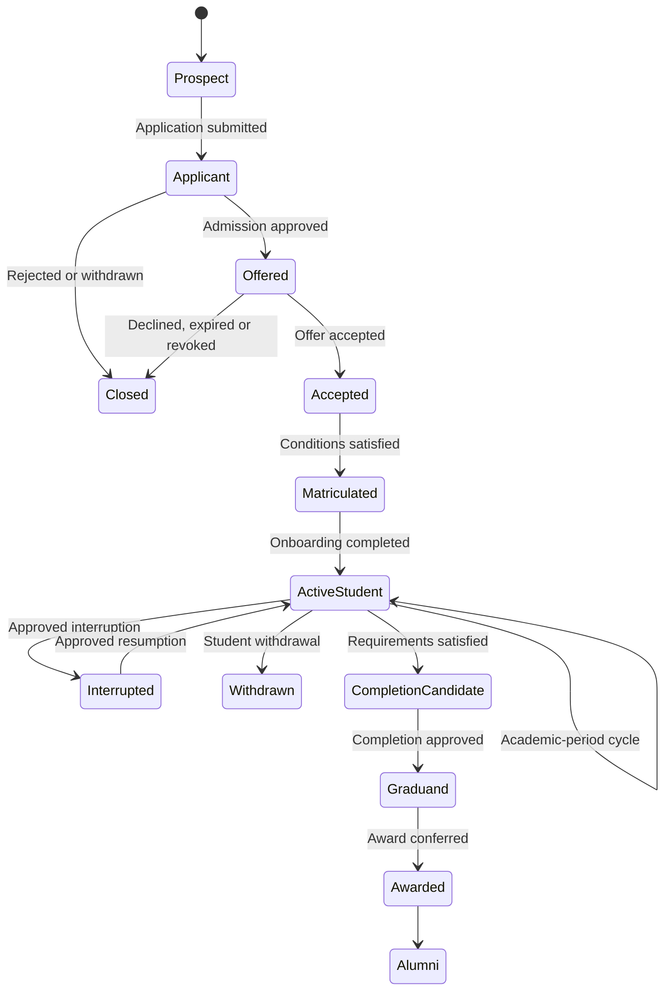

<!-- Exact assistant design message extracted from the shared conversation. -->
<!-- Message ID: 1979d441-5f37-5f31-819c-e1ff96f13f1c; chronological message: 59. -->

## Design Section 3 — Student lifecycle and principal use cases

The SIS will not represent the entire student journey with one `student_status` field. Applications, offers, programme attempts, term registrations, course registrations, research candidature and awards each have independent state machines.

This prevents invalid situations such as treating an academically suspended student as having a rejected application or treating withdrawal from one course as withdrawal from the university.

### Conceptual lifecycle



This diagram is conceptual. Each arrow is implemented through the separate controlled records described below.

### Lifecycle phases and principal use cases

| Phase | Principal use cases | Required outcome |
|---|---|---|
| Institutional setup | Configure institution, organisational units, calendars, programme catalogue, curricula, admission cycles, fee rules and workflows | Institution is ready to accept applicants |
| Prospect engagement | Create prospect account, verify contact details, browse programmes, check requirements and begin application | Verified prospect and draft application |
| Application | Select programme choices, provide qualifications, referees and documents, pay an application fee where required, declare information and submit | Immutable submitted application version |
| Admissions processing | Validate documents, request corrections, verify eligibility, score or evaluate, interview, recommend, approve, waitlist or reject | Authorised decision for each programme choice |
| Offer and acceptance | Issue offer, communicate conditions, accept/decline, upload missing evidence and verify conditions | Accepted and condition-cleared admission |
| Matriculation | Resolve duplicate identities, create academic career and programme attempt, assign curriculum and issue student identifier | Authoritative student record |
| Onboarding | Complete profile, policies, consent, orientation, identity provisioning and required documents | Onboarding checklist satisfied |
| Student finance | Assess fees, apply sponsorships/scholarships, post verified payments and calculate financial clearance | Current student-account position |
| Institutional registration | Submit registration, validate eligibility, obtain academic approval and financial clearance | Registered for an academic period |
| Course registration | Select courses, validate curriculum, prerequisites, timetable and capacity, obtain overrides and enrol | Authoritative course registrations |
| Moodle provisioning | Provision authorised users, course shells and enrolments; reconcile failures and changes | Moodle reflects eligible registrations |
| Teaching and learning | Access learning content, record permitted attendance or engagement information and manage teaching activities | Learning activity evidence |
| Assessment and examinations | Configure assessments, schedule examinations, capture marks, moderate and prepare board decisions | Validated provisional outcomes |
| Results and progression | Approve and publish official results, calculate standing and determine progression | Official academic-period decision |
| Student success | Detect risk, validate alerts, create interventions, assign actions, follow up and measure outcomes | Closed or continuing support case |
| Postgraduate research | Assign supervisors, approve proposal and ethics, monitor milestones, submit thesis, examine and complete corrections | Approved research completion |
| Interruption and withdrawal | Request, assess and approve interruption, resumption, transfer or withdrawal | Effective-dated programme status change |
| Completion and graduation | Evaluate requirements, resolve exceptions, complete clearance, approve award and confer | Official award and credential |
| Alumni services | Verify credentials, request records and maintain permitted contact information | Controlled continuing access |

### Separate lifecycle records

#### 1. Application

An application belongs to a person and an admission cycle. It may contain several ranked programme choices.

```text
DRAFT
→ SUBMITTED
→ UNDER_VALIDATION
→ UNDER_EVALUATION
→ DECISION_COMPLETE
→ CLOSED
```

Exception states:

```text
CORRECTION_REQUIRED
WITHDRAWN
CANCELLED
```

A submitted application is versioned. Applicant corrections create a new version while retaining the submitted evidence and declaration history.

Each programme choice has its own decision:

```text
PENDING
→ ELIGIBLE
→ UNDER_REVIEW
→ RECOMMENDED
→ APPROVED | WAITLISTED | REJECTED
```

An approved programme choice may generate an offer. Approval of one choice does not delete the history of other choices.

#### 2. Offer

```text
DRAFT
→ APPROVED
→ ISSUED
→ ACCEPTED | DECLINED | EXPIRED | REVOKED
```

Rules:

- Only an approved offer can be issued.
- Revocation requires authority, reason and audit evidence.
- Acceptance does not automatically mean all conditions are satisfied.
- Matriculation requires an accepted offer and clearance of mandatory conditions.

#### 3. Programme attempt

A student can have more than one programme attempt over time and, where policy permits, concurrent academic careers.

```text
ADMITTED
→ ACTIVE
→ INTERRUPTED
→ ACTIVE
→ COMPLETION_PENDING
→ COMPLETED
```

Terminal or exceptional states:

```text
WITHDRAWN
TERMINATED
TRANSFERRED
CANCELLED
```

Academic warning or probation is not stored as the programme-attempt state. It is an academic-standing decision attached to a specific period.

#### 4. Institutional registration

Institutional registration confirms that the student is eligible to study during a particular academic period.

```text
AWAITING_STUDENT_INPUT
→ AWAITING_ACADEMIC_APPROVAL
→ AWAITING_FINANCIAL_CLEARANCE
→ REGISTERED
```

Exception states:

```text
CHANGES_REQUIRED
REJECTED
CANCELLED
EXPIRED
```

Rules:

- Academic and financial clearance are independently recorded.
- A payment does not directly change registration state.
- The finance domain recalculates clearance and publishes the outcome.
- An authorised registration override records its rule, approver, reason and expiry.

#### 5. Course registration

```text
PLANNED
→ REQUESTED
→ VALIDATING
→ PENDING_APPROVAL
→ ENROLLED
```

Possible later states:

```text
DROPPED
WITHDRAWN
CANCELLED
COMPLETED
```

Validation includes:

- Active programme attempt.
- Eligible institutional-registration state.
- Curriculum applicability.
- Prerequisites and co-requisites.
- Repeated-course rules.
- Credit-load limits.
- Timetable conflicts where schedule data is available.
- Offering capacity.
- Academic and financial holds.
- Approved exemptions or overrides.

#### 6. Moodle enrolment

Moodle enrolment is an integration state, not the academic registration record.

```text
PENDING
→ PROCESSING
→ SYNCHRONISED
```

Failure and change states:

```text
RETRY_SCHEDULED
FAILED
SUSPENSION_PENDING
SUSPENDED
REMOVAL_PENDING
REMOVED
RECONCILIATION_REQUIRED
```

The SIS registration remains authoritative even if Moodle is unavailable.

#### 7. Completion and award

```text
NOT_ELIGIBLE
→ POTENTIALLY_ELIGIBLE
→ UNDER_EVALUATION
→ REQUIREMENTS_SATISFIED
→ CLEARANCE_PENDING
→ APPROVED_FOR_AWARD
→ CONFERRED
```

No transcript or certificate may represent an award as conferred before the authorised conferral event.

### Academic-period cycle

Each active student repeats the following controlled cycle:

```text
Period eligibility
→ Fee assessment
→ Institutional registration
→ Course registration
→ Moodle provisioning
→ Learning and assessment
→ Result approval
→ Progression decision
→ Next-period eligibility or completion evaluation
```

Failure at one stage creates an actionable hold, exception or work item; it must not silently move the student backwards or delete completed work.

### Global lifecycle rules

- Every state transition has an actor, timestamp, reason and correlation identifier.
- Only documented transitions are permitted.
- Backdating requires a dedicated capability and reason.
- Reversals create compensating records; they do not erase history.
- Official identifiers are unique and never reused.
- A student’s record remains continuous across transfers, interruptions and new programme attempts.
- AI may explain requirements or identify possible exceptions but cannot execute official transitions.
- Integration failure cannot alter an already approved academic decision.
- Configurable university rules determine eligibility, but the state meanings remain stable across installations.

Do you approve **Design Section 3: Student lifecycle and principal use cases**?

---

## Following user responses before the next design record

### User message 0060

yes i approve this design
