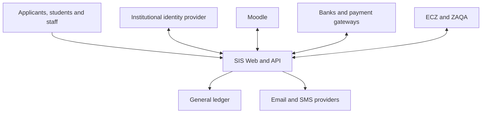

<!-- Exact assistant design message extracted from the shared conversation. -->
<!-- Message ID: 4d85b467-6808-5777-afd4-68f0380df79c; chronological message: 83. -->

## Design Section 9 — Integration architecture

The integration architecture will use adapters around the modular monolith. Domain modules never contain Moodle-, bank-, SMS- or vendor-specific logic.



### 1. Source-of-truth matrix

| Information | Authoritative source |
|---|---|
| Person and student identity | SIS |
| Authentication credentials | Institutional identity provider or SIS applicant authentication |
| SIS roles and permissions | SIS |
| Organisation, programmes and curricula | SIS |
| Course offerings and registrations | SIS |
| Moodle course-shell mapping | SIS integration registry |
| Learning content, activities and submissions | Moodle |
| Raw marks for Moodle-managed offerings | Moodle |
| Approved assessment rules | SIS |
| Moderated and official results | SIS |
| Progression and awards | SIS |
| Student charges, balances and clearance | SIS student-finance module |
| Bank or gateway transaction evidence | Bank or payment gateway |
| Institutional accounting | External general ledger |
| ECZ result confirmation | ECZ |
| Qualification evaluation | ZAQA |
| Admission decision | SIS |
| Communication content and intent | SIS |
| Email or SMS delivery status | Messaging provider |

### 2. Integration styles

| Style | Use |
|---|---|
| Synchronous API | Immediate validation, queries and commands requiring a direct response |
| Asynchronous event | Provisioning, notifications, accounting exports and other recoverable background operations |
| Authenticated webhook | Payment notifications and approved external-system events |
| Scheduled reconciliation | Detecting drift between the SIS and external systems |
| Controlled batch exchange | Legacy systems, banks or authorities without suitable APIs |
| Manual verification adapter | External portals where automated integration is unavailable |

Core academic transactions must not depend on Moodle, SMS or another external service being online.

### 3. Integration components

The integration domain contains:

- Connection registry.
- Credential and endpoint references.
- API client adapters.
- Webhook ingress.
- Transactional outbox.
- Consumer inbox.
- Background workers.
- Retry scheduler.
- Dead-letter queue.
- Mapping registry.
- Reconciliation engine.
- Integration audit log.
- Operational dashboard.

### 4. Transactional outbox

When a domain transaction succeeds, its event is written to the outbox in the same database transaction.

```text
Business record committed
+ Outbox event committed
→ Worker claims event
→ Adapter sends request
→ Response recorded
→ Delivery marked successful
```

This prevents a course registration from succeeding while its Moodle-provisioning request is accidentally lost.

### 5. Delivery guarantees

The system uses **at-least-once delivery with idempotent processing**.

It does not claim impossible end-to-end “exactly once” network delivery.

Every operation uses:

- Event identifier.
- Idempotency key.
- Source-system identifier.
- Correlation identifier.
- Causation identifier.
- Attempt number.
- Payload version.
- Created and processed timestamps.

Consumers store processed identifiers so repeated messages do not repeat business effects.

### 6. Integration-operation lifecycle

```text
PENDING
→ PROCESSING
→ SUCCEEDED
```

Failure states:

```text
RETRY_SCHEDULED
FAILED
DEAD_LETTER
MANUAL_REVIEW
CANCELLED
SUPERSEDED
```

Retries use capped exponential backoff with jitter. Validation, authentication and permanent mapping errors go directly to manual review rather than retrying indefinitely.

### 7. API standards

- HTTP APIs will be described with OpenAPI 3.1.1. [OpenAPI 3.1.1](https://spec.openapis.org/oas/v3.1.1.html)
- Machine-readable API errors will follow RFC 9457 Problem Details. [RFC 9457](https://www.rfc-editor.org/info/rfc9457/)
- Event envelopes will follow CloudEvents conventions. [CloudEvents](https://cloudevents.io/)
- Higher-education exchange models will align where practical with 1EdTech Edu-API without exposing internal database entities directly. [1EdTech Edu-API](https://standards.1edtech.org/edu-api/)

Example event name:

```text
zm.sis.registration.course-enrolled.v1
```

### 8. API contract rules

Every external API specifies:

- Authentication.
- Required capability or client scope.
- Request and response schema.
- Validation rules.
- Idempotency behaviour.
- Pagination.
- Filtering.
- Error codes.
- Rate limits.
- Audit behaviour.
- Example requests and responses.
- Version and deprecation policy.

Database tables are never treated as an integration contract.

---

## Moodle integration

### 9. Moodle connection

Each installation defines one or more Moodle connections containing:

- Base URL.
- Moodle version.
- External-service endpoint.
- LTI registration.
- Credential reference.
- Enabled capabilities.
- Role mappings.
- Category mappings.
- Synchronisation settings.
- Health status.

Secrets are stored through a protected secret-management mechanism, not directly in ordinary configuration tables.

### 10. Moodle mapping records

The SIS maintains:

```text
MoodleUserMap
MoodleCourseMap
MoodleSectionMap
MoodleRoleMap
MoodleEnrolmentMap
MoodleGradeItemMap
MoodleGradeSnapshot
MoodleSyncOperation
MoodleReconciliationRun
```

A mapping contains both SIS and Moodle identifiers. Names and course codes are not used as the sole mapping keys.

### 11. Moodle course provisioning

```text
Course offering approved
→ Moodle provisioning requested
→ Category resolved
→ Course shell created or matched
→ Stable mapping stored
→ Teaching team provisioned
→ Assessment mapping prepared
→ Reconciliation performed
```

The adapter uses Moodle’s supported External Services framework rather than writing directly to Moodle’s database. [Moodle External Services](https://moodledev.io/docs/5.0/apis/subsystems/external)

### 12. Student enrolment

```text
Institutional registration eligible
+ Course registration ENROLLED
+ Institutional identity available
= Moodle enrolment requested
```

A successful academic registration remains valid even if Moodle provisioning is pending.

The student sees:

```text
Academic registration: Complete
Moodle access: Provisioning pending
```

### 13. Registration changes

| SIS action | Moodle effect |
|---|---|
| Course registration approved | Enrol or reactivate |
| Course dropped before retention threshold | Suspend or remove according to policy |
| Course withdrawn after academic activity | Suspend while retaining required history |
| Programme interruption | Suspend applicable enrolments |
| Registration reinstated | Reactivate |
| Course offering cancelled | Suspend course access and notify affected users |

Moodle data is not destructively removed when academic or audit history must be retained.

### 14. Teaching assignments

An active teaching assignment provisions the applicable Moodle role:

- Course coordinator.
- Lecturer.
- Tutor.
- Marker.
- Moderator.

Expiry or withdrawal of the assignment removes the derived Moodle capability without deleting the person’s account.

### 15. Gradebook integration modes

Every Moodle-enabled offering selects one mode:

```text
SIS_MANAGED_GRADE_ITEMS
MAPPED_MOODLE_GRADE_ITEMS
```

#### SIS-managed grade items

- SIS provisions approved assessment components to Moodle.
- Moodle item identifiers are stored automatically.
- Lecturers enter marks into those Moodle items.
- Structural changes require SIS approval.

#### Mapped Moodle grade items

- Existing Moodle items are mapped to approved SIS components.
- Mapping requires academic validation.
- Unmapped items cannot contribute to official results.

The recommended default is `SIS_MANAGED_GRADE_ITEMS`.

### 16. Single-entry mark flow

```text
Lecturer enters mark in Moodle
→ Moodle mark retrieved once
→ Source and mapping validated
→ Provisional SIS mark staged
→ Lecturer certifies submission
→ Immutable snapshot created
→ Moderation and boards occur in SIS
→ Official result published in SIS
```

There is no ordinary re-entry of marks into the SIS.

### 17. Grade synchronisation controls

Each imported mark stores:

- Moodle instance.
- Course identifier.
- Grade-item identifier.
- Moodle user identifier.
- SIS student and registration.
- Original value.
- Moodle modification timestamp.
- Import timestamp.
- Source checksum.
- Mapping version.
- Accepted SIS value.
- Validation status.

A Moodle change after certification produces a conflict and cannot silently alter the submitted snapshot.

### 18. Moodle reconciliation

Reconciliation compares:

- Users.
- Course shells.
- Teaching assignments.
- Student enrolments.
- Grade items.
- Grade values.
- Suspensions and removals.

Detected differences are classified:

```text
MISSING_IN_MOODLE
UNEXPECTED_IN_MOODLE
ATTRIBUTE_MISMATCH
ROLE_MISMATCH
ENROLMENT_MISMATCH
GRADE_MISMATCH
MAPPING_MISSING
```

Safe differences may be repaired automatically. Grade conflicts, unexpected enrolments and identity conflicts require review.

### 19. LTI and contextual access

LTI 1.3/LTI Advantage will support secure contextual launch and role-aware access where applicable. LTI 1.3 uses the modern OAuth 2.0, JWT and OpenID Connect security model. [1EdTech LTI](https://www.1edtech.org/standards/lti)

LTI does not replace authoritative registration or the Moodle External Services provisioning adapter.

---

## Identity integration

### 20. Authentication design

- Applicants may use SIS-managed accounts before admission.
- Matriculated students receive an institutional identity.
- Staff normally authenticate through the institutional identity provider.
- SIS authorisation remains based on SIS role assignments.
- Moodle and the SIS should use the same identity provider where possible.
- Passwords are never synchronised between the SIS and Moodle.

OpenID Connect is the primary SSO protocol. [OpenID Connect Core](https://openid.net/specs/openid-connect-core-1_0.html)

### 21. Identity provisioning

Where supported, SCIM can provision institutional users and groups. SCIM is an HTTP-based standard for managing identity resources such as users and groups. [RFC 7644](https://www.rfc-editor.org/info/rfc7644/)

Where SCIM is unavailable, a provider-specific adapter implements the same internal port.

### 22. Identity-linking rules

- External subject identifiers are stored per identity provider.
- Email is not used as the permanent identity link.
- Account-link conflicts require human resolution.
- Disabling authentication does not delete academic history.
- Local emergency accounts are separately controlled and audited.

---

## Financial integrations

### 23. Payment gateway and bank flow

```text
Payment reference generated
→ Student pays through provider
→ Authenticated notification received
→ Signature and replay checks
→ Transaction staged
→ Duplicate detection
→ Payment verified
→ Student ledger posted
→ Allocation applied
→ Financial clearance recalculated
→ Bank reconciliation
```

A notification alone does not prove settlement if the provider requires later verification or reconciliation.

### 24. Payment controls

- Provider transaction identifiers are unique.
- Callback signatures are validated.
- Replay attempts are rejected.
- Amount and currency are verified.
- Overpayments enter the configured allocation or refund process.
- Unmatched payments enter a work queue.
- Manual payment posting requires evidence and segregation of duties.

### 25. General-ledger integration

The SIS exports approved journal batches and receives:

```text
ACCEPTED
PARTIALLY_ACCEPTED
REJECTED
ACKNOWLEDGEMENT_MISSING
```

A rejected general-ledger export does not remove the corresponding student-account transaction. It creates a reconciliation issue.

---

## Qualification and communication integrations

### 26. ECZ and ZAQA

The system supports adapter contracts for:

- ECZ result confirmation.
- ZAQA qualification verification.
- ZAQA foreign-qualification evaluation.
- Verification-status checks.
- Reference and certificate retrieval where permitted.

If automated access is unavailable, the same workflow supports manual portal verification and evidence capture. The system must not scrape protected portals.

### 27. Email and SMS

```text
Communication requested
→ Template rendered
→ Recipient and consent validated
→ Provider submission
→ Delivery receipt
→ Delivered | Failed | Expired
```

Messages use versioned templates. Sensitive counselling, discipline or detailed financial information is not included in ordinary SMS.

### 28. Document storage

Uploaded documents pass through:

```text
Upload
→ File-type validation
→ Malware scanning
→ Checksum
→ Encrypted storage
→ Metadata registration
→ Access-policy assignment
```

External links use short-lived signed access tokens. Public object URLs are prohibited for applicant, student, examination and counselling documents.

### 29. Security requirements

External integrations require:

- TLS.
- Least-privilege service accounts.
- Credential rotation.
- Secret redaction from logs.
- Signed or authenticated webhooks.
- Replay protection.
- Request timeouts.
- Rate limiting.
- Input validation.
- Egress restrictions where practical.
- Full correlation and audit identifiers.

### 30. Integration observability

The operational dashboard shows:

- Connection health.
- Pending and failed operations.
- Retry counts.
- Dead-letter items.
- Moodle drift.
- Unmatched payments.
- Expiring credentials.
- API latency and error rate.
- Last successful reconciliation.
- Data awaiting manual verification.

### 31. Testing

Every adapter must provide:

- Contract tests.
- Sandbox or test configuration.
- Deterministic fake implementation.
- Failure and timeout tests.
- Duplicate-delivery tests.
- Retry tests.
- Schema compatibility tests.
- Reconciliation tests.
- No-production-data test fixtures.

Do you approve **Design Section 9: Integration architecture**?

---

## Following user responses before the next design record

### User message 0084

yes approve the design integration
