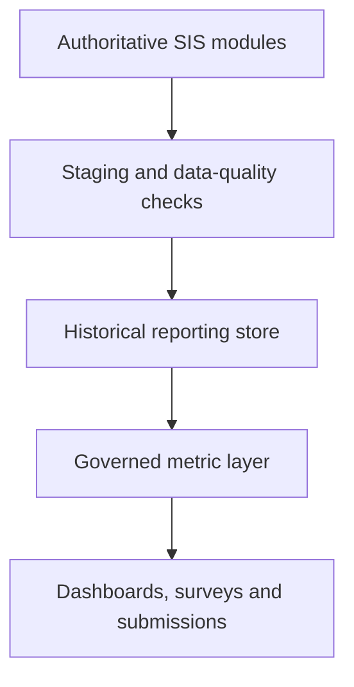

<!-- Exact assistant design message extracted from the shared conversation. -->
<!-- Message ID: 024f6ce5-09fb-5768-a480-29232eb84288; chronological message: 90. -->

Section 10 is approved and locked.

## Design Section 11 — Quality assurance, regulatory reporting, analytics and responsible AI

UNZA’s Quality Assurance Directorate is responsible for programme accreditation, qualification registration, programme and course reviews, continuous improvement, tracer studies, student feedback and Student Evaluation of Teaching. Its public description says SET is mandatory and conducted near the end of each teaching period. [UNZA Quality Assurance Directorate](https://www.unza.zm/qad)

The design will therefore treat quality assurance as an operational lifecycle supported by verified evidence—not merely a collection of dashboards.

### 1. Selected reporting architecture

| Approach | Assessment |
|---|---|
| Run every report directly against the operational database | Simple initially, but large reports can disrupt registration and results processing |
| Build a large independent enterprise warehouse immediately | Powerful but excessive for the first implementation and difficult to reconcile |
| Operational read models plus a staged analytical warehouse | **Selected:** supports daily work, reproducible official reports and later advanced analytics |

The architecture will be introduced progressively. The final-year implementation can prove the reporting pattern without building every future data mart.

### 2. Reporting objectives

Every institutional report must answer:

```text
What question does this report answer?
Who owns its definition?
Which source records were used?
What period or cohort is covered?
Which rules were applied?
When was the data refreshed?
Was it validated and approved?
Can the result be reproduced?
What action should follow?
```

A dashboard without metric definitions, ownership and source lineage is not considered an official reporting feature.

### 3. Reporting layers

| Layer | Purpose | Freshness |
|---|---|---|
| Operational | Work queues, missing marks, pending applications, integration failures | Real or near-real time |
| Management | Enrolment, progression, finance, workload and service performance | Scheduled refresh |
| Quality assurance | Programme performance, SET, moderation, reviews and improvement plans | Periodic and review-cycle based |
| Regulatory | HEA, ZAQA and approved professional-body submissions | Frozen and authorised snapshot |
| Strategic | Trends, forecasting and institutional planning | Historical warehouse |
| Public | Approved, aggregated institutional information | Publication schedule |

An operational dashboard is not automatically an authorised regulatory report.

### 4. Analytical data flow



The reporting store is read-only from the user’s perspective. Corrections must be made through the authoritative operational module and then propagated again.

### 5. Reporting source-of-truth rules

- Admissions remains authoritative for application and admission facts.
- Academic records remains authoritative for programme attempts, registrations, results and awards.
- Finance remains authoritative for charges, payments and financial clearance.
- Moodle remains authoritative for learning activity and raw Moodle-managed marks.
- Human-resource or staff records remain authoritative for staff appointments and qualifications.
- Quality Assurance owns approved quality definitions, review evidence and submitted quality reports.
- The analytical warehouse stores historical copies and calculated measures but does not become the source of official transactions.

A report cannot correct a student’s result, programme status or payment.

### 6. Historical analytical model

The analytical model supports dimensions such as:

```text
Academic period
Census date
Campus
School
Department
Programme
Curriculum edition
Course
Course offering
Delivery mode
Student cohort
Admission route
Qualification level
Sponsorship category
```

Example analytical facts include:

```text
Application
Admission offer
Enrolment
Course registration
Assessment result
Progression decision
Award
Payment
Research milestone
Student-support intervention
Survey response
Quality finding
```

Organisation, programme and curriculum dimensions retain effective history. A report for 2024 must use the organisational and curriculum structures effective in 2024 rather than today’s renamed structures.

### 7. Metric registry

Every governed measure contains:

- Stable metric code.
- Plain-language name.
- Purpose.
- Owner.
- Numerator.
- Denominator.
- Inclusion and exclusion rules.
- Time period.
- Cohort logic.
- Source fields.
- Treatment of missing data.
- Breakdown dimensions.
- Privacy restrictions.
- Version and effective dates.
- Validation tests.
- Approval status.

Example:

```text
Metric: FIRST_YEAR_RETENTION_RATE
Numerator: Eligible first-year students continuing into the next defined period
Denominator: Approved entering cohort
Exclusions: Deceased students and institution-approved exclusions
Version: 2027.1
Owner: Academic Affairs
```

Terms such as “dropout,” “completion,” “active student” and “graduate” cannot be defined differently by separate dashboards without explicit versions.

### 8. Census dates and cohort freezing

Official reporting uses institution-approved census dates.

```text
OPEN_COLLECTION
→ PRELIMINARY_CENSUS
→ DATA_VALIDATION
→ CENSUS_FROZEN
→ REPORT_APPROVED
→ SUBMITTED
```

Transactions posted after the census remain valid operationally but do not silently rewrite an already submitted report. They enter a subsequent period or an authorised amendment.

### 9. Report catalogue

Every standard report records:

- Report code and title.
- Business owner.
- Intended audience.
- Fields and filters.
- Metric versions.
- Source datasets.
- Refresh schedule.
- Data classification.
- Required approvals.
- Permitted export formats.
- Retention rule.
- Regulatory deadline where applicable.
- Previous submitted versions.

Ad hoc reports may be created, but they are labelled as exploratory until their definitions and validation are approved.

### 10. Official report lifecycle

```text
DRAFT
→ DATA_VALIDATION
→ OWNER_REVIEW
→ QUALITY_ASSURANCE_REVIEW
→ AUTHORISED
→ SUBMITTED_OR_PUBLISHED
→ ACKNOWLEDGED
```

Alternative states include:

```text
CHANGES_REQUIRED
REJECTED_BY_RECIPIENT
AMENDMENT_REQUIRED
WITHDRAWN
SUPERSEDED
```

A resubmission preserves the original report, rejection details, correction reason and replacement version.

### 11. Data-quality framework

Checks include:

- Completeness.
- Valid values.
- Uniqueness.
- Referential integrity.
- Cross-module consistency.
- Timeliness.
- Duplicate identities.
- Unmapped programmes or courses.
- Impossible dates.
- Accreditation-status conflicts.
- Unexpected changes from prior periods.
- Reconciliation with submitted totals.

A quality issue records:

```text
Issue type
Affected records
Source module
Severity
Detected rule
Responsible data owner
Correction status
Resolution evidence
```

### 12. Data-quality workflow

```text
DETECTED
→ TRIAGED
→ ASSIGNED
→ SOURCE_CORRECTION
→ REVALIDATED
→ RESOLVED
```

Possible outcomes include:

```text
FALSE_POSITIVE
ACCEPTED_WITH_EXPLANATION
DEFERRED_WITH_OWNER
ESCALATED
```

Reporting staff cannot patch warehouse figures merely to make totals balance.

### 13. Certified reporting snapshots

Every official snapshot stores:

- Exact source-cut time.
- Query and metric versions.
- Included record identifiers.
- Row counts and control totals.
- Validation results.
- Approver.
- Output checksum.
- Submission reference.
- Recipient acknowledgement.

The same snapshot can therefore be reproduced for an auditor without relying on the current operational database state.

---

## Zambian regulatory and quality-assurance reporting

### 14. HEA national student indexing

In March 2026, HEA announced that students in higher-education institutions would be indexed in a central national database, with each student receiving an index number. [HEA national student-indexing announcement](https://hea.org.zm/hea-moves-to-index-all-students-in-historic-reform/)

The SIS will therefore reserve a configurable `NationalEducationIdentifier` rather than assuming that the university student number is sufficient.

The mapping records:

```text
Internal person identifier
Internal student number
HEA index number
Submission batch
Submitted identity attributes
Matching outcome
HEA response
Effective date
Verification status
```

Possible states include:

```text
NOT_SUBMITTED
→ READY_FOR_SUBMISSION
→ SUBMITTED
→ MATCHED_EXISTING | NEW_INDEX_ASSIGNED
→ VERIFIED
```

Exceptions include:

```text
DUPLICATE_CANDIDATE
IDENTITY_MISMATCH
REJECTED
MANUAL_REVIEW
```

The national index does not replace the internal institutional identifier, and an external mismatch cannot silently alter the student’s legal identity.

The exact data fields and API or file format remain adapter configuration until HEA publishes or supplies the applicable technical contract.

### 15. HEA annual institutional self-assessment

The current HEA audit tool requires annual institutional self-assessment supported by records such as enrolments, graduates, institutional policies, quality-assurance implementation, research and consultancy information and other governance evidence. [HEA institutional audit tool](https://hea.org.zm/wp-content/uploads/2024/02/AUDIT-TOOL-FOR-HIGHER-EDUCATION-INSTITUTIONS.pdf)

The system supports:

```text
Audit cycle
Applicable standard version
Criterion
Performance indicator
Institutional finding
Self-assessment score
Strength
Weakness
Recommendation
Supporting evidence
Responsible unit
Approver
```

The current tool’s scoring structure is imported as a versioned regulatory template rather than permanently coded into the application.

### 16. Audit and compliance calendar

The compliance calendar tracks:

- Annual HEA audit and self-assessment.
- Institutional and learning-programme audit fees.
- Programme accreditation expiry.
- ZAQA qualification-registration status.
- Professional-body accreditation.
- Curriculum-review due dates.
- Fire, health or other institutional certificates where relevant.
- Regulatory submissions.
- Required improvement reports.
- Scheduled external visits.

HEA’s 2026 notice confirms that public and private HEIs are subject to annual institutional audit requirements. [HEA 2026 institutional audit notice](https://hea.org.zm/payment-of-2026-annual-institutional-audit-fee-by-31st-march-2026/)

Deadlines are configurable because regulations and regulatory calendars may change.

### 17. Quality-evidence repository

Evidence is stored as governed records rather than loose folders.

Each item contains:

- Evidence title and type.
- Responsible office.
- Applicable standard and criterion.
- Institution, campus, programme or course scope.
- Effective period.
- Confidentiality classification.
- Document version.
- Approving authority.
- Verification status.
- Expiry date.
- Previous and replacement versions.
- Regulatory submissions in which it was used.

One approved item may support several audit criteria without creating uncontrolled duplicate files.

### 18. Accreditation and qualification register

The register distinguishes:

```text
Institutional recognition
HEA learning-programme accreditation
ZAQA qualification registration
Professional-body accreditation
Internal Senate approval
```

These are related but not interchangeable.

A programme record captures:

- Accrediting authority.
- Application reference.
- Programme and curriculum edition.
- Campus and delivery mode covered.
- Approved student capacity where applicable.
- Effective and expiry dates.
- Conditions.
- Certificates and decision letters.
- Review or renewal date.
- Responsible officer.
- Evidence submitted.
- Current status.

ZAQA evaluates qualification details such as delivery mode, duration, entry requirements, aims, assessment, learning outcomes and trainer or assessor qualifications before placement on the Zambia Qualifications Framework. [ZAQA institutional services](https://www.zaqa.gov.zm/institutions/)

### 19. Accreditation status controls

```text
INTERNAL_DEVELOPMENT
→ INTERNALLY_APPROVED
→ SUBMISSION_PREPARATION
→ SUBMITTED
→ UNDER_REVIEW
→ ACCREDITED
→ ACTIVE
→ RENEWAL_DUE
```

Alternative outcomes include:

```text
CHANGES_REQUIRED
CONDITIONALLY_ACCREDITED
REJECTED
SUSPENDED
EXPIRED
WITHDRAWN
```

The system warns before expiry and can prevent a new intake where policy requires. It must not automatically abandon existing students. Expiry or withdrawal triggers an authorised teach-out, transfer or other student-protection plan.

### 20. Programme accreditation evidence

The evidence package can include:

- Programme rationale and needs assessment.
- Stakeholder consultation.
- Aims and learning outcomes.
- ZQF-level alignment.
- Curriculum and course descriptions.
- Teaching and learning plan.
- Assessment policy.
- Staffing and qualifications.
- Staff workload.
- Facilities and learning support.
- Internal quality assurance.
- Financial resources.
- Academic regulations.
- Recognition of prior learning.
- Delivery-mode evidence.

These categories reflect HEA’s published learning-programme accreditation template. [HEA programme accreditation template](https://hea.org.zm/wp-content/uploads/2021/12/Template-for-Submission-of-Learning-Programmes-for-Accreditation-1.pdf)

### 21. Periodic programme review

Every active programme receives a review plan derived from institutional and regulatory policy.

The review data pack contains:

- Application and enrolment trends.
- Student capacity and actual intake.
- Retention and progression.
- Failure, repetition and withdrawal patterns.
- Completion and time-to-completion.
- Graduate outcomes.
- Course and programme learning outcomes.
- SET results.
- External-examiner and moderation findings.
- Appeals and complaints.
- Academic staff qualifications and workload.
- Infrastructure and learning resources.
- Research and industry engagement.
- Accreditation conditions.
- Professional-body feedback.
- Employer and alumni input.

Workflow:

```text
REVIEW_DUE
→ SELF_EVALUATION
→ EVIDENCE_COLLECTION
→ STAKEHOLDER_REVIEW
→ ACADEMIC_REVIEW
→ QUALITY_ASSURANCE_REVIEW
→ DECISION
→ IMPROVEMENT_PLAN
```

Possible decisions include:

```text
CONTINUE
REVISE
SUSPEND_NEW_INTAKE
TEACH_OUT
REPLACE
CLOSE
```

Programme closure remains an authorised academic decision, not an analytical recommendation.

### 22. Quality findings and improvement actions

A finding may originate from:

- Internal review.
- HEA or ZAQA audit.
- Professional accreditation.
- External examiner.
- Student feedback.
- Graduate tracer study.
- Academic board.
- Data-quality monitoring.
- Service complaint.
- Risk review.

```text
FINDING_RECORDED
→ VALIDATED
→ ACTION_PLAN_APPROVED
→ IMPLEMENTATION
→ EVIDENCE_SUBMITTED
→ EFFECTIVENESS_REVIEW
→ CLOSED
```

Every action has an owner, due date, expected outcome and evidence. Uploading a policy document alone does not prove that the improvement was effective.

---

## Student feedback and graduate outcomes

### 23. Student Evaluation of Teaching

SET is configured by academic period, course offering and teaching assignment.

Controls include:

- Only eligible enrolled students participate.
- Completion status is stored separately from answers.
- Lecturers cannot identify individual respondents.
- Results are withheld from teaching staff until the configured assessment point has passed.
- Small response groups are suppressed or combined.
- Free-text responses are protected from unnecessary disclosure.
- Response rate is shown with every result.
- Staff can respond and record an improvement action.
- SET results are never the sole basis for staff discipline or promotion.

For the UNZA profile, SET is enabled as a mandatory end-of-period quality task. The SIS does not withhold an official academic result merely because SET is incomplete unless an approved institutional policy explicitly authorises that consequence and provides a review route.

### 24. Survey design

The survey module supports:

- Versioned questionnaires.
- Target cohort.
- Eligibility rules.
- Consent and privacy notice.
- Anonymous, pseudonymous or identified mode.
- Distribution channels.
- Reminders.
- Branching questions.
- Multilingual text.
- Response window.
- Response-rate monitoring.
- Data-quality checks.
- Analysis plan.
- Publication approval.

Survey questions cannot be changed after launch without creating a new instrument version.

### 25. Graduate tracer studies

Graduate follow-up may capture:

- Employment status.
- Time to first employment.
- Employment sector.
- Relationship between employment and qualification.
- Further study.
- Self-employment or entrepreneurship.
- Skills used.
- Skills gaps.
- Career satisfaction.
- Employer feedback.
- Career-support experience.

HEA’s National Graduate Survey is explicitly intended to study employment, skills relevance, programme-to-work relationships, funding and career satisfaction for evidence-based higher-education improvement. [HEA National Graduate Survey](https://hea.org.zm/nationalgraduatesurvey/about/)

Alumni communication preferences are respected, and graduate contact information is not automatically transferred to unrelated marketing.

---

## Dashboards, privacy and AI

### 26. Governed institutional indicators

Supported indicator families include:

- Application demand and conversion.
- Applicant demographics where lawful.
- Enrolment and national student indexing.
- Student-to-staff ratios.
- Course load and lecturer workload.
- Retention and progression.
- Assessment performance.
- Repeats and carry courses.
- Completion and graduation.
- Time to completion.
- Research candidature progress.
- Financial clearance.
- Student-support demand and outcomes.
- Moodle participation.
- Programme accreditation.
- SET and survey response.
- Graduate employment and skills alignment.
- Integration and data-quality performance.

No single dashboard presents every indicator to every role.

### 27. Role-specific dashboards

| Role | Typical view |
|---|---|
| Lecturer | Assigned offerings, assessment completion and authorised SET aggregates |
| Academic adviser | Assigned students, curriculum progress and support actions |
| Head of Department | Course delivery, staffing, results and programme indicators |
| Dean | School-level programme, quality and workload trends |
| Quality Assurance | Accreditation, audit evidence, findings and programme reviews |
| Registrar/Academic Affairs | Admissions, registration, progression, results and awards |
| Finance | Student-account, sponsorship and clearance indicators |
| Student Affairs | Aggregated service and case-workload information |
| CICT | Data pipelines, integrations, jobs and system health |
| Executive management | Approved institutional strategic indicators |
| Regulator-facing officer | Certified submission packages and acknowledgements |

A summary value may allow drill-down only when the user is also authorised to view the underlying records.

### 28. Privacy-preserving analytics

Controls include:

- Minimum necessary attributes.
- Aggregation.
- Pseudonymised analytical identifiers.
- Small-cell suppression.
- Restricted demographic combinations.
- Separate identified and de-identified zones.
- Controlled research extracts.
- Purpose-bound access.
- Export auditing.
- Approved retention periods.

A user must not be able to identify a counselling client, disability case or disciplinary subject by filtering several small categories.

### 29. Spreadsheet and export governance

Exports record:

- Requester.
- Purpose.
- Report and metric version.
- Filters used.
- Row count.
- Classification.
- Authoriser where required.
- Download time.
- Expiry.
- File checksum.

Downloaded spreadsheets are labelled as extracts and do not become authoritative databases. Changes made in Excel cannot be uploaded directly as official corrections without passing the source module’s validation and approval workflow.

### 30. AI use-case register

Every analytical or generative AI feature requires:

- Approved purpose.
- Responsible owner.
- Data categories.
- Model or provider.
- Hosting location.
- Privacy assessment.
- Validation evidence.
- Known limitations.
- Human reviewer.
- Output-retention rule.
- Monitoring measures.
- Review and expiry dates.
- Disable or rollback procedure.

### 31. Permitted AI assistance

AI may assist with:

- Drafting narrative summaries of approved indicators.
- Matching evidence to audit criteria.
- Finding potentially missing evidence.
- Detecting unusual data-quality patterns.
- Suggesting questions for programme reviewers.
- Comparing learning outcomes to approved frameworks.
- Summarising anonymised survey themes.
- Explaining a governed metric in plain language.
- Identifying potentially outdated curriculum topics for human review.

Every output must identify its source data and remain subject to human confirmation.

### 32. Prohibited AI decisions

AI may not:

- Accredit or reject a programme.
- Submit a regulatory report without authorisation.
- Invent missing evidence.
- Rank lecturers solely from SET responses.
- close a quality finding.
- change official statistics.
- determine staff discipline.
- remove a student from a programme.
- infer a sensitive attribute for reporting.
- present a prediction as an observed fact.
- train an external model on identifiable institutional data without approval.

This directly aligns with HEA’s current position that AI may help identify gaps and summarise evidence but must not replace reviewers, approve programmes or remove institutional accountability. [HEA responsible-AI quality assurance guidance](https://hea.org.zm/ai-must-assist-not-replace-quality-assurance-judgement/)

### 33. Natural-language reporting

An authorised user may ask questions such as:

> How many first-year students in the School of Engineering remained active into the next academic year?

The assistant queries only the governed semantic layer. It returns:

- Metric definition.
- Period.
- Filters.
- Data freshness.
- Result.
- Permitted breakdown.
- Limitations.
- Link to the certified source report.

It cannot execute unrestricted queries against the production database.

### 34. Predictive analytics separation

Observed and predicted values remain clearly separated.

```text
Observed enrolment: 2,430
Forecast enrolment: 2,610
Forecast confidence and assumptions: displayed separately
```

A forecast never overwrites an approved institutional target or official count.

Predictive models require:

- Holdout validation.
- Error measures.
- Population definition.
- Bias and subgroup analysis.
- Drift monitoring.
- Versioning.
- Human interpretation.
- Retirement criteria.

### 35. Pipeline and report failures

If a reporting pipeline fails:

- The last certified report remains available.
- It is clearly labelled with its original data date.
- The dashboard shows that refresh failed.
- No partial refresh is presented as complete.
- The failure enters an operational work queue.
- Regulatory deadlines escalate to the responsible role.
- Recovery and reconciliation are recorded.

### 36. Verification and testing

The reporting domain requires:

- Metric unit tests.
- Known-answer datasets.
- Source-to-report reconciliation.
- Duplicate and missing-data tests.
- Historical-dimension tests.
- Snapshot reproducibility tests.
- Authorisation tests.
- Small-cell suppression tests.
- Survey-anonymity tests.
- Regulatory-template validation.
- Pipeline failure and restart tests.
- AI factuality and access-boundary evaluation.
- Comparison of report totals with previous submitted periods.

Do you approve **Design Section 11: Quality assurance, regulatory reporting, analytics and responsible AI**?

---

## Following user responses before the next design record

### User message 0091

yes i approve this design
