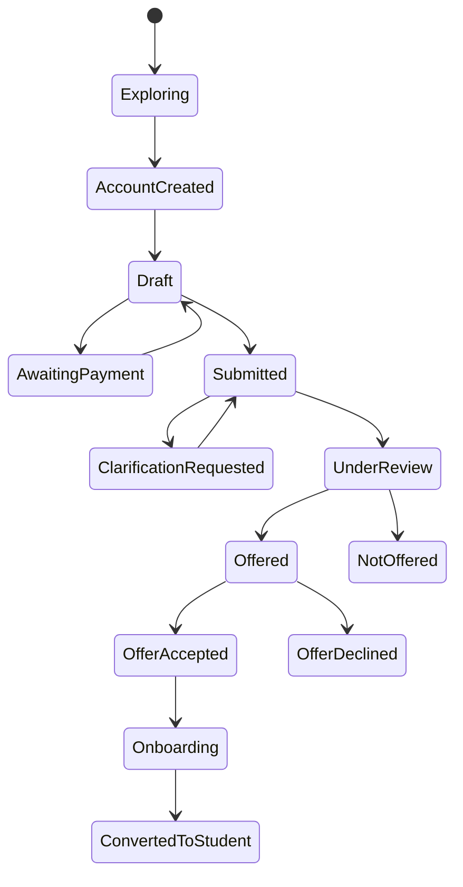

<!-- Exact assistant design message extracted from the shared conversation. -->
<!-- Message ID: 0d89f8f2-e614-5c14-8a4f-2e3b9319aca1; chronological message: 111. -->

# Role Blueprint 1 — Prospective Applicant and Applicant  
## Part 1: Role, scope and application lifecycle

This blueprint covers a person from first exploring programmes through application submission, a decision, offer acceptance and handover into student onboarding.

It does not yet cover enrolled-student actions such as registration, results or finance clearance. Those belong to the Student Blueprint.

---

## 1. Role definitions

### 1.1 Prospective applicant

A prospective applicant is a visitor who has not created an account or started an application.

Their purpose is to understand:

- Available programmes and intakes
- Entry requirements
- Fees and application deadlines
- Required supporting documents
- Whether they are likely eligible
- How to begin an application

They may browse public information without authentication. They cannot submit, reserve a place, upload evidence, view another person’s application or receive a formal admission decision.

### 1.2 Applicant

An applicant is a person with an authenticated account who has started, submitted, or received a decision on an application.

They may:

- Maintain their own profile and contact details
- Start or resume an application for a permitted intake
- Save drafts
- Submit evidence
- Pay an application fee where required
- Submit an application
- Respond to an authorized request for clarification
- View their own status history and decision
- Accept or decline an offer
- Begin onboarding after accepting an offer

They may not:

- Change submitted facts after the permitted correction deadline
- Edit a decision, eligibility outcome or staff-only notes
- See internal verification notes, staff recommendations, scoring rules or other applicants’ information
- Submit an application on behalf of another person, unless a separately designed authorized-agent process exists
- Create duplicate applications for the same programme/intake where policy prohibits it

### 1.3 Applicant account is not a student account

The system must distinguish:

| Concept | Meaning |
|---|---|
| Person identity | The real person, retained across journeys |
| Applicant account | Login credentials and applicant-facing permissions |
| Application | A specific request for admission to a programme, intake and study mode |
| Admission offer | An authorized decision on an application |
| Student record | An official academic record created only after approved conversion/onboarding |

An application is not automatically a student record. An offer is not automatically registration. This prevents premature creation of academic records, billing obligations or Moodle access.

---

## 2. Applicant lifecycle

The system uses explicit states. It must never show a vague state such as only `Pending`.

Some steps are conditional. For example, `AwaitingPayment` appears only when an application fee applies, and `ClarificationRequested` appears only when an authorized officer requests more information.

### 2.1 Applicant-facing status language

| System state | Applicant sees | Required explanation |
|---|---|---|
| Draft | Application not submitted | What remains incomplete and the deadline |
| Awaiting payment | Payment required before submission | Amount, reference, due date and payment instructions |
| Submitted | Received; initial checks may follow | Submission time, reference number and next expected stage |
| Clarification requested | More information needed | Exact item requested, why it is needed, who can see it and response deadline |
| Under review | Application is being assessed | Review stage, last update, whether applicant action is needed and expected decision period where defined |
| Offered | Admission offer available | Programme, conditions, acceptance deadline and next actions |
| Not offered | Admission decision available | Decision explanation allowed by policy, support/contact route and permitted next options |
| Offer accepted | Offer accepted; onboarding required | Remaining onboarding tasks and deadline |
| Onboarding | Preparing student record | Completed and remaining onboarding actions |
| Converted to student | Onboarding completed | Student number, first registration task and student-portal entry point |

Internal staff states may be more detailed, but public wording must be clear, accurate and non-technical.

---

## 3. Experience context and workspace

### 3.1 Public experience

The public area provides a calm, searchable admissions space with these primary navigation items:

- Find a programme
- Entry requirements
- Intakes and deadlines
- Fees and funding information
- How to apply
- Help and contact
- Sign in / Create account

The public area must not force account creation merely to read requirements.

### 3.2 Applicant workspace

After sign-in, the applicant sees:

- Home
- My applications
- My tasks
- Payments
- Notifications
- Help and support
- Profile and security

The header always shows:

> Applicant portal · [Selected intake] · [Last saved / connection state]

If an applicant has multiple applications that policy allows, the selected application is visibly named in the header and page title. Actions must never silently affect a different application.

### 3.3 Applicant home page

The applicant home page answers:

1. What should I do next?
2. What deadline matters most?
3. What has changed in my application?
4. Where can I continue safely?

It contains, in priority order:

- **Required action card** — for example, “Upload certified ECZ result statement”
- **Application progress** — current stage and completed steps
- **Deadline panel** — application, payment, clarification or offer deadlines
- **Application status timeline** — clear history with dates and times
- **Payment status** — only where payment applies
- **Help route** — relevant office, ticket history and reference number
- **Notifications** — decisions, requests and delivery outcomes

Decorative dashboards, institution-wide statistics and unrelated news must not displace an applicant’s required actions.

---

## 4. Identity, access and scope rules

### 4.1 Account creation does not prove eligibility or identity

Creating an account proves only that the person has completed the configured account-verification steps. It does not prove:

- Eligibility for a programme
- Authenticity of qualifications
- Citizenship, residency or sponsorship status
- The correctness of an NRC, passport or examination number
- Admission entitlement

Those claims require their own validation and, where required, authorized human verification.

### 4.2 Scope rule

An applicant may access only:

- Their own account
- Their own applications
- Their own submitted documents
- Their own payment references and receipts
- Their own communications and support tickets

Every request uses the authenticated person identity plus the selected application identifier. The system must not accept a browser-supplied application ID without checking ownership.

### 4.3 Shared-device protection

On an applicant portal:

- Sessions expire after a configured period of inactivity.
- The user receives a warning before expiry.
- Unsaved valid form data is preserved as a draft where safe.
- Sensitive pages mask identifiers where full display is unnecessary.
- Logout is always visible.
- Browser back-navigation must not reveal a prior applicant’s data after logout.
- Public computers must not be remembered as trusted devices.

---

## 5. Domain architecture contract

### 5.1 Core entities

| Entity | Purpose |
|---|---|
| Person | Canonical identity record for the individual |
| Applicant account | Authentication and communication-verification state |
| Intake | Approved admissions period, dates, rules and capacity configuration |
| Programme offering | Programme available for a particular intake, mode and campus |
| Application | Applicant’s admission request |
| Application section | Completeness and version state for each form section |
| Evidence item | A declared qualification, identity or supporting item |
| Document submission | Secure file, metadata, malware-scan status and verification outcome |
| Payment obligation | Required application fee or waiver decision |
| Payment transaction | Received payment and reconciliation state |
| Admissions decision | Authorized outcome, reason category and decision date |
| Offer | Offer terms, acceptance deadline and conditions |
| Applicant task | Action required from the applicant |
| Communication | In-app message, email/SMS delivery state and template |
| Audit event | Immutable record of a material action |

### 5.2 Key invariants

The system must enforce these rules:

- Only a configured open intake can accept a new application.
- An applicant cannot submit until all mandatory sections are valid.
- A required payment must be reconciled or an approved waiver recorded before submission, unless the intake rule explicitly permits otherwise.
- Submitted application data is versioned and protected from direct silent editing.
- Any authorized post-submission correction creates an audit trail showing old and new values, requester, approver and reason.
- Each final application submission receives a unique, human-readable reference number.
- An offer can be accepted only once, before expiry and by the applicant who received it.
- Student-record creation occurs only through the approved offer-acceptance/onboarding workflow.
- Staff-facing internal notes and applicant-facing explanations are separate fields with separate visibility rules.

### 5.3 Commands and events introduced in this blueprint

| Command | Main result |
|---|---|
| `CreateApplicantAccount` | Creates account in a verification-required state |
| `VerifyApplicantContactMethod` | Records verified phone or email channel |
| `StartApplication` | Creates a draft application for an eligible open intake |
| `SaveApplicationDraft` | Saves versioned, validated draft information |
| `SubmitApplication` | Locks the submitted version and begins admissions workflow |
| `RequestApplicationClarification` | Creates an applicant task and controlled reopening |
| `RespondToClarificationRequest` | Submits requested response/evidence |
| `RecordOfferResponse` | Accepts or declines a valid offer |
| `BeginApplicantOnboarding` | Creates controlled onboarding tasks after acceptance |
| `ConvertApplicantToStudent` | Creates the student record after all approval conditions are met |

Representative resulting events:

- `ApplicantAccountCreated`
- `ApplicantContactVerified`
- `ApplicationStarted`
- `ApplicationDraftSaved`
- `ApplicationSubmitted`
- `ApplicationClarificationRequested`
- `ApplicantClarificationSubmitted`
- `AdmissionOfferMade`
- `OfferAccepted`
- `OfferDeclined`
- `ApplicantOnboardingStarted`
- `ApplicantConvertedToStudent`

All commands require authorization, input validation, idempotency protection where retries are possible, audit logging and reliable event publication.

---

## 6. Part 1 acceptance tests

Part 1 is accepted when:

- A visitor can browse programmes and requirements without creating an account.
- An applicant can see only their own applications and records.
- Every application status includes a reason, next step and last-update time.
- An applicant never becomes a student solely by creating an account, submitting an application or receiving an offer.
- A submitted application cannot be silently changed.
- Deadlines use the configured Zambia time zone and show the time where relevant.
- Session expiry protects data without unnecessarily losing a valid draft.
- Offer acceptance is blocked after expiry, duplicate response or identity mismatch.
- The visible workspace always makes the active application and intake clear.
- Commands, events, state changes and audit records can be traced in automated tests.

**Please approve Part 1: Role, scope and application lifecycle.** After approval, I will produce Part 2: **public programme discovery and eligibility guidance**, including search, comparison, eligibility pre-check, edge cases and its UI microinteractions.

---

## Following user responses before the next design record

### User message 0112

approved please proceed
