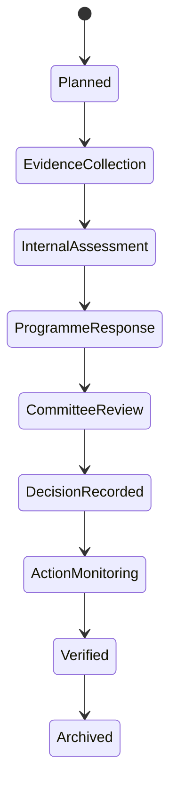

<!-- Exact assistant design message extracted from the shared conversation. -->
<!-- Message ID: dd4f110c-9b57-5aeb-a49d-c3a888edb4f3; chronological message: 207. -->

# Role Blueprint 11, Part 3 — Programme review, accreditation, committees and regulatory submission

## 11.42 Programme review is a governed lifecycle

A programme review is not a form upload. It examines a defined programme against a versioned institutional, professional-body or regulatory framework.

It may be:

- Scheduled annual review
- Periodic comprehensive review
- New-programme proposal review
- Curriculum-change review
- Accreditation readiness review
- Regulator-requested review
- Follow-up review after conditions or findings

Each review uses the applicable framework version, programme version, cohort scope and effective dates. A framework can change without rewriting the system.

## 11.43 Programme-review workspace

The QAO starts at:

> **Programme reviews → 2026 cycle**

A review card states:

> **BSc Computer Science — Annual review**  
> Framework: Institutional Programme Review 2026 v2  
> Evidence: 12 of 16 items accepted  
> Findings: 2 active  
> Committee: School Quality Committee, 18 September  
> `Open review`

The page has these tabs:

- Overview
- Review framework
- Evidence plan
- Programme response
- Criteria assessments
- Findings and actions
- Committee package
- Decision and follow-up
- History and archive

The QAO sees evidence and indicators for the selected programme, not unrestricted school-wide records.

## 11.44 Action QAO-PRG-08 — Start a programme review

The QAO selects:

> **Programme reviews → Create review**

The system pre-fills only approved configuration:

- Programme identity and curriculum version
- Academic year/review cycle
- Review type
- Applicable framework versions
- Required authorities
- Required evidence catalogue
- Previous review and active findings

The QAO confirms:

- Review reason
- Scope: programme, delivery site, modes, cohort or course range
- Review lead
- Programme response owner
- Internal reviewers
- Required independent reviewer
- Committee route
- Key dates
- Conflict declarations

### Programme-response owner experience

The Programme Coordinator or Head of Department receives:

> **Programme review assigned**  
> BSc Computer Science · 2026 annual review  
> Your role: provide programme response and required evidence.  
> Evidence deadline: 3 September  
> Committee date: 18 September  
> `Open programme review`

They can submit evidence and responses, but cannot certify their own review.

## 11.45 Framework-to-evidence mapping

For every framework criterion, the system displays:

| Criterion | Required evidence | Status | Responsible owner | Assessment |
|---|---|---|---|---|
| Programme purpose and outcomes | Approved specification, outcome map | Submitted | Programme Coordinator | Awaiting assessment |
| Curriculum delivery | Course and teaching plan summary | Accepted | Head of Department | Partly sufficient |
| Assessment quality | Moderation and External Examiner evidence | Gap identified | Examinations Officer | Finding proposed |
| Student outcomes | Certified continuation/progression metrics | Accepted | Metric Owner | Sufficient |
| Resources and staffing | Approved staff profile/facility evidence | Awaiting response | School Administrator | Not assessed |

The framework page explains each criterion in plain language and links to the exact evidence—not an opaque compliance percentage.

## 11.46 Programme self-evaluation experience

The programme response owner completes a structured self-evaluation.

For each criterion, they state:

- Current practice
- Evidence reference
- Strengths
- Known gap or risk
- Action already in progress
- Required institutional support
- Whether the criterion is not applicable and why

A self-evaluation cannot claim compliance by selecting a box without linked evidence.

Before submitting, the owner confirms:

> This response is accurate to the best of my knowledge and identifies material gaps known to the programme team.

The QAO sees the self-evaluation alongside independently sourced evidence and previous-review actions.

## 11.47 Programme-review assessment

The QAO and assigned reviewers assess one criterion at a time.

For each criterion, the reviewer sees:

- Framework wording and version
- Programme self-evaluation
- Submitted evidence
- Certified indicator links
- Previous findings and actions
- External-review evidence, where present
- Reviewer assessment and rationale
- Required follow-up

Available assessment outcomes:

- Meets criterion
- Partly meets criterion
- Does not meet criterion
- Evidence insufficient
- Not applicable—approved rationale required
- Requires external/committee decision

A reviewer cannot select `Meets criterion` where a mandatory evidence item is missing unless an authorized exception is recorded.

## 11.48 Accreditation readiness and external frameworks

An accreditation review uses an **Accreditation Framework Profile**, configured with:

- Accrediting body or regulator
- Applicable qualification/programme types
- Framework version
- Submission format
- Evidence requirements
- Required signatories
- Submission deadline
- Confidentiality classification
- External-reviewer access rules
- Condition/recommendation vocabulary
- Renewal cycle

The system must support different accreditation bodies without embedding their criteria in application code.

### Accreditation readiness view

The QAO sees:

> **Accreditation readiness — BSc Computer Science**  
> Submission deadline: 15 October 2026  
> 22 required evidence items  
> 17 accepted · 3 awaiting clarification · 2 gaps  
> `Open readiness plan`

This view identifies preparation needs. It does not claim the programme is accredited.

## 11.49 External reviewer experience

An External Reviewer receives a restricted guest workspace.

Header:

> **External Review workspace · BSc Computer Science · Accreditation 2026**

They can see only:

- Assigned programme and review scope
- Applicable framework and submission deadline
- Selected evidence items
- Required review questions
- Secure document viewer
- Their own comments and report draft
- Contact route for procedural support

They can:

- Review assigned evidence
- Request clarification through the QAO
- Record observation, recommendation or concern
- Submit their review report
- Confirm conflicts of interest

They cannot:

- Browse other programmes
- View unrelated students, staff, finance, support or disciplinary information
- Alter SIS records
- Close findings
- Submit the institution’s regulatory return
- Download evidence beyond configured permission

All external access expires automatically at the end of the assignment.

## 11.50 Committee package preparation

A committee package is a frozen, versioned decision package—not live changing data.

The QAO selects:

> **Committee package → Generate draft package**

The system verifies:

- Required criteria have assessment outcomes
- Evidence versions are fixed
- Active findings and action status are included
- Conflict declarations are complete
- Required external reviews are received or explicitly noted
- Certified metric snapshots exist
- Unresolved data-quality limitations are visible
- Committee authority and meeting date are valid

The QAO chooses included sections:

- Executive summary
- Programme scope and framework
- Self-evaluation
- Criterion assessments
- Evidence index
- Findings and recommended actions
- External-review report
- Data-quality limitations
- Decision options
- Previous decision/action follow-up
- Required sign-offs

The package gets:

- Package identifier
- Version
- Generated timestamp
- Source snapshot references
- Integrity checksum
- Classification
- Expiry/access rule

## 11.51 Committee-member experience

A committee member enters from:

> **My meetings → Programme Review Committee → Review package**

They see:

- Meeting agenda
- Their declared role and voting authority
- Conflict-of-interest action
- Package summary
- Evidence index
- Decision items
- Draft recommendations
- Meeting notes and actions, depending on authority

Before access, the system requires a conflict declaration:

- No conflict
- Conflict declared—abstain
- Conflict declared—leave specified agenda item
- Conflict requires chair review

A conflicted member cannot cast a decision for that item.

### Committee decision action

For each decision item, authorized members can record:

- Approve recommended conclusion
- Return for clarification
- Approve with conditions
- Require corrective action
- Refer to another authority
- Defer decision with reason

The chair or authorized secretary records the formal outcome and meeting reference. Individual members cannot later edit approved minutes.

## 11.52 Regulatory submission workflow

A regulatory report is an official submission, not an exported spreadsheet sent by email without control.

The Regulatory Reporting User starts from:

> **Regulatory reporting → Create submission**

They select:

- Regulator/body
- Report type and template version
- Reporting period
- Institution/programme scope
- Required metrics and evidence
- Submission deadline
- Required signatories
- Delivery method

The system assembles a draft from certified metrics and approved evidence only.

Every field shows:

- Source report/metric version
- Data date
- Definition
- Filter/scope
- Validation status
- Responsible owner
- Limitation, if any

A user cannot type over a certified result without creating a controlled explanatory note and obtaining the required approval.

## 11.53 Submission validation and authorization

Before submission, the system validates:

- Required fields and template version
- Certified metric status
- Arithmetic consistency
- Required evidence and attachments
- Approval chain
- Signatory authority
- Submission deadline
- Duplicate submission risk
- Export classification
- Final file checksum

The final review page states:

> **Ready for authorized submission**  
> Report: Annual Higher-Education Return  
> Period: 2026  
> Required approvals: 3 of 3 completed  
> Data snapshot: REG-2026-0041  
> `Submit to regulator`

After the action, the system records:

- Submitted by
- Authority used
- Submission time
- Delivery method
- Regulator acknowledgement/reference
- Final checksum
- Exact submitted package version

If delivery fails:

> Submission package is approved but delivery could not be confirmed. Do not submit again yet. The system is checking the regulator response.

Idempotency prevents duplicate statutory submissions.

## 11.54 Conditions, recommendations and post-submission actions

When a regulator or accrediting body returns a condition, recommendation or request for clarification, the QAO creates a controlled response case.

It includes:

- External reference
- Requirement wording
- Deadline
- Affected scope
- Evidence required
- Response owner
- Approval route
- Submission method
- Related internal finding/actions

The regulator’s wording is retained as source evidence. Internal users may summarize it, but cannot rewrite its meaning.

## 11.55 Commands, events and audit

| Command | Authorized role |
|---|---|
| `StartProgrammeReview` | QAO |
| `SubmitProgrammeSelfEvaluation` | Assigned Programme Owner |
| `AssessProgrammeCriterion` | Assigned reviewer |
| `AssignExternalReviewer` | QAO / configured authority |
| `SubmitExternalReviewReport` | Assigned External Reviewer |
| `GenerateQualityCommitteePackage` | QAO |
| `RecordCommitteeQualityDecision` | Chair/authorized secretary |
| `CreateRegulatorySubmission` | Regulatory Reporting User |
| `ApproveRegulatorySubmission` | Configured signatory |
| `SubmitRegulatoryReturn` | Authorized submission role |

Representative events:

- `ProgrammeReviewStarted`
- `ProgrammeSelfEvaluationSubmitted`
- `ProgrammeCriterionAssessed`
- `ExternalReviewerAssigned`
- `ExternalReviewReportSubmitted`
- `QualityCommitteePackageFrozen`
- `QualityCommitteeDecisionRecorded`
- `RegulatorySubmissionPrepared`
- `RegulatorySubmissionApproved`
- `RegulatorySubmissionDelivered`
- `RegulatoryResponseReceived`

All evidence views, downloads, comments, votes, sign-offs, exports and submissions are auditable.

## 11.56 Accessibility, failure and recovery

- Committee package navigation is keyboard accessible and works with screen readers.
- Every finding and decision status uses text, not colour alone.
- External reviewers can use accessible documents and request an alternative format.
- A draft self-evaluation or review report is autosaved.
- A late evidence submission remains possible only if policy allows and is visibly marked late.
- A changed criterion/framework version creates a review-impact task; it does not silently alter the active review.
- If package generation fails, the prior package remains available with its original date and version.
- If a committee member’s authority expires during the meeting, their decision is blocked and logged.
- If a regulatory delivery acknowledgement is delayed, status remains `Delivery confirmation pending`, not `Submitted successfully`.

## 11.57 Part 3 acceptance requirements

Part 3 is accepted only when:

- Programme reviews use versioned frameworks, programme scope and evidence mapping.
- Programme owners submit self-evaluation but cannot independently certify compliance.
- External reviewers receive narrow, time-limited access.
- Committee packages are frozen, versioned and reproducible.
- Conflicted committee members cannot decide affected matters.
- Regulatory reports draw from certified metrics and approved evidence only.
- Official submissions enforce approval chain, checksum, delivery confirmation and duplicate protection.
- Regulatory conditions become controlled internal response cases.
- No programme becomes “accredited” merely because a readiness checklist is complete.
- Every decision, evidence access, export and submission remains auditable.

Please approve **Role Blueprint 11, Part 3**. Part 4 will then cover the full **Executive Leadership experience**: strategic planning, institutional risk, interventions, resource decisions, decision meetings, outcome monitoring and accountable follow-through.

---

## Following user responses before the next design record

### User message 0208

Yes we may proceed
