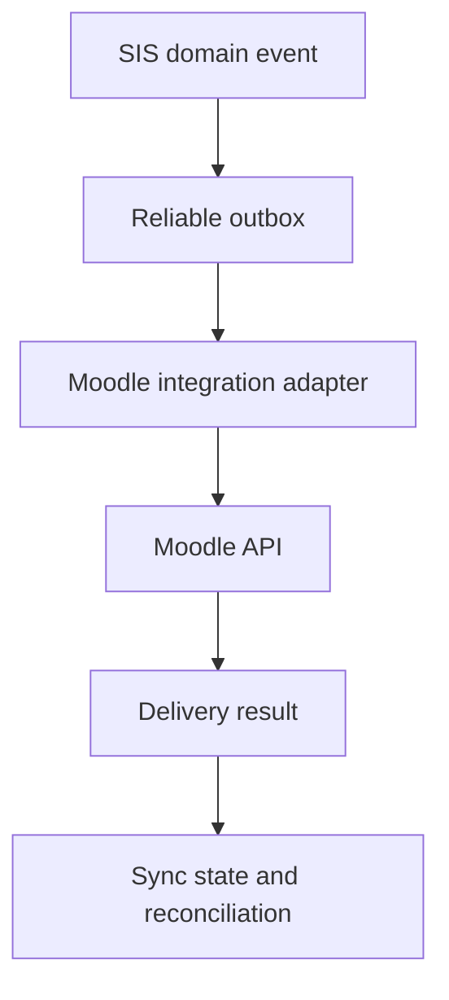

<!-- Exact assistant design message extracted from the shared conversation. -->
<!-- Message ID: 2eeeb28a-2fa0-5a28-bbfe-7e94919bdb58; chronological message: 219. -->

# Role Blueprint 12, Part 2 — Moodle Administrator: real SIS–Moodle learning integration

## 12.15 Integration boundary: who owns what

The SIS and Moodle remain separate systems with a controlled synchronization contract.

| Information/process | Authoritative system | Moodle role |
|---|---|---|
| Person and login identity | SIS/approved Identity Provider | Uses federated identity |
| Programme and official course registration | SIS | Receives approved enrolment |
| Official class list | SIS | Receives synchronized course participants |
| Course shell | SIS creates/authorizes offering; Moodle hosts learning space | Hosts teaching content and activity |
| Teaching assignment | SIS | Receives teaching role assignment |
| Tutorial Group (TG) membership | SIS by default | Receives group membership; may propose allowed local groups |
| Learning materials and activities | Moodle | Authoritative |
| Quiz/assignment activity and submission status | Moodle | Authoritative learning evidence |
| Official Continuous Assessment (CA) and final result | SIS | Moodle provides governed grade data for staging only |
| Official result release/progression | SIS | Cannot release or determine |

Moodle must never directly overwrite an official SIS mark, registration, progression outcome, or student record.

---

## 12.16 Moodle Administrator workspace

Header:

> **Moodle Administration workspace · Production learning environment**

Navigation:

- Sync health
- Course-shell queue
- Enrolment and role queue
- Tutorial Group queue
- Assessment mapping
- Grade-transfer staging
- Reconciliation cases
- Manual exception requests
- Moodle availability and maintenance
- Archive and retention
- Integration configuration

The home page answers:

1. Which students or staff are waiting for Moodle access?
2. Which course shells failed to create or update?
3. Which TG memberships are out of sync?
4. Which grade transfers require validation?
5. Which data mismatch could affect teaching or learning?
6. Which failure needs an incident, retry or domain-owner decision?

Example:

> **Course access delayed**  
> CSC 4792 · Semester 2, 2026  
> 14 newly registered students awaiting Moodle enrolment  
> Last sync attempt: 8 minutes ago  
> Official registration remains valid in SIS.  
> `Open reconciliation case`

## 12.17 Integration architecture

The integration uses reliable domain events, an outbox and an adapter. Moodle is never called directly from an academic-registration screen.

Examples of SIS events:

- `CourseOfferingPublished`
- `TeachingAssignmentConfirmed`
- `StudentAcademicRegistrationConfirmed`
- `StudentAcademicRegistrationCancelled`
- `TutorialGroupAssignmentChanged`
- `StudentIdentityUpdated`
- `CourseOfferingClosed`

The Moodle Adapter translates each event into Moodle-specific API calls. Moodle-specific failures never alter the underlying SIS event or official registration.

## 12.18 Core synchronization records

The system stores:

- `MoodleConnection`
- `MoodleCourseMapping`
- `MoodleUserMapping`
- `MoodleRoleMapping`
- `MoodleTutorialGroupMapping`
- `MoodleAssessmentMapping`
- `MoodleSyncOperation`
- `MoodleSyncCheckpoint`
- `MoodleReconciliationCase`
- `MoodleGradeTransferBatch`

Each record contains external identifiers, mapping/version information, last confirmed synchronization time, state, retry history and error classification.

A staff member does not fix a mismatch by editing an external identifier directly in production. They use a controlled mapping-correction case.

---

# Action MOD-SHL-01 — Create and manage a Moodle course shell

## 12.19 Trigger and preconditions

A course shell is created only after the SIS has an approved academic course offering.

Required SIS facts:

- Course offering exists
- Academic period is active
- Course title/code/version is valid
- Owning department/programme is assigned
- Teaching workspace owner is identified
- Moodle publication policy allows creation
- No conflicting active Moodle mapping exists

The event is:

> `CourseOfferingPublished`

## 12.20 Course-shell queue experience

The Moodle Administrator opens:

> **Course-shell queue → Awaiting creation**

A queue card shows:

> **CSC 4792 — Data Mining and Warehousing**  
> Semester 2, 2026 · 118 registered students  
> Lead lecturer: assigned  
> Shell state: awaiting Moodle creation  
> `Review shell`

The Administrator sees SIS facts and proposed Moodle mapping:

- Official course code/title
- Academic period
- Course offering identifier
- Department/programme scope
- Requested Moodle course category
- Publication/visibility date
- Teaching role assignments
- Expected participant count
- Existing historical shell, if any

They do not manually type a new course title unless an approved mapping rule or correction authorizes it.

## 12.21 Shell creation interaction

The primary action is normally automated. Where manual confirmation is configured, the Administrator selects:

> `Create Moodle shell`

The system performs:

1. Idempotency check against `CourseOfferingId + AcademicPeriod`.
2. Create or identify mapped Moodle category.
3. Create shell using approved template.
4. Apply course short name, full name and dates.
5. Apply controlled visibility state.
6. Create baseline Moodle roles and groups.
7. Store Moodle course identifier and mapping version.
8. Queue teaching/enrolment synchronization.
9. Run verification query.
10. Update sync state.

Confirmation:

> Moodle shell created and verified. Teaching staff and registered students will be synchronized next.

A shell can be:

- Planned
- Created—hidden
- Created—visible
- Creation failed
- Update required
- Closing
- Archived
- Retention hold

The Administrator cannot make an archived historical shell the active shell for a new offering without approved mapping and academic-owner confirmation.

## 12.22 Shell failure and recovery

| Situation | Required behaviour |
|---|---|
| Moodle API timeout | Mark `confirmation pending`; query before retrying |
| Duplicate Moodle course found | Open mapping-review case; do not create another shell |
| Invalid course template | Block creation; route to approved template configuration owner |
| Missing academic owner | Keep shell pending; request teaching-assignment correction |
| Course title changed in SIS | Synchronize permitted metadata; preserve Moodle teaching content |
| Course offering cancelled | Hide/close shell according to policy; preserve required learning records |
| Moodle is unavailable | Queue operation; SIS registration remains authoritative |
| Template has unapproved grade settings | Block publication; alert Moodle Administrator and academic configuration owner |

---

# Action MOD-ENR-02 — Synchronize students and teaching staff

## 12.23 Student enrolment workflow

A confirmed SIS academic registration produces:

> `StudentAcademicRegistrationConfirmed`

The integration first validates:

- Student has an active institutional identity
- Identity mapping exists or can be provisioned
- Moodle shell mapping exists
- Student registration is active
- Registration is within synchronization window
- No configured academic/disciplinary restriction blocks Moodle access
- No duplicate active enrolment mapping exists

The integration then:

1. Creates/updates Moodle user account through approved identity method.
2. Enrols student in the mapped course shell.
3. Applies student role.
4. Applies required Tutorial Group membership.
5. Records operation outcome.
6. Performs a verification check.
7. Updates SIS-facing learning-access status.

Student portal result:

> **Moodle access: active**  
> CSC 4792 was added to your learning area at 14:32.

If the operation is delayed:

> **Moodle access is being prepared**  
> Your official course registration is complete. Do not register again. We are restoring learning access.

## 12.24 Teaching-staff synchronization

A confirmed teaching assignment produces:

> `TeachingAssignmentConfirmed`

The Moodle role mapping is configured, for example:

| SIS teaching assignment | Moodle role |
|---|---|
| Lead Lecturer | Teacher |
| Lecturer | Teacher or configured equivalent |
| Tutor with quiz authority | Non-editing Teacher plus approved quiz capability, or configured restricted role |
| Tutor without quiz authority | Tutor/support role |
| External Examiner | Restricted reviewer role, if approved |
| Teaching Assistant | Configured limited role |

A Tutor may assign or administer quizzes only when:

- They have an approved course/TG teaching assignment.
- Quiz authority is explicitly granted.
- The Moodle role mapping includes only the approved capability.
- The authority is within effective dates.
- Their actions remain audit logged.

The Moodle Administrator cannot casually give a tutor broad course-editing power because “they help with the class.”

## 12.25 De-enrolment and access change

When registration is cancelled, suspended or changed, the SIS sends a domain event. Moodle access changes according to approved policy.

Possible outcomes:

- Remove from active course
- Suspend access while retaining record
- Move to historical/auditor role
- Retain access until a configured academic deadline
- Keep assessment evidence but prevent new submissions

The integration must preserve learning evidence where retention/policy requires it. It must not erase a student’s Moodle submissions because a registration was corrected.

## 12.26 Tutorial Group (TG) synchronization

A Tutorial Group is a managed academic grouping, not an informal Moodle group.

The SIS is authoritative for:

- TG identity
- Course offering
- Membership
- Tutor assignment
- Capacity, where configured
- Effective period

Example:

> **TG-CSC4792-04**  
> Tutor: M. Phiri  
> Members: 28 of 30  
> Effective: Semester 2, 2026

When membership changes, the event is:

> `TutorialGroupAssignmentChanged`

The adapter creates or updates the mapped Moodle group and membership.

Moodle may support teaching-only local grouping where policy permits, but it must be visibly labelled:

> Local Moodle group — not an official Tutorial Group

It cannot alter the SIS official TG assignment.

---

# Action MOD-GRD-03 — Governed Moodle assessment and grade transfer

## 12.27 Assessment mapping is mandatory

A Moodle quiz, assignment or activity does not automatically become an official CA component.

Before grade transfer, an authorized academic owner configures an assessment mapping:

- SIS course offering
- Moodle course shell
- Moodle activity
- Official assessment component
- Weight/maximum mark
- Eligibility rules
- Due date
- Grade scale/version
- Responsible lecturer/coordinator
- Moderation requirement
- Transfer schedule
- Whether manual review is mandatory

The Moodle Administrator manages the integration configuration; the academic owner approves the academic mapping.

Example:

> Moodle activity: Quiz 2  
> SIS component: Continuous Assessment Quiz 2  
> Maximum: 20  
> Transfer: staged for lecturer review  
> Official use: CA component only after approval

## 12.28 Grade-transfer staging queue

The Moodle Administrator opens:

> **Grade-transfer staging → Awaiting validation**

A batch card states:

> **CSC 4792 — Quiz 2**  
> 118 expected participants · 112 grade records received  
> 4 no-submission outcomes · 2 mapping exceptions  
> Mapping: CA-QUIZ2-v1  
> `Review transfer batch`

The system displays:

- Moodle activity and grade item
- Assessment mapping version
- Expected official class list
- Received grades
- Missing/no-submission status
- Exemptions/deferred status from SIS where permitted
- Out-of-range values
- Duplicates
- Moodle activity completion timestamp
- Data freshness
- Transfer checksum

The Moodle Administrator can resolve integration/mapping errors. They cannot certify grades as official or decide a student’s absence/eligibility.

## 12.29 Lecturer and Examinations handoff

After technical validation, the batch becomes:

> `Ready for academic review`

The responsible Lecturer or Course Coordinator sees:

> Moodle grade transfer ready for review  
> Quiz 2 · 112 grades imported  
> No submissions: 4  
> Technical mapping checks passed  
> `Review grade transfer`

Only the authorized academic workflow can approve grade data into the SIS assessment record. Moodle remains the learning source; SIS becomes official only after governed academic approval.

## 12.30 Grade-transfer failures

| Situation | Behaviour |
|---|---|
| Moodle activity deleted after mapping | Block transfer; create mapping exception |
| Grade scale differs from approved component | Block transfer; require academic mapping correction |
| Student appears in Moodle but not official SIS list | Do not create official grade; flag discrepancy |
| Registered student missing from Moodle | Create enrolment reconciliation task |
| Moodle grade changed after approved transfer | Create change-detection event; never overwrite official CA automatically |
| Lecturer attempts unofficial direct export | Mark as extract only; it cannot update official SIS marks |
| Duplicate Moodle grade event | Detect by activity/user/version; retain one staged record |
| Moodle unavailable during transfer | Preserve last confirmed batch; retry through queue |
| Assessment mapping expires | Stop new transfer and require authorized renewal |

---

# Action MOD-REC-04 — Reconcile SIS and Moodle differences

## 12.31 Reconciliation queue

The Moodle Administrator sees separate cases:

- SIS registration exists, Moodle enrolment missing
- Moodle enrolment exists, SIS registration inactive
- Staff role mismatch
- TG membership mismatch
- Course-shell metadata mismatch
- Assessment mapping mismatch
- Grade-transfer discrepancy
- Identity mapping conflict
- Historical course/archive issue

A case includes:

- SIS and Moodle facts side by side
- Last confirmed synchronization time
- Source events
- Retry history
- Current impact
- Safe recommended action
- Required domain owner, if any

Example:

> **Student enrolled in Moodle but not currently registered in SIS**  
> SIS status: registration cancelled 24 August  
> Moodle status: active student role  
> Impact: course access should be reviewed  
> `Suspend Moodle access` · `Request registration review`

The Administrator must not choose “make SIS registration active” from this screen.

## 12.32 Reconciliation action rules

| Difference | Moodle Administrator may do | Must route to |
|---|---|---|
| SIS student registration missing in Moodle | Retry/provision Moodle enrolment | Registration if source registration is unclear |
| Moodle-only participant | Suspend Moodle role under policy | Registration/records for academic source decision |
| Tutor has wrong Moodle capability | Correct approved role mapping | Teaching-assignment owner if authority unclear |
| TG mismatch | Retry SIS-authoritative group update | Programme/department if official TG data needs correction |
| Moodle activity no longer mapped | Disable transfer and preserve records | Academic owner for new mapping |
| Moodle grade differs after SIS approval | Record discrepancy and alert | Lecturer/Examinations controlled amendment workflow |
| Identity collision | Pause sync and protect both accounts | Identity & Access Administrator |

## 12.33 Moodle availability and maintenance

The Moodle Administrator can schedule maintenance only through approved operational change controls.

Student-facing message:

> Moodle will be unavailable from 22:00 to 23:00 for planned maintenance. Your official SIS registration and records are unaffected. Please save work before the maintenance period.

For unplanned outage:

> Moodle is temporarily unavailable. Your official registration remains valid. We are restoring access; do not submit duplicate registration requests.

The system records whether assessment deadlines require an academic-owner decision. The Moodle Administrator cannot unilaterally extend assessment deadlines or change grades.

## 12.34 Archive and end-of-period workflow

At course end, the Moodle Administrator receives a closure queue:

- Grades awaiting approved transfer
- Active assessment attempts
- Required course export/archive
- Teaching-content retention state
- Student access policy
- Legal/appeal holds
- New-period shell relationship

The closure process:

1. Confirm official grade-transfer window/status.
2. Preserve Moodle activity/submission evidence according to policy.
3. Apply student-access end-date policy.
4. Archive course shell and mappings.
5. Retain required audit/export references.
6. Block accidental reuse as new-period shell.
7. Confirm archive integrity.

Historical Moodle data remains linked to the original course offering and period.

## 12.35 Moodle commands, events and audit

### Commands

| Command | Authorized role |
|---|---|
| `CreateMoodleCourseShell` | Moodle integration workflow / Moodle Administrator |
| `SynchronizeMoodleEnrolment` | Integration workflow |
| `SynchronizeMoodleTeachingRole` | Integration workflow |
| `SynchronizeMoodleTutorialGroup` | Integration workflow |
| `ApproveMoodleAssessmentMapping` | Authorized academic owner |
| `StageMoodleGradeTransfer` | Integration workflow |
| `ResolveMoodleReconciliationCase` | Moodle Administrator |
| `ArchiveMoodleCourseShell` | Moodle Administrator under policy |
| `ScheduleMoodleMaintenance` | Moodle Administrator via approved change |

### Events

- `MoodleCourseShellCreated`
- `MoodleEnrolmentSynchronized`
- `MoodleTeachingRoleSynchronized`
- `MoodleTutorialGroupSynchronized`
- `MoodleGradeTransferStaged`
- `MoodleGradeDiscrepancyDetected`
- `MoodleReconciliationRequired`
- `MoodleCourseArchiveCompleted`
- `MoodleIntegrationHealthDegraded`

Audit captures:

- Source SIS event
- Moodle API request/result reference
- Mapping version
- Acting user or service identity
- Before/after synchronization state
- Retry and reconciliation action
- Any manual override request
- Grade-transfer batch checksum
- Access/export/archive operation

## 12.36 Accessibility, mobile and low-bandwidth requirements

- Students can reach learning content from the SIS portal through a clear **Learning area** link, but the integration is real—not merely the link.
- The student portal shows readable Moodle access/sync state.
- Staff queues work on low-bandwidth browsers with pagination and server-side filtering.
- All manual reconciliation actions support keyboard operation and text status.
- Sync progress and failures are announced to screen readers.
- Errors explain the affected course/process and safe next action.
- No student is asked to repeat academic registration because Moodle access is delayed.

## 12.37 Part 2 acceptance requirements

Part 2 is accepted only when:

- SIS remains authoritative for identity, official registration, staff assignment, official Tutorial Groups and official results.
- Moodle has real synchronized shells, enrolments, staff roles and TG membership.
- A tutor’s quiz authority is explicit, scoped and time-bound.
- Moodle assessment data requires an approved mapping and staged academic review before becoming official.
- Moodle cannot overwrite official CA, final results, progression or registration.
- Sync operations are idempotent, monitored, retryable and reconcilable.
- SIS/Moodle mismatches are handled through controlled cases, not manual source-record edits.
- Moodle outages do not falsely change official academic status.
- Historical course materials, submissions and mappings are retained and archived under policy.
- Every mapping, sync, transfer, reconciliation, exception and archive action is auditable.

Please approve **Role Blueprint 12, Part 2**. Part 3 will complete the operational blueprint with the **Integration-support Officer**: payment, identity, ECZ/ZAQA/evidence, notification, reporting and other integration monitoring, retries, reconciliation, data correction boundaries and incident recovery.

---

## Following user responses before the next design record

### User message 0220

We may proceed
